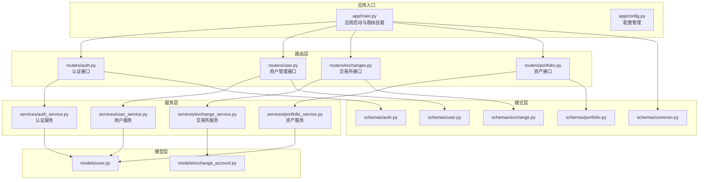
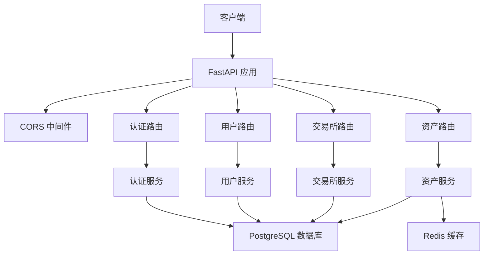
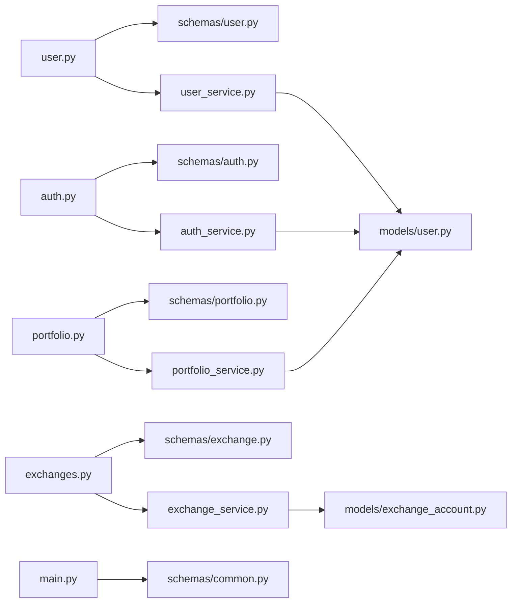

# API接口文档

<cite>
**本文档引用的文件**
- [backend/app/main.py](file://backend/app/main.py)
- [backend/app/config.py](file://backend/app/config.py)
- [backend/app/routers/auth.py](file://backend/app/routers/auth.py)
- [backend/app/routers/user.py](file://backend/app/routers/user.py)
- [backend/app/routers/exchanges.py](file://backend/app/routers/exchanges.py)
- [backend/app/routers/portfolio.py](file://backend/app/routers/portfolio.py)
- [backend/app/services/auth_service.py](file://backend/app/services/auth_service.py)
- [backend/app/utils/exceptions.py](file://backend/app/utils/exceptions.py)
- [backend/app/schemas/auth.py](file://backend/app/schemas/auth.py)
- [backend/app/schemas/user.py](file://backend/app/schemas/user.py)
- [backend/app/schemas/exchange.py](file://backend/app/schemas/exchange.py)
- [backend/app/schemas/portfolio.py](file://backend/app/schemas/portfolio.py)
- [backend/app/schemas/common.py](file://backend/app/schemas/common.py)
- [backend/app/models/user.py](file://backend/app/models/user.py)
- [backend/app/models/exchange_account.py](file://backend/app/models/exchange_account.py)
</cite>

## 目录
1. [简介](#简介)
2. [项目结构](#项目结构)
3. [核心组件](#核心组件)
4. [架构总览](#架构总览)
5. [详细组件分析](#详细组件分析)
6. [依赖关系分析](#依赖关系分析)
7. [性能考虑](#性能考虑)
8. [故障排除指南](#故障排除指南)
9. [结论](#结论)
10. [附录](#附录)

## 简介
本项目是一个多交易所加密货币投资组合跟踪平台的后端API服务，基于FastAPI构建，采用异步数据库访问与统一响应包装，提供认证、用户管理、交易所连接与资产汇总等核心功能。API通过JWT进行认证，支持邮箱注册登录以及Google/Apple OAuth两种第三方登录方式，并提供统一的响应结构与错误码。

## 项目结构
后端采用模块化组织，按功能划分为路由层、服务层、模型层与模式层（Pydantic），并通过依赖注入实现清晰的职责分离。

图表来源
- [backend/app/main.py:94-100](file://backend/app/main.py#L94-L100)
- [backend/app/routers/auth.py:22](file://backend/app/routers/auth.py#L22)
- [backend/app/routers/user.py:19](file://backend/app/routers/user.py#L19)
- [backend/app/routers/exchanges.py:20](file://backend/app/routers/exchanges.py#L20)
- [backend/app/routers/portfolio.py:26](file://backend/app/routers/portfolio.py#L26)

章节来源
- [backend/app/main.py:94-100](file://backend/app/main.py#L94-L100)
- [backend/app/config.py:5-51](file://backend/app/config.py#L5-L51)

## 核心组件
- 应用入口与中间件：负责CORS配置、全局异常处理、路由挂载与健康检查。
- 路由器：按功能划分的API端点集合，统一前缀为/api/v1。
- 服务层：封装业务逻辑，处理数据访问与外部服务交互。
- 模式层：Pydantic模型用于请求/响应校验与序列化。
- 模型层：SQLAlchemy ORM模型，定义数据库表结构与关系。
- 配置：集中管理应用配置，包括JWT密钥、数据库连接、CORS与加密密钥等。

章节来源
- [backend/app/main.py:34-42](file://backend/app/main.py#L34-L42)
- [backend/app/config.py:5-51](file://backend/app/config.py#L5-L51)

## 架构总览
系统采用前后端分离架构，前端通过HTTP调用后端API，后端通过服务层聚合数据并返回统一响应结构。认证通过JWT实现，支持刷新令牌与令牌撤销。

图表来源
- [backend/app/main.py:44-62](file://backend/app/main.py#L44-L62)
- [backend/app/main.py:94-100](file://backend/app/main.py#L94-L100)
- [backend/app/config.py:11-16](file://backend/app/config.py#L11-L16)

## 详细组件分析

### 认证接口 (/api/v1/auth)
提供用户注册、登录、令牌刷新、当前用户信息查询、登出与第三方OAuth登录等功能。

- 统一响应结构
  - 成功响应：包含success、data、message字段
  - 错误响应：包含success、message、error_code、details字段
- JWT配置
  - 算法：HS256
  - 访问令牌过期：30分钟
  - 刷新令牌过期：7天
  - 密钥管理：开发环境默认密钥，生产需通过环境变量设置

接口定义
- POST /api/v1/auth/register
  - 功能：邮箱注册
  - 请求体：邮箱、密码、可选姓名
  - 响应：access_token、refresh_token、token_type
  - 错误码：邮箱已存在
- POST /api/v1/auth/login
  - 功能：邮箱登录
  - 请求体：邮箱、密码
  - 响应：access_token、refresh_token、token_type
  - 错误码：无效凭证
- POST /api/v1/auth/refresh
  - 功能：使用刷新令牌换取新令牌
  - 请求体：refresh_token
  - 响应：新的access_token与refresh_token
  - 错误码：令牌无效或已撤销
- GET /api/v1/auth/me
  - 功能：获取当前用户信息
  - 请求头：Authorization: Bearer <access_token>
  - 响应：用户信息（含订阅等级、认证方式等）
- POST /api/v1/auth/logout
  - 功能：当前设备登出（使刷新令牌失效）
  - 请求头：Authorization: Bearer <access_token>
  - 响应：成功消息
- POST /api/v1/auth/logout-all
  - 功能：所有设备登出（使刷新令牌失效）
  - 请求头：Authorization: Bearer <access_token>
  - 响应：成功消息
- POST /api/v1/auth/google
  - 功能：Google OAuth登录
  - 请求体：Google ID token
  - 响应：access_token、refresh_token、token_type
  - 错误码：无效令牌
- POST /api/v1/auth/apple
  - 功能：Apple OAuth登录（MVP阶段，生产需验证签名）
  - 请求体：Apple身份令牌
  - 响应：access_token、refresh_token、token_type
  - 错误码：无效令牌

请求/响应示例（路径）
- 注册请求示例：[backend/app/schemas/auth.py:8-17](file://backend/app/schemas/auth.py#L8-L17)
- 登录请求示例：[backend/app/schemas/auth.py:14-17](file://backend/app/schemas/auth.py#L14-L17)
- 令牌响应示例：[backend/app/schemas/auth.py:19-23](file://backend/app/schemas/auth.py#L19-L23)
- 当前用户响应示例：[backend/app/schemas/auth.py:25-34](file://backend/app/schemas/auth.py#L25-L34)
- 刷新令牌请求示例：[backend/app/schemas/auth.py:37-38](file://backend/app/schemas/auth.py#L37-L38)
- Google OAuth请求示例：[backend/app/schemas/auth.py:41-43](file://backend/app/schemas/auth.py#L41-L43)

令牌管理策略
- 访问令牌：短期有效，用于日常API访问
- 刷新令牌：长期有效，用于轮换访问令牌
- 令牌轮换：每次刷新会生成新的刷新令牌并存储其哈希
- 登出机制：登出会使当前刷新令牌哈希失效；登出所有设备会使该用户的刷新令牌哈希整体失效

章节来源
- [backend/app/routers/auth.py:25-253](file://backend/app/routers/auth.py#L25-L253)
- [backend/app/services/auth_service.py:26-247](file://backend/app/services/auth_service.py#L26-L247)
- [backend/app/schemas/auth.py:8-43](file://backend/app/schemas/auth.py#L8-L43)
- [backend/app/config.py:17-22](file://backend/app/config.py#L17-L22)

### 用户管理接口 (/api/v1/user)
提供用户资料、偏好设置、安全设置与已连接API的查询与更新能力。

接口定义
- GET /api/v1/user/profile
  - 功能：获取当前用户完整资料（含偏好设置）
  - 请求头：Authorization: Bearer <access_token>
  - 响应：用户资料（含订阅等级、认证方式、偏好设置）
- PUT /api/v1/user/profile
  - 功能：更新当前用户资料（姓名、头像）
  - 请求头：Authorization: Bearer <access_token>
  - 请求体：name、avatar
  - 响应：更新后的用户资料
- GET /api/v1/user/preferences
  - 功能：获取用户偏好设置
  - 请求头：Authorization: Bearer <access_token>
  - 响应：基础货币、刷新间隔、生物识别与市场提醒开关
- PUT /api/v1/user/preferences
  - 功能：更新用户偏好设置
  - 请求头：Authorization: Bearer <access_token>
  - 请求体：可选字段（基础货币、刷新间隔、生物识别、市场提醒）
  - 响应：更新后的偏好设置
- GET /api/v1/user/security
  - 功能：获取用户安全设置
  - 请求头：Authorization: Bearer <access_token>
  - 响应：生物识别与双因素认证开关、可用方法
- PUT /api/v1/user/security
  - 功能：更新用户安全设置
  - 请求头：Authorization: Bearer <access_token>
  - 请求体：biometric_enabled、two_factor_enabled
  - 响应：更新后的安全设置
- GET /api/v1/user/apis
  - 功能：获取当前用户已连接的API列表（模拟数据）
  - 请求头：Authorization: Bearer <access_token>
  - 响应：API连接信息列表（名称、交易所、活跃状态等）

请求/响应示例（路径）
- 用户资料模式：[backend/app/schemas/user.py:47-66](file://backend/app/schemas/user.py#L47-L66)
- 偏好设置模式：[backend/app/schemas/user.py:10-18](file://backend/app/schemas/user.py#L10-L18)
- 安全设置模式：[backend/app/schemas/user.py:30-43](file://backend/app/schemas/user.py#L30-L43)
- 已连接API信息模式：[backend/app/schemas/user.py:70-78](file://backend/app/schemas/user.py#L70-L78)

章节来源
- [backend/app/routers/user.py:24-280](file://backend/app/routers/user.py#L24-L280)
- [backend/app/schemas/user.py:10-96](file://backend/app/schemas/user.py#L10-L96)
- [backend/app/models/user.py:11-32](file://backend/app/models/user.py#L11-L32)

### 交易所接口 (/api/v1/exchanges)
提供支持的交易所列表、用户已连接的交易所、连接/断开交易所、手动触发同步与状态查询等能力。

接口定义
- GET /api/v1/exchanges
  - 功能：获取所有支持的交易所列表
  - 响应：支持的交易所数组与总数
- GET /api/v1/exchanges/supported
  - 功能：获取支持的交易所列表（别名）
  - 响应：支持的交易所数组与总数
- GET /api/v1/exchanges/connected
  - 功能：获取用户已连接的交易所
  - 请求头：Authorization: Bearer <access_token>
  - 响应：已连接交易所数组与总数
- POST /api/v1/exchanges/connect
  - 功能：连接新的交易所
  - 请求头：Authorization: Bearer <access_token>
  - 请求体：exchange_name、api_key、api_secret、可选passphrase、label
  - 响应：新建连接的详细信息
  - 错误码：不支持的交易所、凭证无效
- DELETE /api/v1/exchanges/{exchange_id}
  - 功能：断开交易所（软删除）
  - 请求头：Authorization: Bearer <access_token>
  - 路径参数：exchange_id（UUID）
  - 响应：成功消息
- POST /api/v1/exchanges/{exchange_id}/sync
  - 功能：手动触发某交易所的同步
  - 请求头：Authorization: Bearer <access_token>
  - 路径参数：exchange_id（UUID）
  - 响应：同步结果
- GET /api/v1/exchanges/{exchange_id}/status
  - 功能：获取交易所连接状态
  - 请求头：Authorization: Bearer <access_token>
  - 路径参数：exchange_id（UUID）
  - 响应：连接状态（含同步状态、余额数等）
- POST /api/v1/exchanges/{exchange_id}/verify
  - 功能：验证交易所连接（未实现）
  - 响应：未实现提示
- GET /api/v1/exchanges/{exchange_id}/balance
  - 功能：获取特定交易所的余额（未实现）
  - 响应：未实现提示

请求/响应示例（路径）
- 支持的交易所模式：[backend/app/schemas/exchange.py:10-25](file://backend/app/schemas/exchange.py#L10-L25)
- 已连接交易所模式：[backend/app/schemas/exchange.py:27-39](file://backend/app/schemas/exchange.py#L27-L39)
- 连接请求模式：[backend/app/schemas/exchange.py:113-121](file://backend/app/schemas/exchange.py#L113-L121)
- 连接响应模式：[backend/app/schemas/exchange.py:123-132](file://backend/app/schemas/exchange.py#L123-L132)
- 同步响应模式：[backend/app/schemas/exchange.py:134-140](file://backend/app/schemas/exchange.py#L134-L140)
- 状态响应模式：[backend/app/schemas/exchange.py:141-150](file://backend/app/schemas/exchange.py#L141-L150)

章节来源
- [backend/app/routers/exchanges.py:23-225](file://backend/app/routers/exchanges.py#L23-L225)
- [backend/app/schemas/exchange.py:10-150](file://backend/app/schemas/exchange.py#L10-L150)
- [backend/app/models/exchange_account.py:11-32](file://backend/app/models/exchange_account.py#L11-L32)

### 资产接口 (/api/v1/portfolio)
提供资产概览、历史净值、持仓列表与已连接数据源等查询能力。

接口定义
- GET /api/v1/portfolio/summary
  - 功能：获取资产概览
  - 请求头：Authorization: Bearer <access_token>
  - 响应：总资产价值、24小时涨跌幅、来源分布
- GET /api/v1/portfolio/history
  - 功能：获取历史净值数据
  - 请求头：Authorization: Bearer <access_token>
  - 查询参数：period（1d/1w/1m/3m/all，默认1m）
  - 响应：历史数据点、周期内最高/最低/平均值
- GET /api/v1/portfolio/holdings
  - 功能：获取持仓列表
  - 请求头：Authorization: Bearer <access_token>
  - 响应：持仓项列表（币种、数量、市值、涨跌幅、占比）
- GET /api/v1/portfolio/sources
  - 功能：获取已连接数据源
  - 请求头：Authorization: Bearer <access_token>
  - 响应：数据源列表（类型、状态、最后同步时间等）
- GET /api/v1/portfolio/assets
  - 功能：获取资产列表（兼容旧接口，等价于/holdings）
- GET /api/v1/portfolio/distribution
  - 功能：获取资产分布（兼容旧接口，等价于/summary）

请求/响应示例（路径）
- 资产概览模式：[backend/app/schemas/portfolio.py:29-41](file://backend/app/schemas/portfolio.py#L29-L41)
- 历史数据点模式：[backend/app/schemas/portfolio.py:47-54](file://backend/app/schemas/portfolio.py#L47-L54)
- 持仓项模式：[backend/app/schemas/portfolio.py:75-87](file://backend/app/schemas/portfolio.py#L75-L87)
- 数据源模式：[backend/app/schemas/portfolio.py:102-114](file://backend/app/schemas/portfolio.py#L102-L114)

章节来源
- [backend/app/routers/portfolio.py:33-217](file://backend/app/routers/portfolio.py#L33-L217)
- [backend/app/schemas/portfolio.py:11-152](file://backend/app/schemas/portfolio.py#L11-L152)

## 依赖关系分析
- 路由器依赖服务层：每个路由器通过依赖注入获取对应服务实例，实现业务逻辑解耦。
- 服务层依赖模型层：服务层通过SQLAlchemy ORM访问数据库，维护用户与交易所账户等实体。
- 模式层提供数据契约：统一请求/响应校验与序列化，确保API一致性。
- 异常处理：全局异常处理器将自定义异常转换为统一的JSON响应格式。

图表来源
- [backend/app/routers/auth.py:18-20](file://backend/app/routers/auth.py#L18-L20)
- [backend/app/routers/user.py:17](file://backend/app/routers/user.py#L17)
- [backend/app/routers/exchanges.py:17](file://backend/app/routers/exchanges.py#L17)
- [backend/app/routers/portfolio.py:24](file://backend/app/routers/portfolio.py#L24)
- [backend/app/main.py:10-11](file://backend/app/main.py#L10-L11)

章节来源
- [backend/app/main.py:66-91](file://backend/app/main.py#L66-L91)
- [backend/app/utils/exceptions.py:4-67](file://backend/app/utils/exceptions.py#L4-L67)

## 性能考虑
- 异步数据库访问：使用异步SQLAlchemy减少I/O阻塞，提升高并发下的吞吐量。
- 缓存策略：建议对热点数据（如汇率、市场数据）引入Redis缓存，降低重复计算与外部API调用压力。
- 分页与批量操作：对于列表类接口，建议引入分页参数以控制单次响应大小。
- 令牌轮换：定期刷新访问令牌，缩短令牌有效期，降低泄露风险与攻击面。
- CORS与安全：生产环境严格限制允许的源，避免宽泛的通配符配置。

## 故障排除指南
常见错误与处理
- 认证失败（401）
  - 原因：无效邮箱/密码、账户禁用、令牌无效或过期
  - 处理：重新登录获取新令牌，确认令牌未被撤销
- 资源不存在（404）
  - 原因：用户或交易所账户不存在
  - 处理：检查用户ID与交易所ID是否正确
- 参数校验失败（422）
  - 原因：请求参数不符合模式定义（如邮箱格式、密码长度）
  - 处理：根据错误详情修正请求参数
- 交换连接失败（502）
  - 原因：外部交易所API不可达或凭证错误
  - 处理：检查API密钥、网络连通性与交易所状态

统一响应结构
- 成功响应：success=true，data包含具体数据
- 失败响应：success=false，message描述错误，error_code提供机器可读错误码，details可选包含详细信息

章节来源
- [backend/app/utils/exceptions.py:21-67](file://backend/app/utils/exceptions.py#L21-L67)
- [backend/app/main.py:66-91](file://backend/app/main.py#L66-L91)

## 结论
本API设计遵循RESTful风格，采用JWT认证与统一响应结构，覆盖认证、用户管理、交易所连接与资产汇总等核心场景。通过清晰的模块划分与依赖注入，系统具备良好的可扩展性与可维护性。建议在生产环境中完善令牌签名验证、速率限制与更严格的CORS配置，并引入缓存与监控体系以提升性能与可观测性。

## 附录

### API版本控制
- 版本前缀：/api/v1
- 文档地址：/docs、/redoc、/openapi.json
- 健康检查：/health

章节来源
- [backend/app/main.py:34-42](file://backend/app/main.py#L34-L42)
- [backend/app/config.py:9](file://backend/app/config.py#L9)

### 速率限制与安全防护
- CORS：开发环境允许本地调试源，生产环境通过ALLOWED_ORIGINS配置
- JWT：HS256算法，短有效期访问令牌与长有效期刷新令牌
- 加密：API密钥采用对称加密存储，密钥通过环境变量管理
- OAuth：Google/Apple登录，Apple在MVP阶段未验证签名，生产需完善公钥验证

章节来源
- [backend/app/main.py:44-62](file://backend/app/main.py#L44-L62)
- [backend/app/config.py:17-25](file://backend/app/config.py#L17-L25)
- [backend/app/routers/auth.py:162-252](file://backend/app/routers/auth.py#L162-L252)

### SDK集成指南（概念性）
- 认证流程
  - 注册/登录获取access_token与refresh_token
  - 使用access_token访问受保护接口，Authorization: Bearer <access_token>
  - 当401且错误码为令牌相关时，使用refresh_token换取新令牌
- 常见场景
  - 获取用户资料与偏好设置
  - 连接交易所并触发同步
  - 查询资产概览与历史净值
- 错误处理
  - 对401错误进行令牌刷新重试
  - 对422错误根据details修正请求参数
  - 对502错误检查外部服务状态