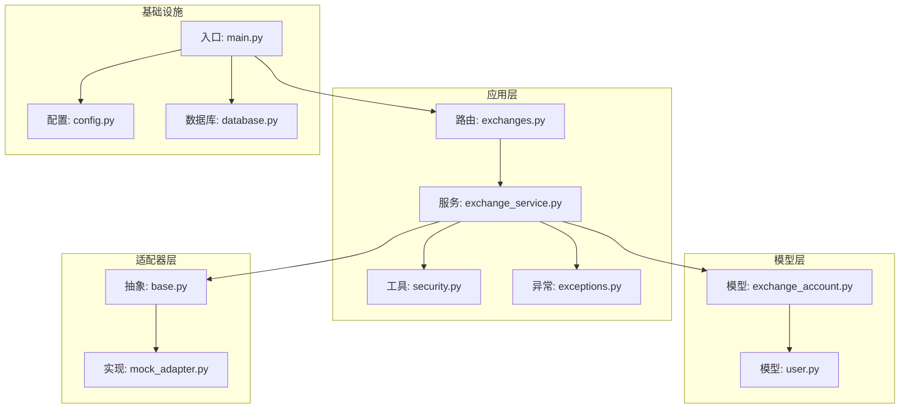
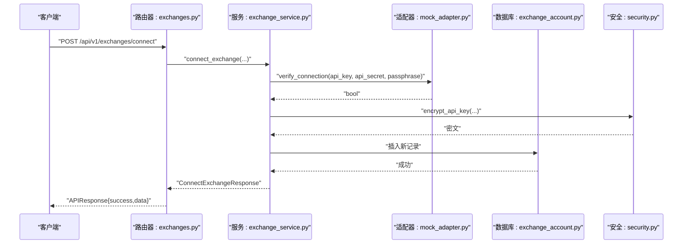
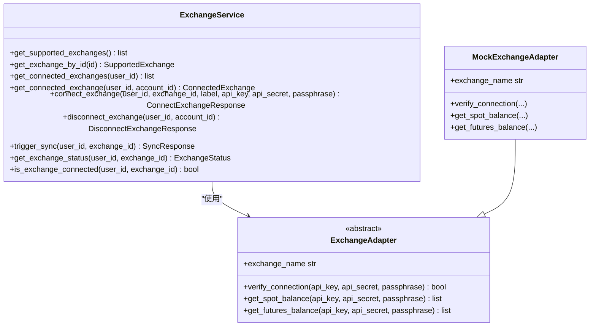
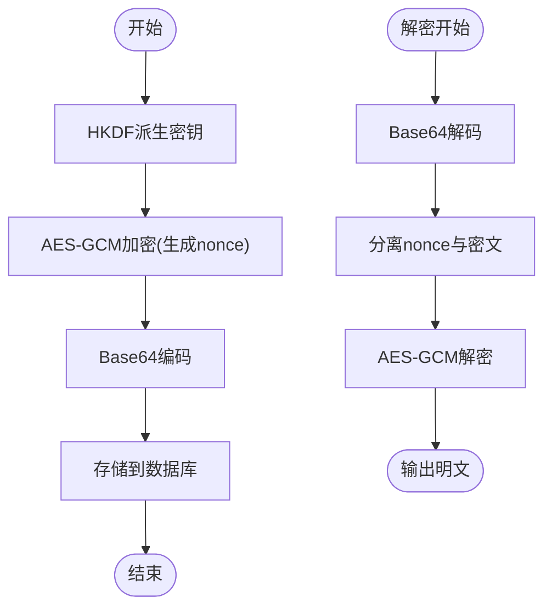
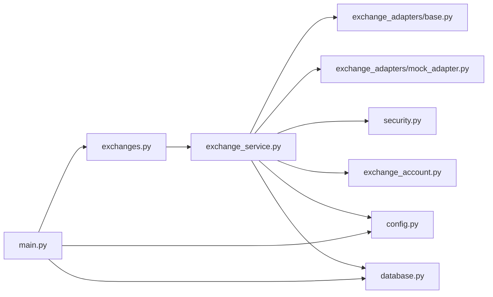

# 交易所接口

<cite>
**本文档引用的文件**
- [backend/app/routers/exchanges.py](file://backend/app/routers/exchanges.py)
- [backend/app/services/exchange_service.py](file://backend/app/services/exchange_service.py)
- [backend/app/schemas/exchange.py](file://backend/app/schemas/exchange.py)
- [backend/app/models/exchange_account.py](file://backend/app/models/exchange_account.py)
- [backend/app/services/exchange_adapters/base.py](file://backend/app/services/exchange_adapters/base.py)
- [backend/app/services/exchange_adapters/mock_adapter.py](file://backend/app/services/exchange_adapters/mock_adapter.py)
- [backend/app/utils/security.py](file://backend/app/utils/security.py)
- [backend/app/main.py](file://backend/app/main.py)
- [backend/app/database.py](file://backend/app/database.py)
- [backend/app/config.py](file://backend/app/config.py)
- [backend/app/utils/exceptions.py](file://backend/app/utils/exceptions.py)
- [backend/app/models/user.py](file://backend/app/models/user.py)
</cite>

## 目录
1. [简介](#简介)
2. [项目结构](#项目结构)
3. [核心组件](#核心组件)
4. [架构总览](#架构总览)
5. [详细组件分析](#详细组件分析)
6. [依赖分析](#依赖分析)
7. [性能考虑](#性能考虑)
8. [故障排除指南](#故障排除指南)
9. [结论](#结论)
10. [附录](#附录)

## 简介
本文件为交易所管理接口的详细API文档，覆盖以下功能：
- 交易所连接管理（/api/v1/exchanges）
- API凭据添加/删除
- 交易所状态查询
- 交易对获取（预留）
- 支持的交易所列表
- API密钥加密存储机制
- 数据同步策略
- 交易所适配器扩展接口与自定义交易所集成指南
- 请求/响应示例与安全传输协议
- 缓存策略、错误重试机制与连接超时处理
- 第三方交易所集成最佳实践与故障排除

## 项目结构
后端采用FastAPI + SQLAlchemy异步ORM + PostgreSQL数据库，采用模块化设计：
- 路由层：集中于 exchanges.py，暴露REST接口
- 服务层：ExchangeService封装业务逻辑，负责验证、加密、持久化与状态管理
- 模型层：ExchangeAccount模型映射数据库表
- 适配器层：ExchangeAdapter抽象接口，Mock实现用于开发测试
- 工具层：安全工具（AES-GCM加密）、异常处理、配置加载
- 中间件与启动：CORS、全局异常处理、数据库生命周期管理

图表来源
- [backend/app/routers/exchanges.py:1-227](file://backend/app/routers/exchanges.py#L1-L227)
- [backend/app/services/exchange_service.py:1-414](file://backend/app/services/exchange_service.py#L1-L414)
- [backend/app/models/exchange_account.py:1-32](file://backend/app/models/exchange_account.py#L1-L32)
- [backend/app/models/user.py:1-32](file://backend/app/models/user.py#L1-L32)
- [backend/app/services/exchange_adapters/base.py:1-73](file://backend/app/services/exchange_adapters/base.py#L1-L73)
- [backend/app/services/exchange_adapters/mock_adapter.py:1-110](file://backend/app/services/exchange_adapters/mock_adapter.py#L1-L110)
- [backend/app/utils/security.py:1-97](file://backend/app/utils/security.py#L1-L97)
- [backend/app/main.py:1-131](file://backend/app/main.py#L1-L131)
- [backend/app/database.py:1-33](file://backend/app/database.py#L1-L33)
- [backend/app/config.py:1-51](file://backend/app/config.py#L1-L51)
- [backend/app/utils/exceptions.py:1-67](file://backend/app/utils/exceptions.py#L1-L67)

章节来源
- [backend/app/routers/exchanges.py:1-227](file://backend/app/routers/exchanges.py#L1-L227)
- [backend/app/main.py:1-131](file://backend/app/main.py#L1-L131)

## 核心组件
- 路由器：提供GET/POST/DELETE等HTTP端点，统一返回APIResponse格式
- 服务层：ExchangeService负责：
  - 支持交易所清单管理
  - 连接/断开连接（软删除）
  - 凭据校验与加密
  - 手动触发同步与状态查询
- 模型层：ExchangeAccount持久化用户交易所账户信息
- 适配器层：ExchangeAdapter抽象，Mock实现用于开发
- 安全工具：AES-GCM加密API密钥，HKDF派生密钥
- 异常体系：AppException及其子类，统一错误响应

章节来源
- [backend/app/services/exchange_service.py:26-414](file://backend/app/services/exchange_service.py#L26-L414)
- [backend/app/models/exchange_account.py:11-32](file://backend/app/models/exchange_account.py#L11-L32)
- [backend/app/schemas/exchange.py:10-150](file://backend/app/schemas/exchange.py#L10-L150)
- [backend/app/utils/security.py:78-97](file://backend/app/utils/security.py#L78-L97)
- [backend/app/utils/exceptions.py:4-67](file://backend/app/utils/exceptions.py#L4-L67)

## 架构总览
下图展示API调用到数据库与适配器的交互流程。

图表来源
- [backend/app/routers/exchanges.py:86-122](file://backend/app/routers/exchanges.py#L86-L122)
- [backend/app/services/exchange_service.py:231-301](file://backend/app/services/exchange_service.py#L231-L301)
- [backend/app/services/exchange_adapters/mock_adapter.py:21-41](file://backend/app/services/exchange_adapters/mock_adapter.py#L21-L41)
- [backend/app/models/exchange_account.py:11-32](file://backend/app/models/exchange_account.py#L11-L32)
- [backend/app/utils/security.py:78-86](file://backend/app/utils/security.py#L78-L86)

## 详细组件分析

### 路由与端点
- GET /api/v1/exchanges：列出所有支持的交易所
- GET /api/v1/exchanges/supported：支持的交易所别名
- GET /api/v1/exchanges/connected：获取当前用户已连接的交易所
- POST /api/v1/exchanges/connect：连接新交易所（校验凭据并加密存储）
- DELETE /api/v1/exchanges/{exchange_id}：断开连接（软删除）
- POST /api/v1/exchanges/{exchange_id}/sync：手动触发同步
- GET /api/v1/exchanges/{exchange_id}/status：查询连接状态
- POST /api/v1/exchanges/{exchange_id}/verify：连接验证（未实现）
- GET /api/v1/exchanges/{exchange_id}/balance：余额查询（未实现）

章节来源
- [backend/app/routers/exchanges.py:25-227](file://backend/app/routers/exchanges.py#L25-L227)

### 服务层：ExchangeService
- 支持交易所清单：硬编码列表，包含名称、描述、是否支持现货/永续、是否需要口令、品牌色等
- 连接流程：
  - 校验交易所是否受支持
  - 若交易所要求口令则校验口令是否提供
  - 使用适配器验证凭据
  - 加密API密钥与口令
  - 写入数据库，初始状态为“待同步”
- 断开连接：软删除（is_active=false），更新时间戳
- 同步触发：更新状态为“同步中”，随后更新为“成功”并记录时间
- 状态查询：返回连接状态、最后同步时间、模拟余额数量

图表来源
- [backend/app/services/exchange_service.py:26-414](file://backend/app/services/exchange_service.py#L26-L414)
- [backend/app/services/exchange_adapters/base.py:5-73](file://backend/app/services/exchange_adapters/base.py#L5-L73)
- [backend/app/services/exchange_adapters/mock_adapter.py:10-110](file://backend/app/services/exchange_adapters/mock_adapter.py#L10-L110)

章节来源
- [backend/app/services/exchange_service.py:29-97](file://backend/app/services/exchange_service.py#L29-L97)
- [backend/app/services/exchange_service.py:231-301](file://backend/app/services/exchange_service.py#L231-L301)
- [backend/app/services/exchange_service.py:303-348](file://backend/app/services/exchange_service.py#L303-L348)
- [backend/app/services/exchange_service.py:350-393](file://backend/app/services/exchange_service.py#L350-L393)

### 数据模型：ExchangeAccount
- 字段：用户ID、交易所标识、标签、加密后的API密钥、加密后的口令、激活状态、同步状态与时间、创建/更新时间
- 关系：与User模型一对多

章节来源
- [backend/app/models/exchange_account.py:11-32](file://backend/app/models/exchange_account.py#L11-L32)
- [backend/app/models/user.py:28](file://backend/app/models/user.py#L28)

### API凭据加密与安全
- 加密算法：AES-256-GCM
- 密钥派生：HKDF从固定长度密钥材料派生32字节密钥
- 存储格式：nonce(12字节)+密文，再进行Base64编码
- 解密：反向流程，先解码再解密
- 配置：通过环境变量设置ENCRYPTION_KEY；开发模式默认值用于演示

图表来源
- [backend/app/utils/security.py:61-97](file://backend/app/utils/security.py#L61-L97)

章节来源
- [backend/app/utils/security.py:78-97](file://backend/app/utils/security.py#L78-L97)
- [backend/app/config.py:23-44](file://backend/app/config.py#L23-L44)

### 支持的交易所列表
- 硬编码列表包含：Binance、Bybit、OKX、Coinbase、Gate.io、Bitget
- 字段：id、name、description、logo_color、supports_spot、supports_futures、requires_passphrase、is_featured、status

章节来源
- [backend/app/services/exchange_service.py:29-97](file://backend/app/services/exchange_service.py#L29-L97)

### 数据同步策略
- 触发方式：手动触发（POST /{exchange_id}/sync）
- 状态流转：pending -> syncing -> success，并记录last_sync_at
- 实际同步：当前版本为占位实现，后续可接入后台任务队列

章节来源
- [backend/app/services/exchange_service.py:303-348](file://backend/app/services/exchange_service.py#L303-L348)

### 错误处理与异常
- 统一异常基类：AppException
- 常见异常：认证失败、资源未找到、参数校验失败、交易所连接失败
- 全局异常处理器：将异常转换为标准JSON响应

章节来源
- [backend/app/utils/exceptions.py:4-67](file://backend/app/utils/exceptions.py#L4-L67)
- [backend/app/main.py:65-91](file://backend/app/main.py#L65-L91)

### 适配器扩展与自定义集成
- 抽象接口：ExchangeAdapter定义verify_connection、spot/futures余额查询等方法
- Mock实现：始终返回成功，便于开发测试
- 扩展步骤：
  1) 新建具体适配器类，继承ExchangeAdapter
  2) 实现verify_connection与余额查询方法
  3) 在工厂函数中按exchange_name返回对应适配器实例
  4) 在连接流程中调用verify_connection进行凭据校验

章节来源
- [backend/app/services/exchange_adapters/base.py:5-73](file://backend/app/services/exchange_adapters/base.py#L5-L73)
- [backend/app/services/exchange_adapters/mock_adapter.py:96-110](file://backend/app/services/exchange_adapters/mock_adapter.py#L96-L110)

## 依赖分析
- 路由依赖服务层；服务层依赖模型、适配器与安全工具
- 适配器工厂函数在服务层被调用
- 数据库会话通过依赖注入提供
- 配置通过Pydantic Settings加载

图表来源
- [backend/app/routers/exchanges.py:19](file://backend/app/routers/exchanges.py#L19)
- [backend/app/services/exchange_service.py:21](file://backend/app/services/exchange_service.py#L21)
- [backend/app/services/exchange_adapters/base.py:1](file://backend/app/services/exchange_adapters/base.py#L1)
- [backend/app/services/exchange_adapters/mock_adapter.py:7](file://backend/app/services/exchange_adapters/mock_adapter.py#L7)
- [backend/app/utils/security.py:12](file://backend/app/utils/security.py#L12)
- [backend/app/models/exchange_account.py:8](file://backend/app/models/exchange_account.py#L8)
- [backend/app/config.py:5](file://backend/app/config.py#L5)
- [backend/app/database.py:1](file://backend/app/database.py#L1)
- [backend/app/main.py:9](file://backend/app/main.py#L9)

章节来源
- [backend/app/routers/exchanges.py:19](file://backend/app/routers/exchanges.py#L19)
- [backend/app/services/exchange_service.py:21](file://backend/app/services/exchange_service.py#L21)
- [backend/app/main.py:94-100](file://backend/app/main.py#L94-L100)

## 性能考虑
- 异步数据库访问：使用SQLAlchemy异步引擎，减少阻塞
- 加密成本：AES-GCM加解密在CPU上开销较小，建议在内存中完成
- 并发控制：当前同步为单次状态更新，建议引入后台任务队列（如Celery/RQ）以支持并发与重试
- 缓存策略：可利用Redis缓存最近一次同步结果与状态，降低数据库压力
- 连接超时：适配器调用外部交易所API时应设置合理超时与重试，避免阻塞主流程

## 故障排除指南
- 认证失败：检查JWT密钥配置与令牌有效性
- 参数校验失败：确认请求体字段完整且符合Schema
- 交易所未支持：仅支持硬编码列表中的交易所
- 口令缺失：部分交易所（如OKX）需要passphrase
- 连接验证失败：确认API密钥与密文正确，网络可达
- 数据库连接失败：检查DATABASE_URL与PostgreSQL服务状态
- 加密密钥未设置：生产环境必须设置ENCRYPTION_KEY

章节来源
- [backend/app/utils/exceptions.py:21-67](file://backend/app/utils/exceptions.py#L21-L67)
- [backend/app/config.py:32-44](file://backend/app/config.py#L32-L44)
- [backend/app/main.py:17-25](file://backend/app/main.py#L17-L25)

## 结论
该交易所接口实现了从凭据校验、加密存储到连接管理与状态查询的核心能力，具备良好的扩展性（适配器模式）与安全性（AES-GCM）。建议后续完善：
- 后台任务队列实现真实同步
- Redis缓存与限流策略
- 更完善的错误重试与超时处理
- 余额查询与交易对获取的实现

## 附录

### API端点一览与示例

- 获取支持的交易所
  - 方法：GET
  - 路径：/api/v1/exchanges
  - 示例响应：
    - 成功：{
      "success": true,
      "data": {
        "exchanges": [...],
        "total": N
      }
    }

- 获取已连接的交易所
  - 方法：GET
  - 路径：/api/v1/exchanges/connected
  - 示例响应：
    - 成功：{
      "success": true,
      "data": {
        "connected": [...],
        "total": N
      }
    }

- 连接交易所
  - 方法：POST
  - 路径：/api/v1/exchanges/connect
  - 请求体字段：
    - exchange_name: 交易所标识（如binance）
    - api_key: API密钥
    - api_secret: API密钥
    - passphrase: 可选（部分交易所需要）
    - label: 可选（用户自定义标签）
  - 示例响应：
    - 成功：{
      "success": true,
      "data": {
        "id": "uuid",
        "exchange_name": "binance",
        "label": "Binance账户",
        "is_active": true,
        "sync_status": "pending",
        "created_at": "2025-01-01T00:00:00Z"
      }
    }

- 断开连接
  - 方法：DELETE
  - 路径：/api/v1/exchanges/{exchange_id}
  - 示例响应：
    - 成功：{
      "success": true,
      "message": "Exchange disconnected successfully"
    }

- 手动触发同步
  - 方法：POST
  - 路径：/api/v1/exchanges/{exchange_id}/sync
  - 示例响应：
    - 成功：{
      "success": true,
      "message": "Sync triggered successfully"
    }

- 查询连接状态
  - 方法：GET
  - 路径：/api/v1/exchanges/{exchange_id}/status
  - 示例响应：
    - 成功：{
      "success": true,
      "data": {
        "id": "uuid",
        "exchange_name": "binance",
        "is_active": true,
        "sync_status": "success",
        "last_sync_at": "2025-01-01T00:00:00Z",
        "balances_count": 12
      }
    }

章节来源
- [backend/app/routers/exchanges.py:25-227](file://backend/app/routers/exchanges.py#L25-L227)
- [backend/app/schemas/exchange.py:113-150](file://backend/app/schemas/exchange.py#L113-L150)

### 安全与传输协议
- 传输协议：HTTPS（建议在生产环境强制）
- 认证：JWT（通过Authorization头）
- 凭据加密：AES-256-GCM，HKDF派生密钥
- 配置要求：生产环境必须设置JWT_SECRET_KEY与ENCRYPTION_KEY

章节来源
- [backend/app/utils/security.py:78-97](file://backend/app/utils/security.py#L78-L97)
- [backend/app/config.py:17-24](file://backend/app/config.py#L17-L24)

### 自定义交易所集成指南
- 步骤：
  1) 创建具体适配器类，实现ExchangeAdapter接口
  2) 在工厂函数中按exchange_name返回对应适配器
  3) 在连接流程中调用verify_connection进行凭据校验
  4) 如需余额查询，实现spot/futures余额方法
- 注意事项：
  - 严格遵守字段命名与返回格式
  - 处理网络异常与超时
  - 对敏感日志进行脱敏

章节来源
- [backend/app/services/exchange_adapters/base.py:5-73](file://backend/app/services/exchange_adapters/base.py#L5-L73)
- [backend/app/services/exchange_adapters/mock_adapter.py:96-110](file://backend/app/services/exchange_adapters/mock_adapter.py#L96-L110)