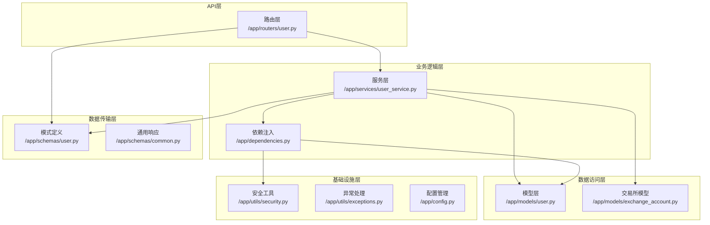
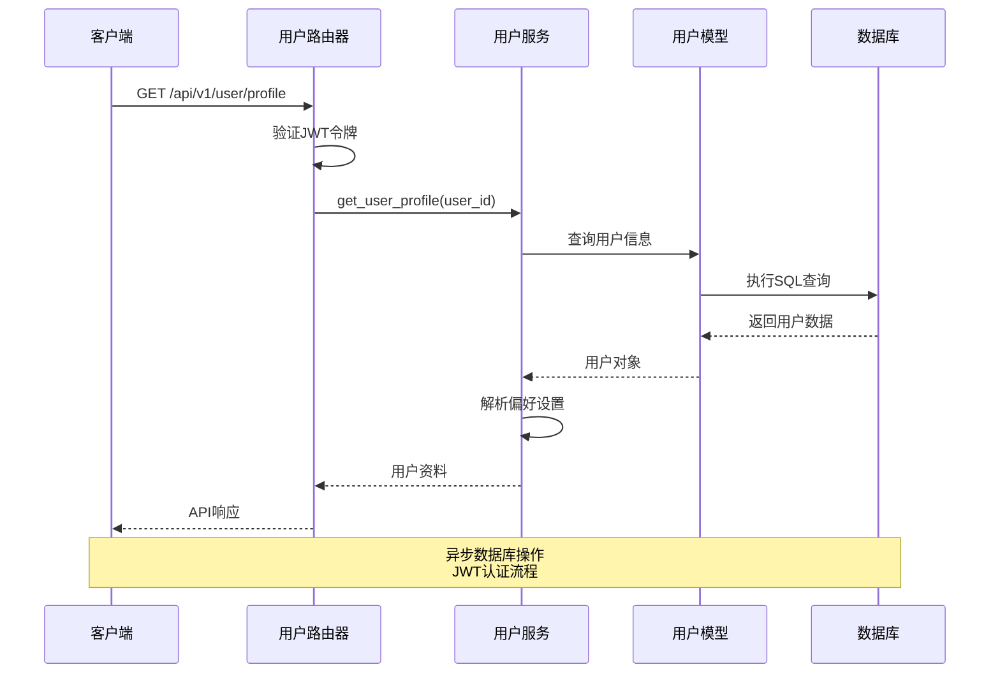
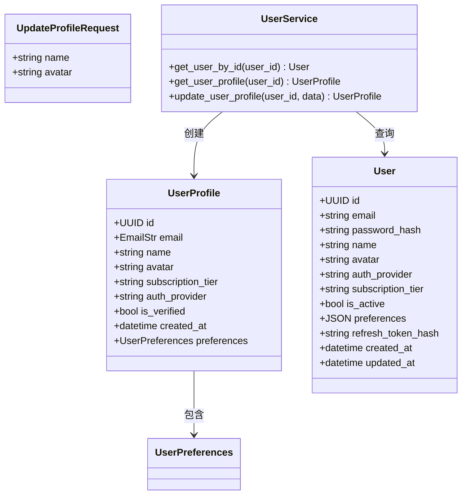
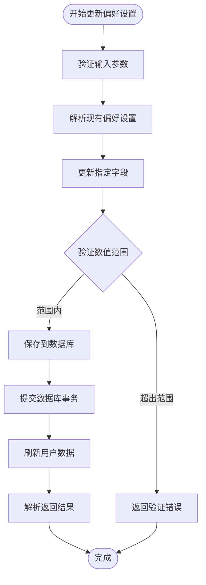
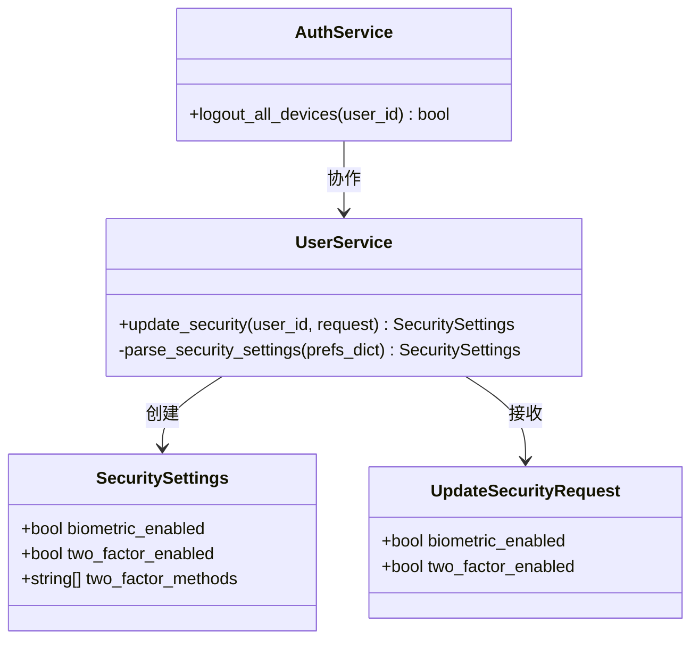
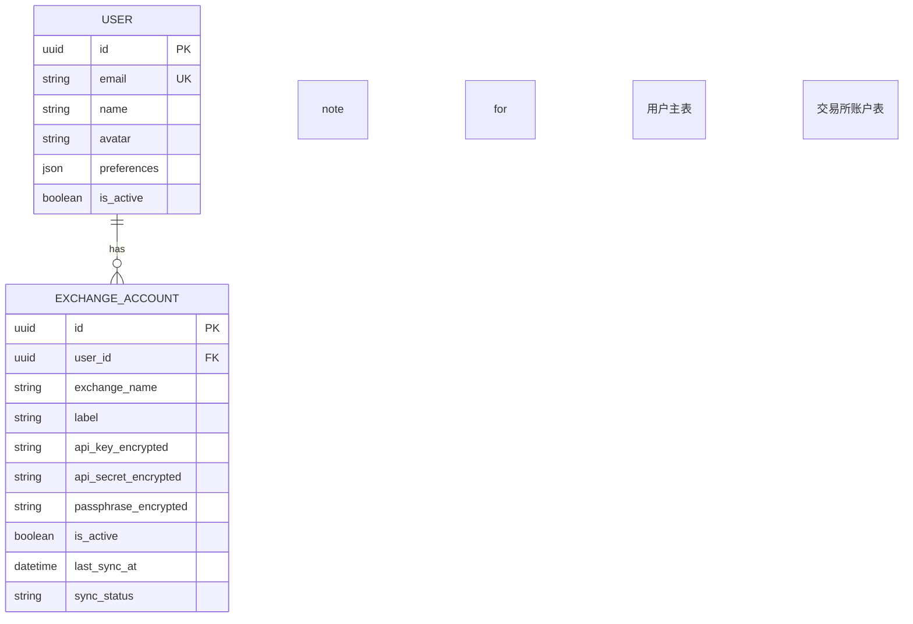
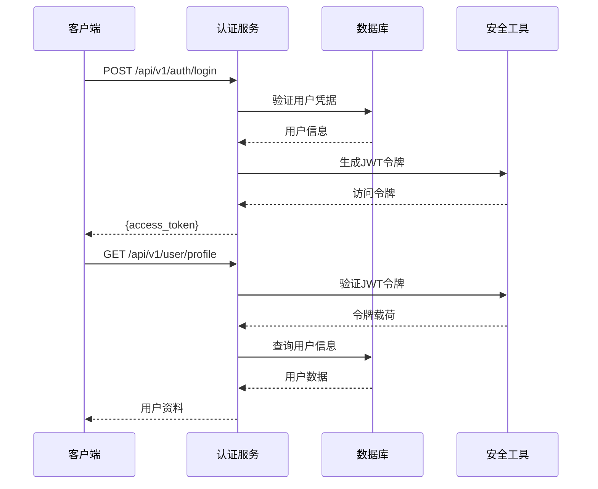

# 用户管理接口

<cite>
**本文档引用的文件**
- [backend/app/routers/user.py](file://backend/app/routers/user.py)
- [backend/app/models/user.py](file://backend/app/models/user.py)
- [backend/app/schemas/user.py](file://backend/app/schemas/user.py)
- [backend/app/services/user_service.py](file://backend/app/services/user_service.py)
- [backend/app/dependencies.py](file://backend/app/dependencies.py)
- [backend/app/utils/security.py](file://backend/app/utils/security.py)
- [backend/app/schemas/common.py](file://backend/app/schemas/common.py)
- [backend/app/models/exchange_account.py](file://backend/app/models/exchange_account.py)
- [backend/app/config.py](file://backend/app/config.py)
- [backend/app/utils/exceptions.py](file://backend/app/utils/exceptions.py)
- [backend/app/main.py](file://backend/app/main.py)
- [frontend/pubspec.yaml](file://frontend/pubspec.yaml)
</cite>

## 目录
1. [简介](#简介)
2. [项目结构](#项目结构)
3. [核心组件](#核心组件)
4. [架构概览](#架构概览)
5. [详细组件分析](#详细组件分析)
6. [API规范](#api规范)
7. [数据模型与验证](#数据模型与验证)
8. [权限控制与安全](#权限控制与安全)
9. [集成指南](#集成指南)
10. [性能考虑](#性能考虑)
11. [故障排除](#故障排除)
12. [结论](#结论)

## 简介

用户管理接口是资产聚集App后端系统的核心模块，负责处理用户身份认证、资料管理、偏好设置和安全配置等关键功能。该系统基于FastAPI框架构建，采用异步数据库操作和JWT令牌认证机制，为移动端和Web端提供统一的用户管理服务。

系统支持多种认证方式（邮箱、Google、Apple），提供灵活的用户偏好设置管理，并实现了完整的安全控制机制，包括生物识别认证、双因素认证和会话管理。

## 项目结构

后端采用分层架构设计，主要包含以下层次：



**图表来源**
- [backend/app/routers/user.py:1-280](file://backend/app/routers/user.py#L1-L280)
- [backend/app/services/user_service.py:1-223](file://backend/app/services/user_service.py#L1-L223)
- [backend/app/models/user.py:1-32](file://backend/app/models/user.py#L1-L32)

**章节来源**
- [backend/app/routers/user.py:1-280](file://backend/app/routers/user.py#L1-L280)
- [backend/app/services/user_service.py:1-223](file://backend/app/services/user_service.py#L1-L223)
- [backend/app/models/user.py:1-32](file://backend/app/models/user.py#L1-L32)

## 核心组件

### 路由器组件

用户管理路由器提供以下核心功能：
- 用户资料管理：获取和更新用户基本信息
- 偏好设置管理：货币单位、刷新频率、通知设置等
- 安全设置管理：生物识别、双因素认证等
- API连接管理：交易所API密钥管理
- 兼容性端点：支持旧版本客户端

### 服务组件

UserService提供完整的业务逻辑处理：
- 用户数据查询和更新
- 偏好设置的序列化和反序列化
- 安全设置的集中管理
- 会话管理和令牌验证
- 数据库事务处理

### 模型组件

用户模型定义了完整的用户数据结构：
- 基本信息：ID、邮箱、姓名、头像
- 认证信息：密码哈希、认证提供商
- 订阅信息：订阅等级、活跃状态
- 偏好设置：JSON格式存储
- 关系映射：与交易所账户的关联

**章节来源**
- [backend/app/routers/user.py:19-280](file://backend/app/routers/user.py#L19-L280)
- [backend/app/services/user_service.py:19-223](file://backend/app/services/user_service.py#L19-L223)
- [backend/app/models/user.py:11-32](file://backend/app/models/user.py#L11-L32)

## 架构概览

系统采用现代Web应用架构，结合了RESTful API设计原则和微服务思想：



**图表来源**
- [backend/app/routers/user.py:24-45](file://backend/app/routers/user.py#L24-L45)
- [backend/app/services/user_service.py:32-62](file://backend/app/services/user_service.py#L32-L62)
- [backend/app/dependencies.py:18-56](file://backend/app/dependencies.py#L18-L56)

**章节来源**
- [backend/app/main.py:94-100](file://backend/app/main.py#L94-L100)
- [backend/app/dependencies.py:18-56](file://backend/app/dependencies.py#L18-L56)

## 详细组件分析

### 用户资料管理

用户资料管理功能提供了完整的个人信息维护能力：



**图表来源**
- [backend/app/schemas/user.py:47-66](file://backend/app/schemas/user.py#L47-L66)
- [backend/app/models/user.py:11-32](file://backend/app/models/user.py#L11-L32)
- [backend/app/services/user_service.py:19-96](file://backend/app/services/user_service.py#L19-L96)

#### 用户资料获取流程

用户资料获取过程包含以下步骤：
1. JWT令牌验证和解析
2. 用户身份确认
3. 数据库查询用户信息
4. 偏好设置解析和合并
5. 响应数据构建

#### 用户资料更新流程

用户资料更新遵循以下流程：
1. 参数验证和类型检查
2. 数据库事务开始
3. 字段条件更新
4. 数据提交和刷新
5. 新数据重新查询

**章节来源**
- [backend/app/routers/user.py:24-71](file://backend/app/routers/user.py#L24-L71)
- [backend/app/services/user_service.py:32-96](file://backend/app/services/user_service.py#L32-L96)

### 偏好设置管理

偏好设置系统提供了灵活的用户个性化配置能力：



**图表来源**
- [backend/app/services/user_service.py:97-138](file://backend/app/services/user_service.py#L97-L138)
- [backend/app/schemas/user.py:10-26](file://backend/app/schemas/user.py#L10-L26)

#### 支持的偏好设置项

| 设置项 | 类型 | 默认值 | 有效范围 | 描述 |
|--------|------|--------|----------|------|
| base_currency | string | USD | USD/EUR/GBP/JPY/CNY | 基础货币单位 |
| refresh_interval_minutes | integer | 5 | 1-60 | 数据刷新间隔（分钟） |
| biometric_enabled | boolean | true | true/false | 生物识别认证开关 |
| market_alerts_enabled | boolean | true | true/false | 市场提醒开关 |

**章节来源**
- [backend/app/schemas/user.py:10-26](file://backend/app/schemas/user.py#L10-L26)
- [backend/app/services/user_service.py:97-138](file://backend/app/services/user_service.py#L97-L138)

### 安全设置管理

安全设置管理实现了多层次的安全控制机制：



**图表来源**
- [backend/app/schemas/user.py:30-43](file://backend/app/schemas/user.py#L30-L43)
- [backend/app/services/user_service.py:140-177](file://backend/app/services/user_service.py#L140-L177)

#### 安全特性

- **生物识别认证**：支持指纹、面部识别等生物特征
- **双因素认证**：短信和邮件验证
- **会话管理**：支持登出所有设备
- **令牌验证**：JWT访问令牌和刷新令牌

**章节来源**
- [backend/app/routers/user.py:126-177](file://backend/app/routers/user.py#L126-L177)
- [backend/app/services/user_service.py:179-205](file://backend/app/services/user_service.py#L179-L205)

### API连接管理

API连接管理功能允许用户安全地管理交易所API密钥：



**图表来源**
- [backend/app/models/user.py:28](file://backend/app/models/user.py#L28)
- [backend/app/models/exchange_account.py:11-32](file://backend/app/models/exchange_account.py#L11-L32)

#### API密钥安全

系统采用AES-256-GCM加密算法保护敏感的API密钥数据：
- 使用HKDF从密钥材料派生加密密钥
- 96位随机nonce确保加密安全性
- Base64编码便于存储和传输

**章节来源**
- [backend/app/models/exchange_account.py:11-32](file://backend/app/models/exchange_account.py#L11-L32)
- [backend/app/utils/security.py:78-96](file://backend/app/utils/security.py#L78-L96)

## API规范

### 基础信息

- **API版本**：v1
- **基础URL**：`/api/v1`
- **认证方式**：JWT Bearer Token
- **内容类型**：`application/json`
- **响应格式**：统一API响应格式

### 统一响应格式

所有API响应遵循统一格式：

| 字段 | 类型 | 必填 | 描述 |
|------|------|------|------|
| success | boolean | 是 | 请求是否成功 |
| data | any | 否 | 响应数据 |
| message | string | 是 | 响应消息 |
| error_code | string | 否 | 错误代码 |

### 用户资料接口

#### 获取用户资料

**请求**
```
GET /api/v1/user/profile
Authorization: Bearer {jwt_token}
```

**响应示例**
```json
{
  "success": true,
  "data": {
    "id": "123e4567-e89b-12d3-a456-426614174000",
    "email": "user@example.com",
    "name": "张三",
    "avatar": "https://example.com/avatar.jpg",
    "subscription_tier": "pro",
    "auth_provider": "email",
    "is_verified": true,
    "created_at": "2024-01-01T00:00:00Z",
    "preferences": {
      "base_currency": "USD",
      "refresh_interval_minutes": 5,
      "biometric_enabled": true,
      "market_alerts_enabled": true
    }
  },
  "message": "User profile retrieved successfully"
}
```

#### 更新用户资料

**请求**
```
PUT /api/v1/user/profile
Authorization: Bearer {jwt_token}
Content-Type: application/json
```

**请求体**
```json
{
  "name": "李四",
  "avatar": "https://example.com/new-avatar.jpg"
}
```

**响应**
```json
{
  "success": true,
  "data": {
    "id": "123e4567-e89b-12d3-a456-426614174000",
    "email": "user@example.com",
    "name": "李四",
    "avatar": "https://example.com/new-avatar.jpg",
    "subscription_tier": "pro",
    "auth_provider": "email",
    "is_verified": true,
    "created_at": "2024-01-01T00:00:00Z",
    "preferences": {
      "base_currency": "USD",
      "refresh_interval_minutes": 5,
      "biometric_enabled": true,
      "market_alerts_enabled": true
    }
  },
  "message": "User profile updated successfully"
}
```

### 偏好设置接口

#### 获取偏好设置

**请求**
```
GET /api/v1/user/preferences
Authorization: Bearer {jwt_token}
```

**响应**
```json
{
  "success": true,
  "data": {
    "base_currency": "USD",
    "refresh_interval_minutes": 5,
    "biometric_enabled": true,
    "market_alerts_enabled": true
  },
  "message": "User preferences retrieved successfully"
}
```

#### 更新偏好设置

**请求**
```
PUT /api/v1/user/preferences
Authorization: Bearer {jwt_token}
Content-Type: application/json
```

**请求体**
```json
{
  "base_currency": "EUR",
  "refresh_interval_minutes": 10,
  "biometric_enabled": false
}
```

**响应**
```json
{
  "success": true,
  "data": {
    "base_currency": "EUR",
    "refresh_interval_minutes": 10,
    "biometric_enabled": false,
    "market_alerts_enabled": true
  },
  "message": "User preferences updated successfully"
}
```

### 安全设置接口

#### 获取安全设置

**请求**
```
GET /api/v1/user/security
Authorization: Bearer {jwt_token}
```

**响应**
```json
{
  "success": true,
  "data": {
    "biometric_enabled": true,
    "two_factor_enabled": true,
    "two_factor_methods": ["sms", "email"]
  },
  "message": "Security settings retrieved successfully"
}
```

#### 更新安全设置

**请求**
```
PUT /api/v1/user/security
Authorization: Bearer {jwt_token}
Content-Type: application/json
```

**请求体**
```json
{
  "biometric_enabled": false,
  "two_factor_enabled": true
}
```

**响应**
```json
{
  "success": true,
  "data": {
    "biometric_enabled": false,
    "two_factor_enabled": true,
    "two_factor_methods": ["sms", "email"]
  },
  "message": "Security settings updated successfully"
}
```

### 兼容性接口

系统保留了旧版本客户端的兼容性接口：

| 旧端点 | 新端点 | 说明 |
|--------|--------|------|
| `GET /api/v1/user/me` | `GET /api/v1/user/profile` | 获取用户信息 |
| `PUT /api/v1/user/me` | `PUT /api/v1/user/profile` | 更新用户信息 |
| `PUT /api/v1/user/me/password` | 未实现 | 密码修改 |
| `DELETE /api/v1/user/me` | 未实现 | 账户删除 |

**章节来源**
- [backend/app/routers/user.py:24-280](file://backend/app/routers/user.py#L24-L280)

## 数据模型与验证

### 用户模型字段定义

用户模型定义了完整的用户数据结构：

| 字段名 | 类型 | 约束 | 描述 | 默认值 |
|--------|------|------|------|--------|
| id | UUID | 主键 | 用户唯一标识 | 自动生成 |
| email | string | 唯一、非空 | 用户邮箱 | 必填 |
| password_hash | string | 可空 | 密码哈希 | null |
| name | string | 可空 | 用户姓名 | null |
| avatar | string | 可空 | 头像URL | null |
| auth_provider | string | 默认值 | 认证提供商 | "email" |
| subscription_tier | string | 默认值 | 订阅等级 | "free" |
| is_active | boolean | 默认值 | 账户状态 | true |
| preferences | JSON | 默认值 | 偏好设置 | {} |
| refresh_token_hash | string | 可空 | 刷新令牌哈希 | null |
| created_at | datetime | 自动设置 | 创建时间 | 当前时间 |
| updated_at | datetime | 自动更新 | 更新时间 | 当前时间 |

### 数据验证规则

系统采用Pydantic进行数据验证，确保数据的完整性和正确性：

#### 用户偏好设置验证

- `base_currency`: 必须为预定义的货币代码之一
- `refresh_interval_minutes`: 整数，范围1-60分钟
- `biometric_enabled`: 布尔值
- `market_alerts_enabled`: 布尔值

#### 用户资料验证

- `name`: 最大长度100字符
- `avatar`: 最大长度500字符，必须为有效URL

#### 安全设置验证

- `biometric_enabled`: 布尔值
- `two_factor_enabled`: 布尔值

**章节来源**
- [backend/app/models/user.py:14-25](file://backend/app/models/user.py#L14-L25)
- [backend/app/schemas/user.py:10-66](file://backend/app/schemas/user.py#L10-L66)

## 权限控制与安全

### 认证机制

系统采用JWT（JSON Web Token）进行身份认证：



**图表来源**
- [backend/app/dependencies.py:18-56](file://backend/app/dependencies.py#L18-L56)
- [backend/app/utils/security.py:28-59](file://backend/app/utils/security.py#L28-L59)

### 令牌管理

系统实现双重令牌机制：

| 令牌类型 | 有效期 | 用途 | 安全特性 |
|----------|--------|------|----------|
| Access Token | 30分钟 | API访问 | HS256签名 |
| Refresh Token | 7天 | 令牌刷新 | HS256签名 |

### 会话控制

系统提供完善的会话管理功能：

- **单设备登录**：同一时间只能在一个设备上登录
- **多设备登出**：支持登出所有设备
- **令牌撤销**：通过清除刷新令牌哈希实现
- **自动过期**：访问令牌自动过期

### 数据访问限制

- **用户数据隔离**：每个用户只能访问自己的数据
- **权限验证**：所有用户相关操作都需要有效认证
- **敏感数据保护**：API密钥等敏感信息加密存储

**章节来源**
- [backend/app/dependencies.py:18-56](file://backend/app/dependencies.py#L18-L56)
- [backend/app/services/user_service.py:179-205](file://backend/app/services/user_service.py#L179-L205)
- [backend/app/utils/security.py:28-59](file://backend/app/utils/security.py#L28-L59)

## 集成指南

### 移动端集成

移动端开发建议使用Dio网络库进行HTTP通信：

#### Dart集成示例

```dart
// 用户资料获取
Future<UserProfile> getUserProfile() async {
  try {
    final response = await dio.get('/api/v1/user/profile', 
      options: Options(
        headers: {'Authorization': 'Bearer $accessToken'}
      )
    );
    return UserProfile.fromJson(response.data['data']);
  } catch (e) {
    // 处理错误
    throw AppException(message: '获取用户资料失败');
  }
}

// 偏好设置更新
Future<UserPreferences> updateUserPreferences(
    UpdatePreferencesRequest request) async {
  try {
    final response = await dio.put('/api/v1/user/preferences',
      data: request.toJson(),
      options: Options(
        headers: {'Authorization': 'Bearer $accessToken'}
      )
    );
    return UserPreferences.fromJson(response.data['data']);
  } catch (e) {
    // 处理错误
    throw AppException(message: '更新偏好设置失败');
  }
}
```

#### Flutter安全存储

建议使用flutter_secure_storage安全存储令牌：

```dart
final storage = FlutterSecureStorage();
await storage.write(key: 'access_token', value: accessToken);
await storage.write(key: 'refresh_token', value: refreshToken);

// 读取时使用
final token = await storage.read(key: 'access_token');
```

### Web端集成

Web端可以使用fetch或axios进行API调用：

#### JavaScript集成示例

```javascript
// 获取用户资料
async function getUserProfile() {
  try {
    const response = await fetch('/api/v1/user/profile', {
      headers: {
        'Authorization': `Bearer ${localStorage.getItem('access_token')}`,
        'Content-Type': 'application/json'
      }
    });
    
    const data = await response.json();
    if (!data.success) {
      throw new Error(data.message);
    }
    
    return data.data;
  } catch (error) {
    console.error('获取用户资料失败:', error);
    throw error;
  }
}

// 更新用户资料
async function updateUserProfile(userData) {
  try {
    const response = await fetch('/api/v1/user/profile', {
      method: 'PUT',
      headers: {
        'Authorization': `Bearer ${localStorage.getItem('access_token')}`,
        'Content-Type': 'application/json'
      },
      body: JSON.stringify(userData)
    });
    
    const data = await response.json();
    if (!data.success) {
      throw new Error(data.message);
    }
    
    return data.data;
  } catch (error) {
    console.error('更新用户资料失败:', error);
    throw error;
  }
}
```

### 最佳实践

#### 错误处理

```dart
// 统一错误处理
void handleApiError(dynamic error) {
  if (error is DioException) {
    switch (error.response?.statusCode) {
      case 401:
        // 令牌过期，重新登录
        redirectToLogin();
        break;
      case 404:
        // 资源不存在
        showErrorMessage('数据不存在');
        break;
      case 422:
        // 参数验证失败
        showErrorMessage('参数验证失败');
        break;
      default:
        // 其他错误
        showErrorMessage(error.message);
    }
  }
}
```

#### 缓存策略

```dart
// 用户资料缓存
class UserCache {
  static final Map<String, dynamic> cache = {};
  static final Map<String, DateTime> timestamps = {};
  
  static bool isValid(String key, Duration ttl) {
    final timestamp = timestamps[key];
    return timestamp != null && DateTime.now().difference(timestamp) < ttl;
  }
  
  static T getCached<T>(String key) {
    return cache[key] as T;
  }
  
  static void setCached<T>(String key, T value) {
    cache[key] = value;
    timestamps[key] = DateTime.now();
  }
}
```

**章节来源**
- [frontend/pubspec.yaml:13-18](file://frontend/pubspec.yaml#L13-L18)

## 性能考虑

### 数据库优化

系统采用异步数据库操作和连接池管理：

- **异步查询**：使用SQLAlchemy异步引擎减少阻塞
- **连接池**：配置适当的连接池大小避免资源耗尽
- **索引优化**：为常用查询字段建立索引
- **批量操作**：支持批量数据更新减少数据库往返

### 缓存策略

- **用户资料缓存**：短期缓存用户资料减少数据库查询
- **偏好设置缓存**：本地存储用户偏好设置
- **令牌缓存**：避免频繁的令牌验证

### API性能

- **响应压缩**：启用Gzip压缩减少传输数据量
- **分页支持**：大数据集查询支持分页
- **并发处理**：异步处理提升并发性能

## 故障排除

### 常见错误及解决方案

#### 认证相关错误

| 错误代码 | 错误描述 | 可能原因 | 解决方案 |
|----------|----------|----------|----------|
| AUTHENTICATION_ERROR | 认证失败 | 令牌无效或过期 | 重新登录获取新令牌 |
| INVALID_TOKEN | 令牌无效 | 令牌格式错误 | 检查令牌格式和签名 |
| TOKEN_EXPIRED | 令牌过期 | 访问令牌超时 | 使用刷新令牌获取新令牌 |
| USER_DISABLED | 用户被禁用 | 账户状态异常 | 联系客服恢复账户 |

#### 数据验证错误

| 错误代码 | 错误描述 | 可能原因 | 解决方案 |
|----------|----------|----------|----------|
| VALIDATION_ERROR | 参数验证失败 | 输入数据格式错误 | 检查数据格式和范围 |
| NOT_FOUND | 资源不存在 | 用户或数据不存在 | 确认用户ID和数据存在性 |

#### 数据库错误

| 错误代码 | 错误描述 | 可能原因 | 解决方案 |
|----------|----------|----------|----------|
| DATABASE_ERROR | 数据库连接失败 | 数据库服务不可用 | 检查数据库连接和配置 |
| DUPLICATE_KEY | 重复键冲突 | 邮箱重复注册 | 检查邮箱唯一性 |

### 调试技巧

#### 日志记录

```python
import logging

logger = logging.getLogger(__name__)

@app.exception_handler(AppException)
async def app_exception_handler(request: Request, exc: AppException):
    logger.error(f"API Error: {exc.message}, Code: {exc.error_code}, Details: {exc.details}")
    # 返回标准化错误响应
```

#### 性能监控

```python
from fastapi import Request
import time

@app.middleware("http")
async def timing_middleware(request: Request, call_next):
    start_time = time.time()
    response = await call_next(request)
    duration = time.time() - start_time
    logger.info(f"Request took {duration:.2f}s: {request.method} {request.url}")
    return response
```

**章节来源**
- [backend/app/utils/exceptions.py:4-67](file://backend/app/utils/exceptions.py#L4-L67)
- [backend/app/main.py:66-91](file://backend/app/main.py#L66-L91)

## 结论

用户管理接口为资产聚集App提供了完整、安全、可扩展的用户管理解决方案。系统采用现代化的技术栈和架构设计，具备以下优势：

### 技术优势

- **安全性**：JWT认证、API密钥加密、会话管理
- **可扩展性**：模块化设计、异步处理、缓存策略
- **易用性**：统一API格式、完善的错误处理、详细文档
- **可靠性**：异常处理、日志记录、性能监控

### 功能特性

- **完整的用户生命周期管理**：从注册到注销的全流程支持
- **灵活的个性化配置**：支持多种偏好设置和安全选项
- **多平台集成**：同时支持移动端和Web端
- **数据安全保障**：敏感信息加密存储，访问权限控制

### 发展方向

未来可以考虑的功能增强：
- 更丰富的认证方式（TOTP、硬件令牌）
- 更细粒度的权限控制
- 更智能的数据同步机制
- 更完善的审计日志功能

该用户管理接口为整个资产聚集App奠定了坚实的基础，为用户提供安全、便捷、个性化的资产管理体验。