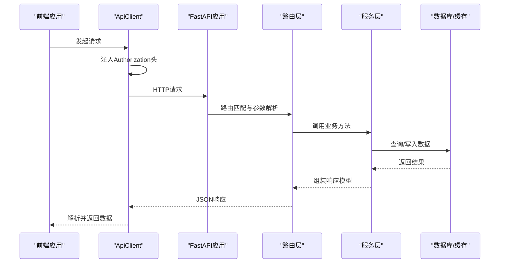
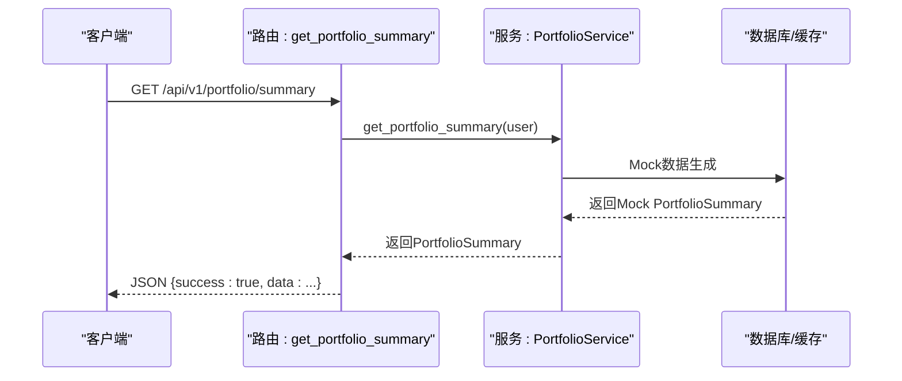
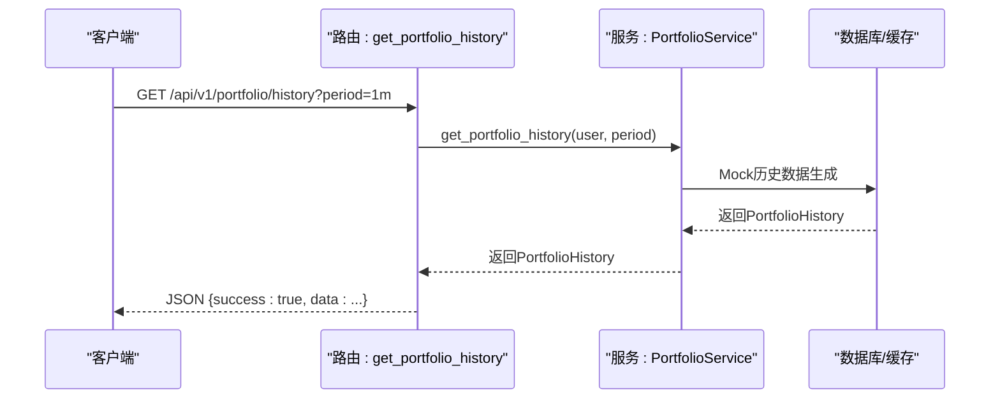
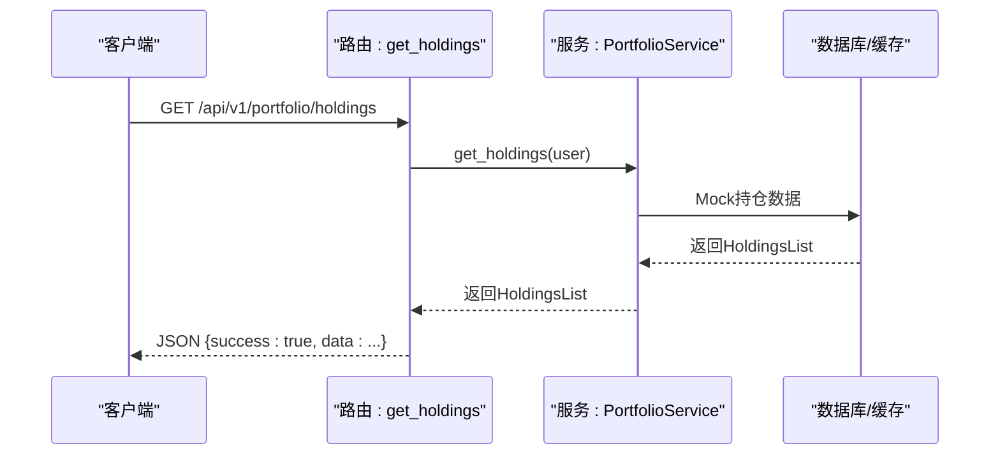
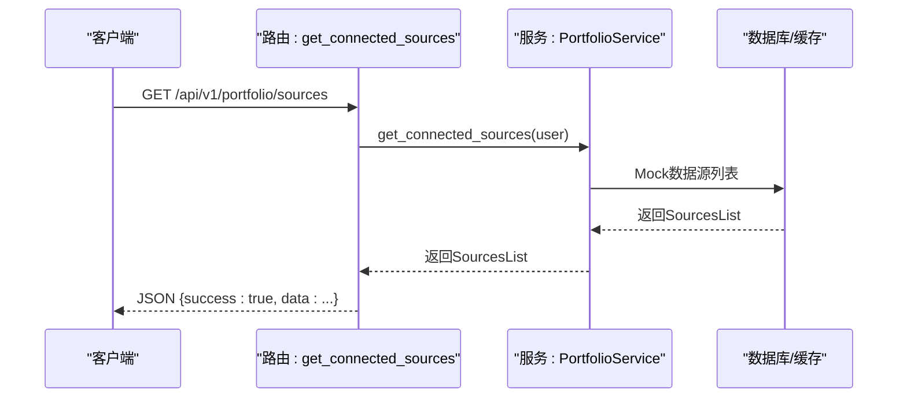
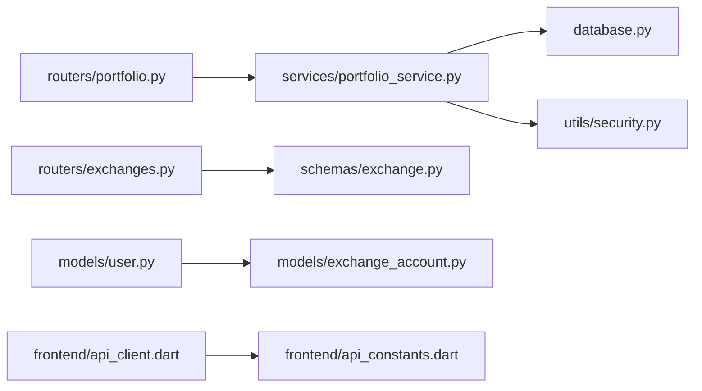

# 资产接口

<cite>
**本文引用的文件**
- [backend/app/main.py](file://backend/app/main.py)
- [backend/app/config.py](file://backend/app/config.py)
- [backend/app/database.py](file://backend/app/database.py)
- [backend/app/routers/portfolio.py](file://backend/app/routers/portfolio.py)
- [backend/app/schemas/portfolio.py](file://backend/app/schemas/portfolio.py)
- [backend/app/services/portfolio_service.py](file://backend/app/services/portfolio_service.py)
- [backend/app/routers/exchanges.py](file://backend/app/routers/exchanges.py)
- [backend/app/schemas/exchange.py](file://backend/app/schemas/exchange.py)
- [backend/app/models/exchange_account.py](file://backend/app/models/exchange_account.py)
- [backend/app/models/user.py](file://backend/app/models/user.py)
- [backend/app/utils/security.py](file://backend/app/utils/security.py)
- [frontend/lib/core/api/api_client.dart](file://frontend/lib/core/api/api_client.dart)
- [frontend/lib/core/api/api_constants.dart](file://frontend/lib/core/api/api_constants.dart)
</cite>

## 目录
1. [简介](#简介)
2. [项目结构](#项目结构)
3. [核心组件](#核心组件)
4. [架构总览](#架构总览)
5. [详细组件分析](#详细组件分析)
6. [依赖分析](#依赖分析)
7. [性能考虑](#性能考虑)
8. [故障排查指南](#故障排查指南)
9. [结论](#结论)
10. [附录](#附录)

## 简介
本文件为“资产接口”的完整API文档，覆盖资产概览、历史净值、持仓列表、数据源管理等接口。文档同时说明资产聚合算法设计思路、实时价格更新机制与数据缓存策略的预留方案、支持的资产类型与交易对格式、数值精度处理、请求参数（时间范围、排序、分页）、资产价值计算方法、汇率转换与税费处理的扩展点、性能优化建议、批量查询与实时推送机制的实现路径，以及移动端与Web端的集成示例。

## 项目结构
后端采用FastAPI + SQLAlchemy异步ORM，路由按功能模块划分；前端基于Flutter + Riverpod + Dio，通过统一的ApiClient封装HTTP调用与鉴权流程。数据库使用PostgreSQL，Redis用于缓存（配置中定义）。

```mermaid
graph TB
subgraph "后端"
M["main.py<br/>应用入口与中间件"]
CFG["config.py<br/>配置中心"]
DB["database.py<br/>异步引擎与会话"]
R_P["routers/portfolio.py<br/>资产路由"]
S_P["schemas/portfolio.py<br/>资产模型与响应"]
SVC_P["services/portfolio_service.py<br/>资产业务逻辑"]
R_E["routers/exchanges.py<br/>交易所路由"]
S_E["schemas/exchange.py<br/>交易所模型"]
MD_U["models/user.py<br/>用户模型"]
MD_A["models/exchange_account.py<br/>交易所账户模型"]
SEC["utils/security.py<br/>加密与令牌工具"]
end
subgraph "前端"
FC["frontend/lib/core/api/api_client.dart<br/>HTTP客户端封装"]
FCS["frontend/lib/core/api/api_constants.dart<br/>API常量"]
end
M --> R_P
M --> R_E
M --> CFG
M --> DB
R_P --> SVC_P
R_E --> S_E
SVC_P --> DB
SVC_P --> SEC
MD_U < --> MD_A
FC --> FCS
```

**图表来源**
- [backend/app/main.py:34-101](file://backend/app/main.py#L34-L101)
- [backend/app/config.py:5-51](file://backend/app/config.py#L5-L51)
- [backend/app/database.py:1-33](file://backend/app/database.py#L1-L33)
- [backend/app/routers/portfolio.py:26-217](file://backend/app/routers/portfolio.py#L26-L217)
- [backend/app/schemas/portfolio.py:11-152](file://backend/app/schemas/portfolio.py#L11-L152)
- [backend/app/services/portfolio_service.py:31-317](file://backend/app/services/portfolio_service.py#L31-L317)
- [backend/app/routers/exchanges.py:22-227](file://backend/app/routers/exchanges.py#L22-L227)
- [backend/app/schemas/exchange.py:10-150](file://backend/app/schemas/exchange.py#L10-L150)
- [backend/app/models/user.py:11-32](file://backend/app/models/user.py#L11-L32)
- [backend/app/models/exchange_account.py:11-32](file://backend/app/models/exchange_account.py#L11-L32)
- [backend/app/utils/security.py:1-104](file://backend/app/utils/security.py#L1-L104)
- [frontend/lib/core/api/api_client.dart:24-364](file://frontend/lib/core/api/api_client.dart#L24-L364)
- [frontend/lib/core/api/api_constants.dart:1-56](file://frontend/lib/core/api/api_constants.dart#L1-L56)

**章节来源**
- [backend/app/main.py:34-101](file://backend/app/main.py#L34-L101)
- [backend/app/config.py:5-51](file://backend/app/config.py#L5-L51)
- [backend/app/database.py:1-33](file://backend/app/database.py#L1-L33)
- [frontend/lib/core/api/api_client.dart:24-364](file://frontend/lib/core/api/api_client.dart#L24-L364)
- [frontend/lib/core/api/api_constants.dart:1-56](file://frontend/lib/core/api/api_constants.dart#L1-L56)

## 核心组件
- 应用入口与中间件：CORS、异常处理、路由注册、健康检查。
- 配置中心：应用名、调试模式、API前缀、数据库URL、Redis、JWT、加密密钥、CORS白名单、CoinGecko API地址。
- 数据库：异步引擎与会话工厂，依赖注入。
- 资产路由：资产概览、历史净值、持仓列表、数据源列表。
- 资产模型：概览、历史、持仓、数据源的Pydantic模型与统一响应包装。
- 资产业务：Mock数据生成与聚合逻辑预留（未来接入真实交易所与价格源）。
- 交易所路由：支持的交易所列表、已连接列表、连接/断开、手动同步、状态查询等。
- 用户与账户模型：用户与交易所账户关联关系。
- 加密与安全：JWT签发/校验、API Key加解密（AES-256-GCM）。
- 前端API客户端：Dio封装、拦截器、Token自动续期、错误处理。

**章节来源**
- [backend/app/main.py:34-101](file://backend/app/main.py#L34-L101)
- [backend/app/config.py:5-51](file://backend/app/config.py#L5-L51)
- [backend/app/database.py:1-33](file://backend/app/database.py#L1-L33)
- [backend/app/routers/portfolio.py:26-217](file://backend/app/routers/portfolio.py#L26-L217)
- [backend/app/schemas/portfolio.py:11-152](file://backend/app/schemas/portfolio.py#L11-L152)
- [backend/app/services/portfolio_service.py:31-317](file://backend/app/services/portfolio_service.py#L31-L317)
- [backend/app/routers/exchanges.py:22-227](file://backend/app/routers/exchanges.py#L22-L227)
- [backend/app/schemas/exchange.py:10-150](file://backend/app/schemas/exchange.py#L10-L150)
- [backend/app/models/user.py:11-32](file://backend/app/models/user.py#L11-L32)
- [backend/app/models/exchange_account.py:11-32](file://backend/app/models/exchange_account.py#L11-L32)
- [backend/app/utils/security.py:1-104](file://backend/app/utils/security.py#L1-L104)
- [frontend/lib/core/api/api_client.dart:24-364](file://frontend/lib/core/api/api_client.dart#L24-L364)
- [frontend/lib/core/api/api_constants.dart:1-56](file://frontend/lib/core/api/api_constants.dart#L1-L56)

## 架构总览
后端以FastAPI为核心，通过依赖注入提供数据库会话；路由层负责参数解析与响应封装；服务层承载业务逻辑（当前为Mock，预留真实聚合）。前端通过Dio统一发起请求，自动携带JWT并在401时尝试刷新Token。



**图表来源**
- [backend/app/main.py:34-101](file://backend/app/main.py#L34-L101)
- [backend/app/routers/portfolio.py:26-217](file://backend/app/routers/portfolio.py#L26-L217)
- [backend/app/services/portfolio_service.py:31-317](file://backend/app/services/portfolio_service.py#L31-L317)
- [frontend/lib/core/api/api_client.dart:24-364](file://frontend/lib/core/api/api_client.dart#L24-L364)

## 详细组件分析

### 资产概览接口
- 接口：GET /api/v1/portfolio/summary
- 功能：返回用户总资产价值、24小时涨跌额与百分比、各来源资产分布。
- 参数：无
- 响应：PortfolioSummaryResponse，包含success与data（PortfolioSummary）。
- 数据来源：当前为Mock数据，预留真实聚合逻辑（查询exchange_accounts、调用交易所API、获取价格、计算总值）。



**图表来源**
- [backend/app/routers/portfolio.py:33-59](file://backend/app/routers/portfolio.py#L33-L59)
- [backend/app/services/portfolio_service.py:41-65](file://backend/app/services/portfolio_service.py#L41-L65)

**章节来源**
- [backend/app/routers/portfolio.py:33-59](file://backend/app/routers/portfolio.py#L33-L59)
- [backend/app/schemas/portfolio.py:29-41](file://backend/app/schemas/portfolio.py#L29-L41)
- [backend/app/services/portfolio_service.py:41-65](file://backend/app/services/portfolio_service.py#L41-L65)

### 历史净值接口
- 接口：GET /api/v1/portfolio/history
- 功能：返回指定时间周期内的资产净值历史数据（含最高/最低/平均值）。
- 参数：
  - period: "1d" | "1w" | "1m" | "3m" | "all"（默认"1m"）
- 响应：PortfolioHistoryResponse，包含success与data（PortfolioHistory）。
- 数据来源：当前为Mock生成，按周期生成带趋势与随机波动的历史数据点。



**图表来源**
- [backend/app/routers/portfolio.py:66-100](file://backend/app/routers/portfolio.py#L66-L100)
- [backend/app/services/portfolio_service.py:71-140](file://backend/app/services/portfolio_service.py#L71-L140)

**章节来源**
- [backend/app/routers/portfolio.py:66-100](file://backend/app/routers/portfolio.py#L66-L100)
- [backend/app/schemas/portfolio.py:47-69](file://backend/app/schemas/portfolio.py#L47-L69)
- [backend/app/services/portfolio_service.py:71-140](file://backend/app/services/portfolio_service.py#L71-L140)

### 持仓列表接口
- 接口：GET /api/v1/portfolio/holdings
- 功能：返回用户所有币种持仓详情（含当前价格、市值、24小时涨跌幅、占组合比例）。
- 参数：无
- 响应：HoldingsListResponse，包含success与data（HoldingsList）。
- 数据来源：当前为Mock数据，预留真实聚合（按币种聚合、获取价格与24h变化、计算占比）。



**图表来源**
- [backend/app/routers/portfolio.py:107-138](file://backend/app/routers/portfolio.py#L107-L138)
- [backend/app/services/portfolio_service.py:146-202](file://backend/app/services/portfolio_service.py#L146-L202)

**章节来源**
- [backend/app/routers/portfolio.py:107-138](file://backend/app/routers/portfolio.py#L107-L138)
- [backend/app/schemas/portfolio.py:75-96](file://backend/app/schemas/portfolio.py#L75-L96)
- [backend/app/services/portfolio_service.py:146-202](file://backend/app/services/portfolio_service.py#L146-L202)

### 已连接数据源接口
- 接口：GET /api/v1/portfolio/sources
- 功能：返回用户已连接的交易所与钱包列表（含类型、状态、最后同步时间）。
- 参数：无
- 响应：SourcesListResponse，包含success与data（SourcesList）。
- 数据来源：当前为Mock数据，预留真实查询（exchange_accounts与web3钱包）。



**图表来源**
- [backend/app/routers/portfolio.py:145-176](file://backend/app/routers/portfolio.py#L145-L176)
- [backend/app/services/portfolio_service.py:208-264](file://backend/app/services/portfolio_service.py#L208-L264)

**章节来源**
- [backend/app/routers/portfolio.py:145-176](file://backend/app/routers/portfolio.py#L145-L176)
- [backend/app/schemas/portfolio.py:102-124](file://backend/app/schemas/portfolio.py#L102-L124)
- [backend/app/services/portfolio_service.py:208-264](file://backend/app/services/portfolio_service.py#L208-L264)

### 兼容性接口
- GET /api/v1/portfolio/assets → /holdings（别名）
- GET /api/v1/portfolio/distribution → /summary（别名）

用途：保持向后兼容，返回相同数据结构。

**章节来源**
- [backend/app/routers/portfolio.py:183-217](file://backend/app/routers/portfolio.py#L183-L217)

### 交易所相关接口（补充）
- GET /api/v1/exchanges 与 /supported：支持的交易所列表
- GET /api/v1/exchanges/connected：用户已连接的交易所
- POST /api/v1/exchanges/connect：连接新交易所（含label、API Key/Secret、可选passphrase）
- DELETE /api/v1/exchanges/{id}：断开交易所连接
- POST /api/v1/exchanges/{id}/sync：手动触发同步
- GET /api/v1/exchanges/{id}/status：获取连接状态与同步信息

这些接口为资产聚合提供底层数据来源支撑。

**章节来源**
- [backend/app/routers/exchanges.py:25-227](file://backend/app/routers/exchanges.py#L25-L227)
- [backend/app/schemas/exchange.py:10-150](file://backend/app/schemas/exchange.py#L10-L150)

## 依赖分析
- 路由依赖服务层，服务层依赖数据库会话与安全工具。
- 资产路由依赖PortfolioService；交易所路由依赖ExchangeService（当前未在本文件中实现具体逻辑）。
- 前端通过ApiClient封装请求，自动注入Authorization头并处理401刷新。



**图表来源**
- [backend/app/routers/portfolio.py:26-217](file://backend/app/routers/portfolio.py#L26-L217)
- [backend/app/services/portfolio_service.py:31-317](file://backend/app/services/portfolio_service.py#L31-L317)
- [backend/app/routers/exchanges.py:22-227](file://backend/app/routers/exchanges.py#L22-L227)
- [backend/app/schemas/exchange.py:10-150](file://backend/app/schemas/exchange.py#L10-L150)
- [backend/app/database.py:1-33](file://backend/app/database.py#L1-L33)
- [backend/app/utils/security.py:1-104](file://backend/app/utils/security.py#L1-L104)
- [frontend/lib/core/api/api_client.dart:24-364](file://frontend/lib/core/api/api_client.dart#L24-L364)
- [frontend/lib/core/api/api_constants.dart:1-56](file://frontend/lib/core/api/api_constants.dart#L1-L56)

**章节来源**
- [backend/app/routers/portfolio.py:26-217](file://backend/app/routers/portfolio.py#L26-L217)
- [backend/app/services/portfolio_service.py:31-317](file://backend/app/services/portfolio_service.py#L31-L317)
- [backend/app/routers/exchanges.py:22-227](file://backend/app/routers/exchanges.py#L22-L227)
- [backend/app/schemas/exchange.py:10-150](file://backend/app/schemas/exchange.py#L10-L150)
- [backend/app/database.py:1-33](file://backend/app/database.py#L1-L33)
- [backend/app/utils/security.py:1-104](file://backend/app/utils/security.py#L1-L104)
- [frontend/lib/core/api/api_client.dart:24-364](file://frontend/lib/core/api/api_client.dart#L24-L364)
- [frontend/lib/core/api/api_constants.dart:1-56](file://frontend/lib/core/api/api_constants.dart#L1-L56)

## 性能考虑
- 数据库连接池与异步会话：使用SQLAlchemy异步引擎与会话工厂，减少阻塞。
- 缓存策略预留：配置中包含Redis URL，可用于缓存价格与热点数据，降低CoinGecko与交易所API调用频率。
- 历史数据生成：Mock层已实现按周期生成数据点，实际部署时建议将历史净值持久化并按天/小时聚合，避免重复计算。
- 分页与排序：当前资产接口未实现分页与排序参数，建议在持仓与历史接口增加limit/offset或cursor分页，支持按时间/金额排序。
- 批量查询：建议提供批量获取价格与余额的接口，减少多次往返。
- 实时推送：建议引入WebSocket或Server-Sent Events，在资产聚合完成后推送增量更新。

[本节为通用性能建议，不直接分析具体文件]

## 故障排查指南
- 401未授权：前端拦截器在401时尝试刷新Token并重试；若刷新失败则清理本地Token并提示登录。
- 全局异常：自定义AppException统一返回success=false与错误码；未捕获异常返回500。
- CORS：开发环境允许常见本地Origin，生产环境由ALLOWED_ORIGINS控制。
- 数据库连接：启动时建立连接，关闭时释放；如连接失败需检查DATABASE_URL。

**章节来源**
- [frontend/lib/core/api/api_client.dart:94-121](file://frontend/lib/core/api/api_client.dart#L94-L121)
- [backend/app/main.py:65-91](file://backend/app/main.py#L65-L91)
- [backend/app/main.py:44-62](file://backend/app/main.py#L44-L62)

## 结论
本项目已实现资产接口的路由与模型定义，并通过服务层预留了真实聚合逻辑与缓存策略。前端提供了完善的HTTP封装与鉴权流程。后续可优先完成真实数据源对接、历史净值持久化与缓存、分页与批量查询、实时推送等能力，以满足生产环境的性能与体验需求。

[本节为总结性内容，不直接分析具体文件]

## 附录

### 请求参数与响应模型速览
- 资产概览：无参数；返回PortfolioSummaryResponse。
- 历史净值：period ∈ {"1d","1w","1m","3m","all"}；返回PortfolioHistoryResponse。
- 持仓列表：无参数；返回HoldingsListResponse。
- 数据源列表：无参数；返回SourcesListResponse。

**章节来源**
- [backend/app/routers/portfolio.py:33-176](file://backend/app/routers/portfolio.py#L33-L176)
- [backend/app/schemas/portfolio.py:130-152](file://backend/app/schemas/portfolio.py#L130-L152)

### 支持的资产类型与交易对格式
- 币种代码：示例中包含BTC、ETH、SOL、BNB等。
- 交易对格式：建议遵循“基础/计价”格式（如BTC/USDT），便于统一映射与价格查询。
- 数值精度：历史与持仓中的价格与金额保留两位小数，建议在前端渲染时根据币种特性进行四舍五入或科学记数法展示。

**章节来源**
- [backend/app/services/portfolio_service.py:158-202](file://backend/app/services/portfolio_service.py#L158-L202)

### 资产价值计算方法、汇率转换与税费处理
- 计算方法：当前为Mock；真实实现建议按币种聚合持有量，乘以对应价格（USD）得到市值，再汇总得到总资产。
- 汇率转换：若存在多计价货币，可在价格源中统一到USD，或在前端按目标币种换算。
- 税费处理：当前未涉及；建议在历史净值记录中单独统计税费影响，或在资产明细中标注税费抵扣项。

**章节来源**
- [backend/app/services/portfolio_service.py:270-301](file://backend/app/services/portfolio_service.py#L270-L301)

### 实时价格更新机制与数据缓存策略
- 实时价格：预留价格获取函数，建议对接CoinGecko或其他行情源，缓存至Redis，设置TTL。
- 历史净值：建议定时任务生成日/小时粒度净值，前端按需拉取。
- 数据源同步：建议异步队列执行各交易所余额与价格拉取，失败重试与幂等处理。

**章节来源**
- [backend/app/config.py:14-31](file://backend/app/config.py#L14-L31)
- [backend/app/services/portfolio_service.py:288-301](file://backend/app/services/portfolio_service.py#L288-L301)

### 移动端与Web端集成示例
- 基础URL：前端默认指向本地后端，可通过环境变量覆盖。
- 鉴权：自动在请求头添加Authorization: Bearer <token>，401时自动刷新并重试。
- 端点：资产概览、历史、持仓、数据源列表等。

**章节来源**
- [frontend/lib/core/api/api_constants.dart:5-9](file://frontend/lib/core/api/api_constants.dart#L5-L9)
- [frontend/lib/core/api/api_client.dart:78-92](file://frontend/lib/core/api/api_client.dart#L78-L92)
- [frontend/lib/core/api/api_client.dart:123-160](file://frontend/lib/core/api/api_client.dart#L123-L160)