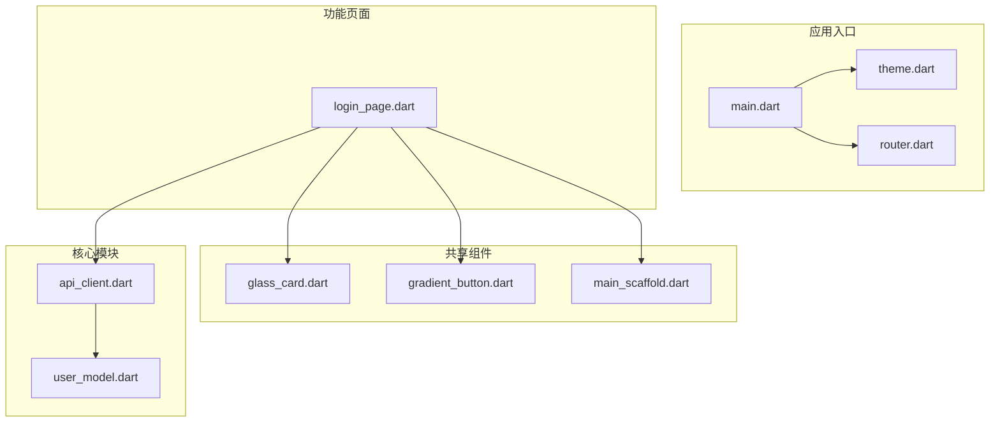
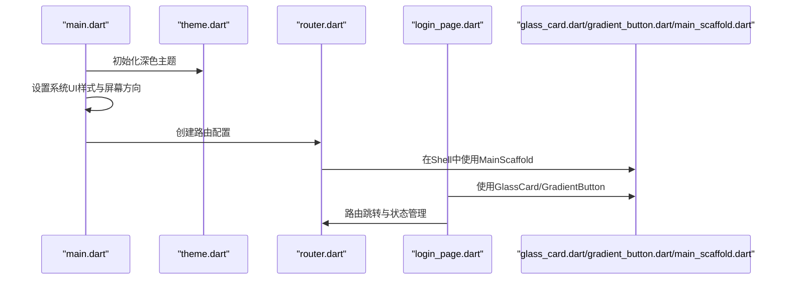
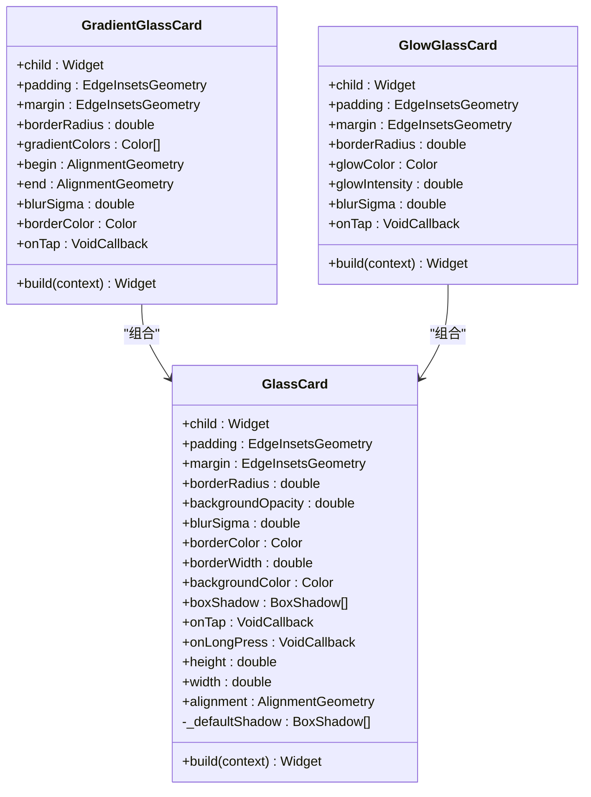
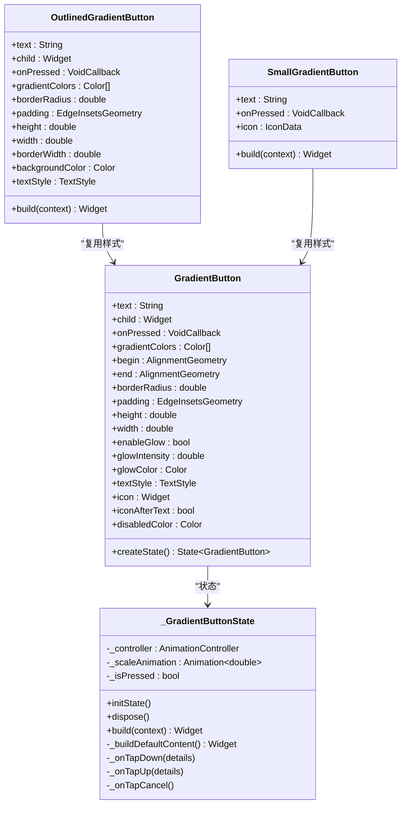
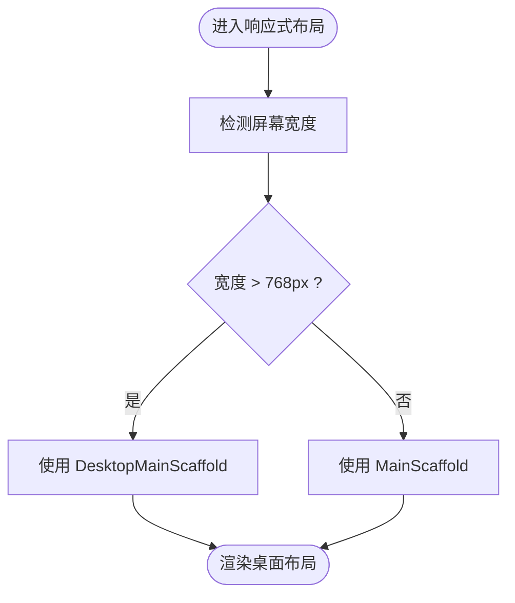
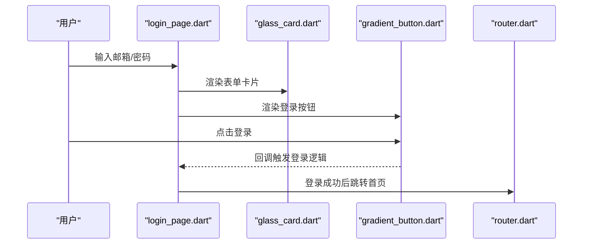
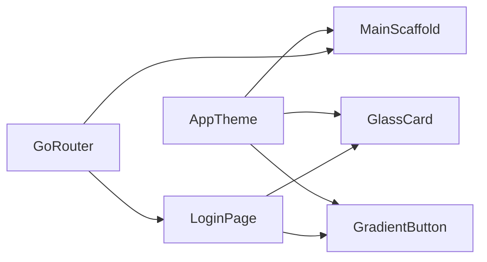

# UI组件库

<cite>
**本文档引用的文件**
- [main.dart](file://frontend/lib/main.dart)
- [theme.dart](file://frontend/lib/app/theme.dart)
- [router.dart](file://frontend/lib/app/router.dart)
- [glass_card.dart](file://frontend/lib/shared/widgets/glass_card.dart)
- [gradient_button.dart](file://frontend/lib/shared/widgets/gradient_button.dart)
- [main_scaffold.dart](file://frontend/lib/shared/widgets/main_scaffold.dart)
- [pubspec.yaml](file://frontend/pubspec.yaml)
- [login_page.dart](file://frontend/lib/features/auth/login_page.dart)
- [api_client.dart](file://frontend/lib/core/api/api_client.dart)
- [user_model.dart](file://frontend/lib/core/models/user_model.dart)
</cite>

## 目录
1. [简介](#简介)
2. [项目结构](#项目结构)
3. [核心组件](#核心组件)
4. [架构总览](#架构总览)
5. [组件详细分析](#组件详细分析)
6. [依赖关系分析](#依赖关系分析)
7. [性能考量](#性能考量)
8. [故障排查指南](#故障排查指南)
9. [结论](#结论)
10. [附录](#附录)

## 简介
本项目是一个基于 Flutter 的资产管理应用前端，采用 Riverpod 状态管理与 GoRouter 路由，构建了统一的主题系统与一组可复用的共享 UI 组件。本文档聚焦于共享组件库的设计与实现，涵盖通用 UI 组件的抽象与复用策略、属性定义、事件处理与样式定制、可访问性与响应式布局、主题系统与字体管理、测试策略、使用示例与最佳实践、版本管理与向后兼容性考虑，以及自定义组件的开发流程与设计规范。

## 项目结构
前端采用按功能域划分的目录结构，核心共享组件位于 shared/widgets 下，主题与路由配置位于 app 目录，业务功能位于 features 目录，核心工具与模型位于 core 目录。

**图表来源**
- [main.dart:1-86](file://frontend/lib/main.dart#L1-L86)
- [theme.dart:1-397](file://frontend/lib/app/theme.dart#L1-L397)
- [router.dart:1-278](file://frontend/lib/app/router.dart#L1-L278)
- [glass_card.dart:1-282](file://frontend/lib/shared/widgets/glass_card.dart#L1-L282)
- [gradient_button.dart:1-402](file://frontend/lib/shared/widgets/gradient_button.dart#L1-L402)
- [main_scaffold.dart:1-271](file://frontend/lib/shared/widgets/main_scaffold.dart#L1-L271)
- [login_page.dart:1-415](file://frontend/lib/features/auth/login_page.dart#L1-L415)
- [api_client.dart:1-364](file://frontend/lib/core/api/api_client.dart#L1-L364)
- [user_model.dart:1-73](file://frontend/lib/core/models/user_model.dart#L1-L73)

**章节来源**
- [main.dart:1-86](file://frontend/lib/main.dart#L1-L86)
- [pubspec.yaml:1-53](file://frontend/pubspec.yaml#L1-L53)

## 核心组件
本节概述共享组件库中的三大核心组件：毛玻璃卡片、渐变按钮与主布局骨架，并说明它们如何通过统一的主题系统进行样式控制与复用。

- 毛玻璃卡片系列：提供基础 GlassCard、渐变背景的 GradientGlassCard 与带发光边框的 GlowGlassCard，支持圆角、模糊、边框、阴影、点击反馈与尺寸控制。
- 渐变按钮系列：提供可交互的 GradientButton（含按压缩放动画与发光阴影）、OutlinedGradientButton（描边外层渐变）、SmallGradientButton（小型按钮）。
- 主布局骨架：提供移动端 MainScaffold、桌面端 DesktopMainScaffold 与响应式 ResponsiveMainScaffold，统一底部导航与侧边导航体验。

这些组件均通过 AppTheme 提供的颜色与样式常量进行渲染，确保视觉一致性与主题适配。

**章节来源**
- [glass_card.dart:1-282](file://frontend/lib/shared/widgets/glass_card.dart#L1-L282)
- [gradient_button.dart:1-402](file://frontend/lib/shared/widgets/gradient_button.dart#L1-L402)
- [main_scaffold.dart:1-271](file://frontend/lib/shared/widgets/main_scaffold.dart#L1-L271)
- [theme.dart:1-397](file://frontend/lib/app/theme.dart#L1-L397)

## 架构总览
应用启动时在 main.dart 中初始化 Provider、设置系统 UI 样式与首选屏幕方向，并注入 AppTheme 的深色主题。路由系统通过 GoRouter 配置，使用 StatefulShellRoute 管理底部导航分支；登录页 Login 使用共享组件构建表单与交互。

**图表来源**
- [main.dart:9-41](file://frontend/lib/main.dart#L9-L41)
- [theme.dart:48-291](file://frontend/lib/app/theme.dart#L48-L291)
- [router.dart:88-202](file://frontend/lib/app/router.dart#L88-L202)
- [login_page.dart:62-295](file://frontend/lib/features/auth/login_page.dart#L62-L295)
- [main_scaffold.dart:11-26](file://frontend/lib/shared/widgets/main_scaffold.dart#L11-L26)

## 组件详细分析

### 毛玻璃卡片组件族
- 组件族构成：GlassCard、GradientGlassCard、GlowGlassCard
- 关键属性
  - 子组件 child：卡片内容
  - 内外边距 padding/margin：控制内边距与外边距
  - 圆角半径 borderRadius：统一圆角风格
  - 背景透明度 backgroundOpacity：控制半透明强度
  - 模糊强度 blurSigma：BackdropFilter 模糊半径
  - 边框 borderColor/borderWidth：边框颜色与宽度
  - 背景颜色 backgroundColor：覆盖默认 surface
  - 阴影 boxShadow：自定义阴影
  - 点击事件 onTap/onLongPress：交互反馈
  - 尺寸 height/width/alignment：布局控制
- 实现要点
  - 使用 BackdropFilter + ImageFilter.blur 实现毛玻璃效果
  - 通过 Material + InkWell 提供点击涟漪与长按反馈
  - 默认阴影与边框颜色来自 AppTheme，保证主题一致性
  - GradientGlassCard 通过透明背景 + LinearGradient 实现渐变毛玻璃
  - GlowGlassCard 通过多层 BoxShadow 与边框发光增强视觉层次

**图表来源**
- [glass_card.dart:11-139](file://frontend/lib/shared/widgets/glass_card.dart#L11-L139)
- [glass_card.dart:142-213](file://frontend/lib/shared/widgets/glass_card.dart#L142-L213)
- [glass_card.dart:216-282](file://frontend/lib/shared/widgets/glass_card.dart#L216-L282)

**章节来源**
- [glass_card.dart:1-282](file://frontend/lib/shared/widgets/glass_card.dart#L1-L282)

### 渐变按钮组件族
- 组件族构成：GradientButton（有状态）、OutlinedGradientButton（无状态）、SmallGradientButton（小型）
- 关键属性
  - 文本 text 或子组件 child：优先使用 child
  - 点击回调 onPressed：禁用态自动屏蔽
  - 渐变颜色 gradientColors 与方向 begin/end：自定义渐变
  - 圆角半径 borderRadius、内边距 padding、高度/宽度
  - 发光效果 enableGlow、glowIntensity、glowColor：视觉反馈
  - 文本样式 textStyle、图标 icon 与位置 iconAfterText
  - 禁用背景色 disabledColor：禁用态样式
- 实现要点
  - GradientButton 使用 AnimationController 控制按压缩放动画
  - 通过 AnimatedBuilder 与 Transform.scale 实现按压反馈
  - 发光阴影根据按压状态动态调整强度与模糊半径
  - OutlinedGradientButton 通过内外两层渐变容器实现描边效果
  - SmallGradientButton 作为轻量级按钮，禁用发光并精简尺寸

**图表来源**
- [gradient_button.dart:9-88](file://frontend/lib/shared/widgets/gradient_button.dart#L9-L88)
- [gradient_button.dart:90-250](file://frontend/lib/shared/widgets/gradient_button.dart#L90-L250)
- [gradient_button.dart:253-362](file://frontend/lib/shared/widgets/gradient_button.dart#L253-L362)
- [gradient_button.dart:365-402](file://frontend/lib/shared/widgets/gradient_button.dart#L365-L402)

**章节来源**
- [gradient_button.dart:1-402](file://frontend/lib/shared/widgets/gradient_button.dart#L1-L402)

### 主布局骨架组件族
- 组件族构成：MainScaffold（移动端）、DesktopMainScaffold（桌面端）、ResponsiveMainScaffold（响应式）
- 关键属性
  - navigationShell：StatefulNavigationShell，承载各分支页面
- 实现要点
  - MainScaffold：底部导航栏，选中项高亮与图标缩放动画
  - DesktopMainScaffold：左侧固定导航栏，右侧主内容区，支持 Tooltip 与用户头像
  - ResponsiveMainScaffold：根据屏幕宽度自动切换布局
  - 所有导航项使用 AppTheme 的颜色与阴影，保持一致的视觉语言

**图表来源**
- [main_scaffold.dart:245-270](file://frontend/lib/shared/widgets/main_scaffold.dart#L245-L270)

**章节来源**
- [main_scaffold.dart:1-271](file://frontend/lib/shared/widgets/main_scaffold.dart#L1-L271)

### 登录页与组件集成
登录页通过 Riverpod 订阅认证状态，使用 GlassCard 包裹表单，使用 GradientButton 触发登录，使用第三方登录按钮与社交登录卡片。整体布局遵循 AppTheme 的色彩体系与字体规范。

**图表来源**
- [login_page.dart:19-62](file://frontend/lib/features/auth/login_page.dart#L19-L62)
- [glass_card.dart:11-139](file://frontend/lib/shared/widgets/glass_card.dart#L11-L139)
- [gradient_button.dart:90-212](file://frontend/lib/shared/widgets/gradient_button.dart#L90-L212)
- [router.dart:205-235](file://frontend/lib/app/router.dart#L205-L235)

**章节来源**
- [login_page.dart:1-415](file://frontend/lib/features/auth/login_page.dart#L1-L415)

## 依赖关系分析
- 组件对主题系统的依赖：所有组件均通过 AppTheme 获取颜色、阴影、文本样式等，确保全局一致性。
- 组件对路由系统的依赖：主布局组件依赖 GoRouter 的 StatefulNavigationShell 管理页面分支。
- 组件对第三方库的依赖：使用 google_fonts 提供字体、cached_network_image 支持网络图片、intl 处理国际化（预留）。
- 组件对状态管理的依赖：登录页通过 Riverpod 订阅认证状态，组件本身保持无状态或最小状态。

**图表来源**
- [theme.dart:1-397](file://frontend/lib/app/theme.dart#L1-L397)
- [glass_card.dart:1-282](file://frontend/lib/shared/widgets/glass_card.dart#L1-L282)
- [gradient_button.dart:1-402](file://frontend/lib/shared/widgets/gradient_button.dart#L1-L402)
- [main_scaffold.dart:1-271](file://frontend/lib/shared/widgets/main_scaffold.dart#L1-L271)
- [router.dart:1-278](file://frontend/lib/app/router.dart#L1-L278)
- [login_page.dart:1-415](file://frontend/lib/features/auth/login_page.dart#L1-L415)

**章节来源**
- [pubspec.yaml:9-53](file://frontend/pubspec.yaml#L9-L53)

## 性能考量
- 毛玻璃效果：BackdropFilter 与 ImageFilter.blur 在低端设备上可能带来性能压力，建议在低端设备降低 blurSigma 或禁用模糊。
- 动画与缩放：GradientButton 的按压动画使用 AnimationController，需在 dispose 中释放资源，避免内存泄漏。
- 响应式布局：ResponsiveMainScaffold 使用 LayoutBuilder，注意在复杂页面中避免频繁重建。
- 字体加载：google_fonts 在首次加载时可能产生抖动，建议在应用启动阶段预热字体或使用本地字体资源。
- 网络图片：登录页使用网络头像，建议结合缓存与占位图提升体验。

[本节为通用指导，无需特定文件来源]

## 故障排查指南
- HTTP 请求异常：ApiClient 抛出 ApiException，包含消息、状态码与数据。常见问题包括网络超时、401 未授权、403/404 资源错误等。拦截器会尝试刷新 Token 并重试，失败则清理 Token。
- 表单校验失败：登录页使用 Form 和 TextFormField 的 validator，确保邮箱格式正确与必填字段非空。
- 路由重定向：GoRouter 的重定向逻辑会根据认证状态将未登录用户重定向至欢迎页，已登录用户访问公开路由时重定向至首页。
- 主题不一致：若组件颜色与预期不符，检查 AppTheme 中对应颜色值是否被覆盖或未生效。

**章节来源**
- [api_client.dart:7-364](file://frontend/lib/core/api/api_client.dart#L7-L364)
- [login_page.dart:152-236](file://frontend/lib/features/auth/login_page.dart#L152-L236)
- [router.dart:60-85](file://frontend/lib/app/router.dart#L60-L85)
- [theme.dart:48-291](file://frontend/lib/app/theme.dart#L48-L291)

## 结论
该 UI 组件库通过统一的主题系统与共享组件实现了高内聚、低耦合的界面设计。组件族覆盖常用场景，具备良好的可扩展性与可维护性。配合响应式布局与状态管理，能够快速搭建一致性的跨平台界面。

[本节为总结，无需特定文件来源]

## 附录

### 可访问性设计
- 颜色对比：AppTheme 提供高对比度文本与表面颜色，确保在深色主题下具备良好可读性。
- 点击目标：按钮与导航项具备足够尺寸与间距，便于触控操作。
- 焦点与高亮：输入框与按钮在交互时提供明确的视觉反馈（涟漪、阴影、颜色变化）。

[本节为通用指导，无需特定文件来源]

### 响应式布局实现
- 移动端：MainScaffold 使用底部导航，图标与标签在选中时放大，提升可发现性。
- 桌面端：DesktopMainScaffold 使用侧边导航，支持 Tooltip 与用户头像，提升桌面端可用性。
- 自适应：ResponsiveMainScaffold 根据屏幕宽度自动切换布局，兼顾不同设备体验。

**章节来源**
- [main_scaffold.dart:117-271](file://frontend/lib/shared/widgets/main_scaffold.dart#L117-L271)

### 主题系统、颜色方案与字体管理
- 主题系统：AppTheme 提供完整的深色主题配置，包含核心色、强调色、功能色、轮廓色与语义色。
- 颜色方案：通过 ColorScheme 与各组件主题（AppBar、Card、InputDecoration、Button 等）统一风格。
- 字体管理：使用 google_fonts 与本地字体资源（SpaceGrotesk、Inter），在 ThemeData 中集中配置各级别文本样式。

**章节来源**
- [theme.dart:5-46](file://frontend/lib/app/theme.dart#L5-L46)
- [theme.dart:48-396](file://frontend/lib/app/theme.dart#L48-L396)
- [pubspec.yaml:32-53](file://frontend/pubspec.yaml#L32-L53)

### 组件属性与事件处理清单
- 毛玻璃卡片
  - 属性：child、padding、margin、borderRadius、backgroundOpacity、blurSigma、borderColor、borderWidth、backgroundColor、boxShadow、onTap、onLongPress、height、width、alignment
  - 事件：点击与长按
- 渐变按钮
  - 属性：text、child、onPressed、gradientColors、begin、end、borderRadius、padding、height、width、enableGlow、glowIntensity、glowColor、textStyle、icon、iconAfterText、disabledColor
  - 事件：点击
- 主布局骨架
  - 属性：navigationShell
  - 事件：导航切换

**章节来源**
- [glass_card.dart:57-139](file://frontend/lib/shared/widgets/glass_card.dart#L57-L139)
- [gradient_button.dart:59-84](file://frontend/lib/shared/widgets/gradient_button.dart#L59-L84)
- [main_scaffold.dart:11-26](file://frontend/lib/shared/widgets/main_scaffold.dart#L11-L26)

### 单元测试与集成测试策略
- 单元测试
  - 组件行为：验证 GradientButton 在按下/抬起时的动画与样式变化；验证 GlassCard 的点击反馈与模糊效果。
  - 主题一致性：断言组件渲染的颜色与 AppTheme 常量一致。
- 集成测试
  - 路由与导航：验证 MainScaffold 的导航切换与 DesktopMainScaffold 的桌面布局。
  - 登录流程：模拟登录页表单校验、按钮点击与路由跳转。
  - API 交互：使用 Mock 或测试服务器验证 ApiClient 的请求、错误处理与 Token 刷新流程。
- 测试工具
  - 使用 flutter_test 与 golden 测试进行快照对比，确保视觉回归。
  - 使用 mockito 或 http_mock_adapter 模拟网络请求。

[本节为通用指导，无需特定文件来源]

### 组件使用示例与最佳实践
- 使用示例
  - 登录表单：使用 GlassCard 包裹 Form，内部使用 TextFormField 与 GradientButton。
  - 导航：在 Shell 中使用 MainScaffold，确保底部导航项与图标正确映射。
- 最佳实践
  - 优先使用 AppTheme 常量，避免硬编码颜色与尺寸。
  - 保持组件职责单一，通过参数控制外观与行为。
  - 在复杂交互中使用状态管理（Riverpod）解耦 UI 与业务逻辑。
  - 为关键组件提供无障碍标识与对比度保障。

**章节来源**
- [login_page.dart:141-249](file://frontend/lib/features/auth/login_page.dart#L141-L249)
- [router.dart:112-169](file://frontend/lib/app/router.dart#L112-L169)

### 版本管理与向后兼容性
- 版本号：pubspec.yaml 中定义版本与构建号，遵循语义化版本控制。
- 向后兼容
  - 新增组件时保留现有接口不变，通过可选参数扩展能力。
  - 修改主题颜色时提供过渡方案，避免破坏既有布局。
  - 对外部依赖升级时进行充分测试，确保动画与布局不受影响。

**章节来源**
- [pubspec.yaml:4](file://frontend/pubspec.yaml#L4)
- [theme.dart:48-291](file://frontend/lib/app/theme.dart#L48-L291)

### 自定义组件开发流程与设计规范
- 开发流程
  - 明确组件职责与输入输出，定义清晰的属性与事件。
  - 在 AppTheme 中统一颜色与样式，确保与整体风格一致。
  - 编写单元测试与集成测试，覆盖正常与异常场景。
  - 提供文档与示例，便于团队复用。
- 设计规范
  - 使用统一的圆角、阴影与动画时长。
  - 保持文本层级与字体家族的一致性。
  - 为交互元素提供明确的视觉反馈与无障碍支持。

[本节为通用指导，无需特定文件来源]