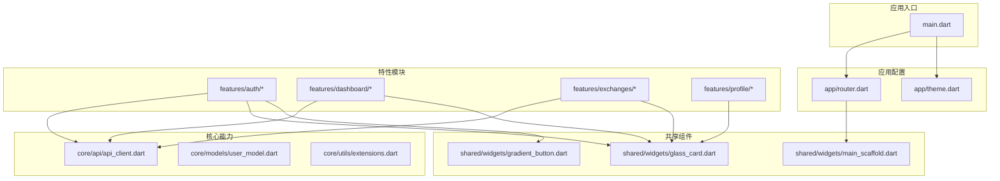
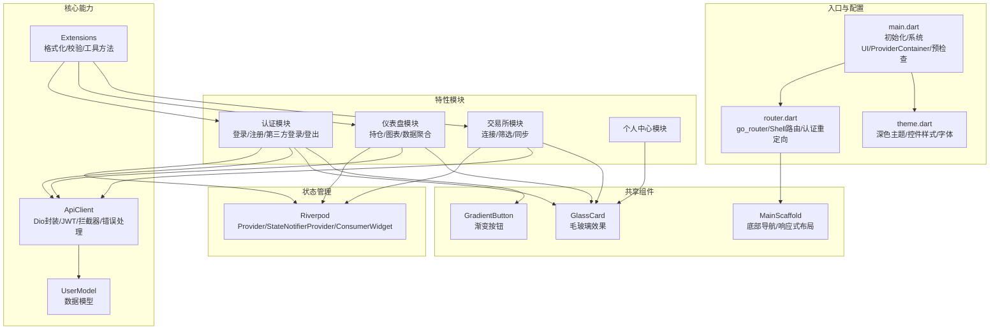
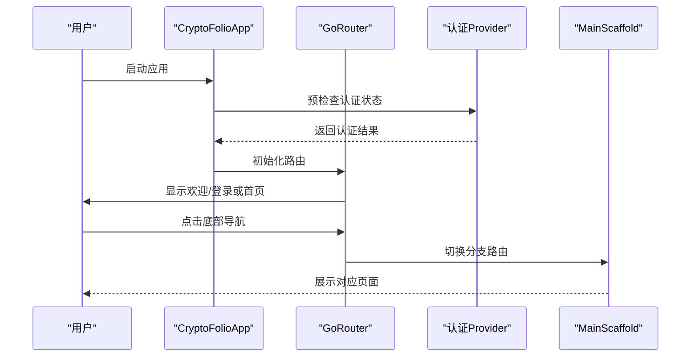
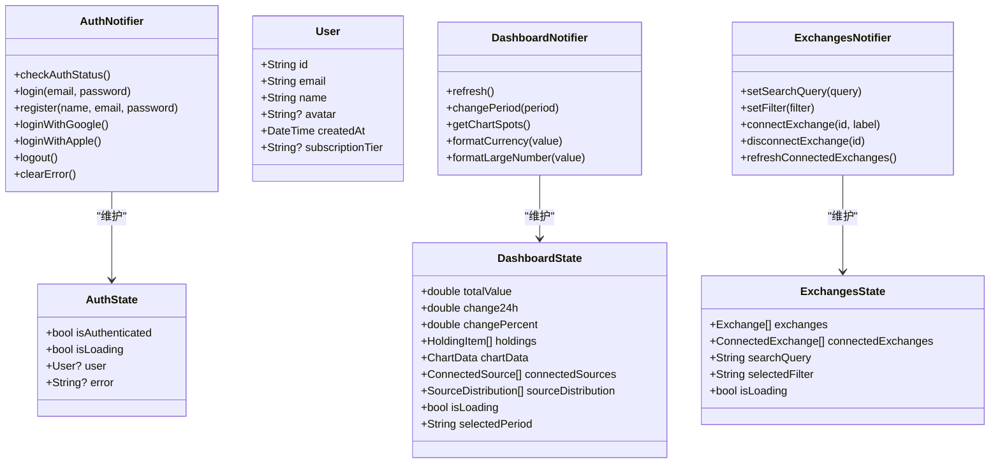
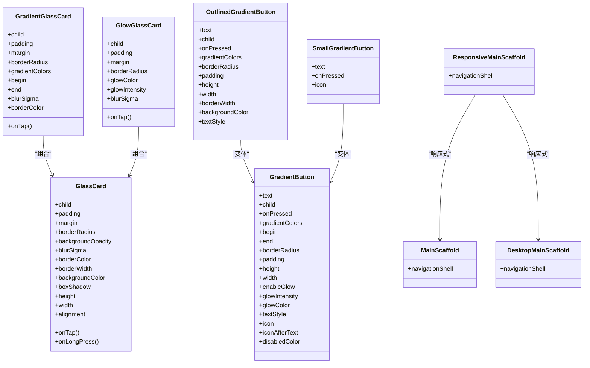
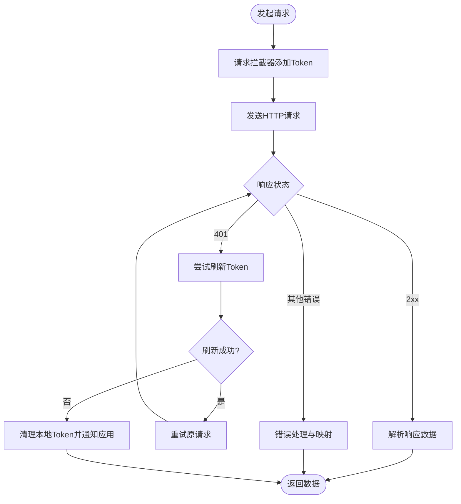
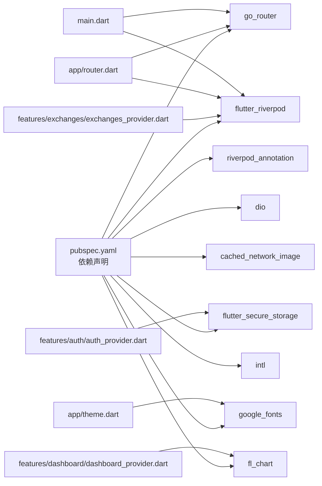

# 前端应用

<cite>
**本文引用的文件**
- [frontend/lib/main.dart](file://frontend/lib/main.dart)
- [frontend/pubspec.yaml](file://frontend/pubspec.yaml)
- [frontend/lib/app/router.dart](file://frontend/lib/app/router.dart)
- [frontend/lib/app/theme.dart](file://frontend/lib/app/theme.dart)
- [frontend/lib/core/api/api_client.dart](file://frontend/lib/core/api/api_client.dart)
- [frontend/lib/core/models/user_model.dart](file://frontend/lib/core/models/user_model.dart)
- [frontend/lib/features/auth/auth_provider.dart](file://frontend/lib/features/auth/auth_provider.dart)
- [frontend/lib/features/auth/login_page.dart](file://frontend/lib/features/auth/login_page.dart)
- [frontend/lib/features/dashboard/dashboard_provider.dart](file://frontend/lib/features/dashboard/dashboard_provider.dart)
- [frontend/lib/features/exchanges/exchanges_provider.dart](file://frontend/lib/features/exchanges/exchanges_provider.dart)
- [frontend/lib/shared/widgets/main_scaffold.dart](file://frontend/lib/shared/widgets/main_scaffold.dart)
- [frontend/lib/shared/widgets/glass_card.dart](file://frontend/lib/shared/widgets/glass_card.dart)
- [frontend/lib/shared/widgets/gradient_button.dart](file://frontend/lib/shared/widgets/gradient_button.dart)
- [frontend/lib/core/utils/extensions.dart](file://frontend/lib/core/utils/extensions.dart)
</cite>

## 目录
1. [简介](#简介)
2. [项目结构](#项目结构)
3. [核心组件](#核心组件)
4. [架构总览](#架构总览)
5. [详细组件分析](#详细组件分析)
6. [依赖关系分析](#依赖关系分析)
7. [性能考虑](#性能考虑)
8. [故障排查指南](#故障排查指南)
9. [结论](#结论)
10. [附录](#附录)

## 简介
本文件面向基于 Flutter 的移动应用 CryptoFolio，系统性梳理其前端架构与实现要点，覆盖模块化设计、状态管理（Riverpod）、路由系统（go_router）、UI 组件库、主题与响应式设计、国际化与多语言支持现状、页面导航流程、用户交互模式、用户体验优化以及与后端 API 的集成与数据同步机制。文档同时提供组件使用示例与最佳实践建议，帮助开发者快速理解并高效迭代。

## 项目结构
前端采用清晰的分层与功能域划分：
- app：应用入口、路由与主题配置
- core：通用能力（API 客户端、模型、工具扩展）
- features：特性模块（认证、仪表盘、交易所、个人中心等）
- shared：可复用 UI 组件（毛玻璃卡片、渐变按钮、主布局等）

**图示来源**
- [frontend/lib/main.dart:1-86](file://frontend/lib/main.dart#L1-L86)
- [frontend/lib/app/router.dart:1-278](file://frontend/lib/app/router.dart#L1-L278)
- [frontend/lib/app/theme.dart:1-397](file://frontend/lib/app/theme.dart#L1-L397)
- [frontend/lib/core/api/api_client.dart:1-364](file://frontend/lib/core/api/api_client.dart#L1-L364)
- [frontend/lib/core/models/user_model.dart:1-73](file://frontend/lib/core/models/user_model.dart#L1-L73)
- [frontend/lib/core/utils/extensions.dart:1-361](file://frontend/lib/core/utils/extensions.dart#L1-L361)
- [frontend/lib/features/auth/auth_provider.dart:1-418](file://frontend/lib/features/auth/auth_provider.dart#L1-L418)
- [frontend/lib/features/dashboard/dashboard_provider.dart:1-427](file://frontend/lib/features/dashboard/dashboard_provider.dart#L1-L427)
- [frontend/lib/features/exchanges/exchanges_provider.dart:1-326](file://frontend/lib/features/exchanges/exchanges_provider.dart#L1-L326)
- [frontend/lib/shared/widgets/main_scaffold.dart:1-271](file://frontend/lib/shared/widgets/main_scaffold.dart#L1-L271)
- [frontend/lib/shared/widgets/glass_card.dart:1-282](file://frontend/lib/shared/widgets/glass_card.dart#L1-L282)
- [frontend/lib/shared/widgets/gradient_button.dart:1-402](file://frontend/lib/shared/widgets/gradient_button.dart#L1-L402)

**章节来源**
- [frontend/lib/main.dart:1-86](file://frontend/lib/main.dart#L1-L86)
- [frontend/lib/app/router.dart:1-278](file://frontend/lib/app/router.dart#L1-L278)
- [frontend/lib/app/theme.dart:1-397](file://frontend/lib/app/theme.dart#L1-L397)

## 核心组件
- 应用入口与初始化：设置系统 UI、设备方向、ProviderContainer、预检查认证状态、启动应用。
- 路由系统：基于 go_router 的 Shell 路由，支持底部导航与子路由；内置认证重定向逻辑。
- 主题系统：基于 Material 3 的深色主题，统一配色、字体、控件样式。
- 状态管理：Riverpod 提供 Provider、StateNotifierProvider、ConsumerWidget，实现细粒度状态与跨组件共享。
- API 客户端：基于 Dio，统一拦截器、Token 管理、错误处理与日志输出。
- UI 组件库：毛玻璃卡片、渐变按钮、主布局（移动端/桌面端响应式）。
- 工具扩展：数字/字符串/日期/颜色/BuildContext/Widget 扩展，提升开发效率与一致性。

**章节来源**
- [frontend/lib/main.dart:9-41](file://frontend/lib/main.dart#L9-L41)
- [frontend/lib/app/router.dart:88-202](file://frontend/lib/app/router.dart#L88-L202)
- [frontend/lib/app/theme.dart:48-291](file://frontend/lib/app/theme.dart#L48-L291)
- [frontend/lib/core/api/api_client.dart:24-364](file://frontend/lib/core/api/api_client.dart#L24-L364)
- [frontend/lib/shared/widgets/glass_card.dart:11-139](file://frontend/lib/shared/widgets/glass_card.dart#L11-L139)
- [frontend/lib/shared/widgets/gradient_button.dart:9-250](file://frontend/lib/shared/widgets/gradient_button.dart#L9-L250)
- [frontend/lib/core/utils/extensions.dart:4-361](file://frontend/lib/core/utils/extensions.dart#L4-L361)

## 架构总览
应用采用“入口配置 → 路由与布局 → 特性模块 → 共享组件 → 核心能力”的分层架构。Riverpod 作为状态管理中枢，围绕各特性模块提供独立的 Provider；API 客户端通过拦截器统一处理鉴权与错误；主题系统贯穿全局，确保视觉一致性。

**图示来源**
- [frontend/lib/main.dart:9-41](file://frontend/lib/main.dart#L9-L41)
- [frontend/lib/app/router.dart:88-202](file://frontend/lib/app/router.dart#L88-L202)
- [frontend/lib/app/theme.dart:48-291](file://frontend/lib/app/theme.dart#L48-L291)
- [frontend/lib/features/auth/auth_provider.dart:90-358](file://frontend/lib/features/auth/auth_provider.dart#L90-L358)
- [frontend/lib/features/dashboard/dashboard_provider.dart:163-386](file://frontend/lib/features/dashboard/dashboard_provider.dart#L163-L386)
- [frontend/lib/features/exchanges/exchanges_provider.dart:137-307](file://frontend/lib/features/exchanges/exchanges_provider.dart#L137-L307)
- [frontend/lib/shared/widgets/main_scaffold.dart:11-114](file://frontend/lib/shared/widgets/main_scaffold.dart#L11-L114)
- [frontend/lib/shared/widgets/glass_card.dart:11-139](file://frontend/lib/shared/widgets/glass_card.dart#L11-L139)
- [frontend/lib/shared/widgets/gradient_button.dart:9-250](file://frontend/lib/shared/widgets/gradient_button.dart#L9-L250)
- [frontend/lib/core/api/api_client.dart:24-364](file://frontend/lib/core/api/api_client.dart#L24-L364)
- [frontend/lib/core/models/user_model.dart:1-73](file://frontend/lib/core/models/user_model.dart#L1-L73)
- [frontend/lib/core/utils/extensions.dart:4-361](file://frontend/lib/core/utils/extensions.dart#L4-L361)

## 详细组件分析

### 路由系统与导航流程
- 路由定义：认证路由（无需底部导航）与 Shell 路由（带底部导航）两类；支持嵌套路由与参数传递。
- 认证重定向：根据认证状态与目标路由进行跳转，保护非公开路由。
- 导航 Shell：MainScaffold 将底部导航与分支路由结合，支持移动端与桌面端响应式布局。

**图示来源**
- [frontend/lib/main.dart:33-40](file://frontend/lib/main.dart#L33-L40)
- [frontend/lib/app/router.dart:60-85](file://frontend/lib/app/router.dart#L60-L85)
- [frontend/lib/app/router.dart:112-169](file://frontend/lib/app/router.dart#L112-L169)
- [frontend/lib/shared/widgets/main_scaffold.dart:11-114](file://frontend/lib/shared/widgets/main_scaffold.dart#L11-L114)

**章节来源**
- [frontend/lib/app/router.dart:17-85](file://frontend/lib/app/router.dart#L17-L85)
- [frontend/lib/app/router.dart:88-202](file://frontend/lib/app/router.dart#L88-L202)
- [frontend/lib/shared/widgets/main_scaffold.dart:11-114](file://frontend/lib/shared/widgets/main_scaffold.dart#L11-L114)

### Riverpod 状态管理与 Provider 体系
- 认证状态：AuthNotifier 管理登录、注册、第三方登录、登出与本地存储；提供 isAuthenticated、currentUser 等派生 Provider。
- 仪表盘状态：DashboardNotifier 管理总资产、涨跌幅、持仓、图表数据与筛选周期；提供多个派生 Provider。
- 交易所状态：ExchangesNotifier 管理交易所列表、连接状态、筛选与搜索；提供过滤后的列表与连接 ID 列表。

**图示来源**
- [frontend/lib/features/auth/auth_provider.dart:90-358](file://frontend/lib/features/auth/auth_provider.dart#L90-L358)
- [frontend/lib/features/dashboard/dashboard_provider.dart:163-386](file://frontend/lib/features/dashboard/dashboard_provider.dart#L163-L386)
- [frontend/lib/features/exchanges/exchanges_provider.dart:137-307](file://frontend/lib/features/exchanges/exchanges_provider.dart#L137-L307)

**章节来源**
- [frontend/lib/features/auth/auth_provider.dart:1-418](file://frontend/lib/features/auth/auth_provider.dart#L1-L418)
- [frontend/lib/features/dashboard/dashboard_provider.dart:1-427](file://frontend/lib/features/dashboard/dashboard_provider.dart#L1-L427)
- [frontend/lib/features/exchanges/exchanges_provider.dart:1-326](file://frontend/lib/features/exchanges/exchanges_provider.dart#L1-L326)

### UI 组件库与复用策略
- 毛玻璃卡片（GlassCard/GlowGlassCard/GradientGlassCard）：统一圆角、边框、阴影与点击反馈，支持模糊与发光效果。
- 渐变按钮（GradientButton/OutlinedGradientButton/SmallGradientButton）：统一动画、渐变与图标排版，适配不同场景。
- 主布局（MainScaffold/ResponsiveMainScaffold/DesktopMainScaffold）：移动端底部导航与桌面端侧边导航，自动响应屏幕宽度。

**图示来源**
- [frontend/lib/shared/widgets/glass_card.dart:11-282](file://frontend/lib/shared/widgets/glass_card.dart#L11-L282)
- [frontend/lib/shared/widgets/gradient_button.dart:9-402](file://frontend/lib/shared/widgets/gradient_button.dart#L9-L402)
- [frontend/lib/shared/widgets/main_scaffold.dart:11-271](file://frontend/lib/shared/widgets/main_scaffold.dart#L11-L271)

**章节来源**
- [frontend/lib/shared/widgets/glass_card.dart:1-282](file://frontend/lib/shared/widgets/glass_card.dart#L1-L282)
- [frontend/lib/shared/widgets/gradient_button.dart:1-402](file://frontend/lib/shared/widgets/gradient_button.dart#L1-L402)
- [frontend/lib/shared/widgets/main_scaffold.dart:1-271](file://frontend/lib/shared/widgets/main_scaffold.dart#L1-L271)

### 国际化与主题系统
- 主题系统：深色主题（Material 3），统一配色、字体、控件样式与交互反馈；AppBar、卡片、输入框、按钮、底部导航、分割线、列表瓦片、开关、Chip 等均有定制。
- 国际化：当前未启用本地化委托与支持语言配置，可在应用配置处按需开启。

**章节来源**
- [frontend/lib/app/theme.dart:48-395](file://frontend/lib/app/theme.dart#L48-L395)
- [frontend/lib/main.dart:62-70](file://frontend/lib/main.dart#L62-L70)

### 响应式设计与用户体验
- 响应式布局：根据屏幕宽度自动切换移动端底部导航或桌面端侧边导航，保证在不同设备上的可用性。
- 交互反馈：按钮按压缩放动画、毛玻璃卡片点击水波纹、发光阴影等增强触控体验。
- 字体缩放：固定文本缩放因子，避免系统字体大小影响布局一致性。

**章节来源**
- [frontend/lib/shared/widgets/main_scaffold.dart:242-271](file://frontend/lib/shared/widgets/main_scaffold.dart#L242-L271)
- [frontend/lib/main.dart:75-82](file://frontend/lib/main.dart#L75-L82)

### 与后端 API 的集成与数据同步
- API 客户端：基于 Dio，统一超时、头部、拦截器与日志；自动注入 Authorization 头；处理 401 并尝试刷新 Token；封装常用 HTTP 方法。
- 认证与 Token：Secure Storage 存储 auth_token 与 refresh_token；登录/注册/第三方登录成功后持久化用户信息；登出清理本地存储。
- 数据模型：UserModel 提供序列化/反序列化；扩展提供格式化与校验工具。
- 特性模块：认证、仪表盘、交易所模块均通过 ApiClient 发起请求；Dashboard 与 Exchanges 模块提供模拟数据与刷新逻辑。

**图示来源**
- [frontend/lib/core/api/api_client.dart:53-121](file://frontend/lib/core/api/api_client.dart#L53-L121)
- [frontend/lib/core/api/api_client.dart:123-181](file://frontend/lib/core/api/api_client.dart#L123-L181)
- [frontend/lib/core/api/api_client.dart:302-362](file://frontend/lib/core/api/api_client.dart#L302-L362)

**章节来源**
- [frontend/lib/core/api/api_client.dart:1-364](file://frontend/lib/core/api/api_client.dart#L1-L364)
- [frontend/lib/core/models/user_model.dart:1-73](file://frontend/lib/core/models/user_model.dart#L1-L73)
- [frontend/lib/features/auth/auth_provider.dart:90-358](file://frontend/lib/features/auth/auth_provider.dart#L90-L358)
- [frontend/lib/features/dashboard/dashboard_provider.dart:163-386](file://frontend/lib/features/dashboard/dashboard_provider.dart#L163-L386)
- [frontend/lib/features/exchanges/exchanges_provider.dart:137-307](file://frontend/lib/features/exchanges/exchanges_provider.dart#L137-L307)

## 依赖关系分析
- 依赖声明：Flutter SDK、go_router、flutter_riverpod、riverpod_annotation、dio、cached_network_image、google_fonts、intl、flutter_secure_storage、fl_chart。
- 关键耦合：路由依赖 Provider 以读取认证状态；认证模块依赖 Secure Storage；特性模块依赖 ApiClient；UI 组件依赖主题系统。

**图示来源**
- [frontend/pubspec.yaml:9-27](file://frontend/pubspec.yaml#L9-L27)
- [frontend/lib/features/auth/auth_provider.dart:9-17](file://frontend/lib/features/auth/auth_provider.dart#L9-L17)
- [frontend/lib/features/dashboard/dashboard_provider.dart:1-2](file://frontend/lib/features/dashboard/dashboard_provider.dart#L1-L2)
- [frontend/lib/features/exchanges/exchanges_provider.dart:1-1](file://frontend/lib/features/exchanges/exchanges_provider.dart#L1-L1)
- [frontend/lib/app/router.dart:1-3](file://frontend/lib/app/router.dart#L1-L3)
- [frontend/lib/main.dart:1-7](file://frontend/lib/main.dart#L1-L7)
- [frontend/lib/app/theme.dart:1-3](file://frontend/lib/app/theme.dart#L1-L3)

**章节来源**
- [frontend/pubspec.yaml:1-53](file://frontend/pubspec.yaml#L1-L53)

## 性能考虑
- 状态粒度：Riverpod 将状态拆分为细粒度 Provider，减少不必要的重建与重绘。
- 组件复用：共享组件统一风格与交互，降低重复计算与渲染成本。
- 图表优化：Dashboard 使用 fl_chart，建议在大数据集时限制点数量或采用虚拟化策略。
- 网络优化：Dio 统一超时与日志，建议在生产环境关闭日志拦截器；Token 刷新失败及时清理本地存储，避免无效重试。
- 响应式布局：根据屏幕宽度选择布局，减少复杂容器层级，提高滚动性能。

## 故障排查指南
- 登录失败：检查表单验证、错误提示展示与认证 Provider 的错误状态；确认 Secure Storage 中 token 与用户数据是否正确写入。
- 路由跳转异常：核对认证重定向逻辑与路由路径；确认 Shell 分支索引与当前页面索引一致。
- 图表数据异常：检查 DashboardNotifier 的数据生成与周期切换逻辑；确认 FlSpot 列表构建。
- API 请求失败：查看拦截器日志与错误映射；确认 Token 是否过期并触发刷新流程。
- 主题不生效：检查主题初始化与 MaterialApp.router 的主题配置；确认控件样式覆盖是否正确。

**章节来源**
- [frontend/lib/features/auth/login_page.dart:33-59](file://frontend/lib/features/auth/login_page.dart#L33-L59)
- [frontend/lib/app/router.dart:60-85](file://frontend/lib/app/router.dart#L60-L85)
- [frontend/lib/features/dashboard/dashboard_provider.dart:329-357](file://frontend/lib/features/dashboard/dashboard_provider.dart#L329-L357)
- [frontend/lib/core/api/api_client.dart:53-121](file://frontend/lib/core/api/api_client.dart#L53-L121)
- [frontend/lib/app/theme.dart:48-291](file://frontend/lib/app/theme.dart#L48-L291)

## 结论
该前端应用以 Riverpod 为核心状态管理框架，结合 go_router 的 Shell 路由与统一主题系统，实现了模块化、可扩展与高一致性的移动应用架构。通过共享组件库与工具扩展，提升了开发效率与用户体验。后续可在国际化、真实 API 集成、图表性能优化与测试覆盖等方面持续完善。

## 附录
- 组件使用示例与最佳实践
  - 登录页：使用 GlassCard 与 GradientButton 构建表单与按钮；通过 ConsumerWidget 订阅认证 Provider；在登录成功后跳转首页。
  - 仪表盘：使用 DashboardNotifier 管理总资产与图表数据；通过 Provider 监听特定字段；在刷新时更新状态。
  - 交易所：使用 ExchangesNotifier 管理连接状态与筛选；通过过滤后的 Provider 渲染列表。
  - 主题：统一使用 AppTheme 的颜色与样式；在深色模式下保持一致的视觉体验。
  - 工具扩展：利用 NumberExtensions/DateTimeExtensions/StringExtensions 等扩展进行格式化与校验，减少样板代码。

**章节来源**
- [frontend/lib/features/auth/login_page.dart:1-415](file://frontend/lib/features/auth/login_page.dart#L1-L415)
- [frontend/lib/features/dashboard/dashboard_provider.dart:1-427](file://frontend/lib/features/dashboard/dashboard_provider.dart#L1-L427)
- [frontend/lib/features/exchanges/exchanges_provider.dart:1-326](file://frontend/lib/features/exchanges/exchanges_provider.dart#L1-L326)
- [frontend/lib/app/theme.dart:1-397](file://frontend/lib/app/theme.dart#L1-L397)
- [frontend/lib/core/utils/extensions.dart:1-361](file://frontend/lib/core/utils/extensions.dart#L1-L361)