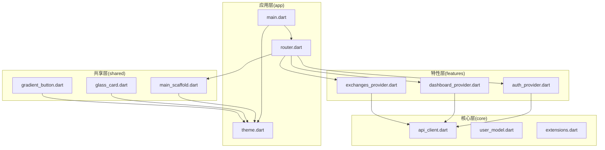
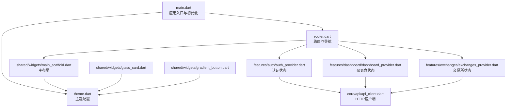
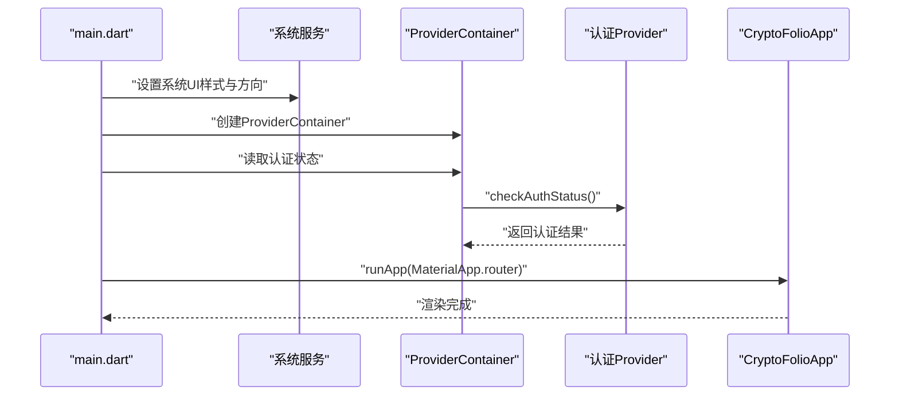
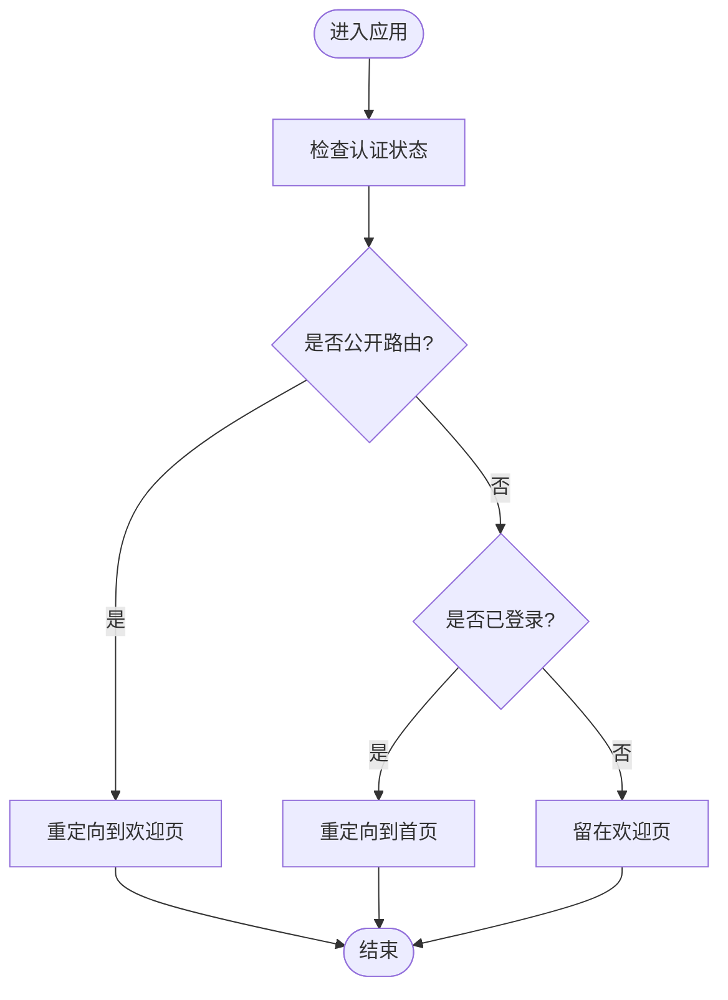
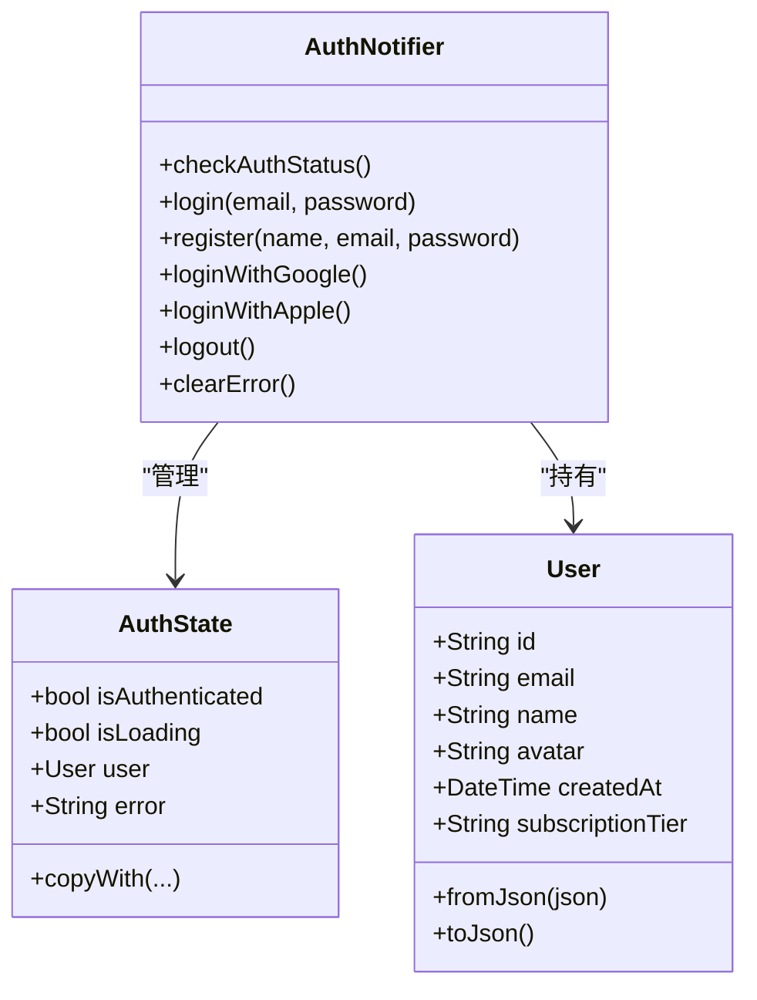
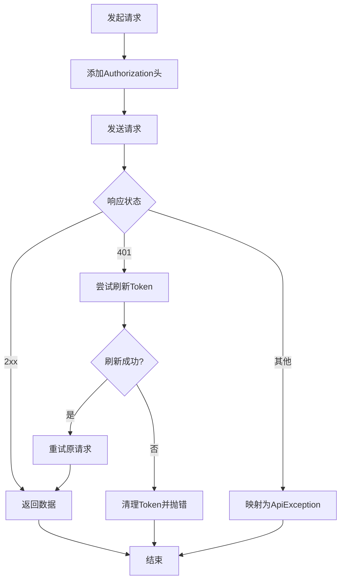
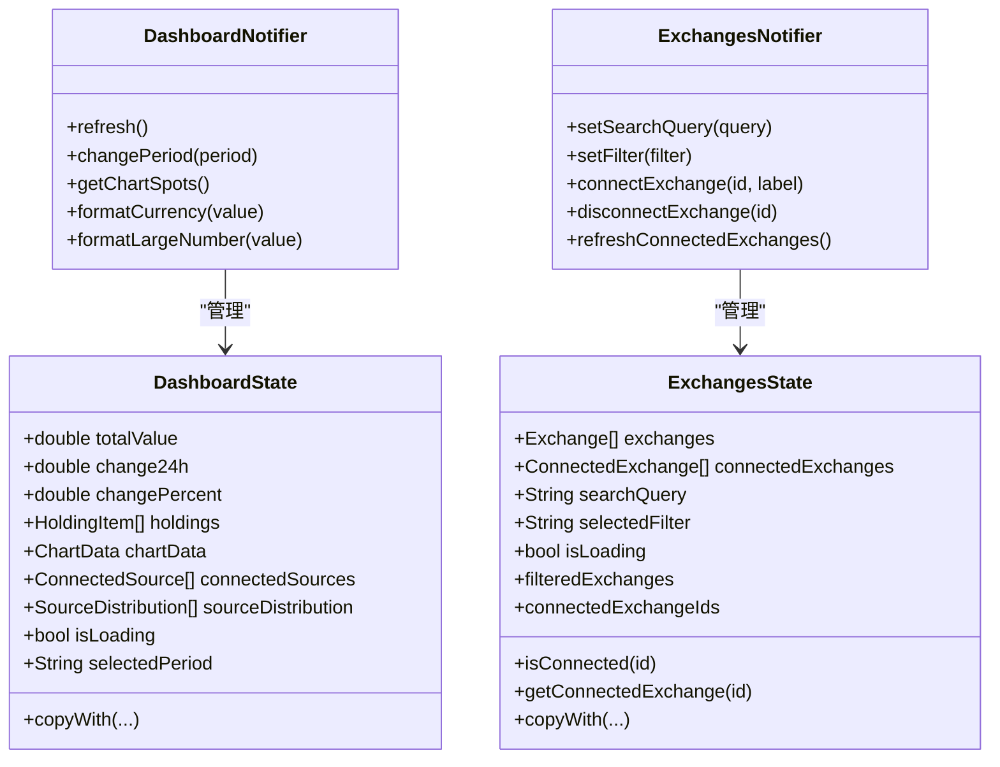
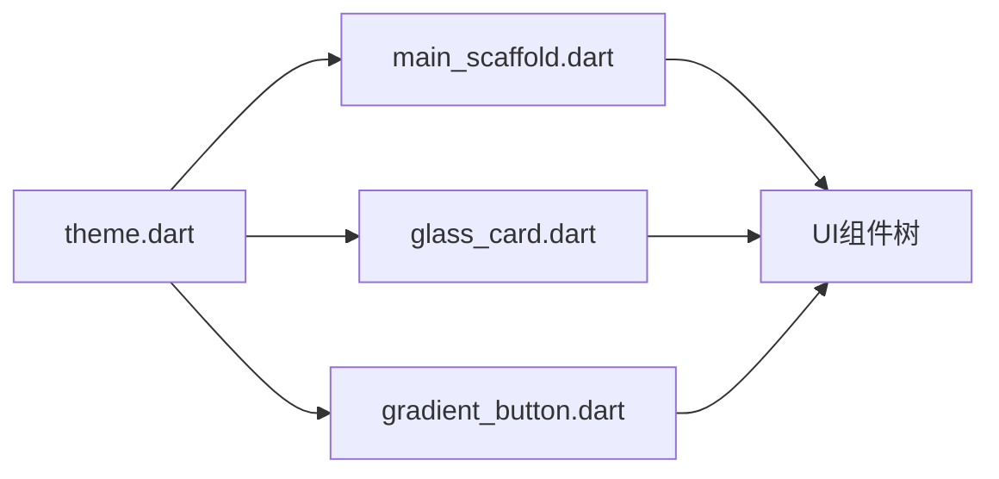
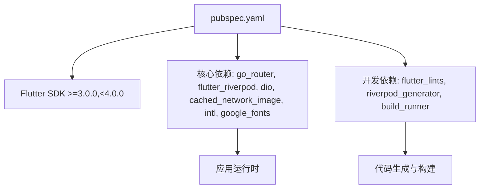

# 前端架构设计

<cite>
**本文引用的文件**
- [main.dart](file://frontend/lib/main.dart)
- [router.dart](file://frontend/lib/app/router.dart)
- [theme.dart](file://frontend/lib/app/theme.dart)
- [api_client.dart](file://frontend/lib/core/api/api_client.dart)
- [user_model.dart](file://frontend/lib/core/models/user_model.dart)
- [auth_provider.dart](file://frontend/lib/features/auth/auth_provider.dart)
- [dashboard_provider.dart](file://frontend/lib/features/dashboard/dashboard_provider.dart)
- [exchanges_provider.dart](file://frontend/lib/features/exchanges/exchanges_provider.dart)
- [main_scaffold.dart](file://frontend/lib/shared/widgets/main_scaffold.dart)
- [glass_card.dart](file://frontend/lib/shared/widgets/glass_card.dart)
- [gradient_button.dart](file://frontend/lib/shared/widgets/gradient_button.dart)
- [pubspec.yaml](file://frontend/pubspec.yaml)
</cite>

## 目录
1. [简介](#简介)
2. [项目结构](#项目结构)
3. [核心组件](#核心组件)
4. [架构总览](#架构总览)
5. [详细组件分析](#详细组件分析)
6. [依赖分析](#依赖分析)
7. [性能考虑](#性能考虑)
8. [故障排查指南](#故障排查指南)
9. [结论](#结论)
10. [附录](#附录)

## 简介
本文件面向Flutter前端架构设计，围绕模块化架构（app、core、features、shared）进行系统性梳理，重点阐述：
- 应用入口main.dart的初始化与启动流程
- 模块职责划分与组织结构
- 依赖管理、版本控制与构建配置
- 架构决策的技术考量与设计模式应用
- 模块间依赖关系、数据流向与通信机制
- 扩展新功能模块与维护架构一致性的方法

## 项目结构
前端采用清晰的分层模块化组织：
- app：应用入口、路由与主题配置
- core：通用基础设施（HTTP客户端、模型、工具）
- features：业务特性模块（认证、仪表盘、交易所、个人中心等）
- shared：跨模块可复用的UI组件与通用能力

**图表来源**
- [main.dart:1-86](file://frontend/lib/main.dart#L1-L86)
- [router.dart:1-278](file://frontend/lib/app/router.dart#L1-L278)
- [theme.dart:1-397](file://frontend/lib/app/theme.dart#L1-L397)
- [api_client.dart:1-364](file://frontend/lib/core/api/api_client.dart#L1-L364)
- [user_model.dart:1-73](file://frontend/lib/core/models/user_model.dart#L1-L73)
- [auth_provider.dart:1-418](file://frontend/lib/features/auth/auth_provider.dart#L1-L418)
- [dashboard_provider.dart:1-427](file://frontend/lib/features/dashboard/dashboard_provider.dart#L1-L427)
- [exchanges_provider.dart:1-326](file://frontend/lib/features/exchanges/exchanges_provider.dart#L1-L326)
- [main_scaffold.dart:1-271](file://frontend/lib/shared/widgets/main_scaffold.dart#L1-L271)
- [glass_card.dart:1-282](file://frontend/lib/shared/widgets/glass_card.dart#L1-L282)
- [gradient_button.dart:1-402](file://frontend/lib/shared/widgets/gradient_button.dart#L1-L402)

**章节来源**
- [main.dart:1-86](file://frontend/lib/main.dart#L1-L86)
- [router.dart:1-278](file://frontend/lib/app/router.dart#L1-L278)
- [theme.dart:1-397](file://frontend/lib/app/theme.dart#L1-L397)

## 核心组件
- 应用入口与初始化
  - 初始化系统UI样式与屏幕方向
  - 创建ProviderContainer并预检查认证状态
  - 使用UncontrolledProviderScope注入Provider容器
  - 配置MaterialApp.router，启用路由与主题
- 路由与导航
  - 使用GoRouter定义认证页与主页面（带底部导航）两类路由
  - 通过StatefulShellRoute实现底部导航分支
  - 提供路由扩展方法简化导航
- 主题系统
  - 自定义深色主题，覆盖Material 3配色与组件样式
  - 统一字体、卡片、输入框、按钮、底部导航等主题
- HTTP客户端
  - 基于Dio封装，统一超时、头部、日志与拦截器
  - 自动携带与刷新JWT令牌，集中异常处理
- 认证与状态管理
  - Riverpod StateNotifier管理AuthState与用户信息
  - 使用FlutterSecureStorage持久化token与用户数据
  - 提供登录、注册、第三方登录与登出能力
- 特性模块
  - 仪表盘：持仓、图表、连接数据源等数据模型与状态
  - 交易所：支持列表、连接状态、筛选与搜索
- 共享组件
  - MainScaffold：底部导航布局与响应式桌面布局
  - GlassCard/GlowGlassCard/GradientGlassCard：毛玻璃与发光效果卡片
  - GradientButton/OutlinedGradientButton/SmallGradientButton：渐变风格按钮

**章节来源**
- [main.dart:9-41](file://frontend/lib/main.dart#L9-L41)
- [router.dart:88-202](file://frontend/lib/app/router.dart#L88-L202)
- [theme.dart:47-291](file://frontend/lib/app/theme.dart#L47-L291)
- [api_client.dart:24-364](file://frontend/lib/core/api/api_client.dart#L24-L364)
- [auth_provider.dart:90-358](file://frontend/lib/features/auth/auth_provider.dart#L90-L358)
- [dashboard_provider.dart:163-386](file://frontend/lib/features/dashboard/dashboard_provider.dart#L163-L386)
- [exchanges_provider.dart:137-307](file://frontend/lib/features/exchanges/exchanges_provider.dart#L137-L307)
- [main_scaffold.dart:11-114](file://frontend/lib/shared/widgets/main_scaffold.dart#L11-L114)
- [glass_card.dart:11-139](file://frontend/lib/shared/widgets/glass_card.dart#L11-L139)
- [gradient_button.dart:9-250](file://frontend/lib/shared/widgets/gradient_button.dart#L9-L250)

## 架构总览
整体采用“入口初始化 → 路由与主题 → 特性模块（Riverpod状态） → 共享组件”的分层架构。模块间通过Riverpod Provider解耦，UI通过ConsumerWidget订阅状态；网络层通过统一ApiClient抽象后端接口。

**图表来源**
- [main.dart:1-86](file://frontend/lib/main.dart#L1-L86)
- [router.dart:1-278](file://frontend/lib/app/router.dart#L1-L278)
- [theme.dart:1-397](file://frontend/lib/app/theme.dart#L1-L397)
- [api_client.dart:1-364](file://frontend/lib/core/api/api_client.dart#L1-L364)
- [auth_provider.dart:1-418](file://frontend/lib/features/auth/auth_provider.dart#L1-L418)
- [dashboard_provider.dart:1-427](file://frontend/lib/features/dashboard/dashboard_provider.dart#L1-L427)
- [exchanges_provider.dart:1-326](file://frontend/lib/features/exchanges/exchanges_provider.dart#L1-L326)
- [main_scaffold.dart:1-271](file://frontend/lib/shared/widgets/main_scaffold.dart#L1-L271)
- [glass_card.dart:1-282](file://frontend/lib/shared/widgets/glass_card.dart#L1-L282)
- [gradient_button.dart:1-402](file://frontend/lib/shared/widgets/gradient_button.dart#L1-L402)

## 详细组件分析

### 应用入口与初始化流程
- 初始化步骤
  - 系统UI样式与导航栏颜色设置
  - 固定竖屏方向
  - 创建ProviderContainer并预检查认证状态
  - 使用UncontrolledProviderScope注入容器
  - 配置MaterialApp.router，设置主题、路由与builder
- 关键交互
  - 预检查认证状态确保首次进入即处于正确路由
  - builder中统一设置文字缩放，避免系统字体影响布局

**图表来源**
- [main.dart:9-41](file://frontend/lib/main.dart#L9-L41)
- [auth_provider.dart:96-113](file://frontend/lib/features/auth/auth_provider.dart#L96-L113)

**章节来源**
- [main.dart:9-41](file://frontend/lib/main.dart#L9-L41)

### 路由与导航体系
- 路由类型
  - 认证路由：欢迎、登录、注册、引导页（无底部导航）
  - 主页面路由：首页、连接、市场、设置（带底部导航）
- 导航策略
  - StatefulShellRoute.indexedStack实现底部导航分支
  - 重定向逻辑根据认证状态自动跳转
  - 路由扩展方法简化跳转与参数传递
- 错误处理
  - 统一错误页面展示与返回首页能力

**图表来源**
- [router.dart:59-85](file://frontend/lib/app/router.dart#L59-L85)
- [router.dart:88-202](file://frontend/lib/app/router.dart#L88-L202)

**章节来源**
- [router.dart:16-37](file://frontend/lib/app/router.dart#L16-L37)
- [router.dart:88-202](file://frontend/lib/app/router.dart#L88-L202)

### 认证与状态管理
- 认证状态模型
  - AuthState：认证状态、加载、用户与错误信息
  - User：用户信息模型
- 认证流程
  - 预检查：从安全存储读取token与用户数据
  - 登录/注册：模拟网络请求，保存token与用户信息
  - 第三方登录：预留Google/Apple登录
  - 登出：清理安全存储并重置状态
- 依赖与工具
  - FlutterSecureStorage持久化
  - Riverpod Provider暴露isAuthenticated与currentUser

**图表来源**
- [auth_provider.dart:20-87](file://frontend/lib/features/auth/auth_provider.dart#L20-L87)
- [auth_provider.dart:90-358](file://frontend/lib/features/auth/auth_provider.dart#L90-L358)

**章节来源**
- [auth_provider.dart:20-87](file://frontend/lib/features/auth/auth_provider.dart#L20-L87)
- [auth_provider.dart:90-358](file://frontend/lib/features/auth/auth_provider.dart#L90-L358)

### HTTP客户端与错误处理
- 统一配置
  - 基础URL、超时、Content-Type与Accept
  - 日志拦截器（仅调试模式）
- 认证与刷新
  - 请求头自动附加Bearer Token
  - 401错误触发刷新流程，成功后重试原请求
- 错误映射
  - 将Dio异常映射为ApiException，包含消息、状态码与数据
- 存储与清理
  - 保存/刷新/删除token
  - 支持GET/POST/PUT/DELETE/PATCH

**图表来源**
- [api_client.dart:24-364](file://frontend/lib/core/api/api_client.dart#L24-L364)

**章节来源**
- [api_client.dart:24-364](file://frontend/lib/core/api/api_client.dart#L24-L364)

### 仪表盘与交易所模块
- 仪表盘
  - 数据模型：HoldingItem、ChartData、ConnectedSource、SourceDistribution
  - 状态管理：DashboardState与DashboardNotifier
  - 功能：刷新数据、切换时间周期、格式化金额与图表点转换
- 交易所
  - 数据模型：Exchange、ConnectedExchange
  - 状态管理：ExchangesState与ExchangesNotifier
  - 功能：搜索过滤、分类筛选、连接/断开交易所、刷新连接状态

**图表来源**
- [dashboard_provider.dart:114-160](file://frontend/lib/features/dashboard/dashboard_provider.dart#L114-L160)
- [dashboard_provider.dart:163-386](file://frontend/lib/features/dashboard/dashboard_provider.dart#L163-L386)
- [exchanges_provider.dart:52-134](file://frontend/lib/features/exchanges/exchanges_provider.dart#L52-L134)
- [exchanges_provider.dart:137-307](file://frontend/lib/features/exchanges/exchanges_provider.dart#L137-L307)

**章节来源**
- [dashboard_provider.dart:114-160](file://frontend/lib/features/dashboard/dashboard_provider.dart#L114-L160)
- [dashboard_provider.dart:163-386](file://frontend/lib/features/dashboard/dashboard_provider.dart#L163-L386)
- [exchanges_provider.dart:52-134](file://frontend/lib/features/exchanges/exchanges_provider.dart#L52-L134)
- [exchanges_provider.dart:137-307](file://frontend/lib/features/exchanges/exchanges_provider.dart#L137-L307)

### 主题与共享组件
- 主题系统
  - 深色主题配色与Material 3适配
  - 统一字体、卡片、输入框、按钮、底部导航等组件主题
- 共享组件
  - MainScaffold：底部导航与响应式布局（移动端/桌面端）
  - GlassCard/GlowGlassCard/GradientGlassCard：毛玻璃与发光效果
  - GradientButton/OutlinedGradientButton/SmallGradientButton：渐变风格按钮

**图表来源**
- [theme.dart:47-291](file://frontend/lib/app/theme.dart#L47-L291)
- [main_scaffold.dart:11-114](file://frontend/lib/shared/widgets/main_scaffold.dart#L11-L114)
- [glass_card.dart:11-139](file://frontend/lib/shared/widgets/glass_card.dart#L11-L139)
- [gradient_button.dart:9-250](file://frontend/lib/shared/widgets/gradient_button.dart#L9-L250)

**章节来源**
- [theme.dart:47-291](file://frontend/lib/app/theme.dart#L47-L291)
- [main_scaffold.dart:11-114](file://frontend/lib/shared/widgets/main_scaffold.dart#L11-L114)
- [glass_card.dart:11-139](file://frontend/lib/shared/widgets/glass_card.dart#L11-L139)
- [gradient_button.dart:9-250](file://frontend/lib/shared/widgets/gradient_button.dart#L9-L250)

## 依赖分析
- 依赖管理
  - Flutter SDK 3.0+
  - 核心依赖：go_router、flutter_riverpod、dio、cached_network_image、intl、google_fonts
  - 开发依赖：flutter_lints、riverpod_generator、build_runner
- 版本与构建
  - pubspec.yaml声明版本号与资源字体
  - 使用build_runner与riverpod_generator生成代码
- 外部集成
  - Dio用于HTTP请求与拦截器
  - flutter_secure_storage用于安全存储
  - google_fonts用于字体加载

**图表来源**
- [pubspec.yaml:1-53](file://frontend/pubspec.yaml#L1-L53)

**章节来源**
- [pubspec.yaml:1-53](file://frontend/pubspec.yaml#L1-L53)

## 性能考虑
- 状态管理
  - Riverpod细粒度Provider订阅，避免不必要的重建
  - 使用StateNotifier集中状态变更，减少样板代码
- 网络层
  - 统一超时与日志，避免阻塞主线程
  - 401自动刷新与重试，提升用户体验
- UI渲染
  - 主题统一配置，减少重复样式计算
  - 共享组件使用BackdropFilter需注意性能，建议在必要场景使用
- 资源与字体
  - 字体资源在pubspec中声明，避免运行时动态加载

## 故障排查指南
- 认证问题
  - 预检查失败：确认安全存储中是否存在token与用户数据
  - 登录/注册失败：查看错误信息与状态loading标志
  - 第三方登录：检查预留实现与回调处理
- 网络问题
  - 401未授权：确认刷新流程是否成功，必要时清理token
  - 超时/取消：检查网络状态与超时配置
  - 错误映射：查看ApiException消息与状态码
- 路由问题
  - 重定向异常：检查认证状态Provider与公开路由列表
  - 底部导航异常：确认StatefulShellRoute分支与currentIndex
- UI问题
  - 毛玻璃效果卡顿：降低模糊强度或减少使用范围
  - 字体缩放：确认MediaQuery.builder中textScaler设置

**章节来源**
- [auth_provider.dart:96-113](file://frontend/lib/features/auth/auth_provider.dart#L96-L113)
- [api_client.dart:94-121](file://frontend/lib/core/api/api_client.dart#L94-L121)
- [router.dart:59-85](file://frontend/lib/app/router.dart#L59-L85)
- [main_scaffold.dart:108-113](file://frontend/lib/shared/widgets/main_scaffold.dart#L108-L113)

## 结论
该Flutter前端采用模块化架构，结合Riverpod状态管理与GoRouter路由，实现了清晰的职责分离与良好的扩展性。通过统一的HTTP客户端与主题系统，保证了跨模块的一致性与可维护性。未来扩展新功能模块时，建议遵循现有Provider命名规范、数据模型与共享组件复用原则，确保架构一致性与性能表现。

## 附录
- 扩展新功能模块步骤
  - 在features下创建模块目录与provider文件
  - 定义数据模型与StateNotifier，暴露Provider
  - 在router.dart中注册页面与路由
  - 在shared中复用UI组件或新增组件
  - 在main.dart中按需引入与初始化
- 维护架构一致性
  - 遵循Riverpod Provider命名与作用域
  - 统一使用ApiClient进行网络请求
  - 保持主题与组件风格一致
  - 通过lint规则与代码生成工具约束代码质量