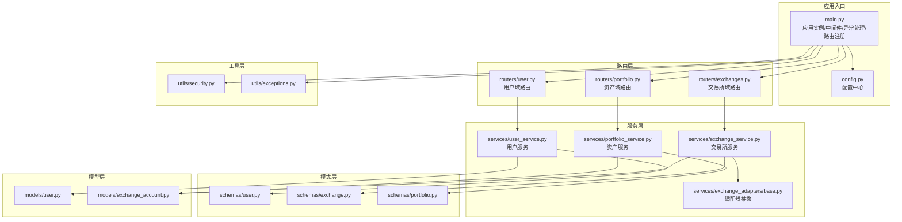
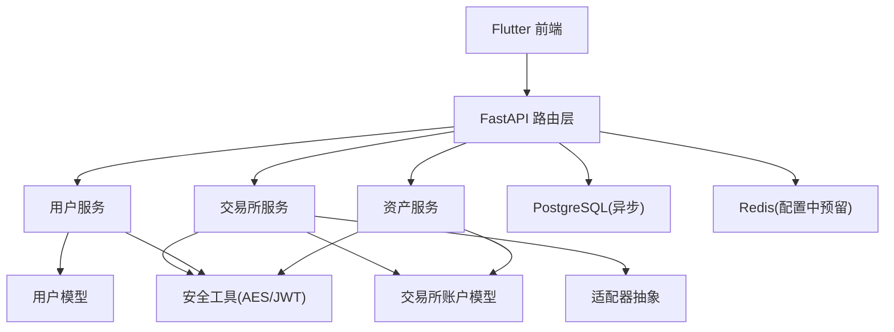
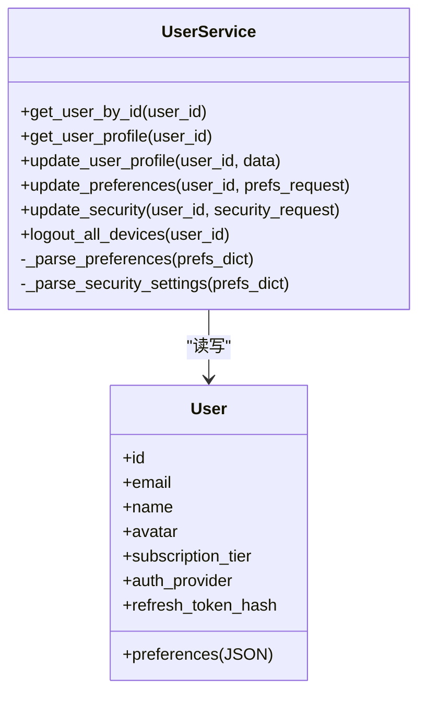
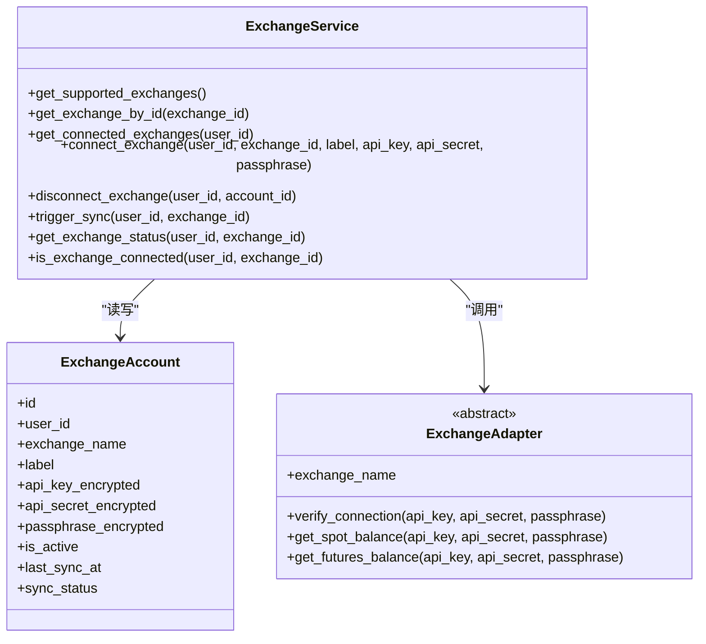
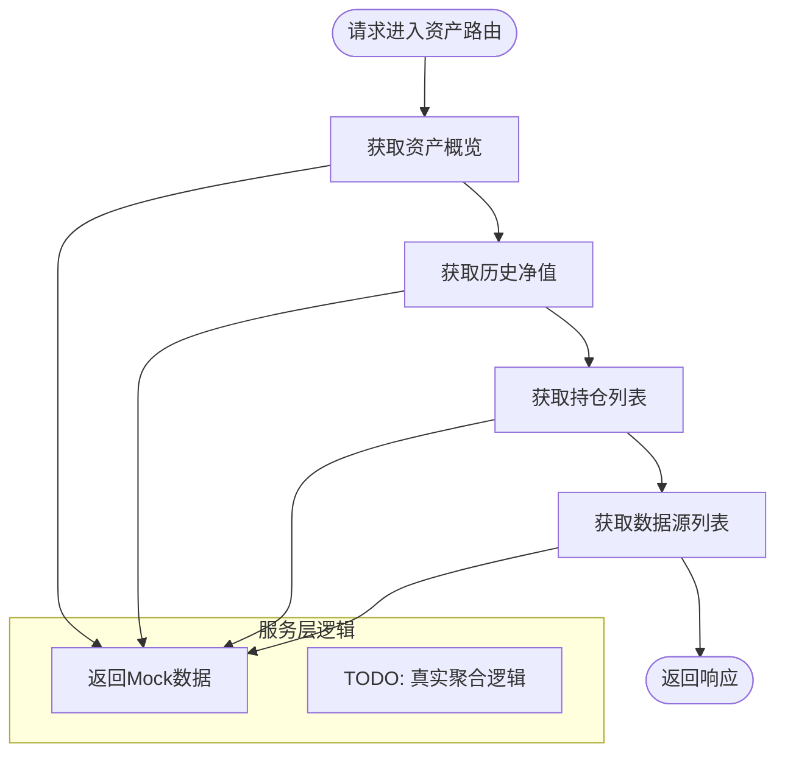
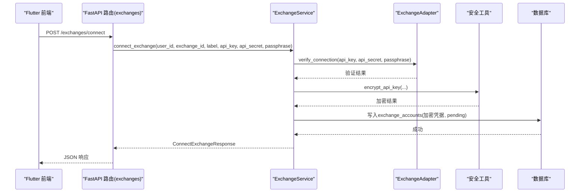
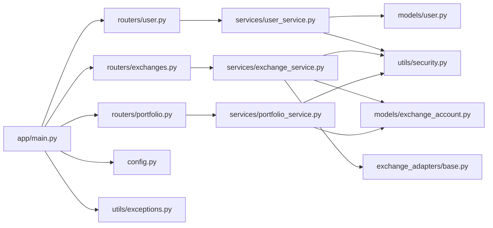

# 功能模块

<cite>
**本文引用的文件**
- [backend/app/main.py](file://backend/app/main.py)
- [backend/app/config.py](file://backend/app/config.py)
- [backend/app/models/user.py](file://backend/app/models/user.py)
- [backend/app/models/exchange_account.py](file://backend/app/models/exchange_account.py)
- [backend/app/routers/user.py](file://backend/app/routers/user.py)
- [backend/app/routers/exchanges.py](file://backend/app/routers/exchanges.py)
- [backend/app/routers/portfolio.py](file://backend/app/routers/portfolio.py)
- [backend/app/services/user_service.py](file://backend/app/services/user_service.py)
- [backend/app/services/exchange_service.py](file://backend/app/services/exchange_service.py)
- [backend/app/services/portfolio_service.py](file://backend/app/services/portfolio_service.py)
- [backend/app/schemas/user.py](file://backend/app/schemas/user.py)
- [backend/app/schemas/exchange.py](file://backend/app/schemas/exchange.py)
- [backend/app/schemas/portfolio.py](file://backend/app/schemas/portfolio.py)
- [backend/app/utils/security.py](file://backend/app/utils/security.py)
- [backend/app/utils/exceptions.py](file://backend/app/utils/exceptions.py)
- [backend/app/services/exchange_adapters/base.py](file://backend/app/services/exchange_adapters/base.py)
</cite>

## 目录
1. [简介](#简介)
2. [项目结构](#项目结构)
3. [核心组件](#核心组件)
4. [架构总览](#架构总览)
5. [详细组件分析](#详细组件分析)
6. [依赖分析](#依赖分析)
7. [性能考量](#性能考量)
8. [故障排查指南](#故障排查指南)
9. [结论](#结论)
10. [附录](#附录)

## 简介
本文件面向Flutter前端与后端协作的功能模块，系统化梳理用户管理、交易所集成、资产管理三大功能域的模块化架构与实现要点。文档重点阐述：
- 模块边界与职责分离：用户域、交易所域、资产域的清晰划分与接口设计
- 模块间依赖关系与数据交互：路由层、服务层、模型层、适配器层的协作
- 可测试性与可维护性：基于Pydantic模型、异常体系、加密工具与抽象适配器
- 扩展性与演进方向：新增交易所适配器、真实数据聚合、后台同步任务
- 与核心系统的集成方式：FastAPI路由、数据库ORM、配置中心、安全工具
- 性能优化与资源管理：异步数据库会话、加密缓存、Mock数据与真实数据的过渡策略

## 项目结构
后端采用FastAPI + SQLAlchemy异步ORM的分层架构：
- 应用入口与生命周期：应用实例、CORS中间件、全局异常处理器、路由注册
- 配置中心：统一读取环境变量与运行时校验
- 数据模型：用户与交易所账户的ORM定义
- 路由层：按功能域拆分的API路由
- 服务层：封装业务逻辑，协调模型与外部适配器
- 模式层：Pydantic模型用于请求/响应校验与序列化
- 工具层：安全工具（JWT、API Key加解密）、异常体系
- 适配器层：抽象交易所适配器，支持多交易所扩展

**图示来源**
- [backend/app/main.py:1-131](file://backend/app/main.py#L1-L131)
- [backend/app/config.py:1-51](file://backend/app/config.py#L1-L51)
- [backend/app/routers/user.py:1-280](file://backend/app/routers/user.py#L1-L280)
- [backend/app/routers/exchanges.py:1-227](file://backend/app/routers/exchanges.py#L1-L227)
- [backend/app/routers/portfolio.py:1-217](file://backend/app/routers/portfolio.py#L1-L217)
- [backend/app/services/user_service.py:1-223](file://backend/app/services/user_service.py#L1-L223)
- [backend/app/services/exchange_service.py:1-414](file://backend/app/services/exchange_service.py#L1-L414)
- [backend/app/services/portfolio_service.py:1-317](file://backend/app/services/portfolio_service.py#L1-L317)
- [backend/app/services/exchange_adapters/base.py:1-73](file://backend/app/services/exchange_adapters/base.py#L1-L73)
- [backend/app/schemas/user.py:1-96](file://backend/app/schemas/user.py#L1-L96)
- [backend/app/schemas/exchange.py:1-150](file://backend/app/schemas/exchange.py#L1-L150)
- [backend/app/schemas/portfolio.py:1-152](file://backend/app/schemas/portfolio.py#L1-L152)
- [backend/app/models/user.py:1-32](file://backend/app/models/user.py#L1-L32)
- [backend/app/models/exchange_account.py:1-32](file://backend/app/models/exchange_account.py#L1-L32)
- [backend/app/utils/security.py:1-104](file://backend/app/utils/security.py#L1-L104)
- [backend/app/utils/exceptions.py:1-67](file://backend/app/utils/exceptions.py#L1-L67)

**章节来源**
- [backend/app/main.py:1-131](file://backend/app/main.py#L1-L131)
- [backend/app/config.py:1-51](file://backend/app/config.py#L1-L51)

## 核心组件
- 应用入口与生命周期
  - 异步生命周期管理：启动时建立数据库连接，关闭时释放连接
  - CORS中间件：开发/生产动态配置
  - 全局异常处理：自定义异常与通用异常的统一响应格式
  - 路由注册：按版本前缀挂载用户、资产、交易所、认证路由
- 配置中心
  - 统一读取环境变量，运行时校验敏感配置（JWT、加密密钥），开发/生产差异化行为
- 路由层
  - 用户域：个人资料、偏好设置、安全设置、API管理
  - 交易所域：支持列表、已连列表、连接/断开、手动同步、状态查询
  - 资产域：概览、历史净值、持仓、数据源
- 服务层
  - 用户服务：用户资料、偏好、安全设置的读写；登出所有设备
  - 交易所服务：支持交易所清单、连接/断开、手动同步、状态查询；适配器验证
  - 资产服务：资产概览、历史、持仓、数据源的Mock实现，预留真实聚合接口
- 模式层
  - Pydantic模型：请求/响应校验、默认值、字段约束、序列化
- 工具层
  - 安全工具：JWT签发/校验、API Key加解密（AES-256-GCM + HKDF）
  - 异常体系：认证、未找到、校验、交易所连接等错误类型
- 适配器层
  - 抽象适配器：定义连接验证、现货/永续余额获取等接口，便于扩展新交易所

**章节来源**
- [backend/app/main.py:13-131](file://backend/app/main.py#L13-L131)
- [backend/app/config.py:5-51](file://backend/app/config.py#L5-L51)
- [backend/app/routers/user.py:1-280](file://backend/app/routers/user.py#L1-L280)
- [backend/app/routers/exchanges.py:1-227](file://backend/app/routers/exchanges.py#L1-L227)
- [backend/app/routers/portfolio.py:1-217](file://backend/app/routers/portfolio.py#L1-L217)
- [backend/app/services/user_service.py:19-223](file://backend/app/services/user_service.py#L19-L223)
- [backend/app/services/exchange_service.py:26-414](file://backend/app/services/exchange_service.py#L26-L414)
- [backend/app/services/portfolio_service.py:31-317](file://backend/app/services/portfolio_service.py#L31-L317)
- [backend/app/schemas/user.py:10-96](file://backend/app/schemas/user.py#L10-L96)
- [backend/app/schemas/exchange.py:10-150](file://backend/app/schemas/exchange.py#L10-L150)
- [backend/app/schemas/portfolio.py:15-152](file://backend/app/schemas/portfolio.py#L15-L152)
- [backend/app/utils/security.py:18-104](file://backend/app/utils/security.py#L18-L104)
- [backend/app/utils/exceptions.py:4-67](file://backend/app/utils/exceptions.py#L4-L67)
- [backend/app/services/exchange_adapters/base.py:5-73](file://backend/app/services/exchange_adapters/base.py#L5-L73)

## 架构总览
系统采用“路由层-服务层-模型/适配器层”的分层设计，配合Pydantic模式与SQLAlchemy ORM实现数据一致性与类型安全。

**图示来源**
- [backend/app/main.py:94-100](file://backend/app/main.py#L94-L100)
- [backend/app/services/user_service.py:22-23](file://backend/app/services/user_service.py#L22-L23)
- [backend/app/services/exchange_service.py:99-100](file://backend/app/services/exchange_service.py#L99-L100)
- [backend/app/services/portfolio_service.py:34-35](file://backend/app/services/portfolio_service.py#L34-L35)
- [backend/app/utils/security.py:85-104](file://backend/app/utils/security.py#L85-L104)
- [backend/app/config.py:12-16](file://backend/app/config.py#L12-L16)

## 详细组件分析

### 用户管理模块
- 职责边界
  - 用户资料：读取/更新姓名、头像、订阅等级、认证方式
  - 偏好设置：基础货币、刷新间隔、生物识别、市场提醒
  - 安全设置：生物识别、双因素开关（基于偏好设置推导）
  - API管理：已连API列表（当前为Mock）
- 接口设计
  - 路由层：GET/PUT /user/profile、/user/preferences、/user/security、/user/apis
  - 服务层：UserService封装读写、偏好解析、登出所有设备
  - 模式层：UserProfile、UserPreferences、SecuritySettings、Update*Request
- 数据交互
  - 通过AsyncSession访问用户表，偏好设置以JSON字段存储，服务层负责解析与回写
- 可测试性与可维护性
  - Pydantic模型提供强类型与默认值；异常类型明确；服务层方法单一职责
- 与核心系统集成
  - 依赖配置中心的JWT参数；使用安全工具进行登录态管理

**图示来源**
- [backend/app/services/user_service.py:19-223](file://backend/app/services/user_service.py#L19-L223)
- [backend/app/models/user.py:11-32](file://backend/app/models/user.py#L11-L32)

**章节来源**
- [backend/app/routers/user.py:22-280](file://backend/app/routers/user.py#L22-L280)
- [backend/app/services/user_service.py:25-223](file://backend/app/services/user_service.py#L25-L223)
- [backend/app/schemas/user.py:10-96](file://backend/app/schemas/user.py#L10-L96)
- [backend/app/models/user.py:11-32](file://backend/app/models/user.py#L11-L32)

### 交易所集成模块
- 职责边界
  - 支持列表：内置支持的交易所清单
  - 已连列表：用户有效连接（is_active=true）
  - 连接/断开：凭据校验、加密存储、软删除
  - 同步：手动触发同步（状态流转）
  - 状态：连接状态、最后同步时间、余额条目数
- 接口设计
  - 路由层：GET/POST/DELETE /exchanges、/exchanges/connect、/exchanges/{id}/sync、/exchanges/{id}/status
  - 服务层：ExchangeService封装支持检查、连接验证、加密、状态管理
  - 适配器层：ExchangeAdapter抽象，具体适配器通过工厂函数获取
- 数据交互
  - 通过AsyncSession访问exchange_accounts表；凭据加密后落库；状态字段驱动UI展示
- 可测试性与可维护性
  - 适配器抽象隔离外部API差异；异常类型覆盖校验与连接失败场景
- 与核心系统集成
  - 依赖安全工具进行API Key加解密；依赖配置中心的加密密钥

**图示来源**
- [backend/app/services/exchange_service.py:26-414](file://backend/app/services/exchange_service.py#L26-L414)
- [backend/app/models/exchange_account.py:11-32](file://backend/app/models/exchange_account.py#L11-L32)
- [backend/app/services/exchange_adapters/base.py:5-73](file://backend/app/services/exchange_adapters/base.py#L5-L73)

**章节来源**
- [backend/app/routers/exchanges.py:25-227](file://backend/app/routers/exchanges.py#L25-L227)
- [backend/app/services/exchange_service.py:102-414](file://backend/app/services/exchange_service.py#L102-L414)
- [backend/app/schemas/exchange.py:10-150](file://backend/app/schemas/exchange.py#L10-L150)
- [backend/app/models/exchange_account.py:11-32](file://backend/app/models/exchange_account.py#L11-L32)
- [backend/app/utils/security.py:85-104](file://backend/app/utils/security.py#L85-L104)

### 资产管理模块
- 职责边界
  - 资产概览：总资产、24h涨跌、来源分布
  - 历史净值：按周期生成历史数据点、统计高/低/均值
  - 持仓列表：按币种聚合、单价/市值/涨跌幅/占比
  - 数据源：已连交易所与Web3钱包列表
- 接口设计
  - 路由层：GET /portfolio/summary、/history、/holdings、/sources
  - 服务层：PortfolioService提供Mock实现，预留真实聚合与同步接口
  - 模式层：PortfolioSummary、PortfolioHistory、HoldingsList、SourcesList及其响应包装
- 数据交互
  - 当前返回Mock数据，预留查询exchange_accounts、调用适配器、调用价格API、记录历史净值
- 可测试性与可维护性
  - Mock数据便于前端联调；预留真实聚合逻辑，逐步替换
- 与核心系统集成
  - 依赖配置中心的CoinGecko API地址；依赖安全工具进行加密

**图示来源**
- [backend/app/routers/portfolio.py:33-217](file://backend/app/routers/portfolio.py#L33-L217)
- [backend/app/services/portfolio_service.py:41-317](file://backend/app/services/portfolio_service.py#L41-L317)
- [backend/app/schemas/portfolio.py:29-152](file://backend/app/schemas/portfolio.py#L29-L152)

**章节来源**
- [backend/app/routers/portfolio.py:29-217](file://backend/app/routers/portfolio.py#L29-L217)
- [backend/app/services/portfolio_service.py:41-317](file://backend/app/services/portfolio_service.py#L41-L317)
- [backend/app/schemas/portfolio.py:15-152](file://backend/app/schemas/portfolio.py#L15-L152)

### API工作流（以“连接交易所”为例）

**图示来源**
- [backend/app/routers/exchanges.py:86-122](file://backend/app/routers/exchanges.py#L86-L122)
- [backend/app/services/exchange_service.py:231-301](file://backend/app/services/exchange_service.py#L231-L301)
- [backend/app/services/exchange_adapters/base.py:9-26](file://backend/app/services/exchange_adapters/base.py#L9-L26)
- [backend/app/utils/security.py:85-93](file://backend/app/utils/security.py#L85-L93)
- [backend/app/models/exchange_account.py:11-32](file://backend/app/models/exchange_account.py#L11-L32)

## 依赖分析
- 组件耦合与内聚
  - 路由层仅负责参数解析与响应包装，业务逻辑集中在服务层，内聚度高
  - 服务层对模型层与适配器层存在直接依赖，但通过抽象接口降低耦合
- 直接与间接依赖
  - 路由层依赖服务层；服务层依赖模型层与工具层；工具层依赖配置中心
- 外部依赖与集成点
  - 数据库：PostgreSQL（异步连接）
  - 缓存：Redis（预留）
  - 外部API：CoinGecko（价格获取，预留）
  - 交易所：通过适配器抽象对接
- 接口契约
  - 适配器接口统一了不同交易所的验证与余额查询能力
  - Pydantic模型作为跨层契约，保证请求/响应的一致性

**图示来源**
- [backend/app/routers/user.py:1-280](file://backend/app/routers/user.py#L1-L280)
- [backend/app/routers/exchanges.py:1-227](file://backend/app/routers/exchanges.py#L1-L227)
- [backend/app/routers/portfolio.py:1-217](file://backend/app/routers/portfolio.py#L1-L217)
- [backend/app/services/user_service.py:1-223](file://backend/app/services/user_service.py#L1-L223)
- [backend/app/services/exchange_service.py:1-414](file://backend/app/services/exchange_service.py#L1-L414)
- [backend/app/services/portfolio_service.py:1-317](file://backend/app/services/portfolio_service.py#L1-L317)
- [backend/app/models/user.py:1-32](file://backend/app/models/user.py#L1-L32)
- [backend/app/models/exchange_account.py:1-32](file://backend/app/models/exchange_account.py#L1-L32)
- [backend/app/services/exchange_adapters/base.py:1-73](file://backend/app/services/exchange_adapters/base.py#L1-L73)
- [backend/app/utils/security.py:1-104](file://backend/app/utils/security.py#L1-L104)
- [backend/app/utils/exceptions.py:1-67](file://backend/app/utils/exceptions.py#L1-L67)
- [backend/app/main.py:1-131](file://backend/app/main.py#L1-L131)
- [backend/app/config.py:1-51](file://backend/app/config.py#L1-L51)

**章节来源**
- [backend/app/main.py:94-100](file://backend/app/main.py#L94-L100)
- [backend/app/services/exchange_service.py:26-414](file://backend/app/services/exchange_service.py#L26-L414)
- [backend/app/services/user_service.py:19-223](file://backend/app/services/user_service.py#L19-L223)
- [backend/app/services/portfolio_service.py:31-317](file://backend/app/services/portfolio_service.py#L31-L317)

## 性能考量
- 异步数据库：使用SQLAlchemy异步引擎，减少I/O阻塞
- 加密缓存：API Key加解密密钥通过HKDF派生并缓存，避免重复派生开销
- Mock先行：资产域Mock数据降低真实外部API依赖，提升联调效率
- 后台同步：资产同步预留后台任务接口，避免阻塞请求线程
- 缓存预留：Redis配置已就绪，可用于热点数据缓存与限流

[本节为通用指导，无需特定文件来源]

## 故障排查指南
- 认证失败
  - 检查JWT密钥与算法配置；确认令牌签名与过期时间
- 资源未找到
  - 用户或交易所账户不存在时抛出未找到异常
- 校验失败
  - 不合法的输入字段（如刷新间隔范围、货币代码）触发校验异常
- 交易所连接失败
  - 凭据无效或外部API不可达导致连接异常
- 建议排查步骤
  - 查看全局异常处理器返回的统一错误结构
  - 核对配置中心的密钥与外部API地址
  - 在服务层增加最小化日志输出定位问题

**章节来源**
- [backend/app/utils/exceptions.py:4-67](file://backend/app/utils/exceptions.py#L4-L67)
- [backend/app/utils/security.py:28-59](file://backend/app/utils/security.py#L28-L59)
- [backend/app/main.py:66-91](file://backend/app/main.py#L66-L91)

## 结论
该功能模块以清晰的分层架构实现了用户管理、交易所集成与资产管理的核心能力。通过适配器抽象与Pydantic模式，系统具备良好的扩展性与可维护性。当前资产域采用Mock数据，便于前端快速迭代；后续可逐步接入真实数据源与后台同步任务，进一步完善生态闭环。

[本节为总结性内容，无需特定文件来源]

## 附录

### 模块开发指南与代码规范
- 路由层
  - 仅做参数解析与响应包装；复杂逻辑下沉至服务层
  - 使用统一的响应包装模型（如APIResponse）
- 服务层
  - 单一职责：每个方法聚焦一个业务动作
  - 明确异常类型：针对不同错误场景抛出对应异常
  - 与适配器解耦：通过抽象接口调用外部API
- 模式层
  - 使用Pydantic模型进行输入/输出校验与序列化
  - 提供默认值与字段约束，增强健壮性
- 工具层
  - JWT与API Key加解密集中管理，避免重复实现
  - 配置中心集中读取环境变量，运行时校验敏感参数
- 数据模型
  - 使用UUID主键；外键关系明确；JSON字段用于灵活配置
- 测试建议
  - 为服务层编写单元测试，Mock数据库与适配器
  - 使用Pydantic模型进行请求/响应的契约测试

[本节为通用指导，无需特定文件来源]