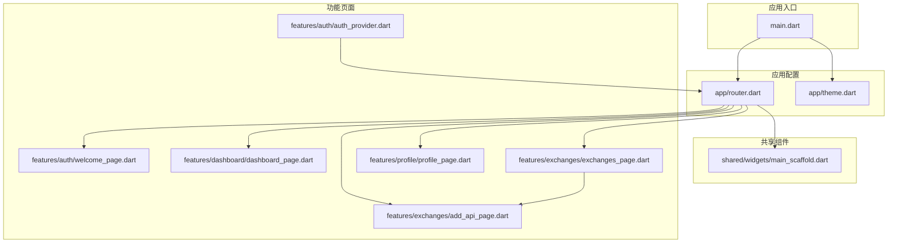
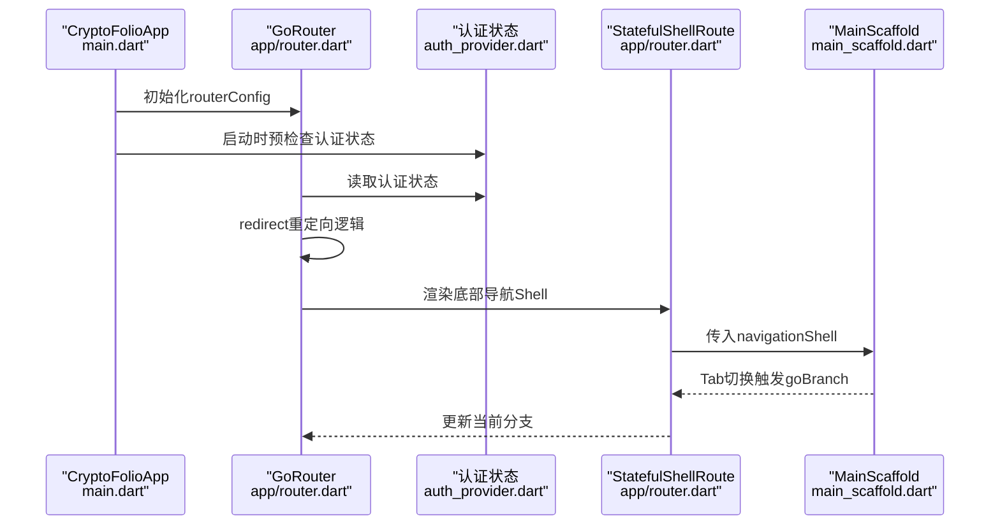
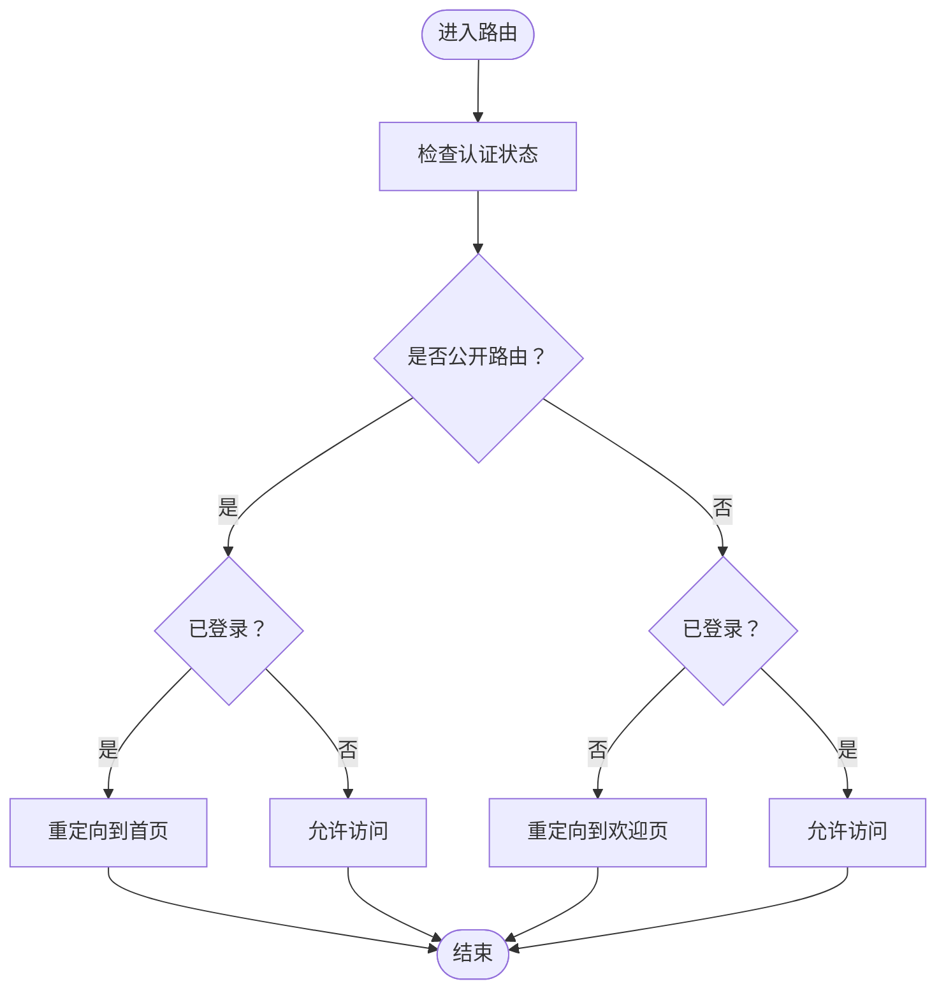
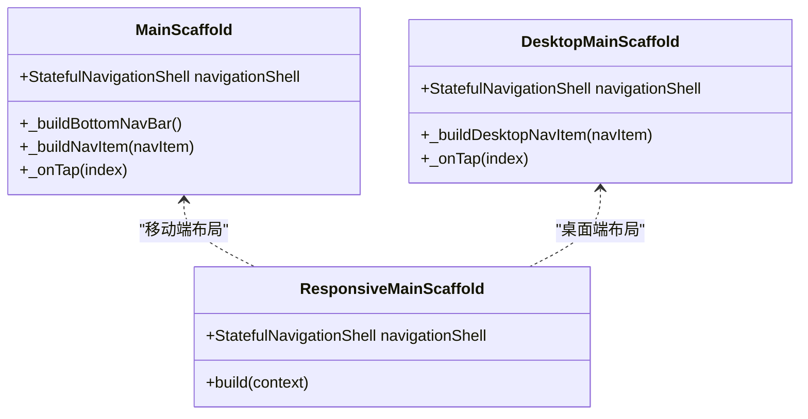
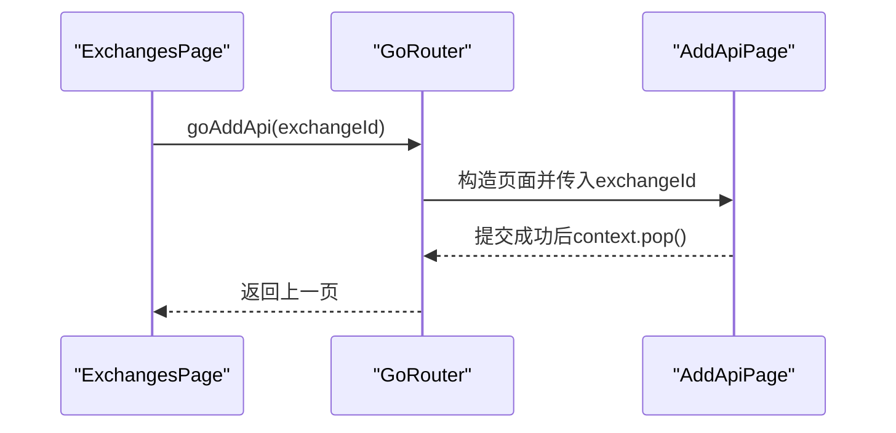
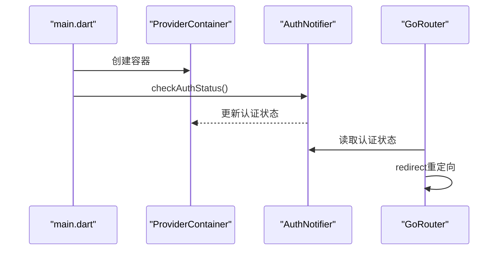
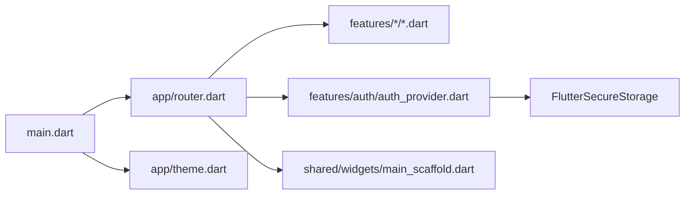

# 导航与路由

<cite>
**本文引用的文件**
- [main.dart](file://frontend/lib/main.dart)
- [router.dart](file://frontend/lib/app/router.dart)
- [main_scaffold.dart](file://frontend/lib/shared/widgets/main_scaffold.dart)
- [theme.dart](file://frontend/lib/app/theme.dart)
- [auth_provider.dart](file://frontend/lib/features/auth/auth_provider.dart)
- [welcome_page.dart](file://frontend/lib/features/auth/welcome_page.dart)
- [exchanges_page.dart](file://frontend/lib/features/exchanges/exchanges_page.dart)
- [add_api_page.dart](file://frontend/lib/features/exchanges/add_api_page.dart)
- [dashboard_page.dart](file://frontend/lib/features/dashboard/dashboard_page.dart)
- [profile_page.dart](file://frontend/lib/features/profile/profile_page.dart)
</cite>

## 目录
1. [简介](#简介)
2. [项目结构](#项目结构)
3. [核心组件](#核心组件)
4. [架构总览](#架构总览)
5. [详细组件分析](#详细组件分析)
6. [依赖关系分析](#依赖关系分析)
7. [性能考量](#性能考量)
8. [故障排查指南](#故障排查指南)
9. [结论](#结论)
10. [附录](#附录)

## 简介
本文件系统性梳理并解读该Flutter应用的导航与路由体系，围绕GoRouter路由配置、页面导航流程、路由参数传递、页面状态管理、导航拦截机制、深度链接与URL路由、分享链接、页面转场与手势、导航栏设计、导航状态持久化与恢复、多平台适配策略、以及性能优化与内存管理等维度展开。文档同时提供可视化图示与最佳实践建议，帮助开发者快速理解并高效维护导航子系统。

## 项目结构
前端采用按功能域划分的目录组织方式，路由与导航相关的核心文件集中在app层与shared层，页面按功能域分布在features层：
- app层：入口与路由配置、主题定义
- shared层：通用UI组件（含主布局与响应式导航）
- features层：各业务页面与状态管理（Riverpod）

图表来源
- [main.dart](file://frontend/lib/main.dart)
- [router.dart](file://frontend/lib/app/router.dart)
- [main_scaffold.dart](file://frontend/lib/shared/widgets/main_scaffold.dart)
- [theme.dart](file://frontend/lib/app/theme.dart)
- [welcome_page.dart](file://frontend/lib/features/auth/welcome_page.dart)
- [dashboard_page.dart](file://frontend/lib/features/dashboard/dashboard_page.dart)
- [exchanges_page.dart](file://frontend/lib/features/exchanges/exchanges_page.dart)
- [add_api_page.dart](file://frontend/lib/features/exchanges/add_api_page.dart)
- [profile_page.dart](file://frontend/lib/features/profile/profile_page.dart)
- [auth_provider.dart](file://frontend/lib/features/auth/auth_provider.dart)

章节来源
- [main.dart:1-86](file://frontend/lib/main.dart#L1-L86)
- [router.dart:1-278](file://frontend/lib/app/router.dart#L1-L278)

## 核心组件
- 路由配置与拦截
  - 使用GoRouter集中配置路由表、初始位置、调试日志、错误页与全局重定向逻辑
  - 通过重定向函数实现“认证状态感知”的导航拦截，确保未登录用户无法访问受保护页面
- 主布局与底部导航
  - 使用StatefulShellRoute构建带底部导航的Shell分支，配合MainScaffold实现Tab切换
  - 支持响应式布局：移动端底部导航、桌面端侧边导航
- 页面与参数传递
  - 路由参数通过pathParameters传递（如exchangeId），在子页面中消费
  - 扩展BuildContext提供便捷导航方法（如goAddApi）
- 状态管理与持久化
  - Riverpod管理认证状态，FlutterSecureStorage持久化令牌与用户数据
  - 应用启动时预检查认证状态，保证导航拦截生效

章节来源
- [router.dart:88-202](file://frontend/lib/app/router.dart#L88-L202)
- [router.dart:205-235](file://frontend/lib/app/router.dart#L205-L235)
- [main_scaffold.dart:11-114](file://frontend/lib/shared/widgets/main_scaffold.dart#L11-L114)
- [auth_provider.dart:96-113](file://frontend/lib/features/auth/auth_provider.dart#L96-L113)

## 架构总览
下图展示了从应用启动到页面渲染、导航拦截与底部导航的整体流程：

图表来源
- [main.dart:44-84](file://frontend/lib/main.dart#L44-L84)
- [router.dart:88-202](file://frontend/lib/app/router.dart#L88-L202)
- [auth_provider.dart:96-113](file://frontend/lib/features/auth/auth_provider.dart#L96-L113)
- [main_scaffold.dart:107-113](file://frontend/lib/shared/widgets/main_scaffold.dart#L107-L113)

## 详细组件分析

### 路由配置与导航拦截
- 路由表
  - 认证相关路由：欢迎页、登录、注册、引导页（无底部导航）
  - 主页（Portfolio）：仪表盘
  - 连接（Connect）：交易所列表，支持子路由“添加API”
  - 市场（Markets）：占位页
  - 设置（Profile）：个人资料/设置
- 重定向逻辑
  - 未登录访问受保护路由时重定向至欢迎页
  - 已登录访问公开路由时重定向至首页
- 错误页
  - 统一错误页展示错误信息并提供返回首页按钮

图表来源
- [router.dart:59-85](file://frontend/lib/app/router.dart#L59-L85)

章节来源
- [router.dart:88-202](file://frontend/lib/app/router.dart#L88-L202)

### 主布局与底部导航
- MainScaffold
  - 通过navigationShell承载各分支页面
  - 底部导航栏根据选中状态高亮图标与文字，支持点击切换分支
  - 支持响应式布局：移动端底部导航、桌面端侧边导航
- DesktopMainScaffold
  - 侧边导航栏，图标与Tooltip提示
  - 与移动端一致的切换逻辑

图表来源
- [main_scaffold.dart:11-114](file://frontend/lib/shared/widgets/main_scaffold.dart#L11-L114)
- [main_scaffold.dart:117-240](file://frontend/lib/shared/widgets/main_scaffold.dart#L117-L240)
- [main_scaffold.dart:245-270](file://frontend/lib/shared/widgets/main_scaffold.dart#L245-L270)

章节来源
- [main_scaffold.dart:11-114](file://frontend/lib/shared/widgets/main_scaffold.dart#L11-L114)
- [main_scaffold.dart:117-240](file://frontend/lib/shared/widgets/main_scaffold.dart#L117-L240)
- [main_scaffold.dart:245-270](file://frontend/lib/shared/widgets/main_scaffold.dart#L245-L270)

### 页面与参数传递
- 路由参数
  - “添加API”子路由使用path参数exchangeId，在子页面中读取并构造页面
- 导航扩展
  - 在BuildContext上扩展便捷导航方法，统一跳转入口
- 页面交互
  - 交易所列表页点击“连接”触发导航到“添加API”页
  - “添加API”页提交成功后自动返回上一页

图表来源
- [exchanges_page.dart:57-63](file://frontend/lib/features/exchanges/exchanges_page.dart#L57-L63)
- [router.dart:137-143](file://frontend/lib/app/router.dart#L137-L143)
- [add_api_page.dart:46-87](file://frontend/lib/features/exchanges/add_api_page.dart#L46-L87)

章节来源
- [router.dart:137-143](file://frontend/lib/app/router.dart#L137-L143)
- [exchanges_page.dart:57-63](file://frontend/lib/features/exchanges/exchanges_page.dart#L57-L63)
- [add_api_page.dart:46-87](file://frontend/lib/features/exchanges/add_api_page.dart#L46-L87)

### 认证状态与导航拦截
- 启动流程
  - 应用启动时通过ProviderContainer读取认证状态，预检查登录态
  - GoRouter重定向逻辑基于认证状态决定跳转目标
- 持久化
  - 使用FlutterSecureStorage存储令牌与用户信息，避免明文存储
- 错误处理
  - 错误页统一捕获异常并提供返回首页能力

图表来源
- [main.dart:9-41](file://frontend/lib/main.dart#L9-L41)
- [auth_provider.dart:96-113](file://frontend/lib/features/auth/auth_provider.dart#L96-L113)
- [router.dart:59-85](file://frontend/lib/app/router.dart#L59-L85)

章节来源
- [main.dart:9-41](file://frontend/lib/main.dart#L9-L41)
- [auth_provider.dart:96-113](file://frontend/lib/features/auth/auth_provider.dart#L96-L113)
- [router.dart:59-85](file://frontend/lib/app/router.dart#L59-L85)

### 页面转场动画与手势
- 转场与手势
  - 项目未显式配置自定义转场动画与手势，采用默认行为
  - 如需定制，可在GoRouter构造函数中配置相关参数（例如transitionBuilder、restorationScopeId等）
- 建议
  - 对于跨分支切换，可考虑使用淡入淡出或滑动转场提升体验
  - 为复杂页面（如“添加API”）提供加载与回退动画，增强反馈

[本节为通用建议，无需特定文件引用]

### 深度链接与URL路由
- 当前实现
  - 路由基于path与参数（如exchangeId）进行导航
  - 未见显式的深度链接解析与外部URL路由处理
- 建议
  - 在GoRouter中启用deepLinkRedirects或自定义deepLinkParser以支持外部链接
  - 为分享链接提供稳定URL结构，结合参数校验与错误页提升健壮性

[本节为通用建议，无需特定文件引用]

### 导航栏设计与多平台适配
- 导航栏
  - 移动端：底部Tab导航，图标与文字高亮
  - 桌面端：侧边导航，支持Tooltip与图标尺寸调整
- 适配策略
  - 使用ResponsiveMainScaffold根据屏幕宽度自动切换布局
  - 主题与颜色在theme.dart中统一管理，确保视觉一致性

章节来源
- [main_scaffold.dart:245-270](file://frontend/lib/shared/widgets/main_scaffold.dart#L245-L270)
- [theme.dart:48-291](file://frontend/lib/app/theme.dart#L48-L291)

### 页面状态管理与持久化
- 认证状态
  - 使用Riverpod的StateNotifier管理登录态、用户信息与错误
  - 使用FlutterSecureStorage进行本地加密存储
- 页面状态
  - 各功能页通过ConsumerWidget/ConsumerStatefulWidget订阅Provider
  - “添加API”页在提交成功后自动返回，减少手动状态同步成本

章节来源
- [auth_provider.dart:90-358](file://frontend/lib/features/auth/auth_provider.dart#L90-L358)
- [add_api_page.dart:43-122](file://frontend/lib/features/exchanges/add_api_page.dart#L43-L122)

### 导航最佳实践
- 路由组织
  - 使用StatefulShellRoute管理底部导航分支，保持页面状态
  - 子路由参数通过pathParameters传递，避免跨页面传递复杂对象
- 导航扩展
  - 在BuildContext上扩展导航方法，统一跳转入口，便于测试与重构
- 错误处理
  - 提供统一错误页，包含返回首页按钮，提升用户体验
- 性能
  - 避免在路由切换时进行重型计算；必要时使用Future或异步加载
  - 对频繁更新的Provider使用合适的监听粒度，减少重建范围

章节来源
- [router.dart:205-235](file://frontend/lib/app/router.dart#L205-L235)
- [router.dart:172-202](file://frontend/lib/app/router.dart#L172-L202)

## 依赖关系分析
- 组件耦合
  - main.dart依赖router.dart与theme.dart
  - router.dart依赖各页面与AuthProvider
  - main_scaffold.dart依赖router.dart与theme.dart
- 外部依赖
  - GoRouter负责路由与导航
  - Riverpod负责状态管理
  - FlutterSecureStorage负责本地加密存储

图表来源
- [main.dart:1-86](file://frontend/lib/main.dart#L1-L86)
- [router.dart:1-278](file://frontend/lib/app/router.dart#L1-L278)
- [auth_provider.dart:1-418](file://frontend/lib/features/auth/auth_provider.dart#L1-L418)
- [main_scaffold.dart:1-271](file://frontend/lib/shared/widgets/main_scaffold.dart#L1-L271)

章节来源
- [main.dart:1-86](file://frontend/lib/main.dart#L1-L86)
- [router.dart:1-278](file://frontend/lib/app/router.dart#L1-L278)
- [auth_provider.dart:1-418](file://frontend/lib/features/auth/auth_provider.dart#L1-L418)
- [main_scaffold.dart:1-271](file://frontend/lib/shared/widgets/main_scaffold.dart#L1-L271)

## 性能考量
- 路由切换
  - 使用StatefulShellRoute保持分支页面状态，减少重建成本
  - 避免在重定向回调中执行耗时操作，必要时异步处理
- 状态管理
  - Provider粒度过细会导致频繁重建；合理拆分状态与监听范围
  - 对认证状态检查使用一次性预检查，避免重复IO
- UI渲染
  - 使用GlassCard等组件时注意阴影与渐变的绘制开销
  - 在图表与列表中使用Sliver系列组件提升滚动性能

[本节为通用指导，无需特定文件引用]

## 故障排查指南
- 无法进入受保护页面
  - 检查认证状态Provider是否正确初始化与更新
  - 确认重定向逻辑是否命中预期分支
- 参数丢失或类型错误
  - 校验路由参数名与类型，确保子页面正确读取
- 导航不生效
  - 检查BuildContext上的导航扩展方法是否正确调用
  - 确认路由路径与参数格式一致
- 错误页显示异常
  - 查看errorBuilder返回内容与上下文主题配置

章节来源
- [router.dart:59-85](file://frontend/lib/app/router.dart#L59-L85)
- [router.dart:172-202](file://frontend/lib/app/router.dart#L172-L202)
- [auth_provider.dart:96-113](file://frontend/lib/features/auth/auth_provider.dart#L96-L113)

## 结论
该应用采用GoRouter与Riverpod构建了清晰、可维护的导航与路由体系。通过认证拦截、Shell分支与响应式布局，实现了良好的用户体验与跨平台适配。建议后续在深度链接、自定义转场与状态持久化方面进一步完善，以提升安全性与交互质量。

## 附录
- 路由路径与页面映射
  - 欢迎页：/welcome
  - 登录：/login
  - 注册：/register
  - 引导页：/onboarding
  - 首页（Portfolio）：/
  - 连接（Exchanges）：/connect
  - 添加API（子路由）：/connect/:exchangeId
  - 市场（Markets）：/markets
  - 个人设置（Profile）：/profile
- 导航扩展方法
  - goWelcome、goHome、goLogin、goRegister、goOnboarding、goConnect、goAddApi、goMarkets、goProfile、pushAddApi

章节来源
- [router.dart:17-37](file://frontend/lib/app/router.dart#L17-L37)
- [router.dart:205-235](file://frontend/lib/app/router.dart#L205-L235)