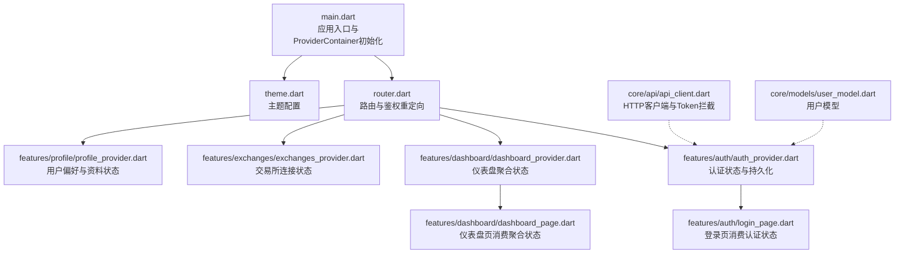
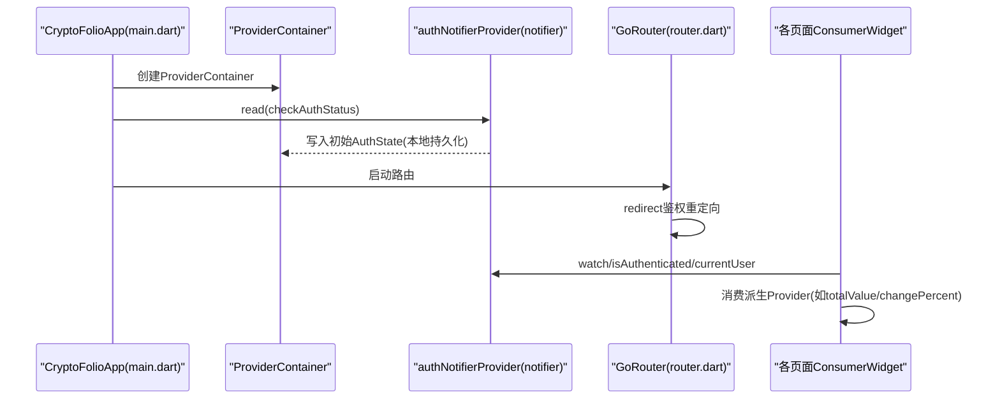
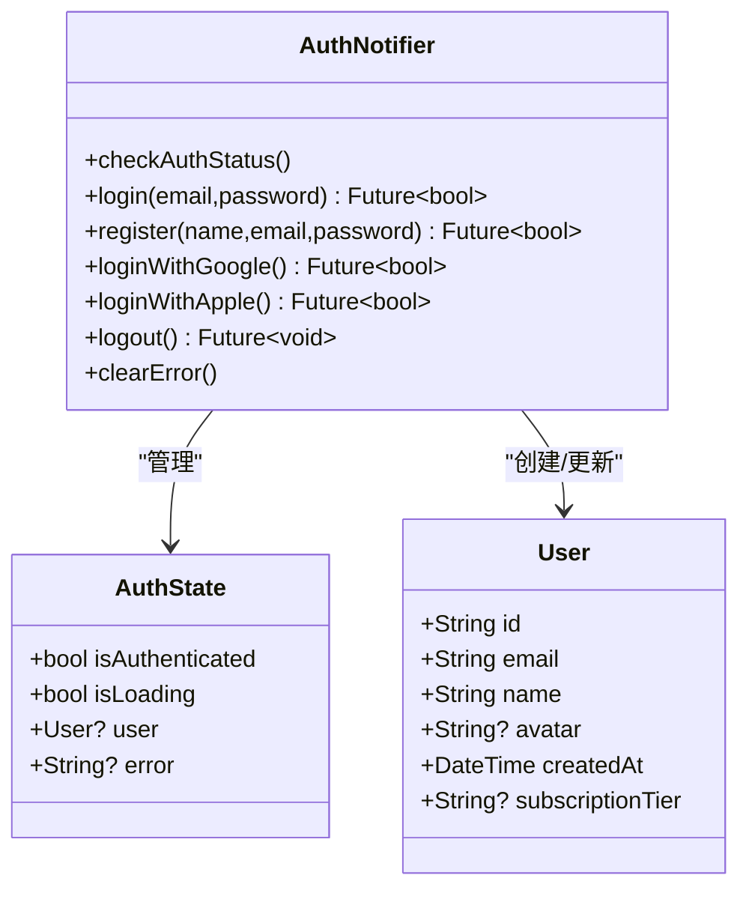
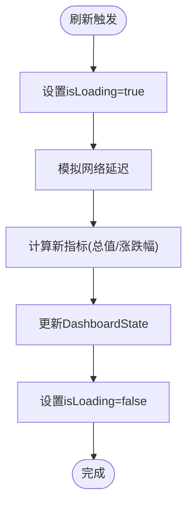
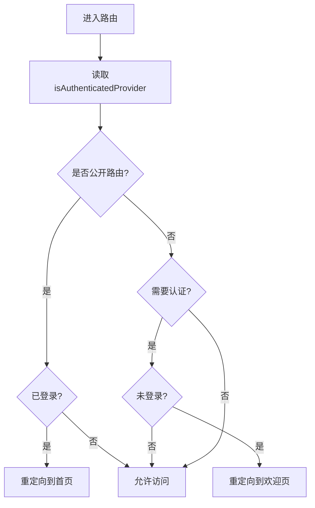
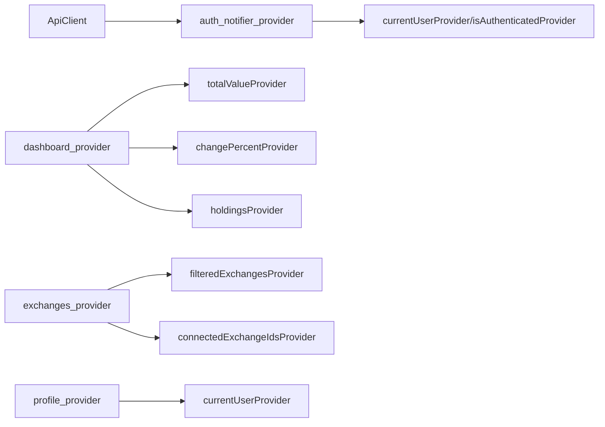

# 状态管理

<cite>
**本文引用的文件**
- [main.dart](file://frontend/lib/main.dart)
- [router.dart](file://frontend/lib/app/router.dart)
- [theme.dart](file://frontend/lib/app/theme.dart)
- [auth_provider.dart](file://frontend/lib/features/auth/auth_provider.dart)
- [login_page.dart](file://frontend/lib/features/auth/login_page.dart)
- [dashboard_provider.dart](file://frontend/lib/features/dashboard/dashboard_provider.dart)
- [dashboard_page.dart](file://frontend/lib/features/dashboard/dashboard_page.dart)
- [exchanges_provider.dart](file://frontend/lib/features/exchanges/exchanges_provider.dart)
- [profile_provider.dart](file://frontend/lib/features/profile/profile_provider.dart)
- [api_client.dart](file://frontend/lib/core/api/api_client.dart)
- [user_model.dart](file://frontend/lib/core/models/user_model.dart)
</cite>

## 目录
1. [简介](#简介)
2. [项目结构](#项目结构)
3. [核心组件](#核心组件)
4. [架构总览](#架构总览)
5. [详细组件分析](#详细组件分析)
6. [依赖关系分析](#依赖关系分析)
7. [性能考量](#性能考量)
8. [故障排查指南](#故障排查指南)
9. [结论](#结论)
10. [附录：最佳实践与示例路径](#附录最佳实践与示例路径)

## 简介
本文件系统性梳理本项目基于 Riverpod 的状态管理体系，覆盖 Provider 体系设计、状态隔离、性能优化、内存管理、状态持久化与同步、错误处理、调试与监控，以及状态与 UI 解耦的设计思路。文档面向不同技术背景读者，既提供高层概览，也给出可直接定位到源码的分析与示例路径。

## 项目结构
前端采用按功能域划分的目录组织方式，状态管理集中在 features 下各功能模块的 provider 文件中，并通过 main.dart 初始化 ProviderContainer，在应用启动阶段预检查认证状态，随后将 Provider 作用域包裹至应用根组件。

**图表来源**
- [main.dart:1-86](file://frontend/lib/main.dart#L1-L86)
- [router.dart:1-278](file://frontend/lib/app/router.dart#L1-L278)
- [auth_provider.dart:1-418](file://frontend/lib/features/auth/auth_provider.dart#L1-L418)
- [dashboard_provider.dart:1-427](file://frontend/lib/features/dashboard/dashboard_provider.dart#L1-L427)
- [exchanges_provider.dart:1-326](file://frontend/lib/features/exchanges/exchanges_provider.dart#L1-L326)
- [profile_provider.dart:1-242](file://frontend/lib/features/profile/profile_provider.dart#L1-L242)
- [login_page.dart:1-415](file://frontend/lib/features/auth/login_page.dart#L1-L415)
- [dashboard_page.dart:1-695](file://frontend/lib/features/dashboard/dashboard_page.dart#L1-L695)
- [api_client.dart:1-364](file://frontend/lib/core/api/api_client.dart#L1-L364)
- [user_model.dart:1-73](file://frontend/lib/core/models/user_model.dart#L1-L73)

**章节来源**
- [main.dart:1-86](file://frontend/lib/main.dart#L1-L86)
- [router.dart:1-278](file://frontend/lib/app/router.dart#L1-L278)

## 核心组件
- 认证 Provider 体系
  - 使用 StateNotifier 管理 AuthState，结合安全存储进行本地持久化；提供登录、注册、第三方登录、登出与错误清理等动作。
  - 提供派生 Provider(currentUserProvider、isAuthenticatedProvider) 以简化 UI 订阅。
  - 示例路径：[auth_provider.dart:90-358](file://frontend/lib/features/auth/auth_provider.dart#L90-L358)，[auth_provider.dart:360-373](file://frontend/lib/features/auth/auth_provider.dart#L360-L373)

- 仪表盘 Provider 体系
  - 使用 StateNotifier 管理 DashboardState，包含总资产、涨跌幅、持仓列表、图表数据、连接节点与时间周期等。
  - 提供多个派生 Provider 以按需订阅子状态，避免全量重建。
  - 示例路径：[dashboard_provider.dart:162-386](file://frontend/lib/features/dashboard/dashboard_provider.dart#L162-L386)，[dashboard_provider.dart:388-427](file://frontend/lib/features/dashboard/dashboard_provider.dart#L388-L427)

- 交易所 Provider 体系
  - 使用 StateNotifier 管理 ExchangesState，支持搜索过滤、连接/断开交易所、刷新连接列表等。
  - 提供派生 Provider 以暴露筛选后的列表与已连接 ID 列表。
  - 示例路径：[exchanges_provider.dart:136-307](file://frontend/lib/features/exchanges/exchanges_provider.dart#L136-L307)，[exchanges_provider.dart:309-326](file://frontend/lib/features/exchanges/exchanges_provider.dart#L309-L326)

- 用户资料与偏好 Provider 体系
  - 使用 StateNotifier 管理 ProfileState，包含用户信息、偏好设置、已连接 API 列表等。
  - 提供派生 Provider 以暴露用户、偏好与已连接 API 列表。
  - 示例路径：[profile_provider.dart:88-221](file://frontend/lib/features/profile/profile_provider.dart#L88-L221)，[profile_provider.dart:223-242](file://frontend/lib/features/profile/profile_provider.dart#L223-L242)

- HTTP 客户端与 Token 管理
  - 基于 Dio 的 ApiClient，统一设置拦截器、日志、错误处理与 Token 刷新；与认证 Provider 的安全存储配合实现持久化。
  - 示例路径：[api_client.dart:24-364](file://frontend/lib/core/api/api_client.dart#L24-L364)

**章节来源**
- [auth_provider.dart:1-418](file://frontend/lib/features/auth/auth_provider.dart#L1-L418)
- [dashboard_provider.dart:1-427](file://frontend/lib/features/dashboard/dashboard_provider.dart#L1-L427)
- [exchanges_provider.dart:1-326](file://frontend/lib/features/exchanges/exchanges_provider.dart#L1-L326)
- [profile_provider.dart:1-242](file://frontend/lib/features/profile/profile_provider.dart#L1-L242)
- [api_client.dart:1-364](file://frontend/lib/core/api/api_client.dart#L1-L364)

## 架构总览
下图展示应用启动、鉴权重定向、Provider 初始化与状态消费的整体流程。

**图表来源**
- [main.dart:9-41](file://frontend/lib/main.dart#L9-L41)
- [router.dart:59-85](file://frontend/lib/app/router.dart#L59-L85)
- [auth_provider.dart:96-113](file://frontend/lib/features/auth/auth_provider.dart#L96-L113)

**章节来源**
- [main.dart:1-86](file://frontend/lib/main.dart#L1-L86)
- [router.dart:1-278](file://frontend/lib/app/router.dart#L1-L278)

## 详细组件分析

### 认证状态管理（StateNotifier + 持久化）
- 设计要点
  - 使用 StateNotifier 管理 AuthState，包含认证状态、加载态、用户对象与错误信息。
  - 在初始化时检查本地安全存储，恢复上次会话。
  - 登录/注册/第三方登录均通过异步方法更新状态并持久化用户信息。
  - 提供派生 Provider 供 UI 直接订阅常用布尔值与用户对象。
- 关键实现路径
  - Notifier 与状态定义：[auth_provider.dart:90-358](file://frontend/lib/features/auth/auth_provider.dart#L90-L358)
  - 派生 Provider：[auth_provider.dart:360-373](file://frontend/lib/features/auth/auth_provider.dart#L360-L373)
  - 登录页消费状态：[login_page.dart:33-45](file://frontend/lib/features/auth/login_page.dart#L33-L45)

**图表来源**
- [auth_provider.dart:20-87](file://frontend/lib/features/auth/auth_provider.dart#L20-L87)
- [auth_provider.dart:90-358](file://frontend/lib/features/auth/auth_provider.dart#L90-L358)
- [user_model.dart:1-73](file://frontend/lib/core/models/user_model.dart#L1-L73)

**章节来源**
- [auth_provider.dart:1-418](file://frontend/lib/features/auth/auth_provider.dart#L1-L418)
- [login_page.dart:1-415](file://frontend/lib/features/auth/login_page.dart#L1-L415)

### 仪表盘状态管理（聚合与派生）
- 设计要点
  - 使用 StateNotifier 管理 DashboardState，包含总资产、涨跌幅、持仓、图表点集、连接节点与选择的时间周期。
  - 提供多个派生 Provider，UI 只订阅所需字段，降低重建范围。
  - 支持刷新与周期切换，内部生成图表点集与统计指标。
- 关键实现路径
  - Notifier 与状态定义：[dashboard_provider.dart:162-386](file://frontend/lib/features/dashboard/dashboard_provider.dart#L162-L386)
  - 派生 Provider：[dashboard_provider.dart:388-427](file://frontend/lib/features/dashboard/dashboard_provider.dart#L388-L427)
  - 页面消费状态：[dashboard_page.dart:16-90](file://frontend/lib/features/dashboard/dashboard_page.dart#L16-L90)

**图表来源**
- [dashboard_provider.dart:329-347](file://frontend/lib/features/dashboard/dashboard_provider.dart#L329-L347)

**章节来源**
- [dashboard_provider.dart:1-427](file://frontend/lib/features/dashboard/dashboard_provider.dart#L1-L427)
- [dashboard_page.dart:1-695](file://frontend/lib/features/dashboard/dashboard_page.dart#L1-L695)

### 交易所连接状态管理（过滤与连接生命周期）
- 设计要点
  - 使用 StateNotifier 管理 ExchangesState，包含可用交易所列表、已连接列表、搜索与筛选条件。
  - 提供筛选逻辑与连接/断开操作，模拟网络延迟后更新状态。
  - 提供派生 Provider 暴露筛选结果与已连接 ID 列表。
- 关键实现路径
  - Notifier 与状态定义：[exchanges_provider.dart:136-307](file://frontend/lib/features/exchanges/exchanges_provider.dart#L136-L307)
  - 派生 Provider：[exchanges_provider.dart:309-326](file://frontend/lib/features/exchanges/exchanges_provider.dart#L309-L326)

**章节来源**
- [exchanges_provider.dart:1-326](file://frontend/lib/features/exchanges/exchanges_provider.dart#L1-L326)

### 用户资料与偏好状态管理（轻量异步更新）
- 设计要点
  - 使用 StateNotifier 管理 ProfileState，包含用户、偏好设置与已连接 API 列表。
  - 提供更新资料、偏好与开关项的异步方法，模拟网络延迟后更新状态。
  - 提供派生 Provider 暴露用户、偏好与已连接 API 列表。
- 关键实现路径
  - Notifier 与状态定义：[profile_provider.dart:88-221](file://frontend/lib/features/profile/profile_provider.dart#L88-L221)
  - 派生 Provider：[profile_provider.dart:223-242](file://frontend/lib/features/profile/profile_provider.dart#L223-L242)

**章节来源**
- [profile_provider.dart:1-242](file://frontend/lib/features/profile/profile_provider.dart#L1-L242)

### 路由与鉴权重定向（基于 Provider 的认证守卫）
- 设计要点
  - 在路由重定向函数中，通过 ProviderScope.containerOf 获取 ProviderContainer，读取 isAuthenticatedProvider 判断是否需要重定向。
  - 对公开路由与私有路由进行分流，确保未登录用户无法访问受保护页面。
- 关键实现路径
  - 重定向逻辑：[router.dart:59-85](file://frontend/lib/app/router.dart#L59-L85)
  - 路由配置与分支：[router.dart:87-202](file://frontend/lib/app/router.dart#L87-L202)

**图表来源**
- [router.dart:59-85](file://frontend/lib/app/router.dart#L59-L85)

**章节来源**
- [router.dart:1-278](file://frontend/lib/app/router.dart#L1-L278)

## 依赖关系分析
- Provider 间依赖
  - 派生 Provider 依赖核心 StateNotifierProvider，形成“核心状态 -> 派生视图”的单向依赖链，避免跨模块耦合。
  - UI 通过 ConsumerWidget 订阅派生 Provider，减少不必要的重建。
- 外部依赖
  - 安全存储用于认证 Token 与用户信息持久化。
  - Dio 拦截器负责自动注入 Token、处理 401 并尝试刷新 Token。
- 关键实现路径
  - 派生 Provider 与订阅：[auth_provider.dart:360-373](file://frontend/lib/features/auth/auth_provider.dart#L360-L373)，[dashboard_provider.dart:388-427](file://frontend/lib/features/dashboard/dashboard_provider.dart#L388-L427)，[exchanges_provider.dart:309-326](file://frontend/lib/features/exchanges/exchanges_provider.dart#L309-L326)，[profile_provider.dart:223-242](file://frontend/lib/features/profile/profile_provider.dart#L223-L242)
  - 安全存储与拦截器：[auth_provider.dart:9-17](file://frontend/lib/features/auth/auth_provider.dart#L9-L17)，[api_client.dart:52-121](file://frontend/lib/core/api/api_client.dart#L52-L121)

**图表来源**
- [auth_provider.dart:360-373](file://frontend/lib/features/auth/auth_provider.dart#L360-L373)
- [dashboard_provider.dart:388-427](file://frontend/lib/features/dashboard/dashboard_provider.dart#L388-L427)
- [exchanges_provider.dart:309-326](file://frontend/lib/features/exchanges/exchanges_provider.dart#L309-L326)
- [profile_provider.dart:223-242](file://frontend/lib/features/profile/profile_provider.dart#L223-L242)
- [api_client.dart:24-364](file://frontend/lib/core/api/api_client.dart#L24-L364)

**章节来源**
- [auth_provider.dart:1-418](file://frontend/lib/features/auth/auth_provider.dart#L1-L418)
- [dashboard_provider.dart:1-427](file://frontend/lib/features/dashboard/dashboard_provider.dart#L1-L427)
- [exchanges_provider.dart:1-326](file://frontend/lib/features/exchanges/exchanges_provider.dart#L1-L326)
- [profile_provider.dart:1-242](file://frontend/lib/features/profile/profile_provider.dart#L1-L242)
- [api_client.dart:1-364](file://frontend/lib/core/api/api_client.dart#L1-L364)

## 性能考量
- 状态隔离与细粒度订阅
  - 通过派生 Provider 将复杂状态拆分为更小的订阅单元，避免因单一状态变更导致整屏重建。
  - 示例路径：[dashboard_provider.dart:388-427](file://frontend/lib/features/dashboard/dashboard_provider.dart#L388-L427)
- 避免重复计算
  - 在 Notifier 中缓存或复用计算结果（如图表点集），并在状态不可变更新后返回新实例。
  - 示例路径：[dashboard_provider.dart:359-367](file://frontend/lib/features/dashboard/dashboard_provider.dart#L359-L367)
- 异步操作与加载态
  - 在发起网络请求或耗时操作前设置 isLoading，完成后清除，避免 UI 闪烁与重复请求。
  - 示例路径：[auth_provider.dart:116-172](file://frontend/lib/features/auth/auth_provider.dart#L116-L172)，[exchanges_provider.dart:247-296](file://frontend/lib/features/exchanges/exchanges_provider.dart#L247-L296)
- 内存管理
  - 控制控制器与资源释放（如登录页的 TextEditingController），避免内存泄漏。
  - 示例路径：[login_page.dart:20-31](file://frontend/lib/features/auth/login_page.dart#L20-L31)
- 网络层优化
  - 使用 Dio 拦截器统一处理 Token 注入与刷新，减少重复代码与错误遗漏。
  - 示例路径：[api_client.dart:52-121](file://frontend/lib/core/api/api_client.dart#L52-L121)

**章节来源**
- [dashboard_provider.dart:1-427](file://frontend/lib/features/dashboard/dashboard_provider.dart#L1-L427)
- [auth_provider.dart:1-418](file://frontend/lib/features/auth/auth_provider.dart#L1-L418)
- [exchanges_provider.dart:1-326](file://frontend/lib/features/exchanges/exchanges_provider.dart#L1-L326)
- [login_page.dart:1-415](file://frontend/lib/features/auth/login_page.dart#L1-L415)
- [api_client.dart:1-364](file://frontend/lib/core/api/api_client.dart#L1-L364)

## 故障排查指南
- 认证失败与错误提示
  - 在登录/注册/第三方登录失败时，Notifer 设置错误信息；UI 通过错误字段渲染提示。
  - 示例路径：[auth_provider.dart:116-172](file://frontend/lib/features/auth/auth_provider.dart#L116-L172)，[login_page.dart:107-138](file://frontend/lib/features/auth/login_page.dart#L107-L138)
- Token 过期与自动刷新
  - 401 错误时，拦截器尝试刷新 Token 并重试原请求；若失败则清除 Token 并通知应用跳转登录。
  - 示例路径：[api_client.dart:94-121](file://frontend/lib/core/api/api_client.dart#L94-L121)，[api_client.dart:123-160](file://frontend/lib/core/api/api_client.dart#L123-L160)，[api_client.dart:162-181](file://frontend/lib/core/api/api_client.dart#L162-L181)
- 网络异常与错误映射
  - 根据 Dio 异常类型与状态码映射为用户可读的错误消息。
  - 示例路径：[api_client.dart:302-332](file://frontend/lib/core/api/api_client.dart#L302-L332)，[api_client.dart:334-362](file://frontend/lib/core/api/api_client.dart#L334-L362)
- 调试技巧
  - 在 debug 模式开启日志拦截器，观察请求/响应详情。
  - 示例路径：[api_client.dart:62-76](file://frontend/lib/core/api/api_client.dart#L62-L76)

**章节来源**
- [auth_provider.dart:1-418](file://frontend/lib/features/auth/auth_provider.dart#L1-L418)
- [api_client.dart:1-364](file://frontend/lib/core/api/api_client.dart#L1-L364)
- [login_page.dart:1-415](file://frontend/lib/features/auth/login_page.dart#L1-L415)

## 结论
本项目采用 Riverpod 的 Provider 体系实现了清晰的状态隔离与高效的 UI 更新。通过 StateNotifier 管理核心状态、派生 Provider 提供细粒度订阅、安全存储与 Dio 拦截器保障持久化与网络层一致性，整体具备良好的可维护性与扩展性。建议在后续迭代中持续关注订阅粒度与异步流程的可观测性，进一步完善错误上报与性能监控。

## 附录：最佳实践与示例路径
- 状态隔离与派生 Provider
  - 将复杂状态拆分为多个派生 Provider，UI 仅订阅所需字段。
  - 示例路径：[dashboard_provider.dart:388-427](file://frontend/lib/features/dashboard/dashboard_provider.dart#L388-L427)，[exchanges_provider.dart:309-326](file://frontend/lib/features/exchanges/exchanges_provider.dart#L309-L326)
- 不同 Provider 类型的选择
  - StateNotifierProvider：适合需要显式管理状态与异步副作用的场景（认证、仪表盘、交易所、用户资料）。
  - Provider：适合基于已有状态派生的只读数据（当前用户、认证布尔值、筛选结果等）。
  - 示例路径：[auth_provider.dart:360-373](file://frontend/lib/features/auth/auth_provider.dart#L360-L373)，[dashboard_provider.dart:388-427](file://frontend/lib/features/dashboard/dashboard_provider.dart#L388-L427)
- 状态持久化与同步
  - 使用安全存储保存 Token 与用户信息；在应用启动时预检查并恢复状态。
  - 示例路径：[auth_provider.dart:9-17](file://frontend/lib/features/auth/auth_provider.dart#L9-L17)，[auth_provider.dart:96-113](file://frontend/lib/features/auth/auth_provider.dart#L96-L113)，[main.dart:29-40](file://frontend/lib/main.dart#L29-L40)
- 错误处理与用户体验
  - 在 Notifier 中设置错误字段，UI 条件渲染错误提示；在网络层统一映射错误消息。
  - 示例路径：[auth_provider.dart:116-172](file://frontend/lib/features/auth/auth_provider.dart#L116-L172)，[api_client.dart:302-332](file://frontend/lib/core/api/api_client.dart#L302-L332)
- 与 UI 解耦设计
  - 页面通过 ConsumerWidget 订阅 Provider，不直接持有业务逻辑；路由重定向通过 Provider 判断认证状态。
  - 示例路径：[login_page.dart:33-45](file://frontend/lib/features/auth/login_page.dart#L33-L45)，[router.dart:59-85](file://frontend/lib/app/router.dart#L59-L85)