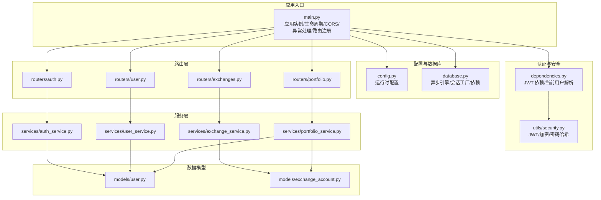
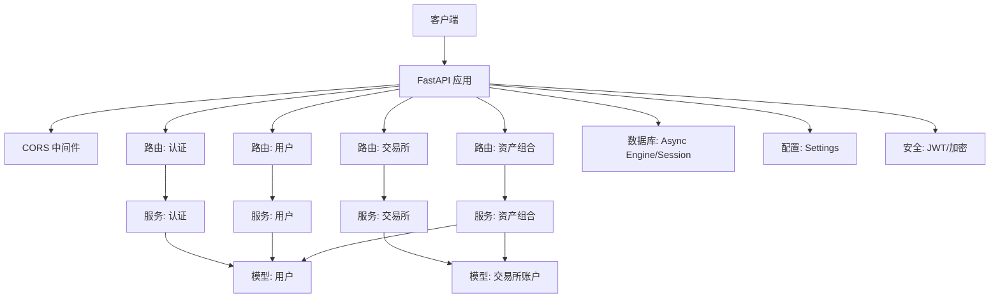
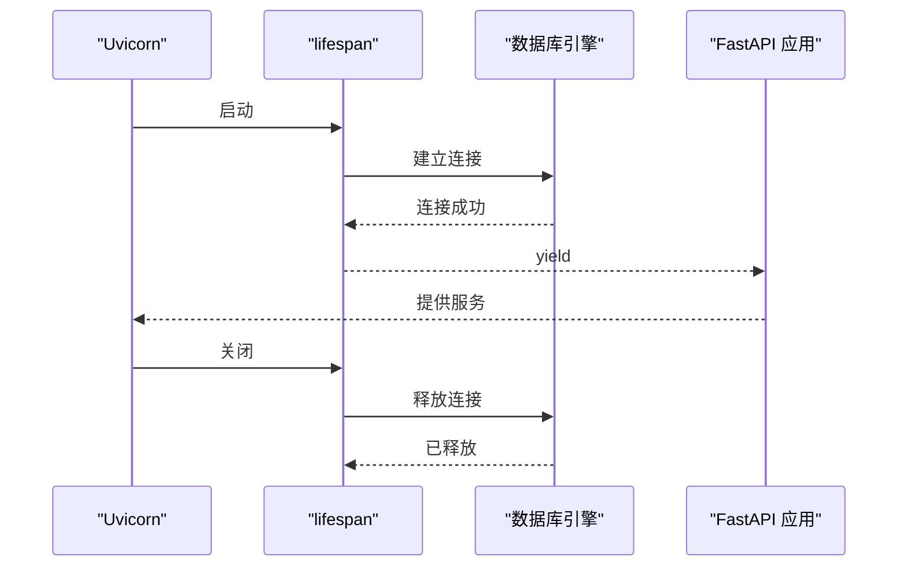
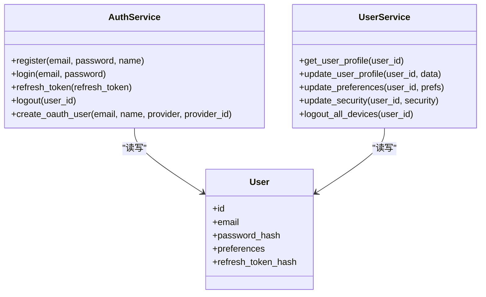
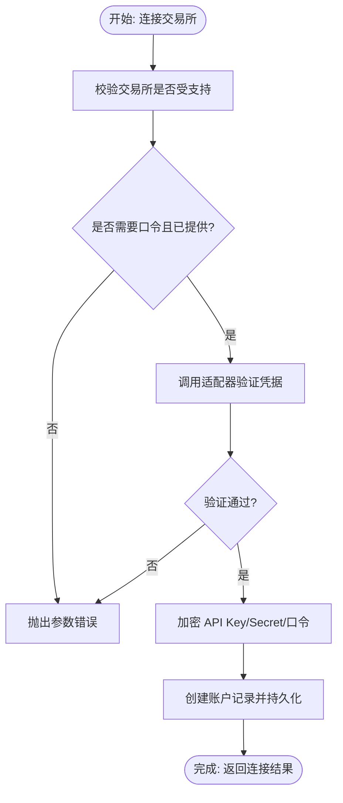
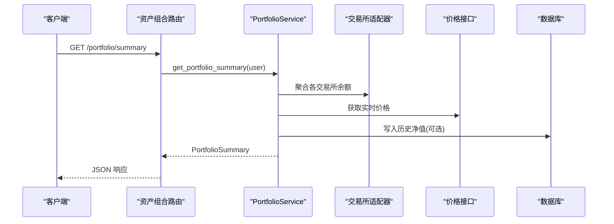
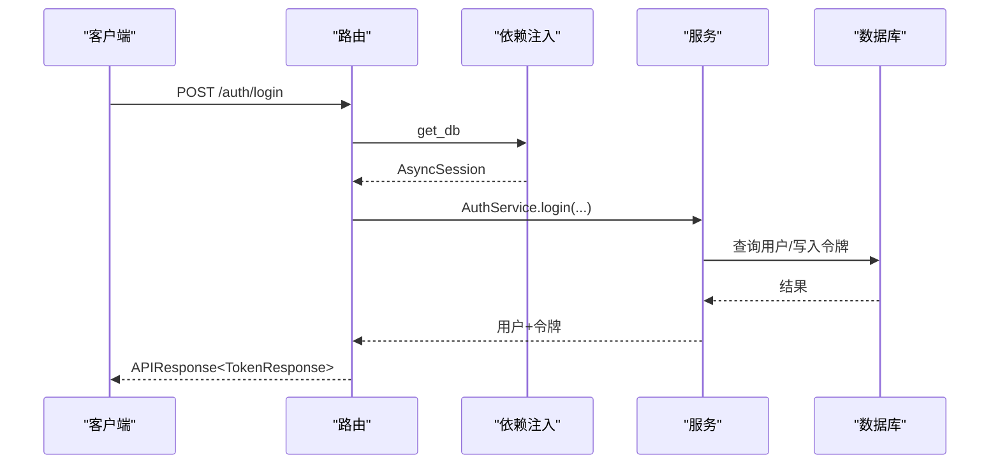
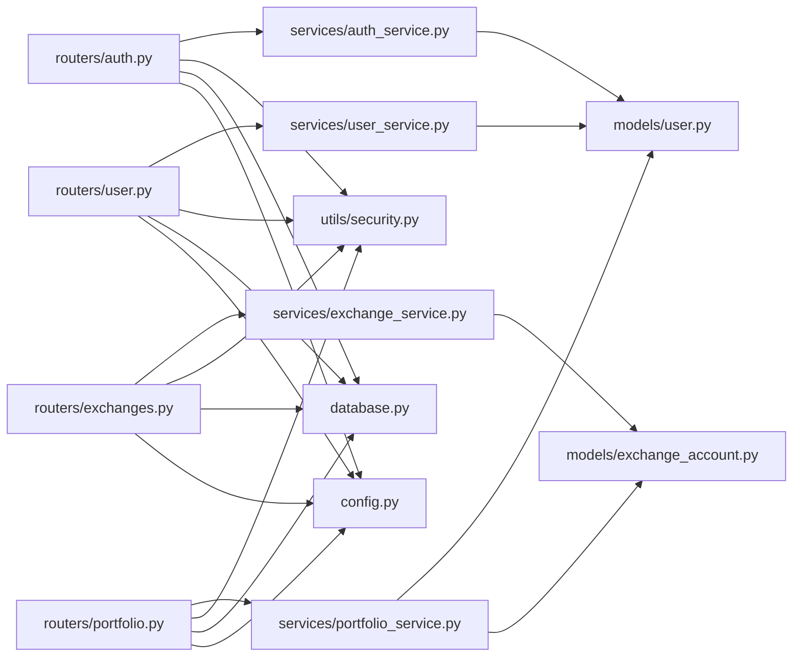

# 后端服务

<cite>
**本文引用的文件**
- [backend/app/main.py](file://backend/app/main.py)
- [backend/app/config.py](file://backend/app/config.py)
- [backend/app/database.py](file://backend/app/database.py)
- [backend/app/dependencies.py](file://backend/app/dependencies.py)
- [backend/app/utils/security.py](file://backend/app/utils/security.py)
- [backend/app/routers/auth.py](file://backend/app/routers/auth.py)
- [backend/app/routers/exchanges.py](file://backend/app/routers/exchanges.py)
- [backend/app/routers/portfolio.py](file://backend/app/routers/portfolio.py)
- [backend/app/routers/user.py](file://backend/app/routers/user.py)
- [backend/app/services/auth_service.py](file://backend/app/services/auth_service.py)
- [backend/app/services/user_service.py](file://backend/app/services/user_service.py)
- [backend/app/services/exchange_service.py](file://backend/app/services/exchange_service.py)
- [backend/app/services/portfolio_service.py](file://backend/app/services/portfolio_service.py)
- [backend/app/models/user.py](file://backend/app/models/user.py)
- [backend/app/models/exchange_account.py](file://backend/app/models/exchange_account.py)
</cite>

## 目录
1. [简介](#简介)
2. [项目结构](#项目结构)
3. [核心组件](#核心组件)
4. [架构总览](#架构总览)
5. [详细组件分析](#详细组件分析)
6. [依赖分析](#依赖分析)
7. [性能考虑](#性能考虑)
8. [故障排查指南](#故障排查指南)
9. [结论](#结论)
10. [附录](#附录)

## 简介
本项目是一个基于 FastAPI 的 Python 后端服务，用于多交易所加密货币资产组合追踪。系统采用异步编程模型，结合 SQLAlchemy Async ORM、Pydantic 模式校验、JWT 认证与加密存储，提供认证、用户、交易所连接与资产组合聚合等能力。项目通过依赖注入与中间件机制实现清晰的控制流与可维护性。

## 项目结构
后端代码位于 backend/app 目录，按功能域划分路由、服务、模型、工具与配置。主要目录与职责如下：
- app/main.py：应用入口与生命周期管理、CORS 中间件、全局异常处理器、路由注册
- app/config.py：运行时配置读取与校验（支持开发/生产环境）
- app/database.py：异步数据库引擎、会话工厂与依赖
- app/dependencies.py：认证依赖（JWT 校验、当前用户解析）
- app/utils/security.py：密码哈希、JWT 签发与校验、API 密钥加解密
- app/routers/*：路由层（认证、用户、交易所、资产组合）
- app/services/*：服务层（业务逻辑封装）
- app/models/*：SQLAlchemy ORM 模型
- app/schemas/*：请求/响应 Pydantic 模型（定义于对应目录）

图表来源
- [backend/app/main.py:33-101](file://backend/app/main.py#L33-L101)
- [backend/app/config.py:5-51](file://backend/app/config.py#L5-L51)
- [backend/app/database.py:6-33](file://backend/app/database.py#L6-L33)
- [backend/app/dependencies.py:18-74](file://backend/app/dependencies.py#L18-L74)
- [backend/app/utils/security.py:28-59](file://backend/app/utils/security.py#L28-L59)
- [backend/app/routers/auth.py:22-253](file://backend/app/routers/auth.py#L22-L253)
- [backend/app/routers/user.py:19-280](file://backend/app/routers/user.py#L19-L280)
- [backend/app/routers/exchanges.py:20-225](file://backend/app/routers/exchanges.py#L20-L225)
- [backend/app/routers/portfolio.py:26-217](file://backend/app/routers/portfolio.py#L26-L217)
- [backend/app/services/auth_service.py:20-247](file://backend/app/services/auth_service.py#L20-L247)
- [backend/app/services/user_service.py:19-223](file://backend/app/services/user_service.py#L19-L223)
- [backend/app/services/exchange_service.py:26-414](file://backend/app/services/exchange_service.py#L26-L414)
- [backend/app/services/portfolio_service.py:31-317](file://backend/app/services/portfolio_service.py#L31-L317)
- [backend/app/models/user.py:11-32](file://backend/app/models/user.py#L11-L32)
- [backend/app/models/exchange_account.py:11-32](file://backend/app/models/exchange_account.py#L11-L32)

章节来源
- [backend/app/main.py:13-131](file://backend/app/main.py#L13-L131)
- [backend/app/config.py:1-51](file://backend/app/config.py#L1-L51)
- [backend/app/database.py:1-33](file://backend/app/database.py#L1-L33)
- [backend/app/dependencies.py:1-74](file://backend/app/dependencies.py#L1-L74)
- [backend/app/utils/security.py:1-97](file://backend/app/utils/security.py#L1-L97)

## 核心组件
- 应用入口与生命周期
  - 使用 lifespan 管理启动与关闭事件，初始化数据库连接并在关闭时释放资源。
  - 注册 CORS 中间件，支持开发与生产环境的跨域配置。
  - 全局异常处理器：自定义异常与通用异常分别返回统一格式。
  - 路由注册：将认证、用户、交易所、资产组合路由挂载到统一前缀。
- 配置系统
  - 通过 Settings 读取 .env 并进行生产环境密钥校验，确保安全配置。
- 数据库与依赖注入
  - 异步引擎与会话工厂，提供 get_db 依赖；模型定义用户与交易所账户。
- 认证与安全
  - JWT 签发与校验、刷新令牌轮换、密码哈希；API Key 加密存储。
- 路由与服务
  - 路由层负责请求接收与响应包装；服务层封装业务逻辑，调用模型与工具。

章节来源
- [backend/app/main.py:13-131](file://backend/app/main.py#L13-L131)
- [backend/app/config.py:5-51](file://backend/app/config.py#L5-L51)
- [backend/app/database.py:6-33](file://backend/app/database.py#L6-L33)
- [backend/app/dependencies.py:18-74](file://backend/app/dependencies.py#L18-L74)
- [backend/app/utils/security.py:28-59](file://backend/app/utils/security.py#L28-L59)
- [backend/app/routers/auth.py:22-253](file://backend/app/routers/auth.py#L22-L253)
- [backend/app/routers/user.py:19-280](file://backend/app/routers/user.py#L19-L280)
- [backend/app/routers/exchanges.py:20-225](file://backend/app/routers/exchanges.py#L20-L225)
- [backend/app/routers/portfolio.py:26-217](file://backend/app/routers/portfolio.py#L26-L217)
- [backend/app/services/auth_service.py:20-247](file://backend/app/services/auth_service.py#L20-L247)
- [backend/app/services/user_service.py:19-223](file://backend/app/services/user_service.py#L19-L223)
- [backend/app/services/exchange_service.py:26-414](file://backend/app/services/exchange_service.py#L26-L414)
- [backend/app/services/portfolio_service.py:31-317](file://backend/app/services/portfolio_service.py#L31-L317)
- [backend/app/models/user.py:11-32](file://backend/app/models/user.py#L11-L32)
- [backend/app/models/exchange_account.py:11-32](file://backend/app/models/exchange_account.py#L11-L32)

## 架构总览
系统采用“路由层-服务层-模型层”的分层架构，配合依赖注入与中间件，形成清晰的职责边界与扩展路径。

图表来源
- [backend/app/main.py:33-101](file://backend/app/main.py#L33-L101)
- [backend/app/routers/auth.py:22-253](file://backend/app/routers/auth.py#L22-L253)
- [backend/app/routers/user.py:19-280](file://backend/app/routers/user.py#L19-L280)
- [backend/app/routers/exchanges.py:20-225](file://backend/app/routers/exchanges.py#L20-L225)
- [backend/app/routers/portfolio.py:26-217](file://backend/app/routers/portfolio.py#L26-L217)
- [backend/app/services/auth_service.py:20-247](file://backend/app/services/auth_service.py#L20-L247)
- [backend/app/services/user_service.py:19-223](file://backend/app/services/user_service.py#L19-L223)
- [backend/app/services/exchange_service.py:26-414](file://backend/app/services/exchange_service.py#L26-L414)
- [backend/app/services/portfolio_service.py:31-317](file://backend/app/services/portfolio_service.py#L31-L317)
- [backend/app/models/user.py:11-32](file://backend/app/models/user.py#L11-L32)
- [backend/app/models/exchange_account.py:11-32](file://backend/app/models/exchange_account.py#L11-L32)
- [backend/app/config.py:5-51](file://backend/app/config.py#L5-L51)
- [backend/app/database.py:6-33](file://backend/app/database.py#L6-L33)
- [backend/app/utils/security.py:28-59](file://backend/app/utils/security.py#L28-L59)

## 详细组件分析

### 应用入口与生命周期管理
- 生命周期
  - 启动：建立数据库连接（开发环境可创建表，生产建议使用迁移工具）
  - 关闭：释放数据库连接
- 中间件
  - CORS：开发/生产动态配置允许的源
- 异常处理
  - 自定义异常：返回统一结构（success/message/error_code/details）
  - 通用异常：返回 500 与标准错误码
- 路由注册
  - 统一 API 前缀，挂载认证、用户、交易所、资产组合路由

图表来源
- [backend/app/main.py:13-31](file://backend/app/main.py#L13-L31)

章节来源
- [backend/app/main.py:13-131](file://backend/app/main.py#L13-L131)

### 认证服务与用户服务
- 认证服务
  - 注册：邮箱去重、密码哈希、签发访问/刷新令牌并持久化刷新令牌哈希
  - 登录：邮箱查找、激活状态检查、密码校验、签发令牌
  - 刷新：校验刷新令牌类型与有效性、执行令牌轮换
  - OAuth：Google/Apple 登录，创建或更新用户并签发令牌
  - 登出：撤销刷新令牌（清空哈希）
- 用户服务
  - 用户画像：读取用户信息与偏好设置
  - 更新资料/偏好/安全设置：字段级更新并返回最新视图
  - 登出所有设备：通过清空刷新令牌哈希实现

图表来源
- [backend/app/services/auth_service.py:20-247](file://backend/app/services/auth_service.py#L20-L247)
- [backend/app/services/user_service.py:19-223](file://backend/app/services/user_service.py#L19-L223)
- [backend/app/models/user.py:11-32](file://backend/app/models/user.py#L11-L32)

章节来源
- [backend/app/services/auth_service.py:20-247](file://backend/app/services/auth_service.py#L20-L247)
- [backend/app/services/user_service.py:19-223](file://backend/app/services/user_service.py#L19-L223)
- [backend/app/models/user.py:11-32](file://backend/app/models/user.py#L11-L32)

### 交易所服务与适配器
- 功能职责
  - 支持交易所清单（硬编码），含是否支持现货/永续、是否需要口令等
  - 连接管理：校验凭据、加密存储、软删除（断开）
  - 同步触发：更新状态为“同步中”，预留后台任务
  - 状态查询：返回连接状态、最后同步时间、余额计数等
- 适配器
  - 通过适配器验证连接有效性（当前使用 mock 适配器）

图表来源
- [backend/app/services/exchange_service.py:231-301](file://backend/app/services/exchange_service.py#L231-L301)

章节来源
- [backend/app/services/exchange_service.py:26-414](file://backend/app/services/exchange_service.py#L26-L414)
- [backend/app/models/exchange_account.py:11-32](file://backend/app/models/exchange_account.py#L11-L32)

### 资产组合服务
- 功能职责
  - 资产概览：总价值、24 小时涨跌与来源分布（Mock）
  - 历史净值：按周期生成时间序列与统计指标（Mock）
  - 持仓列表：按币种聚合、价格与占比（Mock）
  - 数据源：已连接数据源列表（Mock）
- 扩展方向
  - 聚合交易所余额、调用价格接口、缓存与历史净值入库、后台同步任务

图表来源
- [backend/app/routers/portfolio.py:33-59](file://backend/app/routers/portfolio.py#L33-L59)
- [backend/app/services/portfolio_service.py:41-65](file://backend/app/services/portfolio_service.py#L41-L65)

章节来源
- [backend/app/routers/portfolio.py:26-217](file://backend/app/routers/portfolio.py#L26-L217)
- [backend/app/services/portfolio_service.py:31-317](file://backend/app/services/portfolio_service.py#L31-L317)

### 路由组织与依赖注入
- 路由组织
  - 认证：注册、登录、刷新、登出、OAuth
  - 用户：个人资料、偏好、安全设置、已连 API
  - 交易所：支持列表、已连列表、连接/断开、手动同步、状态查询
  - 资产组合：概览、历史、持仓、数据源
- 依赖注入
  - get_db：提供异步会话
  - get_current_user/get_optional_user：从 JWT 解析当前用户
  - 路由层通过 Depends 注入服务层，服务层再操作模型

图表来源
- [backend/app/routers/auth.py:55-81](file://backend/app/routers/auth.py#L55-L81)
- [backend/app/dependencies.py:18-57](file://backend/app/dependencies.py#L18-L57)
- [backend/app/database.py:26-33](file://backend/app/database.py#L26-L33)

章节来源
- [backend/app/routers/auth.py:22-253](file://backend/app/routers/auth.py#L22-L253)
- [backend/app/routers/user.py:19-280](file://backend/app/routers/user.py#L19-L280)
- [backend/app/routers/exchanges.py:20-225](file://backend/app/routers/exchanges.py#L20-L225)
- [backend/app/routers/portfolio.py:26-217](file://backend/app/routers/portfolio.py#L26-L217)
- [backend/app/dependencies.py:18-74](file://backend/app/dependencies.py#L18-L74)
- [backend/app/database.py:26-33](file://backend/app/database.py#L26-L33)

## 依赖分析
- 组件耦合
  - 路由层仅依赖服务层与依赖注入，低耦合高内聚
  - 服务层依赖模型与工具，避免直接依赖外部框架
  - 模型仅承载数据结构与关系，无业务逻辑
- 外部依赖
  - FastAPI、SQLAlchemy Async、Pydantic、cryptography、jose、passlib
- 循环依赖
  - 未发现循环导入；路由/服务/模型分层清晰

图表来源
- [backend/app/routers/auth.py:18-20](file://backend/app/routers/auth.py#L18-L20)
- [backend/app/routers/user.py:17-17](file://backend/app/routers/user.py#L17-L17)
- [backend/app/routers/exchanges.py:17-17](file://backend/app/routers/exchanges.py#L17-L17)
- [backend/app/routers/portfolio.py:24-24](file://backend/app/routers/portfolio.py#L24-L24)
- [backend/app/services/auth_service.py:5-17](file://backend/app/services/auth_service.py#L5-L17)
- [backend/app/services/user_service.py:4-16](file://backend/app/services/user_service.py#L4-L16)
- [backend/app/services/exchange_service.py:8-23](file://backend/app/services/exchange_service.py#L8-L23)
- [backend/app/services/portfolio_service.py:16-28](file://backend/app/services/portfolio_service.py#L16-L28)
- [backend/app/models/user.py:4-8](file://backend/app/models/user.py#L4-L8)
- [backend/app/models/exchange_account.py:4-8](file://backend/app/models/exchange_account.py#L4-L8)
- [backend/app/utils/security.py:9-12](file://backend/app/utils/security.py#L9-L12)
- [backend/app/database.py:1-4](file://backend/app/database.py#L1-L4)
- [backend/app/config.py:1-4](file://backend/app/config.py#L1-L4)

章节来源
- [backend/app/routers/auth.py:18-20](file://backend/app/routers/auth.py#L18-L20)
- [backend/app/routers/user.py:17-17](file://backend/app/routers/user.py#L17-L17)
- [backend/app/routers/exchanges.py:17-17](file://backend/app/routers/exchanges.py#L17-L17)
- [backend/app/routers/portfolio.py:24-24](file://backend/app/routers/portfolio.py#L24-L24)
- [backend/app/services/auth_service.py:5-17](file://backend/app/services/auth_service.py#L5-L17)
- [backend/app/services/user_service.py:4-16](file://backend/app/services/user_service.py#L4-L16)
- [backend/app/services/exchange_service.py:8-23](file://backend/app/services/exchange_service.py#L8-L23)
- [backend/app/services/portfolio_service.py:16-28](file://backend/app/services/portfolio_service.py#L16-L28)
- [backend/app/models/user.py:4-8](file://backend/app/models/user.py#L4-L8)
- [backend/app/models/exchange_account.py:4-8](file://backend/app/models/exchange_account.py#L4-L8)
- [backend/app/utils/security.py:9-12](file://backend/app/utils/security.py#L9-L12)
- [backend/app/database.py:1-4](file://backend/app/database.py#L1-L4)
- [backend/app/config.py:1-4](file://backend/app/config.py#L1-L4)

## 性能考虑
- 异步编程
  - 使用 SQLAlchemy Async 与 FastAPI 异步特性，减少阻塞 IO
- 依赖注入
  - 通过 get_db 提供短生命周期会话，避免长事务与锁竞争
- 缓存与批处理
  - 建议对价格查询与频繁读取的用户偏好设置引入缓存（Redis）
- 数据库连接
  - 使用连接池与合理的超时配置，避免连接泄漏
- 路由与服务分离
  - 将耗时任务（如同步交易所余额）放入后台任务队列，避免阻塞请求线程

## 故障排查指南
- 认证失败
  - 检查 Authorization 头是否携带有效 JWT；确认令牌类型为 access；核对用户是否激活
- 刷新令牌无效
  - 确认刷新令牌未被撤销（用户登出/登出所有设备会清空哈希）
- 交易所连接失败
  - 确认凭据正确、交易所受支持、是否需要口令；检查加密流程与适配器验证
- 数据库连接问题
  - 检查 DATABASE_URL、网络连通性与权限；查看 lifespan 启停日志
- CORS 报错
  - 开发环境确认允许的源列表；生产环境核对 ALLOWED_ORIGINS

章节来源
- [backend/app/dependencies.py:18-57](file://backend/app/dependencies.py#L18-L57)
- [backend/app/services/auth_service.py:99-141](file://backend/app/services/auth_service.py#L99-L141)
- [backend/app/services/exchange_service.py:231-301](file://backend/app/services/exchange_service.py#L231-L301)
- [backend/app/main.py:13-31](file://backend/app/main.py#L13-L31)

## 结论
本项目以 FastAPI 为核心，结合异步数据库与安全工具，构建了清晰的分层架构。通过依赖注入与中间件机制，实现了可维护的路由组织与统一的异常处理。服务层封装业务逻辑，预留真实数据聚合与后台任务扩展点，具备良好的演进空间。建议后续完善后台同步、价格缓存与鉴权增强，以满足生产环境需求。

## 附录
- 配置项要点
  - APP_NAME、DEBUG、API_V1_PREFIX、DATABASE_URL、REDIS_URL、JWT_SECRET_KEY、ENCRYPTION_KEY、ALLOWED_ORIGINS、COINGECKO_API_URL
- 常用端点
  - 认证：POST /api/v1/auth/register, POST /api/v1/auth/login, POST /api/v1/auth/refresh, POST /api/v1/auth/logout
  - 用户：GET/PUT /api/v1/user/profile, GET/PUT /api/v1/user/preferences, GET/PUT /api/v1/user/security
  - 交易所：GET /api/v1/exchanges, GET /api/v1/exchanges/connected, POST /api/v1/exchanges/connect, DELETE /api/v1/exchanges/{id}, POST /api/v1/exchanges/{id}/sync
  - 资产组合：GET /api/v1/portfolio/summary, GET /api/v1/portfolio/history, GET /api/v1/portfolio/holdings, GET /api/v1/portfolio/sources