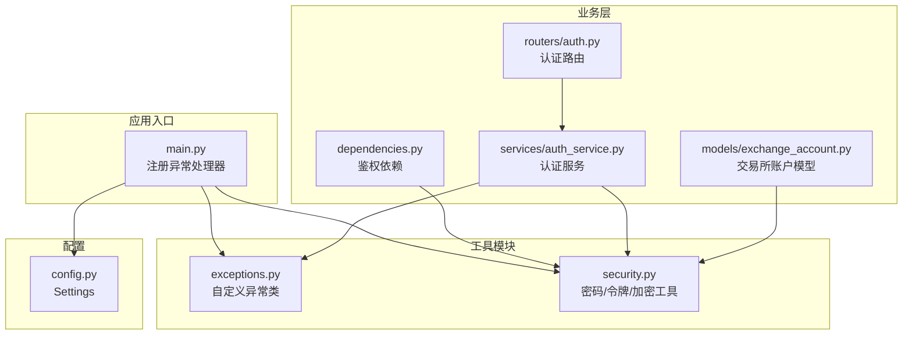
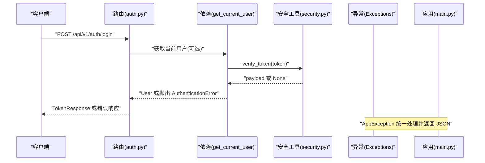
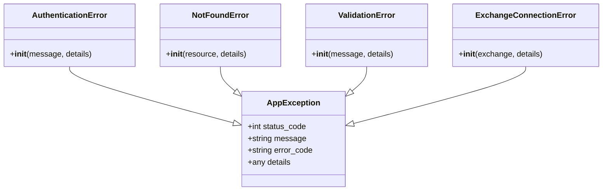
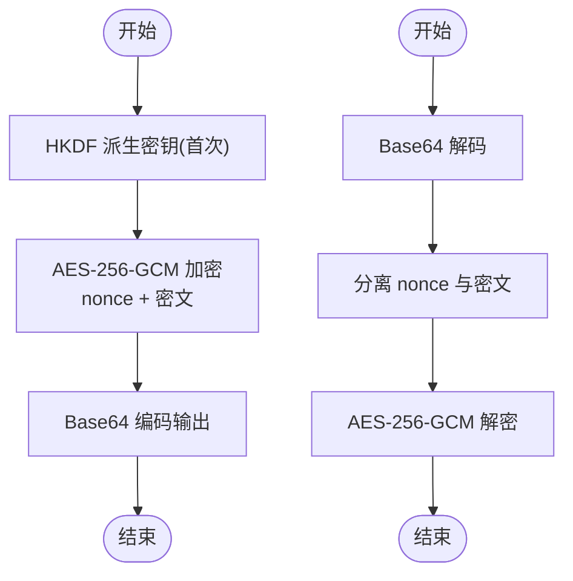
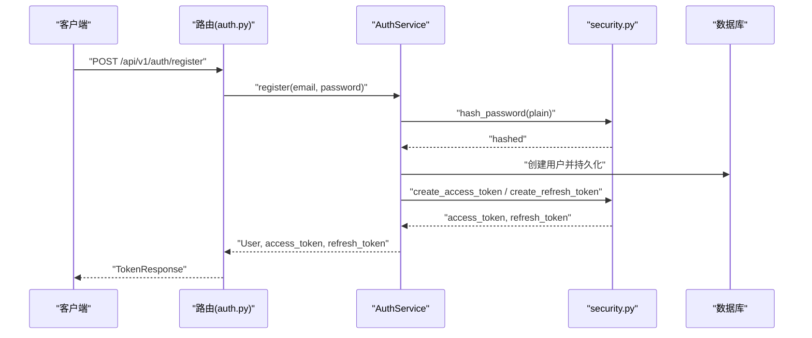
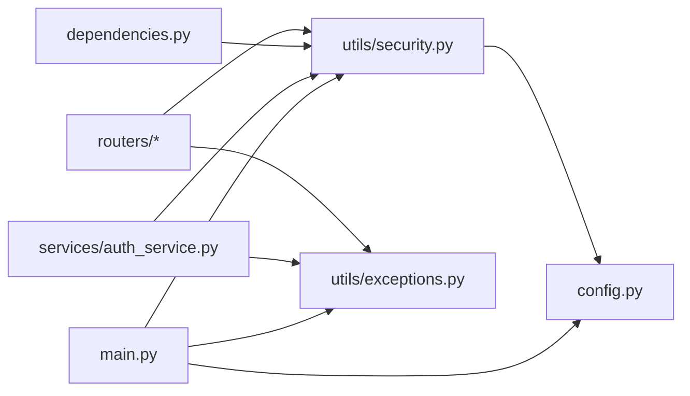

# 工具模块

<cite>
**本文引用的文件**
- [exceptions.py](file://backend/app/utils/exceptions.py)
- [security.py](file://backend/app/utils/security.py)
- [main.py](file://backend/app/main.py)
- [config.py](file://backend/app/config.py)
- [auth_service.py](file://backend/app/services/auth_service.py)
- [auth.py](file://backend/app/routers/auth.py)
- [dependencies.py](file://backend/app/dependencies.py)
- [exchange_account.py](file://backend/app/models/exchange_account.py)
- [requirements.txt](file://backend/requirements.txt)
</cite>

## 目录
1. [简介](#简介)
2. [项目结构](#项目结构)
3. [核心组件](#核心组件)
4. [架构总览](#架构总览)
5. [详细组件分析](#详细组件分析)
6. [依赖分析](#依赖分析)
7. [性能考量](#性能考量)
8. [故障排查指南](#故障排查指南)
9. [结论](#结论)
10. [附录](#附录)

## 简介
本文件系统化梳理后端工具模块，重点覆盖以下方面：
- 异常处理机制与自定义异常类设计
- 安全工具模块：密码哈希、JWT 令牌处理、API 凭据加密
- 异常分类体系与错误码设计原则
- 安全最佳实践与密码学实现细节
- 工具模块的扩展性与复用性设计
- 与业务逻辑的集成方式及性能考虑

## 项目结构
工具模块位于 backend/app/utils，包含异常定义与安全工具两大类功能；全局异常处理器在应用入口注册；配置集中于 settings；业务层通过服务与路由调用工具模块。

图表来源
- [main.py:65-91](file://backend/app/main.py#L65-L91)
- [exceptions.py:4-67](file://backend/app/utils/exceptions.py#L4-L67)
- [security.py:14-104](file://backend/app/utils/security.py#L14-L104)
- [config.py:5-51](file://backend/app/config.py#L5-L51)
- [auth.py:1-287](file://backend/app/routers/auth.py#L1-L287)
- [dependencies.py:18-57](file://backend/app/dependencies.py#L18-L57)
- [auth_service.py:9-204](file://backend/app/services/auth_service.py#L9-L204)
- [exchange_account.py:11-32](file://backend/app/models/exchange_account.py#L11-L32)

章节来源
- [main.py:65-91](file://backend/app/main.py#L65-L91)
- [config.py:5-51](file://backend/app/config.py#L5-L51)

## 核心组件
- 自定义异常体系：统一的 AppException 基类与若干专用异常（认证失败、资源未找到、参数校验失败、交易所连接失败），便于前端统一解析与展示。
- 安全工具集：密码哈希与校验、JWT 访问/刷新令牌生成与校验、API 凭据对称加密（AES-256-GCM）与密钥派生（HKDF-SHA256）。
- 全局异常处理：FastAPI 全局异常处理器将 AppException 转为标准化 JSON 响应，其他异常兜底为 500。
- 配置驱动：JWT 密钥、算法、过期时间、加密密钥等均来自 Settings，并在开发/生产环境进行严格校验。

章节来源
- [exceptions.py:4-67](file://backend/app/utils/exceptions.py#L4-L67)
- [security.py:14-104](file://backend/app/utils/security.py#L14-L104)
- [main.py:65-91](file://backend/app/main.py#L65-L91)
- [config.py:5-51](file://backend/app/config.py#L5-L51)

## 架构总览
工具模块与业务层的交互路径如下：路由层接收请求，依赖层解析并校验 JWT，服务层调用安全工具完成密码/令牌/加密操作，异常统一由全局处理器返回。

图表来源
- [auth.py:56-82](file://backend/app/routers/auth.py#L56-L82)
- [dependencies.py:18-57](file://backend/app/dependencies.py#L18-L57)
- [security.py:52-59](file://backend/app/utils/security.py#L52-L59)
- [main.py:65-91](file://backend/app/main.py#L65-L91)

## 详细组件分析

### 异常处理机制与自定义异常类
- 设计要点
  - 统一基类 AppException 提供状态码、消息、错误码与详情字段，便于前端统一解析。
  - 专用异常类继承自 AppException，覆盖默认状态码与错误码，语义明确。
  - 全局异常处理器将 AppException 映射为 JSON 响应体，非 AppException 的异常兜底为 500。
- 错误码设计原则
  - 使用大写英文与下划线命名，如 AUTHENTICATION_ERROR、NOT_FOUND、VALIDATION_ERROR、EXCHANGE_CONNECTION_ERROR。
  - 与 HTTP 状态码语义一致但不完全等价，便于区分业务错误类型。
- 使用建议
  - 在服务层或路由层根据场景抛出相应专用异常，避免直接返回裸错误信息。
  - 对外暴露的错误信息应保持通用，避免泄露内部实现细节。

图表来源
- [exceptions.py:4-67](file://backend/app/utils/exceptions.py#L4-L67)

章节来源
- [exceptions.py:4-67](file://backend/app/utils/exceptions.py#L4-L67)
- [main.py:65-91](file://backend/app/main.py#L65-L91)

### 安全工具模块
- 密码哈希与校验
  - 使用 passlib 的 bcrypt 上下文进行哈希与校验，自动处理盐值与迭代参数。
  - 推荐在注册/修改密码时仅保存哈希值，永不存储明文密码。
- JWT 令牌处理
  - 访问令牌：携带 exp 过期时间与 type=access，默认过期分钟数可配置。
  - 刷新令牌：携带 exp 过期时间与 type=refresh，默认过期天数可配置。
  - 令牌校验：统一使用 verify_token 解析并校验签名与过期时间。
- API 凭据加密
  - 使用 AES-256-GCM 对称加密，随机 96 位 nonce，组合密文与 nonce 并 base64 编码。
  - 通过 HKDF-SHA256 从固定长度密钥材料派生 32 字节加密密钥，模块级缓存避免重复派生。
  - 加密密钥来自配置，开发/生产环境有严格校验，防止空值或长度不足。

图表来源
- [security.py:61-104](file://backend/app/utils/security.py#L61-L104)
- [config.py:17-24](file://backend/app/config.py#L17-L24)

章节来源
- [security.py:14-104](file://backend/app/utils/security.py#L14-L104)
- [config.py:17-24](file://backend/app/config.py#L17-L24)

### 与业务逻辑的集成
- 路由层
  - 登录/注册：调用 AuthService 完成用户认证与令牌生成，返回 TokenResponse。
  - 刷新令牌：校验刷新令牌有效性并生成新令牌。
  - OAuth：验证第三方 ID token 后创建/更新用户并发放令牌。
- 依赖层
  - get_current_user 从 Authorization 头中提取 JWT，verify_token 校验并解析，再按用户 ID 查询数据库，确保账户可用。
- 服务层
  - AuthService 封装认证流程：密码哈希、令牌生成与存储、刷新令牌旋转与撤销。
- 数据模型
  - ExchangeAccount 存储加密后的 API Key/Secret/Passphrase，配合安全工具进行读取与更新。

图表来源
- [auth.py:26-53](file://backend/app/routers/auth.py#L26-L53)
- [auth_service.py:26-66](file://backend/app/services/auth_service.py#L26-L66)
- [security.py:18-49](file://backend/app/utils/security.py#L18-L49)

章节来源
- [auth.py:26-82](file://backend/app/routers/auth.py#L26-L82)
- [auth_service.py:26-66](file://backend/app/services/auth_service.py#L26-L66)
- [dependencies.py:18-57](file://backend/app/dependencies.py#L18-L57)
- [exchange_account.py:11-32](file://backend/app/models/exchange_account.py#L11-L32)

## 依赖分析
- 外部依赖
  - fastapi、sqlalchemy、httpx、python-jose、passlib、cryptography 等。
  - 通过 requirements.txt 管理版本，确保一致性。
- 内部耦合
  - main.py 依赖 exceptions.py 与 security.py，作为全局异常处理与安全工具的入口。
  - routers 与 services 通过依赖注入使用 security 与 exceptions。
  - config.py 为所有安全参数提供来源，形成“配置即契约”。

图表来源
- [requirements.txt:1-15](file://backend/requirements.txt#L1-L15)
- [main.py:65-91](file://backend/app/main.py#L65-L91)
- [auth.py:1-287](file://backend/app/routers/auth.py#L1-L287)
- [dependencies.py:18-57](file://backend/app/dependencies.py#L18-L57)
- [auth_service.py:9-204](file://backend/app/services/auth_service.py#L9-L204)
- [config.py:5-51](file://backend/app/config.py#L5-L51)

章节来源
- [requirements.txt:1-15](file://backend/requirements.txt#L1-L15)
- [main.py:65-91](file://backend/app/main.py#L65-L91)

## 性能考量
- 密钥派生缓存
  - security.py 中对 HKDF 派生的加密密钥进行模块级缓存，避免重复派生带来的 CPU 开销。
- 令牌生成与校验
  - JWT 生成与校验为轻量操作，注意控制过期时间以平衡安全性与用户体验。
- 数据库访问
  - 依赖层与服务层尽量减少不必要的查询，结合索引与异步 ORM 提升吞吐。
- 加密开销
  - AES-256-GCM 为现代对称加密，性能良好；批量加密/解密时可考虑批量处理策略。

章节来源
- [security.py:76-82](file://backend/app/utils/security.py#L76-L82)

## 故障排查指南
- JWT 密钥缺失
  - 现象：启动时报错或运行时报错。
  - 原因：未设置 ENCRYPTION_KEY 或 JWT_SECRET_KEY。
  - 处理：在生产环境通过环境变量设置，开发环境可使用内置默认值但不可用于生产。
- 刷新令牌无效
  - 现象：刷新接口返回认证错误。
  - 原因：令牌类型不是 refresh、已过期、用户不存在或已被撤销。
  - 处理：确认令牌来源与类型，检查用户状态与刷新令牌哈希是否一致。
- 密钥材料问题
  - 现象：API 凭据加密/解密失败。
  - 原因：ENCRYPTION_KEY 长度或格式不符合要求。
  - 处理：确保密钥为 32 字节长度的字符串，且与部署环境一致。
- 全局异常处理
  - 现象：未知异常返回 500。
  - 处理：在业务层抛出专用异常，确保前端可识别具体错误类型。

章节来源
- [config.py:32-44](file://backend/app/config.py#L32-L44)
- [auth_service.py:99-140](file://backend/app/services/auth_service.py#L99-L140)
- [main.py:65-91](file://backend/app/main.py#L65-L91)

## 结论
工具模块通过清晰的异常分类与统一的错误码设计，实现了前后端一致的错误体验；安全工具模块采用业界标准的密码学与密钥管理实践，兼顾易用性与安全性。通过配置驱动与模块化设计，工具模块具备良好的扩展性与复用性，能够平滑集成到各类业务场景中。

## 附录
- 最佳实践清单
  - 始终使用哈希而非明文存储密码。
  - 严格管理密钥材料，生产环境必须通过环境变量注入。
  - 控制令牌过期时间，结合刷新令牌实现安全会话。
  - 对敏感数据（如 API 凭据）进行加密存储，解密仅在必要时进行。
  - 在路由与服务层显式抛出专用异常，避免泄漏内部错误细节。
- 参考实现位置
  - [密码哈希与校验:18-25](file://backend/app/utils/security.py#L18-L25)
  - [JWT 令牌生成与校验:28-59](file://backend/app/utils/security.py#L28-L59)
  - [API 凭据加密/解密:85-104](file://backend/app/utils/security.py#L85-L104)
  - [异常类定义与全局处理器:4-67](file://backend/app/utils/exceptions.py#L4-L67), [backend/app/main.py:65-91](file://backend/app/main.py#L65-L91)
  - [配置与密钥校验:17-44](file://backend/app/config.py#L17-L44)
  - [业务集成示例（登录/注册/刷新）:26-107](file://backend/app/routers/auth.py#L26-L107), [backend/app/services/auth_service.py:67-140](file://backend/app/services/auth_service.py#L67-L140)