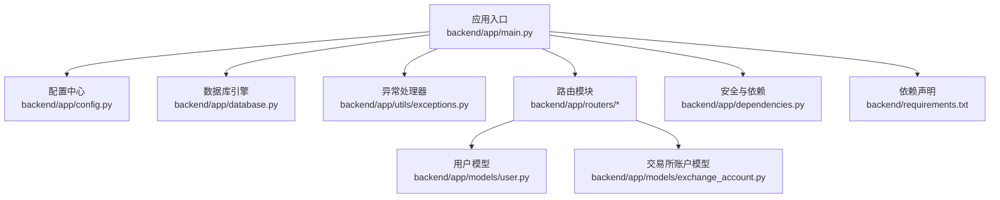
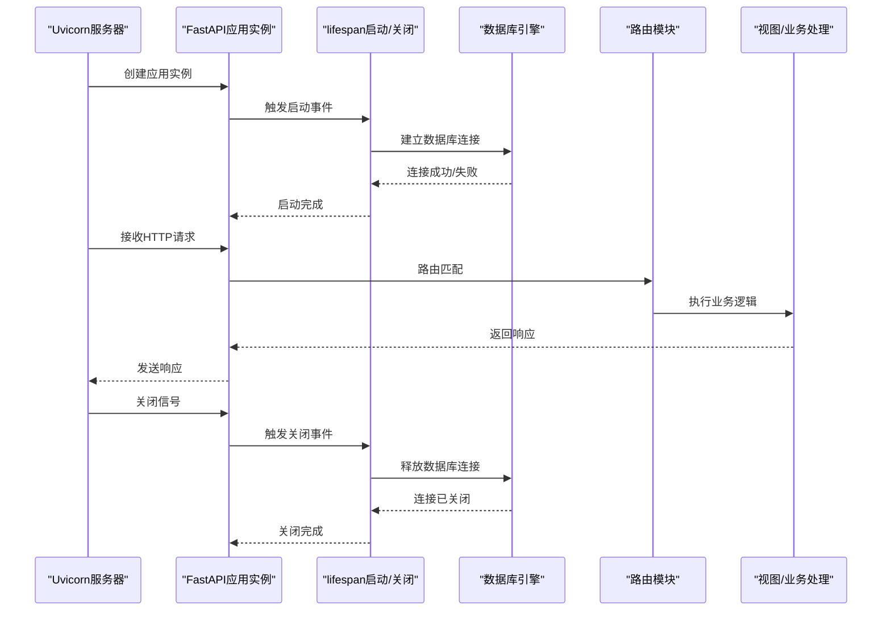
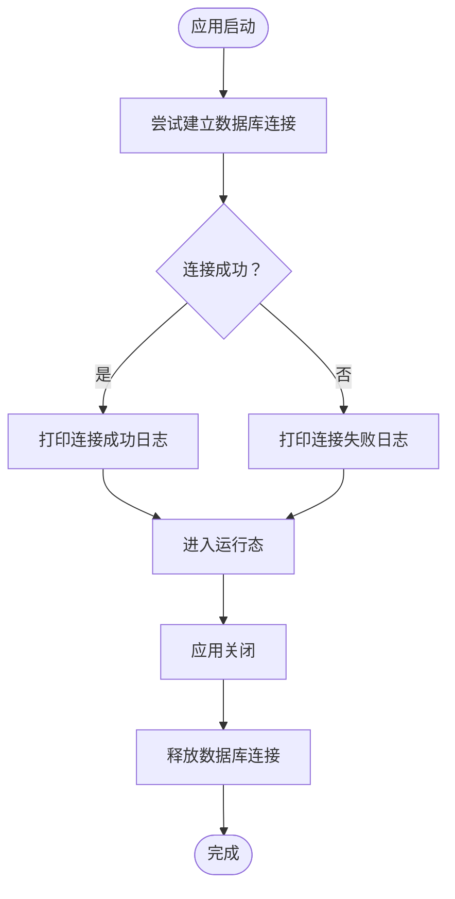
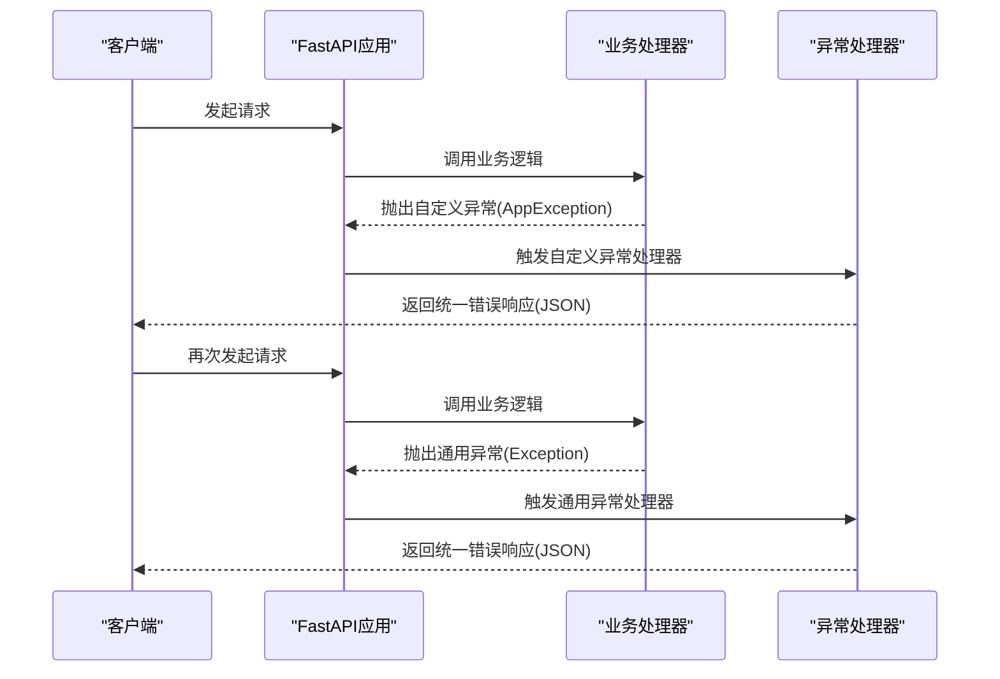
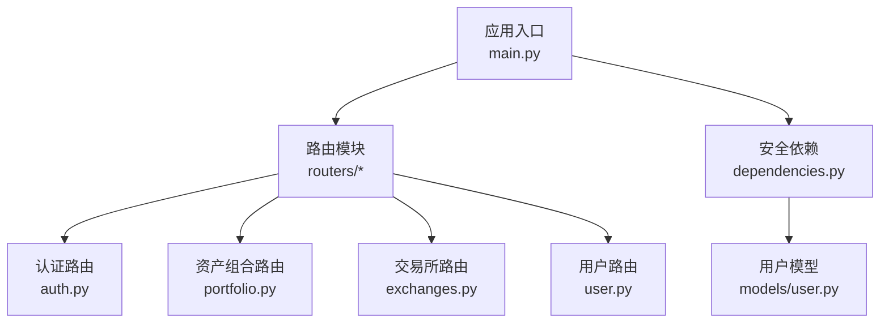
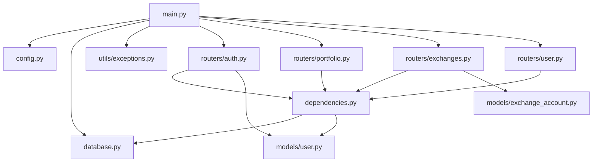

# 应用入口与生命周期

<cite>
**本文档引用的文件**
- [main.py](file://backend/app/main.py)
- [config.py](file://backend/app/config.py)
- [database.py](file://backend/app/database.py)
- [exceptions.py](file://backend/app/utils/exceptions.py)
- [dependencies.py](file://backend/app/dependencies.py)
- [user.py](file://backend/app/models/user.py)
- [exchange_account.py](file://backend/app/models/exchange_account.py)
- [auth.py](file://backend/app/routers/auth.py)
- [portfolio.py](file://backend/app/routers/portfolio.py)
- [exchanges.py](file://backend/app/routers/exchanges.py)
- [user.py](file://backend/app/routers/user.py)
- [requirements.txt](file://backend/requirements.txt)
</cite>

## 目录
1. [简介](#简介)
2. [项目结构](#项目结构)
3. [核心组件](#核心组件)
4. [架构总览](#架构总览)
5. [详细组件分析](#详细组件分析)
6. [依赖分析](#依赖分析)
7. [性能考虑](#性能考虑)
8. [故障排查指南](#故障排查指南)
9. [结论](#结论)
10. [附录](#附录)

## 简介
本文件聚焦于FastAPI应用的入口与生命周期管理，系统性解析以下主题：
- 应用实例创建：配置、中间件与路由注册
- 生命周期管理：lifespan启动与关闭阶段的数据库连接建立与资源清理
- CORS中间件配置：开发与生产环境差异策略
- 全局异常处理器：自定义异常与通用异常的统一响应格式
- 健康检查端点与调试技巧
- 性能优化建议与最佳实践

## 项目结构
后端采用模块化组织，入口位于应用根目录，核心围绕配置、数据库、路由与工具类展开：
- 应用入口与生命周期：backend/app/main.py
- 配置中心：backend/app/config.py
- 数据库引擎与会话：backend/app/database.py
- 异常体系：backend/app/utils/exceptions.py
- 路由模块：backend/app/routers 下的各功能模块
- 安全与依赖：backend/app/dependencies.py
- ORM模型：backend/app/models 下的用户与交易所账户模型
- 依赖声明：backend/requirements.txt

图表来源
- [main.py:1-131](file://backend/app/main.py#L1-L131)
- [config.py:1-51](file://backend/app/config.py#L1-L51)
- [database.py:1-33](file://backend/app/database.py#L1-L33)
- [exceptions.py:1-67](file://backend/app/utils/exceptions.py#L1-L67)
- [dependencies.py:1-74](file://backend/app/dependencies.py#L1-L74)
- [user.py:1-32](file://backend/app/models/user.py#L1-L32)
- [exchange_account.py:1-32](file://backend/app/models/exchange_account.py#L1-L32)
- [requirements.txt:1-15](file://backend/requirements.txt#L1-L15)

章节来源
- [main.py:1-131](file://backend/app/main.py#L1-L131)
- [config.py:1-51](file://backend/app/config.py#L1-L51)
- [database.py:1-33](file://backend/app/database.py#L1-L33)
- [requirements.txt:1-15](file://backend/requirements.txt#L1-L15)

## 核心组件
- 应用实例与生命周期：通过FastAPI构造函数与lifespan上下文管理器实现启动与关闭阶段的数据库连接建立与释放。
- 中间件：CORS中间件按DEBUG模式动态配置允许的源。
- 全局异常处理：自定义AppException与通用Exception处理器，统一返回结构。
- 路由注册：将认证、资产组合、交易所与用户模块路由按统一前缀注册。
- 健康检查：提供轻量级健康检查端点，便于监控与调试。

章节来源
- [main.py:13-131](file://backend/app/main.py#L13-L131)
- [config.py:1-51](file://backend/app/config.py#L1-L51)
- [exceptions.py:1-67](file://backend/app/utils/exceptions.py#L1-L67)

## 架构总览
下图展示了应用启动到请求处理的关键流程，以及生命周期管理在其中的位置。

图表来源
- [main.py:13-42](file://backend/app/main.py#L13-L42)
- [database.py:1-33](file://backend/app/database.py#L1-L33)

## 详细组件分析

### 应用实例创建与配置
- 应用构造参数
  - 标题、版本、描述、文档路径与OpenAPI路径均来自配置中心。
  - 通过lifespan参数注入生命周期管理器。
- 配置中心
  - 使用Pydantic Settings加载环境变量，包含应用名称、调试模式、API前缀、数据库URL、Redis URL、JWT密钥、加密密钥、CORS允许源、CoinGecko API地址等。
  - 在生产模式下强制要求设置敏感密钥，否则抛出错误；开发模式下提供默认值以方便本地调试。
- 数据库引擎
  - 使用异步引擎与会话工厂，支持echo调试输出与future模式。
  - 提供依赖注入函数用于获取数据库会话。

章节来源
- [main.py:33-42](file://backend/app/main.py#L33-L42)
- [config.py:5-51](file://backend/app/config.py#L5-L51)
- [database.py:6-33](file://backend/app/database.py#L6-L33)

### 生命周期管理：lifespan
- 启动阶段
  - 通过异步上下文管理器在应用启动时尝试建立数据库连接。
  - 注释中提示开发环境可自动建表，生产环境应使用迁移工具。
  - 输出连接状态日志，便于调试。
- 关闭阶段
  - 应用关闭时调用引擎释放连接，确保资源回收。
- 错误处理
  - 启动阶段捕获异常并打印错误信息，避免影响应用启动流程。

图表来源
- [main.py:13-31](file://backend/app/main.py#L13-L31)
- [database.py:6-20](file://backend/app/database.py#L6-L20)

章节来源
- [main.py:13-31](file://backend/app/main.py#L13-L31)
- [database.py:6-20](file://backend/app/database.py#L6-L20)

### CORS中间件配置
- 开发模式
  - 允许本地常见端口的前端访问，便于本地联调。
- 生产模式
  - 从配置中心读取允许的源字符串并拆分，形成白名单。
- 通用策略
  - 允许凭据、所有方法与头，简化跨域交互。

章节来源
- [main.py:44-62](file://backend/app/main.py#L44-L62)
- [config.py:26-27](file://backend/app/config.py#L26-L27)

### 全局异常处理器
- 自定义异常处理器
  - 捕获AppException，返回包含success、message、error_code与details的JSON响应。
- 通用异常处理器
  - 捕获所有未处理异常，统一返回内部错误信息。
- 异常类型
  - 提供认证、未找到、验证、交易所连接等具体异常类型，便于业务层抛出并被统一处理。

图表来源
- [main.py:65-91](file://backend/app/main.py#L65-L91)
- [exceptions.py:4-67](file://backend/app/utils/exceptions.py#L4-L67)

章节来源
- [main.py:65-91](file://backend/app/main.py#L65-L91)
- [exceptions.py:4-67](file://backend/app/utils/exceptions.py#L4-L67)

### 路由注册与安全依赖
- 路由注册
  - 将认证、资产组合、交易所与用户模块路由按统一前缀注册，前缀来自配置中心。
- 安全依赖
  - HTTP Bearer方案，支持可选认证与必选认证两种依赖注入。
  - 令牌校验与用户查询，结合数据库会话与服务层实现。

图表来源
- [main.py:94-100](file://backend/app/main.py#L94-L100)
- [dependencies.py:18-56](file://backend/app/dependencies.py#L18-L56)
- [user.py:11-32](file://backend/app/models/user.py#L11-L32)

章节来源
- [main.py:94-100](file://backend/app/main.py#L94-L100)
- [dependencies.py:18-56](file://backend/app/dependencies.py#L18-L56)
- [user.py:11-32](file://backend/app/models/user.py#L11-L32)

### 健康检查端点
- 提供轻量级健康检查端点，返回应用状态、名称与版本信息，便于容器编排与运维监控。

章节来源
- [main.py:103-110](file://backend/app/main.py#L103-L110)

## 依赖分析
- 应用入口对配置中心、数据库引擎、异常处理器与路由模块存在直接依赖。
- 路由模块依赖数据库会话、安全依赖与服务层，形成清晰的分层。
- ORM模型作为数据层契约，被路由与服务层共同使用。

图表来源
- [main.py:1-131](file://backend/app/main.py#L1-L131)
- [config.py:1-51](file://backend/app/config.py#L1-L51)
- [database.py:1-33](file://backend/app/database.py#L1-L33)
- [exceptions.py:1-67](file://backend/app/utils/exceptions.py#L1-L67)
- [dependencies.py:1-74](file://backend/app/dependencies.py#L1-L74)
- [user.py:1-32](file://backend/app/models/user.py#L1-L32)
- [exchange_account.py:1-32](file://backend/app/models/exchange_account.py#L1-L32)
- [auth.py:1-253](file://backend/app/routers/auth.py#L1-L253)
- [portfolio.py:1-217](file://backend/app/routers/portfolio.py#L1-L217)
- [exchanges.py:1-225](file://backend/app/routers/exchanges.py#L1-L225)
- [user.py:1-280](file://backend/app/routers/user.py#L1-L280)

章节来源
- [main.py:1-131](file://backend/app/main.py#L1-L131)
- [dependencies.py:1-74](file://backend/app/dependencies.py#L1-L74)
- [user.py:1-32](file://backend/app/models/user.py#L1-L32)
- [exchange_account.py:1-32](file://backend/app/models/exchange_account.py#L1-L32)

## 性能考虑
- 异步数据库引擎：使用异步SQLAlchemy引擎与会话工厂，减少I/O阻塞，提升并发能力。
- 会话配置：关闭自动提交与自动刷新，降低不必要的开销；expire_on_commit设为False，避免过期检查带来的额外成本。
- CORS策略：生产环境严格限制允许源，减少不必要的预检请求与跨域开销。
- 日志与调试：DEBUG模式开启数据库echo与默认密钥，便于开发但不适合生产。
- 依赖注入：通过依赖函数复用数据库会话，避免重复创建连接。
- 健康检查：轻量端点，仅做基本状态判断，不影响主业务性能。

章节来源
- [database.py:6-20](file://backend/app/database.py#L6-L20)
- [config.py:8-9](file://backend/app/config.py#L8-L9)
- [main.py:44-62](file://backend/app/main.py#L44-L62)

## 故障排查指南
- 数据库连接失败
  - 检查DATABASE_URL是否正确，确认数据库服务可用。
  - 查看启动日志中的连接失败信息，定位具体异常。
- CORS跨域问题
  - 开发模式下确认前端端口在允许列表内；生产模式下核对ALLOWED_ORIGINS配置。
- 令牌认证失败
  - 确认JWT_SECRET_KEY已正确设置；检查令牌类型与用户状态。
- 通用异常
  - 未捕获的异常会被统一转为内部错误响应，需查看服务端日志定位根本原因。
- 健康检查
  - 通过健康端点快速判断应用状态；若不可用，优先检查数据库连接与依赖注入链路。

章节来源
- [main.py:13-31](file://backend/app/main.py#L13-L31)
- [main.py:44-62](file://backend/app/main.py#L44-L62)
- [dependencies.py:18-56](file://backend/app/dependencies.py#L18-L56)
- [exceptions.py:4-67](file://backend/app/utils/exceptions.py#L4-L67)

## 结论
该应用通过清晰的入口与生命周期管理、严格的配置与异常处理机制、合理的中间件与路由设计，构建了稳定且可扩展的FastAPI后端框架。建议在生产环境中：
- 使用迁移工具替代注释掉的建表逻辑
- 明确区分开发与生产配置，禁用DEBUG与默认密钥
- 为关键端点增加限流与缓存策略
- 完善健康检查与可观测性指标

## 附录
- 快速启动命令（基于入口文件）
  - 使用uvicorn运行应用，主机与端口、热重载等参数来自配置与入口文件。
- 依赖清单
  - 项目依赖通过requirements.txt声明，包含FastAPI、Uvicorn、SQLAlchemy、Pydantic Settings等。

章节来源
- [main.py:123-131](file://backend/app/main.py#L123-L131)
- [requirements.txt:1-15](file://backend/requirements.txt#L1-L15)