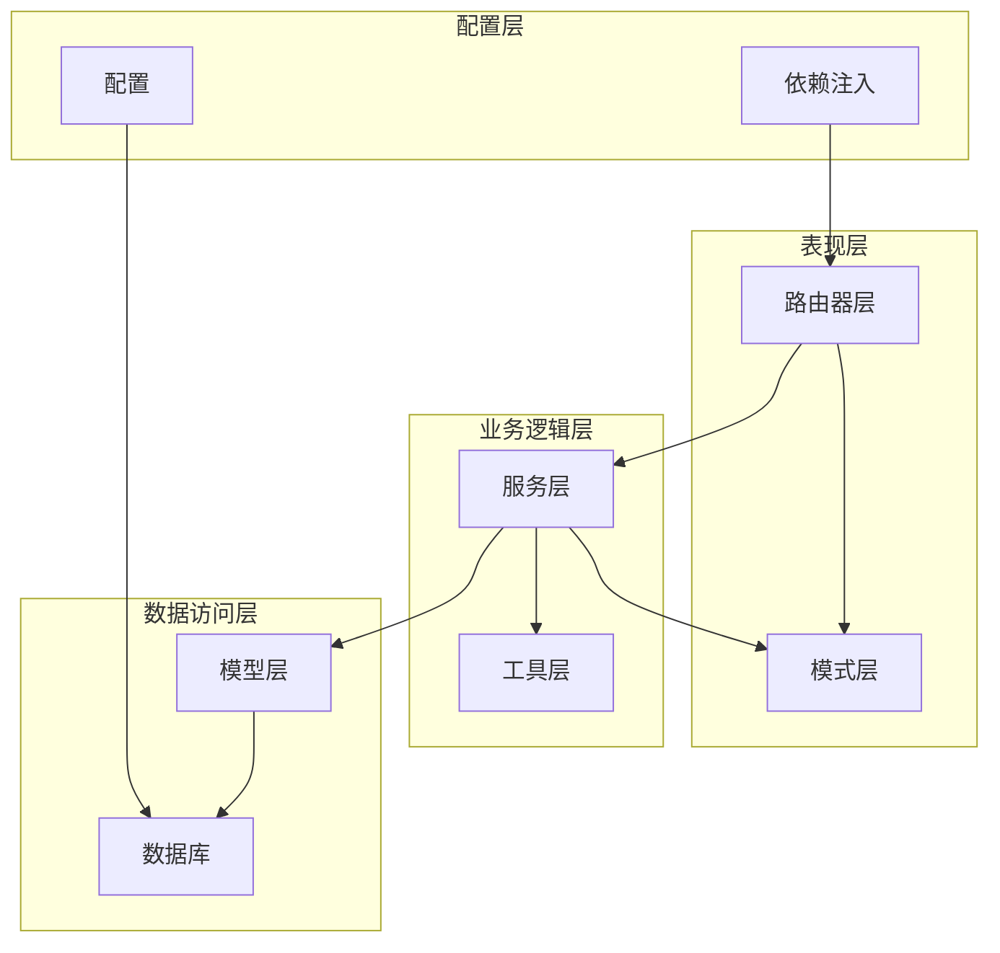
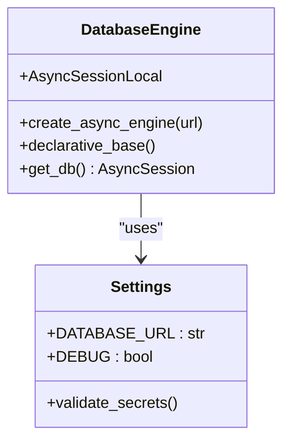
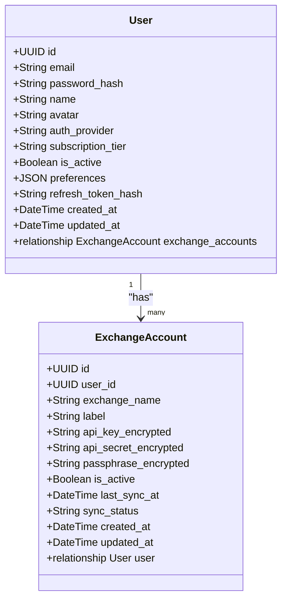
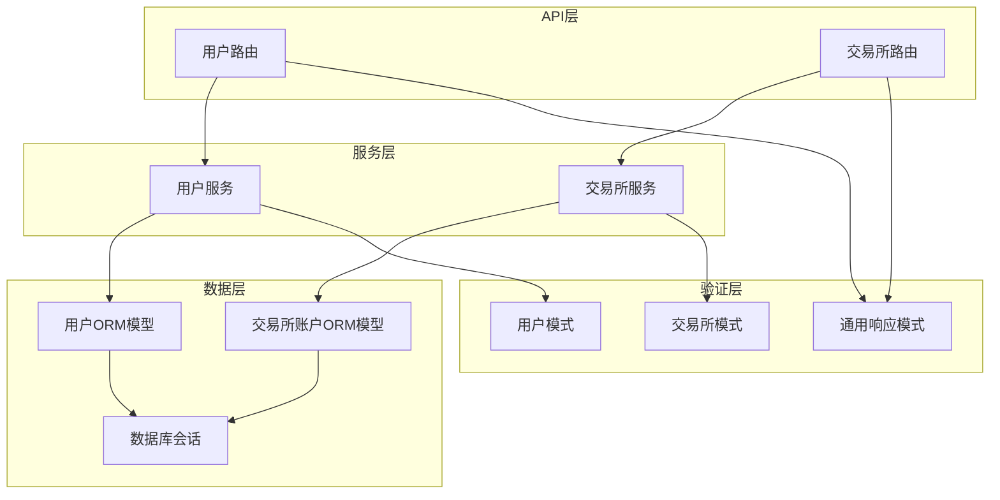
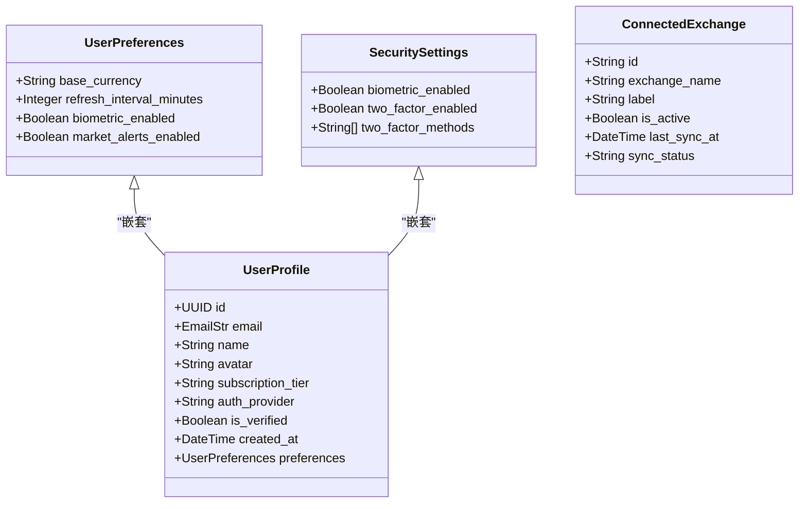
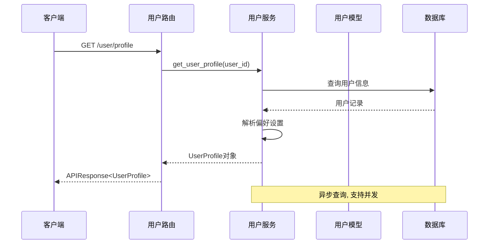
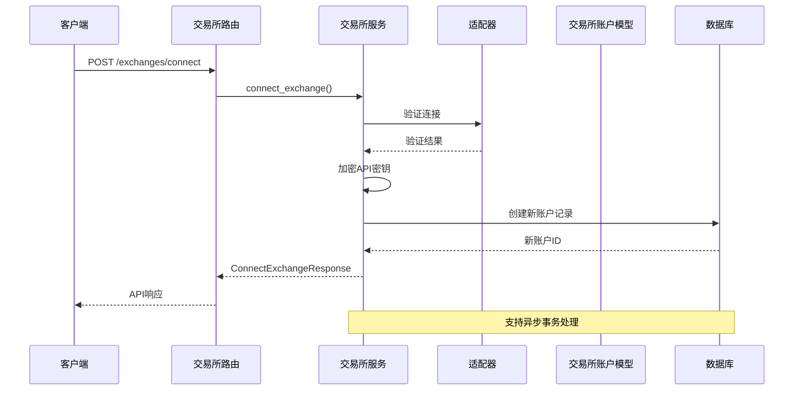
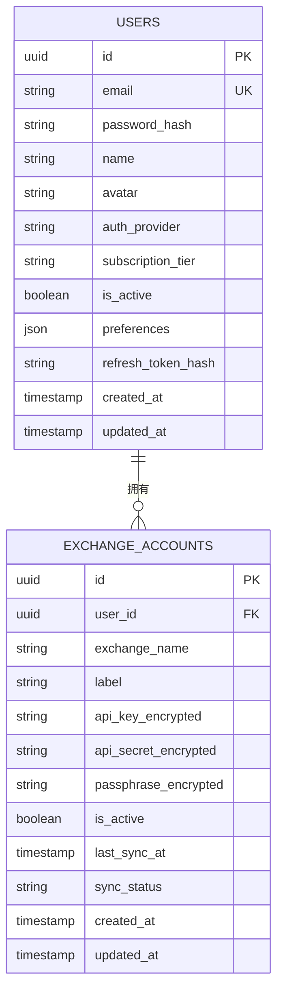
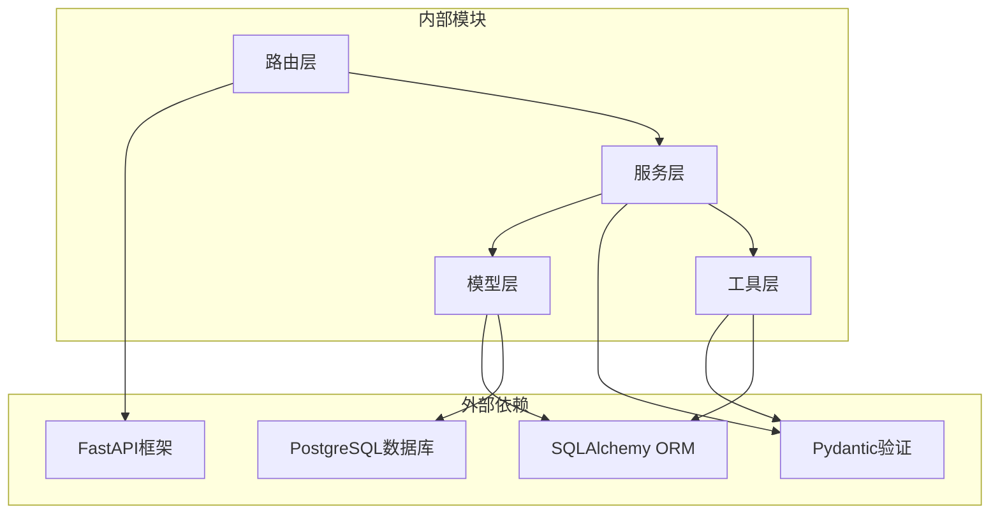
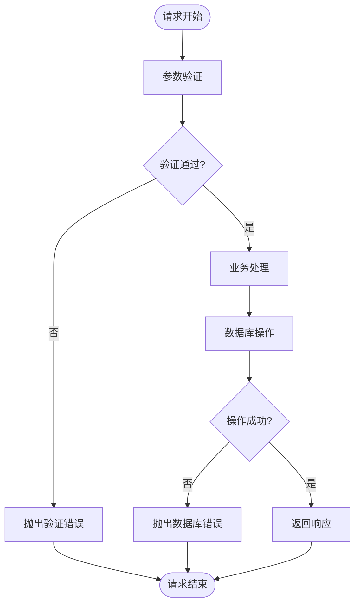

# 数据模型设计

<cite>
**本文档引用的文件**
- [backend/app/models/user.py](file://backend/app/models/user.py)
- [backend/app/models/exchange_account.py](file://backend/app/models/exchange_account.py)
- [backend/app/models/__init__.py](file://backend/app/models/__init__.py)
- [backend/app/database.py](file://backend/app/database.py)
- [backend/app/schemas/user.py](file://backend/app/schemas/user.py)
- [backend/app/schemas/exchange.py](file://backend/app/schemas/exchange.py)
- [backend/app/schemas/common.py](file://backend/app/schemas/common.py)
- [backend/app/services/user_service.py](file://backend/app/services/user_service.py)
- [backend/app/services/exchange_service.py](file://backend/app/services/exchange_service.py)
- [backend/app/routers/user.py](file://backend/app/routers/user.py)
- [backend/app/routers/exchanges.py](file://backend/app/routers/exchanges.py)
- [backend/app/dependencies.py](file://backend/app/dependencies.py)
- [backend/app/utils/security.py](file://backend/app/utils/security.py)
- [backend/app/config.py](file://backend/app/config.py)
</cite>

## 目录
1. [简介](#简介)
2. [项目结构](#项目结构)
3. [核心组件](#核心组件)
4. [架构概览](#架构概览)
5. [详细组件分析](#详细组件分析)
6. [依赖关系分析](#依赖关系分析)
7. [性能考虑](#性能考虑)
8. [故障排除指南](#故障排除指南)
9. [结论](#结论)

## 简介

本项目是一个资产聚集应用程序，专注于为用户提供统一的加密货币资产管理界面。系统采用现代的异步架构设计，基于FastAPI框架构建RESTful API，使用SQLAlchemy ORM进行数据库操作，通过Pydantic进行数据验证和序列化。

数据模型设计的核心目标是：
- 提供清晰的用户和交易所账户关系映射
- 实现安全的API密钥存储和管理
- 支持灵活的用户偏好设置和订阅管理
- 确保数据一致性和完整性约束
- 提供高效的查询和操作接口

## 项目结构

项目采用分层架构设计，主要分为以下层次：

**图表来源**
- [backend/app/models/user.py:1-32](file://backend/app/models/user.py#L1-L32)
- [backend/app/models/exchange_account.py:1-32](file://backend/app/models/exchange_account.py#L1-L32)
- [backend/app/database.py:1-33](file://backend/app/database.py#L1-L33)

**章节来源**
- [backend/app/models/user.py:1-32](file://backend/app/models/user.py#L1-L32)
- [backend/app/models/exchange_account.py:1-32](file://backend/app/models/exchange_account.py#L1-L32)
- [backend/app/database.py:1-33](file://backend/app/database.py#L1-L33)

## 核心组件

### 数据库引擎配置

系统使用异步SQLAlchemy引擎，支持PostgreSQL数据库：

**图表来源**
- [backend/app/database.py:1-33](file://backend/app/database.py#L1-L33)
- [backend/app/config.py:1-51](file://backend/app/config.py#L1-L51)

### 用户模型设计

用户模型是整个系统的核心实体，设计了完整的用户生命周期管理：

**图表来源**
- [backend/app/models/user.py:11-32](file://backend/app/models/user.py#L11-L32)
- [backend/app/models/exchange_account.py:11-32](file://backend/app/models/exchange_account.py#L11-L32)

**章节来源**
- [backend/app/models/user.py:1-32](file://backend/app/models/user.py#L1-L32)
- [backend/app/models/exchange_account.py:1-32](file://backend/app/models/exchange_account.py#L1-L32)

## 架构概览

系统采用经典的三层架构模式，实现了清晰的关注点分离：

**图表来源**
- [backend/app/routers/user.py:1-280](file://backend/app/routers/user.py#L1-L280)
- [backend/app/routers/exchanges.py:1-227](file://backend/app/routers/exchanges.py#L1-L227)
- [backend/app/services/user_service.py:1-223](file://backend/app/services/user_service.py#L1-L223)
- [backend/app/services/exchange_service.py:1-414](file://backend/app/services/exchange_service.py#L1-L414)

## 详细组件分析

### 用户模型详细设计

#### 字段定义和约束

用户模型包含了完整的用户信息管理功能：

| 字段名 | 类型 | 约束 | 描述 |
|--------|------|------|------|
| id | UUID | 主键, 默认值 | 用户唯一标识符 |
| email | String(255) | 唯一, 非空, 索引 | 用户邮箱地址 |
| password_hash | String(255) | 可空 | 密码哈希值(OAuth用户可为空) |
| name | String(100) | 可空 | 用户姓名 |
| avatar | String(500) | 可空 | 头像URL |
| auth_provider | String(50) | 默认值:"email" | 认证提供商(email/google/apple) |
| subscription_tier | String(50) | 默认值:"free" | 订阅等级(free/pro) |
| is_active | Boolean | 默认值:true | 账户激活状态 |
| preferences | JSON | 默认值:{} | 用户偏好设置 |
| refresh_token_hash | String(255) | 可空 | 当前有效刷新令牌哈希 |
| created_at | DateTime | 服务器默认值 | 创建时间 |
| updated_at | DateTime | 服务器默认值, 更新时自动更新 | 最后更新时间 |

#### 业务规则实现

用户模型实现了以下关键业务规则：

1. **多认证方式支持**: 支持传统邮箱密码认证和OAuth认证
2. **订阅管理**: 通过subscription_tier字段管理用户订阅级别
3. **偏好设置存储**: 使用JSON字段存储灵活的用户偏好配置
4. **账户安全**: 通过refresh_token_hash实现全局登出功能

**章节来源**
- [backend/app/models/user.py:11-32](file://backend/app/models/user.py#L11-L32)

### 交易所账户模型设计

#### 字段定义和约束

交易所账户模型专门用于管理用户与各交易所的连接：

| 字段名 | 类型 | 约束 | 描述 |
|--------|------|------|------|
| id | UUID | 主键, 默认值 | 交易所账户唯一标识符 |
| user_id | UUID | 外键(users.id), 非空 | 关联用户ID |
| exchange_name | String(50) | 非空 | 交易所名称(binance/okx/bybit...) |
| label | String(100) | 可空 | 用户自定义标签 |
| api_key_encrypted | String(500) | 非空 | 加密的API密钥 |
| api_secret_encrypted | String(500) | 非空 | 加密的API密钥 |
| passphrase_encrypted | String(500) | 可空 | 加密的口令(部分交易所需要) |
| is_active | Boolean | 默认值:true | 连接激活状态 |
| last_sync_at | DateTime | 可空 | 最后同步时间 |
| sync_status | String(50) | 默认值:"pending" | 同步状态(pending/syncing/success/failed) |
| created_at | DateTime | 服务器默认值 | 创建时间 |
| updated_at | DateTime | 服务器默认值, 更新时自动更新 | 最后更新时间 |

#### 安全特性

交易所账户模型采用了多层次的安全保护：

1. **API密钥加密**: 所有API密钥都经过AES-256-GCM加密存储
2. **软删除机制**: 使用is_active字段实现连接的软删除
3. **同步状态跟踪**: 通过sync_status字段监控数据同步状态

**章节来源**
- [backend/app/models/exchange_account.py:11-32](file://backend/app/models/exchange_account.py#L11-L32)

### 数据验证和序列化

#### Pydantic模式设计

系统使用Pydantic进行数据验证和序列化，确保API数据的完整性和一致性：

**图表来源**
- [backend/app/schemas/user.py:10-60](file://backend/app/schemas/user.py#L10-L60)
- [backend/app/schemas/exchange.py:27-39](file://backend/app/schemas/exchange.py#L27-L39)

**章节来源**
- [backend/app/schemas/user.py:1-96](file://backend/app/schemas/user.py#L1-L96)
- [backend/app/schemas/exchange.py:1-150](file://backend/app/schemas/exchange.py#L1-L150)

### 查询和操作流程

#### 用户资料查询流程

**图表来源**
- [backend/app/routers/user.py:24-45](file://backend/app/routers/user.py#L24-L45)
- [backend/app/services/user_service.py:32-62](file://backend/app/services/user_service.py#L32-L62)

#### 交易所连接流程

**图表来源**
- [backend/app/routers/exchanges.py:86-121](file://backend/app/routers/exchanges.py#L86-L121)
- [backend/app/services/exchange_service.py:231-301](file://backend/app/services/exchange_service.py#L231-L301)

### 模型关系配置

#### 一对多关系映射

用户和交易所账户之间建立了一对多关系：

**图表来源**
- [backend/app/models/user.py:28-28](file://backend/app/models/user.py#L28-L28)
- [backend/app/models/exchange_account.py:28-28](file://backend/app/models/exchange_account.py#L28-L28)

**章节来源**
- [backend/app/models/user.py:27-29](file://backend/app/models/user.py#L27-L29)
- [backend/app/models/exchange_account.py:27-29](file://backend/app/models/exchange_account.py#L27-L29)

## 依赖关系分析

### 组件耦合度分析

系统采用了松耦合的设计原则，通过依赖注入和接口抽象降低模块间的耦合度：

**图表来源**
- [backend/app/database.py:1-33](file://backend/app/database.py#L1-L33)
- [backend/app/services/user_service.py:1-16](file://backend/app/services/user_service.py#L1-L16)
- [backend/app/routers/user.py:1-17](file://backend/app/routers/user.py#L1-L17)

### 错误处理和异常管理

系统实现了完善的错误处理机制：

**图表来源**
- [backend/app/utils/security.py:1-97](file://backend/app/utils/security.py#L1-L97)
- [backend/app/dependencies.py:1-74](file://backend/app/dependencies.py#L1-L74)

**章节来源**
- [backend/app/utils/security.py:1-97](file://backend/app/utils/security.py#L1-L97)
- [backend/app/dependencies.py:1-74](file://backend/app/dependencies.py#L1-L74)

## 性能考虑

### 数据库优化策略

1. **索引优化**: 在常用查询字段上建立索引
   - 用户邮箱(unique索引)
   - 交易所账户外键(user_id)
   - 时间戳字段索引

2. **查询优化**: 使用异步查询避免阻塞
   - 异步SQLAlchemy引擎
   - 批量操作支持
   - 连接池管理

3. **缓存策略**: 
   - Redis集成用于会话存储
   - API响应缓存
   - 配置信息缓存

### 安全最佳实践

1. **API密钥加密**: 使用AES-256-GCM对称加密
2. **密码安全**: bcrypt哈希算法
3. **JWT令牌管理**: 安全的令牌生成和验证
4. **输入验证**: 严格的Pydantic验证规则

## 故障排除指南

### 常见问题诊断

#### 数据库连接问题
- 检查DATABASE_URL配置
- 验证PostgreSQL服务状态
- 确认网络连接可用

#### 认证失败问题
- 验证JWT_SECRET_KEY配置
- 检查令牌过期时间
- 确认用户账户状态

#### API密钥存储问题
- 验证ENCRYPTION_KEY配置
- 检查加密算法兼容性
- 确认密钥长度要求

**章节来源**
- [backend/app/config.py:1-51](file://backend/app/config.py#L1-L51)
- [backend/app/utils/security.py:78-97](file://backend/app/utils/security.py#L78-L97)

## 结论

本数据模型设计充分体现了现代Web应用的最佳实践：

1. **清晰的架构分离**: 通过分层架构实现了关注点分离
2. **强类型安全**: 使用Pydantic确保数据完整性
3. **异步性能**: 基于异步编程模型提升系统性能
4. **安全性优先**: 实现了多层次的安全保护机制
5. **可扩展性**: 模块化设计支持功能扩展

系统在用户管理和交易所集成方面提供了完整的技术解决方案，为后续的功能扩展奠定了坚实的基础。通过合理的数据模型设计和严格的业务规则实现，确保了系统的稳定性、安全性和可维护性。