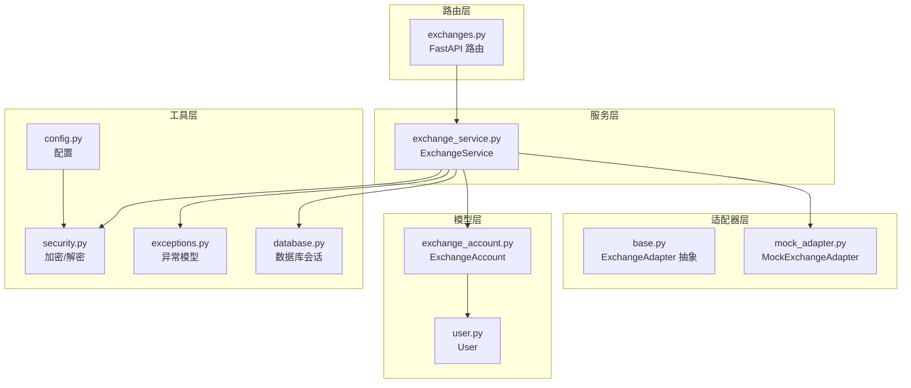
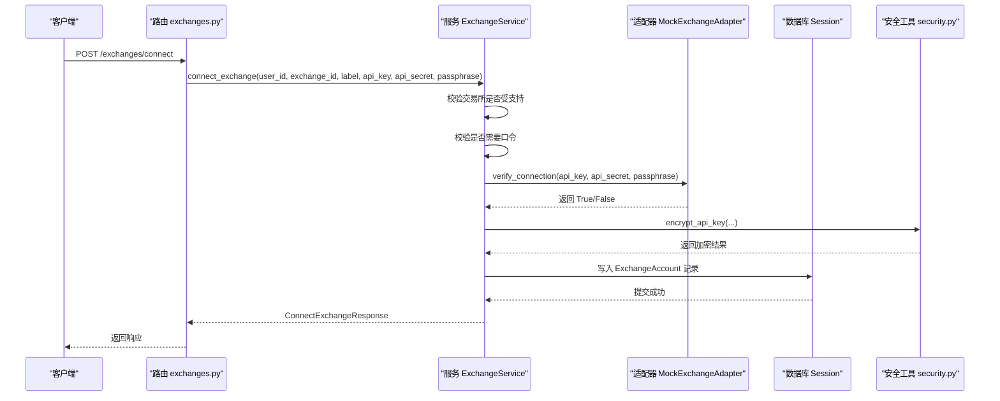
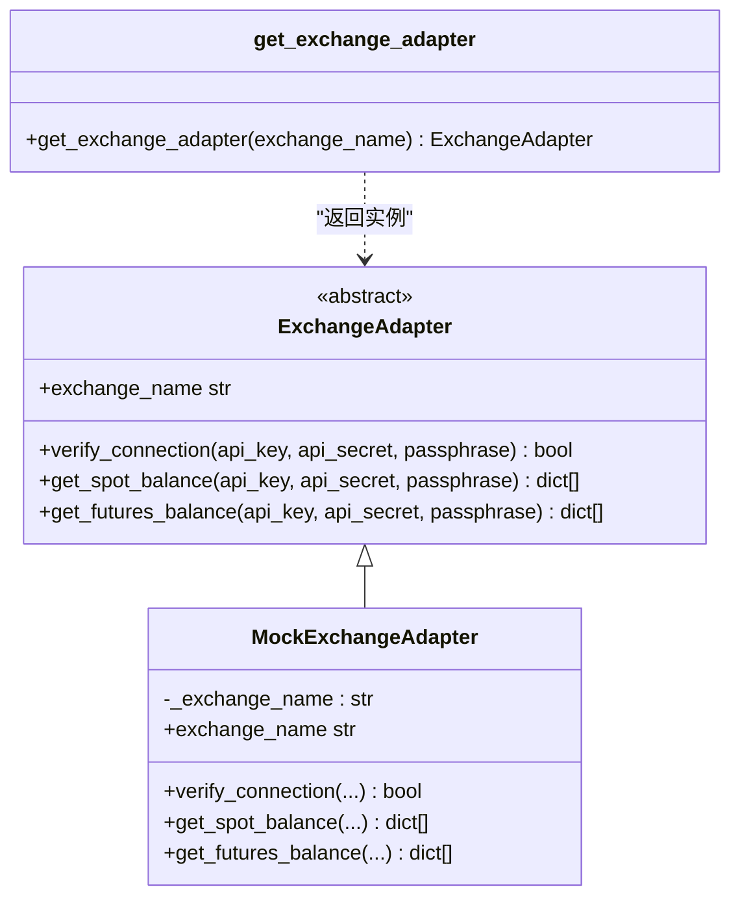
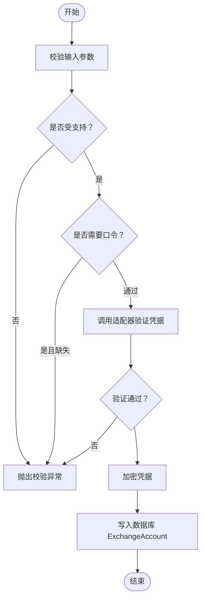
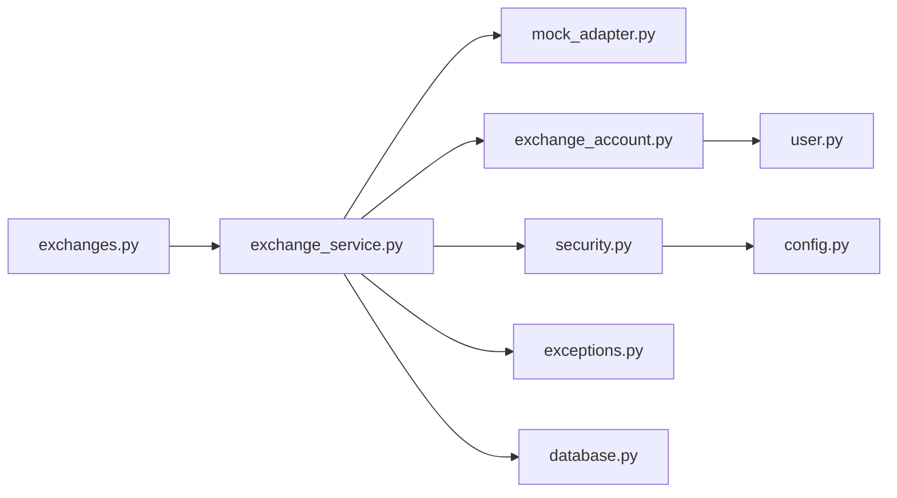

# 交易所服务

<cite>
**本文引用的文件列表**
- [exchange_service.py](file://backend/app/services/exchange_service.py)
- [base.py](file://backend/app/services/exchange_adapters/base.py)
- [mock_adapter.py](file://backend/app/services/exchange_adapters/mock_adapter.py)
- [exchange_account.py](file://backend/app/models/exchange_account.py)
- [exchanges.py](file://backend/app/routers/exchanges.py)
- [exchange.py](file://backend/app/schemas/exchange.py)
- [security.py](file://backend/app/utils/security.py)
- [exceptions.py](file://backend/app/utils/exceptions.py)
- [auth_service.py](file://backend/app/services/auth_service.py)
- [config.py](file://backend/app/config.py)
- [database.py](file://backend/app/database.py)
- [user.py](file://backend/app/models/user.py)
</cite>

## 目录
1. [简介](#简介)
2. [项目结构](#项目结构)
3. [核心组件](#核心组件)
4. [架构总览](#架构总览)
5. [详细组件分析](#详细组件分析)
6. [依赖分析](#依赖分析)
7. [性能考虑](#性能考虑)
8. [故障排查指南](#故障排查指南)
9. [结论](#结论)
10. [附录](#附录)

## 简介
本文件系统性梳理交易所服务的设计与实现，重点覆盖以下方面：
- ExchangeService 类的职责边界、控制流与数据同步机制
- 适配器模式在交易所接入中的应用与扩展点
- API 凭据管理与加密存储策略
- 支持的交易所类型与功能特性
- 错误处理与异常模型
- 与认证服务及外部 API 的交互关系
- 实现新交易所适配器的步骤与最佳实践

## 项目结构
后端采用 FastAPI + SQLAlchemy Async 架构，围绕“路由-服务-适配器-模型-工具”的分层组织：
- 路由层：提供 REST 接口，负责参数解析与响应封装
- 服务层：业务编排与领域逻辑，如 ExchangeService
- 适配器层：抽象接口与具体实现，隔离不同交易所差异
- 模型层：数据库映射，持久化账户与同步状态
- 工具层：加密、异常、配置等通用能力

图表来源
- [exchanges.py:1-227](file://backend/app/routers/exchanges.py#L1-L227)
- [exchange_service.py:1-414](file://backend/app/services/exchange_service.py#L1-L414)
- [base.py:1-73](file://backend/app/services/exchange_adapters/base.py#L1-L73)
- [mock_adapter.py:1-110](file://backend/app/services/exchange_adapters/mock_adapter.py#L1-L110)
- [exchange_account.py:1-32](file://backend/app/models/exchange_account.py#L1-L32)
- [user.py:1-32](file://backend/app/models/user.py#L1-L32)
- [security.py:1-104](file://backend/app/utils/security.py#L1-L104)
- [exceptions.py:1-67](file://backend/app/utils/exceptions.py#L1-L67)
- [config.py:1-51](file://backend/app/config.py#L1-L51)
- [database.py:1-33](file://backend/app/database.py#L1-L33)

章节来源
- [exchanges.py:1-227](file://backend/app/routers/exchanges.py#L1-L227)
- [exchange_service.py:1-414](file://backend/app/services/exchange_service.py#L1-L414)
- [base.py:1-73](file://backend/app/services/exchange_adapters/base.py#L1-L73)
- [mock_adapter.py:1-110](file://backend/app/services/exchange_adapters/mock_adapter.py#L1-L110)
- [exchange_account.py:1-32](file://backend/app/models/exchange_account.py#L1-L32)
- [user.py:1-32](file://backend/app/models/user.py#L1-L32)
- [security.py:1-104](file://backend/app/utils/security.py#L1-L104)
- [exceptions.py:1-67](file://backend/app/utils/exceptions.py#L1-L67)
- [config.py:1-51](file://backend/app/config.py#L1-L51)
- [database.py:1-33](file://backend/app/database.py#L1-L33)

## 核心组件
- ExchangeService：核心业务服务，负责支持的交易所查询、连接/断开、手动同步、状态查询、连接校验等
- ExchangeAdapter 抽象与 MockExchangeAdapter：适配器模式的抽象接口与开发用模拟实现
- ExchangeAccount 模型：持久化用户与交易所的绑定关系、凭证加密存储、同步状态
- 路由 exchanges.py：对外暴露 REST 接口，调用 ExchangeService 完成业务流程
- 安全工具 security.py：基于 AES-GCM 的 API Key 加密/解密
- 异常模型 exceptions.py：统一的异常体系，便于上层路由捕获与标准化响应
- 认证服务 auth_service.py：用户认证与令牌管理，为交易所路由提供鉴权上下文
- 配置 config.py 与数据库 database.py：运行时配置与数据库会话依赖

章节来源
- [exchange_service.py:26-414](file://backend/app/services/exchange_service.py#L26-L414)
- [base.py:5-73](file://backend/app/services/exchange_adapters/base.py#L5-L73)
- [mock_adapter.py:10-110](file://backend/app/services/exchange_adapters/mock_adapter.py#L10-L110)
- [exchange_account.py:11-32](file://backend/app/models/exchange_account.py#L11-L32)
- [exchanges.py:22-227](file://backend/app/routers/exchanges.py#L22-L227)
- [security.py:85-104](file://backend/app/utils/security.py#L85-L104)
- [exceptions.py:45-67](file://backend/app/utils/exceptions.py#L45-L67)
- [auth_service.py:20-249](file://backend/app/services/auth_service.py#L20-L249)
- [config.py:5-51](file://backend/app/config.py#L5-L51)
- [database.py:26-33](file://backend/app/database.py#L26-L33)

## 架构总览
ExchangeService 通过路由层接收请求，进行参数校验与鉴权，随后调用适配器验证凭据、加密保存，并持久化到数据库；同步流程目前为占位实现，后续可扩展为后台任务触发真实数据抓取。

图表来源
- [exchanges.py:86-122](file://backend/app/routers/exchanges.py#L86-L122)
- [exchange_service.py:231-301](file://backend/app/services/exchange_service.py#L231-L301)
- [mock_adapter.py:21-41](file://backend/app/services/exchange_adapters/mock_adapter.py#L21-L41)
- [security.py:85-93](file://backend/app/utils/security.py#L85-L93)
- [exchange_account.py:14-25](file://backend/app/models/exchange_account.py#L14-L25)

## 详细组件分析

### ExchangeService 设计与实现
- 职责边界
  - 维护受支持交易所清单（硬编码），提供查询与按 ID 获取
  - 用户维度的连接管理：列出已连接、按 ID 查询、断开连接（软删除）
  - 连接建立：校验交易所支持性与口令要求、调用适配器验证、加密凭据、写入数据库
  - 同步控制：手动触发同步（当前为占位，仅更新状态）
  - 状态查询：返回连接状态与模拟余额数量
  - 连接存在性检查
- 数据同步机制
  - 当前实现：触发同步时将状态置为 syncing，立即回滚为 success 并更新最后同步时间
  - 建议扩展：引入后台任务队列（如 Celery/RQ/Redis Streams），异步拉取各交易所数据，失败重试与幂等处理
- 错误处理
  - 使用统一异常模型，路由层捕获并转换为标准 API 响应
- API 调用策略
  - 适配器层隔离外部 API 差异，ExchangeService 仅负责编排与状态管理
  - 凭据加密存储，避免明文落库

章节来源
- [exchange_service.py:26-414](file://backend/app/services/exchange_service.py#L26-L414)
- [exceptions.py:45-67](file://backend/app/utils/exceptions.py#L45-L67)

### 适配器基类与扩展机制
- 抽象接口
  - ExchangeAdapter 定义 verify_connection、spot/futures 余额查询等方法，确保所有适配器具备一致契约
- 扩展机制
  - 通过工厂函数 get_exchange_adapter 返回具体适配器实例
  - 当前返回 MockExchangeAdapter，生产环境应根据 exchange_id 分发至对应交易所实现
- 模拟适配器
  - MockExchangeAdapter 用于开发测试，始终返回成功并通过样例数据演示余额结构
  - 适合前端联调与单元测试

图表来源
- [base.py:5-73](file://backend/app/services/exchange_adapters/base.py#L5-L73)
- [mock_adapter.py:10-110](file://backend/app/services/exchange_adapters/mock_adapter.py#L10-L110)

章节来源
- [base.py:5-73](file://backend/app/services/exchange_adapters/base.py#L5-L73)
- [mock_adapter.py:10-110](file://backend/app/services/exchange_adapters/mock_adapter.py#L10-L110)

### API 凭据管理与数据同步
- 凭据加密
  - 使用 AES-256-GCM 对称加密，HKDF 从配置中派生密钥，nonce 随机生成并与密文拼接后 Base64 编码
  - 存储字段包含 api_key_encrypted、api_secret_encrypted、passphrase_encrypted（可选）
- 存储模型
  - ExchangeAccount 持有用户与交易所的绑定关系，记录连接标签、激活状态、同步状态与时间戳
- 同步流程
  - 触发同步时更新状态为 syncing，随后回滚为 success 并记录 last_sync_at
  - 建议后续接入真实抓取任务，按交易所与账户维度进行幂等与重试

图表来源
- [exchange_service.py:257-301](file://backend/app/services/exchange_service.py#L257-L301)
- [security.py:85-104](file://backend/app/utils/security.py#L85-L104)
- [exchange_account.py:18-23](file://backend/app/models/exchange_account.py#L18-L23)

章节来源
- [exchange_service.py:231-301](file://backend/app/services/exchange_service.py#L231-L301)
- [security.py:85-104](file://backend/app/utils/security.py#L85-L104)
- [exchange_account.py:11-32](file://backend/app/models/exchange_account.py#L11-L32)

### 支持的交易所类型与功能特性
- 硬编码支持列表包含多家主流交易所，字段涵盖标识、名称、描述、品牌色、是否支持现货/永续、是否需要口令、是否推荐、状态等
- 当前连接流程对是否需要口令进行严格校验，确保后续适配器实现的一致性

章节来源
- [exchange_service.py:29-97](file://backend/app/services/exchange_service.py#L29-L97)

### 与认证服务和外部 API 的交互关系
- 认证服务
  - 路由层通过依赖注入获取当前用户，ExchangeService 在连接/断开/同步等操作中以 user_id 作为约束条件
  - 认证服务提供注册、登录、刷新令牌、登出等能力，保障接口访问安全
- 外部 API
  - 适配器层负责与各交易所 API 交互，ExchangeService 仅负责编排与状态管理
  - 当前 mock 适配器返回样例数据，生产环境需替换为真实实现

章节来源
- [exchanges.py:62-83](file://backend/app/routers/exchanges.py#L62-L83)
- [auth_service.py:20-249](file://backend/app/services/auth_service.py#L20-L249)
- [mock_adapter.py:21-41](file://backend/app/services/exchange_adapters/mock_adapter.py#L21-L41)

## 依赖分析
- 组件耦合
  - 路由层依赖服务层；服务层依赖适配器工厂与模型层；工具层被服务层与适配器层间接使用
- 外部依赖
  - FastAPI、SQLAlchemy Async、Pydantic、cryptography、jose、passlib
- 配置与会话
  - 通过 config.py 注入密钥与算法；database.py 提供异步会话工厂

图表来源
- [exchanges.py:1-227](file://backend/app/routers/exchanges.py#L1-L227)
- [exchange_service.py:1-414](file://backend/app/services/exchange_service.py#L1-L414)
- [mock_adapter.py:1-110](file://backend/app/services/exchange_adapters/mock_adapter.py#L1-L110)
- [exchange_account.py:1-32](file://backend/app/models/exchange_account.py#L1-L32)
- [user.py:1-32](file://backend/app/models/user.py#L1-L32)
- [security.py:1-104](file://backend/app/utils/security.py#L1-L104)
- [exceptions.py:1-67](file://backend/app/utils/exceptions.py#L1-L67)
- [database.py:1-33](file://backend/app/database.py#L1-L33)
- [config.py:1-51](file://backend/app/config.py#L1-L51)

章节来源
- [exchanges.py:1-227](file://backend/app/routers/exchanges.py#L1-L227)
- [exchange_service.py:1-414](file://backend/app/services/exchange_service.py#L1-L414)
- [mock_adapter.py:1-110](file://backend/app/services/exchange_adapters/mock_adapter.py#L1-L110)
- [exchange_account.py:1-32](file://backend/app/models/exchange_account.py#L1-L32)
- [user.py:1-32](file://backend/app/models/user.py#L1-L32)
- [security.py:1-104](file://backend/app/utils/security.py#L1-L104)
- [exceptions.py:1-67](file://backend/app/utils/exceptions.py#L1-L67)
- [database.py:1-33](file://backend/app/database.py#L1-L33)
- [config.py:1-51](file://backend/app/config.py#L1-L51)

## 性能考虑
- 异步 I/O：数据库与适配器调用均采用异步，减少阻塞
- 加密成本：AES-GCM 每次加密产生随机 nonce，建议在批量场景下复用会话与缓存派生密钥
- 同步策略：当前同步为同步状态更新，建议引入后台任务队列与限流策略，避免瞬时并发导致的资源争用
- 缓存：可对常用查询（如交易所列表、用户连接列表）增加短期缓存，降低数据库压力

## 故障排查指南
- 常见异常
  - 未找到连接：抛出 NotFoundError，通常为用户 ID 或账户 UUID 不匹配
  - 凭据无效：抛出 ValidationError，检查 exchange_id 是否受支持、是否需要口令、适配器验证逻辑
  - 交换机连接失败：抛出 ExchangeConnectionError，适配器层需完善错误传播
- 排查步骤
  - 确认路由层鉴权成功，当前用户与路径参数正确
  - 检查 ExchangeService 中的校验分支与适配器返回值
  - 查看数据库中 ExchangeAccount 的 is_active、sync_status、last_sync_at 字段
  - 核对配置中的 ENCRYPTION_KEY 与 JWT_SECRET_KEY 是否正确设置

章节来源
- [exceptions.py:33-67](file://backend/app/utils/exceptions.py#L33-L67)
- [exchange_service.py:208-224](file://backend/app/services/exchange_service.py#L208-L224)
- [exchange_service.py:266-271](file://backend/app/services/exchange_service.py#L266-L271)
- [exchange_account.py:21-23](file://backend/app/models/exchange_account.py#L21-L23)
- [config.py:32-44](file://backend/app/config.py#L32-L44)

## 结论
ExchangeService 通过清晰的分层与适配器模式，实现了对多交易所的统一接入与管理。当前处于开发阶段，模拟适配器与占位同步流程便于快速迭代；生产落地时应完成以下关键改进：
- 替换适配器工厂为真实交易所实现，完善错误处理与重试
- 引入后台任务队列执行真实数据抓取，保证幂等与可观测性
- 增强同步状态与错误信息的持久化与查询能力
- 完善凭据轮换与审计日志

## 附录

### 实现新的交易所适配器步骤
- 新建适配器类
  - 继承 ExchangeAdapter，实现 verify_connection、get_spot_balance、get_futures_balance、exchange_name
  - 参考路径：[base.py:5-73](file://backend/app/services/exchange_adapters/base.py#L5-L73)
- 扩展工厂函数
  - 在 get_exchange_adapter 中根据 exchange_id 返回新适配器实例
  - 参考路径：[mock_adapter.py:96-110](file://backend/app/services/exchange_adapters/mock_adapter.py#L96-L110)
- 集成到 ExchangeService
  - connect_exchange 会自动调用适配器进行凭据验证
  - 参考路径：[exchange_service.py:266-271](file://backend/app/services/exchange_service.py#L266-L271)
- 测试与验证
  - 使用 MockExchangeAdapter 进行前端联调
  - 生产环境替换为真实实现并完善错误处理

章节来源
- [base.py:5-73](file://backend/app/services/exchange_adapters/base.py#L5-L73)
- [mock_adapter.py:96-110](file://backend/app/services/exchange_adapters/mock_adapter.py#L96-L110)
- [exchange_service.py:266-271](file://backend/app/services/exchange_service.py#L266-L271)

### 处理 API 响应与连接状态管理
- 响应模型
  - 使用 Pydantic 模型定义请求/响应结构，确保前后端一致性
  - 参考路径：[exchange.py:10-150](file://backend/app/schemas/exchange.py#L10-L150)
- 连接状态
  - ExchangeAccount 维护 is_active、sync_status、last_sync_at 等字段
  - 参考路径：[exchange_account.py:14-25](file://backend/app/models/exchange_account.py#L14-L25)
- 路由集成
  - 路由层统一返回 APIResponse 包装，便于前端消费
  - 参考路径：[exchanges.py:25-227](file://backend/app/routers/exchanges.py#L25-L227)

章节来源
- [exchange.py:10-150](file://backend/app/schemas/exchange.py#L10-L150)
- [exchange_account.py:14-25](file://backend/app/models/exchange_account.py#L14-L25)
- [exchanges.py:25-227](file://backend/app/routers/exchanges.py#L25-L227)

### 与认证服务的交互
- 路由层依赖注入当前用户，ExchangeService 以 user_id 作为约束
- 认证服务提供令牌签发与校验，保障接口访问安全
- 参考路径：
  - [exchanges.py:62-83](file://backend/app/routers/exchanges.py#L62-L83)
  - [auth_service.py:20-249](file://backend/app/services/auth_service.py#L20-L249)

章节来源
- [exchanges.py:62-83](file://backend/app/routers/exchanges.py#L62-L83)
- [auth_service.py:20-249](file://backend/app/services/auth_service.py#L20-L249)