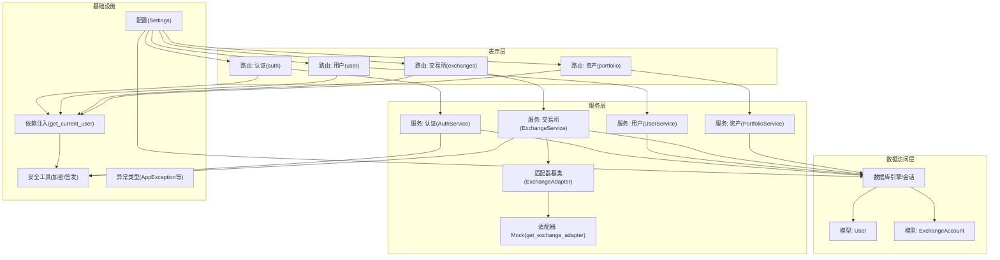
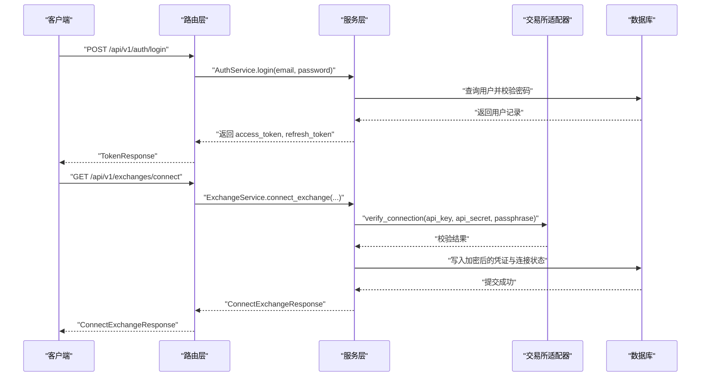
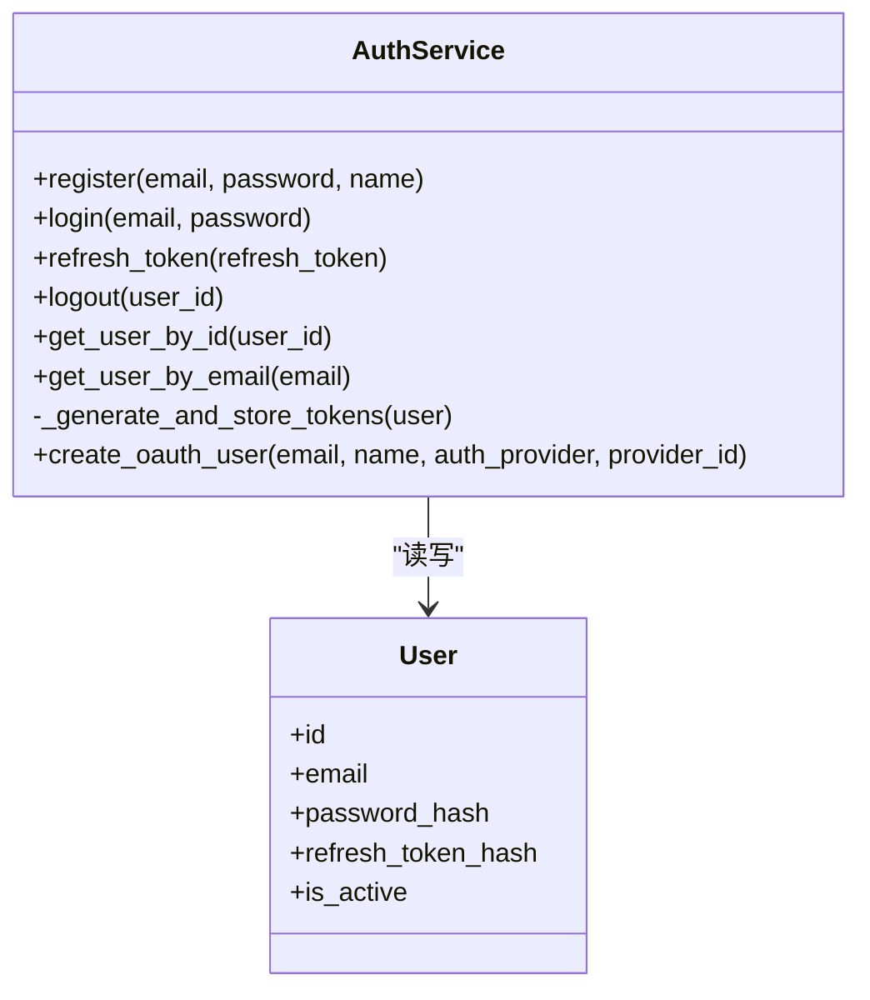
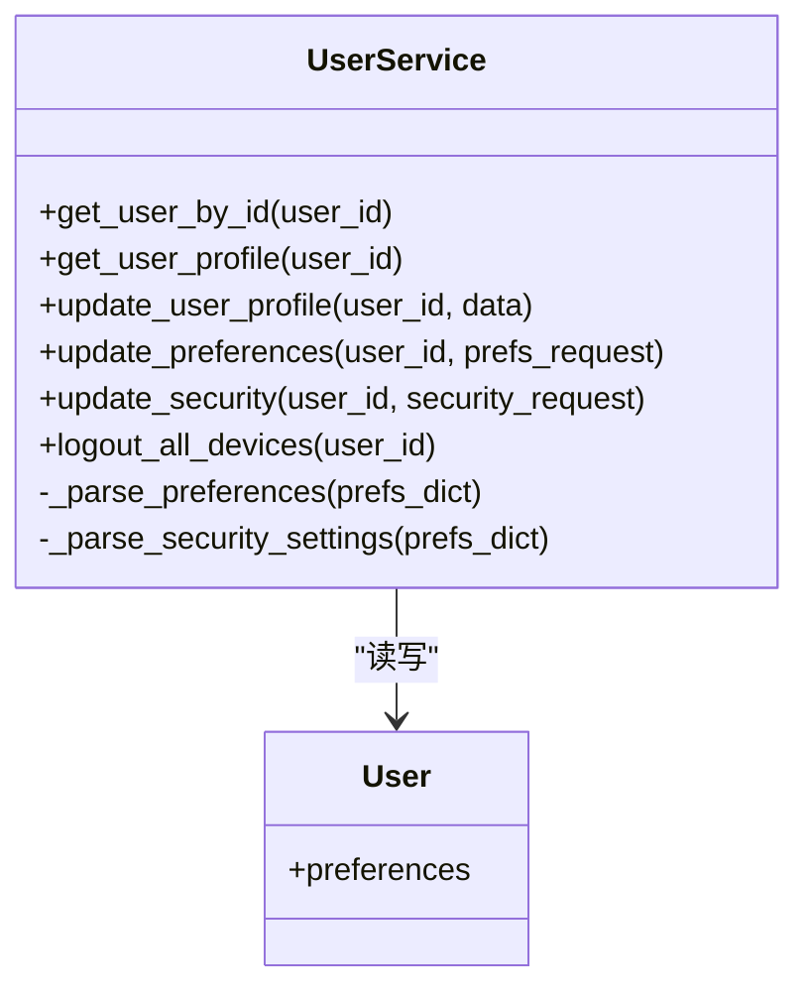
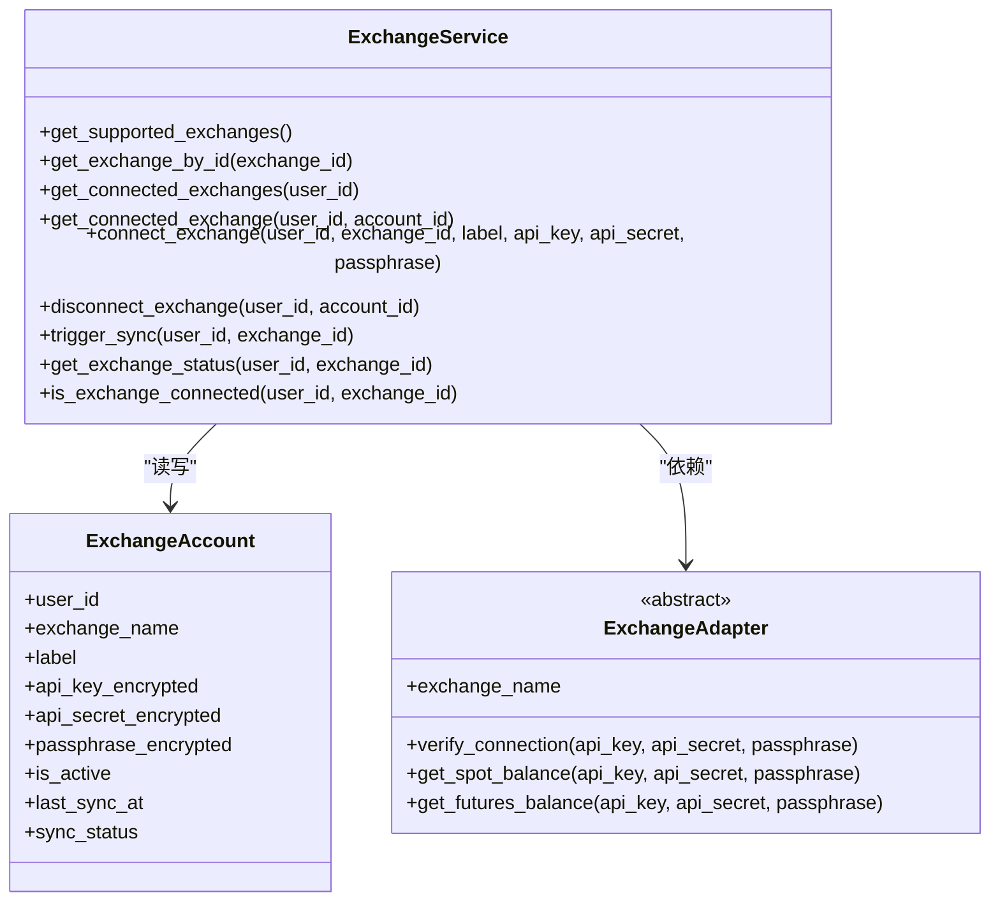
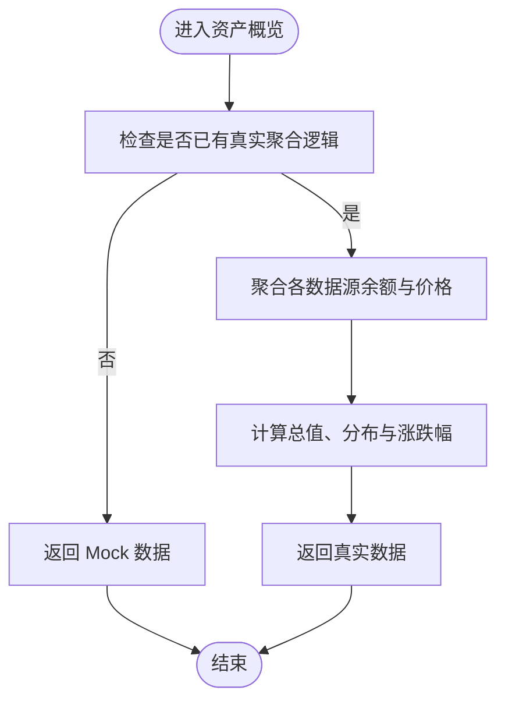
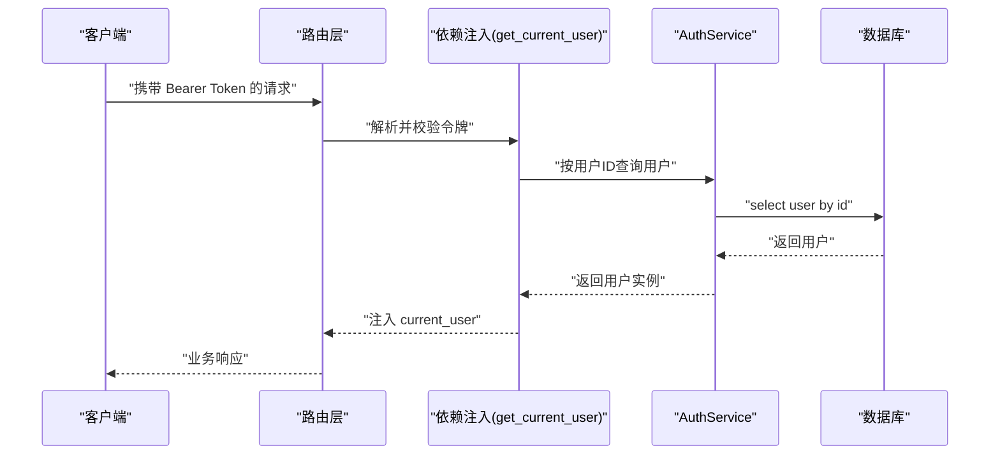
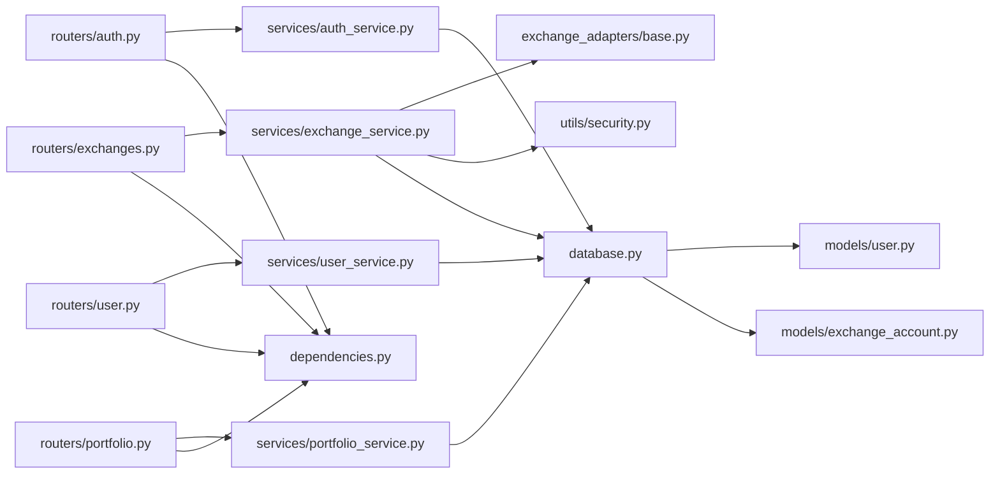

# 服务层架构

<cite>
**本文引用的文件**
- [backend/app/main.py](file://backend/app/main.py)
- [backend/app/config.py](file://backend/app/config.py)
- [backend/app/database.py](file://backend/app/database.py)
- [backend/app/dependencies.py](file://backend/app/dependencies.py)
- [backend/app/utils/security.py](file://backend/app/utils/security.py)
- [backend/app/utils/exceptions.py](file://backend/app/utils/exceptions.py)
- [backend/app/models/user.py](file://backend/app/models/user.py)
- [backend/app/models/exchange_account.py](file://backend/app/models/exchange_account.py)
- [backend/app/routers/auth.py](file://backend/app/routers/auth.py)
- [backend/app/routers/user.py](file://backend/app/routers/user.py)
- [backend/app/routers/exchanges.py](file://backend/app/routers/exchanges.py)
- [backend/app/routers/portfolio.py](file://backend/app/routers/portfolio.py)
- [backend/app/services/auth_service.py](file://backend/app/services/auth_service.py)
- [backend/app/services/user_service.py](file://backend/app/services/user_service.py)
- [backend/app/services/exchange_service.py](file://backend/app/services/exchange_service.py)
- [backend/app/services/portfolio_service.py](file://backend/app/services/portfolio_service.py)
- [backend/app/services/exchange_adapters/base.py](file://backend/app/services/exchange_adapters/base.py)
- [backend/app/services/exchange_adapters/mock_adapter.py](file://backend/app/services/exchange_adapters/mock_adapter.py)
</cite>

## 目录
1. [引言](#引言)
2. [项目结构](#项目结构)
3. [核心组件](#核心组件)
4. [架构总览](#架构总览)
5. [详细组件分析](#详细组件分析)
6. [依赖分析](#依赖分析)
7. [性能考虑](#性能考虑)
8. [故障排查指南](#故障排查指南)
9. [结论](#结论)
10. [附录](#附录)

## 引言
本文件系统性梳理后端服务层的架构设计与实现，覆盖认证服务、用户服务、交易所服务与资产服务四大模块。重点阐述服务层的依赖注入机制、业务逻辑封装策略、服务间协作模式与数据流转过程，并给出扩展性设计与最佳实践建议。同时，结合路由层与数据访问层的交互关系，帮助读者全面理解从表示层到服务层再到数据层的调用链路。

## 项目结构
后端采用 FastAPI 应用，按“路由-服务-模型/工具”的层次组织。核心入口负责生命周期管理、CORS、异常处理与路由挂载；配置与数据库提供运行时基础设施；依赖注入模块统一解析 JWT 并注入当前用户；服务层封装业务规则；模型定义数据结构；适配器抽象交易所接入。

图表来源
- [backend/app/main.py:34-100](file://backend/app/main.py#L34-L100)
- [backend/app/routers/auth.py:22-253](file://backend/app/routers/auth.py#L22-L253)
- [backend/app/routers/user.py:19-280](file://backend/app/routers/user.py#L19-L280)
- [backend/app/routers/exchanges.py:20-225](file://backend/app/routers/exchanges.py#L20-L225)
- [backend/app/routers/portfolio.py:26-217](file://backend/app/routers/portfolio.py#L26-L217)
- [backend/app/services/auth_service.py:20-247](file://backend/app/services/auth_service.py#L20-L247)
- [backend/app/services/user_service.py:19-223](file://backend/app/services/user_service.py#L19-L223)
- [backend/app/services/exchange_service.py:26-414](file://backend/app/services/exchange_service.py#L26-L414)
- [backend/app/services/portfolio_service.py:31-317](file://backend/app/services/portfolio_service.py#L31-L317)
- [backend/app/services/exchange_adapters/base.py:5-73](file://backend/app/services/exchange_adapters/base.py#L5-L73)
- [backend/app/database.py:1-33](file://backend/app/database.py#L1-L33)
- [backend/app/models/user.py:11-32](file://backend/app/models/user.py#L11-L32)
- [backend/app/models/exchange_account.py:11-32](file://backend/app/models/exchange_account.py#L11-L32)
- [backend/app/dependencies.py:18-74](file://backend/app/dependencies.py#L18-L74)
- [backend/app/config.py:5-51](file://backend/app/config.py#L5-L51)

章节来源
- [backend/app/main.py:13-131](file://backend/app/main.py#L13-L131)
- [backend/app/config.py:1-51](file://backend/app/config.py#L1-L51)
- [backend/app/database.py:1-33](file://backend/app/database.py#L1-L33)

## 核心组件
- 认证服务(AuthService): 负责注册、登录、令牌刷新与登出，封装密码哈希、JWT 签发与刷新令牌轮换。
- 用户服务(UserService): 提供用户资料、偏好设置与安全设置的读取与更新，支持登出所有设备。
- 交易所服务(ExchangeService): 维护支持的交易所清单、连接/断开交易所、触发同步与状态查询，使用适配器进行凭证校验与数据抽象。
- 资产服务(PortfolioService): 聚合用户资产概览、历史净值、持仓列表与已连接数据源，当前返回 Mock 数据，预留真实聚合逻辑。
- 依赖注入(get_current_user): 从请求头解析 JWT，校验令牌类型与有效性，加载当前用户上下文。
- 适配器体系(ExchangeAdapter): 抽象交易所接入能力，Mock 适配器用于演示与开发。

章节来源
- [backend/app/services/auth_service.py:20-247](file://backend/app/services/auth_service.py#L20-L247)
- [backend/app/services/user_service.py:19-223](file://backend/app/services/user_service.py#L19-L223)
- [backend/app/services/exchange_service.py:26-414](file://backend/app/services/exchange_service.py#L26-L414)
- [backend/app/services/portfolio_service.py:31-317](file://backend/app/services/portfolio_service.py#L31-L317)
- [backend/app/dependencies.py:18-74](file://backend/app/dependencies.py#L18-L74)
- [backend/app/services/exchange_adapters/base.py:5-73](file://backend/app/services/exchange_adapters/base.py#L5-L73)

## 架构总览
服务层通过依赖注入在路由层获取数据库会话与当前用户上下文，围绕领域模型(User、ExchangeAccount)执行业务操作。服务层内部通过工具模块完成安全与异常处理，对外以 Pydantic 模型作为数据契约，确保表示层与数据访问层解耦。

图表来源
- [backend/app/routers/auth.py:55-81](file://backend/app/routers/auth.py#L55-L81)
- [backend/app/services/auth_service.py:67-97](file://backend/app/services/auth_service.py#L67-L97)
- [backend/app/routers/exchanges.py:84-120](file://backend/app/routers/exchanges.py#L84-L120)
- [backend/app/services/exchange_service.py:231-301](file://backend/app/services/exchange_service.py#L231-L301)
- [backend/app/services/exchange_adapters/base.py:8-26](file://backend/app/services/exchange_adapters/base.py#L8-L26)

## 详细组件分析

### 认证服务(AuthService)
- 设计原则
  - 封装认证与令牌生命周期管理，避免路由层直接处理安全细节。
  - 使用刷新令牌轮换与撤销机制，提升安全性。
- 关键职责
  - 注册: 校验邮箱唯一性、密码哈希、创建用户并签发令牌。
  - 登录: 校验账户状态与密码，签发新令牌对。
  - 刷新: 验证刷新令牌类型与哈希一致性，签发新的令牌对。
  - 登出: 清空刷新令牌哈希，使旧令牌失效。
  - OAuth 用户: 支持 Google/Apple 等第三方登录，自动创建或更新用户。
- 错误处理
  - 使用统一的认证与验证异常类型，便于全局捕获与格式化响应。
- 复杂度
  - 单次操作通常为 O(1) 查询，受数据库索引影响；令牌签发与哈希计算为常数时间。

图表来源
- [backend/app/services/auth_service.py:20-247](file://backend/app/services/auth_service.py#L20-L247)
- [backend/app/models/user.py:11-32](file://backend/app/models/user.py#L11-L32)

章节来源
- [backend/app/services/auth_service.py:20-247](file://backend/app/services/auth_service.py#L20-L247)
- [backend/app/routers/auth.py:25-159](file://backend/app/routers/auth.py#L25-L159)
- [backend/app/utils/security.py](file://backend/app/utils/security.py)
- [backend/app/utils/exceptions.py](file://backend/app/utils/exceptions.py)

### 用户服务(UserService)
- 设计原则
  - 将用户资料、偏好设置与安全设置的读写逻辑集中于单一服务，便于维护与扩展。
  - 偏好设置与安全设置共用同一 JSON 字段，通过解析器转换为强类型对象。
- 关键职责
  - 获取用户档案: 解析偏好设置并组装 UserProfile。
  - 更新资料: 支持名称与头像字段更新。
  - 更新偏好: 支持基础货币、刷新间隔、生物识别与市场提醒等。
  - 更新安全: 更新生物识别与双因子开关等。
  - 登出所有设备: 通过清空刷新令牌哈希实现全局登出。
- 错误处理
  - 对不存在的用户抛出未找到异常，保证上层统一处理。

图表来源
- [backend/app/services/user_service.py:19-223](file://backend/app/services/user_service.py#L19-L223)
- [backend/app/models/user.py:11-32](file://backend/app/models/user.py#L11-L32)

章节来源
- [backend/app/services/user_service.py:19-223](file://backend/app/services/user_service.py#L19-L223)
- [backend/app/routers/user.py:24-177](file://backend/app/routers/user.py#L24-L177)

### 交易所服务(ExchangeService)
- 设计原则
  - 通过适配器抽象不同交易所的差异，统一验证与数据获取接口。
  - 连接信息加密存储，断开连接采用软删除，保留审计轨迹。
- 关键职责
  - 支持交易所清单: 内置支持多家交易所及其特性。
  - 连接管理: 验证凭据、加密存储、创建连接记录。
  - 断开连接: 软删除，标记为非活跃。
  - 手动同步: 触发同步状态变更，预留后台任务。
  - 状态查询: 返回连接状态、最后同步时间与模拟余额计数。
  - 连接校验: 通过适配器验证凭据有效性。
- 适配器集成
  - 通过工厂函数选择具体适配器，当前使用 Mock 适配器演示流程。

图表来源
- [backend/app/services/exchange_service.py:26-414](file://backend/app/services/exchange_service.py#L26-L414)
- [backend/app/models/exchange_account.py:11-32](file://backend/app/models/exchange_account.py#L11-L32)
- [backend/app/services/exchange_adapters/base.py:5-73](file://backend/app/services/exchange_adapters/base.py#L5-L73)

章节来源
- [backend/app/services/exchange_service.py:26-414](file://backend/app/services/exchange_service.py#L26-L414)
- [backend/app/routers/exchanges.py:23-198](file://backend/app/routers/exchanges.py#L23-L198)
- [backend/app/services/exchange_adapters/mock_adapter.py](file://backend/app/services/exchange_adapters/mock_adapter.py)

### 资产服务(PortfolioService)
- 设计原则
  - 以用户为中心聚合多数据源资产，当前返回 Mock 数据，预留真实聚合接口。
  - 通过 Pydantic 模型定义输出契约，保证前后端一致的数据结构。
- 关键职责
  - 资产概览: 总价值、24 小时涨跌与来源分布。
  - 历史净值: 按周期生成时间序列与统计指标。
  - 持仓列表: 按币种聚合并计算占比与涨跌幅。
  - 已连数据源: 汇总交易所与钱包连接状态。
  - 同步调度: 预留后台同步任务入口。
- 复杂度
  - 当前为纯内存计算，复杂度取决于数据点数量；真实实现需考虑外部 API 与缓存策略。

图表来源
- [backend/app/services/portfolio_service.py:41-65](file://backend/app/services/portfolio_service.py#L41-L65)
- [backend/app/services/portfolio_service.py:90-140](file://backend/app/services/portfolio_service.py#L90-L140)
- [backend/app/services/portfolio_service.py:146-202](file://backend/app/services/portfolio_service.py#L146-L202)
- [backend/app/services/portfolio_service.py:208-264](file://backend/app/services/portfolio_service.py#L208-L264)

章节来源
- [backend/app/services/portfolio_service.py:31-317](file://backend/app/services/portfolio_service.py#L31-L317)
- [backend/app/routers/portfolio.py:33-176](file://backend/app/routers/portfolio.py#L33-L176)

### 依赖注入与安全上下文
- get_current_user
  - 从 Authorization 头提取 JWT，校验令牌类型与有效性，解析用户 ID 并从数据库加载用户。
  - 对匿名可选场景提供 get_optional_user，便于公开与私有混合接口。
- 安全工具
  - 密码哈希与校验、JWT 签发与校验、API Key 加密等由工具模块提供。
- 全局异常处理
  - 自定义应用异常与通用异常分别映射为标准化响应，保证错误信息一致。

图表来源
- [backend/app/dependencies.py:18-74](file://backend/app/dependencies.py#L18-L74)
- [backend/app/services/auth_service.py:154-178](file://backend/app/services/auth_service.py#L154-L178)
- [backend/app/routers/user.py:24-45](file://backend/app/routers/user.py#L24-L45)

章节来源
- [backend/app/dependencies.py:18-74](file://backend/app/dependencies.py#L18-L74)
- [backend/app/main.py:65-91](file://backend/app/main.py#L65-L91)
- [backend/app/utils/security.py](file://backend/app/utils/security.py)

## 依赖分析
- 路由到服务
  - 各路由在处理函数中显式构造服务实例并调用其方法，依赖注入集中在依赖模块与路由参数中。
- 服务到数据访问
  - 服务通过 SQLAlchemy 异步会话执行 ORM 操作，模型定义与数据库元数据在各自模块中维护。
- 服务到适配器
  - 交易所服务通过工厂函数获取适配器实例，适配器接口统一不同交易所差异。
- 配置与异常
  - 配置类集中管理密钥与连接串；异常模块提供统一错误类型，路由层进行全局异常映射。

图表来源
- [backend/app/routers/auth.py:22-253](file://backend/app/routers/auth.py#L22-L253)
- [backend/app/routers/user.py:19-280](file://backend/app/routers/user.py#L19-L280)
- [backend/app/routers/exchanges.py:20-225](file://backend/app/routers/exchanges.py#L20-L225)
- [backend/app/routers/portfolio.py:26-217](file://backend/app/routers/portfolio.py#L26-L217)
- [backend/app/services/exchange_service.py:26-414](file://backend/app/services/exchange_service.py#L26-L414)
- [backend/app/services/exchange_adapters/base.py:5-73](file://backend/app/services/exchange_adapters/base.py#L5-L73)
- [backend/app/database.py:1-33](file://backend/app/database.py#L1-L33)
- [backend/app/models/user.py:11-32](file://backend/app/models/user.py#L11-L32)
- [backend/app/models/exchange_account.py:11-32](file://backend/app/models/exchange_account.py#L11-L32)
- [backend/app/dependencies.py:18-74](file://backend/app/dependencies.py#L18-L74)

章节来源
- [backend/app/routers/auth.py:22-253](file://backend/app/routers/auth.py#L22-L253)
- [backend/app/routers/user.py:19-280](file://backend/app/routers/user.py#L19-L280)
- [backend/app/routers/exchanges.py:20-225](file://backend/app/routers/exchanges.py#L20-L225)
- [backend/app/routers/portfolio.py:26-217](file://backend/app/routers/portfolio.py#L26-L217)
- [backend/app/services/exchange_service.py:26-414](file://backend/app/services/exchange_service.py#L26-L414)

## 性能考虑
- 并发与会话
  - 使用异步 SQLAlchemy 会话，配合 FastAPI 的异步路由，适合高并发场景；注意避免跨请求共享会话实例。
- 令牌与缓存
  - 刷新令牌轮换与撤销可减少长期有效令牌风险；可引入 Redis 缓存热点用户信息与令牌黑名单。
- 外部 API
  - 交易所与行情接口存在速率限制，建议引入限流与重试策略，并对常用数据进行本地缓存。
- 数据聚合
  - 资产聚合涉及多次外部调用，应采用批量拉取、并发请求与增量更新策略，降低延迟与成本。
- 数据库
  - 对高频查询字段建立索引（如用户邮箱、交换账户外键），合理使用只读副本与连接池配置。

## 故障排查指南
- 认证失败
  - 检查 Authorization 头是否正确传递 Bearer Token，确认令牌类型为 access，未过期且用户处于激活状态。
- 令牌刷新失败
  - 确认刷新令牌类型与哈希一致性，检查用户是否存在且刷新令牌未被撤销。
- 交易所连接失败
  - 校验凭据是否正确，部分交易所需要口令；确认适配器可用且网络可达。
- 数据库连接问题
  - 查看启动日志与连接串配置，确保数据库服务可用且凭据正确。
- 全局异常
  - 自定义异常与通用异常均已映射为标准响应，定位错误码与消息以便快速修复。

章节来源
- [backend/app/dependencies.py:18-74](file://backend/app/dependencies.py#L18-L74)
- [backend/app/services/auth_service.py:99-153](file://backend/app/services/auth_service.py#L99-L153)
- [backend/app/services/exchange_service.py:231-301](file://backend/app/services/exchange_service.py#L231-L301)
- [backend/app/main.py:65-91](file://backend/app/main.py#L65-L91)

## 结论
服务层通过清晰的职责划分与依赖注入机制，实现了认证、用户、交易所与资产等核心领域的业务封装。配合适配器抽象与统一的异常处理，系统具备良好的扩展性与可维护性。建议在后续版本中完善资产聚合的真实实现、引入缓存与限流策略，并强化安全与可观测性建设。

## 附录
- 代码示例路径
  - 认证注册流程: [backend/app/routers/auth.py:25-52](file://backend/app/routers/auth.py#L25-L52), [backend/app/services/auth_service.py:26-65](file://backend/app/services/auth_service.py#L26-L65)
  - 用户资料更新: [backend/app/routers/user.py:48-70](file://backend/app/routers/user.py#L48-L70), [backend/app/services/user_service.py:64-95](file://backend/app/services/user_service.py#L64-L95)
  - 交易所连接: [backend/app/routers/exchanges.py:84-119](file://backend/app/routers/exchanges.py#L84-L119), [backend/app/services/exchange_service.py:231-301](file://backend/app/services/exchange_service.py#L231-L301)
  - 资产概览: [backend/app/routers/portfolio.py:33-59](file://backend/app/routers/portfolio.py#L33-L59), [backend/app/services/portfolio_service.py:41-65](file://backend/app/services/portfolio_service.py#L41-L65)
- 最佳实践
  - 使用 Pydantic 模型严格约束输入输出，确保契约稳定。
  - 将业务规则集中在服务层，路由仅做参数解析与响应包装。
  - 对敏感数据进行加密存储，令牌管理遵循最小权限与及时轮换原则。
  - 引入单元测试与集成测试，覆盖关键业务分支与异常路径。