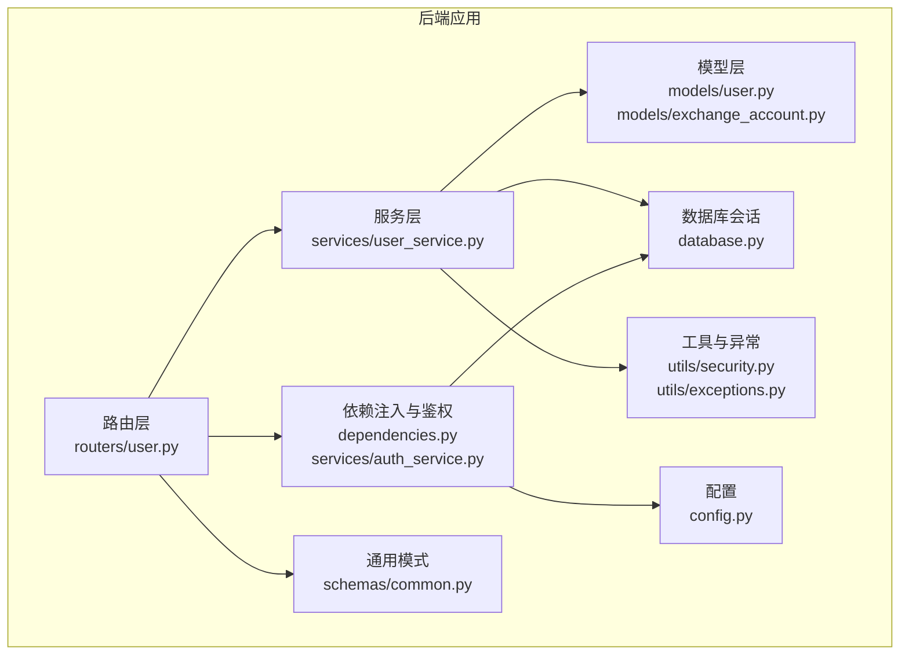
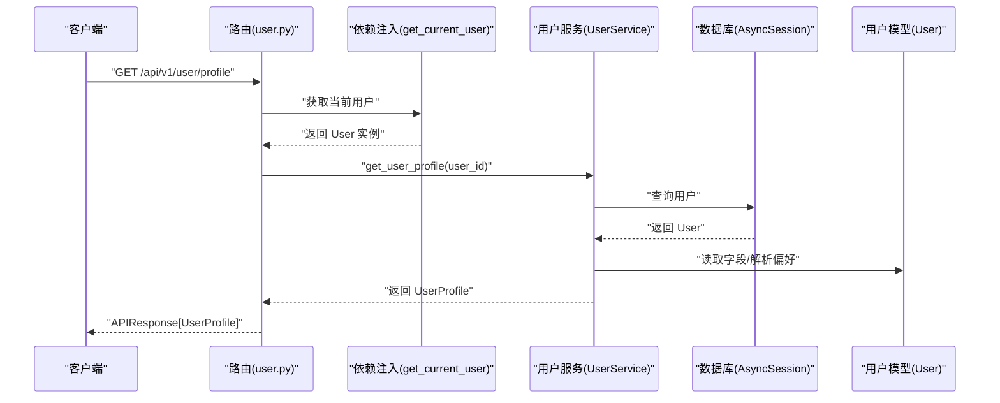
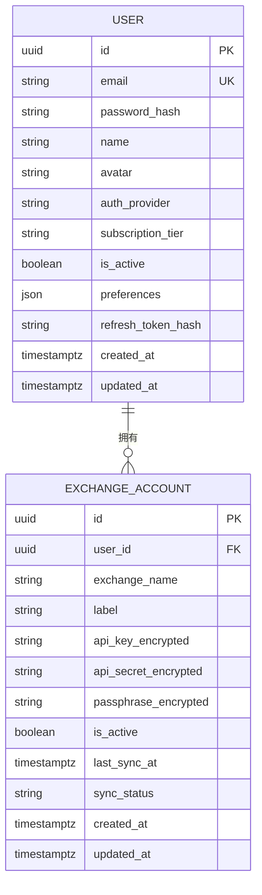
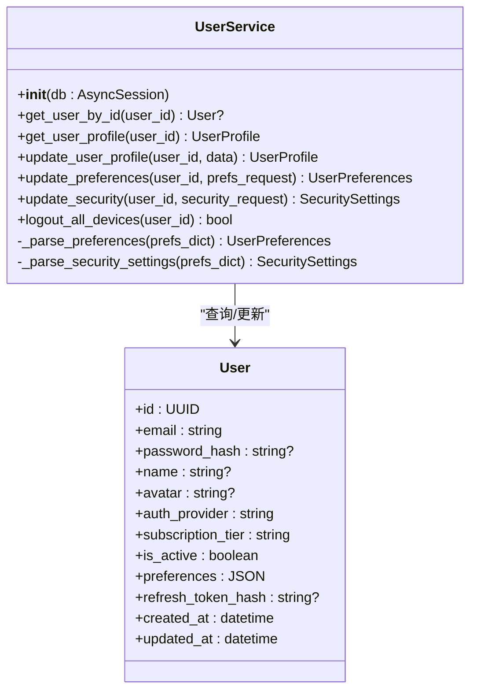
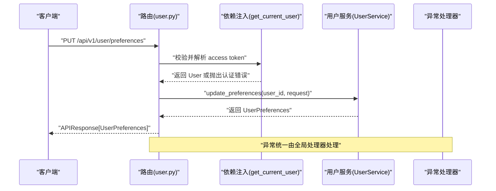
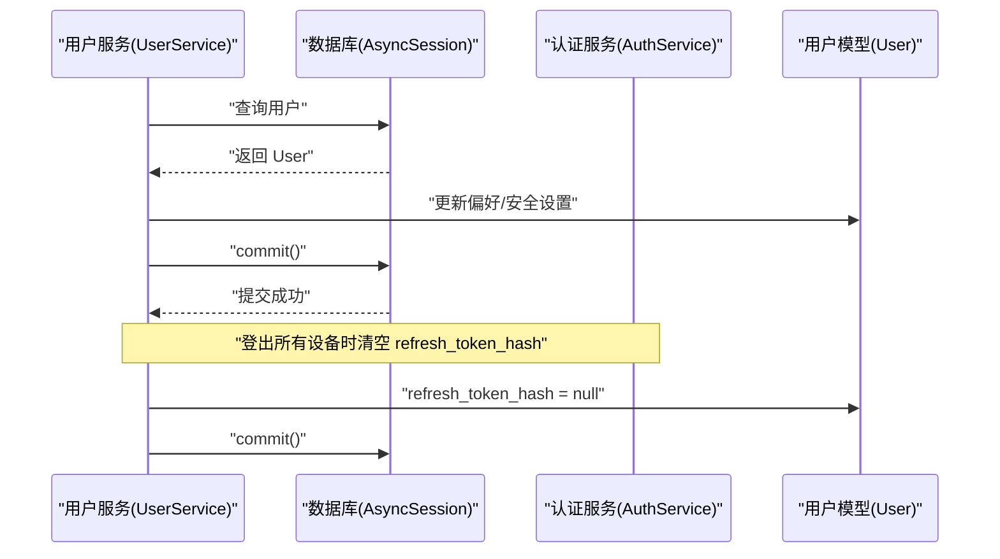
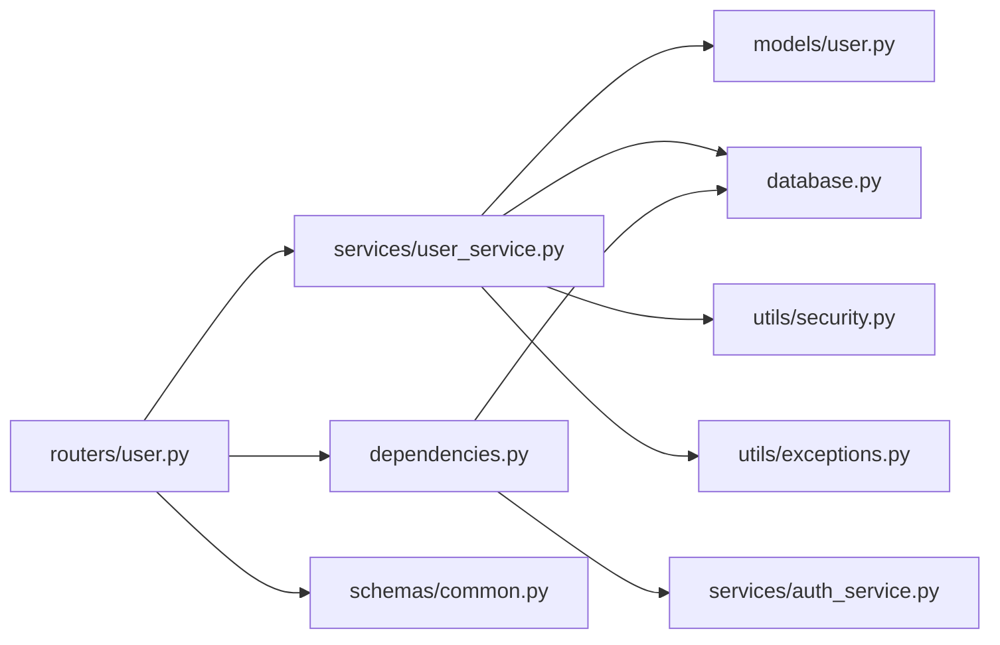

# 用户服务

<cite>
**本文引用的文件**
- [backend/app/models/user.py](file://backend/app/models/user.py)
- [backend/app/models/exchange_account.py](file://backend/app/models/exchange_account.py)
- [backend/app/services/user_service.py](file://backend/app/services/user_service.py)
- [backend/app/schemas/user.py](file://backend/app/schemas/user.py)
- [backend/app/routers/user.py](file://backend/app/routers/user.py)
- [backend/app/services/auth_service.py](file://backend/app/services/auth_service.py)
- [backend/app/utils/security.py](file://backend/app/utils/security.py)
- [backend/app/utils/exceptions.py](file://backend/app/utils/exceptions.py)
- [backend/app/dependencies.py](file://backend/app/dependencies.py)
- [backend/app/database.py](file://backend/app/database.py)
- [backend/app/config.py](file://backend/app/config.py)
- [backend/app/schemas/common.py](file://backend/app/schemas/common.py)
- [backend/app/main.py](file://backend/app/main.py)
</cite>

## 目录
1. [简介](#简介)
2. [项目结构](#项目结构)
3. [核心组件](#核心组件)
4. [架构总览](#架构总览)
5. [详细组件分析](#详细组件分析)
6. [依赖分析](#依赖分析)
7. [性能考虑](#性能考虑)
8. [故障排查指南](#故障排查指南)
9. [结论](#结论)
10. [附录](#附录)

## 简介
本文件为用户服务的综合技术文档，围绕 UserService 类的职责与实现展开，涵盖用户信息管理、个人资料更新、账户设置、偏好与安全设置维护、登出所有设备等能力。文档还解释了用户数据模型的设计与验证规则、业务逻辑实现、权限控制与数据访问模式，并提供与认证服务及数据库层的交互关系说明。为便于非技术读者理解，文档采用渐进式复杂度层次与可视化图示呈现关键流程。

## 项目结构
用户服务相关代码位于后端目录 backend/app 下，按“模型-服务-路由-模式”分层组织，配合工具模块与依赖注入机制，形成清晰的职责边界与调用链路。

图表来源
- [backend/app/routers/user.py:1-280](file://backend/app/routers/user.py#L1-L280)
- [backend/app/services/user_service.py:1-223](file://backend/app/services/user_service.py#L1-L223)
- [backend/app/models/user.py:1-32](file://backend/app/models/user.py#L1-L32)
- [backend/app/models/exchange_account.py:1-32](file://backend/app/models/exchange_account.py#L1-L32)
- [backend/app/utils/security.py:1-104](file://backend/app/utils/security.py#L1-L104)
- [backend/app/utils/exceptions.py:1-67](file://backend/app/utils/exceptions.py#L1-L67)
- [backend/app/dependencies.py:1-74](file://backend/app/dependencies.py#L1-L74)
- [backend/app/database.py:1-33](file://backend/app/database.py#L1-L33)
- [backend/app/config.py:1-51](file://backend/app/config.py#L1-L51)
- [backend/app/schemas/common.py:1-25](file://backend/app/schemas/common.py#L1-L25)

章节来源
- [backend/app/routers/user.py:1-280](file://backend/app/routers/user.py#L1-L280)
- [backend/app/services/user_service.py:1-223](file://backend/app/services/user_service.py#L1-L223)
- [backend/app/models/user.py:1-32](file://backend/app/models/user.py#L1-L32)
- [backend/app/models/exchange_account.py:1-32](file://backend/app/models/exchange_account.py#L1-L32)
- [backend/app/utils/security.py:1-104](file://backend/app/utils/security.py#L1-L104)
- [backend/app/utils/exceptions.py:1-67](file://backend/app/utils/exceptions.py#L1-L67)
- [backend/app/dependencies.py:1-74](file://backend/app/dependencies.py#L1-L74)
- [backend/app/database.py:1-33](file://backend/app/database.py#L1-L33)
- [backend/app/config.py:1-51](file://backend/app/config.py#L1-L51)
- [backend/app/schemas/common.py:1-25](file://backend/app/schemas/common.py#L1-L25)

## 核心组件
- 用户模型 User：定义用户实体字段、索引与与交易所账户的一对多关系。
- 用户服务 UserService：封装用户资料查询、更新、偏好与安全设置维护、登出所有设备等业务逻辑。
- 用户路由 user.py：暴露用户资料、偏好、安全、API 管理等接口，统一使用当前用户依赖进行鉴权。
- 验证与异常：Pydantic 模型用于输入校验；自定义异常类型用于统一错误响应。
- 数据库与会话：异步 SQLAlchemy 引擎与会话工厂，支持依赖注入。
- 安全工具：密码哈希、JWT 令牌生成与校验、API Key 加解密。
- 认证服务：注册、登录、令牌刷新与注销，与用户服务在令牌轮换与登出场景协作。

章节来源
- [backend/app/models/user.py:11-32](file://backend/app/models/user.py#L11-L32)
- [backend/app/services/user_service.py:19-223](file://backend/app/services/user_service.py#L19-L223)
- [backend/app/routers/user.py:1-280](file://backend/app/routers/user.py#L1-L280)
- [backend/app/schemas/user.py:1-96](file://backend/app/schemas/user.py#L1-L96)
- [backend/app/utils/exceptions.py:1-67](file://backend/app/utils/exceptions.py#L1-L67)
- [backend/app/database.py:1-33](file://backend/app/database.py#L1-L33)
- [backend/app/utils/security.py:1-104](file://backend/app/utils/security.py#L1-L104)
- [backend/app/services/auth_service.py:1-249](file://backend/app/services/auth_service.py#L1-L249)

## 架构总览
用户服务的调用链遵循“路由 -> 服务 -> 模型/数据库”的分层设计，鉴权由依赖注入完成，异常通过全局处理器统一返回。

图表来源
- [backend/app/routers/user.py:24-45](file://backend/app/routers/user.py#L24-L45)
- [backend/app/dependencies.py:18-56](file://backend/app/dependencies.py#L18-L56)
- [backend/app/services/user_service.py:32-62](file://backend/app/services/user_service.py#L32-L62)
- [backend/app/models/user.py:11-32](file://backend/app/models/user.py#L11-L32)
- [backend/app/database.py:26-33](file://backend/app/database.py#L26-L33)

## 详细组件分析

### 用户数据模型与关系
- 用户模型 User
  - 关键字段：UUID 主键、唯一邮箱、可空密码哈希（OAuth 用户）、名称、头像、认证提供商、订阅等级、激活状态、JSON 偏好设置、当前刷新令牌哈希、时间戳。
  - 关系：与 ExchangeAccount 一对多，级联删除或孤儿对象清理。
- 交易所账户模型 ExchangeAccount
  - 关键字段：用户外键、交易所名称、标签、加密 API 密钥、加密密钥、可选口令、激活状态、同步状态与时间等。
  - 关系：与 User 反向关联。

图表来源
- [backend/app/models/user.py:11-32](file://backend/app/models/user.py#L11-L32)
- [backend/app/models/exchange_account.py:11-32](file://backend/app/models/exchange_account.py#L11-L32)

章节来源
- [backend/app/models/user.py:11-32](file://backend/app/models/user.py#L11-L32)
- [backend/app/models/exchange_account.py:11-32](file://backend/app/models/exchange_account.py#L11-L32)

### 用户服务 UserService
- 职责
  - 查询用户资料与偏好设置
  - 更新用户资料（名称、头像）
  - 更新用户偏好设置（基础货币、刷新间隔、生物识别、市场提醒）
  - 更新安全设置（生物识别、双因子）
  - 登出所有设备（清除刷新令牌哈希）
- 数据访问模式
  - 使用异步会话执行查询与提交，确保事务一致性。
  - 对 JSON 偏好字段采用浅拷贝后整体赋值，触发 SQLAlchemy 脏检测。
- 错误处理
  - 用户不存在时抛出 NotFoundError；路由层统一转换为 404 响应。

图表来源
- [backend/app/services/user_service.py:19-223](file://backend/app/services/user_service.py#L19-L223)
- [backend/app/models/user.py:11-32](file://backend/app/models/user.py#L11-L32)

章节来源
- [backend/app/services/user_service.py:19-223](file://backend/app/services/user_service.py#L19-L223)

### 用户路由与权限控制
- 路由
  - 用户资料：GET/PUT /api/v1/user/profile
  - 偏好设置：GET/PUT /api/v1/user/preferences
  - 安全设置：GET/PUT /api/v1/user/security
  - API 管理：GET /api/v1/user/apis（模拟数据）
  - 兼容旧端点：/user/me 系列
- 权限控制
  - 通过依赖注入 get_current_user 获取当前用户，要求携带有效 access token。
  - 若 token 缺失、过期、类型不正确或用户不存在/禁用，抛出 AuthenticationError。
- 统一响应
  - 所有接口返回 APIResponse 泛型包装，包含 success、data、message、error_code。

图表来源
- [backend/app/routers/user.py:99-121](file://backend/app/routers/user.py#L99-L121)
- [backend/app/dependencies.py:18-56](file://backend/app/dependencies.py#L18-L56)
- [backend/app/utils/exceptions.py:21-42](file://backend/app/utils/exceptions.py#L21-L42)
- [backend/app/schemas/common.py:8-13](file://backend/app/schemas/common.py#L8-L13)

章节来源
- [backend/app/routers/user.py:1-280](file://backend/app/routers/user.py#L1-L280)
- [backend/app/dependencies.py:18-56](file://backend/app/dependencies.py#L18-L56)
- [backend/app/schemas/common.py:8-13](file://backend/app/schemas/common.py#L8-L13)

### 用户数据模型与验证规则
- Pydantic 模型
  - UserPreferences：基础货币默认 USD、刷新间隔 1-60 分钟、生物识别与市场提醒默认开启。
  - UpdatePreferencesRequest：允许部分字段更新，带范围约束。
  - SecuritySettings：生物识别与双因子默认值，双因子方法默认 ["sms","email"]。
  - UpdateSecurityRequest：允许更新生物识别与双因子开关。
  - UserProfile：包含基本信息、订阅等级、认证方式、验证状态与偏好设置。
  - UpdateProfileRequest：允许更新名称与头像，带长度限制。
- 验证规则
  - 字段范围与长度约束由 Pydantic Field 提供。
  - 业务约束（如偏好合并策略）由服务层实现。

章节来源
- [backend/app/schemas/user.py:10-96](file://backend/app/schemas/user.py#L10-L96)

### 业务逻辑实现要点
- 偏好设置更新
  - 读取现有偏好字典，浅拷贝后逐项更新，再整体赋值，确保 SQLAlchemy 脏检测生效。
- 安全设置更新
  - 将双因子相关字段写入偏好字典，服务层解析为 SecuritySettings 返回。
- 登出所有设备
  - 清空用户 refresh_token_hash，使所有刷新令牌失效，实现跨设备强制登出。

章节来源
- [backend/app/services/user_service.py:97-205](file://backend/app/services/user_service.py#L97-L205)

### 与认证服务与数据库的交互
- 与认证服务协作
  - 登出所有设备与令牌轮换：AuthService 在生成/刷新令牌时存储 refresh_token_hash；UserService 通过清空该字段实现跨设备登出。
  - OAuth 用户：AuthService 支持 Google/Apple 登录，创建无密码用户并生成令牌。
- 与数据库交互
  - 通过 AsyncSession 执行查询与提交，使用 select 构建查询语句。
  - 用户模型与交易所账户模型通过关系映射实现关联查询。

图表来源
- [backend/app/services/user_service.py:179-205](file://backend/app/services/user_service.py#L179-L205)
- [backend/app/services/auth_service.py:180-204](file://backend/app/services/auth_service.py#L180-L204)
- [backend/app/models/user.py:14-25](file://backend/app/models/user.py#L14-L25)

章节来源
- [backend/app/services/user_service.py:179-205](file://backend/app/services/user_service.py#L179-L205)
- [backend/app/services/auth_service.py:180-204](file://backend/app/services/auth_service.py#L180-L204)

### 示例：用户信息的增删改查操作
以下示例展示如何通过路由与服务层实现用户信息的常见操作（以路径代替具体代码内容）：
- 获取用户资料
  - 路由：[backend/app/routers/user.py:24-45](file://backend/app/routers/user.py#L24-L45)
  - 服务：[backend/app/services/user_service.py:32-62](file://backend/app/services/user_service.py#L32-L62)
- 更新用户资料
  - 路由：[backend/app/routers/user.py:48-70](file://backend/app/routers/user.py#L48-L70)
  - 服务：[backend/app/services/user_service.py:64-95](file://backend/app/services/user_service.py#L64-L95)
- 获取/更新偏好设置
  - 路由：[backend/app/routers/user.py:75-121](file://backend/app/routers/user.py#L75-L121)
  - 服务：[backend/app/services/user_service.py:97-138](file://backend/app/services/user_service.py#L97-L138)
- 获取/更新安全设置
  - 路由：[backend/app/routers/user.py:126-177](file://backend/app/routers/user.py#L126-L177)
  - 服务：[backend/app/services/user_service.py:140-177](file://backend/app/services/user_service.py#L140-L177)
- 登出所有设备
  - 服务：[backend/app/services/user_service.py:179-205](file://backend/app/services/user_service.py#L179-L205)

章节来源
- [backend/app/routers/user.py:24-177](file://backend/app/routers/user.py#L24-L177)
- [backend/app/services/user_service.py:32-205](file://backend/app/services/user_service.py#L32-L205)

### 示例：数据验证与错误处理
- 输入验证
  - 使用 Pydantic 模型对请求体进行字段范围、类型与长度校验。
- 错误处理
  - NotFoundError：用户不存在时抛出，路由层统一转换为 404。
  - AuthenticationError：鉴权失败时抛出，全局异常处理器统一返回。
  - 自定义 APIResponse 包装响应体，便于前端统一处理。

章节来源
- [backend/app/schemas/user.py:10-96](file://backend/app/schemas/user.py#L10-L96)
- [backend/app/utils/exceptions.py:33-42](file://backend/app/utils/exceptions.py#L33-L42)
- [backend/app/dependencies.py:18-56](file://backend/app/dependencies.py#L18-L56)
- [backend/app/schemas/common.py:8-13](file://backend/app/schemas/common.py#L8-L13)

## 依赖分析
- 组件耦合
  - 路由依赖于服务层与依赖注入；服务层依赖模型与数据库会话；工具模块提供安全与异常能力。
- 外部依赖
  - FastAPI、SQLAlchemy 异步、Pydantic、Passlib、cryptography、python-jose。
- 循环依赖
  - 未发现循环导入；各层职责清晰，通过依赖注入解耦。

图表来源
- [backend/app/routers/user.py:1-280](file://backend/app/routers/user.py#L1-L280)
- [backend/app/services/user_service.py:1-223](file://backend/app/services/user_service.py#L1-L223)
- [backend/app/models/user.py:1-32](file://backend/app/models/user.py#L1-L32)
- [backend/app/database.py:1-33](file://backend/app/database.py#L1-L33)
- [backend/app/utils/security.py:1-104](file://backend/app/utils/security.py#L1-L104)
- [backend/app/dependencies.py:1-74](file://backend/app/dependencies.py#L1-L74)
- [backend/app/services/auth_service.py:1-249](file://backend/app/services/auth_service.py#L1-L249)
- [backend/app/schemas/common.py:1-25](file://backend/app/schemas/common.py#L1-L25)
- [backend/app/utils/exceptions.py:1-67](file://backend/app/utils/exceptions.py#L1-L67)

章节来源
- [backend/app/routers/user.py:1-280](file://backend/app/routers/user.py#L1-L280)
- [backend/app/services/user_service.py:1-223](file://backend/app/services/user_service.py#L1-L223)
- [backend/app/dependencies.py:1-74](file://backend/app/dependencies.py#L1-L74)
- [backend/app/services/auth_service.py:1-249](file://backend/app/services/auth_service.py#L1-L249)

## 性能考虑
- 异步数据库访问：使用 SQLAlchemy 异步引擎与会话，减少阻塞，提升并发吞吐。
- 事务与提交：单次更新尽量合并为一次 commit，降低数据库往返。
- 偏好设置更新：整体替换 JSON 字段，避免细粒度字段多次写入。
- 令牌轮换：refresh_token_hash 存储单个有效令牌哈希，简化查询但存在多设备竞态风险，建议后续引入专用令牌表支持多设备并行登录。

## 故障排查指南
- 鉴权失败
  - 现象：返回 401，提示认证失败或无效令牌。
  - 排查：确认请求头携带 Bearer Token，Token 类型为 access，未过期且用户存在且激活。
  - 参考：[backend/app/dependencies.py:18-56](file://backend/app/dependencies.py#L18-L56)
- 用户不存在
  - 现象：返回 404，提示资源未找到。
  - 排查：确认 user_id 正确，用户是否存在。
  - 参考：[backend/app/services/user_service.py:45-47](file://backend/app/services/user_service.py#L45-L47)
- 偏好设置更新异常
  - 现象：字段未更新或未触发脏检测。
  - 排查：确认使用浅拷贝后整体赋值，确保 SQLAlchemy 检测到变更。
  - 参考：[backend/app/services/user_service.py:119-133](file://backend/app/services/user_service.py#L119-L133)
- 登出所有设备无效
  - 现象：刷新令牌仍可使用。
  - 排查：确认 refresh_token_hash 已清空并提交，AuthService 的令牌轮换逻辑正常。
  - 参考：[backend/app/services/user_service.py:195-203](file://backend/app/services/user_service.py#L195-L203), [backend/app/services/auth_service.py:180-204](file://backend/app/services/auth_service.py#L180-L204)

章节来源
- [backend/app/dependencies.py:18-56](file://backend/app/dependencies.py#L18-L56)
- [backend/app/services/user_service.py:45-47](file://backend/app/services/user_service.py#L45-L47)
- [backend/app/services/user_service.py:119-133](file://backend/app/services/user_service.py#L119-L133)
- [backend/app/services/user_service.py:195-203](file://backend/app/services/user_service.py#L195-L203)
- [backend/app/services/auth_service.py:180-204](file://backend/app/services/auth_service.py#L180-L204)

## 结论
用户服务通过清晰的分层设计与严格的依赖注入，实现了用户资料、偏好与安全设置的统一管理，并与认证服务协同完成令牌轮换与跨设备登出。数据模型采用 JSON 字段承载偏好设置，结合 Pydantic 验证与 SQLAlchemy 异步访问，满足功能需求与性能要求。未来可在令牌管理与 API 管理方面进一步扩展，以支持更复杂的多设备与第三方集成场景。

## 附录
- 配置项
  - JWT 密钥与算法、访问/刷新令牌有效期、数据库连接、加密密钥等。
  - 参考：[backend/app/config.py:5-51](file://backend/app/config.py#L5-L51)
- 应用入口
  - FastAPI 应用初始化、CORS、异常处理器、路由挂载。
  - 参考：[backend/app/main.py:34-101](file://backend/app/main.py#L34-L101)

章节来源
- [backend/app/config.py:5-51](file://backend/app/config.py#L5-L51)
- [backend/app/main.py:34-101](file://backend/app/main.py#L34-L101)