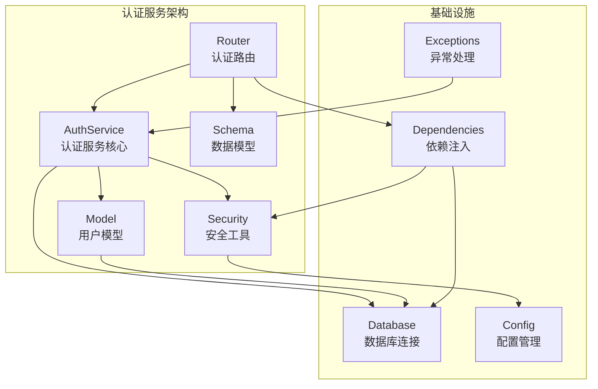
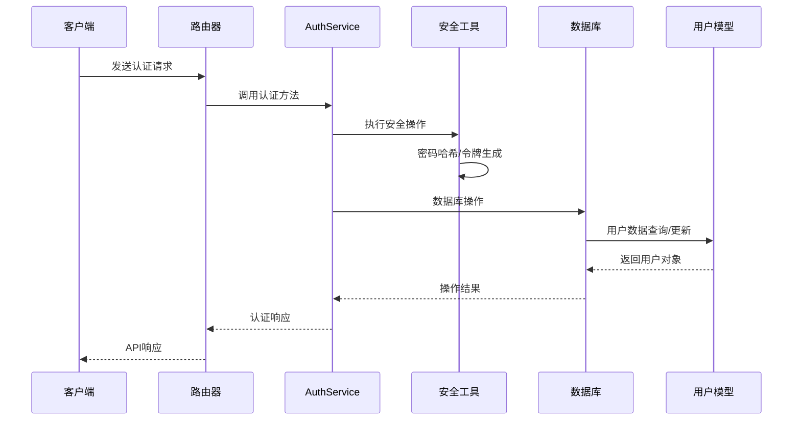
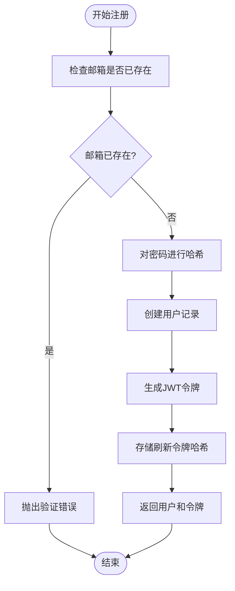
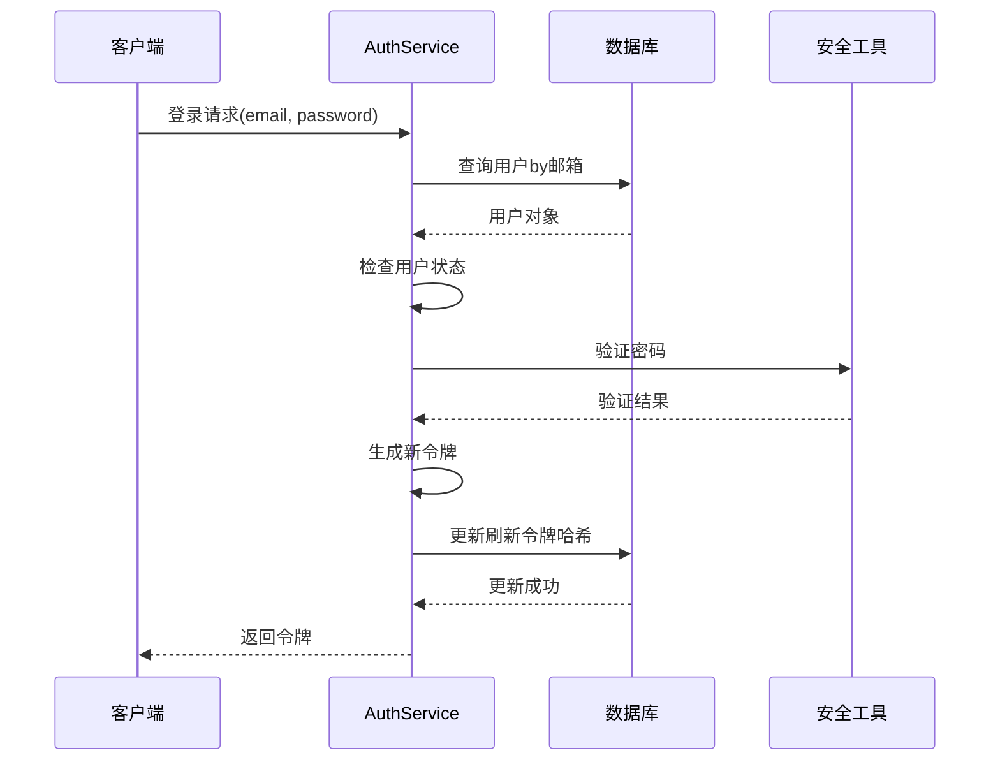
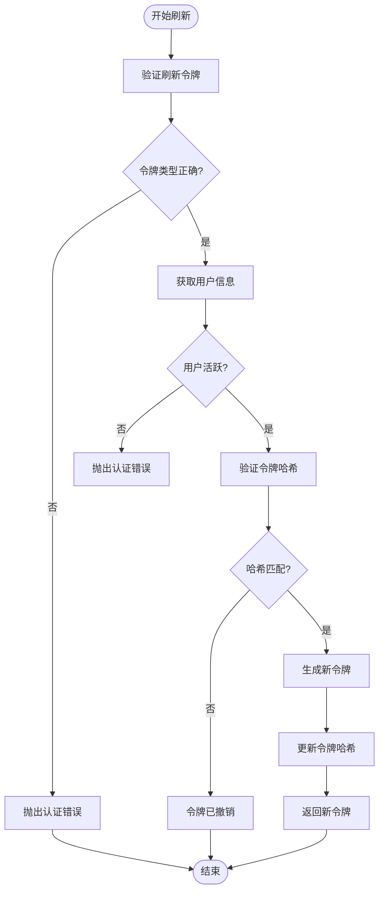
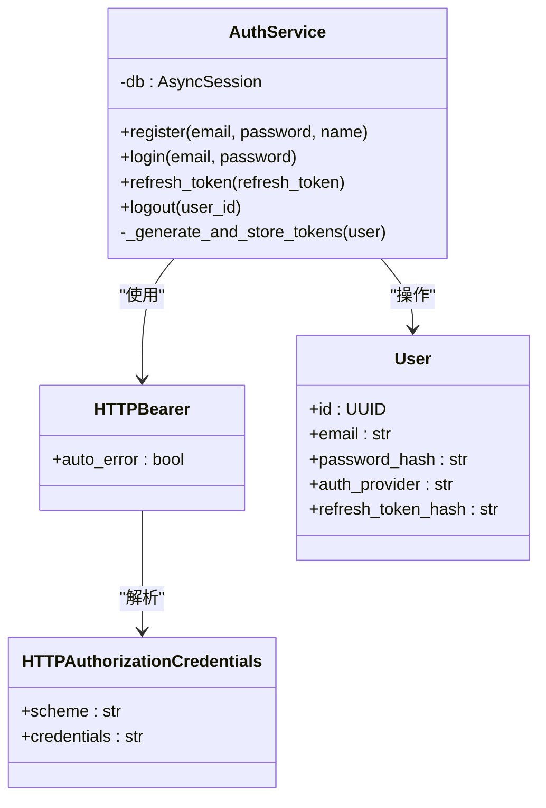
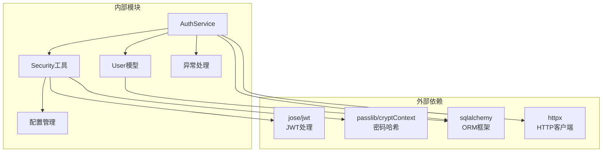

# 认证服务

<cite>
**本文档引用的文件**
- [auth_service.py](file://backend/app/services/auth_service.py)
- [auth.py](file://backend/app/routers/auth.py)
- [auth.py](file://backend/app/schemas/auth.py)
- [security.py](file://backend/app/utils/security.py)
- [user.py](file://backend/app/models/user.py)
- [exceptions.py](file://backend/app/utils/exceptions.py)
- [config.py](file://backend/app/config.py)
- [main.py](file://backend/app/main.py)
- [dependencies.py](file://backend/app/dependencies.py)
- [database.py](file://backend/app/database.py)
</cite>

## 目录
1. [简介](#简介)
2. [项目结构](#项目结构)
3. [核心组件](#核心组件)
4. [架构概览](#架构概览)
5. [详细组件分析](#详细组件分析)
6. [依赖分析](#依赖分析)
7. [性能考虑](#性能考虑)
8. [故障排除指南](#故障排除指南)
9. [结论](#结论)
10. [附录](#附录)

## 简介

认证服务是资产聚集应用的核心安全模块，负责用户身份验证、授权和会话管理。该服务实现了完整的JWT令牌生命周期管理，包括用户注册、登录、令牌刷新、注销和OAuth集成功能。

本服务采用现代安全实践，使用bcrypt进行密码哈希，JWT进行令牌管理，并通过细粒度的权限控制确保系统的安全性。服务设计遵循依赖注入原则，与数据库层、路由层和工具层清晰分离。

## 项目结构

认证服务在项目中的组织结构如下：

**图表来源**
- [auth_service.py:20-249](file://backend/app/services/auth_service.py#L20-L249)
- [auth.py:23-287](file://backend/app/routers/auth.py#L23-L287)
- [security.py:1-104](file://backend/app/utils/security.py#L1-L104)

**章节来源**
- [auth_service.py:1-249](file://backend/app/services/auth_service.py#L1-L249)
- [auth.py:1-287](file://backend/app/routers/auth.py#L1-L287)
- [config.py:1-51](file://backend/app/config.py#L1-L51)

## 核心组件

### AuthService 类

AuthService 是认证服务的核心类，提供了完整的用户认证功能：

#### 主要职责
- 用户注册和登录管理
- JWT令牌生成和验证
- 密码哈希和验证
- OAuth第三方认证集成
- 令牌轮换和撤销机制

#### 关键方法
- `register()`: 用户注册流程
- `login()`: 用户登录验证
- `refresh_token()`: 令牌刷新
- `logout()`: 用户登出
- `_generate_and_store_tokens()`: 令牌生成和存储

**章节来源**
- [auth_service.py:20-249](file://backend/app/services/auth_service.py#L20-L249)

### 安全工具模块

安全工具模块提供了底层的安全功能：

#### 密码安全管理
- 使用bcrypt进行密码哈希
- 安全的密码验证机制
- 配置化的哈希策略

#### JWT令牌管理
- 访问令牌生成（短期有效）
- 刷新令牌生成（长期有效）
- 令牌验证和解码
- 自定义过期时间配置

**章节来源**
- [security.py:18-59](file://backend/app/utils/security.py#L18-L59)
- [config.py:17-21](file://backend/app/config.py#L17-L21)

### 数据模型

用户模型定义了认证相关的数据结构：

#### 核心字段
- `email`: 唯一标识用户的邮箱地址
- `password_hash`: bcrypt哈希后的密码
- `auth_provider`: 认证提供商（email/google/apple）
- `refresh_token_hash`: 当前有效刷新令牌的哈希值
- `is_active`: 用户账户激活状态

**章节来源**
- [user.py:11-32](file://backend/app/models/user.py#L11-L32)

## 架构概览

认证服务采用分层架构设计，各层职责明确：

**图表来源**
- [auth.py:26-53](file://backend/app/routers/auth.py#L26-L53)
- [auth_service.py:26-65](file://backend/app/services/auth_service.py#L26-L65)
- [security.py:18-49](file://backend/app/utils/security.py#L18-L49)

## 详细组件分析

### 用户注册流程

用户注册是认证服务的基础功能，包含完整的安全检查和数据处理：

**图表来源**
- [auth_service.py:26-65](file://backend/app/services/auth_service.py#L26-L65)
- [security.py:18-49](file://backend/app/utils/security.py#L18-L49)

#### 注册流程特点
- 邮箱唯一性验证
- bcrypt密码哈希
- 双令牌生成（访问令牌+刷新令牌）
- 原子性数据库操作

**章节来源**
- [auth_service.py:26-65](file://backend/app/services/auth_service.py#L26-L65)

### 用户登录流程

用户登录验证了用户凭据的有效性并颁发新的令牌：

**图表来源**
- [auth_service.py:67-97](file://backend/app/services/auth_service.py#L67-L97)
- [security.py:23-25](file://backend/app/utils/security.py#L23-L25)

#### 登录安全特性
- 账户激活状态检查
- 密码哈希验证
- 令牌轮换机制
- 并发登录限制

**章节来源**
- [auth_service.py:67-97](file://backend/app/services/auth_service.py#L67-L97)

### 令牌刷新机制

令牌刷新实现了安全的令牌轮换，防止令牌泄露风险：

**图表来源**
- [auth_service.py:99-140](file://backend/app/services/auth_service.py#L99-L140)
- [security.py:52-58](file://backend/app/utils/security.py#L52-L58)

#### 刷新机制安全特性
- 双重验证（令牌签名+哈希）
- 令牌撤销检测
- 原子性更新操作
- 竞态条件防护

**章节来源**
- [auth_service.py:99-140](file://backend/app/services/auth_service.py#L99-L140)

### OAuth集成实现

认证服务支持Google和Apple OAuth认证，提供第三方登录能力：

#### Google OAuth流程
1. 验证Google ID令牌
2. 从Google端点获取用户信息
3. 创建或更新用户记录
4. 生成JWT令牌

#### Apple OAuth流程
1. 获取Apple公钥集合
2. 验证令牌签名
3. 解析JWT声明
4. 创建或更新用户记录

**章节来源**
- [auth.py:163-207](file://backend/app/routers/auth.py#L163-L207)
- [auth.py:210-286](file://backend/app/routers/auth.py#L210-L286)

### 依赖注入机制

认证服务采用依赖注入模式，确保模块间的松耦合：

**图表来源**
- [auth_service.py:23-24](file://backend/app/services/auth_service.py#L23-L24)
- [dependencies.py:15-15](file://backend/app/dependencies.py#L15-L15)
- [dependencies.py:18-56](file://backend/app/dependencies.py#L18-L56)

**章节来源**
- [dependencies.py:18-56](file://backend/app/dependencies.py#L18-L56)
- [auth_service.py:23-24](file://backend/app/services/auth_service.py#L23-L24)

## 依赖分析

认证服务的依赖关系清晰明确，遵循单一职责原则：

**图表来源**
- [auth_service.py:8-17](file://backend/app/services/auth_service.py#L8-L17)
- [security.py:9-15](file://backend/app/utils/security.py#L9-L15)
- [auth.py:1-21](file://backend/app/routers/auth.py#L1-L21)

### 关键依赖说明

#### 安全依赖
- **jose/jwt**: 提供JWT编码、解码和验证功能
- **passlib/cryptContext**: 实现bcrypt密码哈希
- **cryptography**: 提供加密功能（用于API密钥）

#### 数据访问依赖
- **sqlalchemy**: 异步ORM框架
- **asyncpg**: PostgreSQL异步驱动

#### HTTP客户端依赖
- **httpx**: 异步HTTP客户端，用于OAuth验证

**章节来源**
- [auth_service.py:8-17](file://backend/app/services/auth_service.py#L8-L17)
- [security.py:9-15](file://backend/app/utils/security.py#L9-L15)

## 性能考虑

### 令牌存储优化

当前实现使用单字段存储刷新令牌哈希，具有以下特点：
- **优点**: 存储开销小，查询速度快
- **限制**: 不支持多设备并行登录
- **建议**: 对于生产环境，建议使用独立表存储多个刷新令牌

### 缓存策略

安全工具模块实现了加密密钥的缓存机制：
- 避免重复的密钥派生计算
- 减少HKDF算法的重复执行
- 提升API密钥加密/解密性能

### 数据库连接管理

使用异步数据库连接池：
- 连接复用减少连接开销
- 异步操作提升并发性能
- 自动连接回收机制

## 故障排除指南

### 常见认证错误

#### 认证失败错误
- **错误码**: AUTHENTICATION_ERROR (401)
- **场景**: 无效凭据、过期令牌、禁用账户
- **解决方案**: 检查用户输入、重新登录、联系管理员

#### 验证错误
- **错误码**: VALIDATION_ERROR (404)
- **场景**: 重复邮箱注册、无效输入格式
- **解决方案**: 验证用户输入、检查唯一性约束

#### 内部服务器错误
- **错误码**: INTERNAL_ERROR (500)
- **场景**: 未处理的异常、数据库连接问题
- **解决方案**: 查看服务器日志、检查配置

**章节来源**
- [exceptions.py:21-54](file://backend/app/utils/exceptions.py#L21-L54)

### OAuth认证问题

#### Google OAuth错误
- **症状**: 令牌验证失败
- **原因**: 网络问题、Google服务不可用
- **解决**: 检查网络连接、重试请求

#### Apple OAuth错误
- **症状**: 公钥获取失败、令牌验证异常
- **原因**: Apple服务问题、配置错误
- **解决**: 检查Apple客户端ID配置、验证令牌签名

### 令牌管理问题

#### 令牌轮换冲突
- **症状**: 多设备登录时令牌频繁失效
- **原因**: 单刷新令牌设计限制
- **解决**: 实现多设备支持的刷新令牌表

#### 令牌撤销问题
- **症状**: 用户登出后仍可使用旧令牌
- **原因**: 刷新令牌哈希未正确更新
- **解决**: 确保登出操作正确清除令牌哈希

**章节来源**
- [auth_service.py:198-202](file://backend/app/services/auth_service.py#L198-L202)
- [auth.py:143-160](file://backend/app/routers/auth.py#L143-L160)

## 结论

认证服务实现了企业级的安全认证功能，具有以下优势：

### 安全特性
- 完整的JWT令牌生命周期管理
- bcrypt密码哈希保护
- OAuth第三方认证支持
- 细粒度的权限控制

### 架构优势
- 清晰的分层设计
- 依赖注入模式
- 异步数据库操作
- 模块化组件设计

### 改进建议
1. **多设备支持**: 实现独立的刷新令牌表
2. **令牌审计**: 添加令牌使用日志
3. **速率限制**: 实施登录尝试限制
4. **安全监控**: 添加异常行为检测

该认证服务为资产聚集应用提供了坚实的安全基础，支持未来功能扩展和安全增强。

## 附录

### 配置参数说明

| 参数名称 | 默认值 | 描述 |
|---------|--------|------|
| JWT_SECRET_KEY | 开发环境默认值 | JWT签名密钥 |
| JWT_ALGORITHM | HS256 | JWT算法 |
| ACCESS_TOKEN_EXPIRE_MINUTES | 30 | 访问令牌过期时间（分钟） |
| REFRESH_TOKEN_EXPIRE_DAYS | 7 | 刷新令牌过期时间（天） |
| ENCRYPTION_KEY | 开发环境默认值 | 加密密钥 |

### API端点概览

| 端点 | 方法 | 功能 | 需要认证 |
|------|------|------|----------|
| /auth/register | POST | 用户注册 | 否 |
| /auth/login | POST | 用户登录 | 否 |
| /auth/refresh | POST | 刷新令牌 | 否 |
| /auth/me | GET | 获取当前用户 | 是 |
| /auth/logout | POST | 用户登出 | 是 |
| /auth/logout-all | POST | 全部设备登出 | 是 |
| /auth/google | POST | Google OAuth | 否 |
| /auth/apple | POST | Apple OAuth | 否 |

### 最佳实践建议

1. **生产环境配置**
   - 设置强随机密钥
   - 启用HTTPS传输
   - 配置适当的CORS策略

2. **安全实施**
   - 定期轮换JWT密钥
   - 实施账户锁定机制
   - 监控异常登录活动

3. **性能优化**
   - 使用连接池管理数据库连接
   - 实施令牌缓存策略
   - 优化查询索引设计