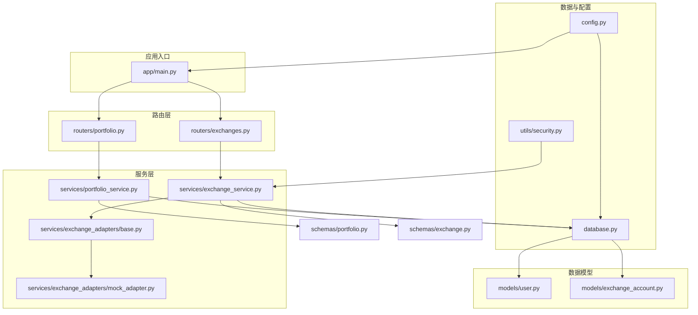
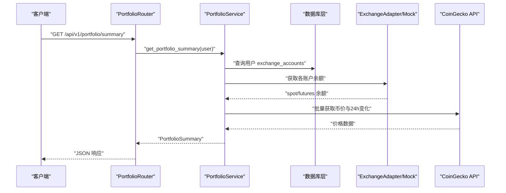
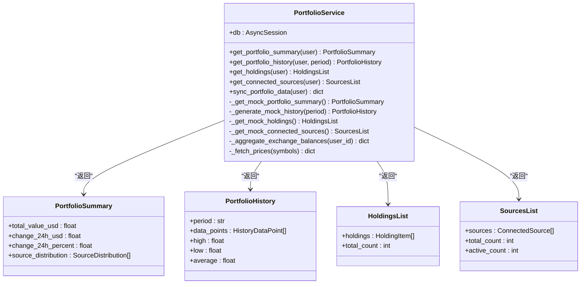
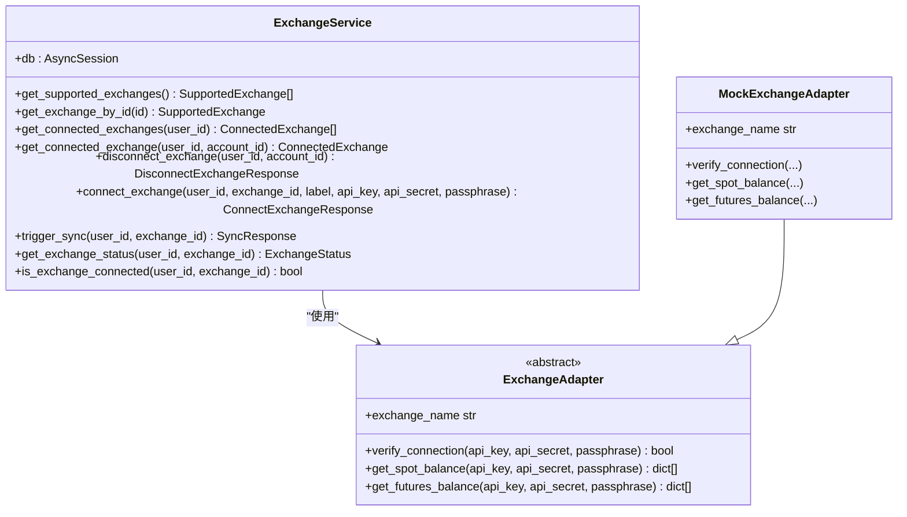
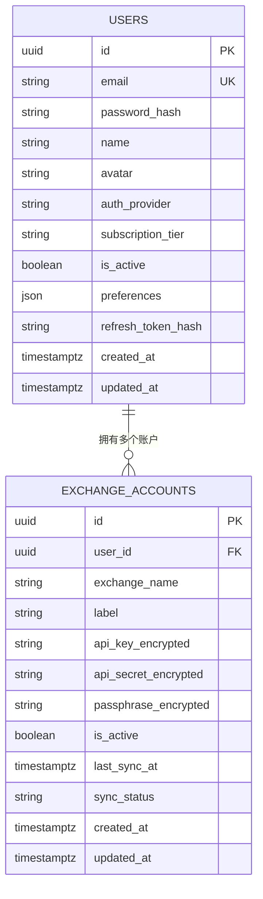
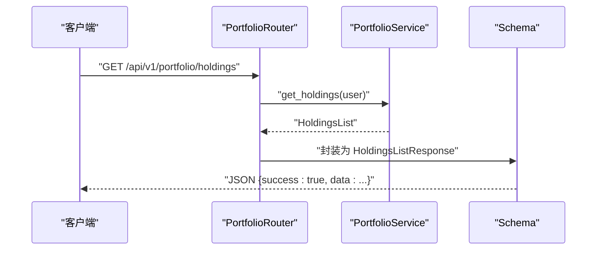
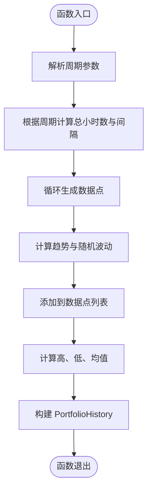
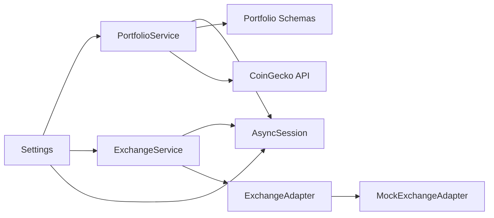

# 资产服务

<cite>
**本文引用的文件**
- [backend/app/services/portfolio_service.py](file://backend/app/services/portfolio_service.py)
- [backend/app/services/exchange_service.py](file://backend/app/services/exchange_service.py)
- [backend/app/services/exchange_adapters/base.py](file://backend/app/services/exchange_adapters/base.py)
- [backend/app/services/exchange_adapters/mock_adapter.py](file://backend/app/services/exchange_adapters/mock_adapter.py)
- [backend/app/models/exchange_account.py](file://backend/app/models/exchange_account.py)
- [backend/app/models/user.py](file://backend/app/models/user.py)
- [backend/app/routers/portfolio.py](file://backend/app/routers/portfolio.py)
- [backend/app/routers/exchanges.py](file://backend/app/routers/exchanges.py)
- [backend/app/schemas/portfolio.py](file://backend/app/schemas/portfolio.py)
- [backend/app/schemas/exchange.py](file://backend/app/schemas/exchange.py)
- [backend/app/database.py](file://backend/app/database.py)
- [backend/app/main.py](file://backend/app/main.py)
- [backend/app/config.py](file://backend/app/config.py)
- [backend/app/utils/security.py](file://backend/app/utils/security.py)
</cite>

## 目录
1. [简介](#简介)
2. [项目结构](#项目结构)
3. [核心组件](#核心组件)
4. [架构总览](#架构总览)
5. [详细组件分析](#详细组件分析)
6. [依赖分析](#依赖分析)
7. [性能考虑](#性能考虑)
8. [故障排查指南](#故障排查指南)
9. [结论](#结论)
10. [附录](#附录)

## 简介
本文件为“资产服务”的综合技术文档，聚焦 PortfolioService 类在资产聚合、持仓管理与历史数据处理方面的职责与实现思路。文档同时阐述了资产数据的组织结构、查询优化机制、与交易所服务及数据库层的数据流转，并给出性能优化最佳实践与故障排查建议。由于当前仓库中 PortfolioService 的核心方法仍以“预留实现”为主，本文在不泄露具体代码的前提下，基于现有结构与注释，提供可落地的实现蓝图与可视化图示，帮助开发者快速理解并扩展真实业务逻辑。

## 项目结构
后端采用 FastAPI + SQLAlchemy Async 的异步架构，按“路由-服务-模型-模式(schema)”分层组织。资产服务位于服务层，通过路由器暴露 REST 接口；数据持久化由数据库层负责；加密与安全工具用于凭证保护；配置模块集中管理运行参数。

图表来源
- [backend/app/main.py:1-131](file://backend/app/main.py#L1-L131)
- [backend/app/routers/portfolio.py:1-217](file://backend/app/routers/portfolio.py#L1-L217)
- [backend/app/routers/exchanges.py:1-227](file://backend/app/routers/exchanges.py#L1-L227)
- [backend/app/services/portfolio_service.py:1-317](file://backend/app/services/portfolio_service.py#L1-L317)
- [backend/app/services/exchange_service.py:1-414](file://backend/app/services/exchange_service.py#L1-L414)
- [backend/app/services/exchange_adapters/base.py:1-73](file://backend/app/services/exchange_adapters/base.py#L1-L73)
- [backend/app/services/exchange_adapters/mock_adapter.py:1-110](file://backend/app/services/exchange_adapters/mock_adapter.py#L1-L110)
- [backend/app/models/user.py:1-32](file://backend/app/models/user.py#L1-L32)
- [backend/app/models/exchange_account.py:1-32](file://backend/app/models/exchange_account.py#L1-L32)
- [backend/app/database.py:1-33](file://backend/app/database.py#L1-L33)
- [backend/app/config.py:1-51](file://backend/app/config.py#L1-L51)
- [backend/app/utils/security.py:1-104](file://backend/app/utils/security.py#L1-L104)

章节来源
- [backend/app/main.py:1-131](file://backend/app/main.py#L1-L131)
- [backend/app/routers/portfolio.py:1-217](file://backend/app/routers/portfolio.py#L1-L217)
- [backend/app/routers/exchanges.py:1-227](file://backend/app/routers/exchanges.py#L1-L227)

## 核心组件
- PortfolioService：负责资产概览、历史净值、持仓列表与已连接数据源的聚合与返回。当前以“预留实现”为主，包含完整的接口签名与数据结构定义，便于后续接入真实数据源与缓存策略。
- ExchangeService：负责交易所连接、断开、状态查询与手动同步等操作，使用适配器模式对接不同交易所。
- ExchangeAdapter 抽象与 Mock 实现：定义统一的适配器接口，当前使用 Mock 实现进行开发与测试。
- 数据模型：User 与 ExchangeAccount 提供用户与交易所账户的持久化结构。
- 路由器：PortfolioRouter 与 ExchangeRouter 将请求转发到对应服务层，并封装响应格式。
- 配置与安全：配置模块集中管理数据库、Redis、JWT、加密密钥与 CoinGecko API 地址；安全模块提供 API Key 加解密能力。

章节来源
- [backend/app/services/portfolio_service.py:31-317](file://backend/app/services/portfolio_service.py#L31-L317)
- [backend/app/services/exchange_service.py:26-414](file://backend/app/services/exchange_service.py#L26-L414)
- [backend/app/services/exchange_adapters/base.py:5-73](file://backend/app/services/exchange_adapters/base.py#L5-L73)
- [backend/app/services/exchange_adapters/mock_adapter.py:10-110](file://backend/app/services/exchange_adapters/mock_adapter.py#L10-L110)
- [backend/app/models/user.py:11-32](file://backend/app/models/user.py#L11-L32)
- [backend/app/models/exchange_account.py:11-32](file://backend/app/models/exchange_account.py#L11-L32)
- [backend/app/routers/portfolio.py:26-217](file://backend/app/routers/portfolio.py#L26-L217)
- [backend/app/routers/exchanges.py:22-227](file://backend/app/routers/exchanges.py#L22-L227)
- [backend/app/config.py:5-51](file://backend/app/config.py#L5-L51)
- [backend/app/utils/security.py:85-104](file://backend/app/utils/security.py#L85-L104)

## 架构总览
资产服务的整体数据流如下：
- 客户端通过 PortfolioRouter 发起请求，路由层注入数据库会话与当前用户，调用 PortfolioService。
- PortfolioService 在“预留实现”阶段返回 Mock 数据；未来将接入 ExchangeService 获取各账户余额，再调用外部价格接口（如 CoinGecko）获取实时价格，完成资产聚合与缓存。
- ExchangeService 负责管理用户与交易所的连接状态、验证凭据、触发同步与更新状态。
- 数据模型与数据库层负责持久化用户与账户信息，支持异步会话与关系映射。

图表来源
- [backend/app/routers/portfolio.py:33-59](file://backend/app/routers/portfolio.py#L33-L59)
- [backend/app/services/portfolio_service.py:41-52](file://backend/app/services/portfolio_service.py#L41-L52)
- [backend/app/services/exchange_service.py:231-301](file://backend/app/services/exchange_service.py#L231-L301)
- [backend/app/services/exchange_adapters/mock_adapter.py:21-41](file://backend/app/services/exchange_adapters/mock_adapter.py#L21-L41)
- [backend/app/config.py:29-31](file://backend/app/config.py#L29-L31)

## 详细组件分析

### PortfolioService 组件分析
PortfolioService 是资产服务的核心，负责三大领域：
- 资产概览：返回总资产、24h 涨跌额与来源分布。
- 历史净值：按周期生成历史净值曲线与统计指标。
- 持仓列表：按币种聚合，返回数量、价格、市值与占比。
- 已连接数据源：返回用户已连接的交易所与钱包状态。

图表来源
- [backend/app/services/portfolio_service.py:31-317](file://backend/app/services/portfolio_service.py#L31-L317)
- [backend/app/schemas/portfolio.py:29-41](file://backend/app/schemas/portfolio.py#L29-L41)
- [backend/app/schemas/portfolio.py:56-68](file://backend/app/schemas/portfolio.py#L56-L68)
- [backend/app/schemas/portfolio.py:89-95](file://backend/app/schemas/portfolio.py#L89-L95)
- [backend/app/schemas/portfolio.py:116-123](file://backend/app/schemas/portfolio.py#L116-L123)

章节来源
- [backend/app/services/portfolio_service.py:31-317](file://backend/app/services/portfolio_service.py#L31-L317)
- [backend/app/schemas/portfolio.py:1-152](file://backend/app/schemas/portfolio.py#L1-L152)

### ExchangeService 与适配器
ExchangeService 提供交易所连接、断开、状态查询与手动同步等能力；通过适配器模式对接不同交易所，当前使用 Mock 实现。

图表来源
- [backend/app/services/exchange_service.py:26-414](file://backend/app/services/exchange_service.py#L26-L414)
- [backend/app/services/exchange_adapters/base.py:5-73](file://backend/app/services/exchange_adapters/base.py#L5-L73)
- [backend/app/services/exchange_adapters/mock_adapter.py:10-110](file://backend/app/services/exchange_adapters/mock_adapter.py#L10-L110)

章节来源
- [backend/app/services/exchange_service.py:26-414](file://backend/app/services/exchange_service.py#L26-L414)
- [backend/app/services/exchange_adapters/base.py:5-73](file://backend/app/services/exchange_adapters/base.py#L5-L73)
- [backend/app/services/exchange_adapters/mock_adapter.py:10-110](file://backend/app/services/exchange_adapters/mock_adapter.py#L10-L110)

### 数据模型与关系
用户与交易所账户之间存在一对多关系，ExchangeAccount 通过外键关联 User。

图表来源
- [backend/app/models/user.py:11-32](file://backend/app/models/user.py#L11-L32)
- [backend/app/models/exchange_account.py:11-32](file://backend/app/models/exchange_account.py#L11-L32)

章节来源
- [backend/app/models/user.py:11-32](file://backend/app/models/user.py#L11-L32)
- [backend/app/models/exchange_account.py:11-32](file://backend/app/models/exchange_account.py#L11-L32)

### API 流程与数据结构
- 路由层将请求参数解析并注入服务层；服务层返回标准化的响应包装对象。
- PortfolioRouter 提供资产概览、历史净值、持仓列表与已连接数据源四个端点。
- Schema 层定义了 PortfolioSummary、PortfolioHistory、HoldingsList、SourcesList 及其响应包装。

图表来源
- [backend/app/routers/portfolio.py:107-138](file://backend/app/routers/portfolio.py#L107-L138)
- [backend/app/services/portfolio_service.py:146-202](file://backend/app/services/portfolio_service.py#L146-L202)
- [backend/app/schemas/portfolio.py:142-146](file://backend/app/schemas/portfolio.py#L142-L146)

章节来源
- [backend/app/routers/portfolio.py:1-217](file://backend/app/routers/portfolio.py#L1-L217)
- [backend/app/schemas/portfolio.py:1-152](file://backend/app/schemas/portfolio.py#L1-L152)

### 历史数据生成流程（Mock）
PortfolioService 的历史净值生成采用基于时间周期的模拟算法，包含趋势与随机波动，最终计算高、低、均值。

图表来源
- [backend/app/services/portfolio_service.py:71-140](file://backend/app/services/portfolio_service.py#L71-L140)

章节来源
- [backend/app/services/portfolio_service.py:71-140](file://backend/app/services/portfolio_service.py#L71-L140)

## 依赖分析
- 组件耦合与内聚
  - PortfolioService 对数据库会话与 Schema 有直接依赖，但对外部价格接口与交易所适配器采用预留接口，降低耦合度。
  - ExchangeService 与适配器通过抽象接口解耦，便于替换具体实现。
- 外部依赖
  - CoinGecko API：用于获取实时价格与24h涨跌幅。
  - Redis：用于价格缓存与会话缓存（配置中已提供地址）。
  - PostgreSQL：异步 ORM 存储用户与账户信息。
- 循环依赖
  - 当前未发现循环导入；服务层与路由层通过依赖注入解耦。

图表来源
- [backend/app/services/portfolio_service.py:18-28](file://backend/app/services/portfolio_service.py#L18-L28)
- [backend/app/services/exchange_service.py:8-23](file://backend/app/services/exchange_service.py#L8-L23)
- [backend/app/config.py:5-31](file://backend/app/config.py#L5-L31)
- [backend/app/database.py:1-20](file://backend/app/database.py#L1-L20)

章节来源
- [backend/app/services/portfolio_service.py:18-28](file://backend/app/services/portfolio_service.py#L18-L28)
- [backend/app/services/exchange_service.py:8-23](file://backend/app/services/exchange_service.py#L8-L23)
- [backend/app/config.py:5-31](file://backend/app/config.py#L5-L31)
- [backend/app/database.py:1-20](file://backend/app/database.py#L1-L20)

## 性能考虑
- 缓存策略
  - 价格缓存：使用 Redis 缓存币价与24h变化，设置合理过期时间（如 5 分钟），减少对外部 API 的频繁调用。
  - 历史数据缓存：对常用周期的历史净值结果进行缓存，热点数据可驻留内存。
- 批量查询与去重
  - 聚合交易所余额时，先按币种去重，再一次性查询价格，避免重复请求。
- 异步与并发
  - 使用 SQLAlchemy AsyncSession 与异步适配器，提升 I/O 并发吞吐。
- 数据库索引
  - 在 ExchangeAccount 上为 user_id、exchange_name、is_active 建立复合索引，加速查询。
- 响应压缩与限流
  - 开启 Gzip 压缩与速率限制，防止突发流量冲击。

## 故障排查指南
- 连接失败
  - 检查 ExchangeService 的凭据校验是否通过；确认加密密钥与适配器实现正确。
- 数据为空
  - 确认用户已连接有效账户且同步状态为成功；检查数据库中 is_active 与 sync_status 字段。
- 价格异常
  - 核对 CoinGecko API 可用性与网络连通性；检查缓存键与过期时间。
- 响应错误
  - 查看全局异常处理器返回的错误码与消息，定位具体问题。

章节来源
- [backend/app/services/exchange_service.py:231-301](file://backend/app/services/exchange_service.py#L231-L301)
- [backend/app/utils/security.py:85-104](file://backend/app/utils/security.py#L85-L104)
- [backend/app/main.py:65-91](file://backend/app/main.py#L65-L91)

## 结论
PortfolioService 当前以“预留实现”形式提供清晰的接口与数据结构，为后续接入真实交易所余额与价格数据奠定基础。通过适配器模式与异步数据库访问，系统具备良好的扩展性与性能潜力。建议优先实现以下内容：
- 实现 _aggregate_exchange_balances 与 _fetch_prices 的真实逻辑。
- 集成 CoinGecko API 与 Redis 缓存。
- 完善历史净值的数据库存储与查询优化。
- 增强错误处理与监控埋点，确保生产可用性。

## 附录
- 代码示例路径（仅提供路径，不展示具体代码）
  - 资产概览：[backend/app/services/portfolio_service.py:41-52](file://backend/app/services/portfolio_service.py#L41-L52)
  - 历史净值：[backend/app/services/portfolio_service.py:71-140](file://backend/app/services/portfolio_service.py#L71-L140)
  - 持仓列表：[backend/app/services/portfolio_service.py:146-202](file://backend/app/services/portfolio_service.py#L146-L202)
  - 已连接数据源：[backend/app/services/portfolio_service.py:208-264](file://backend/app/services/portfolio_service.py#L208-L264)
  - 交易所连接与断开：[backend/app/services/exchange_service.py:231-301](file://backend/app/services/exchange_service.py#L231-L301)
  - 适配器工厂与 Mock 实现：[backend/app/services/exchange_adapters/mock_adapter.py:96-110](file://backend/app/services/exchange_adapters/mock_adapter.py#L96-L110)
  - 数据模型关系：[backend/app/models/user.py:28](file://backend/app/models/user.py#L28), [backend/app/models/exchange_account.py:28](file://backend/app/models/exchange_account.py#L28)
  - 路由与响应封装：[backend/app/routers/portfolio.py:33-176](file://backend/app/routers/portfolio.py#L33-L176), [backend/app/schemas/portfolio.py:130-152](file://backend/app/schemas/portfolio.py#L130-L152)