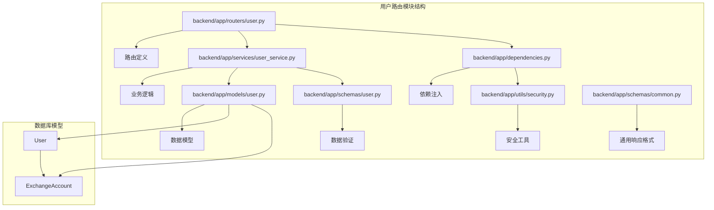
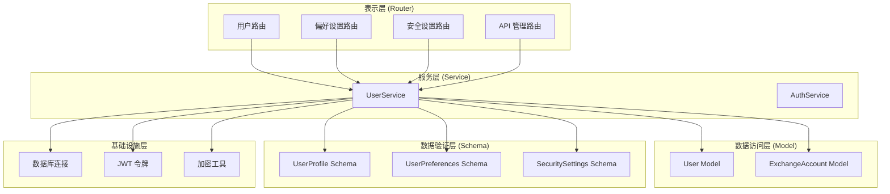
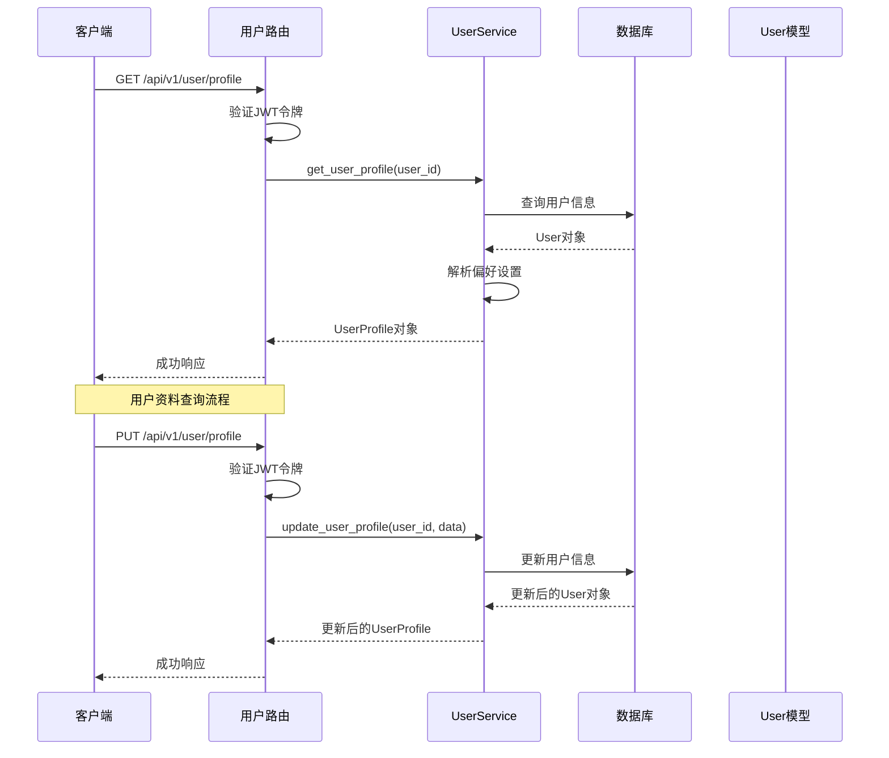
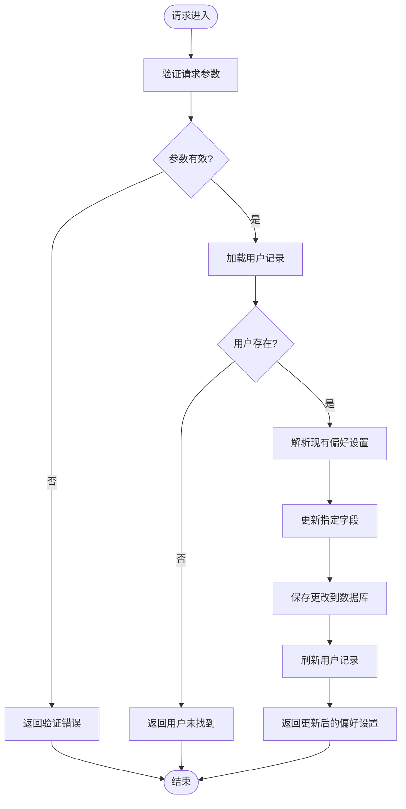
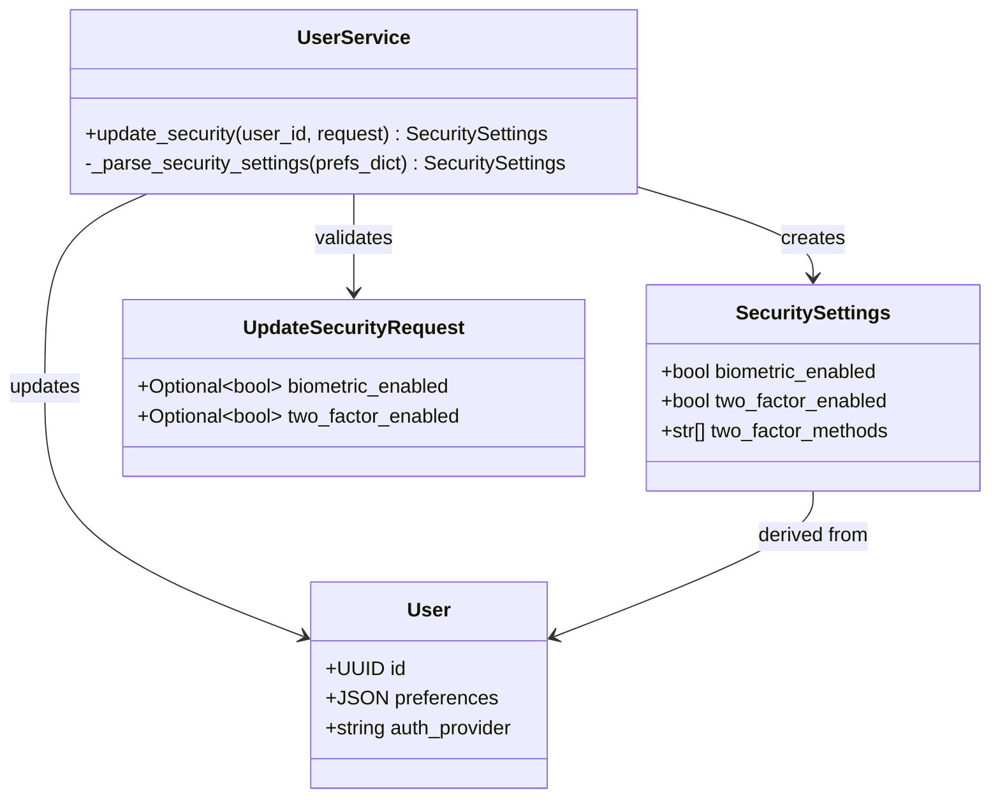
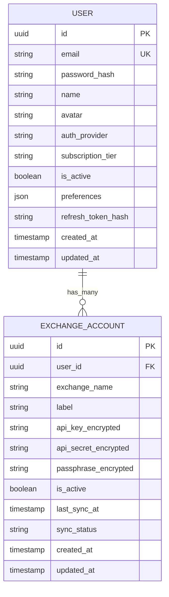
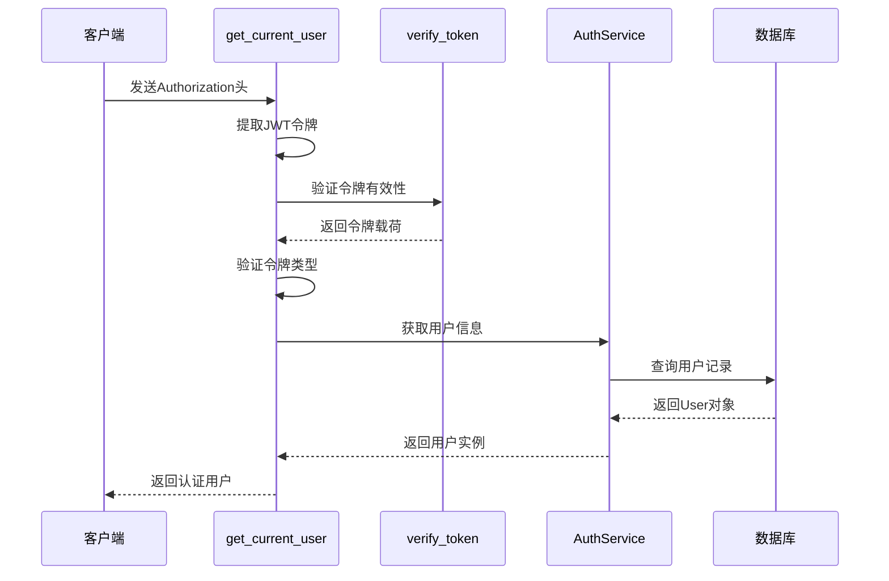
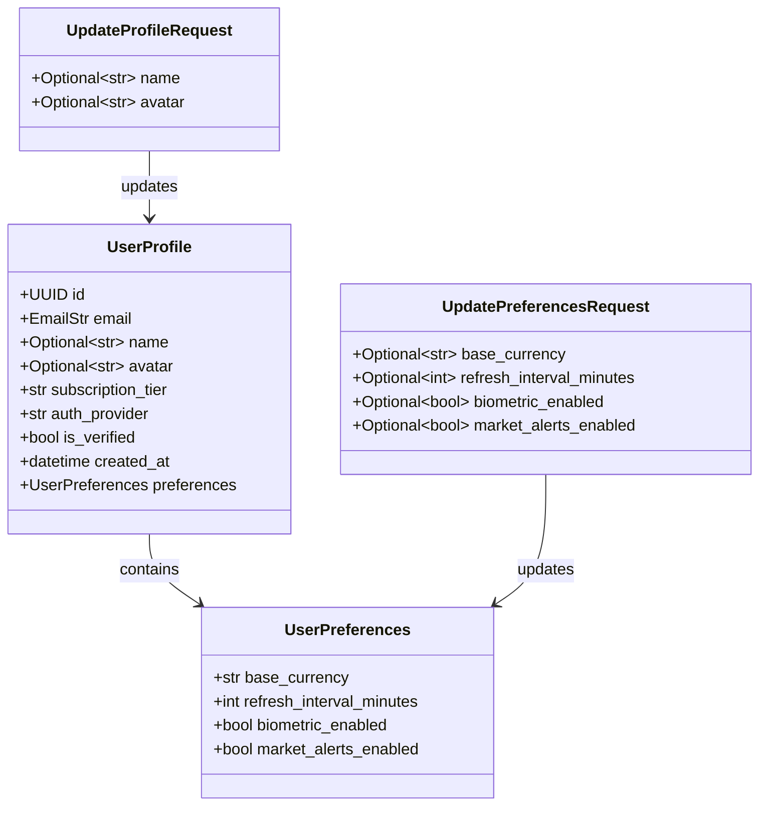
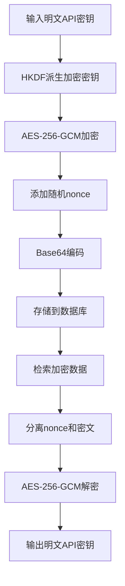
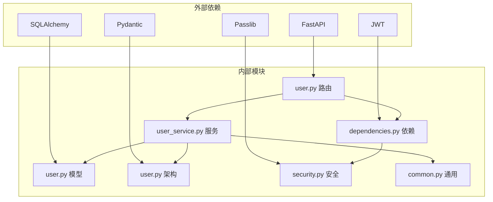

# 用户路由模块

<cite>
**本文档引用的文件**
- [backend/app/routers/user.py](file://backend/app/routers/user.py)
- [backend/app/models/user.py](file://backend/app/models/user.py)
- [backend/app/schemas/user.py](file://backend/app/schemas/user.py)
- [backend/app/services/user_service.py](file://backend/app/services/user_service.py)
- [backend/app/dependencies.py](file://backend/app/dependencies.py)
- [backend/app/utils/security.py](file://backend/app/utils/security.py)
- [backend/app/schemas/common.py](file://backend/app/schemas/common.py)
- [backend/app/models/exchange_account.py](file://backend/app/models/exchange_account.py)
- [backend/app/main.py](file://backend/app/main.py)
- [backend/app/config.py](file://backend/app/config.py)
- [backend/app/utils/exceptions.py](file://backend/app/utils/exceptions.py)
</cite>

## 目录
1. [简介](#简介)
2. [项目结构](#项目结构)
3. [核心组件](#核心组件)
4. [架构概览](#架构概览)
5. [详细组件分析](#详细组件分析)
6. [依赖关系分析](#依赖关系分析)
7. [性能考虑](#性能考虑)
8. [故障排除指南](#故障排除指南)
9. [结论](#结论)

## 简介

用户路由模块是 CryptoFolio 应用程序的核心功能模块之一，负责处理用户信息管理相关的所有路由操作。该模块实现了完整的用户资料查询、更新和个人设置管理功能，为用户提供了一个安全、可靠的个人账户管理界面。

该模块基于 FastAPI 构建，采用异步编程模式，支持完整的 CRUD 操作（创建、读取、更新、删除）。系统集成了 JWT 认证机制、数据验证、错误处理和安全存储等功能，确保用户数据的安全性和完整性。

## 项目结构

用户路由模块在项目中的组织结构如下：

**图表来源**
- [backend/app/routers/user.py:1-280](file://backend/app/routers/user.py#L1-L280)
- [backend/app/services/user_service.py:1-223](file://backend/app/services/user_service.py#L1-L223)
- [backend/app/models/user.py:1-32](file://backend/app/models/user.py#L1-L32)

**章节来源**
- [backend/app/routers/user.py:1-280](file://backend/app/routers/user.py#L1-L280)
- [backend/app/main.py:94-100](file://backend/app/main.py#L94-L100)

## 核心组件

用户路由模块包含以下核心组件：

### 路由器组件
- **用户资料路由**：处理用户基本信息的查询和更新
- **偏好设置路由**：管理用户个性化设置
- **安全设置路由**：处理认证和安全相关配置
- **API 管理路由**：管理第三方交易所 API 连接

### 数据模型组件
- **User 模型**：用户主数据模型
- **ExchangeAccount 模型**：交易所账户关联模型
- **用户偏好设置模型**：JSON 格式的用户配置
- **安全设置模型**：认证和安全配置

### 服务组件
- **UserService**：用户业务逻辑处理
- **AuthService**：认证服务支持
- **安全工具**：JWT 令牌管理和 API 密钥加密

**章节来源**
- [backend/app/routers/user.py:19-280](file://backend/app/routers/user.py#L19-L280)
- [backend/app/models/user.py:11-32](file://backend/app/models/user.py#L11-L32)
- [backend/app/services/user_service.py:19-223](file://backend/app/services/user_service.py#L19-L223)

## 架构概览

用户路由模块采用分层架构设计，确保关注点分离和代码可维护性：

**图表来源**
- [backend/app/routers/user.py:24-280](file://backend/app/routers/user.py#L24-L280)
- [backend/app/services/user_service.py:22-223](file://backend/app/services/user_service.py#L22-L223)
- [backend/app/models/user.py:11-32](file://backend/app/models/user.py#L11-L32)

## 详细组件分析

### 用户路由实现

用户路由模块提供了完整的用户信息管理功能，包含以下主要路由：

#### 用户资料管理

用户资料路由负责处理用户基本信息的查询和更新操作：

**图表来源**
- [backend/app/routers/user.py:24-70](file://backend/app/routers/user.py#L24-L70)
- [backend/app/services/user_service.py:32-95](file://backend/app/services/user_service.py#L32-L95)

#### 偏好设置管理

偏好设置路由允许用户自定义应用行为和显示选项：

**图表来源**
- [backend/app/routers/user.py:75-121](file://backend/app/routers/user.py#L75-L121)
- [backend/app/services/user_service.py:97-138](file://backend/app/services/user_service.py#L97-L138)

#### 安全设置管理

安全设置路由处理认证和安全相关的配置选项：

**图表来源**
- [backend/app/schemas/user.py:30-43](file://backend/app/schemas/user.py#L30-L43)
- [backend/app/services/user_service.py:140-177](file://backend/app/services/user_service.py#L140-L177)

**章节来源**
- [backend/app/routers/user.py:24-177](file://backend/app/routers/user.py#L24-L177)
- [backend/app/schemas/user.py:10-43](file://backend/app/schemas/user.py#L10-L43)
- [backend/app/services/user_service.py:32-177](file://backend/app/services/user_service.py#L32-L177)

### 数据模型分析

用户数据模型采用 SQLAlchemy ORM 设计，支持灵活的数据存储和查询：

#### User 模型字段定义

| 字段名 | 类型 | 约束 | 描述 | 默认值 |
|--------|------|------|------|--------|
| id | UUID | 主键 | 用户唯一标识符 | 自动生成 |
| email | String(255) | 唯一、非空 | 用户邮箱地址 | 必填 |
| password_hash | String(255) | 可为空 | 密码哈希值 | null |
| name | String(100) | 可为空 | 用户姓名 | null |
| avatar | String(500) | 可为空 | 头像URL | null |
| auth_provider | String(50) | 默认值 | 认证提供商 | "email" |
| subscription_tier | String(50) | 默认值 | 订阅等级 | "free" |
| is_active | Boolean | 默认值 | 账户激活状态 | true |
| preferences | JSON | 默认值 | 用户偏好设置 | {} |
| refresh_token_hash | String(255) | 可为空 | 刷新令牌哈希 | null |
| created_at | DateTime | 自动设置 | 创建时间 | 当前时间 |
| updated_at | DateTime | 自动更新 | 更新时间 | 当前时间 |

#### ExchangeAccount 模型关联

**图表来源**
- [backend/app/models/user.py:14-28](file://backend/app/models/user.py#L14-L28)
- [backend/app/models/exchange_account.py:14-28](file://backend/app/models/exchange_account.py#L14-L28)

**章节来源**
- [backend/app/models/user.py:11-32](file://backend/app/models/user.py#L11-L32)
- [backend/app/models/exchange_account.py:11-32](file://backend/app/models/exchange_account.py#L11-L32)

### 权限控制机制

用户路由模块实现了严格的权限控制机制：

#### JWT 令牌验证

**图表来源**
- [backend/app/dependencies.py:18-56](file://backend/app/dependencies.py#L18-L56)
- [backend/app/utils/security.py:52-58](file://backend/app/utils/security.py#L52-L58)

#### 访问控制策略

- **必需认证**：所有用户路由都需要有效的 JWT 令牌
- **用户隔离**：每个用户只能访问自己的数据
- **令牌类型检查**：确保使用的是访问令牌而非刷新令牌
- **账户状态验证**：禁用的账户无法进行任何操作

**章节来源**
- [backend/app/dependencies.py:18-56](file://backend/app/dependencies.py#L18-L56)
- [backend/app/utils/security.py:28-49](file://backend/app/utils/security.py#L28-L49)

### 数据验证和安全

#### Pydantic 数据验证

用户路由模块使用 Pydantic 模型进行严格的数据验证：

**图表来源**
- [backend/app/schemas/user.py:47-66](file://backend/app/schemas/user.py#L47-L66)
- [backend/app/schemas/user.py:10-26](file://backend/app/schemas/user.py#L10-L26)

#### API 密钥安全存储

系统采用高级加密标准 (AES-256-GCM) 对敏感 API 密钥进行加密存储：

**图表来源**
- [backend/app/utils/security.py:85-103](file://backend/app/utils/security.py#L85-L103)

**章节来源**
- [backend/app/schemas/user.py:10-66](file://backend/app/schemas/user.py#L10-L66)
- [backend/app/utils/security.py:85-103](file://backend/app/utils/security.py#L85-L103)

## 依赖关系分析

用户路由模块的依赖关系清晰明确，遵循依赖倒置原则：

**图表来源**
- [backend/app/routers/user.py:1-17](file://backend/app/routers/user.py#L1-L17)
- [backend/app/services/user_service.py:4-16](file://backend/app/services/user_service.py#L4-L16)

### 关键依赖关系

- **路由依赖服务**：所有路由都依赖 UserService 进行业务逻辑处理
- **服务依赖模型**：UserService 依赖 SQLAlchemy 模型进行数据持久化
- **依赖注入**：通过 FastAPI 的依赖注入系统管理认证和数据库连接
- **安全工具**：JWT 令牌验证和 API 密钥加密功能独立封装

**章节来源**
- [backend/app/routers/user.py:1-17](file://backend/app/routers/user.py#L1-L17)
- [backend/app/services/user_service.py:4-23](file://backend/app/services/user_service.py#L4-L23)

## 性能考虑

用户路由模块在设计时充分考虑了性能优化：

### 异步数据库操作
- 使用 SQLAlchemy AsyncSession 进行异步数据库操作
- 减少数据库连接等待时间
- 支持高并发用户请求处理

### 缓存策略
- JWT 令牌验证结果可缓存
- 用户偏好设置按需加载
- API 密钥加密密钥进行模块级缓存

### 内存优化
- 使用 Pydantic 模型进行高效数据序列化
- JSON 格式偏好设置减少数据库查询次数
- 按需更新策略避免不必要的数据库写入

## 故障排除指南

### 常见问题及解决方案

#### 认证失败
**症状**：401 未授权错误
**原因**：
- 无效或过期的 JWT 令牌
- 错误的认证头格式
- 使用了刷新令牌而非访问令牌

**解决方法**：
1. 检查 Authorization 头格式：`Bearer <token>`
2. 重新登录获取新的访问令牌
3. 确保使用正确的令牌类型

#### 用户未找到
**症状**：404 用户不存在
**原因**：
- 用户ID无效或不存在
- 数据库连接问题
- 令牌对应的用户被删除

**解决方法**：
1. 验证用户ID格式
2. 检查数据库连接状态
3. 确认用户账户状态

#### 数据验证错误
**症状**：422 参数验证失败
**原因**：
- 字段长度超出限制
- 数据类型不匹配
- 必填字段缺失

**解决方法**：
1. 检查请求体格式
2. 验证字段约束条件
3. 参考相应模型的字段定义

**章节来源**
- [backend/app/utils/exceptions.py:21-66](file://backend/app/utils/exceptions.py#L21-L66)
- [backend/app/dependencies.py:29-56](file://backend/app/dependencies.py#L29-L56)

## 结论

用户路由模块是一个设计精良、功能完整的用户信息管理解决方案。它采用了现代的异步编程技术、严格的权限控制机制和全面的数据验证体系，为用户提供了安全可靠的服务体验。

### 主要优势

1. **安全性**：完整的 JWT 认证、API 密钥加密和权限控制
2. **可扩展性**：清晰的分层架构和依赖注入设计
3. **易用性**：标准化的 API 接口和一致的响应格式
4. **可靠性**：完善的错误处理和异常管理机制

### 最佳实践建议

1. **使用标准 API**：优先使用 `/api/v1/user/profile` 等新端点
2. **参数验证**：始终验证用户输入参数的有效性
3. **错误处理**：妥善处理各种异常情况
4. **安全存储**：敏感数据必须进行加密存储
5. **性能优化**：合理使用缓存和异步操作

该模块为 CryptoFolio 应用程序的用户管理功能奠定了坚实的基础，为后续的功能扩展提供了良好的架构支撑。