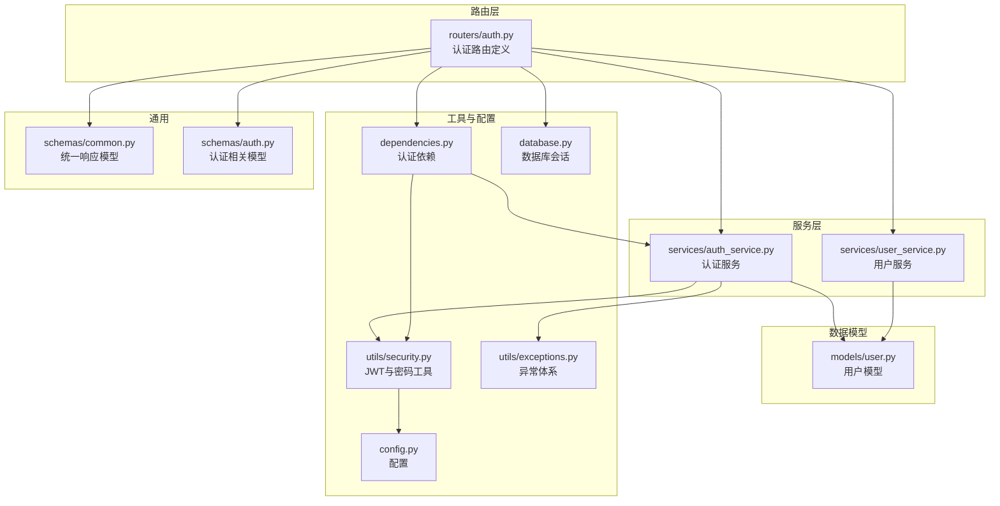
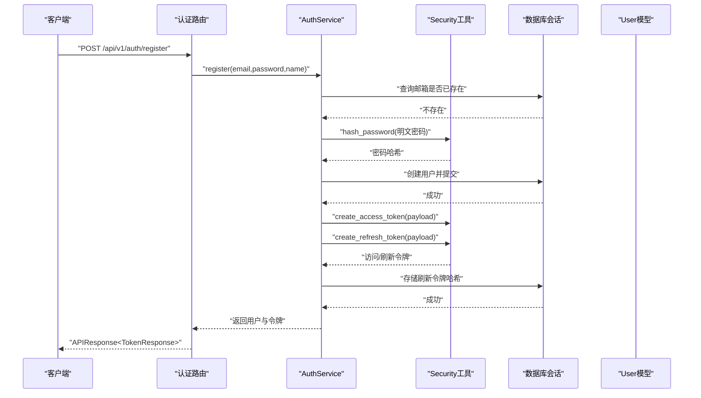
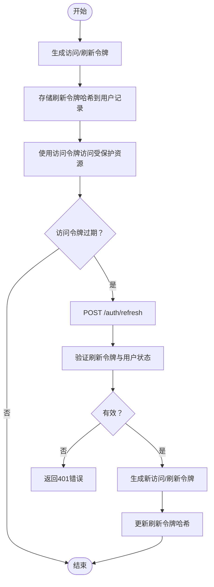
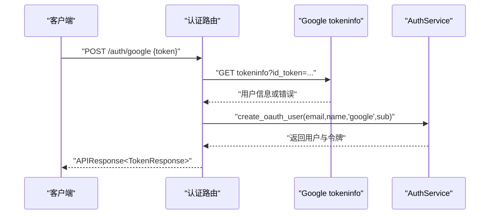
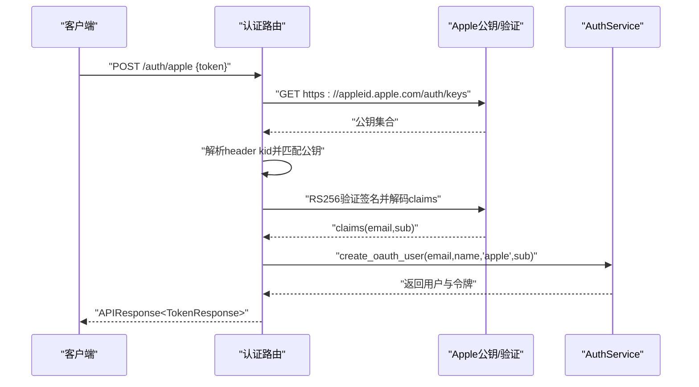
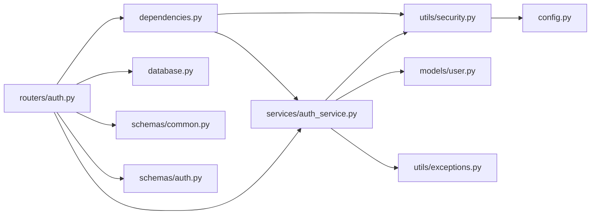

# 认证路由模块

<cite>
**本文档引用的文件**
- [backend/app/routers/auth.py](file://backend/app/routers/auth.py)
- [backend/app/schemas/auth.py](file://backend/app/schemas/auth.py)
- [backend/app/services/auth_service.py](file://backend/app/services/auth_service.py)
- [backend/app/utils/security.py](file://backend/app/utils/security.py)
- [backend/app/models/user.py](file://backend/app/models/user.py)
- [backend/app/dependencies.py](file://backend/app/dependencies.py)
- [backend/app/config.py](file://backend/app/config.py)
- [backend/app/schemas/common.py](file://backend/app/schemas/common.py)
- [backend/app/utils/exceptions.py](file://backend/app/utils/exceptions.py)
- [backend/app/database.py](file://backend/app/database.py)
- [backend/app/main.py](file://backend/app/main.py)
</cite>

## 目录
1. [简介](#简介)
2. [项目结构](#项目结构)
3. [核心组件](#核心组件)
4. [架构总览](#架构总览)
5. [详细组件分析](#详细组件分析)
6. [依赖关系分析](#依赖关系分析)
7. [性能考量](#性能考量)
8. [故障排查指南](#故障排查指南)
9. [结论](#结论)
10. [附录](#附录)

## 简介
本文件系统性梳理认证路由模块的设计与实现，覆盖用户注册、登录、令牌刷新、OAuth（Google/Apple）集成、用户信息查询与登出等完整认证流程。文档重点阐述：
- 路由端点功能、请求参数校验、响应模型与错误处理
- JWT访问令牌与刷新令牌的生成、验证与刷新机制
- Google与Apple OAuth的集成实现与令牌验证策略
- 认证中间件的使用方式与安全注意事项
- 实际API调用示例与最佳实践建议

## 项目结构
认证模块位于后端应用的路由层，围绕FastAPI路由定义、Pydantic数据模型、服务层业务逻辑、安全工具与异常体系协同工作，并通过依赖注入与数据库会话进行持久化。

图表来源
- [backend/app/routers/auth.py:1-287](file://backend/app/routers/auth.py#L1-L287)
- [backend/app/services/auth_service.py:1-249](file://backend/app/services/auth_service.py#L1-L249)
- [backend/app/models/user.py:1-32](file://backend/app/models/user.py#L1-L32)
- [backend/app/utils/security.py:1-104](file://backend/app/utils/security.py#L1-L104)
- [backend/app/dependencies.py:1-74](file://backend/app/dependencies.py#L1-L74)
- [backend/app/utils/exceptions.py:1-67](file://backend/app/utils/exceptions.py#L1-L67)
- [backend/app/config.py:1-51](file://backend/app/config.py#L1-L51)
- [backend/app/database.py:1-33](file://backend/app/database.py#L1-L33)
- [backend/app/schemas/common.py:1-25](file://backend/app/schemas/common.py#L1-L25)
- [backend/app/schemas/auth.py:1-43](file://backend/app/schemas/auth.py#L1-L43)

章节来源
- [backend/app/routers/auth.py:1-287](file://backend/app/routers/auth.py#L1-L287)
- [backend/app/schemas/auth.py:1-43](file://backend/app/schemas/auth.py#L1-L43)
- [backend/app/schemas/common.py:1-25](file://backend/app/schemas/common.py#L1-L25)
- [backend/app/services/auth_service.py:1-249](file://backend/app/services/auth_service.py#L1-L249)
- [backend/app/utils/security.py:1-104](file://backend/app/utils/security.py#L1-L104)
- [backend/app/models/user.py:1-32](file://backend/app/models/user.py#L1-L32)
- [backend/app/dependencies.py:1-74](file://backend/app/dependencies.py#L1-L74)
- [backend/app/config.py:1-51](file://backend/app/config.py#L1-L51)
- [backend/app/database.py:1-33](file://backend/app/database.py#L1-L33)

## 核心组件
- 路由器：定义认证相关端点，负责请求分发与响应封装
- 认证服务：实现注册、登录、令牌刷新、OAuth用户创建与登出逻辑
- 安全工具：提供JWT生成/验证、密码哈希与校验、加密工具
- 数据模型：用户实体及字段约束（邮箱唯一、OAuth标识、刷新令牌哈希等）
- 认证依赖：从Authorization头解析JWT，校验类型与有效性，返回当前用户
- 异常体系：统一的认证、校验与未处理异常处理
- 配置：JWT密钥、算法、过期时间、加密密钥等运行时参数

章节来源
- [backend/app/routers/auth.py:23-287](file://backend/app/routers/auth.py#L23-L287)
- [backend/app/services/auth_service.py:20-249](file://backend/app/services/auth_service.py#L20-L249)
- [backend/app/utils/security.py:18-59](file://backend/app/utils/security.py#L18-L59)
- [backend/app/models/user.py:11-32](file://backend/app/models/user.py#L11-L32)
- [backend/app/dependencies.py:18-74](file://backend/app/dependencies.py#L18-L74)
- [backend/app/utils/exceptions.py:4-67](file://backend/app/utils/exceptions.py#L4-L67)
- [backend/app/config.py:17-24](file://backend/app/config.py#L17-L24)

## 架构总览
认证模块采用“路由-服务-模型-工具”的分层设计，配合全局异常处理器与CORS中间件，形成完整的认证与授权闭环。

图表来源
- [backend/app/routers/auth.py:26-53](file://backend/app/routers/auth.py#L26-L53)
- [backend/app/services/auth_service.py:26-65](file://backend/app/services/auth_service.py#L26-L65)
- [backend/app/utils/security.py:18-49](file://backend/app/utils/security.py#L18-L49)
- [backend/app/database.py:26-32](file://backend/app/database.py#L26-L32)
- [backend/app/models/user.py:14-25](file://backend/app/models/user.py#L14-L25)

## 详细组件分析

### 路由端点与功能
- 注册
  - 方法与路径：POST /api/v1/auth/register
  - 请求体：RegisterRequest（邮箱、密码、可选名称）
  - 响应：APIResponse<TokenResponse>（含访问令牌、刷新令牌）
  - 校验：邮箱唯一性、密码长度（最小8位）
  - 错误：邮箱已存在（422）
- 登录
  - 方法与路径：POST /api/v1/auth/login
  - 请求体：LoginRequest（邮箱、密码）
  - 响应：APIResponse<TokenResponse>
  - 校验：用户存在且激活、密码正确
  - 错误：无效凭据（401）
- 刷新令牌
  - 方法与路径：POST /api/v1/auth/refresh
  - 请求体：RefreshTokenRequest（刷新令牌）
  - 响应：APIResponse<TokenResponse>
  - 校验：刷新令牌有效、类型为refresh、与用户记录匹配
  - 错误：无效或过期（401）、令牌被撤销（401）
- 获取当前用户
  - 方法与路径：GET /api/v1/auth/me
  - 认证：需要有效的访问令牌
  - 响应：APIResponse<UserResponse>
  - 错误：未认证或令牌无效（401）
- 登出（当前设备）
  - 方法与路径：POST /api/v1/auth/logout
  - 认证：需要有效的访问令牌
  - 响应：APIResponse
  - 行为：使当前用户的刷新令牌失效
- 登出（所有设备）
  - 方法与路径：POST /api/v1/auth/logout-all
  - 认证：需要有效的访问令牌
  - 响应：APIResponse
  - 行为：使该用户的所有刷新令牌失效
- Google OAuth
  - 方法与路径：POST /api/v1/auth/google
  - 请求体：OAuthRequest（Google ID token）
  - 响应：APIResponse<TokenResponse>
  - 流程：调用Google tokeninfo验证令牌，提取邮箱与用户ID，创建或更新用户并发放令牌
- Apple OAuth
  - 方法与路径：POST /api/v1/auth/apple
  - 请求体：OAuthRequest（Apple身份令牌）
  - 响应：APIResponse<TokenResponse>
  - 流程：拉取Apple公钥，按kid匹配公钥，使用RS256验证签名，提取邮箱与用户ID，创建或更新用户并发放令牌

章节来源
- [backend/app/routers/auth.py:26-287](file://backend/app/routers/auth.py#L26-L287)
- [backend/app/schemas/auth.py:8-43](file://backend/app/schemas/auth.py#L8-L43)
- [backend/app/schemas/common.py:8-12](file://backend/app/schemas/common.py#L8-L12)

### 数据模型与响应设计
- RegisterRequest/LoginRequest/OAuthRequest：基于Pydantic的输入校验
- TokenResponse：统一返回访问令牌、刷新令牌与类型
- UserResponse：标准化用户信息（UUID、邮箱、名称、头像、订阅等级、认证来源、创建时间）
- APIResponse：统一响应结构（success、data、message、error_code）

章节来源
- [backend/app/schemas/auth.py:8-43](file://backend/app/schemas/auth.py#L8-L43)
- [backend/app/schemas/common.py:8-12](file://backend/app/schemas/common.py#L8-L12)
- [backend/app/models/user.py:25-32](file://backend/app/models/user.py#L25-L32)

### JWT令牌生成、验证与刷新流程
- 生成
  - 访问令牌：携带sub、email与exp；默认有效期由配置决定
  - 刷新令牌：携带sub、email与exp；默认有效期较长
- 验证
  - 使用相同密钥与算法解码，检查类型与过期时间
- 刷新
  - 验证刷新令牌有效性与类型
  - 校验与用户记录中的哈希一致（令牌轮换与撤销控制）
  - 生成新的访问令牌与刷新令牌，并更新存储

图表来源
- [backend/app/utils/security.py:28-49](file://backend/app/utils/security.py#L28-L49)
- [backend/app/utils/security.py:52-58](file://backend/app/utils/security.py#L52-L58)
- [backend/app/services/auth_service.py:99-140](file://backend/app/services/auth_service.py#L99-L140)
- [backend/app/services/auth_service.py:180-204](file://backend/app/services/auth_service.py#L180-L204)

章节来源
- [backend/app/utils/security.py:28-59](file://backend/app/utils/security.py#L28-L59)
- [backend/app/services/auth_service.py:99-140](file://backend/app/services/auth_service.py#L99-L140)
- [backend/app/services/auth_service.py:180-204](file://backend/app/services/auth_service.py#L180-L204)

### Google OAuth集成
- 步骤
  - 客户端向Google发起OIDC登录，获得ID token
  - 服务端调用Google tokeninfo接口验证ID token
  - 提取邮箱与用户ID，创建或更新用户
  - 生成并返回访问/刷新令牌
- 关键点
  - 需要网络访问以调用Google tokeninfo
  - 验证失败时抛出认证错误

图表来源
- [backend/app/routers/auth.py:163-207](file://backend/app/routers/auth.py#L163-L207)
- [backend/app/services/auth_service.py:206-248](file://backend/app/services/auth_service.py#L206-L248)

章节来源
- [backend/app/routers/auth.py:163-207](file://backend/app/routers/auth.py#L163-L207)
- [backend/app/services/auth_service.py:206-248](file://backend/app/services/auth_service.py#L206-L248)

### Apple OAuth集成
- 步骤
  - 客户端向Apple发起OIDC登录，获得identity token
  - 服务端拉取Apple公钥集合，根据token header中的kid匹配公钥
  - 使用RS256验证签名并解码claims，提取邮箱与用户ID
  - 创建或更新用户并发放令牌
- 关键点
  - 需要网络访问以获取Apple公钥
  - 支持audience校验（若配置了客户端ID）

图表来源
- [backend/app/routers/auth.py:210-286](file://backend/app/routers/auth.py#L210-L286)
- [backend/app/services/auth_service.py:206-248](file://backend/app/services/auth_service.py#L206-L248)

章节来源
- [backend/app/routers/auth.py:210-286](file://backend/app/routers/auth.py#L210-L286)
- [backend/app/services/auth_service.py:206-248](file://backend/app/services/auth_service.py#L206-L248)

### 认证中间件与安全考虑
- 认证依赖
  - 从Authorization头读取Bearer令牌
  - 验证令牌类型为access、未过期、用户存在且激活
  - 返回当前用户对象，供路由使用
- 安全要点
  - 使用强JWT密钥与安全算法
  - 控制令牌有效期，合理设置刷新令牌过期天数
  - 令牌轮换与撤销：刷新令牌以哈希形式存储，支持单点登出与全设备登出
  - OAuth集成中严格验证令牌签名与audience
  - 生产环境必须设置密钥，开发模式下有默认值但不安全

章节来源
- [backend/app/dependencies.py:18-56](file://backend/app/dependencies.py#L18-L56)
- [backend/app/config.py:17-24](file://backend/app/config.py#L17-L24)
- [backend/app/utils/security.py:28-49](file://backend/app/utils/security.py#L28-L49)
- [backend/app/services/auth_service.py:197-204](file://backend/app/services/auth_service.py#L197-L204)

## 依赖关系分析
- 路由依赖服务层与认证依赖
- 服务层依赖安全工具与数据库会话
- 认证依赖使用安全工具进行令牌验证
- 异常体系统一处理认证与校验错误
- 配置提供JWT与加密密钥等关键参数

图表来源
- [backend/app/routers/auth.py:1-23](file://backend/app/routers/auth.py#L1-L23)
- [backend/app/services/auth_service.py:1-17](file://backend/app/services/auth_service.py#L1-L17)
- [backend/app/dependencies.py:1-12](file://backend/app/dependencies.py#L1-L12)
- [backend/app/utils/security.py:1-12](file://backend/app/utils/security.py#L1-L12)
- [backend/app/config.py:1-51](file://backend/app/config.py#L1-L51)
- [backend/app/schemas/common.py:1-25](file://backend/app/schemas/common.py#L1-L25)
- [backend/app/schemas/auth.py:1-43](file://backend/app/schemas/auth.py#L1-L43)
- [backend/app/models/user.py:1-32](file://backend/app/models/user.py#L1-L32)

章节来源
- [backend/app/routers/auth.py:1-23](file://backend/app/routers/auth.py#L1-L23)
- [backend/app/services/auth_service.py:1-17](file://backend/app/services/auth_service.py#L1-L17)
- [backend/app/dependencies.py:1-12](file://backend/app/dependencies.py#L1-L12)
- [backend/app/utils/security.py:1-12](file://backend/app/utils/security.py#L1-L12)
- [backend/app/config.py:1-51](file://backend/app/config.py#L1-L51)
- [backend/app/schemas/common.py:1-25](file://backend/app/schemas/common.py#L1-L25)
- [backend/app/schemas/auth.py:1-43](file://backend/app/schemas/auth.py#L1-L43)
- [backend/app/models/user.py:1-32](file://backend/app/models/user.py#L1-L32)

## 性能考量
- 异步数据库会话：使用异步SQLAlchemy减少I/O阻塞
- 密钥派生缓存：加密密钥通过HKDF派生并缓存，避免重复计算
- 令牌轮换：刷新令牌以哈希存储，支持撤销与单点登出
- OAuth验证：外部网络调用（Google/Apple）可能成为瓶颈，建议在网关层增加超时与重试策略
- 并发场景：当前设计仅支持单个有效刷新令牌，多设备并行刷新可能导致竞态；如需支持多设备并行登录，建议引入刷新令牌表（每设备一行）

章节来源
- [backend/app/database.py:26-32](file://backend/app/database.py#L26-L32)
- [backend/app/utils/security.py:61-82](file://backend/app/utils/security.py#L61-L82)
- [backend/app/services/auth_service.py:197-204](file://backend/app/services/auth_service.py#L197-L204)

## 故障排查指南
- 认证失败（401）
  - 检查Authorization头格式是否为Bearer
  - 确认令牌未过期、类型为access
  - 核对用户是否存在且处于激活状态
- 刷新令牌失败（401）
  - 刷新令牌是否过期或已被撤销
  - 刷新令牌哈希是否与用户记录一致
- OAuth验证失败
  - Google：确认tokeninfo返回状态码为200且包含邮箱
  - Apple：确认公钥获取成功、kid匹配、签名验证通过、audience校验（如启用）
- 参数校验失败（422）
  - 邮箱格式、密码长度、必填字段缺失
- 服务器内部错误（500）
  - 查看全局异常处理器返回的统一错误结构

章节来源
- [backend/app/dependencies.py:29-56](file://backend/app/dependencies.py#L29-L56)
- [backend/app/utils/exceptions.py:21-54](file://backend/app/utils/exceptions.py#L21-L54)
- [backend/app/routers/auth.py:177-182](file://backend/app/routers/auth.py#L177-L182)
- [backend/app/routers/auth.py:226-229](file://backend/app/routers/auth.py#L226-L229)
- [backend/app/services/auth_service.py:112-135](file://backend/app/services/auth_service.py#L112-L135)

## 结论
认证路由模块通过清晰的分层设计与严格的令牌管理实现了完整的用户认证与授权能力。结合OAuth集成与统一的响应与异常处理，为前端提供了稳定可靠的认证体验。生产部署时应重点关注密钥安全、令牌有效期与并发场景下的令牌轮换策略。

## 附录

### API调用示例与最佳实践
- 注册
  - 请求：POST /api/v1/auth/register
  - 示例请求体：{ "email": "...", "password": "至少8位", "name": "可选" }
  - 响应：包含访问与刷新令牌
  - 最佳实践：密码强度策略、邮箱唯一性检查
- 登录
  - 请求：POST /api/v1/auth/login
  - 示例请求体：{ "email": "...", "password": "..." }
  - 响应：包含访问与刷新令牌
  - 最佳实践：账户禁用检测、失败次数限制
- 刷新令牌
  - 请求：POST /api/v1/auth/refresh
  - 示例请求体：{ "refresh_token": "..." }
  - 响应：新的访问与刷新令牌
  - 最佳实践：刷新令牌安全存储、撤销机制
- 获取当前用户
  - 请求：GET /api/v1/auth/me（Authorization: Bearer ...）
  - 响应：用户信息
  - 最佳实践：仅在访问令牌有效时调用
- 登出
  - 请求：POST /api/v1/auth/logout 或 /auth/logout-all
  - 行为：当前设备或全部设备登出
  - 最佳实践：登出后清理本地存储的令牌
- Google OAuth
  - 请求：POST /api/v1/auth/google
  - 示例请求体：{ "token": "Google ID token" }
  - 最佳实践：确保tokeninfo接口可用、邮箱非空
- Apple OAuth
  - 请求：POST /api/v1/auth/apple
  - 示例请求体：{ "token": "Apple identity token" }
  - 最佳实践：公钥缓存、kid匹配、签名验证

章节来源
- [backend/app/routers/auth.py:26-287](file://backend/app/routers/auth.py#L26-L287)
- [backend/app/schemas/auth.py:8-43](file://backend/app/schemas/auth.py#L8-L43)
- [backend/app/schemas/common.py:8-12](file://backend/app/schemas/common.py#L8-L12)