# 资产路由模块

<cite>
**本文档引用的文件**
- [backend/app/routers/portfolio.py](file://backend/app/routers/portfolio.py)
- [backend/app/services/portfolio_service.py](file://backend/app/services/portfolio_service.py)
- [backend/app/schemas/portfolio.py](file://backend/app/schemas/portfolio.py)
- [backend/app/models/exchange_account.py](file://backend/app/models/exchange_account.py)
- [backend/app/models/user.py](file://backend/app/models/user.py)
- [backend/app/dependencies.py](file://backend/app/dependencies.py)
- [backend/app/database.py](file://backend/app/database.py)
- [backend/app/main.py](file://backend/app/main.py)
- [backend/app/config.py](file://backend/app/config.py)
- [backend/app/utils/security.py](file://backend/app/utils/security.py)
- [backend/app/utils/exceptions.py](file://backend/app/utils/exceptions.py)
- [backend/app/routers/exchanges.py](file://backend/app/routers/exchanges.py)
- [backend/app/services/exchange_service.py](file://backend/app/services/exchange_service.py)
</cite>

## 目录
1. [简介](#简介)
2. [项目结构](#项目结构)
3. [核心组件](#核心组件)
4. [架构概览](#架构概览)
5. [详细组件分析](#详细组件分析)
6. [依赖关系分析](#依赖关系分析)
7. [性能考虑](#性能考虑)
8. [故障排除指南](#故障排除指南)
9. [结论](#结论)

## 简介

资产路由模块是 CryptoFolio API 的核心功能模块，负责处理用户的资产组合管理、历史数据查询和持仓管理。该模块实现了完整的资产管理生命周期，包括数据聚合、实时更新、历史追踪和多源数据整合。

本模块采用 FastAPI 构建，基于异步 SQLAlchemy 进行数据库操作，支持多种数据源（传统交易所和 Web3 钱包）。系统设计遵循 RESTful API 规范，提供标准化的响应格式和错误处理机制。

## 项目结构

资产路由模块位于后端应用的 `backend/app/routers/` 目录下，主要包含以下核心文件：

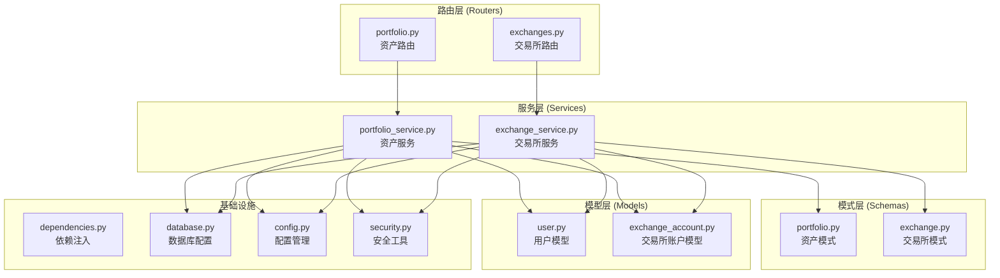

**图表来源**
- [backend/app/routers/portfolio.py:1-217](file://backend/app/routers/portfolio.py#L1-L217)
- [backend/app/services/portfolio_service.py:1-317](file://backend/app/services/portfolio_service.py#L1-L317)
- [backend/app/schemas/portfolio.py:1-152](file://backend/app/schemas/portfolio.py#L1-L152)

**章节来源**
- [backend/app/routers/portfolio.py:1-217](file://backend/app/routers/portfolio.py#L1-L217)
- [backend/app/main.py:94-101](file://backend/app/main.py#L94-L101)

## 核心组件

资产路由模块的核心组件包括四个主要路由端点，每个都对应不同的资产管理功能：

### 1. 资产概览端点
- **路径**: `/portfolio/summary`
- **功能**: 返回用户总资产价值、24小时涨跌幅和各数据源分布
- **响应**: `PortfolioSummaryResponse`

### 2. 历史数据端点  
- **路径**: `/portfolio/history`
- **功能**: 返回指定时间周期内的资产净值历史数据
- **参数**: `period` (1d, 1w, 1m, 3m, all)
- **响应**: `PortfolioHistoryResponse`

### 3. 持仓列表端点
- **路径**: `/portfolio/holdings`
- **功能**: 返回用户所有币种的持仓详情
- **响应**: `HoldingsListResponse`

### 4. 数据源端点
- **路径**: `/portfolio/sources`
- **功能**: 返回用户已连接的交易所和钱包列表
- **响应**: `SourcesListResponse`

**章节来源**
- [backend/app/routers/portfolio.py:29-177](file://backend/app/routers/portfolio.py#L29-L177)

## 架构概览

资产路由模块采用经典的三层架构设计，确保了清晰的关注点分离和良好的可维护性：

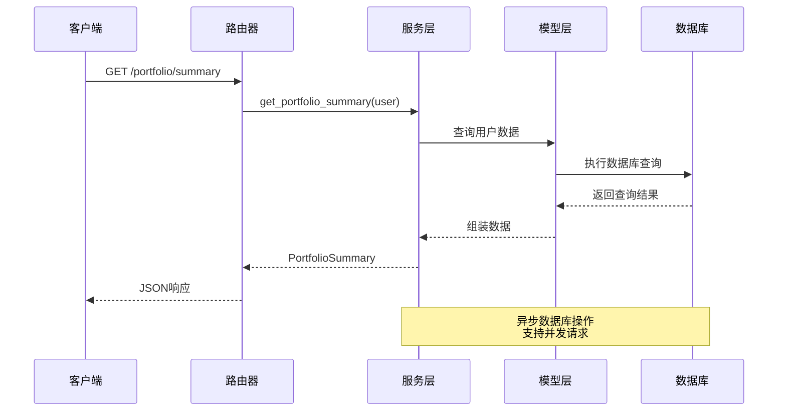

**图表来源**
- [backend/app/routers/portfolio.py:33-59](file://backend/app/routers/portfolio.py#L33-L59)
- [backend/app/services/portfolio_service.py:41-52](file://backend/app/services/portfolio_service.py#L41-L52)

### 数据流架构

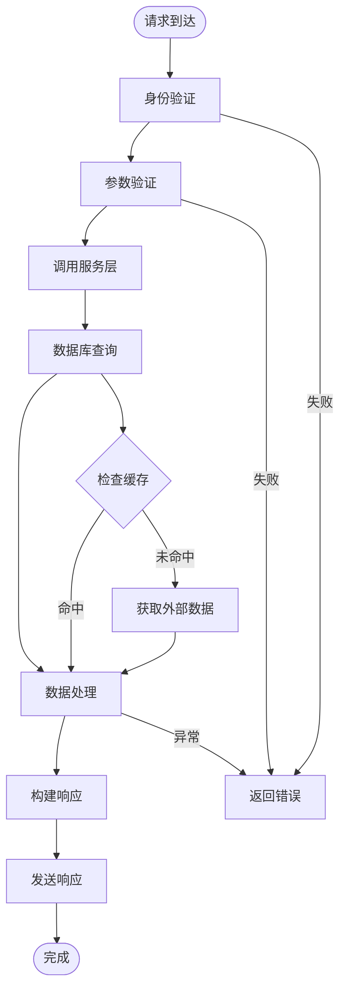

**图表来源**
- [backend/app/dependencies.py:18-56](file://backend/app/dependencies.py#L18-L56)
- [backend/app/services/portfolio_service.py:41-88](file://backend/app/services/portfolio_service.py#L41-L88)

## 详细组件分析

### 资产服务层 (PortfolioService)

PortfolioService 是资产路由模块的核心业务逻辑层，负责处理所有资产相关的计算和数据聚合。

#### 主要职责

1. **资产概览计算**: 聚合来自多个数据源的资产价值
2. **历史数据生成**: 生成指定时间周期的历史净值数据
3. **持仓管理**: 处理用户的持仓列表和价值计算
4. **数据源管理**: 管理用户连接的各种数据源

#### 数据聚合算法

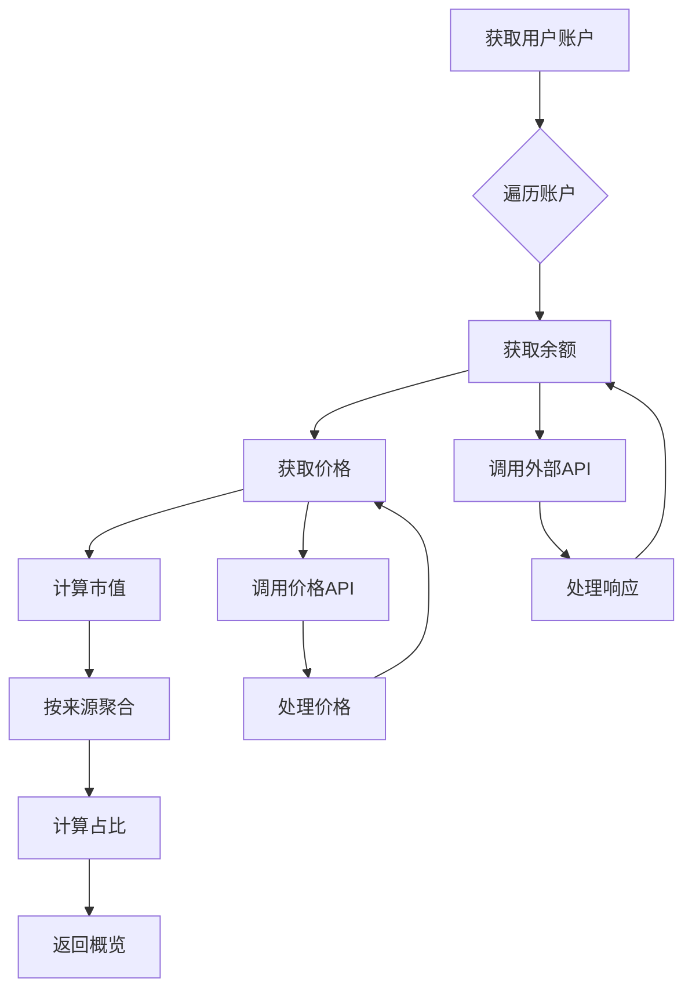

**图表来源**
- [backend/app/services/portfolio_service.py:270-300](file://backend/app/services/portfolio_service.py#L270-L300)

#### 持仓数据结构设计

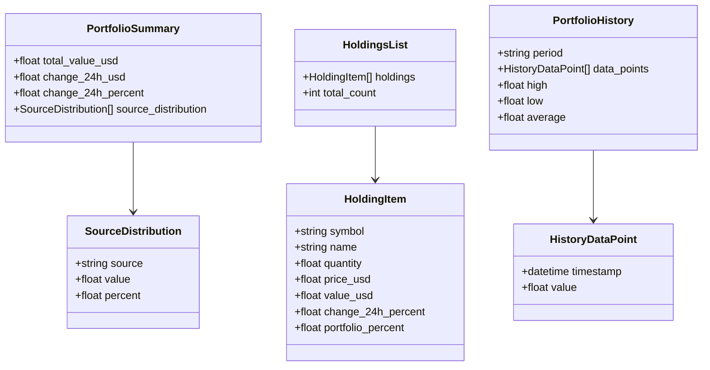

**图表来源**
- [backend/app/schemas/portfolio.py:29-124](file://backend/app/schemas/portfolio.py#L29-L124)

**章节来源**
- [backend/app/services/portfolio_service.py:31-317](file://backend/app/services/portfolio_service.py#L31-L317)
- [backend/app/schemas/portfolio.py:1-152](file://backend/app/schemas/portfolio.py#L1-L152)

### 路由器层 (PortfolioRouter)

路由器层负责处理 HTTP 请求、参数验证和响应格式化。

#### 路由端点设计

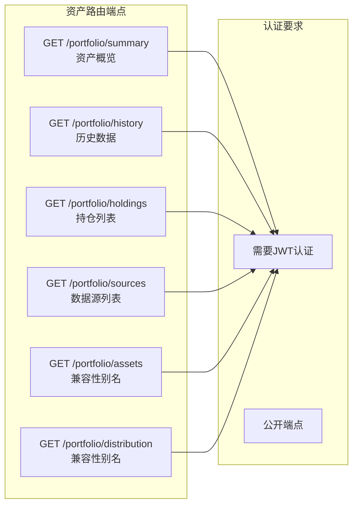

**图表来源**
- [backend/app/routers/portfolio.py:26-217](file://backend/app/routers/portfolio.py#L26-L217)

#### 参数验证机制

路由层使用 FastAPI 的依赖注入系统进行参数验证：

- **时间周期参数**: 严格验证 `period` 参数的有效性
- **认证中间件**: 自动验证 JWT 令牌
- **数据库会话**: 自动管理数据库连接

**章节来源**
- [backend/app/routers/portfolio.py:72-100](file://backend/app/routers/portfolio.py#L72-L100)

### 数据模型层

#### 用户模型 (User)

用户模型定义了系统的认证和授权基础：

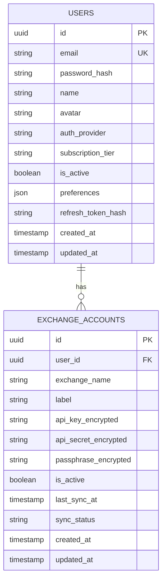

**图表来源**
- [backend/app/models/user.py:11-32](file://backend/app/models/user.py#L11-L32)
- [backend/app/models/exchange_account.py:11-32](file://backend/app/models/exchange_account.py#L11-L32)

#### 交易所账户模型

交易所账户模型支持多种类型的加密货币交易所连接：

- **API 密钥管理**: 安全存储和加密管理
- **同步状态跟踪**: 实时监控数据同步状态
- **多交易所支持**: 支持主流加密货币交易所

**章节来源**
- [backend/app/models/user.py:1-32](file://backend/app/models/user.py#L1-L32)
- [backend/app/models/exchange_account.py:1-32](file://backend/app/models/exchange_account.py#L1-L32)

## 依赖关系分析

资产路由模块的依赖关系体现了清晰的分层架构：

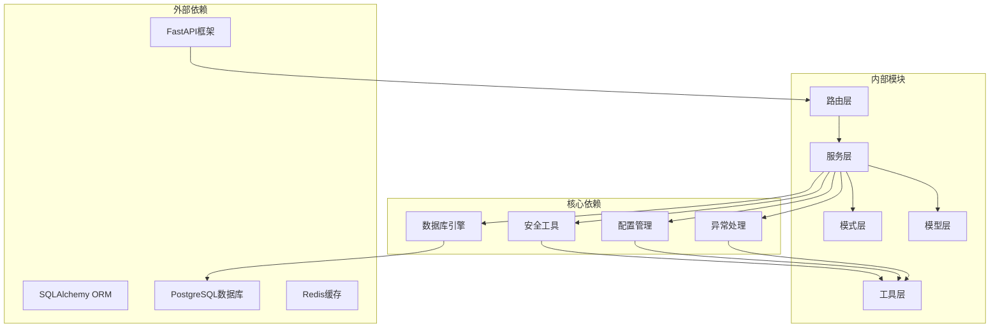

**图表来源**
- [backend/app/main.py:9-10](file://backend/app/main.py#L9-L10)
- [backend/app/database.py:1-33](file://backend/app/database.py#L1-L33)

### 循环依赖检测

经过分析，资产路由模块没有发现循环依赖关系：

- **路由层**不依赖服务层（通过依赖注入）
- **服务层**不依赖路由层（通过接口抽象）
- **模型层**不依赖上层组件（纯数据定义）

**章节来源**
- [backend/app/main.py:94-101](file://backend/app/main.py#L94-L101)
- [backend/app/dependencies.py:1-74](file://backend/app/dependencies.py#L1-L74)

## 性能考虑

### 数据库性能优化

1. **异步数据库操作**: 使用 SQLAlchemy AsyncEngine 支持并发查询
2. **连接池管理**: 配置合适的连接池大小和超时设置
3. **查询优化**: 使用批量查询减少数据库往返次数

### 缓存策略

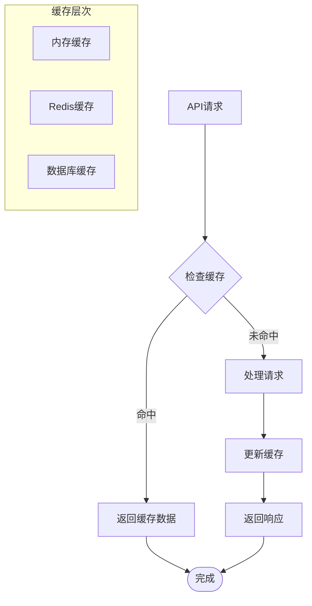

**图表来源**
- [backend/app/config.py:14-16](file://backend/app/config.py#L14-L16)

### 并发处理

- **异步路由处理**: 支持高并发请求处理
- **数据库事务管理**: 确保数据一致性和隔离性
- **资源清理**: 自动管理数据库连接和会话

## 故障排除指南

### 常见错误类型

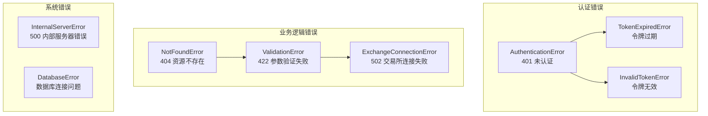

**图表来源**
- [backend/app/utils/exceptions.py:4-67](file://backend/app/utils/exceptions.py#L4-L67)

### 错误处理流程

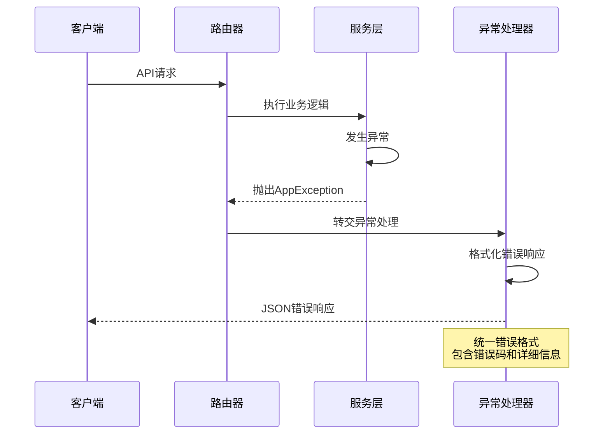

**图表来源**
- [backend/app/main.py:65-91](file://backend/app/main.py#L65-L91)

### 调试和监控

- **日志记录**: 记录关键业务事件和错误信息
- **健康检查**: 提供 `/health` 端点监控服务状态
- **性能指标**: 监控请求延迟和数据库连接状态

**章节来源**
- [backend/app/utils/exceptions.py:1-67](file://backend/app/utils/exceptions.py#L1-L67)
- [backend/app/main.py:65-91](file://backend/app/main.py#L65-L91)

## 结论

资产路由模块展现了现代 Web 应用的最佳实践，具有以下特点：

### 设计优势

1. **清晰的分层架构**: 路由层、服务层、模型层职责明确
2. **异步编程模型**: 支持高并发和高性能
3. **安全的认证机制**: 基于 JWT 的完整认证体系
4. **灵活的数据模型**: 支持多种数据源和扩展性

### 扩展性考虑

1. **模块化设计**: 易于添加新的数据源和功能
2. **配置驱动**: 通过配置文件管理环境变量
3. **错误处理**: 完善的异常处理和恢复机制

### 未来改进方向

1. **真实数据集成**: 实现与外部交易所和价格 API 的集成
2. **缓存优化**: 部署 Redis 缓存提升性能
3. **监控增强**: 添加 APM 和性能监控
4. **测试覆盖**: 增加单元测试和集成测试

该模块为构建企业级资产管理平台奠定了坚实的基础，其架构设计和实现模式值得在类似项目中借鉴和参考。