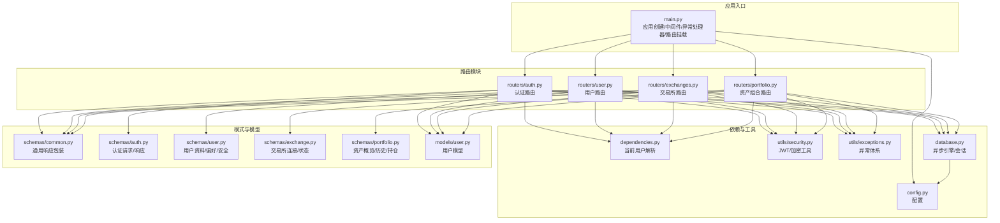
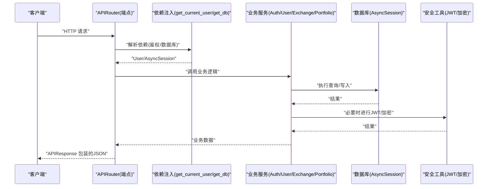
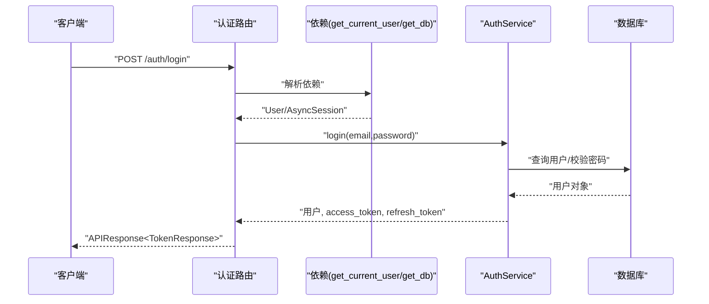
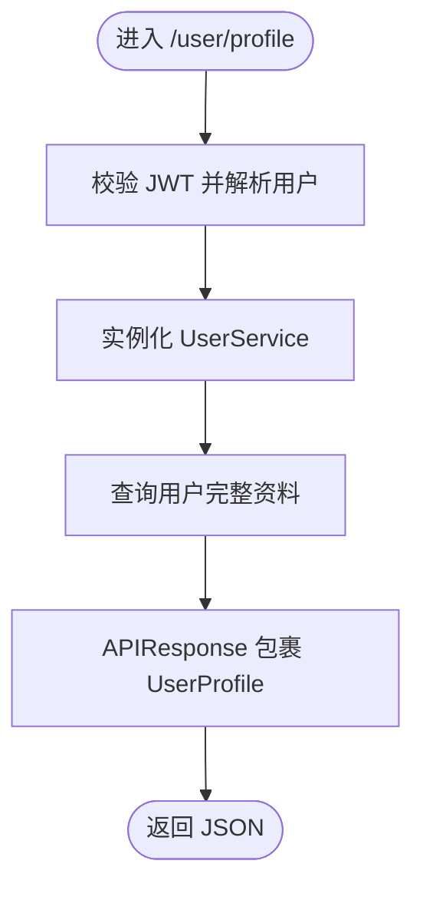
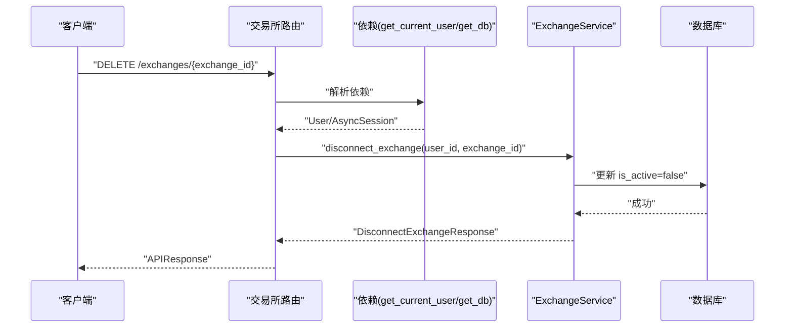
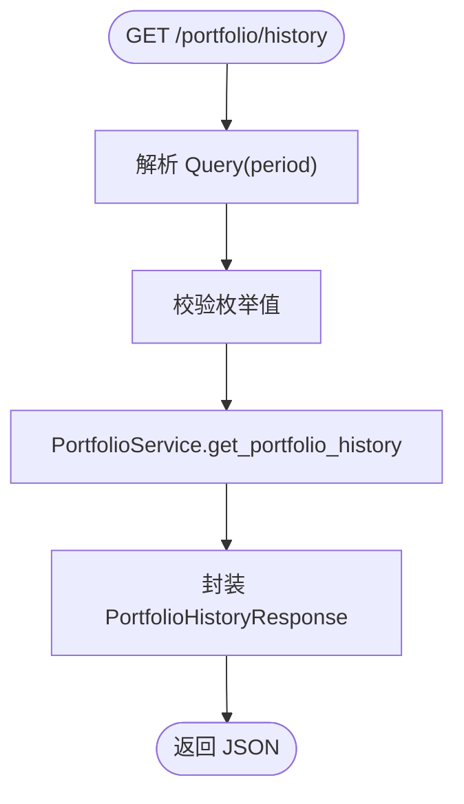
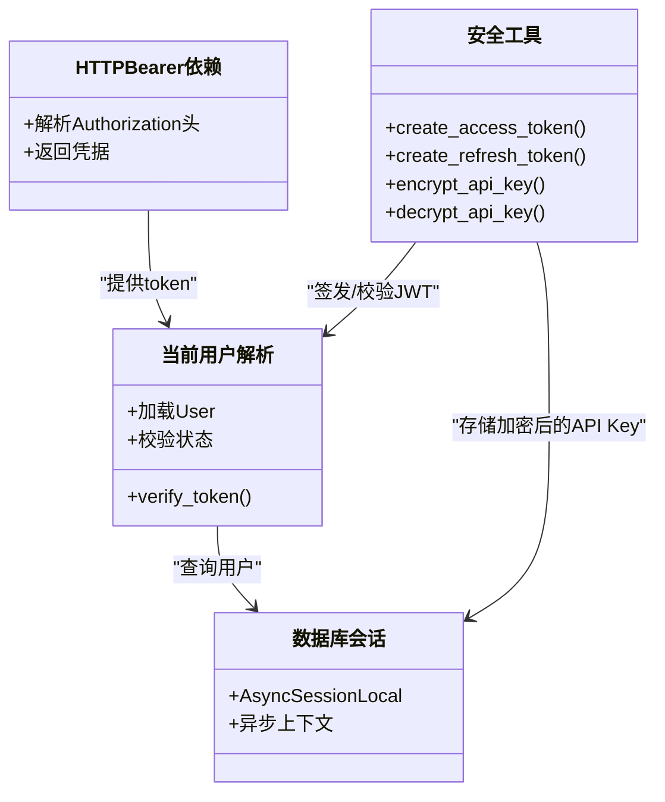
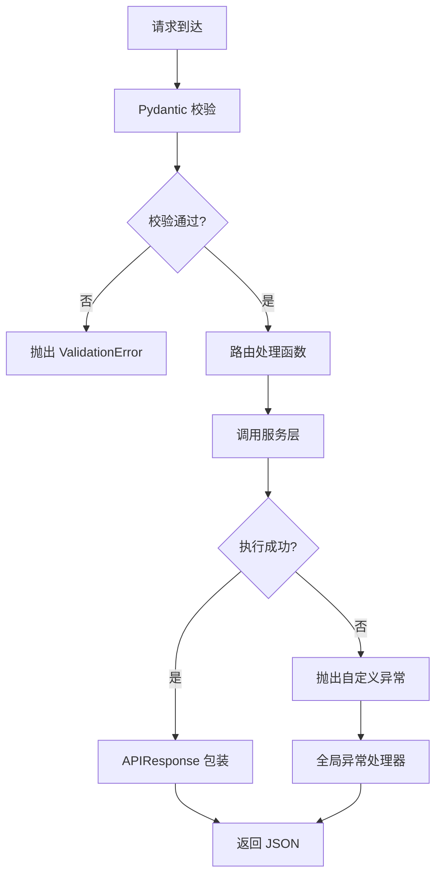

# 路由系统

<cite>
**本文引用的文件**
- [backend/app/main.py](file://backend/app/main.py)
- [backend/app/routers/auth.py](file://backend/app/routers/auth.py)
- [backend/app/routers/user.py](file://backend/app/routers/user.py)
- [backend/app/routers/exchanges.py](file://backend/app/routers/exchanges.py)
- [backend/app/routers/portfolio.py](file://backend/app/routers/portfolio.py)
- [backend/app/dependencies.py](file://backend/app/dependencies.py)
- [backend/app/utils/security.py](file://backend/app/utils/security.py)
- [backend/app/utils/exceptions.py](file://backend/app/utils/exceptions.py)
- [backend/app/config.py](file://backend/app/config.py)
- [backend/app/database.py](file://backend/app/database.py)
- [backend/app/models/user.py](file://backend/app/models/user.py)
- [backend/app/schemas/common.py](file://backend/app/schemas/common.py)
- [backend/app/schemas/auth.py](file://backend/app/schemas/auth.py)
- [backend/app/schemas/user.py](file://backend/app/schemas/user.py)
- [backend/app/schemas/exchange.py](file://backend/app/schemas/exchange.py)
- [backend/app/schemas/portfolio.py](file://backend/app/schemas/portfolio.py)
</cite>

## 目录
1. [简介](#简介)
2. [项目结构](#项目结构)
3. [核心组件](#核心组件)
4. [架构总览](#架构总览)
5. [详细组件分析](#详细组件分析)
6. [依赖分析](#依赖分析)
7. [性能考量](#性能考量)
8. [故障排查指南](#故障排查指南)
9. [结论](#结论)
10. [附录](#附录)

## 简介
本文件系统化梳理了基于 FastAPI 的路由系统，涵盖认证路由、用户路由、交易所路由与资产组合路由的组织结构与 URL 设计；深入解析路由装饰器与依赖注入机制；说明请求参数校验、响应模型定义与错误处理策略；并提供路由扩展与自定义中间件的实现建议。文档以“可读性优先”的原则，结合图示帮助读者快速掌握 RESTful API 设计与实现要点。

## 项目结构
后端采用分层与按功能模块划分的组织方式：
- 应用入口与全局配置：应用生命周期、CORS、异常处理器、路由挂载
- 路由模块：按业务域拆分，每个模块独立定义 APIRouter 与端点
- 依赖注入：数据库会话、当前用户解析、安全方案
- 模式定义：Pydantic 模型用于请求/响应校验与序列化
- 工具与服务：安全工具、异常体系、数据库引擎与会话工厂
- 模型：SQLAlchemy 异步 ORM 模型

图表来源
- [backend/app/main.py:94-100](file://backend/app/main.py#L94-L100)
- [backend/app/routers/auth.py:23](file://backend/app/routers/auth.py#L23)
- [backend/app/routers/user.py:19](file://backend/app/routers/user.py#L19)
- [backend/app/routers/exchanges.py:22](file://backend/app/routers/exchanges.py#L22)
- [backend/app/routers/portfolio.py:26](file://backend/app/routers/portfolio.py#L26)
- [backend/app/dependencies.py:18](file://backend/app/dependencies.py#L18)
- [backend/app/utils/security.py:28](file://backend/app/utils/security.py#L28)
- [backend/app/utils/exceptions.py:4](file://backend/app/utils/exceptions.py#L4)
- [backend/app/config.py:5](file://backend/app/config.py#L5)
- [backend/app/database.py:26](file://backend/app/database.py#L26)
- [backend/app/models/user.py:11](file://backend/app/models/user.py#L11)
- [backend/app/schemas/common.py:8](file://backend/app/schemas/common.py#L8)
- [backend/app/schemas/auth.py:8](file://backend/app/schemas/auth.py#L8)
- [backend/app/schemas/user.py:10](file://backend/app/schemas/user.py#L10)
- [backend/app/schemas/exchange.py:10](file://backend/app/schemas/exchange.py#L10)
- [backend/app/schemas/portfolio.py:29](file://backend/app/schemas/portfolio.py#L29)

章节来源
- [backend/app/main.py:33-100](file://backend/app/main.py#L33-L100)
- [backend/app/config.py:5-51](file://backend/app/config.py#L5-L51)
- [backend/app/database.py:6-33](file://backend/app/database.py#L6-L33)

## 核心组件
- 应用入口与生命周期
  - 创建 FastAPI 实例，配置标题、版本、文档路径与生命周期钩子
  - 注册 CORS 中间件，按环境动态允许来源
  - 注册全局异常处理器，统一返回格式
  - 通过 include_router 将各模块路由挂载到统一前缀下
- 路由模块
  - 每个模块以 APIRouter 定义，设置前缀与标签，集中管理端点
  - 端点函数通过装饰器声明 HTTP 方法、路径与响应模型
- 依赖注入
  - 数据库会话依赖：异步上下文管理器，确保会话正确创建与关闭
  - 当前用户依赖：解析 Authorization 头中的 JWT，校验并加载用户
- 安全与加密
  - JWT：访问令牌与刷新令牌的签发、校验与轮换
  - API Key 加密：AES-256-GCM 对交易所 API Key 进行加解密
- 异常体系
  - 统一的 AppException 基类，细分认证、未找到、校验、交易所连接等错误
  - 全局异常处理器将异常转换为标准化响应
- 模式与响应包装
  - 通用 APIResponse 包装器，统一 success/data/message/error_code 结构
  - 各模块响应模型严格定义字段与约束

章节来源
- [backend/app/main.py:13-131](file://backend/app/main.py#L13-L131)
- [backend/app/dependencies.py:18-74](file://backend/app/dependencies.py#L18-L74)
- [backend/app/utils/security.py:28-104](file://backend/app/utils/security.py#L28-L104)
- [backend/app/utils/exceptions.py:4-67](file://backend/app/utils/exceptions.py#L4-L67)
- [backend/app/schemas/common.py:8-25](file://backend/app/schemas/common.py#L8-L25)

## 架构总览
路由系统遵循“路由-依赖-服务-模型-模式”的分层架构，端点负责参数解析与响应包装，依赖注入提供数据库与用户上下文，服务层执行业务逻辑，模式定义保障输入输出一致性。

图表来源
- [backend/app/routers/auth.py:26-53](file://backend/app/routers/auth.py#L26-L53)
- [backend/app/routers/user.py:24-70](file://backend/app/routers/user.py#L24-L70)
- [backend/app/routers/exchanges.py:86-121](file://backend/app/routers/exchanges.py#L86-L121)
- [backend/app/routers/portfolio.py:33-59](file://backend/app/routers/portfolio.py#L33-L59)
- [backend/app/dependencies.py:18-56](file://backend/app/dependencies.py#L18-L56)
- [backend/app/utils/security.py:28-58](file://backend/app/utils/security.py#L28-L58)
- [backend/app/database.py:26-32](file://backend/app/database.py#L26-L32)

## 详细组件分析

### 认证路由（/auth）
- 功能职责
  - 用户注册、登录、刷新令牌、登出、OAuth 登录（Google/Apple）
  - 返回统一的 APIResponse 包裹 TokenResponse
- 关键端点
  - POST /auth/register：注册并返回访问与刷新令牌
  - POST /auth/login：邮箱+密码登录并返回令牌
  - POST /auth/refresh：使用刷新令牌换取新令牌
  - GET /auth/me：获取当前用户信息
  - POST /auth/logout /auth/logout-all：登出当前设备或所有设备
  - POST /auth/google /auth/apple：第三方 OAuth 登录
- 装饰器与依赖
  - @router.post/@router.get 声明 HTTP 方法与路径
  - Depends(get_db) 注入数据库会话
  - Depends(get_current_user) 解析 JWT 并注入 User
- 错误处理
  - 使用 AuthenticationError/ValidationError 等异常类型
  - 全局异常处理器统一返回 JSONResponse

图表来源
- [backend/app/routers/auth.py:56-81](file://backend/app/routers/auth.py#L56-L81)
- [backend/app/dependencies.py:18-56](file://backend/app/dependencies.py#L18-L56)
- [backend/app/utils/security.py:28-49](file://backend/app/utils/security.py#L28-L49)
- [backend/app/utils/exceptions.py:21-30](file://backend/app/utils/exceptions.py#L21-L30)

章节来源
- [backend/app/routers/auth.py:23-287](file://backend/app/routers/auth.py#L23-L287)
- [backend/app/schemas/auth.py:8-43](file://backend/app/schemas/auth.py#L8-L43)
- [backend/app/schemas/common.py:8-12](file://backend/app/schemas/common.py#L8-L12)

### 用户路由（/user）
- 功能职责
  - 用户资料：获取/更新
  - 偏好设置：获取/更新（基础货币、刷新间隔、生物识别等）
  - 安全设置：获取/更新（生物识别、双因素等）
  - API 管理：列出已连接的交易所 API
  - 兼容旧端点：/user/me、/user/me/password、/user/me/delete 等
- 关键端点
  - GET/PUT /user/profile
  - GET/PUT /user/preferences
  - GET/PUT /user/security
  - GET /user/apis
  - GET/PUT /user/me（兼容）
- 依赖与响应
  - 依赖当前用户与数据库会话
  - 返回 APIResponse 包裹 UserProfile/UserPreferences/SecuritySettings

图表来源
- [backend/app/routers/user.py:24-70](file://backend/app/routers/user.py#L24-L70)
- [backend/app/schemas/user.py:47-66](file://backend/app/schemas/user.py#L47-L66)
- [backend/app/schemas/common.py:8-12](file://backend/app/schemas/common.py#L8-L12)

章节来源
- [backend/app/routers/user.py:19-280](file://backend/app/routers/user.py#L19-L280)
- [backend/app/schemas/user.py:10-96](file://backend/app/schemas/user.py#L10-L96)

### 交易所路由（/exchanges）
- 功能职责
  - 支持的交易所列表
  - 用户已连接的交易所列表
  - 连接/断开交易所（软删除）
  - 手动触发同步
  - 查询连接状态与余额（部分端点预留）
- 关键端点
  - GET /exchanges 与 /exchanges/supported
  - GET /exchanges/connected
  - POST /exchanges/connect
  - DELETE /exchanges/{exchange_id}
  - POST /exchanges/{exchange_id}/sync
  - GET /exchanges/{exchange_id}/status
- 参数与路径
  - 使用 Path(...) 提取 UUID 类型的 exchange_id
  - ConnectExchangeRequest 校验 API Key/Secret/Passphrase 等

图表来源
- [backend/app/routers/exchanges.py:124-148](file://backend/app/routers/exchanges.py#L124-L148)
- [backend/app/schemas/exchange.py:113-132](file://backend/app/schemas/exchange.py#L113-L132)

章节来源
- [backend/app/routers/exchanges.py:22-227](file://backend/app/routers/exchanges.py#L22-L227)
- [backend/app/schemas/exchange.py:10-150](file://backend/app/schemas/exchange.py#L10-L150)

### 资产组合路由（/portfolio）
- 功能职责
  - 资产概览：总资产、24h 涨跌、来源分布
  - 历史净值：按周期返回时间序列
  - 持仓列表：币种、数量、市值、涨跌幅、占比
  - 已连接数据源：API/Web3 来源与状态
  - 兼容旧端点：/portfolio/assets 与 /portfolio/distribution
- 关键端点
  - GET /portfolio/summary
  - GET /portfolio/history?period=...
  - GET /portfolio/holdings
  - GET /portfolio/sources
  - GET /portfolio/assets（兼容）
  - GET /portfolio/distribution（兼容）
- 查询参数
  - period 使用 Literal["1d","1w","1m","3m","all"] 限定枚举值

图表来源
- [backend/app/routers/portfolio.py:66-100](file://backend/app/routers/portfolio.py#L66-L100)
- [backend/app/schemas/portfolio.py:56-69](file://backend/app/schemas/portfolio.py#L56-L69)

章节来源
- [backend/app/routers/portfolio.py:26-217](file://backend/app/routers/portfolio.py#L26-L217)
- [backend/app/schemas/portfolio.py:29-152](file://backend/app/schemas/portfolio.py#L29-L152)

### 依赖注入与安全
- 当前用户依赖
  - 通过 HTTPBearer 解析 Authorization 头
  - verify_token 校验 JWT，检查 token 类型与用户状态
  - 从数据库加载 User 并返回
- 数据库会话依赖
  - 异步上下文管理器，自动创建与关闭会话
- 安全工具
  - JWT：访问/刷新令牌签发与校验
  - 加密：API Key 的 AES-256-GCM 加解密

图表来源
- [backend/app/dependencies.py:18-56](file://backend/app/dependencies.py#L18-L56)
- [backend/app/database.py:26-32](file://backend/app/database.py#L26-L32)
- [backend/app/utils/security.py:28-104](file://backend/app/utils/security.py#L28-L104)

章节来源
- [backend/app/dependencies.py:18-74](file://backend/app/dependencies.py#L18-L74)
- [backend/app/utils/security.py:28-104](file://backend/app/utils/security.py#L28-L104)
- [backend/app/database.py:26-32](file://backend/app/database.py#L26-L32)

### 请求参数验证、响应模型与错误处理
- 请求参数验证
  - Pydantic 模型定义字段约束（最小/最大长度、数值范围、枚举）
  - Query/Literal 限定查询参数取值
  - Path(...) 明确路径参数类型
- 响应模型
  - APIResponse 泛型包装器统一 success/data/message/error_code
  - 各模块响应模型严格定义字段与 from_attributes
- 错误处理
  - 自定义异常类继承 AppException，细分场景
  - 全局异常处理器将异常转为 JSONResponse，包含 success/message/error_code/details

图表来源
- [backend/app/schemas/auth.py:8-17](file://backend/app/schemas/auth.py#L8-L17)
- [backend/app/routers/portfolio.py:73-76](file://backend/app/routers/portfolio.py#L73-L76)
- [backend/app/schemas/common.py:8-12](file://backend/app/schemas/common.py#L8-L12)
- [backend/app/utils/exceptions.py:4-67](file://backend/app/utils/exceptions.py#L4-L67)
- [backend/app/main.py:66-91](file://backend/app/main.py#L66-L91)

章节来源
- [backend/app/schemas/common.py:8-25](file://backend/app/schemas/common.py#L8-L25)
- [backend/app/schemas/auth.py:8-43](file://backend/app/schemas/auth.py#L8-L43)
- [backend/app/schemas/user.py:10-96](file://backend/app/schemas/user.py#L10-L96)
- [backend/app/schemas/exchange.py:113-132](file://backend/app/schemas/exchange.py#L113-L132)
- [backend/app/schemas/portfolio.py:29-152](file://backend/app/schemas/portfolio.py#L29-L152)
- [backend/app/utils/exceptions.py:4-67](file://backend/app/utils/exceptions.py#L4-L67)
- [backend/app/main.py:66-91](file://backend/app/main.py#L66-L91)

### 路由扩展与自定义中间件
- 路由扩展
  - 在现有模块中新增 APIRouter 端点，复用 get_current_user 与 get_db 依赖
  - 使用 APIResponse 包裹响应，保持一致的返回结构
- 自定义中间件
  - 可在 main.py 中添加新的中间件（如日志、限流、指标采集）
  - 注意中间件顺序与 CORS 的位置关系
- 批量操作建议
  - 使用 Pydantic 模型定义批量请求体，配合校验与分页
  - 在服务层实现批量写入与幂等性控制

章节来源
- [backend/app/main.py:44-62](file://backend/app/main.py#L44-L62)
- [backend/app/routers/user.py:182-208](file://backend/app/routers/user.py#L182-L208)

## 依赖分析
- 模块耦合
  - 路由模块仅依赖依赖注入与服务层，低耦合高内聚
  - 服务层依赖数据库会话与安全工具，边界清晰
- 外部依赖
  - FastAPI、SQLAlchemy Async、Pydantic、JWKS、HTTPX（OAuth）、Cryptography
- 循环依赖
  - 未发现循环导入；路由、依赖、服务、模式、工具分层明确

```mermaid
graph LR
RAuth["routers/auth.py"] --> Dep["dependencies.py"]
RUser["routers/user.py"] --> Dep
REx["routers/exchanges.py"] --> Dep
RPort["routers/portfolio.py"] --> Dep
RAuth --> SvcAuth["AuthService"]
RUser --> SvcUser["UserService"]
REx --> SvcEx["ExchangeService"]
RPort --> SvcPort["PortfolioService"]
Dep --> DB["database.py"]
SvcAuth --> DB
SvcUser --> DB
SvcEx --> DB
SvcPort --> DB
RAuth --> Sec["utils/security.py"]
RUser --> Sec
REx --> Sec
RPort --> Sec
RAuth --> Exc["utils/exceptions.py"]
RUser --> Exc
REx --> Exc
RPort --> Exc
```

图表来源
- [backend/app/routers/auth.py:19-21](file://backend/app/routers/auth.py#L19-L21)
- [backend/app/routers/user.py:17](file://backend/app/routers/user.py#L17)
- [backend/app/routers/exchanges.py:19](file://backend/app/routers/exchanges.py#L19)
- [backend/app/routers/portfolio.py:24](file://backend/app/routers/portfolio.py#L24)
- [backend/app/dependencies.py:18-56](file://backend/app/dependencies.py#L18-L56)
- [backend/app/database.py:26-32](file://backend/app/database.py#L26-L32)
- [backend/app/utils/security.py:28-104](file://backend/app/utils/security.py#L28-L104)
- [backend/app/utils/exceptions.py:4-67](file://backend/app/utils/exceptions.py#L4-L67)

章节来源
- [backend/app/routers/auth.py:19-21](file://backend/app/routers/auth.py#L19-L21)
- [backend/app/routers/user.py:17](file://backend/app/routers/user.py#L17)
- [backend/app/routers/exchanges.py:19](file://backend/app/routers/exchanges.py#L19)
- [backend/app/routers/portfolio.py:24](file://backend/app/routers/portfolio.py#L24)
- [backend/app/dependencies.py:18-56](file://backend/app/dependencies.py#L18-L56)
- [backend/app/database.py:26-32](file://backend/app/database.py#L26-L32)
- [backend/app/utils/security.py:28-104](file://backend/app/utils/security.py#L28-L104)
- [backend/app/utils/exceptions.py:4-67](file://backend/app/utils/exceptions.py#L4-L67)

## 性能考量
- 数据库连接
  - 使用异步引擎与会话工厂，减少阻塞；避免在路由中直接创建连接
- 令牌与加密
  - JWT 缓存与加密密钥派生结果缓存，降低重复计算
- 响应一致性
  - 统一 APIResponse 包裹，便于前端缓存与错误处理
- 查询参数与分页
  - 使用 Query/Literal 限制参数范围，避免无效请求
- 中间件与 CORS
  - 控制中间件顺序，避免重复处理与跨域问题

## 故障排查指南
- 认证失败
  - 检查 Authorization 头是否携带、令牌类型是否为 access、用户是否激活
  - 查看全局异常处理器返回的 error_code 与 details
- 数据库连接
  - 确认 DATABASE_URL 配置正确，异步引擎创建与会话工厂初始化
- 令牌刷新
  - 刷新令牌需与数据库中存储的哈希匹配，注意单设备刷新令牌设计
- OAuth 登录
  - Google/Apple 令牌校验失败时，检查网络连通性与提供商端点可用性

章节来源
- [backend/app/dependencies.py:29-56](file://backend/app/dependencies.py#L29-L56)
- [backend/app/utils/exceptions.py:21-66](file://backend/app/utils/exceptions.py#L21-L66)
- [backend/app/database.py:6-20](file://backend/app/database.py#L6-L20)
- [backend/app/utils/security.py:52-58](file://backend/app/utils/security.py#L52-L58)

## 结论
该路由系统以清晰的模块化结构、严格的依赖注入与统一的响应/异常模型，实现了认证、用户、交易所与资产组合的 RESTful API。通过 Pydantic 模型与 Query/Literal 参数约束，保证了输入输出的一致性与安全性。建议在生产环境中完善多设备并行登录、限流与审计日志等能力，并持续优化查询与缓存策略以提升性能。

## 附录
- 配置项参考
  - JWT 密钥、算法、过期时间
  - 加密密钥（32字节）
  - 允许的 CORS 来源
  - 数据库与 Redis 连接串
- 数据模型要点
  - User 模型包含用户基本信息、偏好设置与刷新令牌哈希
  - 交易所连接模型用于保存 API Key/Secret 与状态

章节来源
- [backend/app/config.py:5-51](file://backend/app/config.py#L5-L51)
- [backend/app/models/user.py:11-32](file://backend/app/models/user.py#L11-L32)