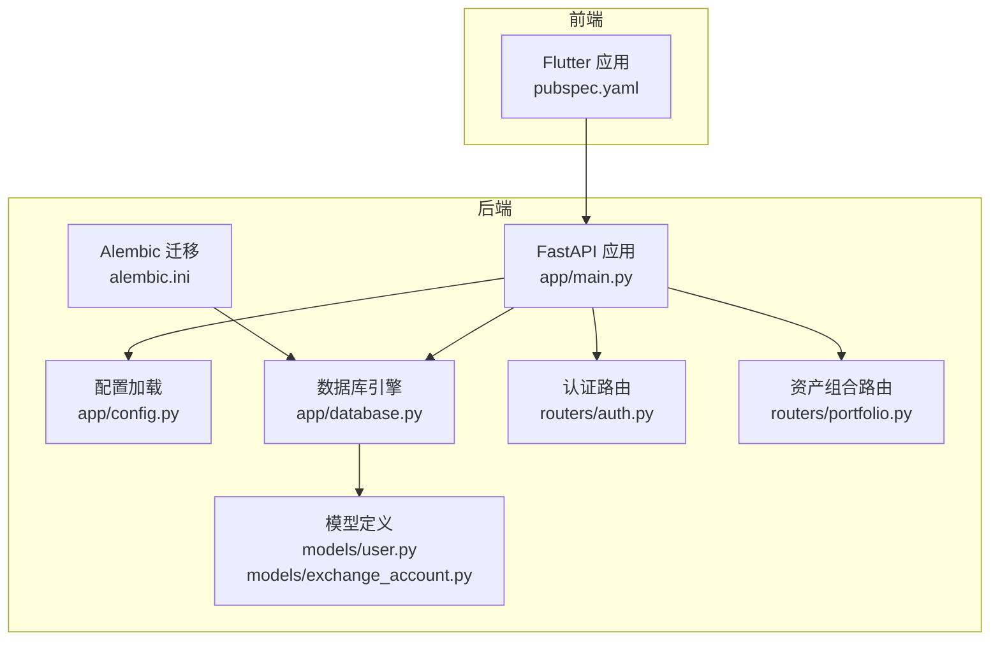
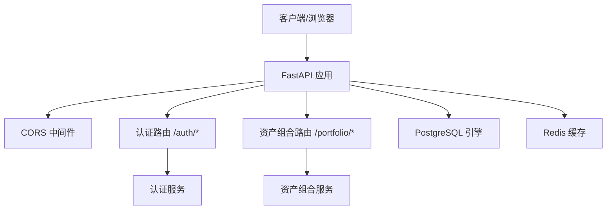
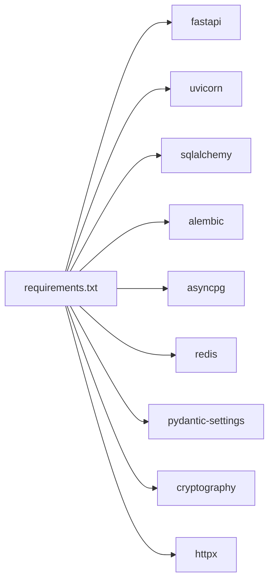

# 快速开始

<cite>
**本文引用的文件**
- [backend/requirements.txt](file://backend/requirements.txt)
- [backend/app/config.py](file://backend/app/config.py)
- [backend/app/main.py](file://backend/app/main.py)
- [backend/app/database.py](file://backend/app/database.py)
- [backend/alembic.ini](file://backend/alembic.ini)
- [frontend/pubspec.yaml](file://frontend/pubspec.yaml)
- [backend/app/models/user.py](file://backend/app/models/user.py)
- [backend/app/models/exchange_account.py](file://backend/app/models/exchange_account.py)
- [backend/app/routers/auth.py](file://backend/app/routers/auth.py)
- [backend/app/routers/portfolio.py](file://backend/app/routers/portfolio.py)
</cite>

## 目录
1. [简介](#简介)
2. [项目结构](#项目结构)
3. [核心组件](#核心组件)
4. [架构总览](#架构总览)
5. [详细组件分析](#详细组件分析)
6. [依赖关系分析](#依赖关系分析)
7. [性能注意事项](#性能注意事项)
8. [故障排查指南](#故障排查指南)
9. [结论](#结论)
10. [附录](#附录)

## 简介
本指南面向新手开发者，帮助你在约30分钟内完成资产聚集App（后端基于FastAPI，前端基于Flutter）的环境搭建与本地运行。你将学到：
- Python后端与Flutter前端的依赖安装
- PostgreSQL与Redis的配置与准备
- 本地开发服务器启动命令与步骤
- 关键配置文件的修改要点（数据库连接、API密钥等）
- 基础测试步骤验证安装成功
- 常见环境问题排查与解决方案

## 项目结构
该项目采用前后端分离架构：
- 后端：Python + FastAPI + SQLAlchemy异步 + Alembic迁移 + Redis缓存
- 前端：Flutter应用，使用Riverpod状态管理、GoRouter路由、Dio网络请求等

图表来源
- [backend/app/main.py:1-131](file://backend/app/main.py#L1-L131)
- [backend/app/config.py:1-43](file://backend/app/config.py#L1-L43)
- [backend/app/database.py:1-33](file://backend/app/database.py#L1-L33)
- [backend/alembic.ini:1-115](file://backend/alembic.ini#L1-L115)
- [backend/app/models/user.py:1-32](file://backend/app/models/user.py#L1-L32)
- [backend/app/models/exchange_account.py:1-32](file://backend/app/models/exchange_account.py#L1-L32)
- [backend/app/routers/auth.py:1-253](file://backend/app/routers/auth.py#L1-L253)
- [backend/app/routers/portfolio.py:1-217](file://backend/app/routers/portfolio.py#L1-L217)
- [frontend/pubspec.yaml:1-53](file://frontend/pubspec.yaml#L1-L53)

章节来源
- [backend/app/main.py:1-131](file://backend/app/main.py#L1-L131)
- [frontend/pubspec.yaml:1-53](file://frontend/pubspec.yaml#L1-L53)

## 核心组件
- 配置系统：通过Pydantic Settings加载环境变量，支持调试模式、数据库、Redis、JWT、加密密钥、第三方API地址等。
- 数据库层：使用SQLAlchemy异步引擎连接PostgreSQL，提供会话依赖注入。
- 路由与服务：认证与资产组合API，提供注册/登录/刷新令牌、用户信息、资产概览/历史/持仓/数据源等接口。
- 前端依赖：Flutter生态常用库，如Dio、Riverpod、GoRouter、安全存储等。

章节来源
- [backend/app/config.py:1-43](file://backend/app/config.py#L1-L43)
- [backend/app/database.py:1-33](file://backend/app/database.py#L1-L33)
- [backend/app/routers/auth.py:1-253](file://backend/app/routers/auth.py#L1-L253)
- [backend/app/routers/portfolio.py:1-217](file://backend/app/routers/portfolio.py#L1-L217)
- [frontend/pubspec.yaml:1-53](file://frontend/pubspec.yaml#L1-L53)

## 架构总览
后端以FastAPI为核心，通过中间件处理CORS与异常，按版本前缀挂载路由；数据库为PostgreSQL，使用异步引擎；缓存为Redis；前端通过HTTP调用后端API。

图表来源
- [backend/app/main.py:34-101](file://backend/app/main.py#L34-L101)
- [backend/app/routers/auth.py:22-253](file://backend/app/routers/auth.py#L22-L253)
- [backend/app/routers/portfolio.py:26-217](file://backend/app/routers/portfolio.py#L26-L217)
- [backend/app/database.py:7-20](file://backend/app/database.py#L7-L20)
- [backend/app/config.py:11-16](file://backend/app/config.py#L11-L16)

## 详细组件分析

### 后端：配置与启动
- 配置加载：默认读取.env文件，支持DEBUG、数据库URL、Redis URL、JWT参数、加密密钥、CoinGecko API地址等。
- 启动流程：创建FastAPI实例，注册CORS、全局异常处理器，挂载路由，健康检查端点，本地可通过uvicorn在8000端口运行。
- 开发模式：DEBUG为True时自动允许本地开发域名跨域访问。

章节来源
- [backend/app/config.py:1-43](file://backend/app/config.py#L1-L43)
- [backend/app/main.py:34-131](file://backend/app/main.py#L34-L131)

### 数据库与迁移
- 数据库驱动：使用asyncpg与SQLAlchemy异步引擎连接PostgreSQL。
- 迁移工具：Alembic配置中包含默认数据库URL，可直接用于迁移脚本生成与执行。
- 模型：用户与交易所账户模型定义了主键、索引、外键与常用字段。

章节来源
- [backend/app/database.py:1-33](file://backend/app/database.py#L1-L33)
- [backend/alembic.ini:61](file://backend/alembic.ini#L61)
- [backend/app/models/user.py:11-32](file://backend/app/models/user.py#L11-L32)
- [backend/app/models/exchange_account.py:11-32](file://backend/app/models/exchange_account.py#L11-L32)

### 认证与用户服务
- 支持邮箱密码注册/登录、刷新令牌、登出、多设备登出。
- 支持Google与Apple OAuth（MVP阶段未做签名验证）。
- 返回统一的API响应包装类型。

章节来源
- [backend/app/routers/auth.py:25-253](file://backend/app/routers/auth.py#L25-L253)

### 资产组合服务
- 提供资产概览、历史净值、持仓列表、已连接数据源等接口。
- 兼容旧版路径，保持向后兼容。

章节来源
- [backend/app/routers/portfolio.py:33-217](file://backend/app/routers/portfolio.py#L33-L217)

### 前端：依赖与构建
- 使用Flutter SDK 3.x，依赖Dio、Riverpod、GoRouter、安全存储等。
- 开发者可直接运行flutter pub get安装依赖。

章节来源
- [frontend/pubspec.yaml:1-53](file://frontend/pubspec.yaml#L1-L53)

## 依赖关系分析
后端依赖通过requirements.txt声明，主要包含FastAPI、Uvicorn、SQLAlchemy、Alembic、asyncpg、Redis、Pydantic Settings、HTTPX、Cryptography等。

图表来源
- [backend/requirements.txt:1-15](file://backend/requirements.txt#L1-L15)

章节来源
- [backend/requirements.txt:1-15](file://backend/requirements.txt#L1-L15)

## 性能注意事项
- 异步I/O：后端使用SQLAlchemy异步引擎与FastAPI，适合高并发场景。
- 缓存策略：Redis可用于会话、限流、热点数据缓存，需结合业务设计过期策略。
- 数据库连接池：根据并发量调整连接数与超时配置。
- 前端网络：合理设置超时与重试，避免频繁请求导致后端压力。

## 故障排查指南
- 数据库连接失败
  - 确认PostgreSQL服务已启动且监听默认端口。
  - 检查DATABASE_URL格式与凭据是否正确。
  - 参考：[backend/app/config.py:12](file://backend/app/config.py#L12)、[backend/app/database.py:7-11](file://backend/app/database.py#L7-L11)
- Redis连接失败
  - 确认Redis服务已启动且监听默认端口。
  - 检查REDIS_URL格式与权限。
  - 参考：[backend/app/config.py:14-15](file://backend/app/config.py#L14-L15)
- CORS跨域错误
  - 开发模式下默认允许本地常见端口；生产环境请设置ALLOWED_ORIGINS。
  - 参考：[backend/app/main.py:45-54](file://backend/app/main.py#L45-L54)
- JWT与加密密钥
  - 生产环境必须替换默认密钥，否则启动即报错。
  - 参考：[backend/app/config.py:29-36](file://backend/app/config.py#L29-L36)
- Alembic迁移
  - 若迁移脚本报错，请核对alembic.ini中的sqlalchemy.url与数据库连通性。
  - 参考：[backend/alembic.ini:61](file://backend/alembic.ini#L61)
- 健康检查
  - 访问根路径或健康检查端点确认后端正常运行。
  - 参考：[backend/app/main.py:103-110](file://backend/app/main.py#L103-L110)

章节来源
- [backend/app/config.py:12-36](file://backend/app/config.py#L12-L36)
- [backend/app/database.py:7-11](file://backend/app/database.py#L7-L11)
- [backend/app/main.py:45-54](file://backend/app/main.py#L45-L54)
- [backend/alembic.ini:61](file://backend/alembic.ini#L61)

## 结论
按照本指南，你可以在30分钟内完成环境搭建、数据库与Redis准备、后端与前端依赖安装，并成功启动本地开发服务器。建议在生产环境前完善密钥与安全配置，并使用正式迁移工具进行数据库版本管理。

## 附录

### 环境搭建步骤（总计约30分钟）
- 安装Python与虚拟环境
  - 创建并激活虚拟环境
  - 在后端目录安装依赖：pip install -r requirements.txt
  - 参考：[backend/requirements.txt:1-15](file://backend/requirements.txt#L1-L15)
- 准备PostgreSQL
  - 安装并启动PostgreSQL服务
  - 创建数据库与用户（与DATABASE_URL一致）
  - 参考：[backend/app/config.py:12](file://backend/app/config.py#L12)
- 准备Redis
  - 安装并启动Redis服务
  - 确认Redis URL可用
  - 参考：[backend/app/config.py:14-15](file://backend/app/config.py#L14-L15)
- 配置后端
  - 复制.env.example为.env（若存在），按需修改数据库、Redis、JWT、加密密钥等
  - 参考：[backend/app/config.py:1-43](file://backend/app/config.py#L1-L43)
- 初始化数据库（可选）
  - 使用Alembic生成并应用迁移脚本
  - 参考：[backend/alembic.ini:61](file://backend/alembic.ini#L61)
- 启动后端
  - 在后端目录运行：uvicorn app.main:app --host 0.0.0.0 --port 8000 --reload
  - 访问 http://localhost:8000/docs 查看接口文档
  - 参考：[backend/app/main.py:123-131](file://backend/app/main.py#L123-L131)
- 安装Flutter依赖
  - 在前端目录运行：flutter pub get
  - 参考：[frontend/pubspec.yaml:1-53](file://frontend/pubspec.yaml#L1-L53)
- 启动前端（可选）
  - 在前端目录运行：flutter run
  - 参考：[frontend/pubspec.yaml:1-53](file://frontend/pubspec.yaml#L1-L53)

### 基本测试步骤
- 后端健康检查
  - 访问 http://localhost:8000/health，应返回健康状态
  - 参考：[backend/app/main.py:103-110](file://backend/app/main.py#L103-L110)
- 接口文档
  - 访问 http://localhost:8000/docs，查看认证与资产组合接口
  - 参考：[backend/app/main.py:34-101](file://backend/app/main.py#L34-L101)
- 认证流程（可选）
  - 注册/登录后获取令牌，再调用/me或资产组合接口验证鉴权
  - 参考：[backend/app/routers/auth.py:25-206](file://backend/app/routers/auth.py#L25-L206)

### 常见问题与解决方案
- 无法连接数据库
  - 检查PostgreSQL服务状态与端口占用
  - 核对DATABASE_URL用户名、密码、主机、端口、数据库名
- 无法连接Redis
  - 检查Redis服务状态与防火墙
  - 核对REDIS_URL
- CORS错误
  - 开发模式下允许本地端口；生产环境设置ALLOWED_ORIGINS
- JWT密钥未修改
  - 生产环境必须替换默认密钥，否则启动失败
- Alembic迁移失败
  - 确认数据库连通性与权限，检查sqlalchemy.url