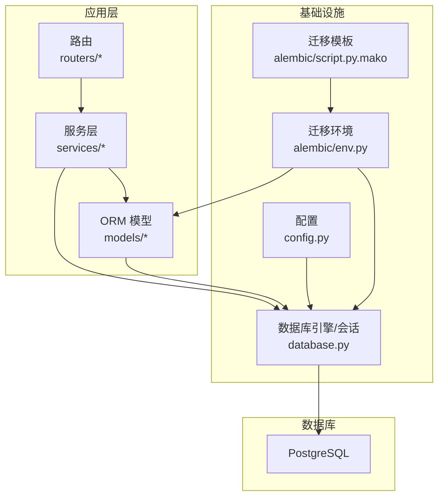
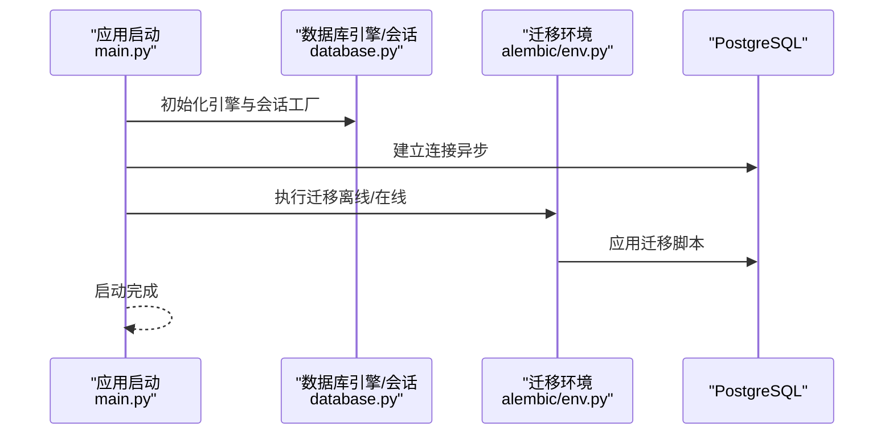
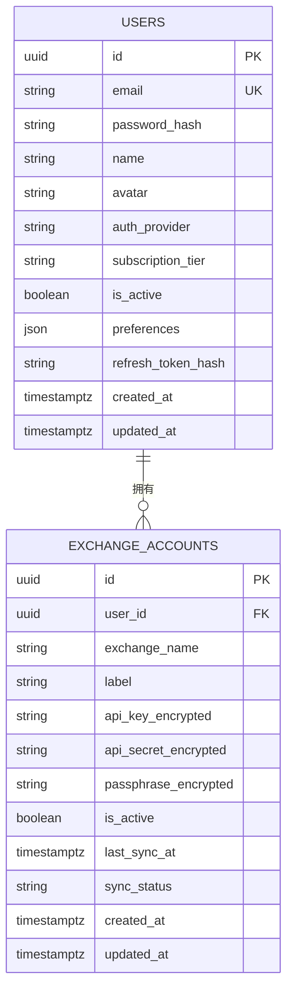
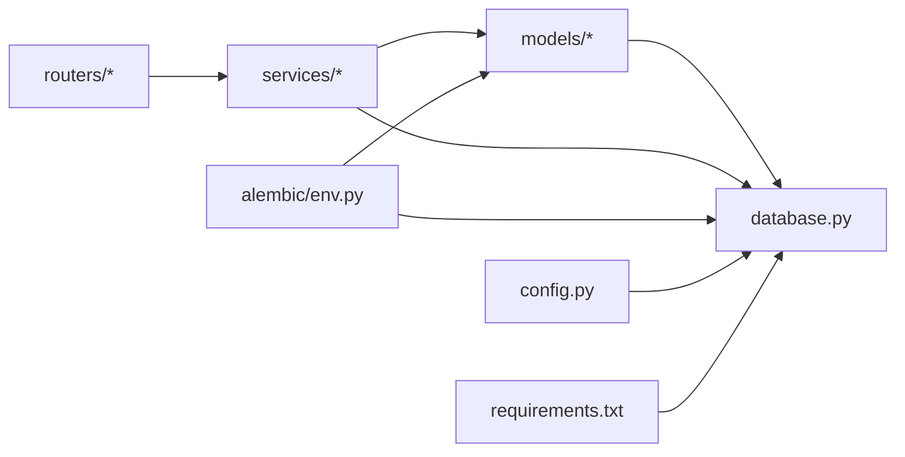

# 数据库设计

<cite>
**本文引用的文件**
- [backend/app/models/user.py](file://backend/app/models/user.py)
- [backend/app/models/exchange_account.py](file://backend/app/models/exchange_account.py)
- [backend/app/models/__init__.py](file://backend/app/models/__init__.py)
- [backend/app/database.py](file://backend/app/database.py)
- [backend/app/config.py](file://backend/app/config.py)
- [backend/alembic/env.py](file://backend/alembic/env.py)
- [backend/alembic/script.py.mako](file://backend/alembic/script.py.mako)
- [backend/app/main.py](file://backend/app/main.py)
- [backend/app/services/user_service.py](file://backend/app/services/user_service.py)
- [backend/app/services/exchange_service.py](file://backend/app/services/exchange_service.py)
- [backend/app/utils/security.py](file://backend/app/utils/security.py)
- [backend/app/routers/user.py](file://backend/app/routers/user.py)
- [backend/app/routers/exchanges.py](file://backend/app/routers/exchanges.py)
- [backend/requirements.txt](file://backend/requirements.txt)
</cite>

## 目录
1. [简介](#简介)
2. [项目结构](#项目结构)
3. [核心组件](#核心组件)
4. [架构总览](#架构总览)
5. [详细组件分析](#详细组件分析)
6. [依赖分析](#依赖分析)
7. [性能考量](#性能考量)
8. [故障排查指南](#故障排查指南)
9. [结论](#结论)
10. [附录](#附录)

## 简介
本文件系统化梳理基于 PostgreSQL 的关系型数据库设计方案，聚焦于核心实体模型（用户与交易所账户）的表结构、字段定义、实体关系映射、索引与约束策略、数据完整性保障机制，并结合 Alembic 迁移系统给出版本控制实践。同时总结数据访问模式、查询优化策略与缓存机制建议，以及数据库性能调优与扩展性考虑。

## 项目结构
后端采用 SQLAlchemy ORM + 异步引擎，配合 Alembic 实现数据库迁移；模型位于 models 目录，数据库会话工厂与配置位于 database.py 与 config.py；迁移入口在 alembic/env.py，模板脚本在 alembic/script.py.mako；应用主程序在 main.py，服务层在 services 目录，路由在 routers 目录。

图表来源
- [backend/app/main.py:13-31](file://backend/app/main.py#L13-L31)
- [backend/app/database.py:1-33](file://backend/app/database.py#L1-L33)
- [backend/app/config.py:11-12](file://backend/app/config.py#L11-L12)
- [backend/alembic/env.py:10-30](file://backend/alembic/env.py#L10-L30)
- [backend/alembic/script.py.mako:1-25](file://backend/alembic/script.py.mako#L1-L25)

章节来源
- [backend/app/main.py:13-31](file://backend/app/main.py#L13-L31)
- [backend/app/database.py:1-33](file://backend/app/database.py#L1-L33)
- [backend/app/config.py:11-12](file://backend/app/config.py#L11-L12)
- [backend/alembic/env.py:10-30](file://backend/alembic/env.py#L10-L30)
- [backend/alembic/script.py.mako:1-25](file://backend/alembic/script.py.mako#L1-L25)

## 核心组件
- 用户模型（User）
  - 主键：UUID 类型
  - 关键字段：邮箱（唯一、带索引）、密码哈希（OAuth 用户可为空）、名称、头像、认证提供商、订阅等级、激活状态、偏好设置（JSON）、刷新令牌哈希、创建/更新时间戳
  - 关系：一对多，一个用户拥有多个交易所账户
- 交易所账户模型（ExchangeAccount）
  - 主键：UUID 类型
  - 外键：user_id 指向 users.id
  - 关键字段：交易所名称、备注标签、加密的 API 密钥、加密的密钥、加密的口令（部分交易所可选）、激活状态、最近同步时间、同步状态、创建/更新时间戳
  - 关系：多对一，指向用户

章节来源
- [backend/app/models/user.py:11-32](file://backend/app/models/user.py#L11-L32)
- [backend/app/models/exchange_account.py:11-32](file://backend/app/models/exchange_account.py#L11-L32)

## 架构总览
数据库层采用异步 SQLAlchemy 引擎，会话工厂按需创建；迁移通过 Alembic 在离线/在线模式下执行；应用启动时建立连接但不自动建表（开发中注释掉），生产环境建议使用 Alembic 管理版本。

图表来源
- [backend/app/main.py:13-31](file://backend/app/main.py#L13-L31)
- [backend/app/database.py:1-33](file://backend/app/database.py#L1-L33)
- [backend/alembic/env.py:69-96](file://backend/alembic/env.py#L69-L96)

章节来源
- [backend/app/main.py:13-31](file://backend/app/main.py#L13-L31)
- [backend/app/database.py:1-33](file://backend/app/database.py#L1-L33)
- [backend/alembic/env.py:69-96](file://backend/alembic/env.py#L69-L96)

## 详细组件分析

### 实体关系与ER图
- 一对一：无显式一对一字段
- 一对多：User → ExchangeAccount（一个用户可有多个交易所账户）
- 多对多：当前未见直接多对多关系；可通过中间表扩展实现（例如用户-标签、资产-标签等）

图表来源
- [backend/app/models/user.py:11-32](file://backend/app/models/user.py#L11-L32)
- [backend/app/models/exchange_account.py:11-32](file://backend/app/models/exchange_account.py#L11-L32)

章节来源
- [backend/app/models/user.py:11-32](file://backend/app/models/user.py#L11-L32)
- [backend/app/models/exchange_account.py:11-32](file://backend/app/models/exchange_account.py#L11-L32)

### 数据模型与字段定义
- 用户表（users）
  - 主键：id（UUID）
  - 唯一索引：email
  - 普通索引：email（便于查询）
  - JSON 字段：preferences 存放用户偏好
  - 时间戳：created_at、updated_at（含服务器默认值与更新触发器）
- 交易所账户表（exchange_accounts）
  - 主键：id（UUID）
  - 外键：user_id → users.id（级联删除由模型关系定义）
  - 字段：exchange_name、label、加密的 API/Secret/Passphrase、is_active、last_sync_at、sync_status、时间戳
  - 约束：非空字段明确，布尔字段用于状态控制

章节来源
- [backend/app/models/user.py:14-25](file://backend/app/models/user.py#L14-L25)
- [backend/app/models/exchange_account.py:14-25](file://backend/app/models/exchange_account.py#L14-L25)

### 索引策略与约束
- 索引
  - users.email：唯一索引 + 普通索引，加速登录与查找
  - 可选：为 exchange_accounts.user_id 建立索引以优化关联查询
- 约束
  - 非空：邮箱、交易所名称、加密字段等
  - 唯一：邮箱
  - 布尔状态：is_active、同步状态字段用于软删除与状态管理
- 完整性
  - 外键约束：ExchangeAccount.user_id → users.id
  - 业务完整性：通过服务层逻辑确保状态一致性（如断连软删除、同步状态流转）

章节来源
- [backend/app/models/user.py:15](file://backend/app/models/user.py#L15)
- [backend/app/models/exchange_account.py:15](file://backend/app/models/exchange_account.py#L15)
- [backend/app/models/exchange_account.py:15](file://backend/app/models/exchange_account.py#L15)

### 数据访问模式与查询优化
- 会话管理
  - 使用异步会话工厂，按需创建、自动关闭，避免连接泄漏
- 查询模式
  - 用户资料：按主键或邮箱查询，利用索引快速定位
  - 交易所连接：按 user_id + 激活状态过滤，建议为 user_id 建索引
- 事务与并发
  - 服务层统一提交与刷新，避免脏读与并发写冲突
- 缓存机制
  - 项目中引入 Redis 配置，可用于热点数据缓存（如用户偏好、交易所支持列表等），建议在服务层增加缓存读写与失效策略

章节来源
- [backend/app/database.py:14-33](file://backend/app/database.py#L14-L33)
- [backend/app/services/user_service.py:25-30](file://backend/app/services/user_service.py#L25-L30)
- [backend/app/services/exchange_service.py:138-144](file://backend/app/services/exchange_service.py#L138-L144)
- [backend/app/config.py:14](file://backend/app/config.py#L14)

### Alembic 迁移与版本控制
- 迁移入口
  - env.py 设置数据库 URL、目标元数据、离线/在线迁移流程
- 模板脚本
  - script.py.mako 提供升级/降级钩子，便于手写迁移
- 版本控制建议
  - 开发阶段：先在本地/测试库验证迁移，再合并到主干
  - 生产环境：禁止自动建表，统一通过 Alembic 执行迁移
  - 兼容性：新增列建议默认值与非空约束谨慎设计，必要时分步迁移

章节来源
- [backend/alembic/env.py:10-30](file://backend/alembic/env.py#L10-L30)
- [backend/alembic/env.py:69-96](file://backend/alembic/env.py#L69-L96)
- [backend/alembic/script.py.mako:19-24](file://backend/alembic/script.py.mako#L19-L24)

### 加密与敏感数据
- API 密钥加密
  - 使用对称加密（AES-256-GCM）与派生密钥（HKDF），加密后存储
- 密码与令牌
  - 密码使用 bcrypt 哈希；JWT 令牌用于认证与授权
- 敏感字段
  - users.password_hash、users.refresh_token_hash、exchange_accounts.api_key_encrypted 等

章节来源
- [backend/app/utils/security.py:78-96](file://backend/app/utils/security.py#L78-L96)
- [backend/app/models/user.py:16](file://backend/app/models/user.py#L16)
- [backend/app/models/exchange_account.py:18-20](file://backend/app/models/exchange_account.py#L18-L20)

### 软删除与状态机
- 软删除
  - 通过 is_active 字段标记是否有效，避免物理删除带来的数据丢失风险
- 状态流转
  - 同步状态：pending → syncing → success/failed，记录 last_sync_at 与更新时间

章节来源
- [backend/app/models/exchange_account.py:21-23](file://backend/app/models/exchange_account.py#L21-L23)
- [backend/app/services/exchange_service.py:335-343](file://backend/app/services/exchange_service.py#L335-L343)

## 依赖分析
- 组件耦合
  - models 与 database：模型继承自 Base，依赖异步引擎
  - services 依赖 models 与数据库会话，封装业务逻辑
  - routers 依赖 services，暴露 HTTP 接口
  - alembic/env.py 依赖 models 与 database，驱动迁移
- 外部依赖
  - SQLAlchemy 2.x、asyncpg、Alembic、Pydantic Settings、Redis

图表来源
- [backend/app/models/__init__.py:1-5](file://backend/app/models/__init__.py#L1-L5)
- [backend/app/database.py:1-33](file://backend/app/database.py#L1-L33)
- [backend/alembic/env.py:10-30](file://backend/alembic/env.py#L10-L30)
- [backend/requirements.txt:1-15](file://backend/requirements.txt#L1-L15)

章节来源
- [backend/app/models/__init__.py:1-5](file://backend/app/models/__init__.py#L1-L5)
- [backend/app/database.py:1-33](file://backend/app/database.py#L1-L33)
- [backend/alembic/env.py:10-30](file://backend/alembic/env.py#L10-L30)
- [backend/requirements.txt:1-15](file://backend/requirements.txt#L1-L15)

## 性能考量
- 连接与会话
  - 使用异步引擎与会话池，减少阻塞；避免在请求外持有会话
- 查询优化
  - 为高频过滤字段（如 users.email、exchange_accounts.user_id）建立索引
  - 使用 select + scalar_one_or_none 减少结果集大小
- 写入优化
  - 批量写入与事务合并，减少往返次数
- 缓存策略
  - 对只读或低频变更的数据（如支持的交易所列表、用户偏好）使用 Redis 缓存，设置合理过期时间
- 扩展性
  - 读写分离：将只读查询路由至只读副本
  - 分表分库：按用户维度水平拆分（如按 user_id 哈希）
  - 异步任务：将耗时操作（如同步交易所资产）放入队列后台处理

## 故障排查指南
- 迁移失败
  - 检查 DATABASE_URL 配置与数据库可达性
  - 确认 Alembic 目标元数据包含所有模型
- 连接异常
  - 核对 asyncpg 驱动版本与 PostgreSQL 版本兼容性
  - 查看会话生命周期与异常处理
- 数据不一致
  - 检查服务层事务提交与刷新逻辑
  - 核对软删除与状态字段更新路径
- 加密问题
  - 确认 ENCRYPTION_KEY 长度与派生密钥一致性
  - 校验加密/解密流程与存储格式

章节来源
- [backend/app/config.py:11-12](file://backend/app/config.py#L11-L12)
- [backend/alembic/env.py:18-19](file://backend/alembic/env.py#L18-L19)
- [backend/app/utils/security.py:72-75](file://backend/app/utils/security.py#L72-L75)

## 结论
该数据库设计以用户与交易所账户为核心，采用 UUID 主键、外键约束与 JSON 字段增强灵活性；通过 Alembic 实现可控的版本演进；服务层封装数据访问与业务规则，结合异步 SQLAlchemy 提升吞吐。建议后续完善索引覆盖、引入缓存与后台任务，逐步实施读写分离与分库分表，以满足高并发与大规模数据场景。

## 附录
- 关键实现路径参考
  - 用户模型定义：[backend/app/models/user.py:11-32](file://backend/app/models/user.py#L11-L32)
  - 交易所账户模型定义：[backend/app/models/exchange_account.py:11-32](file://backend/app/models/exchange_account.py#L11-L32)
  - 数据库引擎与会话：[backend/app/database.py:1-33](file://backend/app/database.py#L1-L33)
  - 配置与数据库 URL：[backend/app/config.py:11-12](file://backend/app/config.py#L11-L12)
  - Alembic 环境与迁移：[backend/alembic/env.py:10-30](file://backend/alembic/env.py#L10-L30)、[backend/alembic/script.py.mako:19-24](file://backend/alembic/script.py.mako#L19-L24)
  - 用户服务查询与更新：[backend/app/services/user_service.py:25-30](file://backend/app/services/user_service.py#L25-L30)、[backend/app/services/user_service.py:64-95](file://backend/app/services/user_service.py#L64-L95)
  - 交易所服务连接与同步：[backend/app/services/exchange_service.py:138-144](file://backend/app/services/exchange_service.py#L138-L144)、[backend/app/services/exchange_service.py:303-348](file://backend/app/services/exchange_service.py#L303-L348)
  - 加密工具与密钥派生：[backend/app/utils/security.py:72-96](file://backend/app/utils/security.py#L72-L96)
  - 路由与服务集成：[backend/app/routers/user.py:24-45](file://backend/app/routers/user.py#L24-L45)、[backend/app/routers/exchanges.py:84-119](file://backend/app/routers/exchanges.py#L84-L119)