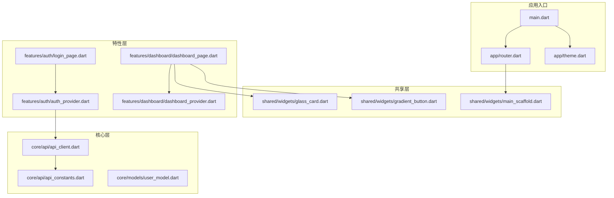
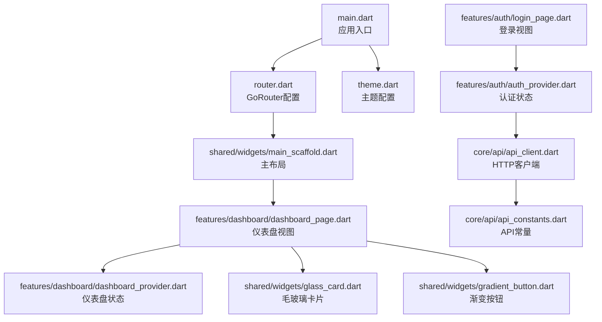
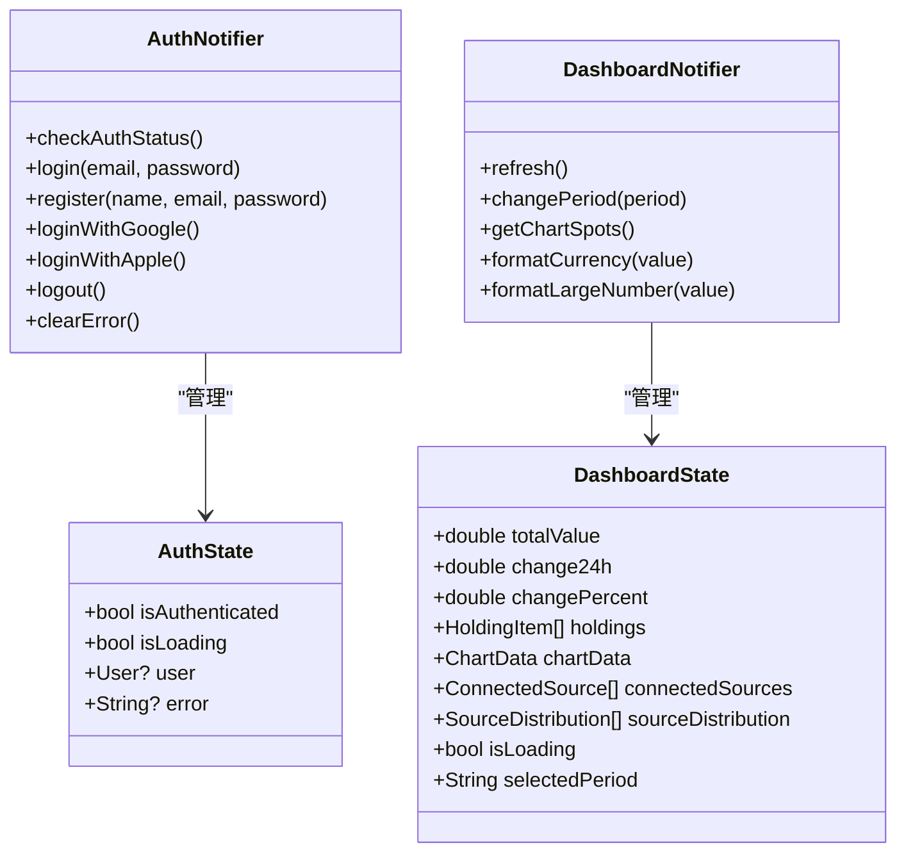
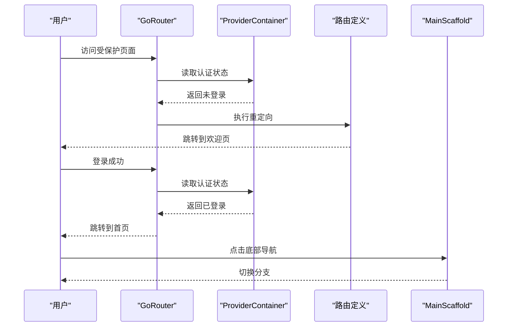
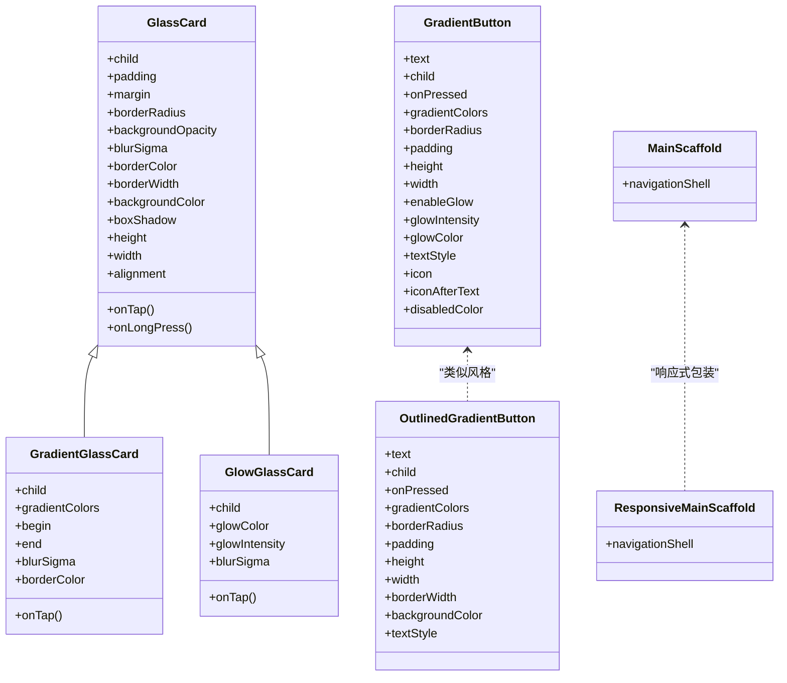
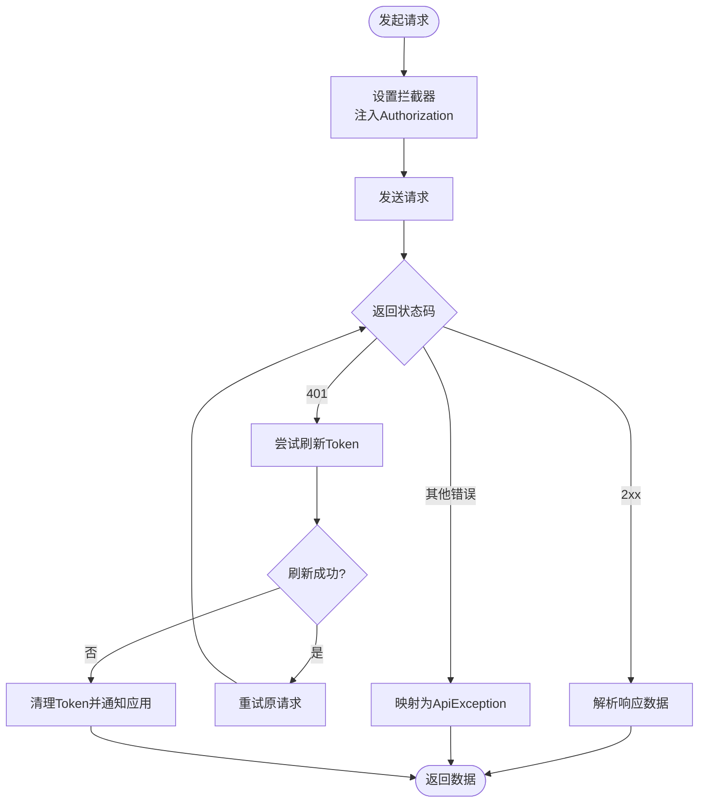
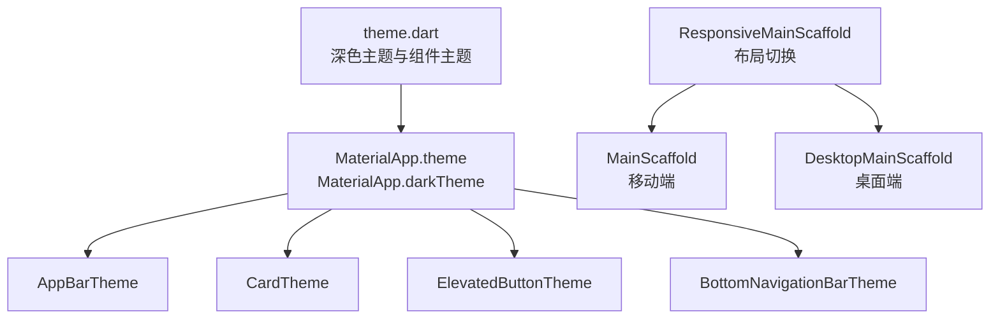
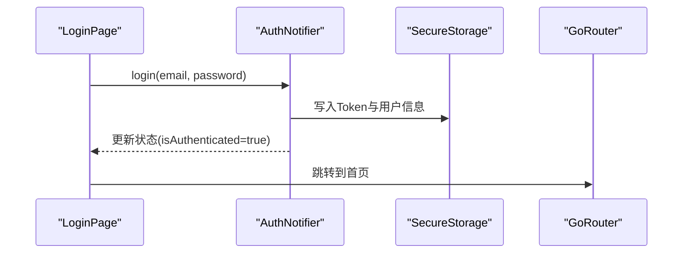
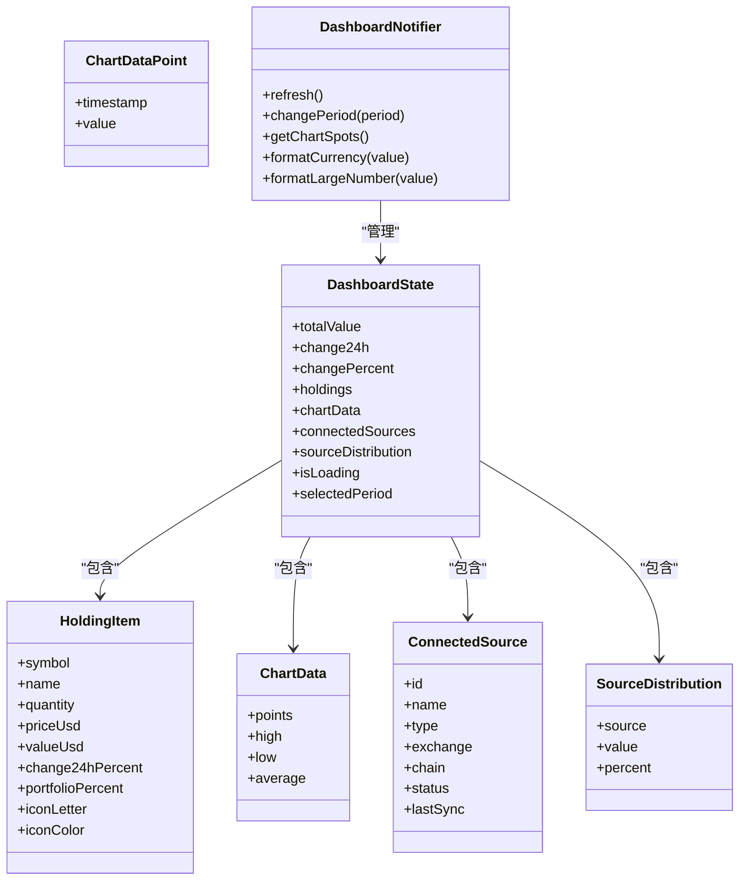
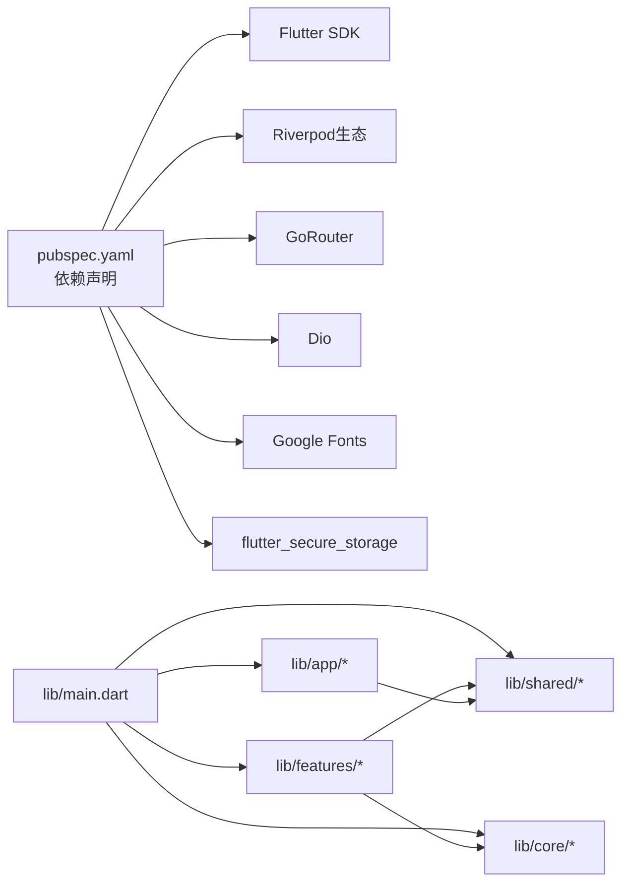

# 前端架构

<cite>
**本文引用的文件**
- [main.dart](file://frontend/lib/main.dart)
- [pubspec.yaml](file://frontend/pubspec.yaml)
- [router.dart](file://frontend/lib/app/router.dart)
- [theme.dart](file://frontend/lib/app/theme.dart)
- [api_client.dart](file://frontend/lib/core/api/api_client.dart)
- [api_constants.dart](file://frontend/lib/core/api/api_constants.dart)
- [user_model.dart](file://frontend/lib/core/models/user_model.dart)
- [auth_provider.dart](file://frontend/lib/features/auth/auth_provider.dart)
- [login_page.dart](file://frontend/lib/features/auth/login_page.dart)
- [dashboard_provider.dart](file://frontend/lib/features/dashboard/dashboard_provider.dart)
- [dashboard_page.dart](file://frontend/lib/features/dashboard/dashboard_page.dart)
- [main_scaffold.dart](file://frontend/lib/shared/widgets/main_scaffold.dart)
- [glass_card.dart](file://frontend/lib/shared/widgets/glass_card.dart)
- [gradient_button.dart](file://frontend/lib/shared/widgets/gradient_button.dart)
</cite>

## 目录
1. [简介](#简介)
2. [项目结构](#项目结构)
3. [核心组件](#核心组件)
4. [架构总览](#架构总览)
5. [详细组件分析](#详细组件分析)
6. [依赖关系分析](#依赖关系分析)
7. [性能考虑](#性能考虑)
8. [故障排查指南](#故障排查指南)
9. [结论](#结论)
10. [附录](#附录)

## 简介
本文件面向“资产聚集”Flutter应用的前端架构，系统性阐述模块化目录结构、状态管理（Riverpod）、路由系统（GoRouter）、UI组件库、数据流与网络层、错误处理策略、主题系统、国际化与响应式设计等关键技术决策与实现要点。目标是帮助开发者快速理解并高效扩展该应用。

## 项目结构
前端采用清晰的分层与功能域划分：
- lib/app：应用入口、路由与主题
- lib/core：通用基础设施（API客户端、常量、模型、工具）
- lib/features：业务特性模块（认证、仪表盘、交易所、个人中心等）
- lib/shared：跨特性可复用UI组件库（毛玻璃卡片、渐变按钮、主布局等）

**图表来源**
- [main.dart:1-86](file://frontend/lib/main.dart#L1-L86)
- [router.dart:1-278](file://frontend/lib/app/router.dart#L1-L278)
- [theme.dart:1-397](file://frontend/lib/app/theme.dart#L1-L397)
- [api_client.dart:1-364](file://frontend/lib/core/api/api_client.dart#L1-L364)
- [api_constants.dart:1-56](file://frontend/lib/core/api/api_constants.dart#L1-L56)
- [auth_provider.dart:1-418](file://frontend/lib/features/auth/auth_provider.dart#L1-L418)
- [login_page.dart:1-415](file://frontend/lib/features/auth/login_page.dart#L1-L415)
- [dashboard_provider.dart:1-427](file://frontend/lib/features/dashboard/dashboard_provider.dart#L1-L427)
- [dashboard_page.dart:1-695](file://frontend/lib/features/dashboard/dashboard_page.dart#L1-L695)
- [main_scaffold.dart:1-271](file://frontend/lib/shared/widgets/main_scaffold.dart#L1-L271)
- [glass_card.dart:1-282](file://frontend/lib/shared/widgets/glass_card.dart#L1-L282)
- [gradient_button.dart:1-402](file://frontend/lib/shared/widgets/gradient_button.dart#L1-L402)

**章节来源**
- [main.dart:1-86](file://frontend/lib/main.dart#L1-L86)
- [pubspec.yaml:1-53](file://frontend/pubspec.yaml#L1-L53)

## 核心组件
- 应用入口与启动流程：初始化系统UI、设备方向、Provider容器、预检认证状态后运行应用。
- 路由系统：基于GoRouter的Shell路由，支持底部导航与子路由；内置认证重定向逻辑。
- 状态管理：Riverpod Provider体系，使用StateNotifier管理认证与仪表盘状态。
- 网络层：Dio封装，统一拦截器、Token刷新、错误映射与日志输出。
- UI组件库：毛玻璃卡片、渐变按钮、响应式主布局，统一视觉与交互体验。
- 主题系统：深色主题、Material 3、字体与组件级主题配置。
- 数据模型：用户模型与仪表盘数据模型，便于跨页面复用。

**章节来源**
- [main.dart:9-41](file://frontend/lib/main.dart#L9-L41)
- [router.dart:88-202](file://frontend/lib/app/router.dart#L88-L202)
- [auth_provider.dart:89-358](file://frontend/lib/features/auth/auth_provider.dart#L89-L358)
- [dashboard_provider.dart:163-386](file://frontend/lib/features/dashboard/dashboard_provider.dart#L163-L386)
- [api_client.dart:24-364](file://frontend/lib/core/api/api_client.dart#L24-L364)
- [theme.dart:48-291](file://frontend/lib/app/theme.dart#L48-L291)
- [user_model.dart:1-73](file://frontend/lib/core/models/user_model.dart#L1-L73)

## 架构总览
应用采用“入口-路由-主题-Provider-组件-网络”的分层架构。入口负责初始化与全局配置；路由负责页面导航与Shell结构；Provider负责状态与数据；组件负责UI；网络层负责HTTP通信与错误处理。

**图表来源**
- [main.dart:44-85](file://frontend/lib/main.dart#L44-L85)
- [router.dart:112-169](file://frontend/lib/app/router.dart#L112-L169)
- [main_scaffold.dart:11-114](file://frontend/lib/shared/widgets/main_scaffold.dart#L11-L114)
- [dashboard_page.dart:12-90](file://frontend/lib/features/dashboard/dashboard_page.dart#L12-L90)
- [dashboard_provider.dart:163-386](file://frontend/lib/features/dashboard/dashboard_provider.dart#L163-L386)
- [glass_card.dart:11-139](file://frontend/lib/shared/widgets/glass_card.dart#L11-L139)
- [gradient_button.dart:9-250](file://frontend/lib/shared/widgets/gradient_button.dart#L9-L250)
- [login_page.dart:12-62](file://frontend/lib/features/auth/login_page.dart#L12-L62)
- [auth_provider.dart:89-358](file://frontend/lib/features/auth/auth_provider.dart#L89-L358)
- [api_client.dart:24-364](file://frontend/lib/core/api/api_client.dart#L24-L364)
- [api_constants.dart:1-56](file://frontend/lib/core/api/api_constants.dart#L1-L56)

## 详细组件分析

### 状态管理（Riverpod）设计与使用
- Provider体系
  - 认证：StateNotifierProvider维护AuthState，提供登录、注册、登出、Token持久化等能力。
  - 仪表盘：StateNotifierProvider维护DashboardState，提供刷新、周期切换、格式化等能力。
  - 观察者：通过Provider与StateNotifier配合，页面通过ConsumerWidget或ref.watch/ref.read订阅状态。
- 状态订阅与更新机制
  - 页面通过ref.watch订阅Provider，状态变更自动触发重建。
  - 通过ref.read获取notifier执行异步操作（如刷新、登录），完成后更新state触发UI更新。
- 与路由的集成
  - 路由重定向依赖isAuthenticatedProvider判断是否需要跳转至欢迎页或首页。

**图表来源**
- [auth_provider.dart:20-46](file://frontend/lib/features/auth/auth_provider.dart#L20-L46)
- [auth_provider.dart:89-358](file://frontend/lib/features/auth/auth_provider.dart#L89-L358)
- [dashboard_provider.dart:114-160](file://frontend/lib/features/dashboard/dashboard_provider.dart#L114-L160)
- [dashboard_provider.dart:163-386](file://frontend/lib/features/dashboard/dashboard_provider.dart#L163-L386)

**章节来源**
- [auth_provider.dart:89-358](file://frontend/lib/features/auth/auth_provider.dart#L89-L358)
- [dashboard_provider.dart:163-386](file://frontend/lib/features/dashboard/dashboard_provider.dart#L163-L386)
- [router.dart:59-85](file://frontend/lib/app/router.dart#L59-L85)

### 路由系统（GoRouter）配置与导航策略
- 路由结构
  - Shell路由：StatefulShellRoute.indexedStack，底部导航四分支（首页、连接、市场、设置）。
  - 认证路由：欢迎页、登录、注册、引导页，不带底部导航。
  - 子路由：连接页下支持动态参数（如添加API）。
- 导航扩展
  - 提供便捷导航方法（goHome、goLogin、goProfile等）与带参推送（pushAddApi）。
- 认证重定向
  - 在redirect函数中读取isAuthenticatedProvider，未登录访问受保护路由跳转欢迎页，已登录访问公开路由跳转首页。

**图表来源**
- [router.dart:88-202](file://frontend/lib/app/router.dart#L88-L202)
- [router.dart:59-85](file://frontend/lib/app/router.dart#L59-L85)
- [main_scaffold.dart:107-113](file://frontend/lib/shared/widgets/main_scaffold.dart#L107-L113)

**章节来源**
- [router.dart:88-202](file://frontend/lib/app/router.dart#L88-L202)
- [main_scaffold.dart:11-114](file://frontend/lib/shared/widgets/main_scaffold.dart#L11-L114)

### UI组件库设计与复用机制
- 毛玻璃卡片（GlassCard/GlowGlassCard/GradientGlassCard）
  - 通过BackdropFilter与ImageFilter.blur实现毛玻璃效果，支持圆角、边框、阴影、点击反馈。
  - 适用于卡片、对话框、按钮容器等场景。
- 渐变按钮（GradientButton/OutlinedGradientButton/SmallGradientButton）
  - 支持按压缩放动画、发光阴影、图标排列、禁用态配色。
  - 适配不同尺寸与风格的按钮需求。
- 主布局（MainScaffold/ResponsiveMainScaffold/DesktopMainScaffold）
  - 移动端底部导航与桌面端侧边导航，响应式布局根据屏幕宽度切换。

**图表来源**
- [glass_card.dart:11-139](file://frontend/lib/shared/widgets/glass_card.dart#L11-L139)
- [glass_card.dart:142-213](file://frontend/lib/shared/widgets/glass_card.dart#L142-L213)
- [glass_card.dart:216-282](file://frontend/lib/shared/widgets/glass_card.dart#L216-L282)
- [gradient_button.dart:9-250](file://frontend/lib/shared/widgets/gradient_button.dart#L9-L250)
- [gradient_button.dart:253-362](file://frontend/lib/shared/widgets/gradient_button.dart#L253-L362)
- [main_scaffold.dart:11-114](file://frontend/lib/shared/widgets/main_scaffold.dart#L11-L114)
- [main_scaffold.dart:245-271](file://frontend/lib/shared/widgets/main_scaffold.dart#L245-L271)

**章节来源**
- [glass_card.dart:1-282](file://frontend/lib/shared/widgets/glass_card.dart#L1-L282)
- [gradient_button.dart:1-402](file://frontend/lib/shared/widgets/gradient_button.dart#L1-L402)
- [main_scaffold.dart:1-271](file://frontend/lib/shared/widgets/main_scaffold.dart#L1-L271)

### 数据流管理、网络请求与错误处理
- 数据流
  - 页面通过ref.watch订阅Provider，Provider内部通过StateNotifier管理状态。
  - 仪表盘通过mock数据演示数据流，实际可替换为真实API调用。
- 网络请求
  - ApiClient基于Dio，统一设置超时、头部、拦截器。
  - 自动注入Authorization头（Bearer Token），支持调试日志。
- Token刷新与错误处理
  - 401错误时尝试刷新Token，成功后重试原请求；失败则清理本地Token并通知应用。
  - 统一异常映射为ApiException，包含消息、状态码与原始数据。
- API常量
  - 统一管理基础URL、端点、头部与内容类型，支持通过环境变量覆盖。

**图表来源**
- [api_client.dart:53-121](file://frontend/lib/core/api/api_client.dart#L53-L121)
- [api_client.dart:123-181](file://frontend/lib/core/api/api_client.dart#L123-L181)
- [api_client.dart:302-332](file://frontend/lib/core/api/api_client.dart#L302-L332)
- [api_constants.dart:1-56](file://frontend/lib/core/api/api_constants.dart#L1-L56)

**章节来源**
- [api_client.dart:24-364](file://frontend/lib/core/api/api_client.dart#L24-L364)
- [api_constants.dart:1-56](file://frontend/lib/core/api/api_constants.dart#L1-L56)

### 主题系统、国际化与响应式设计
- 主题系统
  - 深色主题（Obsidian风格），基于Material 3，统一颜色语义与组件主题（AppBar、Card、Button、BottomNavigationBar等）。
  - 字体使用Google Fonts，SpaceGrotesk用于标题，Inter用于正文。
- 国际化
  - 已预留Material Localizations配置位置，可按需启用多语言支持。
- 响应式设计
  - ResponsiveMainScaffold根据屏幕宽度自动切换移动端（MainScaffold）与桌面端（DesktopMainScaffold）布局，桌面端采用侧边导航。

**图表来源**
- [theme.dart:48-291](file://frontend/lib/app/theme.dart#L48-L291)
- [main_scaffold.dart:116-271](file://frontend/lib/shared/widgets/main_scaffold.dart#L116-L271)
- [main.dart:49-83](file://frontend/lib/main.dart#L49-L83)

**章节来源**
- [theme.dart:1-397](file://frontend/lib/app/theme.dart#L1-L397)
- [main_scaffold.dart:245-271](file://frontend/lib/shared/widgets/main_scaffold.dart#L245-L271)
- [main.dart:62-70](file://frontend/lib/main.dart#L62-L70)

### 认证与登录流程
- 登录页
  - 表单校验、错误提示、第三方登录入口（Google/Apple占位）。
  - 调用AuthNotifier.login，成功后跳转首页。
- 认证状态
  - AuthNotifier在初始化时检查本地Token与用户信息，维护isAuthenticated与user。
  - 提供clearError、logout等辅助方法。

**图表来源**
- [login_page.dart:33-59](file://frontend/lib/features/auth/login_page.dart#L33-L59)
- [auth_provider.dart:116-172](file://frontend/lib/features/auth/auth_provider.dart#L116-L172)
- [router.dart:205-235](file://frontend/lib/app/router.dart#L205-L235)

**章节来源**
- [login_page.dart:1-415](file://frontend/lib/features/auth/login_page.dart#L1-L415)
- [auth_provider.dart:89-358](file://frontend/lib/features/auth/auth_provider.dart#L89-L358)

### 仪表盘数据与图表展示
- 数据模型
  - HoldingItem、ChartData、ConnectedSource、SourceDistribution等模型支撑资产组合、图表与连接节点展示。
- 状态与行为
  - DashboardNotifier提供refresh、changePeriod、格式化工具方法，支持曲线点转换与数值格式化。
- 视图渲染
  - DashboardPage通过Sliver布局组织内容，使用GlassCard与GradientButton提升可读性与交互体验。
  - 使用fl_chart绘制面积图，支持触摸提示与自定义样式。

**图表来源**
- [dashboard_provider.dart:5-51](file://frontend/lib/features/dashboard/dashboard_provider.dart#L5-L51)
- [dashboard_provider.dart:65-77](file://frontend/lib/features/dashboard/dashboard_provider.dart#L65-L77)
- [dashboard_provider.dart:80-98](file://frontend/lib/features/dashboard/dashboard_provider.dart#L80-L98)
- [dashboard_provider.dart:101-111](file://frontend/lib/features/dashboard/dashboard_provider.dart#L101-L111)
- [dashboard_provider.dart:114-160](file://frontend/lib/features/dashboard/dashboard_provider.dart#L114-L160)
- [dashboard_provider.dart:163-386](file://frontend/lib/features/dashboard/dashboard_provider.dart#L163-L386)

**章节来源**
- [dashboard_provider.dart:1-427](file://frontend/lib/features/dashboard/dashboard_provider.dart#L1-L427)
- [dashboard_page.dart:1-695](file://frontend/lib/features/dashboard/dashboard_page.dart#L1-L695)

## 依赖关系分析
- 外部依赖
  - Flutter SDK、Material Design、Riverpod生态、GoRouter、Dio、Google Fonts、flutter_secure_storage、cached_network_image、intl等。
- 内部依赖
  - features依赖core与shared；app依赖features与shared；main依赖app与core。
- 关键耦合点
  - 路由与Provider：路由重定向依赖isAuthenticatedProvider；页面通过Provider驱动UI。
  - 网络与认证：ApiClient依赖SecureStorage与AuthProvider的Token；AuthProvider依赖SecureStorage持久化。

**图表来源**
- [pubspec.yaml:9-27](file://frontend/pubspec.yaml#L9-L27)
- [main.dart:1-8](file://frontend/lib/main.dart#L1-L8)
- [router.dart:1-14](file://frontend/lib/app/router.dart#L1-L14)

**章节来源**
- [pubspec.yaml:1-53](file://frontend/pubspec.yaml#L1-L53)
- [main.dart:1-8](file://frontend/lib/main.dart#L1-L8)

## 性能考虑
- 状态粒度
  - 将复杂状态拆分为多个Provider，避免不必要的重建。
- 网络优化
  - 合理设置超时与缓存策略；对频繁请求进行节流或去抖。
- UI渲染
  - 使用Sliver布局减少滚动区域计算；组件尽量无状态或轻状态。
- 资源加载
  - 使用cached_network_image优化图片加载；字体资源按需引入。

## 故障排查指南
- 认证问题
  - 401错误：检查Token刷新流程与SecureStorage写入；确认刷新接口可用。
  - 登录失败：查看AuthNotifier错误提示与状态；确认表单校验与网络可达。
- 路由问题
  - 重定向异常：检查isAuthenticatedProvider值与路由重定向逻辑。
  - 底部导航不切换：确认navigationShell索引与分支数量一致。
- 网络问题
  - 请求超时/取消：调整超时配置；检查网络权限与代理。
  - 错误映射：查看ApiException消息与状态码，定位后端错误。

**章节来源**
- [api_client.dart:95-121](file://frontend/lib/core/api/api_client.dart#L95-L121)
- [auth_provider.dart:332-352](file://frontend/lib/features/auth/auth_provider.dart#L332-L352)
- [router.dart:59-85](file://frontend/lib/app/router.dart#L59-L85)

## 结论
该前端架构以Riverpod为核心状态管理，结合GoRouter实现清晰的页面导航与Shell结构；通过统一的API客户端与主题系统保障一致性与可维护性；共享组件库提升复用效率。建议后续完善国际化、错误边界与测试覆盖，并逐步替换仪表盘与认证的mock逻辑为真实API调用。

## 附录
- 代码片段路径示例（请在对应文件中查看具体实现）
  - 应用入口与启动：[main.dart:9-41](file://frontend/lib/main.dart#L9-L41)
  - 路由配置与重定向：[router.dart:88-202](file://frontend/lib/app/router.dart#L88-L202)
  - 主题配置：[theme.dart:48-291](file://frontend/lib/app/theme.dart#L48-L291)
  - 认证Provider与状态：[auth_provider.dart:89-358](file://frontend/lib/features/auth/auth_provider.dart#L89-L358)
  - 仪表盘Provider与状态：[dashboard_provider.dart:163-386](file://frontend/lib/features/dashboard/dashboard_provider.dart#L163-L386)
  - 网络客户端与拦截器：[api_client.dart:53-121](file://frontend/lib/core/api/api_client.dart#L53-L121)
  - API常量与端点：[api_constants.dart:1-56](file://frontend/lib/core/api/api_constants.dart#L1-L56)
  - 登录页与表单：[login_page.dart:33-59](file://frontend/lib/features/auth/login_page.dart#L33-L59)
  - 仪表盘视图与图表：[dashboard_page.dart:393-482](file://frontend/lib/features/dashboard/dashboard_page.dart#L393-L482)
  - 主布局与响应式：[main_scaffold.dart:245-271](file://frontend/lib/shared/widgets/main_scaffold.dart#L245-L271)
  - 毛玻璃卡片与渐变按钮：[glass_card.dart:11-139](file://frontend/lib/shared/widgets/glass_card.dart#L11-L139), [gradient_button.dart:9-250](file://frontend/lib/shared/widgets/gradient_button.dart#L9-L250)