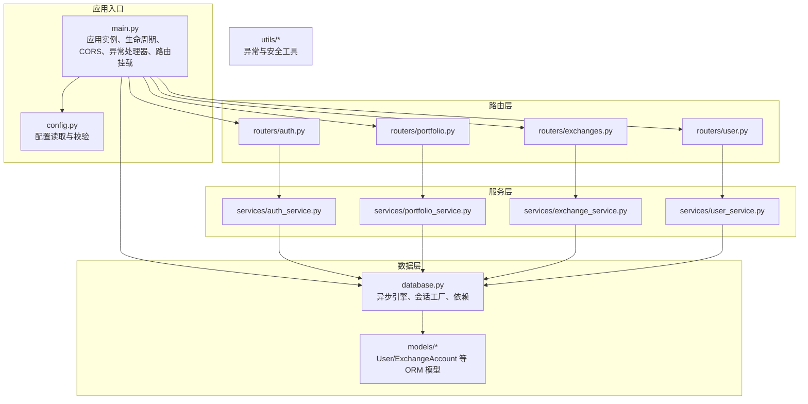
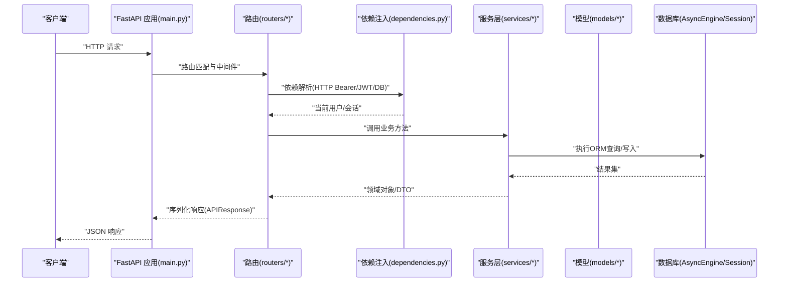
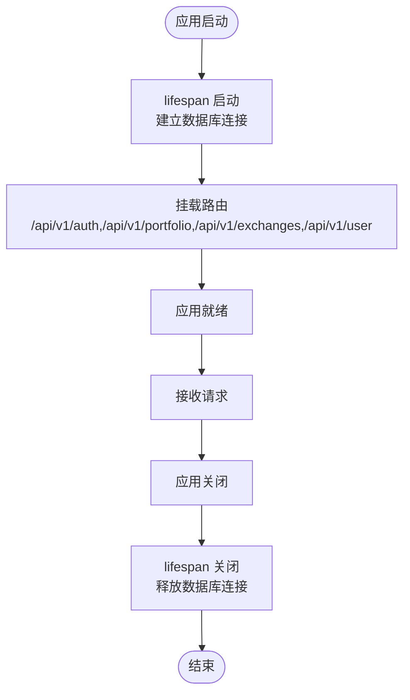
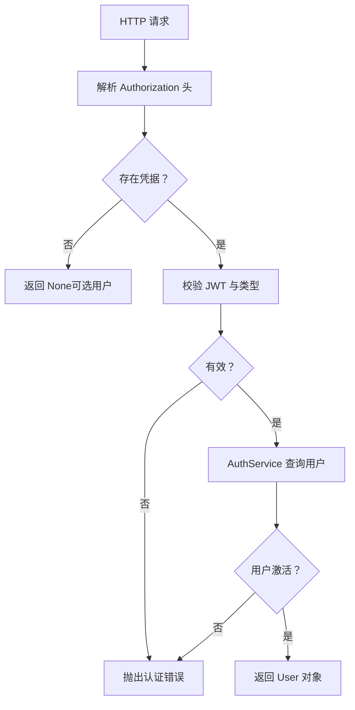
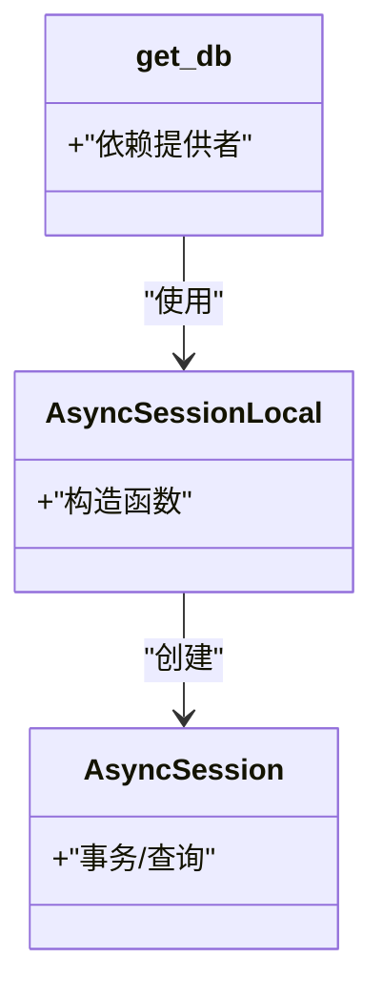
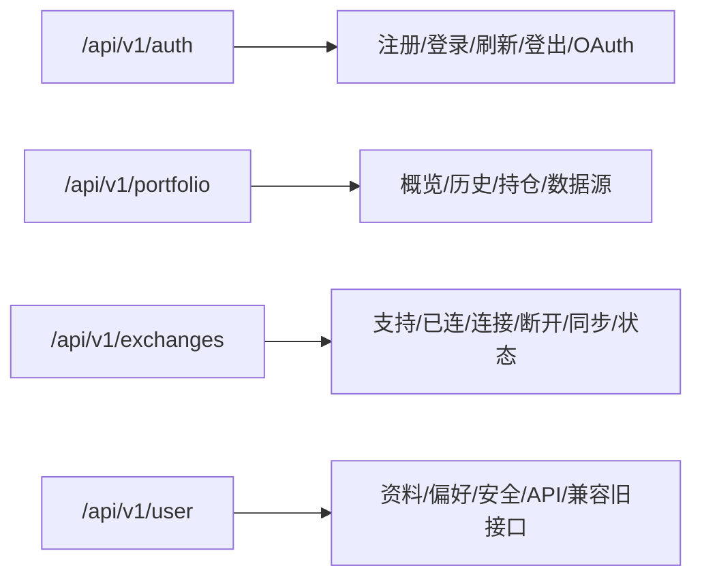
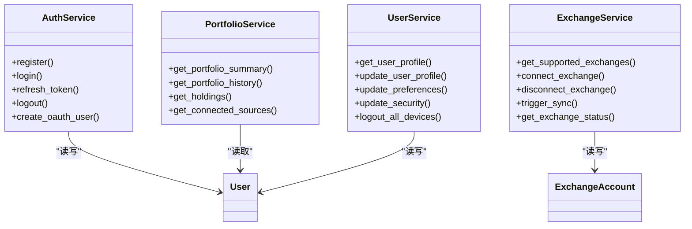
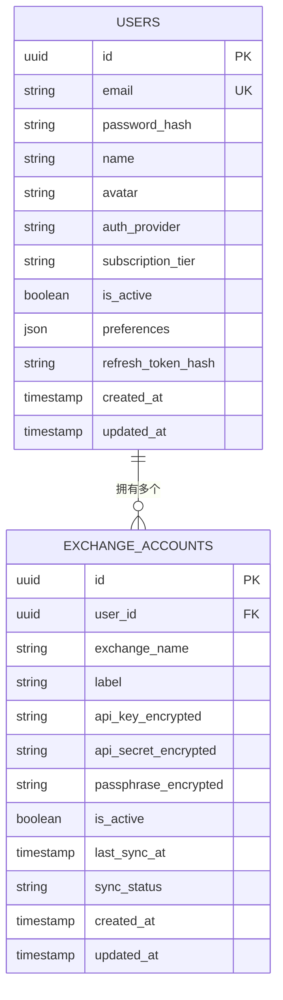
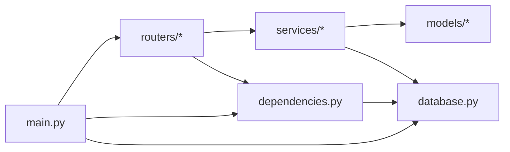

# 后端架构

<cite>
**本文引用的文件**
- [backend/app/main.py](file://backend/app/main.py)
- [backend/app/dependencies.py](file://backend/app/dependencies.py)
- [backend/app/database.py](file://backend/app/database.py)
- [backend/app/config.py](file://backend/app/config.py)
- [backend/app/utils/exceptions.py](file://backend/app/utils/exceptions.py)
- [backend/app/routers/auth.py](file://backend/app/routers/auth.py)
- [backend/app/routers/portfolio.py](file://backend/app/routers/portfolio.py)
- [backend/app/routers/exchanges.py](file://backend/app/routers/exchanges.py)
- [backend/app/routers/user.py](file://backend/app/routers/user.py)
- [backend/app/models/user.py](file://backend/app/models/user.py)
- [backend/app/models/exchange_account.py](file://backend/app/models/exchange_account.py)
- [backend/app/services/auth_service.py](file://backend/app/services/auth_service.py)
- [backend/app/services/portfolio_service.py](file://backend/app/services/portfolio_service.py)
- [backend/app/services/exchange_service.py](file://backend/app/services/exchange_service.py)
- [backend/app/services/user_service.py](file://backend/app/services/user_service.py)
</cite>

## 目录
1. [简介](#简介)
2. [项目结构](#项目结构)
3. [核心组件](#核心组件)
4. [架构总览](#架构总览)
5. [详细组件分析](#详细组件分析)
6. [依赖分析](#依赖分析)
7. [性能考虑](#性能考虑)
8. [故障排查指南](#故障排查指南)
9. [结论](#结论)
10. [附录](#附录)

## 简介
本文件面向资产聚集App后端，系统性梳理基于FastAPI的分层架构设计与实现细节，覆盖应用入口生命周期管理、CORS中间件、全局异常处理、依赖注入系统、数据库连接与会话管理、连接池配置、路由组织（认证、用户、交易所、资产）、异步编程模式、事件驱动思路与性能优化策略，并提供可操作的最佳实践与排障建议。

## 项目结构
后端采用“按功能域分层”的组织方式：
- 应用入口与配置：main.py、config.py
- 数据访问层：database.py、models/*
- 路由层：routers/*
- 服务层：services/*
- 工具与异常：utils/*
- 依赖注入：dependencies.py

图表来源
- [backend/app/main.py:1-131](file://backend/app/main.py#L1-L131)
- [backend/app/config.py:1-51](file://backend/app/config.py#L1-L51)
- [backend/app/database.py:1-33](file://backend/app/database.py#L1-L33)
- [backend/app/routers/auth.py:1-253](file://backend/app/routers/auth.py#L1-L253)
- [backend/app/routers/portfolio.py:1-217](file://backend/app/routers/portfolio.py#L1-L217)
- [backend/app/routers/exchanges.py:1-225](file://backend/app/routers/exchanges.py#L1-L225)
- [backend/app/routers/user.py:1-280](file://backend/app/routers/user.py#L1-L280)
- [backend/app/services/auth_service.py:1-247](file://backend/app/services/auth_service.py#L1-L247)
- [backend/app/services/portfolio_service.py:1-317](file://backend/app/services/portfolio_service.py#L1-L317)
- [backend/app/services/exchange_service.py:1-414](file://backend/app/services/exchange_service.py#L1-L414)
- [backend/app/services/user_service.py:1-223](file://backend/app/services/user_service.py#L1-L223)
- [backend/app/models/user.py:1-32](file://backend/app/models/user.py#L1-L32)
- [backend/app/models/exchange_account.py:1-32](file://backend/app/models/exchange_account.py#L1-L32)

章节来源
- [backend/app/main.py:1-131](file://backend/app/main.py#L1-L131)
- [backend/app/config.py:1-51](file://backend/app/config.py#L1-L51)

## 核心组件
- 应用入口与生命周期：通过lifespan钩子在启动时建立数据库连接，在关闭时释放资源；健康检查与根路径响应。
- CORS中间件：开发与生产环境动态配置允许的来源。
- 全局异常处理：自定义应用异常与通用异常统一响应格式。
- 依赖注入系统：HTTP Bearer令牌解析、JWT校验、数据库会话注入、当前用户解析。
- 数据库与会话：异步SQLAlchemy引擎、会话工厂、依赖式会话提供。
- 路由组织：认证、用户、交易所、资产组合四大模块，统一前缀。
- 服务层：封装业务逻辑，调用模型与外部适配器。
- 异常体系：统一错误类型与响应结构。

章节来源
- [backend/app/main.py:13-131](file://backend/app/main.py#L13-L131)
- [backend/app/dependencies.py:1-74](file://backend/app/dependencies.py#L1-L74)
- [backend/app/database.py:1-33](file://backend/app/database.py#L1-L33)
- [backend/app/utils/exceptions.py:1-67](file://backend/app/utils/exceptions.py#L1-L67)

## 架构总览
下图展示从客户端到服务层的典型调用链路，体现FastAPI的依赖注入与服务编排。

图表来源
- [backend/app/main.py:94-100](file://backend/app/main.py#L94-L100)
- [backend/app/dependencies.py:18-74](file://backend/app/dependencies.py#L18-L74)
- [backend/app/routers/auth.py:25-121](file://backend/app/routers/auth.py#L25-L121)
- [backend/app/services/auth_service.py:26-97](file://backend/app/services/auth_service.py#L26-L97)
- [backend/app/database.py:26-33](file://backend/app/database.py#L26-L33)
- [backend/app/models/user.py:11-32](file://backend/app/models/user.py#L11-L32)

## 详细组件分析

### 应用入口与生命周期（main.py）
- 生命周期管理：使用lifespan在启动阶段进行数据库连接准备（注释中保留了建表逻辑以供开发环境使用），关闭时释放引擎。
- CORS中间件：根据DEBUG与ALLOWED_ORIGINS动态配置，支持开发多端口与生产白名单。
- 全局异常处理：自定义应用异常与通用异常分别映射为统一JSON响应。
- 路由挂载：统一API前缀，包含认证、资产组合、交易所、用户四个模块。
- 健康检查与根路径：提供健康状态与文档入口。

图表来源
- [backend/app/main.py:13-131](file://backend/app/main.py#L13-L131)

章节来源
- [backend/app/main.py:13-131](file://backend/app/main.py#L13-L131)

### 依赖注入系统（dependencies.py）
- 安全方案：HTTP Bearer自动错误处理（auto_error=False）。
- 当前用户解析：从Authorization头提取凭据，解码JWT，校验类型与有效性，查询数据库获取用户并检查激活状态。
- 可选用户：在缺少凭据或认证失败时返回None，用于匿名/半匿名场景。
- 依赖链：依赖security（HTTPBearer）与get_db（AsyncSession）。

图表来源
- [backend/app/dependencies.py:18-74](file://backend/app/dependencies.py#L18-L74)
- [backend/app/services/auth_service.py:154-165](file://backend/app/services/auth_service.py#L154-L165)

章节来源
- [backend/app/dependencies.py:1-74](file://backend/app/dependencies.py#L1-L74)

### 数据库连接与会话管理（database.py）
- 异步引擎：基于asyncpg驱动，echo可随DEBUG开启。
- 会话工厂：AsyncSessionLocal，配置expire_on_commit、autoflush、autocommit等。
- 会话依赖：上下文管理器提供单次请求内复用的AsyncSession，并在finally中关闭。

图表来源
- [backend/app/database.py:7-33](file://backend/app/database.py#L7-L33)

章节来源
- [backend/app/database.py:1-33](file://backend/app/database.py#L1-L33)

### 配置管理（config.py）
- 设置项：应用名、调试模式、API前缀、数据库URL、Redis、JWT、加密密钥、CORS来源、第三方API地址。
- 运行时校验：JWT与加密密钥在生产必须显式设置，否则抛错；开发模式可使用默认值。

章节来源
- [backend/app/config.py:1-51](file://backend/app/config.py#L1-L51)

### 异常体系（utils/exceptions.py）
- 统一基类：AppException，携带状态码、消息、错误码与细节。
- 子类覆盖：认证、未找到、验证、交易所连接等专用错误。
- 全局异常处理器：main.py中注册，将AppException与通用异常转为一致的JSON响应。

章节来源
- [backend/app/utils/exceptions.py:1-67](file://backend/app/utils/exceptions.py#L1-L67)
- [backend/app/main.py:66-91](file://backend/app/main.py#L66-L91)

### 路由组织与API设计
- 认证模块（/api/v1/auth）：注册、登录、刷新、登出、OAuth（Google/Apple）。
- 资产组合模块（/api/v1/portfolio）：概览、历史净值、持仓、数据源、兼容旧接口。
- 交易所模块（/api/v1/exchanges）：支持列表、已连列表、连接/断开、手动同步、状态查询、余额查询占位。
- 用户模块（/api/v1/user）：个人资料、偏好设置、安全设置、已连API、兼容旧接口。

图表来源
- [backend/app/routers/auth.py:22-253](file://backend/app/routers/auth.py#L22-L253)
- [backend/app/routers/portfolio.py:26-217](file://backend/app/routers/portfolio.py#L26-L217)
- [backend/app/routers/exchanges.py:20-225](file://backend/app/routers/exchanges.py#L20-L225)
- [backend/app/routers/user.py:19-280](file://backend/app/routers/user.py#L19-L280)

章节来源
- [backend/app/routers/auth.py:1-253](file://backend/app/routers/auth.py#L1-L253)
- [backend/app/routers/portfolio.py:1-217](file://backend/app/routers/portfolio.py#L1-L217)
- [backend/app/routers/exchanges.py:1-225](file://backend/app/routers/exchanges.py#L1-L225)
- [backend/app/routers/user.py:1-280](file://backend/app/routers/user.py#L1-L280)

### 服务层与业务逻辑
- 认证服务（AuthService）：注册、登录、刷新令牌、登出、OAuth用户创建、令牌生成与存储。
- 资产组合服务（PortfolioService）：概览、历史、持仓、数据源的Mock实现与预留真实聚合逻辑。
- 交易所服务（ExchangeService）：支持交易所清单、连接验证与加密、软删除断开、手动同步、状态查询。
- 用户服务（UserService）：用户资料、偏好设置、安全设置、登出所有设备。

图表来源
- [backend/app/services/auth_service.py:20-247](file://backend/app/services/auth_service.py#L20-L247)
- [backend/app/services/portfolio_service.py:31-317](file://backend/app/services/portfolio_service.py#L31-L317)
- [backend/app/services/exchange_service.py:26-414](file://backend/app/services/exchange_service.py#L26-L414)
- [backend/app/services/user_service.py:19-223](file://backend/app/services/user_service.py#L19-L223)
- [backend/app/models/user.py:11-32](file://backend/app/models/user.py#L11-L32)
- [backend/app/models/exchange_account.py:11-32](file://backend/app/models/exchange_account.py#L11-L32)

章节来源
- [backend/app/services/auth_service.py:1-247](file://backend/app/services/auth_service.py#L1-L247)
- [backend/app/services/portfolio_service.py:1-317](file://backend/app/services/portfolio_service.py#L1-L317)
- [backend/app/services/exchange_service.py:1-414](file://backend/app/services/exchange_service.py#L1-L414)
- [backend/app/services/user_service.py:1-223](file://backend/app/services/user_service.py#L1-L223)

### 模型与关系
- User：用户主表，包含邮箱、密码哈希、OAuth来源、订阅等级、偏好设置、刷新令牌哈希等。
- ExchangeAccount：交易所账户表，关联用户，存储加密的API凭据与同步状态。

图表来源
- [backend/app/models/user.py:11-32](file://backend/app/models/user.py#L11-L32)
- [backend/app/models/exchange_account.py:11-32](file://backend/app/models/exchange_account.py#L11-L32)

章节来源
- [backend/app/models/user.py:1-32](file://backend/app/models/user.py#L1-L32)
- [backend/app/models/exchange_account.py:1-32](file://backend/app/models/exchange_account.py#L1-L32)

## 依赖分析
- 组件耦合：路由依赖服务，服务依赖数据库会话与模型；依赖注入贯穿请求生命周期。
- 外部依赖：FastAPI、SQLAlchemy Async、Pydantic Settings、JWKS（用于JWT）、HTTPX（OAuth验证）。
- 循环依赖：当前结构未见循环导入；如扩展适配器需注意避免循环引用。

图表来源
- [backend/app/main.py:9-100](file://backend/app/main.py#L9-L100)
- [backend/app/dependencies.py:1-74](file://backend/app/dependencies.py#L1-L74)
- [backend/app/database.py:1-33](file://backend/app/database.py#L1-L33)
- [backend/app/routers/auth.py:1-253](file://backend/app/routers/auth.py#L1-L253)
- [backend/app/routers/portfolio.py:1-217](file://backend/app/routers/portfolio.py#L1-L217)
- [backend/app/routers/exchanges.py:1-225](file://backend/app/routers/exchanges.py#L1-L225)
- [backend/app/routers/user.py:1-280](file://backend/app/routers/user.py#L1-L280)
- [backend/app/services/auth_service.py:1-247](file://backend/app/services/auth_service.py#L1-L247)
- [backend/app/services/portfolio_service.py:1-317](file://backend/app/services/portfolio_service.py#L1-L317)
- [backend/app/services/exchange_service.py:1-414](file://backend/app/services/exchange_service.py#L1-L414)
- [backend/app/services/user_service.py:1-223](file://backend/app/services/user_service.py#L1-L223)

章节来源
- [backend/app/main.py:1-131](file://backend/app/main.py#L1-L131)
- [backend/app/dependencies.py:1-74](file://backend/app/dependencies.py#L1-L74)
- [backend/app/database.py:1-33](file://backend/app/database.py#L1-L33)

## 性能考虑
- 异步优先：全程使用异步SQLAlchemy与FastAPI，减少阻塞，提升并发。
- 连接池：异步引擎默认具备连接池能力；可通过配置调整最大连接数与超时。
- 会话粒度：每个请求使用独立AsyncSession，避免跨请求共享状态。
- 缓存策略：价格与历史数据建议引入Redis缓存，降低CoinGecko与交易所API压力。
- 批量与分页：历史与持仓数据建议分页与批量查询，避免一次性加载过多。
- IO优化：OAuth与外部API调用使用异步HTTP客户端，避免阻塞事件循环。
- 事件驱动：后台同步任务（如资产聚合）建议通过消息队列或定时任务触发，避免阻塞请求线程。

## 故障排查指南
- 认证失败：检查Authorization头是否正确传递，JWT是否过期或类型不符，用户是否被禁用。
- 数据库连接失败：确认DATABASE_URL、网络可达性与权限；查看lifespan启动日志。
- 未捕获异常：确认全局异常处理器是否生效，确保自定义异常继承AppException。
- CORS问题：核对DEBUG与ALLOWED_ORIGINS配置，确认前端端口与协议一致。
- 会话泄漏：确保get_db依赖在路由层正确使用，避免绕过依赖直接创建会话。
- 令牌刷新失败：确认refresh_token哈希与旋转逻辑，检查用户是否被禁用或令牌被撤销。

章节来源
- [backend/app/main.py:66-91](file://backend/app/main.py#L66-L91)
- [backend/app/dependencies.py:18-74](file://backend/app/dependencies.py#L18-L74)
- [backend/app/utils/exceptions.py:1-67](file://backend/app/utils/exceptions.py#L1-L67)

## 结论
该后端以FastAPI为核心，结合异步SQLAlchemy与清晰的分层架构，实现了认证、用户、交易所与资产组合的模块化设计。通过依赖注入、统一异常处理与生命周期管理，系统具备良好的可维护性与扩展性。建议后续完善真实数据聚合、缓存与后台任务，以支撑高并发与实时性需求。

## 附录
- 最佳实践清单
  - 明确区分“可选用户”与“必需用户”，在路由层使用Depends(get_current_user)或get_optional_user。
  - 在服务层集中处理业务规则，避免在路由中直接操作数据库。
  - 使用统一的API响应包装（APIResponse）与错误码，便于前端处理。
  - 将敏感配置（JWT/加密密钥）置于环境变量，生产环境严格校验。
  - 对外API调用使用异步客户端，合理设置超时与重试。
  - 引入Redis缓存热点数据，降低数据库与第三方API压力。
  - 通过消息队列或定时任务执行耗时任务（如资产同步），保证请求快速返回。