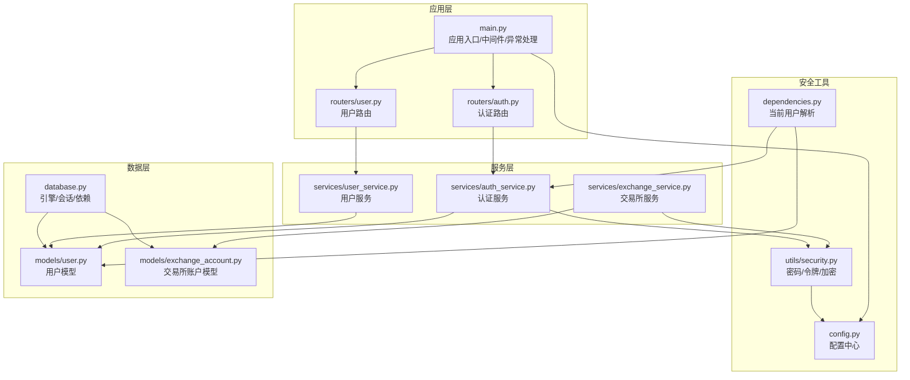
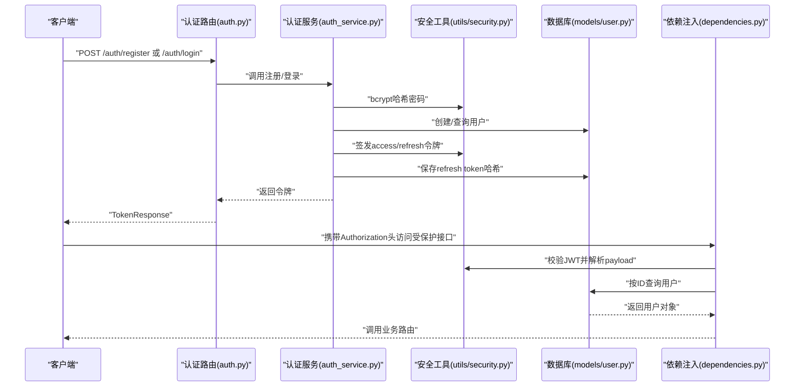
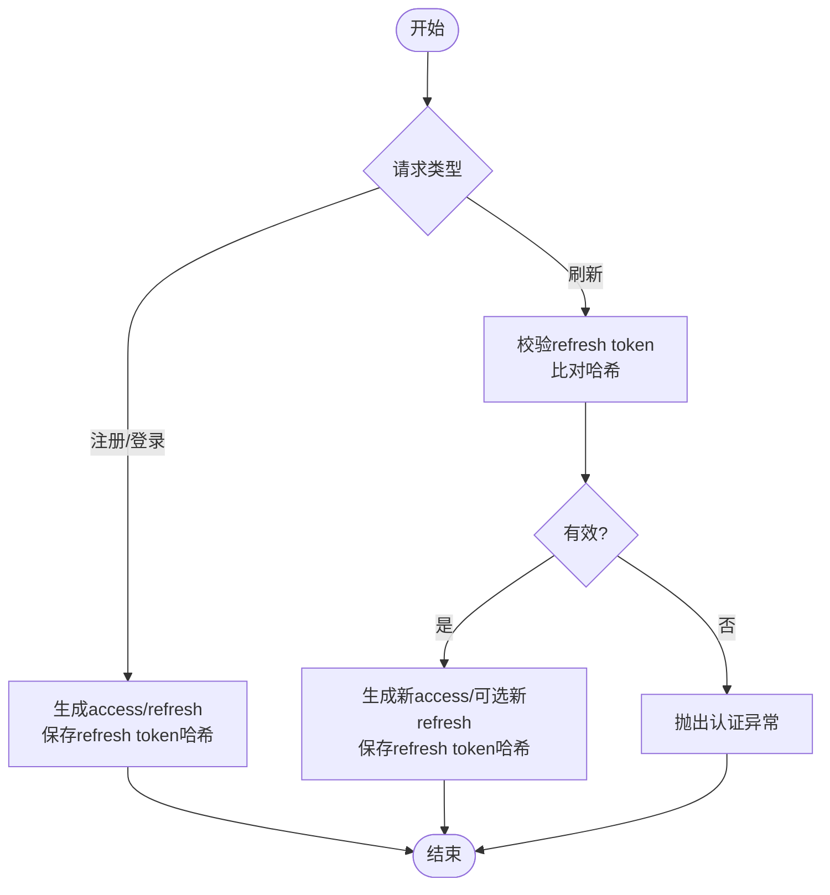
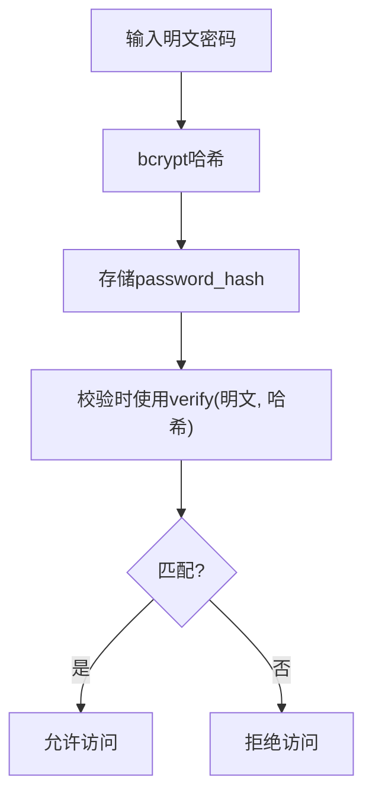
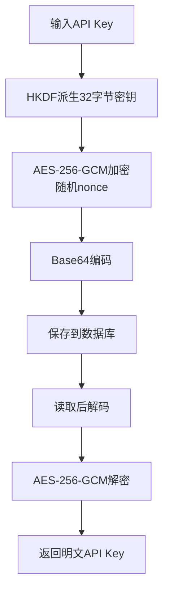
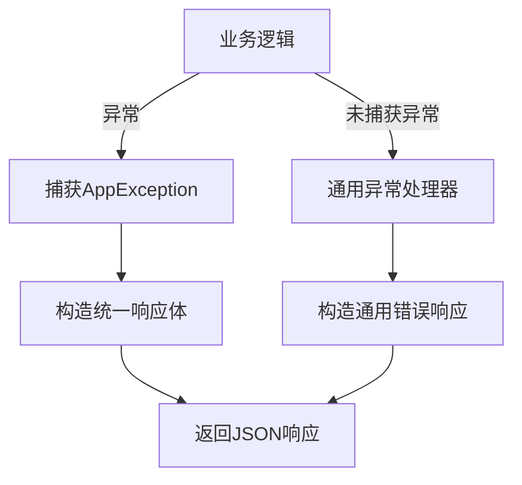
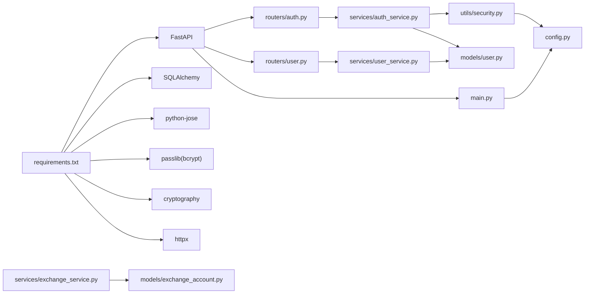

# 安全架构

<cite>
**本文引用的文件**
- [backend/app/main.py](file://backend/app/main.py)
- [backend/app/config.py](file://backend/app/config.py)
- [backend/app/utils/security.py](file://backend/app/utils/security.py)
- [backend/app/utils/exceptions.py](file://backend/app/utils/exceptions.py)
- [backend/app/models/user.py](file://backend/app/models/user.py)
- [backend/app/models/exchange_account.py](file://backend/app/models/exchange_account.py)
- [backend/app/routers/auth.py](file://backend/app/routers/auth.py)
- [backend/app/routers/user.py](file://backend/app/routers/user.py)
- [backend/app/services/auth_service.py](file://backend/app/services/auth_service.py)
- [backend/app/services/user_service.py](file://backend/app/services/user_service.py)
- [backend/app/services/exchange_service.py](file://backend/app/services/exchange_service.py)
- [backend/app/dependencies.py](file://backend/app/dependencies.py)
- [backend/app/database.py](file://backend/app/database.py)
- [backend/requirements.txt](file://backend/requirements.txt)
</cite>

## 目录
1. [简介](#简介)
2. [项目结构](#项目结构)
3. [核心组件](#核心组件)
4. [架构总览](#架构总览)
5. [详细组件分析](#详细组件分析)
6. [依赖分析](#依赖分析)
7. [性能考虑](#性能考虑)
8. [故障排查指南](#故障排查指南)
9. [结论](#结论)
10. [附录](#附录)

## 简介
本文件面向“资产聚集App”的后端安全架构，系统化梳理身份认证与授权、令牌生成与刷新、密码与敏感数据加密、API安全防护（CORS、限流与输入校验）、传输安全（HTTPS与通信协议）、访问控制与审计、异常处理与错误信息过滤、威胁建模与漏洞防护最佳实践，以及安全配置检查清单与应急响应预案。文档在技术深度与可读性之间取得平衡，既适用于开发者也便于非技术读者理解。

## 项目结构
后端采用FastAPI + SQLAlchemy异步ORM + PostgreSQL的典型Python微服务架构。安全相关能力主要集中在以下模块：
- 应用入口与全局中间件：CORS、异常处理
- 配置中心：JWT、加密、CORS、数据库等参数
- 安全工具：密码哈希、JWT签发/校验、API Key对称加密
- 认证路由与服务：注册/登录/刷新/登出/OAuth
- 依赖注入：基于Bearer Token的当前用户解析
- 数据模型：用户与交易所账户凭证的持久化
- 用户服务：偏好与安全设置管理
- 交易所服务：API Key加密存储

图表来源
- [backend/app/main.py:1-131](file://backend/app/main.py#L1-L131)
- [backend/app/routers/auth.py:1-287](file://backend/app/routers/auth.py#L1-L287)
- [backend/app/routers/user.py](file://backend/app/routers/user.py)
- [backend/app/services/auth_service.py:1-247](file://backend/app/services/auth_service.py#L1-L247)
- [backend/app/services/user_service.py:1-223](file://backend/app/services/user_service.py#L1-L223)
- [backend/app/services/exchange_service.py](file://backend/app/services/exchange_service.py)
- [backend/app/utils/security.py:1-104](file://backend/app/utils/security.py#L1-L104)
- [backend/app/config.py:1-51](file://backend/app/config.py#L1-L51)
- [backend/app/dependencies.py:1-74](file://backend/app/dependencies.py#L1-L74)
- [backend/app/database.py:1-33](file://backend/app/database.py#L1-L33)
- [backend/app/models/user.py:1-32](file://backend/app/models/user.py#L1-L32)
- [backend/app/models/exchange_account.py:1-32](file://backend/app/models/exchange_account.py#L1-L32)

章节来源
- [backend/app/main.py:1-131](file://backend/app/main.py#L1-L131)
- [backend/app/config.py:1-51](file://backend/app/config.py#L1-L51)
- [backend/requirements.txt:1-15](file://backend/requirements.txt#L1-L15)

## 核心组件
- 配置中心：集中管理JWT密钥、算法、过期时间、加密密钥、CORS白名单、数据库与Redis连接等。
- 安全工具：bcrypt密码哈希、JWT签发/校验、AES-256-GCM对称加密（HKDF派生密钥）。
- 认证服务：注册/登录/刷新/登出/OAuth（Google/Apple），支持邮箱密码与第三方账号。
- 依赖注入：HTTP Bearer Token解析，区分access/refresh令牌类型，校验用户状态。
- 数据模型：用户表含密码哈希与refresh token哈希；交易所账户表对API Key进行加密存储。
- 异常体系：统一的业务异常类型，配合全局异常处理器输出标准化错误响应。

章节来源
- [backend/app/config.py:17-44](file://backend/app/config.py#L17-L44)
- [backend/app/utils/security.py:14-104](file://backend/app/utils/security.py#L14-L104)
- [backend/app/services/auth_service.py:20-247](file://backend/app/services/auth_service.py#L20-L247)
- [backend/app/dependencies.py:14-74](file://backend/app/dependencies.py#L14-L74)
- [backend/app/models/user.py:11-32](file://backend/app/models/user.py#L11-L32)
- [backend/app/models/exchange_account.py:11-32](file://backend/app/models/exchange_account.py#L11-L32)
- [backend/app/utils/exceptions.py:4-67](file://backend/app/utils/exceptions.py#L4-L67)

## 架构总览
下图展示认证与授权的关键交互流程：客户端发起注册/登录，服务端生成access/refresh令牌并持久化refresh token哈希；后续受保护接口通过Bearer Token访问，依赖注入解析当前用户并执行业务逻辑。

图表来源
- [backend/app/routers/auth.py:26-287](file://backend/app/routers/auth.py#L26-L287)
- [backend/app/services/auth_service.py:26-247](file://backend/app/services/auth_service.py#L26-L247)
- [backend/app/utils/security.py:18-59](file://backend/app/utils/security.py#L18-L59)
- [backend/app/models/user.py:11-32](file://backend/app/models/user.py#L11-L32)
- [backend/app/dependencies.py:18-56](file://backend/app/dependencies.py#L18-L56)

## 详细组件分析

### 身份认证与授权机制
- 令牌类型与生命周期
  - Access Token：短期有效，用于访问受保护资源。
  - Refresh Token：长期有效但受控，用于轮换Access Token。
- 令牌生成与校验
  - 使用对称算法签发与验证，密钥由配置中心提供。
  - payload中包含类型标识与用户标识，依赖注入时严格校验类型与有效性。
- 刷新策略与撤销
  - 服务端不存储明文refresh token，仅存储其哈希。
  - 支持单设备登出（清空当前用户refresh token哈希）与全部设备登出（强制失效所有refresh token）。
- OAuth集成
  - Google：通过远程端点验证ID Token。
  - Apple：拉取公钥集合，按kid匹配公钥，使用RS256验证签名并校验aud/issuer。

图表来源
- [backend/app/services/auth_service.py:99-202](file://backend/app/services/auth_service.py#L99-L202)
- [backend/app/utils/security.py:28-59](file://backend/app/utils/security.py#L28-L59)
- [backend/app/models/user.py:23](file://backend/app/models/user.py#L23)

章节来源
- [backend/app/routers/auth.py:26-287](file://backend/app/routers/auth.py#L26-L287)
- [backend/app/services/auth_service.py:20-247](file://backend/app/services/auth_service.py#L20-L247)
- [backend/app/dependencies.py:18-56](file://backend/app/dependencies.py#L18-L56)
- [backend/app/utils/security.py:28-59](file://backend/app/utils/security.py#L28-L59)
- [backend/app/models/user.py:11-32](file://backend/app/models/user.py#L11-L32)

### 密码加密与存储
- 哈希算法：bcrypt，自动处理盐值，具备抗彩虹表与计算成本可调特性。
- 存储策略：仅存储密码哈希，不保存明文或可逆形式。
- OAuth用户：不绑定本地密码哈希，避免不必要的哈希存储。

图表来源
- [backend/app/utils/security.py:18-25](file://backend/app/utils/security.py#L18-L25)
- [backend/app/models/user.py:16](file://backend/app/models/user.py#L16)

章节来源
- [backend/app/utils/security.py:14-25](file://backend/app/utils/security.py#L14-L25)
- [backend/app/models/user.py:11-32](file://backend/app/models/user.py#L11-L32)

### 敏感数据加密与存储
- 加密算法：AES-256-GCM，随机nonce，带标签认证。
- 密钥派生：HKDF从任意长度密钥材料派生固定长度密钥，避免硬编码密钥。
- 存储格式：nonce + ciphertext拼接并Base64编码，便于数据库字符串字段存储。
- 使用场景：交易所API Key/Secret/Passphrase加密存储于数据库。

图表来源
- [backend/app/utils/security.py:61-104](file://backend/app/utils/security.py#L61-L104)
- [backend/app/models/exchange_account.py:18-20](file://backend/app/models/exchange_account.py#L18-L20)

章节来源
- [backend/app/utils/security.py:61-104](file://backend/app/utils/security.py#L61-L104)
- [backend/app/models/exchange_account.py:11-32](file://backend/app/models/exchange_account.py#L11-L32)
- [backend/app/services/exchange_service.py](file://backend/app/services/exchange_service.py)

### API安全防护
- CORS配置
  - 开发环境默认允许多本地端口；生产环境由配置项指定白名单，支持凭据与通配方法/头。
- 请求限制与输入验证
  - Pydantic模型提供字段范围与必填约束；路由层作为第一道防线。
  - 可在网关/反向代理层增加速率限制与请求体大小限制（建议在部署层补充）。
- 传输安全
  - 建议在反向代理层启用TLS终止与强密码套件，确保HTTPS端到端加密。

章节来源
- [backend/app/main.py:44-62](file://backend/app/main.py#L44-L62)
- [backend/app/schemas/auth.py:8-43](file://backend/app/schemas/auth.py#L8-L43)
- [backend/app/config.py:26-27](file://backend/app/config.py#L26-L27)

### 访问控制与审计
- 角色与权限
  - 当前实现未引入细粒度RBAC，用户按订阅等级与活跃状态参与访问控制。
- 资源保护
  - 通过依赖注入强制要求Bearer Token，区分access/refresh类型，校验用户是否激活。
- 审计追踪
  - 建议在鉴权与关键业务操作处记录事件（如登录、登出、刷新、登出全部设备），并结合日志系统留存。

章节来源
- [backend/app/dependencies.py:18-56](file://backend/app/dependencies.py#L18-L56)
- [backend/app/models/user.py:20](file://backend/app/models/user.py#L20)
- [backend/app/routers/auth.py:125-160](file://backend/app/routers/auth.py#L125-L160)

### 安全异常处理与错误信息过滤
- 自定义异常
  - 统一基类与细分类型（认证、未找到、验证、交易所连接等），便于前端一致处理。
- 全局异常处理器
  - 对自定义异常与通用异常分别返回标准化JSON响应，隐藏内部细节，避免信息泄露。

图表来源
- [backend/app/utils/exceptions.py:4-67](file://backend/app/utils/exceptions.py#L4-L67)
- [backend/app/main.py:65-91](file://backend/app/main.py#L65-L91)

章节来源
- [backend/app/utils/exceptions.py:4-67](file://backend/app/utils/exceptions.py#L4-L67)
- [backend/app/main.py:65-91](file://backend/app/main.py#L65-L91)

### 威胁建模与漏洞防护最佳实践
- 威胁识别
  - 令牌泄露与重放、暴力破解、CSRF（前端需配合SameSite Cookie）、敏感信息明文存储、CORS滥用。
- 防护建议
  - 强制HTTPS、短令牌生命周期、刷新令牌旋转与撤销、最小权限原则、输入严格校验、日志与监控、定期渗透测试与依赖扫描。
- 代码层面
  - 已实现：bcrypt、JWT、AES-GCM、CORS白名单、统一异常处理。
  - 建议增强：速率限制、CSRF防护、审计日志、密钥轮换、数据库凭据隔离。

章节来源
- [backend/app/utils/security.py:14-104](file://backend/app/utils/security.py#L14-L104)
- [backend/app/main.py:44-62](file://backend/app/main.py#L44-L62)
- [backend/app/utils/exceptions.py:4-67](file://backend/app/utils/exceptions.py#L4-L67)

## 依赖分析
- 外部依赖
  - FastAPI、SQLAlchemy异步、Pydantic、python-jose、passlib bcrypt、cryptography、httpx等。
- 内部耦合
  - 路由依赖服务，服务依赖安全工具与模型，依赖注入贯穿鉴权链路，数据库会话工厂提供事务边界。
- 潜在风险
  - 配置密钥在开发环境默认值可能被误用；CORS白名单需严格管控；令牌撤销依赖refresh token哈希，需保证一致性。

图表来源
- [backend/requirements.txt:1-15](file://backend/requirements.txt#L1-L15)
- [backend/app/routers/auth.py:1-287](file://backend/app/routers/auth.py#L1-L287)
- [backend/app/routers/user.py](file://backend/app/routers/user.py)
- [backend/app/services/auth_service.py:1-247](file://backend/app/services/auth_service.py#L1-L247)
- [backend/app/services/user_service.py:1-223](file://backend/app/services/user_service.py#L1-L223)
- [backend/app/services/exchange_service.py](file://backend/app/services/exchange_service.py)
- [backend/app/utils/security.py:1-104](file://backend/app/utils/security.py#L1-L104)
- [backend/app/models/user.py:1-32](file://backend/app/models/user.py#L1-L32)
- [backend/app/models/exchange_account.py:1-32](file://backend/app/models/exchange_account.py#L1-L32)
- [backend/app/config.py:1-51](file://backend/app/config.py#L1-L51)
- [backend/app/main.py:1-131](file://backend/app/main.py#L1-L131)

章节来源
- [backend/requirements.txt:1-15](file://backend/requirements.txt#L1-L15)
- [backend/app/main.py:1-131](file://backend/app/main.py#L1-L131)
- [backend/app/config.py:1-51](file://backend/app/config.py#L1-L51)

## 性能考虑
- 令牌签发/校验：使用对称算法，CPU开销低；建议在高并发场景启用连接池与异步I/O。
- 密码哈希：成本因子可调，建议在CI/CD环境评估成本因子，生产保持合理阈值。
- 数据库：异步会话减少阻塞；注意批量写入与事务边界，避免长事务锁竞争。
- 加密：AES-GCM为硬件加速友好；密钥派生结果缓存避免重复计算。

## 故障排查指南
- 认证失败
  - 检查Authorization头格式与Bearer前缀；确认令牌未过期且类型为access；核对用户是否激活。
- 刷新失败
  - 确认refresh token未被撤销（用户登出/登出全部设备）；核对服务端是否正确保存refresh token哈希。
- OAuth登录异常
  - Google/Apple端点可达性与网络超时；Apple公钥拉取与kid匹配；audience/issuer校验。
- CORS问题
  - 核对生产环境ALLOWED_ORIGINS配置；确保凭据允许与预检请求处理。
- 异常响应
  - 查看全局异常处理器返回的标准化错误体，定位具体错误码与消息。

章节来源
- [backend/app/dependencies.py:18-56](file://backend/app/dependencies.py#L18-L56)
- [backend/app/services/auth_service.py:99-140](file://backend/app/services/auth_service.py#L99-L140)
- [backend/app/routers/auth.py:163-287](file://backend/app/routers/auth.py#L163-L287)
- [backend/app/main.py:44-62](file://backend/app/main.py#L44-L62)
- [backend/app/utils/exceptions.py:4-67](file://backend/app/utils/exceptions.py#L4-L67)

## 结论
本项目在安全方面已具备良好基础：bcrypt密码哈希、JWT令牌机制、AES-GCM敏感数据加密、CORS白名单与统一异常处理。建议在部署层补充速率限制、CSRF防护、审计日志与TLS强化，并完善密钥轮换与数据库凭据隔离，以进一步提升整体安全性与合规性。

## 附录

### 安全配置检查清单
- 密钥与证书
  - 生产环境必须设置JWT_SECRET_KEY与ENCRYPTION_KEY，禁止使用默认值。
  - TLS证书与反向代理配置完成，禁用弱密码套件。
- CORS与传输
  - 生产环境ALLOWED_ORIGINS明确列出可信域名。
  - 所有接口走HTTPS，Cookie设置SameSite与Secure属性（前端配合）。
- 令牌与会话
  - Access Token短期有效；Refresh Token支持撤销与轮换。
  - 登出与登出全部设备功能可用，覆盖常见安全场景。
- 输入与防护
  - Pydantic模型字段约束生效；路由层与服务层双重校验。
  - 建议增加速率限制与WAF规则（部署层）。
- 日志与审计
  - 记录关键安全事件（登录、登出、刷新、登出全部设备）。
  - 保留足够时间窗口的日志以便追溯。

### 应急响应预案
- 事件分类
  - 凭证泄露、令牌滥用、API Key泄露、DDoS攻击、供应链攻击。
- 处置步骤
  - 快速隔离受影响实例；撤销相关refresh token；轮换密钥；回滚可疑变更；通知用户并提供补救措施。
- 回归验证
  - 修复后进行回归测试与渗透测试，确认修复有效且无副作用。