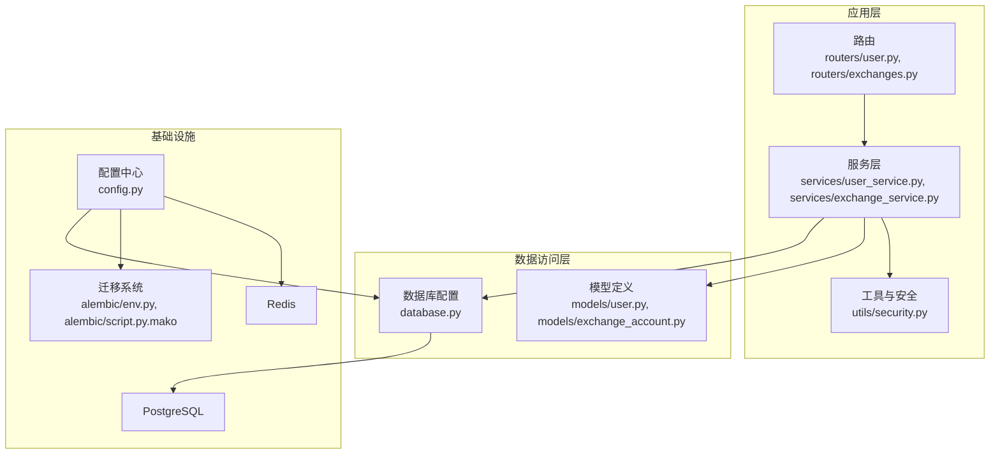
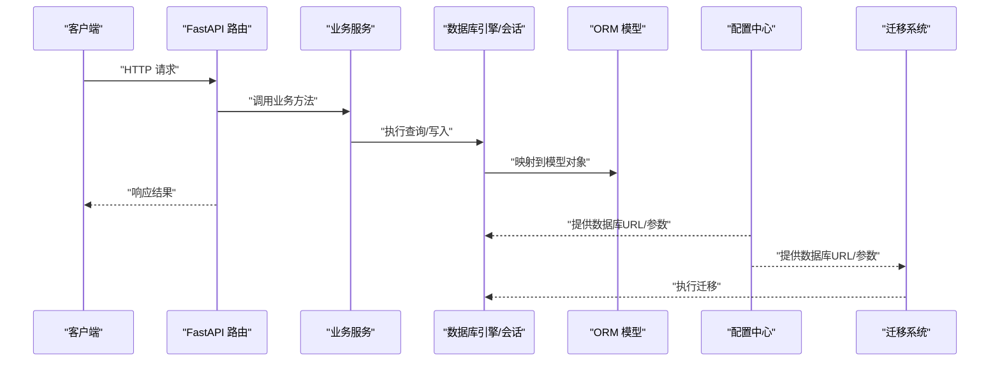
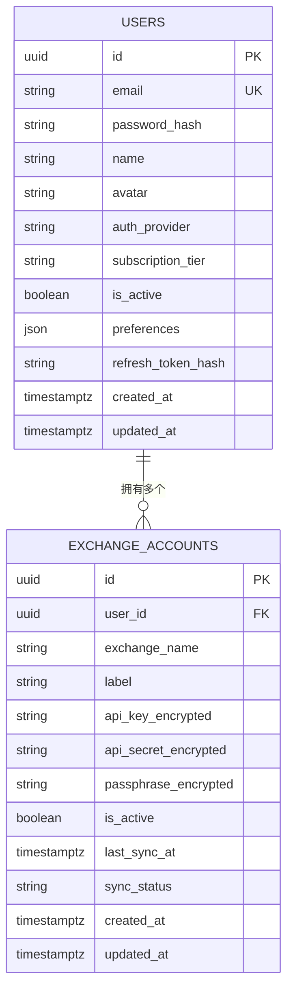
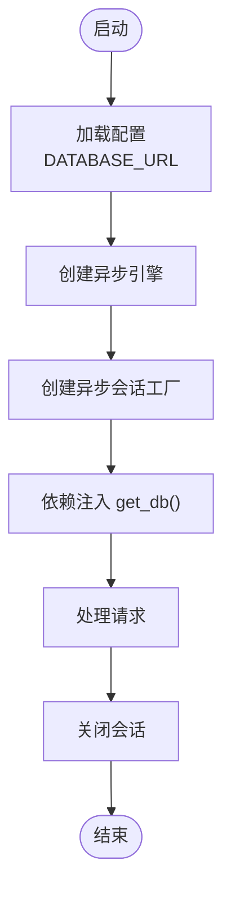
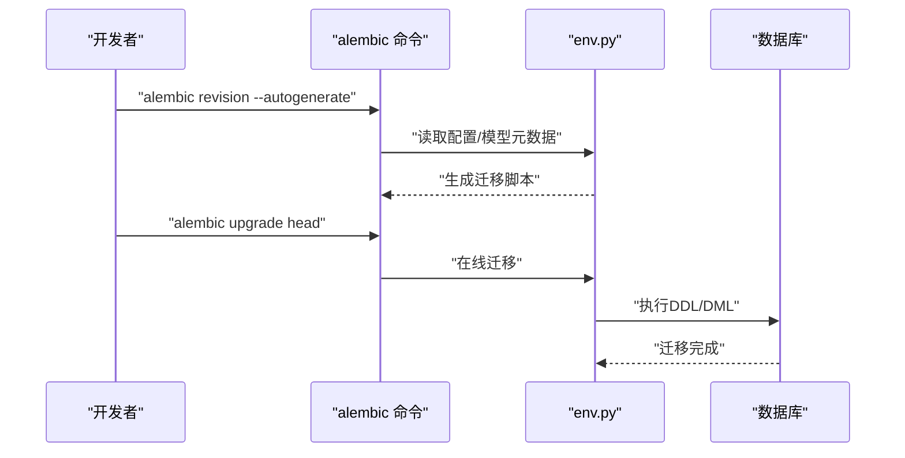
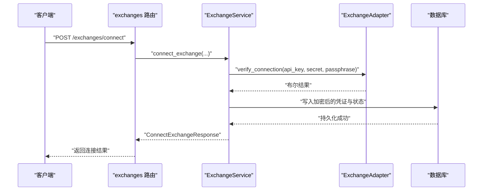
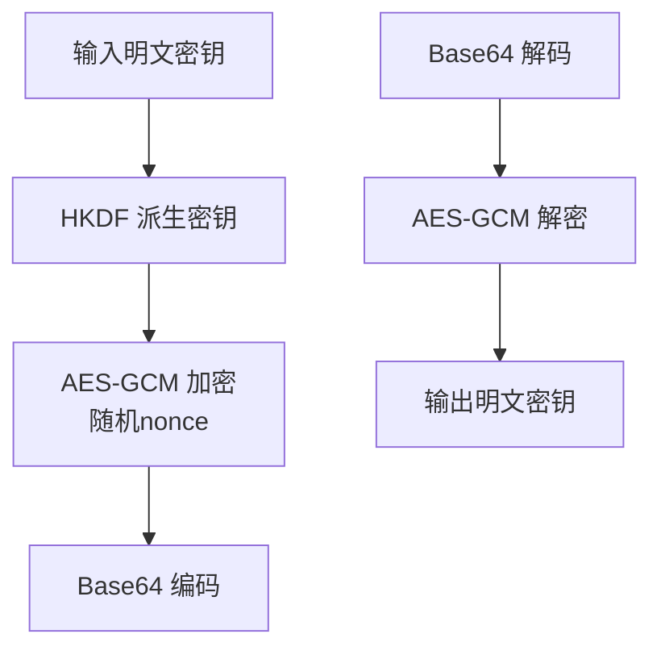
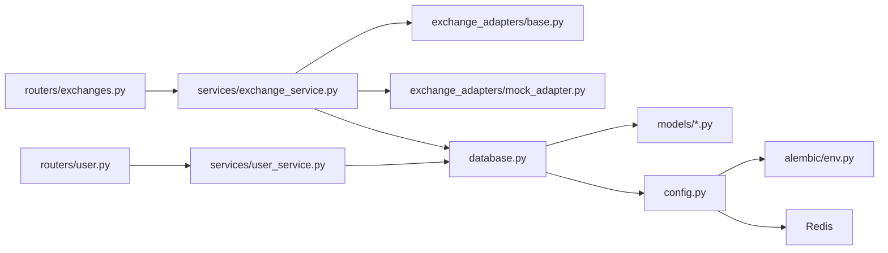

# 数据架构

<cite>
**本文引用的文件**
- [backend/app/models/__init__.py](file://backend/app/models/__init__.py)
- [backend/app/models/user.py](file://backend/app/models/user.py)
- [backend/app/models/exchange_account.py](file://backend/app/models/exchange_account.py)
- [backend/app/database.py](file://backend/app/database.py)
- [backend/app/config.py](file://backend/app/config.py)
- [backend/app/utils/security.py](file://backend/app/utils/security.py)
- [backend/app/services/exchange_service.py](file://backend/app/services/exchange_service.py)
- [backend/app/services/user_service.py](file://backend/app/services/user_service.py)
- [backend/app/services/exchange_adapters/base.py](file://backend/app/services/exchange_adapters/base.py)
- [backend/app/services/exchange_adapters/mock_adapter.py](file://backend/app/services/exchange_adapters/mock_adapter.py)
- [backend/app/routers/user.py](file://backend/app/routers/user.py)
- [backend/app/routers/exchanges.py](file://backend/app/routers/exchanges.py)
- [backend/alembic/env.py](file://backend/alembic/env.py)
- [backend/alembic/script.py.mako](file://backend/alembic/script.py.mako)
- [backend/requirements.txt](file://backend/requirements.txt)
</cite>

## 目录
1. [简介](#简介)
2. [项目结构](#项目结构)
3. [核心组件](#核心组件)
4. [架构总览](#架构总览)
5. [详细组件分析](#详细组件分析)
6. [依赖分析](#依赖分析)
7. [性能考虑](#性能考虑)
8. [故障排查指南](#故障排查指南)
9. [结论](#结论)
10. [附录](#附录)

## 简介
本文件面向资产聚集App的数据架构，系统化梳理数据库设计与ORM模型、PostgreSQL配置与优化、Alembic迁移体系、Redis缓存策略、数据同步流程、数据安全与合规、以及备份与灾备方案。内容以仓库现有实现为基础，结合可扩展的最佳实践进行说明，帮助开发者与运维人员快速理解并迭代系统。

## 项目结构
后端采用FastAPI + SQLAlchemy 2.x异步ORM + Alembic迁移 + PostgreSQL的典型架构。核心目录与职责如下：
- app/models：SQLAlchemy ORM模型定义，包含用户与交易所账户实体及其关系
- app/database.py：异步引擎与会话工厂、依赖注入
- app/config.py：统一配置读取（数据库、Redis、JWT、加密密钥等）
- app/utils/security.py：密码哈希、JWT签发与校验、API密钥加解密
- app/services/*：业务服务层（用户、交易所、适配器）
- app/routers/*：FastAPI路由层
- alembic/*：迁移环境与模板
- requirements.txt：依赖清单

图表来源
- [backend/app/routers/user.py:1-280](file://backend/app/routers/user.py#L1-L280)
- [backend/app/routers/exchanges.py:1-225](file://backend/app/routers/exchanges.py#L1-L225)
- [backend/app/services/user_service.py:1-223](file://backend/app/services/user_service.py#L1-L223)
- [backend/app/services/exchange_service.py:1-414](file://backend/app/services/exchange_service.py#L1-L414)
- [backend/app/database.py:1-33](file://backend/app/database.py#L1-L33)
- [backend/app/models/user.py:1-32](file://backend/app/models/user.py#L1-L32)
- [backend/app/models/exchange_account.py:1-32](file://backend/app/models/exchange_account.py#L1-L32)
- [backend/app/config.py:1-51](file://backend/app/config.py#L1-L51)
- [backend/alembic/env.py:1-97](file://backend/alembic/env.py#L1-L97)
- [backend/alembic/script.py.mako:1-25](file://backend/alembic/script.py.mako#L1-L25)

章节来源
- [backend/app/routers/user.py:1-280](file://backend/app/routers/user.py#L1-L280)
- [backend/app/routers/exchanges.py:1-225](file://backend/app/routers/exchanges.py#L1-L225)
- [backend/app/services/user_service.py:1-223](file://backend/app/services/user_service.py#L1-L223)
- [backend/app/services/exchange_service.py:1-414](file://backend/app/services/exchange_service.py#L1-L414)
- [backend/app/database.py:1-33](file://backend/app/database.py#L1-L33)
- [backend/app/models/__init__.py:1-5](file://backend/app/models/__init__.py#L1-L5)
- [backend/app/models/user.py:1-32](file://backend/app/models/user.py#L1-L32)
- [backend/app/models/exchange_account.py:1-32](file://backend/app/models/exchange_account.py#L1-L32)
- [backend/app/config.py:1-51](file://backend/app/config.py#L1-L51)
- [backend/alembic/env.py:1-97](file://backend/alembic/env.py#L1-L97)
- [backend/alembic/script.py.mako:1-25](file://backend/alembic/script.py.mako#L1-L25)
- [backend/requirements.txt:1-15](file://backend/requirements.txt#L1-L15)

## 核心组件
- 异步数据库引擎与会话：基于SQLAlchemy 2.x异步驱动，提供依赖注入式会话管理
- ORM模型：用户与交易所账户，定义主键、外键、索引、时间戳与级联删除
- 配置中心：集中管理数据库URL、Redis地址、JWT参数、加密密钥、CORS等
- 安全工具：密码哈希、JWT签发/校验、API密钥AES-GCM加解密
- 业务服务：用户资料、偏好、安全设置；交易所连接、断开、手动同步、状态查询
- 适配器抽象：统一交易所API接入接口，Mock适配器用于开发测试
- 迁移系统：Alembic离线/在线迁移，自动发现模型元数据

章节来源
- [backend/app/database.py:1-33](file://backend/app/database.py#L1-L33)
- [backend/app/models/user.py:1-32](file://backend/app/models/user.py#L1-L32)
- [backend/app/models/exchange_account.py:1-32](file://backend/app/models/exchange_account.py#L1-L32)
- [backend/app/config.py:1-51](file://backend/app/config.py#L1-L51)
- [backend/app/utils/security.py:1-97](file://backend/app/utils/security.py#L1-L97)
- [backend/app/services/user_service.py:1-223](file://backend/app/services/user_service.py#L1-L223)
- [backend/app/services/exchange_service.py:1-414](file://backend/app/services/exchange_service.py#L1-L414)
- [backend/app/services/exchange_adapters/base.py:1-73](file://backend/app/services/exchange_adapters/base.py#L1-L73)
- [backend/app/services/exchange_adapters/mock_adapter.py:1-110](file://backend/app/services/exchange_adapters/mock_adapter.py#L1-L110)
- [backend/alembic/env.py:1-97](file://backend/alembic/env.py#L1-L97)

## 架构总览
下图展示从路由到服务、模型与数据库的整体调用链路，以及配置与迁移系统的参与位置。

图表来源
- [backend/app/routers/user.py:1-280](file://backend/app/routers/user.py#L1-L280)
- [backend/app/routers/exchanges.py:1-225](file://backend/app/routers/exchanges.py#L1-L225)
- [backend/app/services/user_service.py:1-223](file://backend/app/services/user_service.py#L1-L223)
- [backend/app/services/exchange_service.py:1-414](file://backend/app/services/exchange_service.py#L1-L414)
- [backend/app/database.py:1-33](file://backend/app/database.py#L1-L33)
- [backend/app/config.py:1-51](file://backend/app/config.py#L1-L51)
- [backend/alembic/env.py:1-97](file://backend/alembic/env.py#L1-L97)

## 详细组件分析

### 数据库与ORM模型
- 用户模型（users）
  - 主键：UUID
  - 唯一索引：email
  - JSON字段：preferences（用户偏好设置）
  - 时间戳：created_at/updated_at
  - 关系：一对多（用户-交易所账户），级联删除孤儿记录
- 交易所账户模型（exchange_accounts）
  - 主键：UUID
  - 外键：user_id → users.id
  - 加密字段：api_key_encrypted、api_secret_encrypted、passphrase_encrypted
  - 状态字段：is_active、sync_status、last_sync_at
  - 时间戳：created_at/updated_at
  - 关系：多对一（交易所账户-用户）

图表来源
- [backend/app/models/user.py:1-32](file://backend/app/models/user.py#L1-L32)
- [backend/app/models/exchange_account.py:1-32](file://backend/app/models/exchange_account.py#L1-L32)

章节来源
- [backend/app/models/user.py:1-32](file://backend/app/models/user.py#L1-L32)
- [backend/app/models/exchange_account.py:1-32](file://backend/app/models/exchange_account.py#L1-L32)
- [backend/app/models/__init__.py:1-5](file://backend/app/models/__init__.py#L1-L5)

### 数据库配置与连接池
- 使用SQLAlchemy异步引擎，支持echo调试输出
- 会话工厂配置：非过期提交、非自动flush、非自动commit，显式管理事务
- 依赖注入：get_db提供异步上下文会话，确保生命周期正确释放
- 配置来源：settings.DATABASE_URL（来自环境变量文件）

图表来源
- [backend/app/database.py:1-33](file://backend/app/database.py#L1-L33)
- [backend/app/config.py:1-51](file://backend/app/config.py#L1-L51)

章节来源
- [backend/app/database.py:1-33](file://backend/app/database.py#L1-L33)
- [backend/app/config.py:1-51](file://backend/app/config.py#L1-L51)

### Alembic迁移系统
- 离线/在线迁移：env.py同时支持离线字符串注入与异步在线迁移
- 自动发现模型：target_metadata = Base.metadata
- 迁移脚本模板：script.py.mako提供标准升级/降级骨架
- 版本管理：通过命令行生成版本文件，维护数据库演进历史

图表来源
- [backend/alembic/env.py:1-97](file://backend/alembic/env.py#L1-L97)
- [backend/alembic/script.py.mako:1-25](file://backend/alembic/script.py.mako#L1-L25)

章节来源
- [backend/alembic/env.py:1-97](file://backend/alembic/env.py#L1-L97)
- [backend/alembic/script.py.mako:1-25](file://backend/alembic/script.py.mako#L1-L25)

### Redis缓存架构
- 配置项：REDIS_URL
- 设计原则
  - 缓存策略：热点数据（如用户偏好、公开市场数据）短期缓存
  - 过期机制：按业务场景设置TTL，避免陈旧数据
  - 性能优化：批量读写、键命名空间隔离、合理分区
- 注意事项：当前代码未直接体现Redis使用，建议在路由或服务层引入并统一管理连接与异常

章节来源
- [backend/app/config.py:1-51](file://backend/app/config.py#L1-L51)
- [backend/requirements.txt:1-15](file://backend/requirements.txt#L1-L15)

### 数据同步机制
- 适配器抽象：ExchangeAdapter定义统一接口（连接验证、现货/合约余额获取）
- Mock适配器：开发测试用，始终返回成功与示例数据
- 业务流程
  - 连接：校验交易所支持性与凭证，加密存储，创建账户记录
  - 断开：软删除（is_active=false）
  - 手动同步：更新状态为“同步中”，完成后记录时间与状态
  - 状态查询：返回连接状态、最后同步时间、余额条目数（占位）

图表来源
- [backend/app/routers/exchanges.py:1-225](file://backend/app/routers/exchanges.py#L1-L225)
- [backend/app/services/exchange_service.py:1-414](file://backend/app/services/exchange_service.py#L1-L414)
- [backend/app/services/exchange_adapters/base.py:1-73](file://backend/app/services/exchange_adapters/base.py#L1-L73)
- [backend/app/services/exchange_adapters/mock_adapter.py:1-110](file://backend/app/services/exchange_adapters/mock_adapter.py#L1-L110)

章节来源
- [backend/app/services/exchange_service.py:1-414](file://backend/app/services/exchange_service.py#L1-L414)
- [backend/app/services/exchange_adapters/base.py:1-73](file://backend/app/services/exchange_adapters/base.py#L1-L73)
- [backend/app/services/exchange_adapters/mock_adapter.py:1-110](file://backend/app/services/exchange_adapters/mock_adapter.py#L1-L110)
- [backend/app/routers/exchanges.py:1-225](file://backend/app/routers/exchanges.py#L1-L225)

### 数据安全与合规
- 敏感数据加密
  - API密钥：AES-256-GCM，HKDF派生密钥，随机nonce，Base64编码组合
  - 密码：bcrypt哈希
- 访问控制
  - JWT：签名算法、有效期、类型标识
  - 会话：刷新令牌哈希用于强制登出所有设备
- 审计日志
  - 建议：在路由/服务层增加操作审计（用户ID、时间、动作、目标、结果）

图表来源
- [backend/app/utils/security.py:1-97](file://backend/app/utils/security.py#L1-L97)

章节来源
- [backend/app/utils/security.py:1-97](file://backend/app/utils/security.py#L1-L97)
- [backend/app/config.py:1-51](file://backend/app/config.py#L1-L51)

### 用户与偏好设置
- 用户资料：基本信息、订阅等级、认证方式
- 偏好设置：基础货币、刷新间隔、生物识别、市场提醒
- 安全设置：生物识别、双因子开关与方法
- 服务层提供读取与更新逻辑，异常统一抛出

章节来源
- [backend/app/services/user_service.py:1-223](file://backend/app/services/user_service.py#L1-L223)
- [backend/app/routers/user.py:1-280](file://backend/app/routers/user.py#L1-L280)

## 依赖分析
- 组件耦合
  - 路由依赖服务，服务依赖数据库会话与模型
  - 安全工具被服务与适配器间接使用
  - 配置中心贯穿引擎、迁移与外部服务（Redis）
- 外部依赖
  - SQLAlchemy异步、Alembic、asyncpg、Redis、JWTS、bcrypt、cryptography

图表来源
- [backend/app/routers/user.py:1-280](file://backend/app/routers/user.py#L1-L280)
- [backend/app/routers/exchanges.py:1-225](file://backend/app/routers/exchanges.py#L1-L225)
- [backend/app/services/user_service.py:1-223](file://backend/app/services/user_service.py#L1-L223)
- [backend/app/services/exchange_service.py:1-414](file://backend/app/services/exchange_service.py#L1-L414)
- [backend/app/services/exchange_adapters/base.py:1-73](file://backend/app/services/exchange_adapters/base.py#L1-L73)
- [backend/app/services/exchange_adapters/mock_adapter.py:1-110](file://backend/app/services/exchange_adapters/mock_adapter.py#L1-L110)
- [backend/app/database.py:1-33](file://backend/app/database.py#L1-L33)
- [backend/app/models/user.py:1-32](file://backend/app/models/user.py#L1-L32)
- [backend/app/models/exchange_account.py:1-32](file://backend/app/models/exchange_account.py#L1-L32)
- [backend/app/config.py:1-51](file://backend/app/config.py#L1-L51)
- [backend/alembic/env.py:1-97](file://backend/alembic/env.py#L1-L97)

章节来源
- [backend/requirements.txt:1-15](file://backend/requirements.txt#L1-L15)

## 性能考虑
- 数据库
  - 异步I/O：利用SQLAlchemy异步引擎提升并发
  - 连接池：生产环境建议通过驱动参数与连接字符串优化池大小与超时
  - 索引：email唯一索引已存在；可根据查询模式添加复合索引（如用户活跃状态、交易所名称）
  - 查询：尽量使用select只加载必要字段，避免N+1查询
- 缓存
  - Redis：对高频读取的用户偏好、公开行情设置短TTL
  - 命名空间：按功能模块划分键空间，便于清理与监控
- 同步
  - 批量任务：将真实交易所拉取放入后台任务队列，避免阻塞请求
  - 并发控制：限制同一账户的并发同步，防止API限流
- 安全
  - 密钥派生与加解密：使用HKDF与随机nonce，避免重复使用
  - JWT：短有效期与刷新令牌配合，减少泄露风险

## 故障排查指南
- 数据库连接失败
  - 检查DATABASE_URL格式与可达性
  - 查看DEBUG输出与连接池参数
- 迁移失败
  - 确认Alembic配置指向正确数据库URL
  - 在线迁移需确保异步引擎可用
- JWT/加密异常
  - 校验JWT_SECRET_KEY与ENCRYPTION_KEY是否设置且符合要求
  - 检查密钥长度与Base64编码一致性
- 交易所连接问题
  - 确认凭证加密流程与适配器返回值
  - 检查is_active与sync_status状态流转

章节来源
- [backend/app/config.py:1-51](file://backend/app/config.py#L1-L51)
- [backend/app/utils/security.py:1-97](file://backend/app/utils/security.py#L1-L97)
- [backend/alembic/env.py:1-97](file://backend/alembic/env.py#L1-L97)

## 结论
该数据架构以异步ORM与清晰的服务层组织为核心，结合Alembic迁移与安全工具，满足用户与交易所账户管理、凭证加密、以及可扩展的同步流程。建议后续补充Redis缓存、后台任务队列、更完善的索引与查询优化，并在路由/服务层完善审计日志与错误处理。

## 附录
- 配置项速览
  - 数据库：DATABASE_URL
  - Redis：REDIS_URL
  - JWT：JWT_SECRET_KEY、JWT_ALGORITHM、ACCESS_TOKEN_EXPIRE_MINUTES、REFRESH_TOKEN_EXPIRE_DAYS
  - 加密：ENCRYPTION_KEY
  - CORS：ALLOWED_ORIGINS
  - 第三方：COINGECKO_API_URL

章节来源
- [backend/app/config.py:1-51](file://backend/app/config.py#L1-L51)