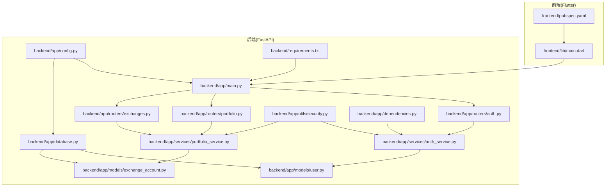
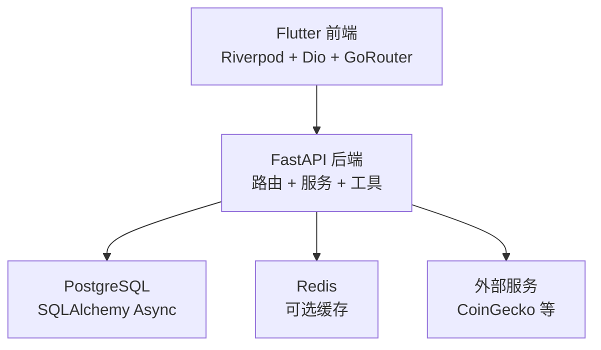
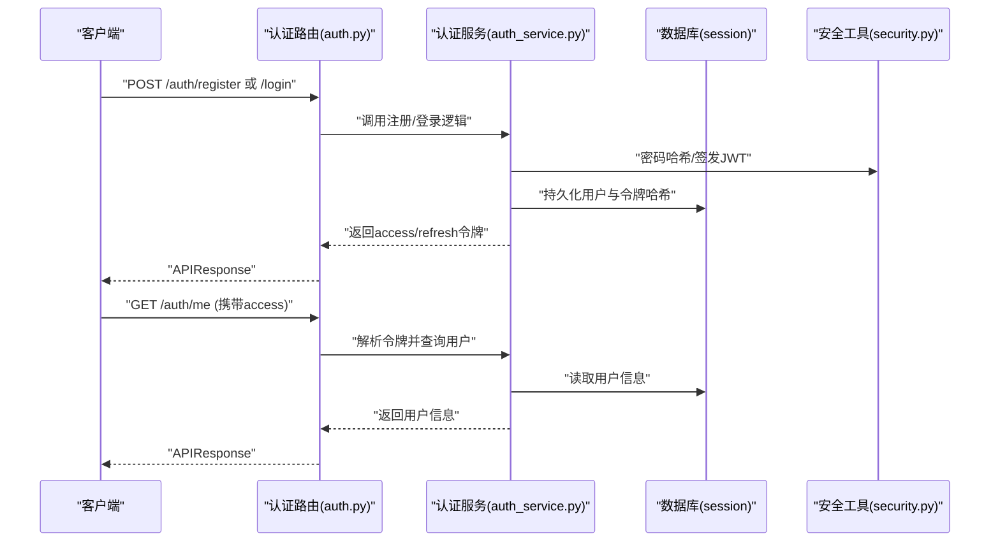
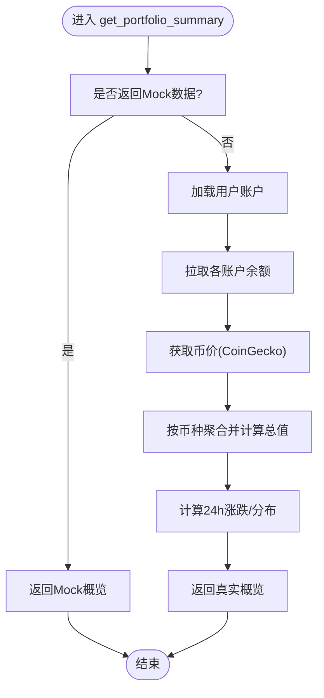
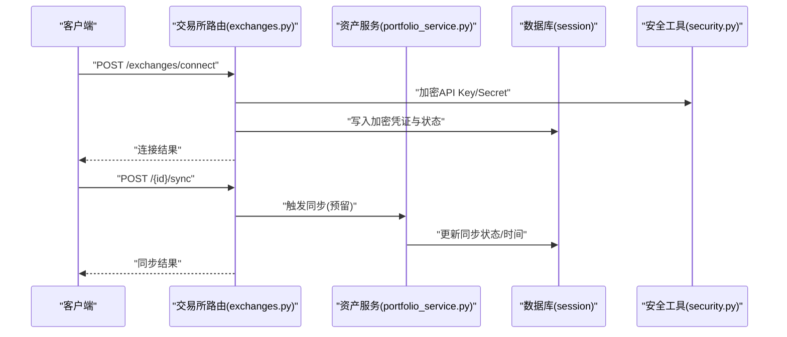
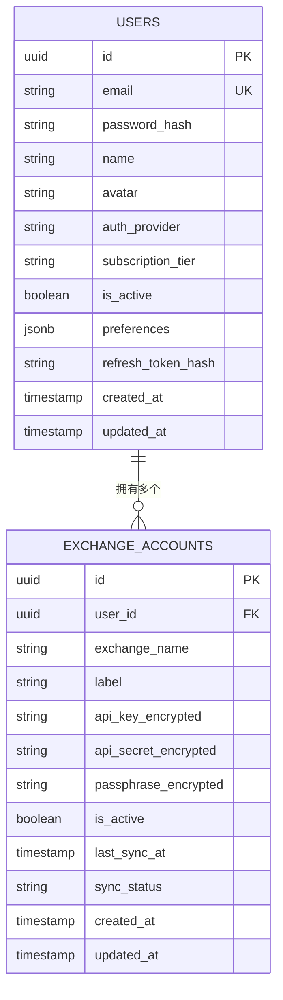
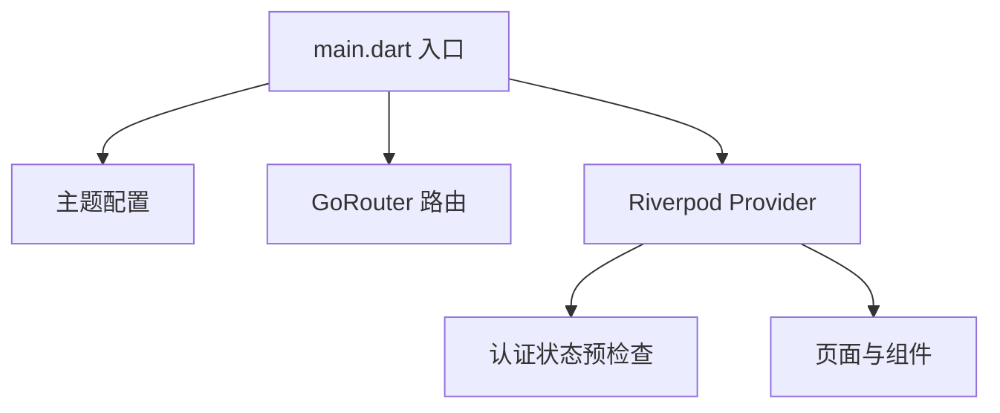
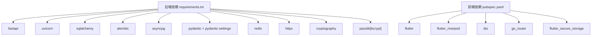

# 系统架构

<cite>
**本文引用的文件**
- [backend/app/main.py](file://backend/app/main.py)
- [backend/app/config.py](file://backend/app/config.py)
- [backend/app/database.py](file://backend/app/database.py)
- [backend/app/routers/auth.py](file://backend/app/routers/auth.py)
- [backend/app/routers/portfolio.py](file://backend/app/routers/portfolio.py)
- [backend/app/routers/exchanges.py](file://backend/app/routers/exchanges.py)
- [backend/app/models/user.py](file://backend/app/models/user.py)
- [backend/app/models/exchange_account.py](file://backend/app/models/exchange_account.py)
- [backend/app/services/auth_service.py](file://backend/app/services/auth_service.py)
- [backend/app/services/portfolio_service.py](file://backend/app/services/portfolio_service.py)
- [backend/app/utils/security.py](file://backend/app/utils/security.py)
- [backend/app/dependencies.py](file://backend/app/dependencies.py)
- [backend/requirements.txt](file://backend/requirements.txt)
- [frontend/lib/main.dart](file://frontend/lib/main.dart)
- [frontend/pubspec.yaml](file://frontend/pubspec.yaml)
</cite>

## 目录
1. [引言](#引言)
2. [项目结构](#项目结构)
3. [核心组件](#核心组件)
4. [架构总览](#架构总览)
5. [详细组件分析](#详细组件分析)
6. [依赖分析](#依赖分析)
7. [性能考虑](#性能考虑)
8. [故障排查指南](#故障排查指南)
9. [结论](#结论)
10. [附录](#附录)

## 引言
本文件面向“资产聚集app”的系统架构文档，聚焦于分层架构设计与技术选型，覆盖表现层（Flutter）、业务逻辑层（FastAPI）、数据访问层（SQLAlchemy Async）与数据存储层（PostgreSQL）。文档同时阐述了异步编程模式、认证授权与数据加密策略，并通过多种图示展示系统边界、组件关系与数据流向。

## 项目结构
- 后端采用 FastAPI + SQLAlchemy Async 的现代化 Python Web 架构，使用异步数据库会话与依赖注入，提供 REST 接口。
- 前端采用 Flutter + Riverpod，使用 Riverpod 进行状态管理，Dio 发起网络请求，GoRouter 管理路由。
- 项目采用模块化组织：routers（路由）、services（业务服务）、models（ORM 模型）、schemas（Pydantic 模型）、utils（工具与安全）、config/database/dependencies（基础设施）。

图表来源
- [backend/app/main.py:1-131](file://backend/app/main.py#L1-L131)
- [backend/app/config.py:1-43](file://backend/app/config.py#L1-L43)
- [backend/app/database.py:1-33](file://backend/app/database.py#L1-L33)
- [backend/app/routers/auth.py:1-253](file://backend/app/routers/auth.py#L1-L253)
- [backend/app/routers/portfolio.py:1-217](file://backend/app/routers/portfolio.py#L1-L217)
- [backend/app/routers/exchanges.py:1-225](file://backend/app/routers/exchanges.py#L1-L225)
- [backend/app/models/user.py:1-32](file://backend/app/models/user.py#L1-L32)
- [backend/app/models/exchange_account.py:1-32](file://backend/app/models/exchange_account.py#L1-L32)
- [backend/app/services/auth_service.py:1-247](file://backend/app/services/auth_service.py#L1-L247)
- [backend/app/services/portfolio_service.py:1-317](file://backend/app/services/portfolio_service.py#L1-L317)
- [backend/app/utils/security.py:1-87](file://backend/app/utils/security.py#L1-L87)
- [backend/app/dependencies.py:1-74](file://backend/app/dependencies.py#L1-L74)
- [backend/requirements.txt:1-15](file://backend/requirements.txt#L1-L15)
- [frontend/lib/main.dart:1-86](file://frontend/lib/main.dart#L1-L86)
- [frontend/pubspec.yaml:1-53](file://frontend/pubspec.yaml#L1-L53)

章节来源
- [backend/app/main.py:1-131](file://backend/app/main.py#L1-L131)
- [frontend/lib/main.dart:1-86](file://frontend/lib/main.dart#L1-L86)

## 核心组件
- FastAPI 应用与生命周期：应用启动时建立数据库连接，关闭时释放；提供健康检查与根路径响应；注册认证、资产组合、交易所等路由。
- 配置中心：集中管理应用名称、调试模式、API 前缀、数据库与 Redis 连接、JWT 参数、加密密钥、第三方服务地址等。
- 数据库与会话：基于 SQLAlchemy Async 的异步引擎与会话工厂，提供依赖注入的数据库会话。
- 路由层：按功能划分认证、资产组合、交易所三个模块，统一返回包装格式。
- 业务服务层：认证服务负责注册、登录、令牌刷新与登出；资产组合服务负责概览、历史、持仓与数据源列表（当前返回 Mock 数据，预留真实聚合逻辑）。
- 安全与工具：密码哈希、JWT 签发与校验、API Key 加解密、令牌校验中间件。
- 前端入口：Flutter 应用初始化、主题与路由配置，预检查认证状态。

章节来源
- [backend/app/main.py:13-131](file://backend/app/main.py#L13-L131)
- [backend/app/config.py:5-43](file://backend/app/config.py#L5-L43)
- [backend/app/database.py:1-33](file://backend/app/database.py#L1-L33)
- [backend/app/routers/auth.py:22-253](file://backend/app/routers/auth.py#L22-L253)
- [backend/app/routers/portfolio.py:26-217](file://backend/app/routers/portfolio.py#L26-L217)
- [backend/app/routers/exchanges.py:20-225](file://backend/app/routers/exchanges.py#L20-L225)
- [backend/app/services/auth_service.py:20-247](file://backend/app/services/auth_service.py#L20-L247)
- [backend/app/services/portfolio_service.py:31-317](file://backend/app/services/portfolio_service.py#L31-L317)
- [backend/app/utils/security.py:16-87](file://backend/app/utils/security.py#L16-L87)
- [frontend/lib/main.dart:9-86](file://frontend/lib/main.dart#L9-L86)

## 架构总览
系统采用分层架构：
- 表现层（Frontend）：Flutter 应用，Riverpod 状态管理，Dio 网络请求，GoRouter 路由。
- 业务逻辑层（Business Logic）：FastAPI 路由器调用服务层，服务层封装领域逻辑。
- 数据访问层（Data Access）：SQLAlchemy Async 会话与 ORM 映射。
- 数据存储层（Data Storage）：PostgreSQL（异步驱动），Redis（缓存/会话可扩展）。

图表来源
- [backend/app/main.py:34-101](file://backend/app/main.py#L34-L101)
- [backend/app/config.py:11-28](file://backend/app/config.py#L11-L28)
- [backend/app/database.py:7-20](file://backend/app/database.py#L7-L20)
- [backend/requirements.txt:1-15](file://backend/requirements.txt#L1-L15)

## 详细组件分析

### 认证与授权流程
- 支持邮箱注册/登录、刷新令牌、登出、OAuth（Google、Apple）。
- 令牌类型区分：access（短期）、refresh（长期，支持轮换与撤销）。
- 依赖注入获取当前用户，校验 JWT 并查询数据库确认用户状态。

图表来源
- [backend/app/routers/auth.py:25-206](file://backend/app/routers/auth.py#L25-L206)
- [backend/app/services/auth_service.py:26-202](file://backend/app/services/auth_service.py#L26-L202)
- [backend/app/utils/security.py:16-47](file://backend/app/utils/security.py#L16-L47)
- [backend/app/dependencies.py:18-56](file://backend/app/dependencies.py#L18-L56)

章节来源
- [backend/app/routers/auth.py:25-206](file://backend/app/routers/auth.py#L25-L206)
- [backend/app/services/auth_service.py:26-202](file://backend/app/services/auth_service.py#L26-L202)
- [backend/app/utils/security.py:16-47](file://backend/app/utils/security.py#L16-L47)
- [backend/app/dependencies.py:18-56](file://backend/app/dependencies.py#L18-L56)

### 资产组合服务（Portfolio）
- 提供资产概览、历史净值、持仓列表、已连接数据源等接口。
- 当前实现返回 Mock 数据，预留真实聚合逻辑（查询账户、调用交易所 API、获取价格、计算统计）。

图表来源
- [backend/app/routers/portfolio.py:33-59](file://backend/app/routers/portfolio.py#L33-L59)
- [backend/app/services/portfolio_service.py:41-65](file://backend/app/services/portfolio_service.py#L41-L65)
- [backend/app/services/portfolio_service.py:270-317](file://backend/app/services/portfolio_service.py#L270-L317)

章节来源
- [backend/app/routers/portfolio.py:33-100](file://backend/app/routers/portfolio.py#L33-L100)
- [backend/app/services/portfolio_service.py:41-140](file://backend/app/services/portfolio_service.py#L41-L140)

### 交易所连接与同步
- 支持列出/连接/断开交易所，手动触发同步与查看状态。
- 连接时对 API Key/Secret 进行加密存储，断开为软删除并更新状态。

图表来源
- [backend/app/routers/exchanges.py:84-172](file://backend/app/routers/exchanges.py#L84-L172)
- [backend/app/services/portfolio_service.py:208-264](file://backend/app/services/portfolio_service.py#L208-L264)
- [backend/app/utils/security.py:68-86](file://backend/app/utils/security.py#L68-L86)

章节来源
- [backend/app/routers/exchanges.py:84-172](file://backend/app/routers/exchanges.py#L84-L172)
- [backend/app/utils/security.py:68-86](file://backend/app/utils/security.py#L68-L86)

### 数据模型与关系
- 用户模型与交易所账户模型通过外键关联，支持一对多关系。
- 字段涵盖身份信息、认证方式、订阅等级、偏好设置、活跃状态与时间戳。

图表来源
- [backend/app/models/user.py:11-31](file://backend/app/models/user.py#L11-L31)
- [backend/app/models/exchange_account.py:11-31](file://backend/app/models/exchange_account.py#L11-L31)

章节来源
- [backend/app/models/user.py:11-31](file://backend/app/models/user.py#L11-L31)
- [backend/app/models/exchange_account.py:11-31](file://backend/app/models/exchange_account.py#L11-L31)

### 前端架构与状态流
- 应用入口初始化系统 UI、方向、主题与路由；预检查认证状态；使用 Riverpod 管理全局状态。
- 依赖包括网络库、路由、状态管理、本地存储等。

图表来源
- [frontend/lib/main.dart:9-86](file://frontend/lib/main.dart#L9-L86)
- [frontend/pubspec.yaml:9-27](file://frontend/pubspec.yaml#L9-L27)

章节来源
- [frontend/lib/main.dart:9-86](file://frontend/lib/main.dart#L9-L86)
- [frontend/pubspec.yaml:9-27](file://frontend/pubspec.yaml#L9-L27)

## 依赖分析
- 后端依赖：FastAPI、Uvicorn、SQLAlchemy Async、Alembic、asyncpg、Pydantic/Settings、Redis、HTTPX、Cryptography、Passlib/Bcrypt、python-dotenv。
- 前端依赖：Flutter SDK、Riverpod、Dio、GoRouter、图表与本地存储等。

图表来源
- [backend/requirements.txt:1-15](file://backend/requirements.txt#L1-L15)
- [frontend/pubspec.yaml:9-27](file://frontend/pubspec.yaml#L9-L27)

章节来源
- [backend/requirements.txt:1-15](file://backend/requirements.txt#L1-L15)
- [frontend/pubspec.yaml:9-27](file://frontend/pubspec.yaml#L9-L27)

## 性能考虑
- 异步 I/O：后端使用 SQLAlchemy Async 与异步会话，减少阻塞，提升并发能力。
- 数据库连接池：通过异步引擎与会话工厂管理连接，避免频繁创建销毁。
- 缓存策略：Redis 可用于热点数据缓存（如价格、用户偏好），降低数据库压力。
- 外部服务：对 CoinGecko 等第三方接口进行限流与重试，避免单点失败。
- 前端渲染：使用轻量级图表库与懒加载策略，优化首屏与滚动性能。

## 故障排查指南
- 认证错误：检查令牌是否过期、类型是否为 access、用户是否存在且激活；核对 JWT 密钥与算法配置。
- 数据库连接：确认 DATABASE_URL 正确、PostgreSQL 可达、异步驱动安装；检查会话生命周期。
- 加密问题：确保 ENCRYPTION_KEY 长度与格式符合要求，AES-256-GCM 密钥派生正确。
- 健康检查：访问 /health 确认服务可用；查看日志中数据库连接建立与关闭输出。
- CORS 问题：在调试模式下允许本地开发域名，生产环境配置 ALLOWED_ORIGINS。

章节来源
- [backend/app/main.py:66-91](file://backend/app/main.py#L66-L91)
- [backend/app/config.py:29-36](file://backend/app/config.py#L29-L36)
- [backend/app/utils/security.py:59-86](file://backend/app/utils/security.py#L59-L86)
- [backend/app/database.py:26-32](file://backend/app/database.py#L26-L32)

## 结论
本项目采用清晰的分层架构与现代技术栈，后端以 FastAPI + SQLAlchemy Async 实现高性能异步服务，前端以 Flutter + Riverpod 构建跨平台体验。认证授权与数据加密策略完善，具备良好的扩展性与安全性。后续可在资产聚合与外部服务对接方面逐步替换 Mock 实现，完善异步任务与事件驱动机制。

## 附录
- 技术选型优势
  - FastAPI：自动生成 OpenAPI 文档、类型安全、异步支持、高并发。
  - SQLAlchemy Async：与 PostgreSQL 异步驱动配合，降低锁等待。
  - Riverpod：细粒度状态管理，易于测试与维护。
  - AES-256-GCM：保障敏感凭证安全存储。
- 安全建议
  - 生产环境必须修改默认密钥与加密密钥。
  - OAuth 验签在 Apple 场景建议接入公钥验证。
  - 对外部接口增加超时与熔断策略。