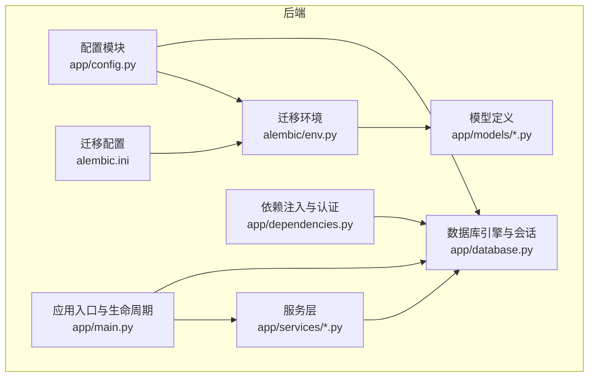
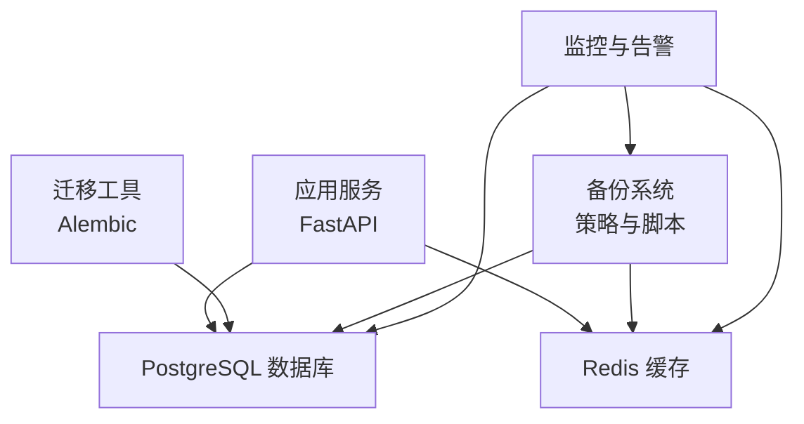
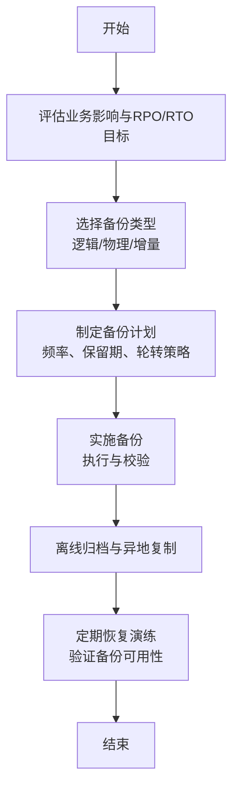
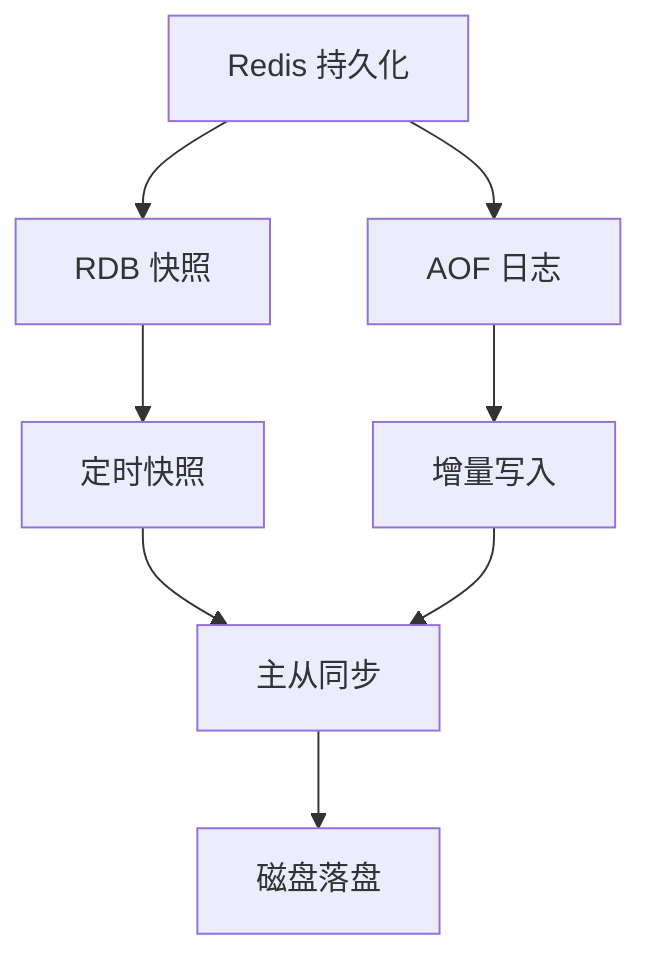
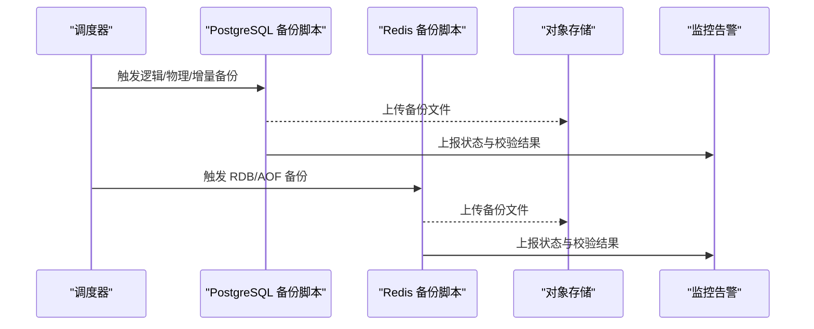
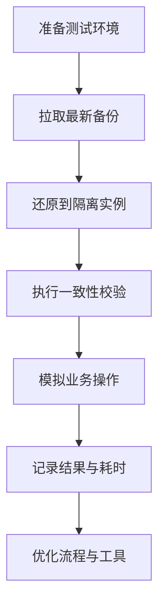
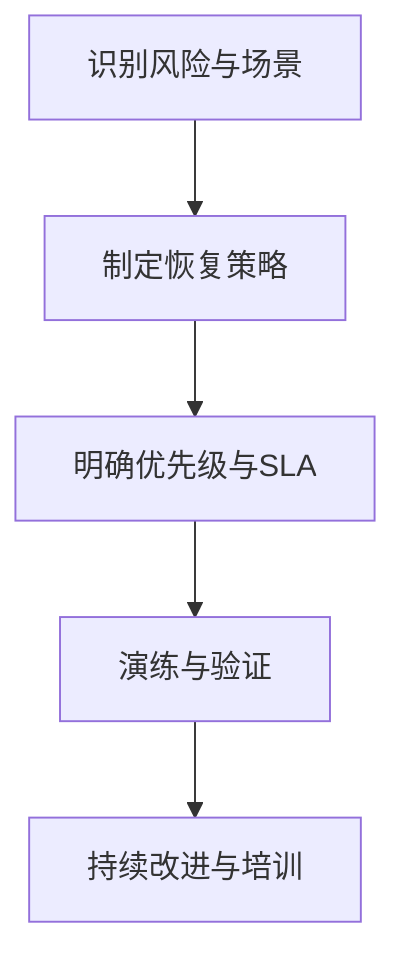
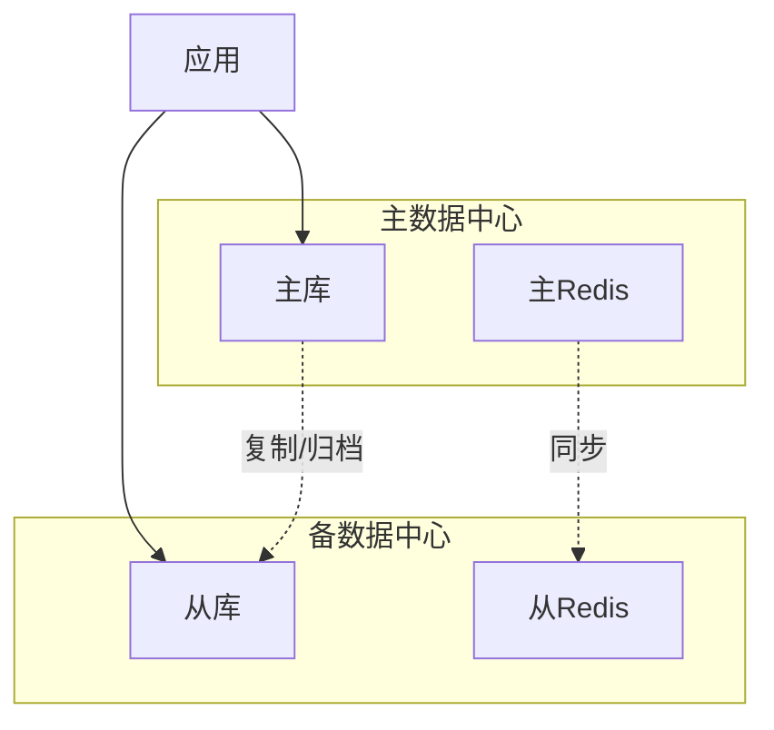
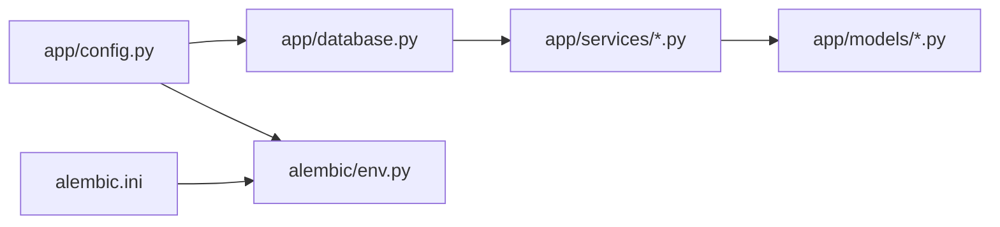

# 备份与灾难恢复

<cite>
**本文引用的文件**
- [backend/app/config.py](file://backend/app/config.py)
- [backend/app/database.py](file://backend/app/database.py)
- [backend/alembic/env.py](file://backend/alembic/env.py)
- [backend/alembic.ini](file://backend/alembic.ini)
- [backend/app/main.py](file://backend/app/main.py)
- [backend/app/models/user.py](file://backend/app/models/user.py)
- [backend/app/services/user_service.py](file://backend/app/services/user_service.py)
- [backend/app/dependencies.py](file://backend/app/dependencies.py)
- [backend/requirements.txt](file://backend/requirements.txt)
</cite>

## 目录
1. [简介](#简介)
2. [项目结构](#项目结构)
3. [核心组件](#核心组件)
4. [架构总览](#架构总览)
5. [详细组件分析](#详细组件分析)
6. [依赖分析](#依赖分析)
7. [性能考虑](#性能考虑)
8. [故障排查指南](#故障排查指南)
9. [结论](#结论)
10. [附录](#附录)

## 简介
本指南面向“资产聚集App”后端系统，围绕数据库与缓存的备份与灾难恢复进行专业规划。内容涵盖：
- PostgreSQL 逻辑备份、物理备份与增量备份策略
- Redis 数据持久化配置与快照策略
- 备份自动化脚本与调度任务
- 备份验证与恢复测试流程
- 灾难恢复计划与业务连续性策略
- 异地备份与多活架构设计思路
- RTO/RPO 指标定义与恢复时间目标设定
- 备份监控与告警机制配置

本指南在不直接粘贴代码的前提下，基于仓库中现有配置与实现进行分析，并给出可落地的实践建议。

## 项目结构
后端采用 FastAPI + SQLAlchemy Async + Alembic 的典型架构，数据库为 PostgreSQL，缓存为 Redis。关键配置集中在 settings 中，数据库连接由异步引擎管理，迁移工具通过 Alembic 驱动。

图表来源
- [backend/app/config.py:11-15](file://backend/app/config.py#L11-L15)
- [backend/app/database.py:7-20](file://backend/app/database.py#L7-L20)
- [backend/alembic/env.py:10-30](file://backend/alembic/env.py#L10-L30)
- [backend/alembic.ini:61](file://backend/alembic.ini#L61)
- [backend/app/main.py:13-30](file://backend/app/main.py#L13-L30)

章节来源
- [backend/app/config.py:11-15](file://backend/app/config.py#L11-L15)
- [backend/app/database.py:7-20](file://backend/app/database.py#L7-L20)
- [backend/alembic/env.py:10-30](file://backend/alembic/env.py#L10-L30)
- [backend/alembic.ini:61](file://backend/alembic.ini#L61)
- [backend/app/main.py:13-30](file://backend/app/main.py#L13-L30)

## 核心组件
- 配置中心：集中管理数据库与 Redis 连接字符串、JWT 密钥、加密密钥等敏感参数。
- 数据库引擎：基于 SQLAlchemy Async 创建异步连接池，支持并发读写。
- 迁移系统：Alembic 通过 env.py 与 alembic.ini 驱动数据库模式演进。
- 应用生命周期：在启动时建立数据库连接，在关闭时释放资源。
- 服务层与模型：用户模型与服务方法体现数据访问模式，便于制定备份范围与粒度。

章节来源
- [backend/app/config.py:11-15](file://backend/app/config.py#L11-L15)
- [backend/app/database.py:7-20](file://backend/app/database.py#L7-L20)
- [backend/alembic/env.py:10-30](file://backend/alembic/env.py#L10-L30)
- [backend/app/main.py:13-30](file://backend/app/main.py#L13-L30)
- [backend/app/models/user.py:11-28](file://backend/app/models/user.py#L11-L28)
- [backend/app/services/user_service.py:19-24](file://backend/app/services/user_service.py#L19-L24)

## 架构总览
下图展示应用与数据库、缓存之间的交互，以及迁移与备份的关系。

图表来源
- [backend/app/main.py:13-30](file://backend/app/main.py#L13-L30)
- [backend/app/config.py:11-15](file://backend/app/config.py#L11-L15)
- [backend/alembic/env.py:10-30](file://backend/alembic/env.py#L10-L30)

## 详细组件分析

### PostgreSQL 备份策略
- 逻辑备份（推荐用于开发/测试/归档）
  - 使用逻辑导出工具生成 SQL 或自定义格式的备份文件，便于跨版本迁移与选择性恢复。
  - 建议对关键业务表（如用户、账户、交易）进行周期性逻辑备份。
- 物理备份（推荐用于生产主库）
  - 使用数据库自带的物理备份能力（如基础备份与 WAL 归档），结合点-in-time 恢复（PITR）。
  - 需要停机窗口或热备方案，确保一致性与可用性。
- 增量备份（建议与物理备份配合）
  - 基于 WAL 归档与差异/增量文件，缩短 RPO 并降低存储成本。
  - 需要严格的归档与校验流程，避免恢复路径断裂。

（本图为概念流程，无需图表来源）

章节来源
- [backend/app/config.py:11-12](file://backend/app/config.py#L11-L12)
- [backend/app/database.py:7-20](file://backend/app/database.py#L7-L20)
- [backend/alembic/env.py:10-30](file://backend/alembic/env.py#L10-L30)

### Redis 数据持久化与快照策略
- 持久化选项
  - RDB 快照：适合恢复到某个时间点，文件小、加载快；但可能丢失最后一次快照之后的数据。
  - AOF 追加式日志：更细粒度的持久化，可配置刷盘策略以平衡性能与安全性。
- 快照策略
  - 在低峰时段执行 RDB 快照，同时开启 AOF 增量记录。
  - 对重要键空间进行定期备份，结合 AOF 重放实现精确恢复。
- 高可用与容灾
  - 主从复制与哨兵/集群模式，结合持久化策略提升可用性。
  - 异地同步与自动切换预案，确保跨机房容灾。

（本图为概念流程，无需图表来源）

章节来源
- [backend/app/config.py:14-15](file://backend/app/config.py#L14-L15)

### 备份自动化与调度
- 自动化脚本
  - PostgreSQL：封装逻辑/物理/增量备份命令，输出带时间戳的归档文件，执行完整性校验。
  - Redis：导出 RDB/AOF 文件，生成校验和，上传至对象存储。
- 调度任务
  - 使用系统级定时任务（如 cron）或工作流编排（如 Airflow/Argo），按策略执行备份。
  - 失败告警与重试机制，确保高可靠。
- 备份保留与轮转
  - 基于时间的滚动保留（日/周/月/年），清理过期文件，控制存储成本。

（本图为概念流程，无需图表来源）

章节来源
- [backend/app/config.py:11-15](file://backend/app/config.py#L11-L15)

### 备份验证与恢复测试
- 验证清单
  - 校验备份文件完整性与可读性；核对关键表行数与关键索引存在性。
  - 执行最小化恢复测试（还原到临时实例），验证业务查询与写入。
- 回归演练
  - 定期进行不同场景的演练：单表恢复、时间点恢复、跨机房切换。
  - 记录演练结果与耗时，持续优化恢复流程与工具链。

（本图为概念流程，无需图表来源）

章节来源
- [backend/app/config.py:11-15](file://backend/app/config.py#L11-L15)

### 灾难恢复计划与业务连续性
- DRP 组织与职责
  - 明确恢复优先级、角色分工、沟通渠道与升级流程。
- 恢复场景
  - 单点故障、区域性灾难、供应链中断等，分别制定应对策略。
- 业务连续性
  - 通过异地多活或快速切换，保证核心功能可用；对非关键功能采取降级策略。

（本图为概念流程，无需图表来源）

章节来源
- [backend/app/config.py:11-15](file://backend/app/config.py#L11-L15)

### 异地备份与多活架构设计
- 异地备份
  - 将备份文件与日志同步至异地存储，定期抽样验证可用性。
- 多活架构
  - 通过数据库主从复制、缓存集群与应用多活部署，实现跨地域高可用。
  - 结合 DNS/负载均衡与健康检查，实现自动故障转移。

（本图为概念架构，无需图表来源）

章节来源
- [backend/app/config.py:11-15](file://backend/app/config.py#L11-L15)

### RTO/RPO 指标与目标设定
- RPO（恢复点目标）：允许丢失的数据量与时长，由备份频率与日志归档决定。
- RTO（恢复时间目标）：从故障发生到业务恢复正常的时间上限，由自动化脚本与演练结果驱动。
- 设定原则
  - 依据 SLA 与业务影响分析，为不同数据集设定差异化目标。
  - 定期回顾与调整，确保与实际能力匹配。

（本节为概念说明，无需章节来源）

### 备份监控与告警
- 监控维度
  - 备份成功率、完成时间、文件大小、校验结果、传输延迟、存储容量。
- 告警策略
  - 失败即刻告警；超时与异常阈值告警；恢复演练失败告警。
- 工具建议
  - 使用统一监控平台（如 Prometheus/Grafana）与告警系统（如 AlertManager/企业微信/钉钉）。

（本节为概念说明，无需章节来源）

## 依赖分析
- 配置与数据库
  - 应用通过配置模块读取数据库与 Redis 地址，数据库引擎据此建立连接。
  - Alembic 通过 env.py 与 alembic.ini 读取相同数据库地址，确保迁移与运行一致。
- 服务与模型
  - 服务层通过异步会话访问模型，备份范围应覆盖关键业务表。
- 外部依赖
  - 后端依赖 SQLAlchemy Async、Alembic、asyncpg、redis 等，备份工具需兼容这些生态。

图表来源
- [backend/app/config.py:11-15](file://backend/app/config.py#L11-L15)
- [backend/app/database.py:7-20](file://backend/app/database.py#L7-L20)
- [backend/alembic/env.py:10-30](file://backend/alembic/env.py#L10-L30)
- [backend/alembic.ini:61](file://backend/alembic.ini#L61)

章节来源
- [backend/app/config.py:11-15](file://backend/app/config.py#L11-L15)
- [backend/app/database.py:7-20](file://backend/app/database.py#L7-L20)
- [backend/alembic/env.py:10-30](file://backend/alembic/env.py#L10-L30)
- [backend/alembic.ini:61](file://backend/alembic.ini#L61)
- [backend/requirements.txt:3-11](file://backend/requirements.txt#L3-L11)

## 性能考虑
- 备份窗口与业务影响
  - 逻辑备份通常对在线业务影响较小；物理备份需要更谨慎的窗口规划。
- 存储与网络
  - 备份压缩与分片传输，结合对象存储的多副本与近线/冷存储降低成本。
- 恢复效率
  - 通过并行还原与预热策略，缩短 RTO；合理设置快照与日志归档频率，平衡 RPO。

（本节为通用指导，无需章节来源）

## 故障排查指南
- 数据库连接问题
  - 检查配置中的数据库 URL 与凭据；确认网络连通性与防火墙策略。
- 迁移失败
  - 核对 Alembic 配置与数据库元数据一致性；逐条执行迁移并记录错误。
- 服务层异常
  - 关注服务层事务提交与刷新逻辑，确保备份期间的数据一致性。
- 监控缺失
  - 补充备份任务的健康检查与告警规则，确保及时发现异常。

章节来源
- [backend/app/config.py:11-12](file://backend/app/config.py#L11-L12)
- [backend/alembic/env.py:18-19](file://backend/alembic/env.py#L18-L19)
- [backend/app/main.py:17-25](file://backend/app/main.py#L17-L25)
- [backend/app/services/user_service.py:92-95](file://backend/app/services/user_service.py#L92-L95)

## 结论
本指南基于现有配置与实现，提出了面向生产的数据库与缓存备份与灾难恢复方案。建议尽快落地以下关键动作：
- 制定并发布正式的备份策略文档与 DRP
- 部署自动化备份与恢复演练流程
- 建立完善的监控与告警体系
- 持续优化 RTO/RPO 目标与恢复路径

（本节为总结，无需章节来源）

## 附录
- 关键配置位置
  - 数据库连接：[backend/app/config.py:11-12](file://backend/app/config.py#L11-L12)
  - Redis 连接：[backend/app/config.py:14-15](file://backend/app/config.py#L14-L15)
  - Alembic 数据库地址：[backend/alembic/env.py:18-19](file://backend/alembic/env.py#L18-L19)，[backend/alembic.ini:61](file://backend/alembic.ini#L61)
- 数据库生命周期与连接
  - 应用启动/关闭时的数据库连接处理：[backend/app/main.py:17-29](file://backend/app/main.py#L17-L29)
  - 异步引擎与会话工厂：[backend/app/database.py:7-20](file://backend/app/database.py#L7-L20)
- 服务与模型示例
  - 用户服务与会话使用：[backend/app/services/user_service.py:19-24](file://backend/app/services/user_service.py#L19-L24)
  - 用户模型字段与索引：[backend/app/models/user.py:11-28](file://backend/app/models/user.py#L11-L28)
- 认证与依赖
  - JWT 令牌校验与用户获取：[backend/app/dependencies.py:18-56](file://backend/app/dependencies.py#L18-L56)