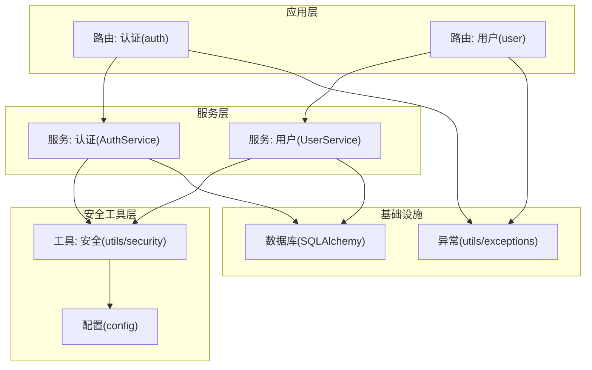
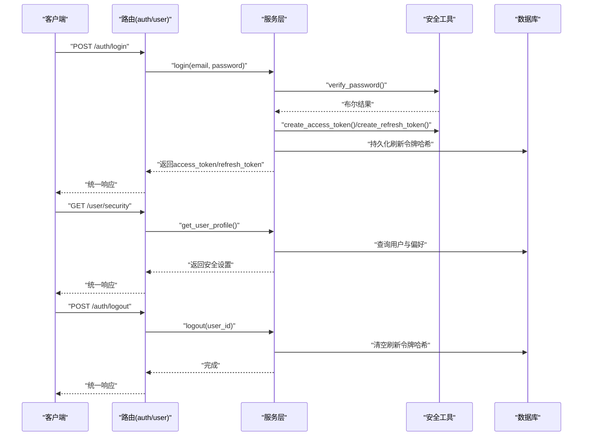
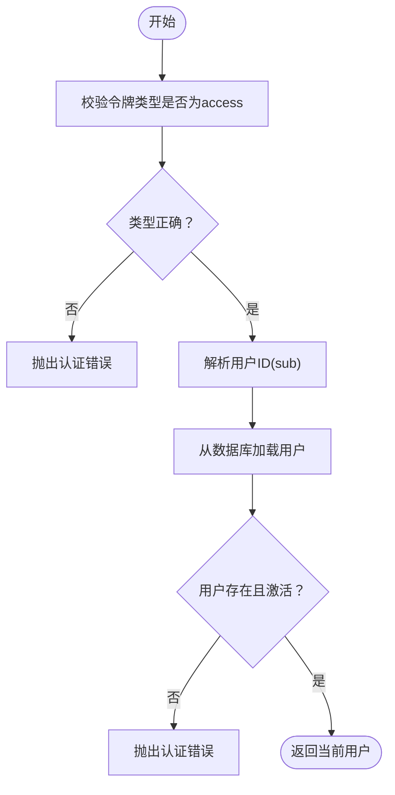
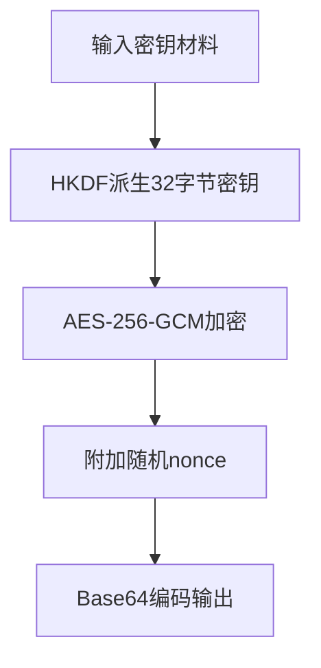
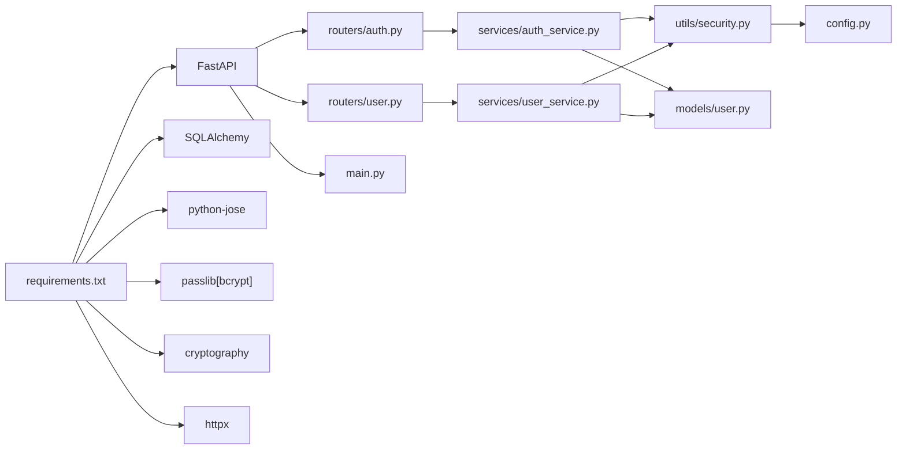

# 安全加固

<cite>
**本文引用的文件**
- [backend/app/config.py](file://backend/app/config.py)
- [backend/app/utils/security.py](file://backend/app/utils/security.py)
- [backend/app/services/auth_service.py](file://backend/app/services/auth_service.py)
- [backend/app/routers/auth.py](file://backend/app/routers/auth.py)
- [backend/app/dependencies.py](file://backend/app/dependencies.py)
- [backend/app/main.py](file://backend/app/main.py)
- [backend/requirements.txt](file://backend/requirements.txt)
- [backend/app/utils/exceptions.py](file://backend/app/utils/exceptions.py)
- [backend/app/models/user.py](file://backend/app/models/user.py)
- [backend/app/routers/user.py](file://backend/app/routers/user.py)
</cite>

## 目录
1. [引言](#引言)
2. [项目结构](#项目结构)
3. [核心组件](#核心组件)
4. [架构总览](#架构总览)
5. [详细组件分析](#详细组件分析)
6. [依赖分析](#依赖分析)
7. [性能考虑](#性能考虑)
8. [故障排查指南](#故障排查指南)
9. [结论](#结论)
10. [附录](#附录)

## 引言
本指南面向“资产聚集App”后端系统，提供一套可落地的安全加固方案。内容覆盖应用安全配置（JWT令牌安全、密码哈希策略、API安全防护）、网络安全配置（CORS与中间件、异常处理）、数据安全保护（敏感数据加密、传输安全、访问控制）、安全审计与漏洞扫描流程、安全事件响应预案、合规性与安全标准遵循、定期安全评估与渗透测试建议，以及安全配置检查清单与最佳实践。

## 项目结构
后端采用FastAPI + SQLAlchemy异步ORM架构，安全相关能力集中在配置、工具函数、依赖注入、路由与服务层中。关键模块如下：
- 配置层：集中管理应用名称、数据库、Redis、JWT、加密密钥、CORS与外部API地址等。
- 安全工具层：密码哈希、JWT签发与校验、API Key加密（AES-256-GCM）。
- 依赖注入层：基于HTTP Bearer的JWT校验，解析用户上下文。
- 路由层：认证、用户资料与安全设置等接口。
- 服务层：认证业务逻辑、用户偏好与安全设置持久化。
- 数据模型：用户实体及关联的交易所账户。
- 异常体系：统一错误响应格式与状态码。

图表来源
- [backend/app/routers/auth.py:1-287](file://backend/app/routers/auth.py#L1-L287)
- [backend/app/routers/user.py:1-280](file://backend/app/routers/user.py#L1-L280)
- [backend/app/services/auth_service.py:1-249](file://backend/app/services/auth_service.py#L1-L249)
- [backend/app/services/user_service.py:1-223](file://backend/app/services/user_service.py#L1-L223)
- [backend/app/utils/security.py:1-104](file://backend/app/utils/security.py#L1-L104)
- [backend/app/config.py:1-51](file://backend/app/config.py#L1-L51)
- [backend/app/utils/exceptions.py:1-67](file://backend/app/utils/exceptions.py#L1-L67)

章节来源
- [backend/app/main.py:1-131](file://backend/app/main.py#L1-L131)
- [backend/app/config.py:1-51](file://backend/app/config.py#L1-L51)

## 核心组件
- 应用配置与密钥管理
  - 集中式配置类负责读取环境变量并进行生产校验，强制要求在生产环境设置JWT与加密密钥。
  - CORS在开发与生产环境分别采用不同策略，生产环境来源于配置项。
- 密码与令牌安全
  - 使用bcrypt进行密码哈希；JWT使用HS256算法，支持访问令牌与刷新令牌，具备过期时间与类型校验。
  - 刷新令牌采用单字段存储并进行哈希保存，支持登出与登出全部设备。
- API Key加密
  - 使用HKDF从任意长度密钥材料派生固定长度密钥，AES-256-GCM对称加密API Key，随机nonce保证安全性。
- 访问控制
  - 基于HTTP Bearer的依赖注入，校验JWT有效性、类型与用户状态，失败时抛出自定义异常。
- 统一异常处理
  - 全局异常处理器将自定义异常转换为统一JSON响应，便于前端与监控系统消费。

章节来源
- [backend/app/config.py:1-51](file://backend/app/config.py#L1-L51)
- [backend/app/utils/security.py:1-104](file://backend/app/utils/security.py#L1-L104)
- [backend/app/services/auth_service.py:1-249](file://backend/app/services/auth_service.py#L1-L249)
- [backend/app/dependencies.py:1-74](file://backend/app/dependencies.py#L1-L74)
- [backend/app/utils/exceptions.py:1-67](file://backend/app/utils/exceptions.py#L1-L67)

## 架构总览
下图展示认证与用户安全设置的关键交互流程，涵盖令牌签发、校验与刷新、登出与登出全部设备等场景。

图表来源
- [backend/app/routers/auth.py:56-140](file://backend/app/routers/auth.py#L56-L140)
- [backend/app/routers/user.py:126-177](file://backend/app/routers/user.py#L126-L177)
- [backend/app/services/auth_service.py:67-153](file://backend/app/services/auth_service.py#L67-L153)
- [backend/app/services/user_service.py:179-205](file://backend/app/services/user_service.py#L179-L205)
- [backend/app/utils/security.py:28-58](file://backend/app/utils/security.py#L28-L58)
- [backend/app/models/user.py](file://backend/app/models/user.py#L23)

## 详细组件分析

### JWT令牌安全
- 设计要点
  - HS256算法，密钥来自配置；访问令牌与刷新令牌分离，分别设置过期时间。
  - 刷新令牌采用单字段哈希存储，支持令牌轮换与撤销；登出与登出全部设备通过清空哈希实现。
  - 依赖注入严格校验令牌类型与用户状态，防止越权与失效令牌滥用。
- 风险与改进建议
  - 当前刷新令牌为单字段设计，存在多设备并发刷新导致的竞态问题。建议引入“刷新令牌哈希表”，按设备/会话维度存储，支持多设备并行登录。
  - 建议启用HTTPS与安全Cookie属性（如SameSite、HttpOnly、Secure），并在网关层强制TLS终止。
  - 建议增加刷新令牌黑名单机制与定期轮换策略。

图表来源
- [backend/app/dependencies.py:18-56](file://backend/app/dependencies.py#L18-L56)

章节来源
- [backend/app/utils/security.py:28-58](file://backend/app/utils/security.py#L28-L58)
- [backend/app/services/auth_service.py:99-140](file://backend/app/services/auth_service.py#L99-L140)
- [backend/app/dependencies.py:18-56](file://backend/app/dependencies.py#L18-L56)

### 密码哈希策略
- 设计要点
  - 使用bcrypt进行密码哈希，自动处理盐值与迭代参数；登录时进行明文与哈希比对。
- 风险与改进建议
  - 建议引入密码强度规则（长度、字符集、历史重复限制）与防暴力破解策略（账户锁定、延迟响应）。
  - 建议支持密码修改流程，并在修改后立即撤销旧会话或要求二次验证。

章节来源
- [backend/app/utils/security.py:18-25](file://backend/app/utils/security.py#L18-L25)
- [backend/app/services/auth_service.py:26-97](file://backend/app/services/auth_service.py#L26-L97)

### API安全防护
- CORS与中间件
  - 开发环境允许常见本地源；生产环境由配置项决定，建议仅允许受信域名。
  - 建议在网关层启用更严格的CORS策略与预检缓存控制。
- 异常处理
  - 自定义异常统一序列化为JSON响应，包含状态码、消息与错误码，便于日志与告警系统消费。
- 路由与依赖
  - 所有需要认证的端点均通过依赖注入获取当前用户，未提供凭据或校验失败时直接拒绝。

章节来源
- [backend/app/main.py:44-62](file://backend/app/main.py#L44-L62)
- [backend/app/utils/exceptions.py:4-67](file://backend/app/utils/exceptions.py#L4-L67)
- [backend/app/dependencies.py:18-56](file://backend/app/dependencies.py#L18-L56)

### 敏感数据加密与传输安全
- API Key加密
  - 使用HKDF从任意长度密钥材料派生32字节密钥，AES-256-GCM对称加密，随机nonce，组合后Base64编码。
- 传输安全
  - 建议在网关层强制HTTPS与TLS 1.3+，禁用弱密码套件与协议版本；对内部服务间通信也应启用mTLS。
- 存储安全
  - 建议对数据库中的敏感字段（如API Key明文）进行分层加密与最小权限访问控制。

图表来源
- [backend/app/utils/security.py:61-93](file://backend/app/utils/security.py#L61-L93)

章节来源
- [backend/app/utils/security.py:61-103](file://backend/app/utils/security.py#L61-L103)

### 访问控制与用户生命周期
- 用户模型
  - 包含邮箱、密码哈希、认证来源、订阅等级、活跃状态、偏好设置与刷新令牌哈希等字段。
- 登出与登出全部设备
  - 登出：清空当前用户的刷新令牌哈希，使旧刷新令牌失效。
  - 登出全部设备：通过用户服务清空哈希，实现全局会话撤销。
- OAuth集成
  - 支持Google与Apple ID Token校验，分别调用各自公开端点与公钥集合进行验证。

章节来源
- [backend/app/models/user.py:11-25](file://backend/app/models/user.py#L11-L25)
- [backend/app/services/auth_service.py:142-153](file://backend/app/services/auth_service.py#L142-L153)
- [backend/app/services/user_service.py:179-205](file://backend/app/services/user_service.py#L179-L205)
- [backend/app/routers/auth.py:163-286](file://backend/app/routers/auth.py#L163-L286)

## 依赖分析
- 外部依赖
  - FastAPI、SQLAlchemy、Alembic、asyncpg、httpx、pydantic-settings、cryptography、passlib等。
- 内部耦合
  - 路由依赖服务层，服务层依赖安全工具与配置，依赖注入贯穿认证链路。
- 潜在风险
  - 配置层对生产密钥的强制校验是关键防线；CORS策略需与部署环境严格匹配。

图表来源
- [backend/requirements.txt:1-15](file://backend/requirements.txt#L1-L15)
- [backend/app/routers/auth.py:1-287](file://backend/app/routers/auth.py#L1-L287)
- [backend/app/routers/user.py:1-280](file://backend/app/routers/user.py#L1-L280)
- [backend/app/services/auth_service.py:1-249](file://backend/app/services/auth_service.py#L1-L249)
- [backend/app/services/user_service.py:1-223](file://backend/app/services/user_service.py#L1-L223)
- [backend/app/utils/security.py:1-104](file://backend/app/utils/security.py#L1-L104)
- [backend/app/models/user.py:1-32](file://backend/app/models/user.py#L1-L32)
- [backend/app/config.py:1-51](file://backend/app/config.py#L1-L51)

章节来源
- [backend/requirements.txt:1-15](file://backend/requirements.txt#L1-L15)

## 性能考虑
- JWT与数据库交互
  - 令牌校验仅做内存计算；用户查询在认证链路中按需执行，建议在高并发场景下对用户信息进行轻量缓存。
- 加密开销
  - bcrypt与AES-256-GCM均为CPU密集型操作，建议在批量注册/登录时配合限流与队列。
- CORS与异常处理
  - 生产环境CORS白名单应尽量收敛，减少跨域预检次数；异常处理统一返回，利于前端缓存与降噪。

## 故障排查指南
- 常见问题定位
  - “缺少认证凭据”：确认Authorization头格式与Bearer前缀；检查依赖注入是否正确传递。
  - “令牌无效或过期”：核对JWT密钥、算法与过期时间；确认服务器UTC时间同步。
  - “刷新令牌被撤销”：检查用户是否已登出或登出全部设备；确认刷新令牌哈希是否为空。
  - “CORS跨域失败”：核对生产环境ALLOWED_ORIGINS配置与浏览器控制台错误。
- 日志与监控
  - 统一异常响应包含错误码与详情，建议接入日志系统与告警平台，设置阈值与聚合规则。

章节来源
- [backend/app/dependencies.py:29-56](file://backend/app/dependencies.py#L29-L56)
- [backend/app/utils/exceptions.py:21-66](file://backend/app/utils/exceptions.py#L21-L66)
- [backend/app/main.py:44-62](file://backend/app/main.py#L44-L62)

## 结论
本项目在密码哈希、JWT令牌与API Key加密方面具备良好基础，但在多设备并发登录、传输安全强化与访问控制细节上仍有改进空间。建议优先完善刷新令牌存储模型、强制HTTPS与Cookie安全属性、细化CORS策略，并建立持续的安全审计与渗透测试流程。

## 附录

### 安全配置检查清单
- 应用配置
  - 生产环境必须设置JWT_SECRET_KEY与ENCRYPTION_KEY，禁止使用开发默认值。
  - CORS仅允许受信域名，生产环境关闭DEBUG模式。
- 传输安全
  - 网关层强制HTTPS与TLS 1.3+；禁用弱密码套件；启用HSTS与OCSP Stapling。
- 认证与授权
  - 刷新令牌采用多会话模型；启用令牌撤销与黑名单；强制双因素或多因子认证。
  - 对高危操作（修改密码、删除账户、登出全部设备）增加二次验证。
- 数据保护
  - API Key与敏感字段采用分层加密；最小权限访问数据库；定期轮换密钥。
- 审计与合规
  - 记录登录、令牌刷新、登出、安全设置变更等关键事件；满足GDPR/CCPA等合规要求。
- 漏洞扫描与渗透测试
  - 定期进行静态分析（Secrets检测、依赖漏洞扫描）与动态渗透测试。
- 事件响应
  - 建立事件分级、通知渠道、回滚与恢复流程；演练典型攻击场景。

### 最佳实践建议
- 密钥管理
  - 使用KMS或硬件安全模块（HSM）管理密钥；密钥轮换周期不超过90天。
- 代码与部署
  - 依赖升级自动化；容器镜像最小化与只读根文件系统；Secrets注入与环境隔离。
- 监控与告警
  - 关键指标：认证失败率、异常响应率、数据库慢查询、API Key异常使用。
- 文档与培训
  - 安全基线文档与开发手册；定期安全意识培训与攻防演练。