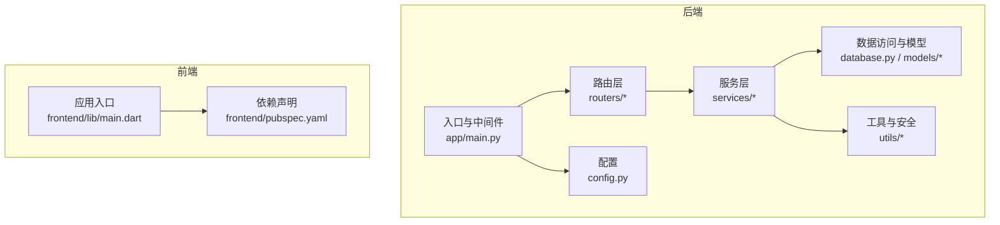
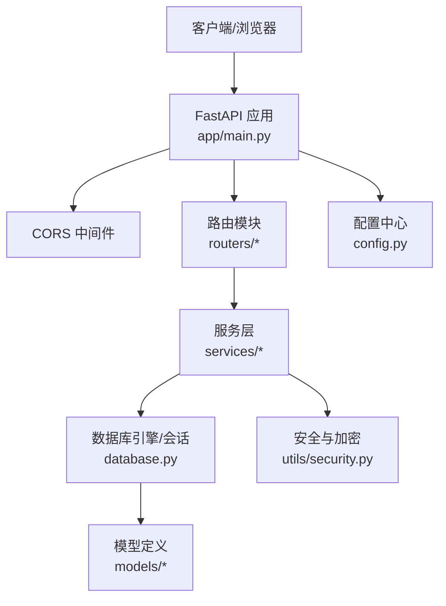
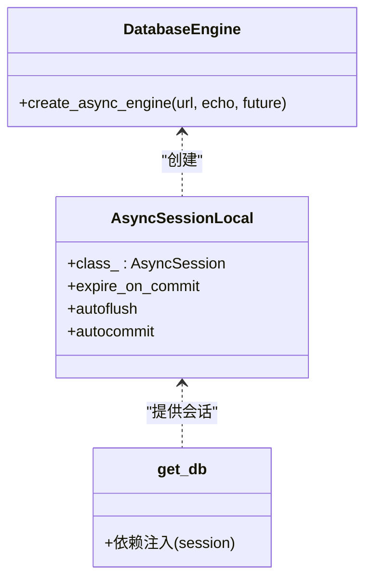
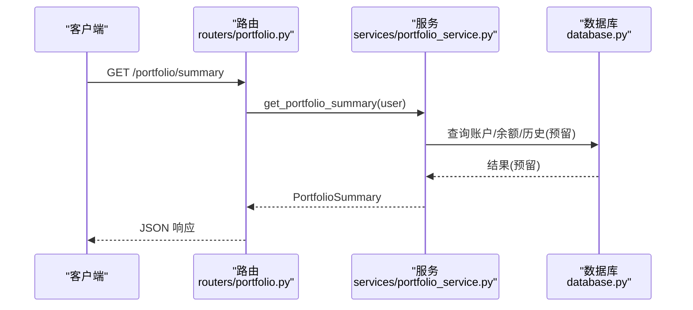
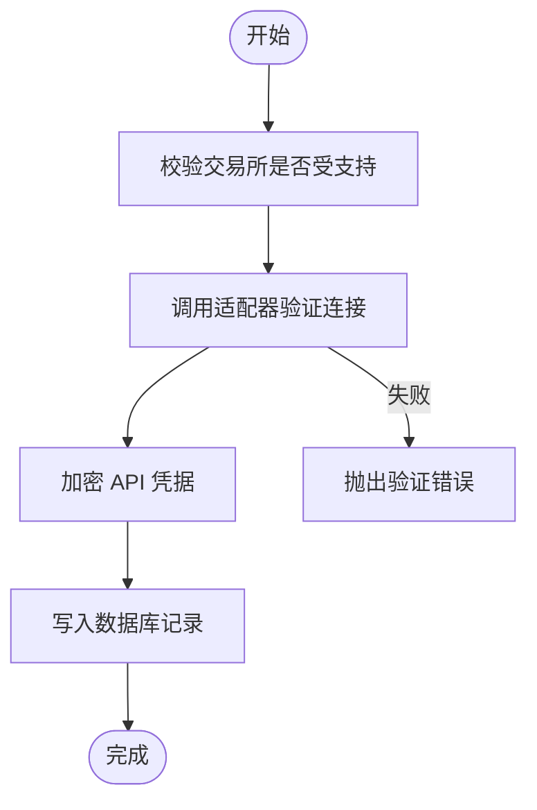
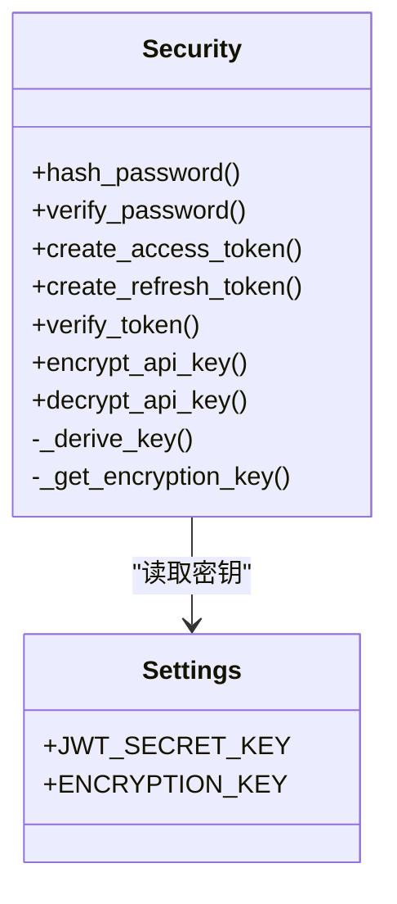
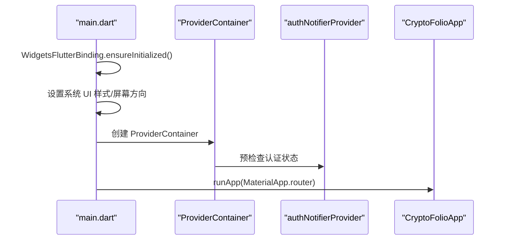
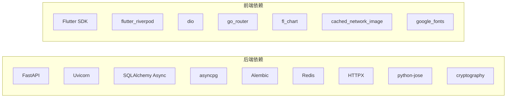

# 性能优化

<cite>
**本文引用的文件**
- [backend/app/main.py](file://backend/app/main.py)
- [backend/app/database.py](file://backend/app/database.py)
- [backend/app/config.py](file://backend/app/config.py)
- [backend/requirements.txt](file://backend/requirements.txt)
- [backend/app/routers/portfolio.py](file://backend/app/routers/portfolio.py)
- [backend/app/services/portfolio_service.py](file://backend/app/services/portfolio_service.py)
- [backend/app/schemas/portfolio.py](file://backend/app/schemas/portfolio.py)
- [backend/app/models/exchange_account.py](file://backend/app/models/exchange_account.py)
- [backend/app/services/exchange_service.py](file://backend/app/services/exchange_service.py)
- [backend/app/utils/security.py](file://backend/app/utils/security.py)
- [frontend/lib/main.dart](file://frontend/lib/main.dart)
- [frontend/pubspec.yaml](file://frontend/pubspec.yaml)
</cite>

## 目录
1. [简介](#简介)
2. [项目结构](#项目结构)
3. [核心组件](#核心组件)
4. [架构总览](#架构总览)
5. [详细组件分析](#详细组件分析)
6. [依赖分析](#依赖分析)
7. [性能考虑](#性能考虑)
8. [故障排查指南](#故障排查指南)
9. [结论](#结论)
10. [附录](#附录)

## 简介
本指南面向后端与前端性能优化，结合当前代码库现状，系统性地提出数据库查询优化、缓存策略、异步处理、前端 Flutter 应用优化、网络请求优化、UI 渲染优化、内存与垃圾回收优化、CDN 与静态资源优化、压缩策略、性能测试与基准测试、负载与压力测试、瓶颈识别与监控评估等实践建议。文档同时给出可操作的流程图与时序图，帮助不同技术背景的读者快速落地。

## 项目结构
后端采用 FastAPI + SQLAlchemy Async 异步 ORM 架构；前端采用 Flutter Riverpod 状态管理与路由体系。整体呈现清晰的分层：入口与中间件层、路由层、服务层、模型与数据访问层、工具与安全层；前端通过 Provider 初始化、主题与路由配置，构建统一的 UI 体验。

图表来源
- [backend/app/main.py:1-131](file://backend/app/main.py#L1-L131)
- [backend/app/routers/portfolio.py:1-217](file://backend/app/routers/portfolio.py#L1-L217)
- [backend/app/services/portfolio_service.py:1-317](file://backend/app/services/portfolio_service.py#L1-L317)
- [backend/app/database.py:1-33](file://backend/app/database.py#L1-L33)
- [backend/app/models/exchange_account.py:1-32](file://backend/app/models/exchange_account.py#L1-L32)
- [backend/app/utils/security.py:1-104](file://backend/app/utils/security.py#L1-L104)
- [backend/app/config.py:1-51](file://backend/app/config.py#L1-L51)
- [frontend/lib/main.dart:1-86](file://frontend/lib/main.dart#L1-L86)
- [frontend/pubspec.yaml:1-31](file://frontend/pubspec.yaml#L1-L31)

章节来源
- [backend/app/main.py:1-131](file://backend/app/main.py#L1-L131)
- [backend/app/config.py:1-51](file://backend/app/config.py#L1-L51)
- [frontend/lib/main.dart:1-86](file://frontend/lib/main.dart#L1-L86)
- [frontend/pubspec.yaml:1-31](file://frontend/pubspec.yaml#L1-L31)

## 核心组件
- 入口与生命周期：FastAPI 应用、CORS 中间件、异常处理器、健康检查、应用生命周期钩子。
- 数据库：异步引擎与会话工厂、依赖注入、模型定义。
- 配置：环境变量驱动的设置（数据库、Redis、JWT、加密、CORS、第三方 API）。
- 路由与服务：资产组合相关接口与服务层，预留真实数据聚合逻辑。
- 安全与加密：密码哈希、JWT、API Key 加解密与缓存派生密钥。
- 前端入口：系统 UI 样式、屏幕方向、Provider 初始化、主题与路由配置。

章节来源
- [backend/app/main.py:1-131](file://backend/app/main.py#L1-L131)
- [backend/app/database.py:1-33](file://backend/app/database.py#L1-L33)
- [backend/app/config.py:1-51](file://backend/app/config.py#L1-L51)
- [backend/app/routers/portfolio.py:1-217](file://backend/app/routers/portfolio.py#L1-L217)
- [backend/app/services/portfolio_service.py:1-317](file://backend/app/services/portfolio_service.py#L1-L317)
- [backend/app/utils/security.py:1-104](file://backend/app/utils/security.py#L1-L104)
- [frontend/lib/main.dart:1-86](file://frontend/lib/main.dart#L1-L86)

## 架构总览
后端采用“路由 → 服务 → 数据库”的清晰分层；服务层负责业务聚合，数据库层负责持久化；前端通过 Riverpod 管理状态，使用 Dio 进行网络请求，配合缓存图片与国际化等依赖提升体验。

图表来源
- [backend/app/main.py:1-131](file://backend/app/main.py#L1-L131)
- [backend/app/routers/portfolio.py:1-217](file://backend/app/routers/portfolio.py#L1-L217)
- [backend/app/services/portfolio_service.py:1-317](file://backend/app/services/portfolio_service.py#L1-L317)
- [backend/app/database.py:1-33](file://backend/app/database.py#L1-L33)
- [backend/app/models/exchange_account.py:1-32](file://backend/app/models/exchange_account.py#L1-L32)
- [backend/app/utils/security.py:1-104](file://backend/app/utils/security.py#L1-L104)
- [backend/app/config.py:1-51](file://backend/app/config.py#L1-L51)

## 详细组件分析

### 后端：数据库与会话管理
- 异步引擎与会话工厂：使用 SQLAlchemy Async Engine 与 AsyncSessionLocal，支持异步事务与自动关闭。
- 生命周期：在 lifespan 中进行数据库连接建立与关闭，确保资源释放。
- 依赖注入：get_db 提供异步上下文，避免泄漏与并发问题。

图表来源
- [backend/app/database.py:1-33](file://backend/app/database.py#L1-L33)

章节来源
- [backend/app/database.py:1-33](file://backend/app/database.py#L1-L33)
- [backend/app/main.py:13-31](file://backend/app/main.py#L13-L31)

### 后端：路由与服务层（资产组合）
- 路由层：提供资产概览、历史净值、持仓列表、数据源等接口，统一响应包装。
- 服务层：PortfolioService 当前返回 Mock 数据，预留真实聚合逻辑（查询账户、调用交易所 API、获取价格、计算统计）。
- 数据模型：PortfolioSummary、PortfolioHistory、HoldingsList、SourcesList 等 Pydantic 模型。

图表来源
- [backend/app/routers/portfolio.py:29-59](file://backend/app/routers/portfolio.py#L29-L59)
- [backend/app/services/portfolio_service.py:41-65](file://backend/app/services/portfolio_service.py#L41-L65)
- [backend/app/database.py:26-33](file://backend/app/database.py#L26-L33)

章节来源
- [backend/app/routers/portfolio.py:1-217](file://backend/app/routers/portfolio.py#L1-L217)
- [backend/app/services/portfolio_service.py:1-317](file://backend/app/services/portfolio_service.py#L1-L317)
- [backend/app/schemas/portfolio.py:1-152](file://backend/app/schemas/portfolio.py#L1-L152)

### 后端：交换连接与同步（ExchangeService）
- 支持交易所列表与校验：通过适配器验证连接有效性。
- 加密存储：使用 AES-256-GCM 对 API Key/Secret/Passphrase 加密保存。
- 连接管理：软删除断开连接、手动触发同步、查询状态。

图表来源
- [backend/app/services/exchange_service.py:231-301](file://backend/app/services/exchange_service.py#L231-L301)
- [backend/app/utils/security.py:85-104](file://backend/app/utils/security.py#L85-L104)

章节来源
- [backend/app/services/exchange_service.py:1-414](file://backend/app/services/exchange_service.py#L1-L414)
- [backend/app/utils/security.py:1-104](file://backend/app/utils/security.py#L1-L104)
- [backend/app/models/exchange_account.py:1-32](file://backend/app/models/exchange_account.py#L1-L32)

### 后端：安全与加密（JWT、API Key）
- 密码哈希：bcrypt。
- JWT：创建/刷新令牌与过期控制。
- API Key 加解密：HKDF 派生 32 字节密钥，AES-GCM 加密，模块级缓存避免重复派生。

图表来源
- [backend/app/utils/security.py:18-104](file://backend/app/utils/security.py#L18-L104)
- [backend/app/config.py:17-44](file://backend/app/config.py#L17-L44)

章节来源
- [backend/app/utils/security.py:1-104](file://backend/app/utils/security.py#L1-L104)
- [backend/app/config.py:1-51](file://backend/app/config.py#L1-L51)

### 前端：Flutter 应用入口与配置
- 系统 UI 样式与屏幕方向设置。
- Provider 初始化与认证状态预检查。
- 主题与路由配置，媒体查询固定文本缩放以稳定布局。

图表来源
- [frontend/lib/main.dart:9-41](file://frontend/lib/main.dart#L9-L41)

章节来源
- [frontend/lib/main.dart:1-86](file://frontend/lib/main.dart#L1-L86)
- [frontend/pubspec.yaml:1-31](file://frontend/pubspec.yaml#L1-L31)

## 依赖分析
- 后端依赖：FastAPI、Uvicorn、SQLAlchemy Async、Alembic、asyncpg、Redis、HTTPX、JWT、加密库等。
- 前端依赖：Flutter SDK、Riverpod、Dio、go_router、fl_chart、cached_network_image、google_fonts 等。

图表来源
- [backend/requirements.txt:1-15](file://backend/requirements.txt#L1-L15)
- [frontend/pubspec.yaml:9-27](file://frontend/pubspec.yaml#L9-L27)

章节来源
- [backend/requirements.txt:1-15](file://backend/requirements.txt#L1-L15)
- [frontend/pubspec.yaml:1-31](file://frontend/pubspec.yaml#L1-L31)

## 性能考虑

### 后端性能优化策略

- 数据库查询优化
  - 使用异步会话与连接池，避免阻塞；在服务层按需查询，减少 N+1 查询。
  - 对高频查询建立合适索引（如用户维度、状态字段、时间戳范围查询）。
  - 使用分页与批量查询，限制单次返回数据量。
  - 将复杂聚合逻辑下沉到数据库，减少 Python 层计算。

- 缓存策略优化
  - 使用 Redis 缓存热点数据（如资产概览、历史净值、价格缓存、JWT 白名单）。
  - 对于外部 API（如 CoinGecko），设置 TTL 并实现多级缓存（内存 + Redis）。
  - 缓存失效策略：基于时间窗口与事件驱动（如数据源更新后主动失效）。

- 异步处理优化
  - 将耗时任务（如同步交易所余额、计算历史净值）放入后台队列或定时任务。
  - 使用 Redis Streams 或消息队列（如 Celery/Arq）解耦实时接口与后台任务。
  - 在 FastAPI 中利用 lifespan 管理长生命周期资源，避免重复初始化。

- 网络请求优化
  - 合理设置 HTTPX 超时与重试策略，启用连接复用。
  - 对第三方 API 进行限流与熔断，避免雪崩效应。
  - 批量请求与去重，减少往返次数。

- 错误处理与可观测性
  - 全局异常处理器输出结构化错误，便于日志与告警。
  - 记录关键路径耗时（数据库、外部 API、序列化），埋点指标。

章节来源
- [backend/app/main.py:65-91](file://backend/app/main.py#L65-L91)
- [backend/app/config.py:14-30](file://backend/app/config.py#L14-L30)
- [backend/app/services/portfolio_service.py:41-317](file://backend/app/services/portfolio_service.py#L41-L317)
- [backend/app/services/exchange_service.py:231-348](file://backend/app/services/exchange_service.py#L231-L348)

### 前端性能优化策略

- Flutter 应用优化
  - 使用 Riverpod 精准订阅，避免不必要的重建。
  - 合理拆分页面与懒加载，延迟初始化重型组件。
  - 固定文本缩放与设备方向限制，保证布局稳定性。

- 网络请求优化
  - 使用 Dio 的拦截器统一处理超时、重试、缓存与错误。
  - 对图片使用 cached_network_image，开启磁盘缓存与尺寸适配。
  - 合理设置请求头与压缩（gzip/br），减少带宽占用。

- UI 渲染优化
  - 避免深层嵌套 Widget 树，使用 const 构造与不可变对象。
  - 使用 ListView.builder 与 GridView.builder 处理长列表。
  - 控制动画与阴影，减少过度绘制。

章节来源
- [frontend/lib/main.dart:9-86](file://frontend/lib/main.dart#L9-L86)
- [frontend/pubspec.yaml:9-27](file://frontend/pubspec.yaml#L9-L27)

### 内存管理与垃圾回收优化
- 后端：使用异步上下文管理会话，及时关闭连接；避免在请求中持有大对象引用；合理使用生成器与分页。
- 前端：避免持有大量监听器与闭包引用；使用 WeakReference（如适用）；及时取消订阅与取消网络请求。

### CDN、静态资源与压缩
- 静态资源：将前端构建产物托管至 CDN，开启缓存与压缩（gzip/br）。
- 图片优化：WebP/JPEG2000，按需加载与懒加载。
- 压缩策略：启用 Gzip/Brotli，最小化 JS/CSS，Tree-shaking 与代码分割。

### 性能测试与基准测试
- 工具：Locust（负载）、Artillery（基准）、JMeter（功能与压力）、K6（云原生）。
- 指标：RPS、P95/P99 延迟、CPU/内存/GC、数据库连接数、Redis 命中率。
- 方法：逐步增加并发，观察指标拐点；对比不同配置（连接池、缓存命中率、异步 vs 同步）。

### 负载与压力测试
- 场景设计：登录/鉴权、资产概览、历史净值、同步数据源等关键路径。
- 压力点：数据库写入峰值、外部 API 限流、Redis 命中率下降。
- 观察：线程/进程数、GC 次数与暂停时间、慢查询日志。

### 瓶颈识别与解决方案
- 数据库瓶颈：慢查询、锁竞争、连接池耗尽。方案：索引优化、读写分离、连接池调优、分库分表。
- 缓存瓶颈：缓存穿透/击穿/雪崩。方案：布隆过滤器、互斥锁、多级缓存、失效分散。
- 外部依赖：第三方 API 限流与超时。方案：熔断、降级、本地缓存兜底。
- 前端卡顿：主线程阻塞、过度重建、图片未缓存。方案：异步加载、Riverpod 粒度控制、图片缓存。

### 性能监控与评估
- 指标：QPS、错误率、P95/P99 延迟、数据库慢查询、Redis 命中率、GC 指标、CPU/内存。
- 工具：Prometheus + Grafana、APM（如 New Relic/DataDog）、日志聚合（ELK/Cloud Logging）。
- 评估：A/B 测试对比优化前后指标变化，持续回归。

## 故障排查指南
- 数据库连接失败：检查 DATABASE_URL、网络连通性与凭据；查看 lifespan 输出日志。
- CORS 问题：确认 ALLOWED_ORIGINS 与调试模式下的开发来源。
- 异常处理：全局异常处理器返回结构化错误，定位具体路由与服务层调用栈。
- 加密与 JWT：核对密钥长度与算法配置，生产环境必须设置密钥。

章节来源
- [backend/app/main.py:13-31](file://backend/app/main.py#L13-L31)
- [backend/app/main.py:44-62](file://backend/app/main.py#L44-L62)
- [backend/app/main.py:65-91](file://backend/app/main.py#L65-L91)
- [backend/app/config.py:32-44](file://backend/app/config.py#L32-L44)

## 结论
本指南基于现有代码结构，提出了后端与前端的系统性性能优化路径。建议优先落地：数据库索引与分页、Redis 缓存与失效策略、异步后台任务、Dio 缓存与图片优化、Riverpod 精准订阅与 UI 渲染优化，并配套完善的性能测试与监控体系，持续迭代。

## 附录
- 快速检查清单
  - 后端：连接池配置、索引覆盖、缓存命中率、异步任务、熔断降级、日志与指标。
  - 前端：图片缓存、列表懒加载、主题与布局稳定性、网络拦截器、订阅粒度。
- 参考文件
  - [backend/app/main.py:1-131](file://backend/app/main.py#L1-L131)
  - [backend/app/database.py:1-33](file://backend/app/database.py#L1-L33)
  - [backend/app/config.py:1-51](file://backend/app/config.py#L1-L51)
  - [backend/app/routers/portfolio.py:1-217](file://backend/app/routers/portfolio.py#L1-L217)
  - [backend/app/services/portfolio_service.py:1-317](file://backend/app/services/portfolio_service.py#L1-L317)
  - [backend/app/services/exchange_service.py:1-414](file://backend/app/services/exchange_service.py#L1-L414)
  - [backend/app/utils/security.py:1-104](file://backend/app/utils/security.py#L1-L104)
  - [frontend/lib/main.dart:1-86](file://frontend/lib/main.dart#L1-L86)
  - [frontend/pubspec.yaml:1-31](file://frontend/pubspec.yaml#L1-L31)