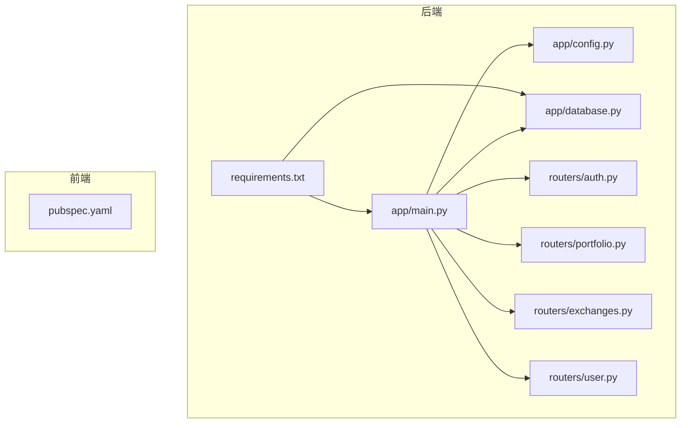
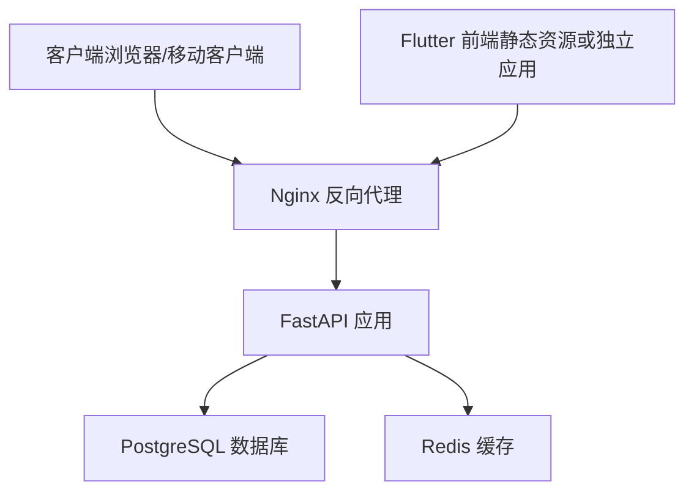
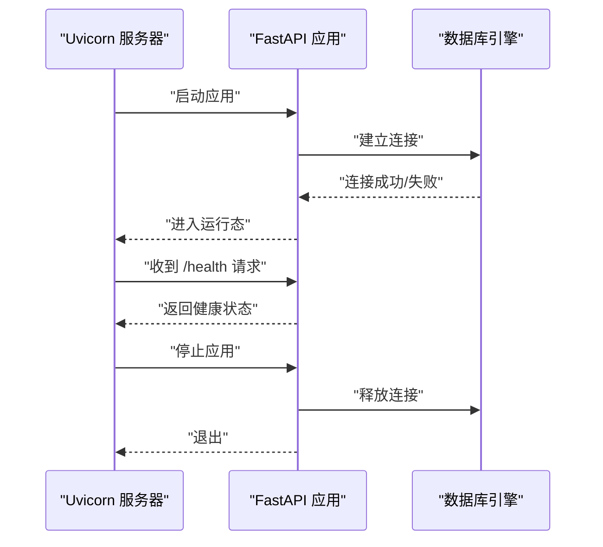
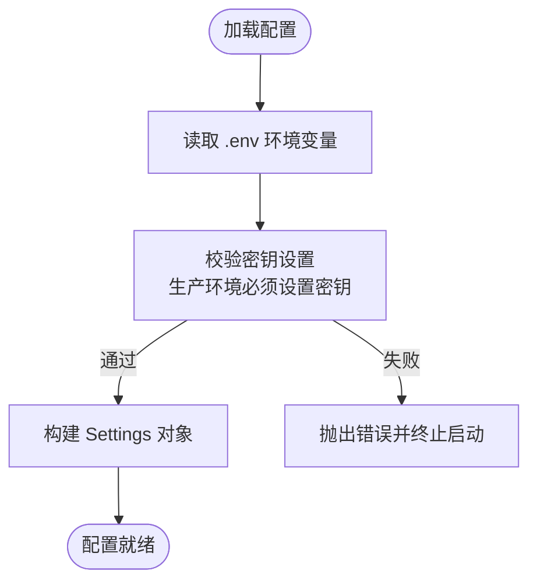
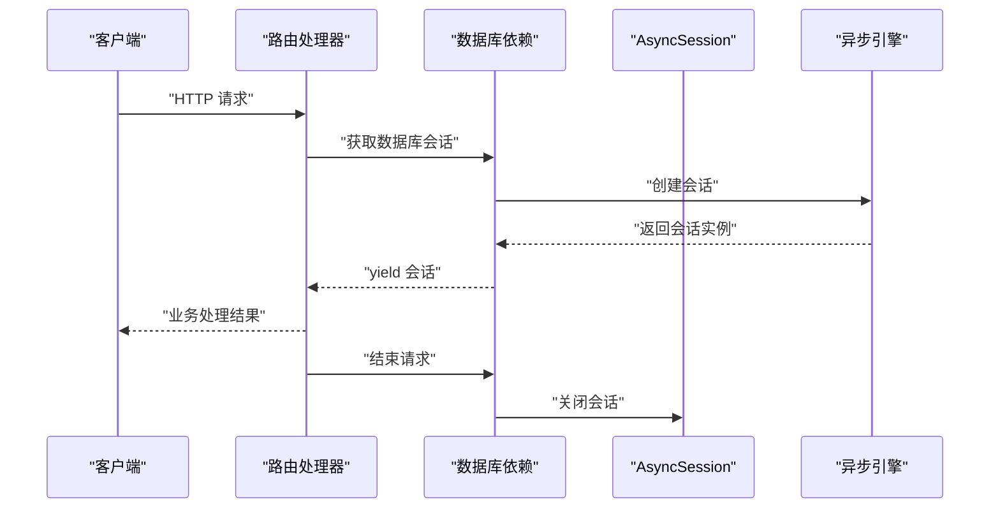
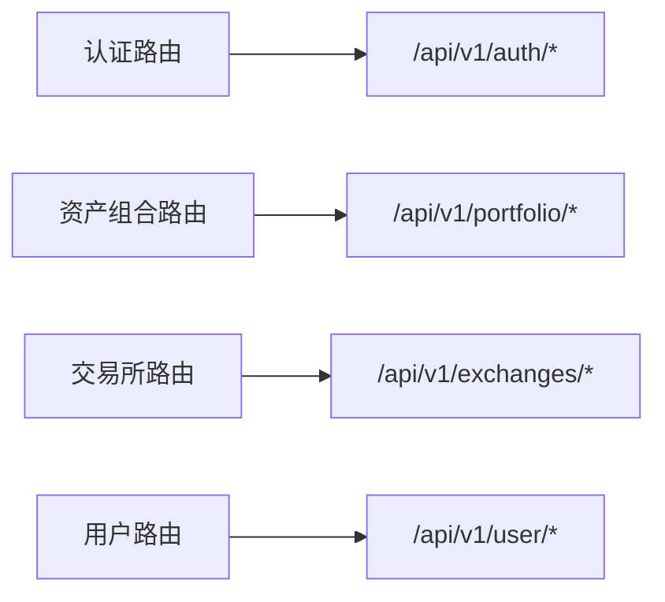
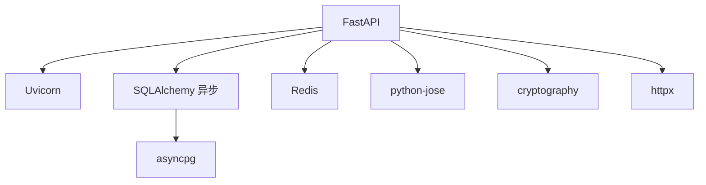

# 生产环境部署

<cite>
**本文引用的文件**
- [backend/app/main.py](file://backend/app/main.py)
- [backend/app/config.py](file://backend/app/config.py)
- [backend/app/database.py](file://backend/app/database.py)
- [backend/requirements.txt](file://backend/requirements.txt)
- [backend/app/routers/auth.py](file://backend/app/routers/auth.py)
- [backend/app/routers/portfolio.py](file://backend/app/routers/portfolio.py)
- [backend/app/routers/exchanges.py](file://backend/app/routers/exchanges.py)
- [backend/app/routers/user.py](file://backend/app/routers/user.py)
- [frontend/pubspec.yaml](file://frontend/pubspec.yaml)
</cite>

## 目录
1. [简介](#简介)
2. [项目结构](#项目结构)
3. [核心组件](#核心组件)
4. [架构总览](#架构总览)
5. [详细组件分析](#详细组件分析)
6. [依赖关系分析](#依赖关系分析)
7. [性能考量](#性能考量)
8. [故障排查指南](#故障排查指南)
9. [结论](#结论)
10. [附录](#附录)

## 简介
本指南面向生产环境部署，围绕后端服务（FastAPI + SQLAlchemy 异步 ORM）、数据库（PostgreSQL）、缓存（Redis）以及前端 Flutter 应用，提供从容器化到反向代理、SSL 与负载均衡、进程管理与监控、自动化部署流程的完整方案。文档严格基于仓库现有代码与依赖进行分析，并给出可操作的配置建议与最佳实践。

## 项目结构
后端采用 FastAPI 应用，通过异步数据库引擎与依赖注入组织路由模块；前端为 Flutter 应用，使用包管理工具进行依赖声明。整体结构清晰，便于容器化与编排。

**图表来源**
- [backend/app/main.py:1-131](file://backend/app/main.py#L1-L131)
- [backend/app/config.py:1-51](file://backend/app/config.py#L1-L51)
- [backend/app/database.py:1-33](file://backend/app/database.py#L1-L33)
- [backend/requirements.txt:1-15](file://backend/requirements.txt#L1-L15)
- [backend/app/routers/auth.py:1-253](file://backend/app/routers/auth.py#L1-L253)
- [backend/app/routers/portfolio.py:1-217](file://backend/app/routers/portfolio.py#L1-L217)
- [backend/app/routers/exchanges.py:1-225](file://backend/app/routers/exchanges.py#L1-L225)
- [backend/app/routers/user.py:1-280](file://backend/app/routers/user.py#L1-L280)
- [frontend/pubspec.yaml:1-53](file://frontend/pubspec.yaml#L1-L53)

**章节来源**
- [backend/app/main.py:1-131](file://backend/app/main.py#L1-L131)
- [backend/app/config.py:1-51](file://backend/app/config.py#L1-L51)
- [backend/app/database.py:1-33](file://backend/app/database.py#L1-L33)
- [backend/requirements.txt:1-15](file://backend/requirements.txt#L1-L15)
- [frontend/pubspec.yaml:1-53](file://frontend/pubspec.yaml#L1-L53)

## 核心组件
- 应用入口与生命周期：应用在启动时建立数据库连接并在关闭时释放；提供健康检查端点与根路径响应。
- 配置系统：通过 Pydantic Settings 读取环境变量，支持开发与生产模式差异校验（如密钥必须在生产环境设置）。
- 数据库层：异步引擎与会话工厂，提供依赖注入式数据库会话获取。
- 路由模块：认证、资产组合、交易所连接、用户信息等模块化路由。
- 前端依赖：Flutter 应用的包依赖与字体资源声明。

**章节来源**
- [backend/app/main.py:13-31](file://backend/app/main.py#L13-L31)
- [backend/app/main.py:103-121](file://backend/app/main.py#L103-L121)
- [backend/app/config.py:5-44](file://backend/app/config.py#L5-L44)
- [backend/app/database.py:6-20](file://backend/app/database.py#L6-L20)
- [backend/app/database.py:26-33](file://backend/app/database.py#L26-L33)
- [backend/app/routers/auth.py:22-253](file://backend/app/routers/auth.py#L22-L253)
- [backend/app/routers/portfolio.py:26-217](file://backend/app/routers/portfolio.py#L26-L217)
- [backend/app/routers/exchanges.py:20-225](file://backend/app/routers/exchanges.py#L20-L225)
- [backend/app/routers/user.py:19-280](file://backend/app/routers/user.py#L19-L280)
- [frontend/pubspec.yaml:9-27](file://frontend/pubspec.yaml#L9-L27)

## 架构总览
下图展示生产环境典型拓扑：反向代理（Nginx）接收外部请求，转发至后端服务；后端服务访问 PostgreSQL 与 Redis；前端通过域名访问 Nginx。

[此图为概念性架构示意，无需图表来源]

## 详细组件分析

### 应用生命周期与健康检查
- 启动阶段：应用在 lifespan 中尝试建立数据库连接，打印连接状态。
- 关闭阶段：释放数据库引擎连接。
- 健康检查：提供 /health 端点返回应用状态与版本信息。

**图表来源**
- [backend/app/main.py:13-31](file://backend/app/main.py#L13-L31)
- [backend/app/main.py:103-110](file://backend/app/main.py#L103-L110)

**章节来源**
- [backend/app/main.py:13-31](file://backend/app/main.py#L13-L31)
- [backend/app/main.py:103-110](file://backend/app/main.py#L103-L110)

### 配置与环境变量
- 应用名称、调试模式、API 前缀、CORS 允许来源等。
- 数据库连接字符串（默认本地 PostgreSQL）。
- Redis 连接字符串（默认本地 Redis）。
- JWT 密钥与算法、加密密钥（生产环境必须通过环境变量设置）。
- CoinGecko API 地址。

**图表来源**
- [backend/app/config.py:32-44](file://backend/app/config.py#L32-L44)

**章节来源**
- [backend/app/config.py:5-31](file://backend/app/config.py#L5-L31)
- [backend/app/config.py:32-44](file://backend/app/config.py#L32-L44)

### 数据库与会话依赖
- 使用异步引擎与会话工厂，提供依赖注入式数据库会话。
- 在请求处理中自动创建与关闭会话，确保资源回收。

**图表来源**
- [backend/app/database.py:26-33](file://backend/app/database.py#L26-L33)

**章节来源**
- [backend/app/database.py:6-20](file://backend/app/database.py#L6-L20)
- [backend/app/database.py:26-33](file://backend/app/database.py#L26-L33)

### 路由模块与对外接口
- 认证模块：注册、登录、刷新令牌、OAuth 登录、登出等。
- 资产组合模块：概览、历史净值、持仓列表、数据源列表。
- 交易所模块：支持列表、已连接列表、连接/断开、手动同步、状态查询。
- 用户模块：个人资料、偏好设置、安全设置、已连 API 列表等。

**图表来源**
- [backend/app/routers/auth.py:22-253](file://backend/app/routers/auth.py#L22-L253)
- [backend/app/routers/portfolio.py:26-217](file://backend/app/routers/portfolio.py#L26-L217)
- [backend/app/routers/exchanges.py:20-225](file://backend/app/routers/exchanges.py#L20-L225)
- [backend/app/routers/user.py:19-280](file://backend/app/routers/user.py#L19-L280)

**章节来源**
- [backend/app/routers/auth.py:22-253](file://backend/app/routers/auth.py#L22-L253)
- [backend/app/routers/portfolio.py:26-217](file://backend/app/routers/portfolio.py#L26-L217)
- [backend/app/routers/exchanges.py:20-225](file://backend/app/routers/exchanges.py#L20-L225)
- [backend/app/routers/user.py:19-280](file://backend/app/routers/user.py#L19-L280)

### 前端依赖与构建
- Flutter 依赖声明与生成器工具。
- 字体资源定义，便于在应用中使用。

**章节来源**
- [frontend/pubspec.yaml:9-27](file://frontend/pubspec.yaml#L9-L27)
- [frontend/pubspec.yaml:32-52](file://frontend/pubspec.yaml#L32-L52)

## 依赖关系分析
- 后端依赖：FastAPI、异步数据库驱动、Alembic、Redis、JWT 加解密、HTTP 客户端、加密库等。
- 运行时：Uvicorn 作为 ASGI 服务器，负责监听端口与处理请求。
- 数据库：PostgreSQL 异步驱动用于连接与查询。
- 缓存：Redis 用于会话、令牌缓存或任务队列等场景。

**图表来源**
- [backend/requirements.txt:1-15](file://backend/requirements.txt#L1-L15)

**章节来源**
- [backend/requirements.txt:1-15](file://backend/requirements.txt#L1-L15)

## 性能考量
- 异步 I/O：使用异步数据库引擎与 HTTP 客户端，减少阻塞，提升并发能力。
- 会话复用：通过会话工厂与依赖注入，避免重复创建连接。
- 缓存策略：结合 Redis 实现热点数据缓存与令牌存储，降低数据库压力。
- CORS 与中间件：仅在开发环境放宽 CORS，生产环境严格限制来源，减少跨域风险与额外处理。
- 健康检查：定期探活，配合负载均衡与容器编排实现快速故障切换。

[本节为通用性能建议，无需章节来源]

## 故障排查指南
- 启动失败（密钥缺失）：生产环境必须设置密钥，否则启动即报错。
- 数据库连接异常：检查连接字符串、网络连通性与数据库服务状态。
- CORS 错误：确认生产环境允许来源配置正确。
- 500 内部错误：全局异常处理器统一返回结构化错误，便于定位问题。
- 健康检查失败：查看 /health 端点返回，确认应用生命周期钩子正常执行。

**章节来源**
- [backend/app/config.py:32-44](file://backend/app/config.py#L32-L44)
- [backend/app/main.py:23-25](file://backend/app/main.py#L23-L25)
- [backend/app/main.py:66-91](file://backend/app/main.py#L66-L91)
- [backend/app/main.py:103-110](file://backend/app/main.py#L103-L110)

## 结论
本项目具备良好的模块化与异步特性，适合在生产环境中以容器化与反向代理的方式部署。通过严格的环境变量管理、合理的数据库与缓存配置、完善的健康检查与异常处理，可实现高可用、可扩展的服务架构。

[本节为总结，无需章节来源]

## 附录

### A. Docker 容器化部署流程（建议步骤）
- 准备工作
  - 在后端根目录准备 .env 文件，设置生产环境所需的密钥与数据库、Redis 连接字符串。
  - 确保 PostgreSQL 与 Redis 服务可用且网络可达。
- 编写 Dockerfile（示例思路）
  - 基于 Python 官方镜像，设置工作目录与环境变量。
  - 复制 requirements.txt 并安装依赖。
  - 复制后端代码，暴露应用监听端口。
  - 设置启动命令为 uvicorn 运行应用。
- 构建镜像
  - 使用 docker build 命令构建后端镜像。
- 运行容器
  - 使用 docker run 或 docker-compose 启动容器，挂载 .env 文件并映射端口。
- 验证
  - 访问 /health 确认服务健康；调用认证与资产相关接口验证功能。

[本节为通用流程建议，无需章节来源]

### B. 环境变量配置要点
- 必填项（生产环境）
  - JWT_SECRET_KEY：用于签发与验证令牌。
  - ENCRYPTION_KEY：用于敏感信息加密。
- 数据库与缓存
  - DATABASE_URL：指向生产数据库。
  - REDIS_URL：指向生产 Redis。
- CORS 与应用
  - ALLOWED_ORIGINS：生产环境允许的前端域名列表。
  - API_V1_PREFIX：API 前缀（如需变更）。
- 第三方服务
  - COINGECKO_API_URL：行情数据接口地址。

**章节来源**
- [backend/app/config.py:11-31](file://backend/app/config.py#L11-L31)
- [backend/app/config.py:32-44](file://backend/app/config.py#L32-L44)

### C. Nginx 反向代理与 SSL 配置（建议步骤）
- 反向代理
  - 将 /api/* 转发至后端服务地址与端口。
  - 静态资源（如前端构建产物）可直接由 Nginx 提供。
- SSL 证书
  - 使用 Let’s Encrypt 获取免费证书，或购买商业证书。
  - 配置 HTTPS 监听与证书路径。
- 负载均衡
  - 多实例部署时，使用上游组与轮询策略分发请求。
  - 配置健康检查与超时参数，确保故障切换。

[本节为通用配置建议，无需章节来源]

### D. PM2 与 Gunicorn（可选）与进程监控
- PM2（Node.js 生态常用）
  - 适用于前端构建产物或 Node 侧服务；对 Python 后端通常使用 Uvicorn。
- Gunicorn（Python WSGI）
  - 若采用 WSGI 模式，可使用 Gunicorn；本项目使用 ASGI（Uvicorn），更契合异步特性。
- 进程监控
  - 结合系统监控工具与日志聚合，关注 CPU、内存、连接数与错误率。

[本节为通用建议，无需章节来源]

### E. 自动化部署脚本与流程（建议步骤）
- GitOps 流程
  - 代码提交触发 CI/CD；构建镜像并推送至镜像仓库。
  - 使用 kubectl 或 docker-compose 部署新镜像。
- 回滚策略
  - 保留最近几个版本镜像，支持一键回滚。
- 健康检查与蓝绿发布
  - 部署后执行健康检查；通过流量切换实现零停机发布。

[本节为通用流程建议，无需章节来源]

### F. 域名、DNS 与 HTTPS 配置
- 域名解析
  - 将域名 A/AAAA 记录指向 Nginx 所在服务器 IP。
- DNS 设置
  - 配置 TXT 记录（如使用 Let’s Encrypt）与安全记录（MX、SPF 等）。
- HTTPS
  - 配置证书与 TLS 版本、加密套件；启用 HSTS（可选）。

[本节为通用配置建议，无需章节来源]

### G. 部署前检查清单
- 环境变量齐全且正确（密钥、数据库、Redis、CORS）。
- 数据库与 Redis 可达且权限正确。
- Nginx 配置完成并可访问 /health。
- SSL 证书有效且配置正确。
- 前端构建产物可被 Nginx 正常提供。
- 容器镜像构建成功并通过本地测试。

[本节为通用清单，无需章节来源]

### H. 部署后验证步骤
- 健康检查：GET /health。
- 认证流程：注册、登录、刷新令牌、登出。
- 资产组合：获取概览、历史净值、持仓列表。
- 交易所：连接/断开、手动同步、状态查询。
- 用户：获取/更新资料、偏好与安全设置。

**章节来源**
- [backend/app/main.py:103-110](file://backend/app/main.py#L103-L110)
- [backend/app/routers/auth.py:25-80](file://backend/app/routers/auth.py#L25-L80)
- [backend/app/routers/portfolio.py:33-100](file://backend/app/routers/portfolio.py#L33-L100)
- [backend/app/routers/exchanges.py:84-172](file://backend/app/routers/exchanges.py#L84-L172)
- [backend/app/routers/user.py:24-121](file://backend/app/routers/user.py#L24-L121)