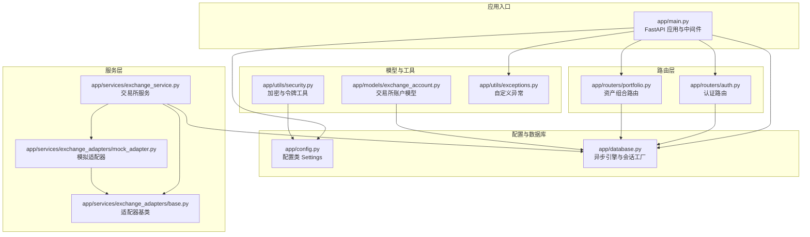
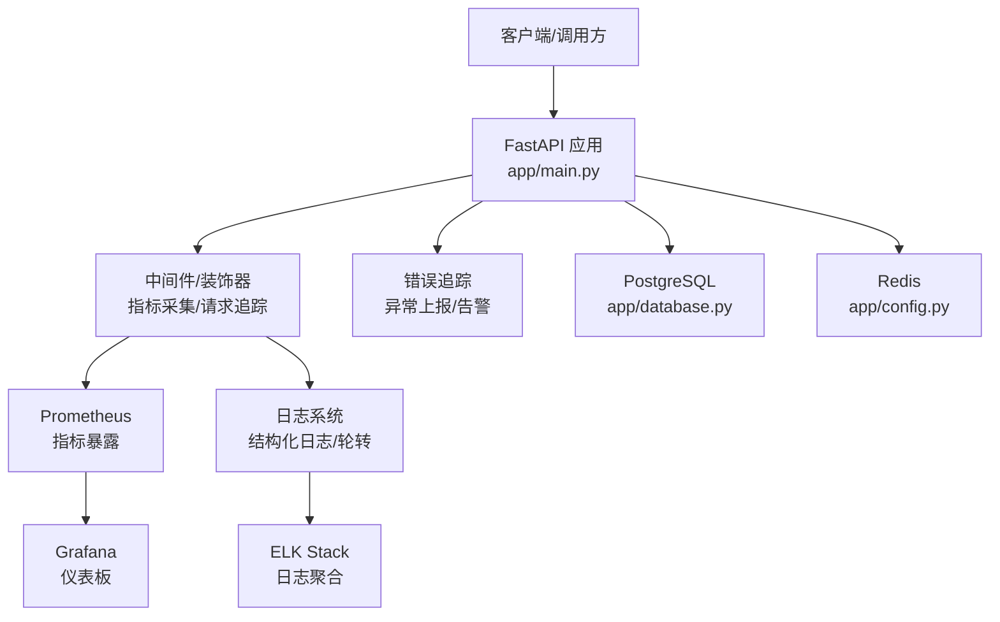
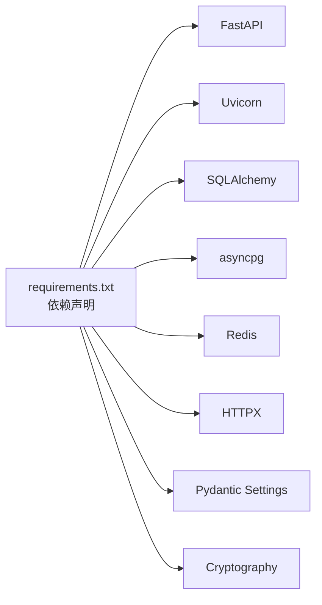

# 监控日志系统

<cite>
**本文档引用的文件**
- [backend/app/main.py](file://backend/app/main.py)
- [backend/app/config.py](file://backend/app/config.py)
- [backend/app/database.py](file://backend/app/database.py)
- [backend/app/utils/exceptions.py](file://backend/app/utils/exceptions.py)
- [backend/requirements.txt](file://backend/requirements.txt)
- [backend/app/routers/auth.py](file://backend/app/routers/auth.py)
- [backend/app/routers/portfolio.py](file://backend/app/routers/portfolio.py)
- [backend/app/services/exchange_service.py](file://backend/app/services/exchange_service.py)
- [backend/app/services/exchange_adapters/base.py](file://backend/app/services/exchange_adapters/base.py)
- [backend/app/services/exchange_adapters/mock_adapter.py](file://backend/app/services/exchange_adapters/mock_adapter.py)
- [backend/app/models/exchange_account.py](file://backend/app/models/exchange_account.py)
- [backend/app/utils/security.py](file://backend/app/utils/security.py)
</cite>

## 目录
1. [简介](#简介)
2. [项目结构](#项目结构)
3. [核心组件](#核心组件)
4. [架构总览](#架构总览)
5. [详细组件分析](#详细组件分析)
6. [依赖分析](#依赖分析)
7. [性能考虑](#性能考虑)
8. [故障排查指南](#故障排查指南)
9. [结论](#结论)
10. [附录](#附录)

## 简介
本指南面向监控日志系统的落地实施，结合当前代码库现状，提供一套可操作的监控与日志方案。内容涵盖：
- 应用性能监控：基于 FastAPI 的指标采集、数据库查询监控、Redis 性能监控
- 日志系统：结构化日志记录、日志级别配置、日志轮转策略
- 错误追踪：异常捕获、错误报告与告警机制
- Prometheus 指标暴露与 Grafana 仪表板配置、告警规则
- ELK Stack 日志聚合与 APM 工具集成建议
- 关键性能指标（KPI）定义与阈值设定

当前代码库已具备基础的异常处理与健康检查端点，后续可在不侵入业务逻辑的前提下，通过中间件、装饰器与外部组件实现上述监控能力。

## 项目结构
后端采用 FastAPI 架构，模块化组织如下：
- 配置层：集中管理应用配置与环境变量
- 数据访问层：异步 SQLAlchemy 引擎与会话工厂
- 路由层：按功能划分的 API 路由（认证、资产组合、交易所等）
- 服务层：业务逻辑封装（如交换适配器、加密工具）
- 工具层：异常类型与安全工具
- 依赖注入：数据库会话依赖、用户鉴权依赖

**图表来源**
- [backend/app/main.py:1-131](file://backend/app/main.py#L1-L131)
- [backend/app/config.py:1-51](file://backend/app/config.py#L1-L51)
- [backend/app/database.py:1-33](file://backend/app/database.py#L1-L33)
- [backend/app/routers/auth.py:1-253](file://backend/app/routers/auth.py#L1-L253)
- [backend/app/routers/portfolio.py:1-217](file://backend/app/routers/portfolio.py#L1-L217)
- [backend/app/services/exchange_service.py:1-414](file://backend/app/services/exchange_service.py#L1-L414)
- [backend/app/services/exchange_adapters/base.py:1-73](file://backend/app/services/exchange_adapters/base.py#L1-L73)
- [backend/app/services/exchange_adapters/mock_adapter.py:1-110](file://backend/app/services/exchange_adapters/mock_adapter.py#L1-L110)
- [backend/app/models/exchange_account.py:1-32](file://backend/app/models/exchange_account.py#L1-L32)
- [backend/app/utils/security.py:1-97](file://backend/app/utils/security.py#L1-L97)
- [backend/app/utils/exceptions.py:1-67](file://backend/app/utils/exceptions.py#L1-L67)

**章节来源**
- [backend/app/main.py:1-131](file://backend/app/main.py#L1-L131)
- [backend/app/config.py:1-51](file://backend/app/config.py#L1-L51)
- [backend/app/database.py:1-33](file://backend/app/database.py#L1-L33)

## 核心组件
- FastAPI 应用与生命周期：应用启动时建立数据库连接，关闭时释放；提供全局异常处理器与健康检查端点
- 配置中心：集中管理应用名称、调试模式、数据库与 Redis 连接、JWT 参数、CORS 允许来源等
- 数据库层：异步引擎与会话工厂，支持 echo 开关用于开发调试
- 异常体系：统一的 AppException 及其子类，覆盖认证、未找到、校验、交易所连接等场景
- 加密与安全：密码哈希、JWT 创建与校验、API 密钥加解密

**章节来源**
- [backend/app/main.py:13-31](file://backend/app/main.py#L13-L31)
- [backend/app/main.py:65-91](file://backend/app/main.py#L65-L91)
- [backend/app/main.py:103-110](file://backend/app/main.py#L103-L110)
- [backend/app/config.py:5-51](file://backend/app/config.py#L5-L51)
- [backend/app/database.py:6-20](file://backend/app/database.py#L6-L20)
- [backend/app/utils/exceptions.py:4-67](file://backend/app/utils/exceptions.py#L4-L67)
- [backend/app/utils/security.py:18-97](file://backend/app/utils/security.py#L18-L97)

## 架构总览
下图展示监控日志系统在现有架构中的位置与交互关系。监控组件以非侵入方式接入，通过中间件、装饰器与外部服务实现指标采集、日志记录与错误追踪。

[此图为概念性架构示意，无需图表来源]

## 详细组件分析

### FastAPI 应用与中间件
- 生命周期钩子：在启动阶段尝试建立数据库连接并在失败时输出错误信息；关闭阶段释放连接
- 全局异常处理：对自定义异常与通用异常分别返回标准化响应
- 健康检查：提供 /health 端点返回应用状态
- CORS 中间件：根据调试模式动态配置允许来源

建议在此基础上增加：
- 请求耗时与状态码统计中间件
- 访问日志中间件（结构化 JSON）
- 异常到错误追踪系统的上报装饰器

**章节来源**
- [backend/app/main.py:13-31](file://backend/app/main.py#L13-L31)
- [backend/app/main.py:44-62](file://backend/app/main.py#L44-L62)
- [backend/app/main.py:65-91](file://backend/app/main.py#L65-L91)
- [backend/app/main.py:103-110](file://backend/app/main.py#L103-L110)

### 配置与数据库
- 配置类 Settings：集中管理应用参数，支持开发默认值与生产校验
- 异步数据库引擎：echo 开关便于开发调试；会话工厂支持自动提交与过期控制
- Redis 连接：通过配置项提供连接字符串

建议在此基础上增加：
- Prometheus 客户端初始化与指标注册
- 结构化日志配置（JSON 格式、级别、字段）
- 日志轮转策略（按大小/时间）

**章节来源**
- [backend/app/config.py:5-51](file://backend/app/config.py#L5-L51)
- [backend/app/database.py:6-20](file://backend/app/database.py#L6-L20)

### 异常体系与错误追踪
- 自定义异常：认证失败、资源未找到、参数校验失败、交易所连接失败等
- 全局异常处理器：将异常转换为统一的 JSON 响应格式

建议在此基础上增加：
- 将异常事件上报至错误追踪平台（如 Sentry）
- 为关键路径添加上下文信息（trace_id、用户标识等）
- 配置告警规则（如错误率阈值、异常堆栈重复告警）

**章节来源**
- [backend/app/utils/exceptions.py:4-67](file://backend/app/utils/exceptions.py#L4-L67)
- [backend/app/main.py:65-91](file://backend/app/main.py#L65-L91)

### 服务层与交换适配器
- 交易所服务：支持连接、断开、同步、状态查询等
- 适配器抽象：定义统一接口，模拟适配器用于开发测试
- 加密工具：API 密钥加解密，保障敏感信息存储安全

建议在此基础上增加：
- 在适配器调用前后埋点，记录调用耗时与结果
- 对外部 API 调用进行超时与重试控制，并记录失败原因
- 将适配器调用指标暴露给 Prometheus

**章节来源**
- [backend/app/services/exchange_service.py:26-414](file://backend/app/services/exchange_service.py#L26-L414)
- [backend/app/services/exchange_adapters/base.py:5-73](file://backend/app/services/exchange_adapters/base.py#L5-L73)
- [backend/app/services/exchange_adapters/mock_adapter.py:10-110](file://backend/app/services/exchange_adapters/mock_adapter.py#L10-L110)
- [backend/app/utils/security.py:78-97](file://backend/app/utils/security.py#L78-L97)

### 路由层与业务端点
- 认证路由：注册、登录、刷新、登出、第三方 OAuth
- 资产组合路由：概览、历史净值、持仓列表、数据源列表

建议在此基础上增加：
- 为每个端点添加执行时间与错误计数指标
- 对敏感操作（登录、登出、刷新）记录审计日志
- 对外部依赖（如 OAuth 验证）记录调用结果与耗时

**章节来源**
- [backend/app/routers/auth.py:25-253](file://backend/app/routers/auth.py#L25-L253)
- [backend/app/routers/portfolio.py:33-217](file://backend/app/routers/portfolio.py#L33-L217)

## 依赖分析
- 外部依赖：FastAPI、Uvicorn、SQLAlchemy、Alembic、asyncpg、Redis、HTTPX、Pydantic Settings、Cryptography 等
- 内部模块耦合：路由依赖服务层，服务层依赖数据库会话与适配器，工具层被广泛复用

**图表来源**
- [backend/requirements.txt:1-15](file://backend/requirements.txt#L1-L15)

**章节来源**
- [backend/requirements.txt:1-15](file://backend/requirements.txt#L1-L15)

## 性能考虑
- 数据库查询监控
  - 使用 SQLAlchemy echo 或慢查询日志定位热点 SQL
  - 为关键查询添加执行时间指标，区分 SELECT/INSERT/UPDATE/DELETE
  - 控制批量写入与事务边界，避免长事务锁竞争
- Redis 性能监控
  - 监控命令耗时、命中率、内存使用、连接数
  - 对热 key 进行读写分离或缓存预热
- FastAPI 指标采集
  - 记录请求耗时（直方图）、请求数（计数器）、错误率（计数器）
  - 按路由、方法、状态码分组，便于定位问题端点
- 日志性能
  - 使用异步日志库，避免阻塞请求线程
  - 结构化日志减少解析成本，合理选择字段

[本节为通用指导，无需章节来源]

## 故障排查指南
- 健康检查
  - 通过 /health 确认应用可用性与版本信息
- 数据库连接
  - 查看启动日志中数据库连接建立与失败信息
  - 检查连接池配置与并发限制
- 异常处理
  - 全局异常处理器会将自定义异常与通用异常统一返回
  - 对未处理异常，返回标准 500 响应
- Redis 连接
  - 检查配置项中的 REDIS_URL 是否正确
  - 监控连接数与命令耗时，排查慢查询

**章节来源**
- [backend/app/main.py:103-110](file://backend/app/main.py#L103-L110)
- [backend/app/main.py:17-25](file://backend/app/main.py#L17-L25)
- [backend/app/main.py:65-91](file://backend/app/main.py#L65-L91)
- [backend/app/config.py:14-15](file://backend/app/config.py#L14-L15)

## 结论
当前代码库已具备良好的基础：统一的异常处理、清晰的模块划分与配置中心。在此基础上，通过引入中间件与外部监控组件，即可快速构建完善的监控日志体系。建议优先实现以下闭环：
- 指标采集与暴露（Prometheus）
- 结构化日志与轮转（JSON + 文件轮转）
- 错误追踪与告警（异常上报 + 告警规则）
- 可视化仪表板（Grafana）
- 日志聚合（ELK Stack）
- APM 工具集成（可选）

[本节为总结性内容，无需章节来源]

## 附录

### 监控日志系统实施清单
- 指标采集
  - FastAPI 请求耗时（直方图）、请求数（计数器）、错误率（计数器）
  - 数据库查询耗时与慢查询统计
  - Redis 命令耗时与命中率
- 日志系统
  - 结构化日志（JSON），包含时间戳、级别、服务名、请求 ID、端点、耗时、错误信息
  - 日志轮转（按大小/时间），保留周期与压缩策略
- 错误追踪
  - 全局异常上报，包含堆栈、上下文、用户标识
  - 告警规则（错误率阈值、异常重复、响应时间阈值）
- 可视化与告警
  - Prometheus 指标暴露端点与抓取配置
  - Grafana 仪表板：吞吐、延迟、错误率、慢查询、Redis 指标
  - Alertmanager 告警规则与通知渠道
- 日志聚合与 APM
  - ELK Stack：日志采集、索引、检索与可视化
  - APM 工具（如 Jaeger/Zipkin）：分布式追踪与性能分析

[本节为通用指导，无需章节来源]