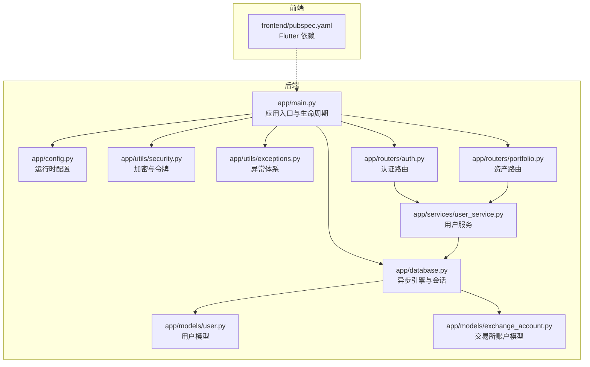
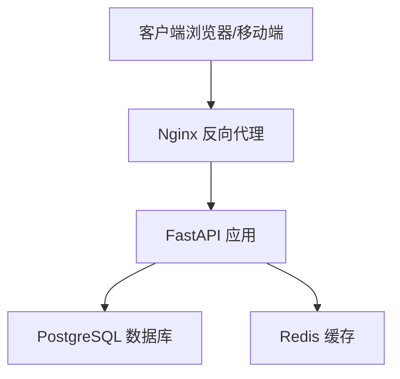
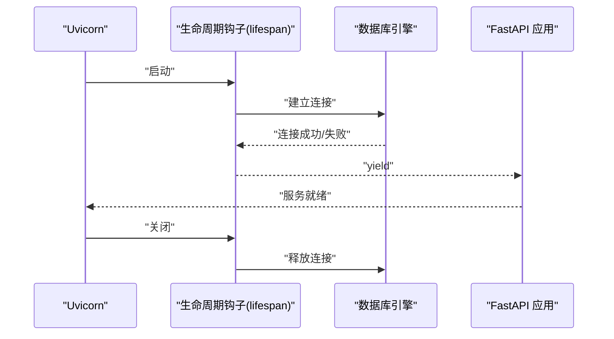
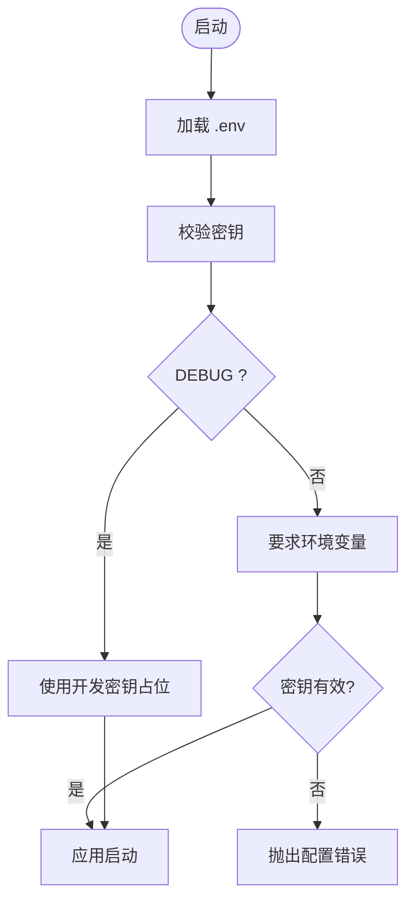
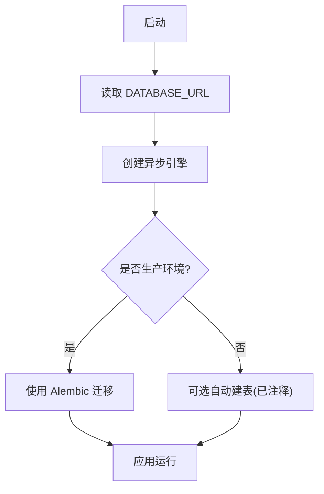
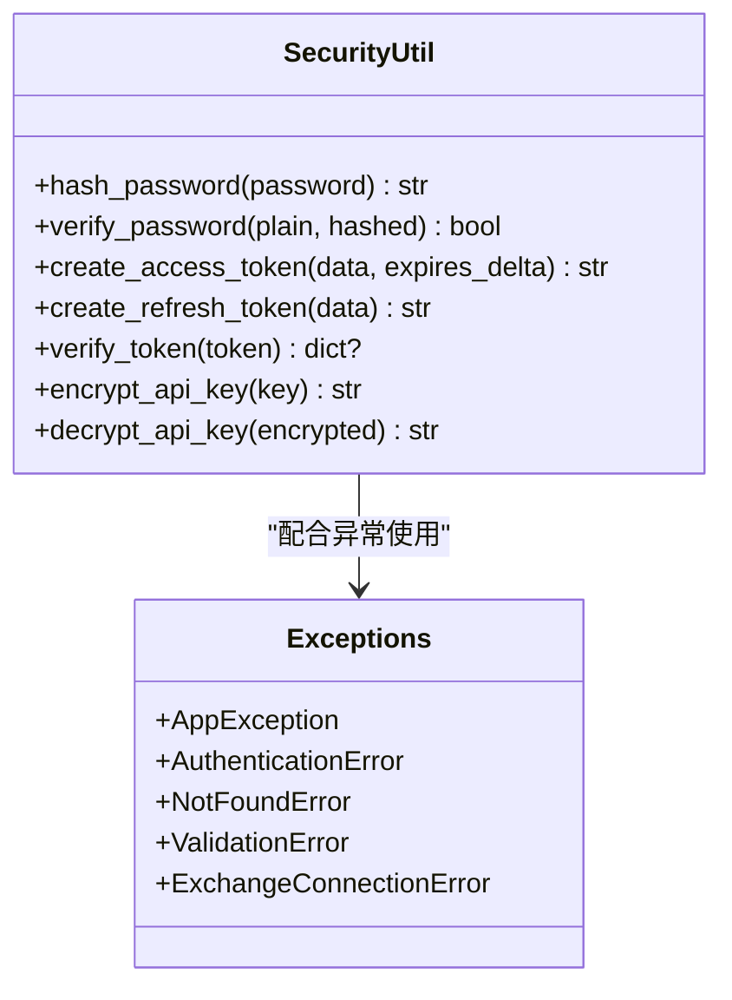
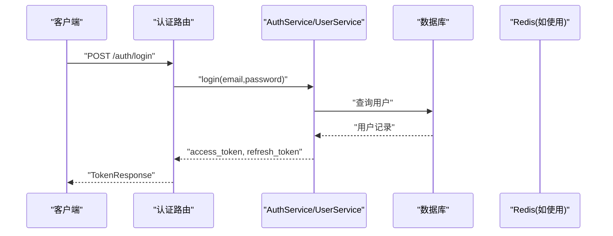
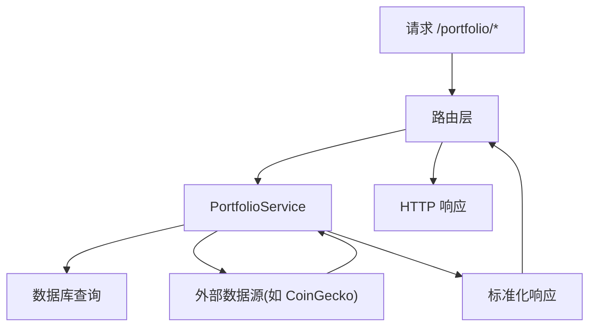
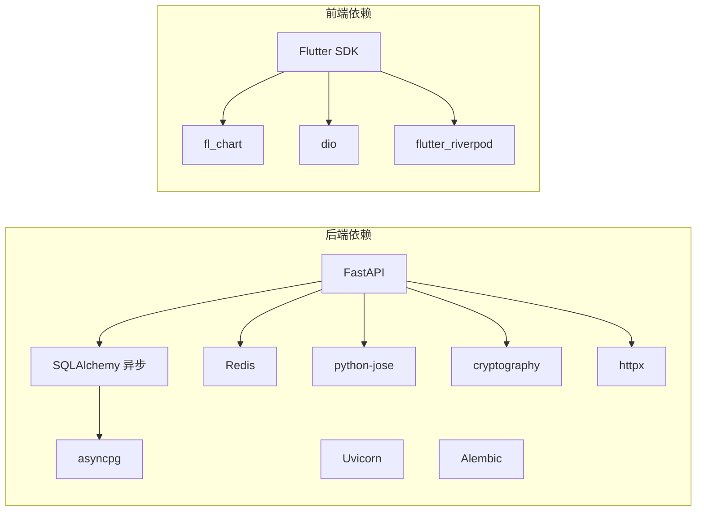

# 部署运维

<cite>
**本文引用的文件**
- [backend/app/main.py](file://backend/app/main.py)
- [backend/app/config.py](file://backend/app/config.py)
- [backend/app/database.py](file://backend/app/database.py)
- [backend/app/utils/security.py](file://backend/app/utils/security.py)
- [backend/app/utils/exceptions.py](file://backend/app/utils/exceptions.py)
- [backend/app/routers/auth.py](file://backend/app/routers/auth.py)
- [backend/app/routers/portfolio.py](file://backend/app/routers/portfolio.py)
- [backend/app/models/user.py](file://backend/app/models/user.py)
- [backend/app/models/exchange_account.py](file://backend/app/models/exchange_account.py)
- [backend/app/services/user_service.py](file://backend/app/services/user_service.py)
- [backend/requirements.txt](file://backend/requirements.txt)
- [backend/alembic.ini](file://backend/alembic.ini)
- [frontend/pubspec.yaml](file://frontend/pubspec.yaml)
</cite>

## 目录
1. [简介](#简介)
2. [项目结构](#项目结构)
3. [核心组件](#核心组件)
4. [架构总览](#架构总览)
5. [详细组件分析](#详细组件分析)
6. [依赖关系分析](#依赖关系分析)
7. [性能考量](#性能考量)
8. [故障排查指南](#故障排查指南)
9. [结论](#结论)
10. [附录](#附录)

## 简介
本指南面向生产环境部署与运维，围绕该资产聚合应用（后端基于 FastAPI + SQLAlchemy 异步 ORM，前端为 Flutter）给出系统化的部署与运维实践，涵盖：
- 生产环境部署流程：Docker 容器化、Nginx 反向代理与负载均衡
- CI/CD 流水线与自动化部署策略
- 监控与日志：APM、错误追踪与日志聚合
- 数据库与缓存：备份策略、Redis 持久化与灾难恢复
- 性能优化与扩展性
- 安全加固与合规
- 常见运维问题排查

## 项目结构
后端采用 FastAPI + 异步数据库访问，模块化组织路由、服务、模型与工具；前端为 Flutter 应用。整体结构清晰，便于容器化与微服务化演进。

图表来源
- [backend/app/main.py:1-131](file://backend/app/main.py#L1-L131)
- [backend/app/config.py:1-51](file://backend/app/config.py#L1-L51)
- [backend/app/database.py:1-33](file://backend/app/database.py#L1-L33)
- [backend/app/utils/security.py:1-97](file://backend/app/utils/security.py#L1-L97)
- [backend/app/utils/exceptions.py:1-67](file://backend/app/utils/exceptions.py#L1-L67)
- [backend/app/routers/auth.py:1-253](file://backend/app/routers/auth.py#L1-L253)
- [backend/app/routers/portfolio.py:1-217](file://backend/app/routers/portfolio.py#L1-L217)
- [backend/app/models/user.py:1-32](file://backend/app/models/user.py#L1-L32)
- [backend/app/models/exchange_account.py:1-32](file://backend/app/models/exchange_account.py#L1-L32)
- [backend/app/services/user_service.py:1-223](file://backend/app/services/user_service.py#L1-L223)
- [frontend/pubspec.yaml:1-53](file://frontend/pubspec.yaml#L1-L53)

章节来源
- [backend/app/main.py:1-131](file://backend/app/main.py#L1-L131)
- [backend/app/config.py:1-51](file://backend/app/config.py#L1-L51)
- [backend/app/database.py:1-33](file://backend/app/database.py#L1-L33)
- [frontend/pubspec.yaml:1-53](file://frontend/pubspec.yaml#L1-L53)

## 核心组件
- 应用入口与生命周期：定义 FastAPI 实例、CORS、全局异常处理、健康检查、路由注册与 Uvicorn 启动参数。
- 配置管理：集中于 Settings，支持 .env 文件加载，生产必须设置敏感密钥。
- 数据库与会话：异步 SQLAlchemy 引擎与会话工厂，支持调试输出。
- 安全与令牌：密码哈希、JWT 访问/刷新令牌生成与校验、API Key 加解密。
- 异常体系：统一错误响应格式，便于前端与监控系统消费。
- 路由与服务：认证与资产组合路由，服务层封装业务逻辑。
- 模型：用户与交易所账户模型，支持加密存储敏感信息。

章节来源
- [backend/app/main.py:13-131](file://backend/app/main.py#L13-L131)
- [backend/app/config.py:5-51](file://backend/app/config.py#L5-L51)
- [backend/app/database.py:6-33](file://backend/app/database.py#L6-L33)
- [backend/app/utils/security.py:18-97](file://backend/app/utils/security.py#L18-L97)
- [backend/app/utils/exceptions.py:4-67](file://backend/app/utils/exceptions.py#L4-L67)
- [backend/app/routers/auth.py:22-253](file://backend/app/routers/auth.py#L22-L253)
- [backend/app/routers/portfolio.py:26-217](file://backend/app/routers/portfolio.py#L26-L217)
- [backend/app/models/user.py:11-32](file://backend/app/models/user.py#L11-L32)
- [backend/app/models/exchange_account.py:11-32](file://backend/app/models/exchange_account.py#L11-L32)
- [backend/app/services/user_service.py:19-223](file://backend/app/services/user_service.py#L19-L223)

## 架构总览
后端为单体服务，通过 Nginx 提供反向代理与静态资源服务，FastAPI 承载 API 与健康检查；数据库与 Redis 分离部署；前端以 Flutter 构建产物作为静态资源由 Nginx 提供。

图表来源
- [backend/app/main.py:34-131](file://backend/app/main.py#L34-L131)
- [backend/app/config.py:11-16](file://backend/app/config.py#L11-L16)
- [backend/app/database.py:6-20](file://backend/app/database.py#L6-L20)

## 详细组件分析

### 应用生命周期与健康检查
- 生命周期钩子负责启动阶段数据库连接建立与关闭阶段连接释放。
- 健康检查端点用于容器编排与负载均衡探活。
- 开发模式下自动重载，生产禁用。

图表来源
- [backend/app/main.py:13-31](file://backend/app/main.py#L13-L31)
- [backend/app/database.py:6-20](file://backend/app/database.py#L6-L20)

章节来源
- [backend/app/main.py:13-31](file://backend/app/main.py#L13-L31)
- [backend/app/database.py:6-20](file://backend/app/database.py#L6-L20)

### 配置与密钥管理
- Settings 统一读取 .env，生产必须设置 JWT_SECRET_KEY 与 ENCRYPTION_KEY。
- DEBUG 为 False 时强制要求环境变量，否则抛出异常。
- CORS 在开发与生产分别从本地与环境变量注入。

图表来源
- [backend/app/config.py:32-44](file://backend/app/config.py#L32-L44)

章节来源
- [backend/app/config.py:5-51](file://backend/app/config.py#L5-L51)

### 数据库与迁移
- 使用异步 SQLAlchemy 引擎，Alembic 配置文件中定义了 SQLAlchemy URL 与日志级别。
- 运行时注释掉自动建表，建议生产使用 Alembic 进行迁移。

图表来源
- [backend/app/database.py:6-20](file://backend/app/database.py#L6-L20)
- [backend/alembic.ini:61](file://backend/alembic.ini#L61)

章节来源
- [backend/app/database.py:6-33](file://backend/app/database.py#L6-L33)
- [backend/alembic.ini:1-115](file://backend/alembic.ini#L1-L115)

### 安全与令牌
- 密码使用 bcrypt 哈希；JWT 使用 HS256，支持访问/刷新令牌。
- API Key 使用 AES-256-GCM 加密，HKDF 从密钥材料派生固定长度密钥。
- 异常统一包装，便于前端与监控系统识别。

图表来源
- [backend/app/utils/security.py:18-97](file://backend/app/utils/security.py#L18-L97)
- [backend/app/utils/exceptions.py:4-67](file://backend/app/utils/exceptions.py#L4-L67)

章节来源
- [backend/app/utils/security.py:18-97](file://backend/app/utils/security.py#L18-L97)
- [backend/app/utils/exceptions.py:4-67](file://backend/app/utils/exceptions.py#L4-L67)

### 认证与用户服务
- 支持邮箱注册登录、OAuth（Google、Apple），刷新令牌与登出。
- 用户服务提供资料查询、偏好与安全设置更新、全设备登出。

图表来源
- [backend/app/routers/auth.py:55-81](file://backend/app/routers/auth.py#L55-L81)
- [backend/app/services/user_service.py:19-223](file://backend/app/services/user_service.py#L19-L223)

章节来源
- [backend/app/routers/auth.py:22-253](file://backend/app/routers/auth.py#L22-L253)
- [backend/app/services/user_service.py:19-223](file://backend/app/services/user_service.py#L19-L223)

### 资产组合服务
- 提供概览、历史净值、持仓列表与已连数据源等接口。
- 服务层封装数据聚合与外部数据源交互。

图表来源
- [backend/app/routers/portfolio.py:29-177](file://backend/app/routers/portfolio.py#L29-L177)

章节来源
- [backend/app/routers/portfolio.py:26-217](file://backend/app/routers/portfolio.py#L26-L217)

## 依赖关系分析
- 后端依赖：FastAPI、Uvicorn、SQLAlchemy 异步、Alembic、asyncpg、Redis、JWT、加密库、HTTP 客户端等。
- 前端依赖：Flutter SDK、图表、网络、状态管理、路由等。

图表来源
- [backend/requirements.txt:1-15](file://backend/requirements.txt#L1-L15)
- [frontend/pubspec.yaml:9-28](file://frontend/pubspec.yaml#L9-L28)

章节来源
- [backend/requirements.txt:1-15](file://backend/requirements.txt#L1-L15)
- [frontend/pubspec.yaml:1-53](file://frontend/pubspec.yaml#L1-L53)

## 性能考量
- 数据库
  - 使用异步连接池与合适的超时配置，避免阻塞。
  - 对高频查询建立必要索引（如用户邮箱、交易所账户外键）。
  - 控制单次查询返回量，结合分页与缓存热点数据。
- 缓存
  - 利用 Redis 存储短期热点数据与会话，注意过期策略与内存淘汰。
- API
  - 合理设置访问/刷新令牌有效期，减少无效重试。
  - 对外部数据源调用增加超时与重试退避。
- 前端
  - 图表渲染按需加载，避免一次性渲染大量点位。
- 监控
  - 关键路径埋点与指标采集，结合 APM 与日志聚合定位瓶颈。

## 故障排查指南
- 启动失败
  - 检查 .env 中 JWT_SECRET_KEY 与 ENCRYPTION_KEY 是否设置。
  - 查看数据库连接字符串与网络可达性。
- 认证异常
  - 校验 JWT 密钥一致与算法配置；确认刷新令牌未被撤销。
- 数据库异常
  - 检查 Alembic 迁移状态与版本；核对连接池大小与超时。
- 外部服务调用失败
  - 核对外部 API 地址与鉴权；增加超时与重试。
- 日志与监控
  - 结合应用日志与 Nginx 访问日志定位问题；利用 APM 捕获异常堆栈。

章节来源
- [backend/app/config.py:32-44](file://backend/app/config.py#L32-L44)
- [backend/app/utils/exceptions.py:4-67](file://backend/app/utils/exceptions.py#L4-L67)

## 结论
本指南提供了从容器化部署到 CI/CD、监控日志、数据库与缓存策略、性能优化与安全加固的完整运维蓝图。建议在生产环境中严格区分配置与密钥管理，采用多实例与负载均衡，结合完善的备份与灾备方案，确保系统高可用与可维护性。

## 附录

### 生产环境部署清单
- Docker 镜像构建与制品管理
- Nginx 反向代理与 TLS 终止
- 负载均衡与健康检查
- 数据库与 Redis 的高可用与备份
- CI/CD 自动化流水线（构建、测试、打包、发布）
- 监控与日志：APM、错误追踪、日志聚合
- 安全基线：密钥轮换、最小权限、审计日志
- 灾难恢复：备份策略、RTO/RPO、演练

### 配置与密钥
- 必须设置的环境变量：DATABASE_URL、REDIS_URL、JWT_SECRET_KEY、ENCRYPTION_KEY、ALLOWED_ORIGINS。
- 生产环境禁止启用 DEBUG。

章节来源
- [backend/app/config.py:11-28](file://backend/app/config.py#L11-L28)
- [backend/app/config.py:32-44](file://backend/app/config.py#L32-L44)