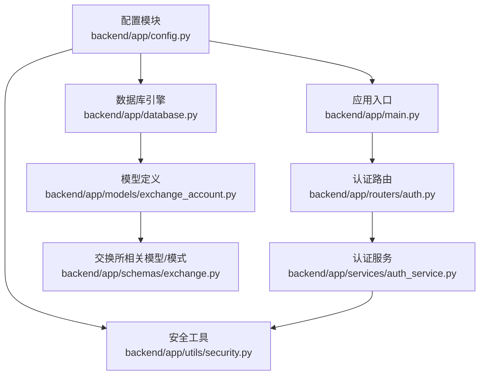
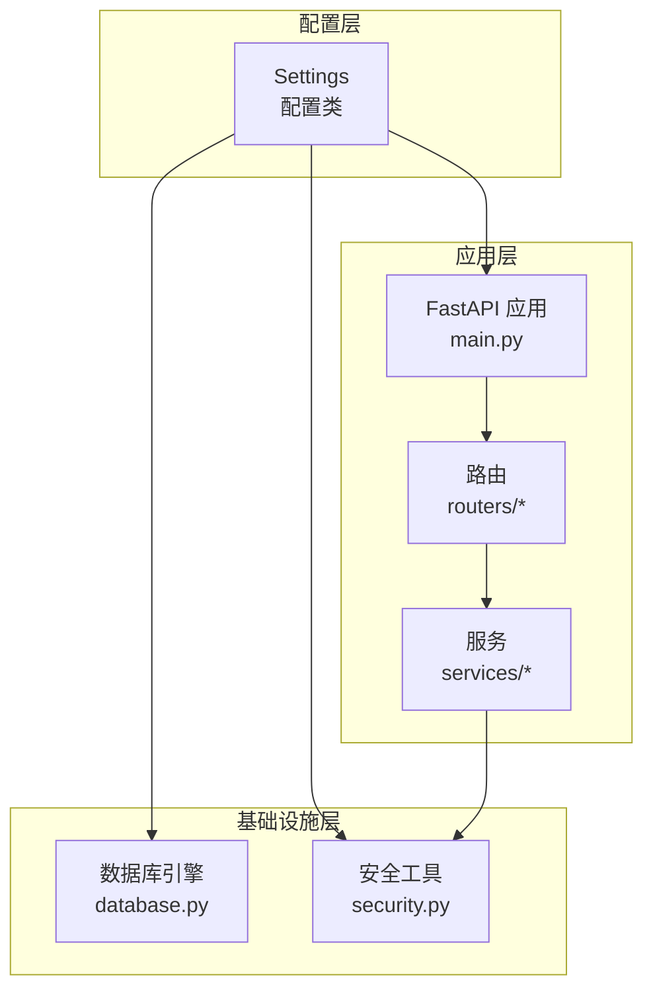
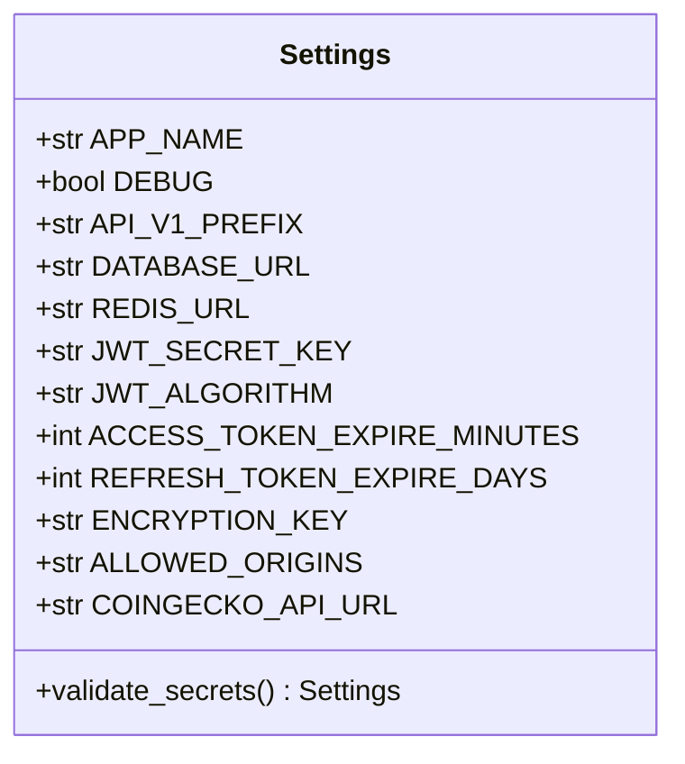
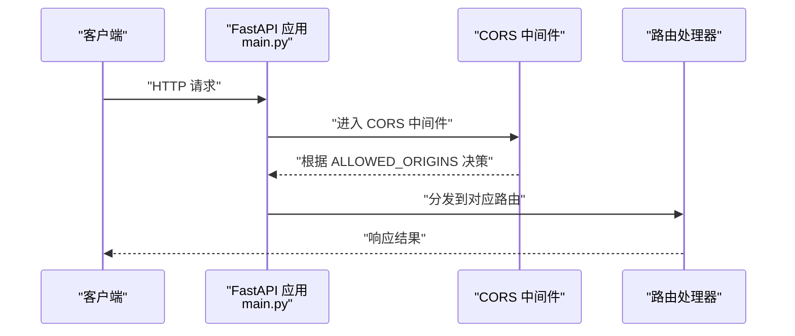
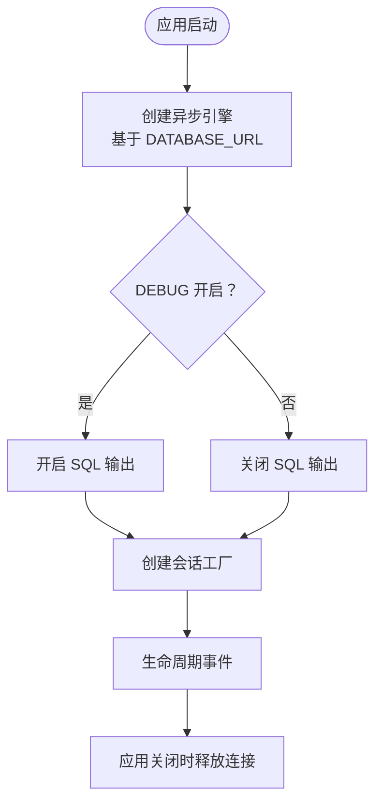
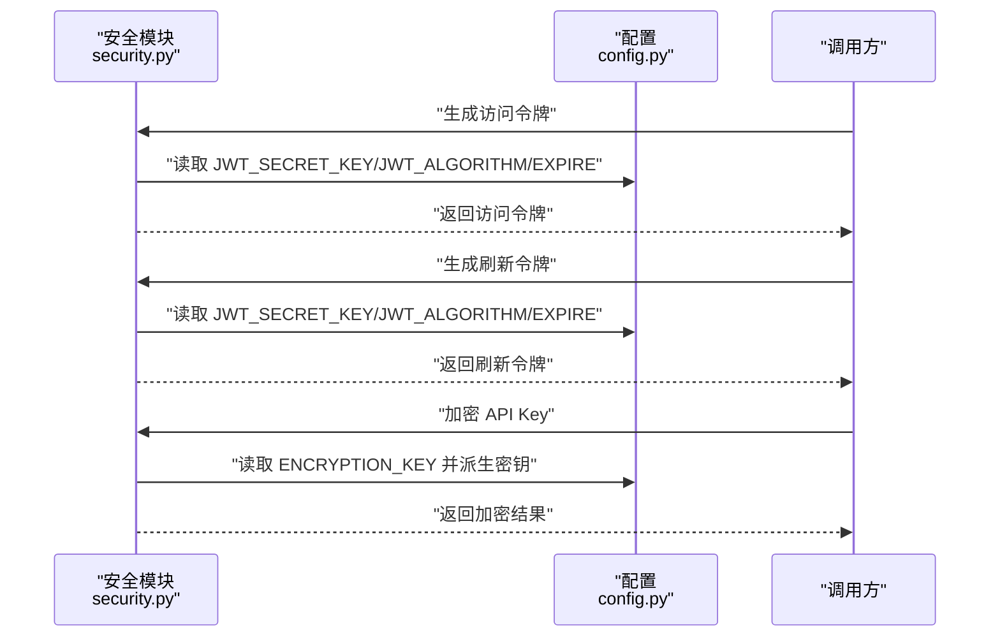
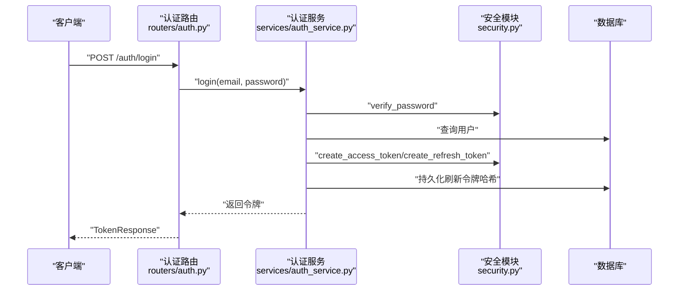
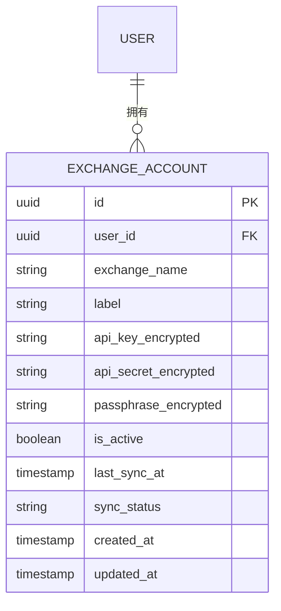
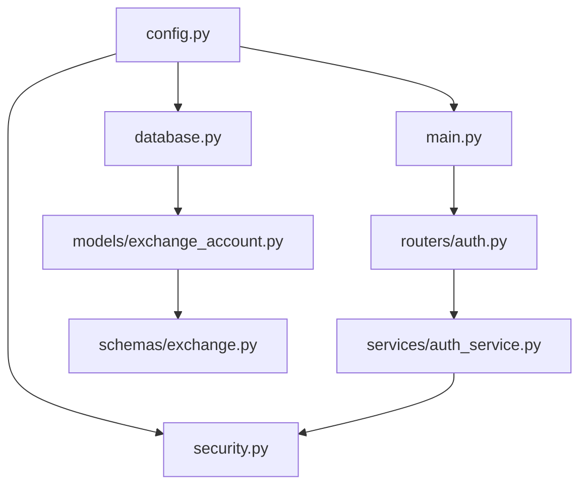

# 配置管理

<cite>
**本文引用的文件**
- [backend/app/config.py](file://backend/app/config.py)
- [backend/app/main.py](file://backend/app/main.py)
- [backend/app/database.py](file://backend/app/database.py)
- [backend/app/utils/security.py](file://backend/app/utils/security.py)
- [backend/app/routers/auth.py](file://backend/app/routers/auth.py)
- [backend/app/services/auth_service.py](file://backend/app/services/auth_service.py)
- [backend/app/models/exchange_account.py](file://backend/app/models/exchange_account.py)
- [backend/app/schemas/exchange.py](file://backend/app/schemas/exchange.py)
- [backend/requirements.txt](file://backend/requirements.txt)
</cite>

## 目录
1. [简介](#简介)
2. [项目结构](#项目结构)
3. [核心组件](#核心组件)
4. [架构总览](#架构总览)
5. [详细组件分析](#详细组件分析)
6. [依赖分析](#依赖分析)
7. [性能考虑](#性能考虑)
8. [故障排查指南](#故障排查指南)
9. [结论](#结论)
10. [附录](#附录)

## 简介
本文件系统性阐述后端配置管理的设计与使用方法，覆盖开发、测试与生产环境的差异化配置；数据库连接、Redis 缓存与第三方服务 API 密钥管理；安全配置（JWT 密钥、密码加密参数、CORS 设置）；Docker 容器化与部署环境变量最佳实践；配置热更新与配置验证规则；以及配置文件模板与敏感信息保护策略。目标是帮助开发者在不同环境中正确、安全地运行应用。

## 项目结构
后端采用 FastAPI + SQLAlchemy 异步 ORM 架构，配置集中于 settings 对象，通过 Pydantic Settings 的 BaseSettings 实现从环境变量加载与类型校验，并在启动时进行关键密钥的强制校验。

**图表来源**
- [backend/app/config.py:1-51](file://backend/app/config.py#L1-L51)
- [backend/app/main.py:1-131](file://backend/app/main.py#L1-L131)
- [backend/app/database.py:1-33](file://backend/app/database.py#L1-L33)
- [backend/app/utils/security.py:1-97](file://backend/app/utils/security.py#L1-L97)
- [backend/app/routers/auth.py:1-253](file://backend/app/routers/auth.py#L1-L253)
- [backend/app/services/auth_service.py:1-247](file://backend/app/services/auth_service.py#L1-L247)
- [backend/app/models/exchange_account.py:1-32](file://backend/app/models/exchange_account.py#L1-L32)
- [backend/app/schemas/exchange.py:1-150](file://backend/app/schemas/exchange.py#L1-L150)

**章节来源**
- [backend/app/config.py:1-51](file://backend/app/config.py#L1-L51)
- [backend/app/main.py:1-131](file://backend/app/main.py#L1-L131)
- [backend/app/database.py:1-33](file://backend/app/database.py#L1-L33)
- [backend/requirements.txt:1-15](file://backend/requirements.txt#L1-L15)

## 核心组件
- 配置类 Settings：集中定义应用名称、调试开关、API 前缀、数据库连接、Redis 连接、JWT 参数、加密密钥、CORS 允许来源、第三方服务地址等。通过模型校验器在运行时对敏感密钥进行强制校验，确保生产环境必须通过环境变量提供密钥。
- 应用入口 main：基于 settings 初始化 FastAPI 应用、注册中间件（CORS）、全局异常处理、健康检查端点，并按配置前缀挂载路由。
- 数据库模块 database：基于 settings.DATABASE_URL 创建异步引擎与会话工厂，支持 DEBUG 开关控制 SQL 输出。
- 安全模块 security：实现密码哈希/校验、JWT 访问/刷新令牌生成与校验、API Key 加解密（AES-256-GCM），密钥派生使用 HKDF。
- 路由与服务：认证路由与服务依赖安全模块与配置，完成用户注册、登录、令牌刷新、登出等流程。
- 模型与模式：交换所账户模型存储加密后的 API Key/Secret/Passphrase；交换所相关模式用于请求/响应数据校验。

**章节来源**
- [backend/app/config.py:5-48](file://backend/app/config.py#L5-L48)
- [backend/app/main.py:34-62](file://backend/app/main.py#L34-L62)
- [backend/app/database.py:7-20](file://backend/app/database.py#L7-L20)
- [backend/app/utils/security.py:14-97](file://backend/app/utils/security.py#L14-L97)
- [backend/app/routers/auth.py:25-206](file://backend/app/routers/auth.py#L25-L206)
- [backend/app/services/auth_service.py:20-202](file://backend/app/services/auth_service.py#L20-L202)
- [backend/app/models/exchange_account.py:11-28](file://backend/app/models/exchange_account.py#L11-L28)
- [backend/app/schemas/exchange.py:41-150](file://backend/app/schemas/exchange.py#L41-L150)

## 架构总览
下图展示配置在系统中的关键作用：Settings 作为单一真相源，被应用入口、数据库、安全工具、路由与服务模块消费；同时在启动阶段执行敏感密钥的强制校验。

**图表来源**
- [backend/app/config.py:5-48](file://backend/app/config.py#L5-L48)
- [backend/app/main.py:34-100](file://backend/app/main.py#L34-L100)
- [backend/app/database.py:7-20](file://backend/app/database.py#L7-L20)
- [backend/app/utils/security.py:28-58](file://backend/app/utils/security.py#L28-L58)
- [backend/app/routers/auth.py:25-206](file://backend/app/routers/auth.py#L25-L206)
- [backend/app/services/auth_service.py:180-202](file://backend/app/services/auth_service.py#L180-L202)

## 详细组件分析

### 配置类 Settings 设计与验证
- 关键配置项
  - 应用与调试：APP_NAME、DEBUG、API_V1_PREFIX
  - 数据库：DATABASE_URL
  - 缓存：REDIS_URL
  - JWT：JWT_SECRET_KEY、JWT_ALGORITHM、ACCESS_TOKEN_EXPIRE_MINUTES、REFRESH_TOKEN_EXPIRE_DAYS
  - 加密：ENCRYPTION_KEY（用于 API Key 加密）
  - CORS：ALLOWED_ORIGINS（字符串，逗号分隔）
  - 第三方服务：COINGECKO_API_URL
- 运行时校验
  - 若未设置 JWT_SECRET_KEY 或 ENCRYPTION_KEY，开发模式允许使用内置默认值；生产模式必须通过环境变量提供，否则抛出错误。
  - 配置文件来源：env_file 指向 .env 文件，便于本地开发加载。

**图表来源**
- [backend/app/config.py:5-48](file://backend/app/config.py#L5-L48)

**章节来源**
- [backend/app/config.py:5-48](file://backend/app/config.py#L5-L48)
- [backend/app/config.py:32-44](file://backend/app/config.py#L32-L44)

### 应用入口与 CORS 集成
- 应用初始化：读取 settings 初始化 FastAPI，设置标题、版本、文档路径与生命周期钩子。
- CORS 中间件：开发模式自动扩展允许来源列表；生产模式从 ALLOWED_ORIGINS 解析为数组。
- 全局异常处理：自定义异常与通用异常统一返回格式。
- 路由挂载：按 API_V1_PREFIX 前缀挂载认证、组合投资、交易所与用户路由。
- 健康检查：/health 返回应用状态。

**图表来源**
- [backend/app/main.py:34-100](file://backend/app/main.py#L34-L100)

**章节来源**
- [backend/app/main.py:34-100](file://backend/app/main.py#L34-L100)

### 数据库连接与调试输出
- 使用 settings.DATABASE_URL 创建异步引擎，开启 echo 取决于 DEBUG。
- 会话工厂 AsyncSessionLocal 提供异步会话依赖注入。
- 生命周期中进行连接建立与关闭。

**图表来源**
- [backend/app/database.py:7-20](file://backend/app/database.py#L7-L20)
- [backend/app/main.py:13-30](file://backend/app/main.py#L13-L30)

**章节来源**
- [backend/app/database.py:7-20](file://backend/app/database.py#L7-L20)
- [backend/app/main.py:13-30](file://backend/app/main.py#L13-L30)

### 安全配置与密钥管理
- JWT
  - 访问令牌与刷新令牌的生成与校验依赖 JWT_SECRET_KEY 与 JWT_ALGORITHM。
  - 访问令牌过期时间来自 ACCESS_TOKEN_EXPIRE_MINUTES；刷新令牌过期时间来自 REFRESH_TOKEN_EXPIRE_DAYS。
- 密码加密
  - 使用 bcrypt 进行密码哈希与校验。
- API Key 加密
  - 使用 AES-256-GCM 对第三方 API Key/Secret/Passphrase 进行加解密。
  - 密钥派生：从 ENCRYPTION_KEY 派生固定长度密钥，确保一致性与安全性。
- CORS
  - 开发模式扩展允许来源；生产模式严格受 ALLOWED_ORIGINS 控制。

**图表来源**
- [backend/app/utils/security.py:28-58](file://backend/app/utils/security.py#L28-L58)
- [backend/app/utils/security.py:78-96](file://backend/app/utils/security.py#L78-L96)
- [backend/app/config.py:17-27](file://backend/app/config.py#L17-L27)

**章节来源**
- [backend/app/utils/security.py:14-97](file://backend/app/utils/security.py#L14-L97)
- [backend/app/config.py:17-27](file://backend/app/config.py#L17-L27)

### 认证流程与配置集成
- 注册/登录：服务层调用安全模块进行密码哈希与令牌生成，写入数据库并持久化刷新令牌哈希。
- 刷新令牌：校验刷新令牌类型与有效性，执行令牌轮换。
- OAuth 登录：验证外部 ID Token 后创建或更新用户并发放令牌。

**图表来源**
- [backend/app/routers/auth.py:55-80](file://backend/app/routers/auth.py#L55-L80)
- [backend/app/services/auth_service.py:67-97](file://backend/app/services/auth_service.py#L67-L97)
- [backend/app/utils/security.py:28-49](file://backend/app/utils/security.py#L28-L49)

**章节来源**
- [backend/app/routers/auth.py:55-80](file://backend/app/routers/auth.py#L55-L80)
- [backend/app/services/auth_service.py:67-97](file://backend/app/services/auth_service.py#L67-L97)
- [backend/app/utils/security.py:28-49](file://backend/app/utils/security.py#L28-L49)

### 交换所账户与敏感信息存储
- 模型字段：保存加密后的 API Key、Secret、Passphrase，便于后续同步与使用。
- 模式定义：用于连接、断开、同步状态等请求/响应的数据校验。

**图表来源**
- [backend/app/models/exchange_account.py:11-28](file://backend/app/models/exchange_account.py#L11-L28)
- [backend/app/schemas/exchange.py:41-150](file://backend/app/schemas/exchange.py#L41-L150)

**章节来源**
- [backend/app/models/exchange_account.py:11-28](file://backend/app/models/exchange_account.py#L11-L28)
- [backend/app/schemas/exchange.py:41-150](file://backend/app/schemas/exchange.py#L41-L150)

## 依赖分析
- 配置依赖：所有模块通过 settings 统一读取配置，耦合度低、可维护性强。
- 外部依赖：FastAPI、SQLAlchemy、Pydantic Settings、Redis、JWT、Cryptography、Passlib 等。
- 关键依赖链：main → config → database/security；routers → services → security；models/schemas 与 database 协作。

**图表来源**
- [backend/app/config.py:5-48](file://backend/app/config.py#L5-L48)
- [backend/app/main.py:34-100](file://backend/app/main.py#L34-L100)
- [backend/app/database.py:7-20](file://backend/app/database.py#L7-L20)
- [backend/app/utils/security.py:28-58](file://backend/app/utils/security.py#L28-L58)
- [backend/app/routers/auth.py:25-206](file://backend/app/routers/auth.py#L25-L206)
- [backend/app/services/auth_service.py:180-202](file://backend/app/services/auth_service.py#L180-L202)
- [backend/app/models/exchange_account.py:11-28](file://backend/app/models/exchange_account.py#L11-L28)
- [backend/app/schemas/exchange.py:41-150](file://backend/app/schemas/exchange.py#L41-L150)

**章节来源**
- [backend/requirements.txt:1-15](file://backend/requirements.txt#L1-L15)

## 性能考虑
- 数据库
  - 异步引擎与会话工厂提升并发性能；DEBUG 下开启 echo 便于开发调试，生产应关闭以减少日志开销。
- 缓存
  - Redis 连接配置预留，建议在生产中启用并配合连接池与超时设置。
- JWT
  - 生产环境务必使用强随机密钥，避免短生命周期令牌带来的频繁刷新压力。
- 加密
  - API Key 加解密使用 AES-256-GCM，HKDF 派生密钥保证一致性；注意密钥轮换与安全存储。

[本节为通用指导，无需特定文件引用]

## 故障排查指南
- JWT 密钥缺失
  - 现象：生产环境启动时报错提示必须通过环境变量设置 JWT_SECRET_KEY。
  - 排查：确认环境变量是否正确设置；开发模式可接受默认值但不适用于生产。
- 加密密钥缺失
  - 现象：生产环境启动时报错提示必须通过环境变量设置 ENCRYPTION_KEY。
  - 排查：确保提供 32 字节密钥材料并通过 HKDF 派生固定长度密钥。
- CORS 问题
  - 现象：跨域请求失败。
  - 排查：开发模式自动扩展允许来源；生产模式需正确设置 ALLOWED_ORIGINS。
- 数据库连接失败
  - 现象：启动阶段打印连接失败。
  - 排查：核对 DATABASE_URL、网络连通性与数据库凭据。

**章节来源**
- [backend/app/config.py:32-44](file://backend/app/config.py#L32-L44)
- [backend/app/main.py:44-62](file://backend/app/main.py#L44-L62)
- [backend/app/database.py:7-11](file://backend/app/database.py#L7-L11)

## 结论
该配置体系以 Settings 为核心，结合 Pydantic Settings 的类型校验与运行时强制校验，确保在开发、测试与生产环境的一致性与安全性。通过明确的敏感信息保护策略（JWT 与 API Key 加解密）、严格的 CORS 控制与数据库异步引擎，系统具备良好的可运维性与扩展性。建议在生产中严格遵循环境变量管理与密钥轮换策略，并结合容器编排与密钥管理服务进一步强化安全。

[本节为总结，无需特定文件引用]

## 附录

### 环境变量配置清单（按环境）
- 开发环境
  - APP_NAME、DEBUG=true、API_V1_PREFIX、DATABASE_URL、REDIS_URL、JWT_SECRET_KEY（可使用内置默认值）、ENCRYPTION_KEY（可使用内置默认值）、ALLOWED_ORIGINS（可为空或默认值）、COINGECKO_API_URL
- 测试环境
  - 与开发类似，但使用独立的 DATABASE_URL 与 REDIS_URL，JWT 与 ENCRYPTION_KEY 必须通过环境变量提供
- 生产环境
  - 所有敏感配置（JWT_SECRET_KEY、ENCRYPTION_KEY、DATABASE_URL、REDIS_URL）必须通过环境变量提供，DEBUG=false，ALLOWED_ORIGINS 明确限定来源

[本节为概念性内容，无需特定文件引用]

### Docker 容器化与部署最佳实践
- 使用环境变量注入配置，避免将敏感信息写入镜像
- 将密钥与证书置于只读挂载目录，限制权限
- 在编排层使用密文配置与密钥管理服务（如云厂商 KMS 或 Vault）
- 分离日志与指标采集，生产关闭 SQL echo
- 为数据库与缓存服务使用独立网络与资源限制

[本节为概念性内容，无需特定文件引用]

### 配置热更新机制与验证规则
- 现状
  - 配置在应用启动时一次性加载并校验，运行期间不会自动重新读取
- 建议
  - 对非敏感配置（如日志级别、功能开关）可在运行时通过外部配置中心拉取并缓存
  - 对敏感配置（密钥、数据库凭据）不建议热更新，变更时重启应用并进行滚动升级
  - 引入配置校验器在每次变更后执行最小化验证集

[本节为概念性内容，无需特定文件引用]

### 配置文件模板与敏感信息保护策略
- 配置文件模板（示例键位）
  - APP_NAME、DEBUG、API_V1_PREFIX、DATABASE_URL、REDIS_URL、JWT_SECRET_KEY、JWT_ALGORITHM、ACCESS_TOKEN_EXPIRE_MINUTES、REFRESH_TOKEN_EXPIRE_DAYS、ENCRYPTION_KEY、ALLOWED_ORIGINS、COINGECKO_API_URL
- 敏感信息保护
  - 使用强随机密钥并定期轮换
  - API Key/Secret/Passphrase 存储前必须加密，仅在内存中解密用于调用
  - 限制密钥文件权限，避免明文泄露

[本节为概念性内容，无需特定文件引用]