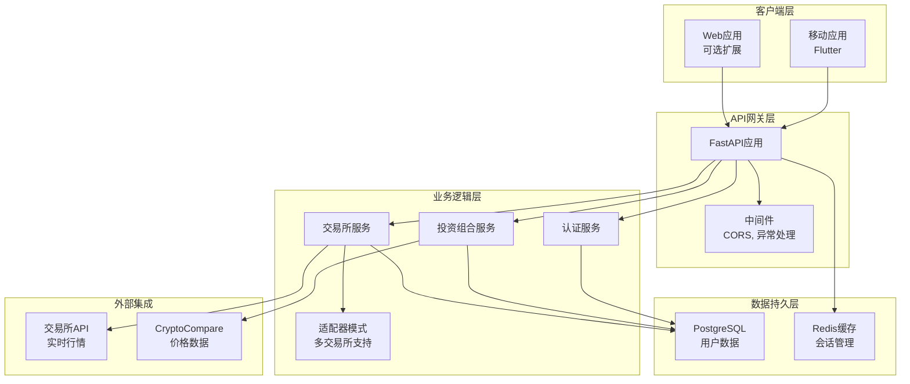
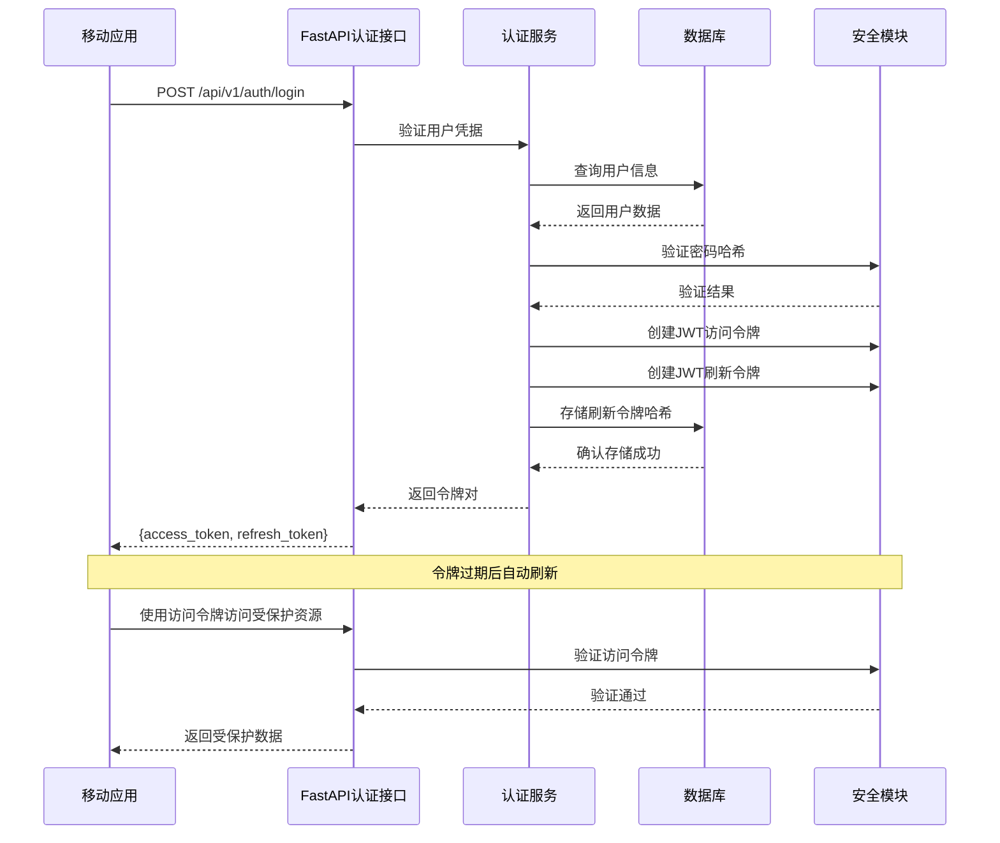
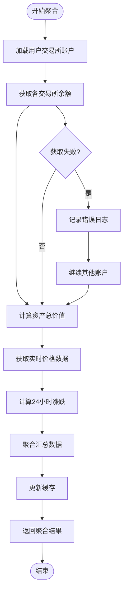
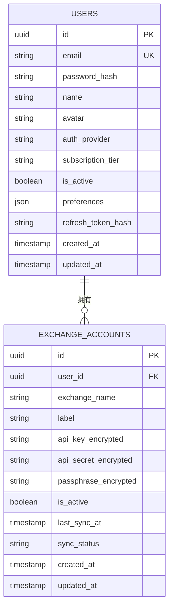
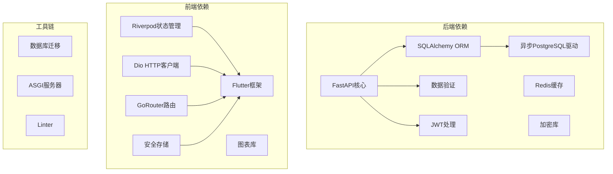

# 项目概述

<cite>
**本文档引用的文件**
- [backend/app/main.py](file://backend/app/main.py)
- [backend/app/config.py](file://backend/app/config.py)
- [backend/requirements.txt](file://backend/requirements.txt)
- [backend/app/database.py](file://backend/app/database.py)
- [backend/app/models/user.py](file://backend/app/models/user.py)
- [backend/app/models/exchange_account.py](file://backend/app/models/exchange_account.py)
- [backend/app/routers/auth.py](file://backend/app/routers/auth.py)
- [backend/app/routers/portfolio.py](file://backend/app/routers/portfolio.py)
- [backend/app/routers/exchanges.py](file://backend/app/routers/exchanges.py)
- [backend/app/services/exchange_adapters/base.py](file://backend/app/services/exchange_adapters/base.py)
- [backend/app/utils/security.py](file://backend/app/utils/security.py)
- [frontend/lib/main.dart](file://frontend/lib/main.dart)
- [frontend/lib/app/router.dart](file://frontend/lib/app/router.dart)
- [frontend/lib/core/api/api_client.dart](file://frontend/lib/core/api/api_client.dart)
- [frontend/lib/features/auth/auth_provider.dart](file://frontend/lib/features/auth/auth_provider.dart)
- [frontend/pubspec.yaml](file://frontend/pubspec.yaml)
</cite>

## 目录
1. [简介](#简介)
2. [项目结构](#项目结构)
3. [核心组件](#核心组件)
4. [架构总览](#架构总览)
5. [详细组件分析](#详细组件分析)
6. [依赖分析](#依赖分析)
7. [性能考虑](#性能考虑)
8. [故障排除指南](#故障排除指南)
9. [结论](#结论)
10. [附录](#附录)

## 简介
本项目是一个多交易所加密货币资产聚合管理系统，旨在为用户提供统一的资产管理体验。通过整合来自不同交易所和钱包的数据，系统能够实现：
- 统一资产管理：在一个界面中查看和管理分散在多个平台的资产
- 实时监控：跟踪资产价值变化和收益表现
- 安全存储：保护用户的API密钥和敏感信息
- 多样化接入：支持主流交易所的API连接和数据同步

项目采用前后端分离架构，后端基于FastAPI构建RESTful API服务，前端使用Flutter开发跨平台移动应用。这种技术组合确保了高性能的后端处理能力和优秀的用户体验。

## 项目结构
项目采用清晰的分层架构设计，分为后端API服务和前端移动应用两个主要部分：

```mermaid
graph TB
subgraph "后端服务 (FastAPI)"
A[app/main.py] --> B[配置管理]
A --> C[数据库连接]
A --> D[路由定义]
D --> E[认证路由]
D --> F[投资组合路由]
D --> G[交易所路由]
H[models/] --> I[用户模型]
H --> J[交易所账户模型]
K[services/] --> L[认证服务]
K --> M[投资组合服务]
K --> N[交易所服务]
O[routers/] --> E
O --> F
O --> G
end
subgraph "前端应用 (Flutter)"
P[lib/main.dart] --> Q[应用入口]
P --> R[路由配置]
S[features/] --> T[认证模块]
S --> U[仪表板模块]
S --> V[交易所模块]
W[core/] --> X[API客户端]
W --> Y[主题配置]
R --> Z[导航管理]
end
A < --> P
```

**图表来源**
- [backend/app/main.py:1-131](file://backend/app/main.py#L1-L131)
- [frontend/lib/main.dart:1-86](file://frontend/lib/main.dart#L1-L86)

**章节来源**
- [backend/app/main.py:1-131](file://backend/app/main.py#L1-L131)
- [frontend/lib/main.dart:1-86](file://frontend/lib/main.dart#L1-L86)

## 核心组件
系统的核心组件围绕资产管理的完整生命周期构建，包括用户认证、资产聚合、数据同步和安全存储等功能模块。

### 后端核心组件
- **FastAPI应用实例**：提供RESTful API服务，支持异步处理和自动文档生成
- **数据库层**：基于SQLAlchemy ORM，支持PostgreSQL数据库连接
- **认证系统**：JWT令牌管理，支持邮箱密码和OAuth登录方式
- **资产聚合引擎**：统一处理来自不同交易所的数据，计算总资产价值
- **安全模块**：API密钥加密存储，密码哈希处理

### 前端核心组件
- **路由系统**：基于GoRouter的导航管理，支持底部导航和页面跳转
- **状态管理**：使用Riverpod进行响应式状态管理
- **API客户端**：封装Dio HTTP客户端，处理请求拦截和错误处理
- **认证管理**：本地存储JWT令牌，支持自动刷新机制
- **UI组件**：Material Design主题，支持深色模式

**章节来源**
- [backend/app/main.py:34-42](file://backend/app/main.py#L34-L42)
- [frontend/lib/app/router.dart:88-202](file://frontend/lib/app/router.dart#L88-L202)

## 架构总览
系统采用现代微服务架构，前后端分离的设计确保了良好的可维护性和扩展性：



**图表来源**
- [backend/app/main.py:94-100](file://backend/app/main.py#L94-L100)
- [backend/app/config.py:11-15](file://backend/app/config.py#L11-L15)
- [backend/app/services/exchange_adapters/base.py:5-73](file://backend/app/services/exchange_adapters/base.py#L5-L73)

### 技术选型说明
**为什么选择FastAPI + Flutter组合？**

1. **后端技术优势 (FastAPI)**
   - **高性能**：基于Starlette和Pydantic，异步I/O处理，适合高并发场景
   - **类型安全**：自动数据验证和序列化，减少运行时错误
   - **自动生成文档**：OpenAPI规范自动生成交互式API文档
   - **现代化特性**：支持依赖注入、异常处理器、生命周期管理

2. **前端技术优势 (Flutter)**
   - **跨平台一致性**：一套代码同时支持iOS和Android平台
   - **高性能渲染**：直接编译为机器码，性能接近原生应用
   - **丰富的生态系统**：大量成熟的第三方包和插件
   - **热重载开发**：快速迭代和调试体验

3. **架构契合度**
   - **RESTful API**：与Flutter的HTTP客户端完美配合
   - **状态管理**：Riverpod提供清晰的状态管理模式
   - **安全存储**：Flutter Secure Storage确保敏感信息安全

**章节来源**
- [backend/requirements.txt:1-15](file://backend/requirements.txt#L1-L15)
- [frontend/pubspec.yaml:9-27](file://frontend/pubspec.yaml#L9-L27)

## 详细组件分析

### 认证系统架构
认证系统采用JWT令牌机制，支持多种登录方式和安全的令牌管理：



**图表来源**
- [backend/app/routers/auth.py:55-80](file://backend/app/routers/auth.py#L55-L80)
- [backend/app/utils/security.py:26-47](file://backend/app/utils/security.py#L26-L47)
- [frontend/lib/core/api/api_client.dart:123-159](file://frontend/lib/core/api/api_client.dart#L123-L159)

### 资产聚合流程
系统通过统一的服务层聚合来自不同交易所的数据，提供一致的资产视图：



**图表来源**
- [backend/app/routers/portfolio.py:33-59](file://backend/app/routers/portfolio.py#L33-L59)
- [backend/app/routers/portfolio.py:107-138](file://backend/app/routers/portfolio.py#L107-L138)

### 数据模型设计
系统采用关系型数据库设计，支持用户、交易所账户等核心实体：



**图表来源**
- [backend/app/models/user.py:11-32](file://backend/app/models/user.py#L11-L32)
- [backend/app/models/exchange_account.py:11-32](file://backend/app/models/exchange_account.py#L11-L32)

**章节来源**
- [backend/app/models/user.py:11-32](file://backend/app/models/user.py#L11-L32)
- [backend/app/models/exchange_account.py:11-32](file://backend/app/models/exchange_account.py#L11-L32)

## 依赖分析
系统的关键依赖关系体现了清晰的分层架构和职责分离：



**图表来源**
- [backend/requirements.txt:1-15](file://backend/requirements.txt#L1-L15)
- [frontend/pubspec.yaml:9-27](file://frontend/pubspec.yaml#L9-L27)

### 关键服务类关系
```mermaid
classDiagram
class ExchangeAdapter {
<<abstract>>
+verify_connection(api_key, api_secret, passphrase) bool
+get_spot_balance(api_key, api_secret, passphrase) list
+get_futures_balance(api_key, api_secret, passphrase) list
+exchange_name str
}
class AuthService {
+register(email, password, name) User
+login(email, password) User
+refresh_token(refresh_token) str
+create_oauth_user(email, name, provider, provider_id) User
+logout(user_id) void
}
class PortfolioService {
+get_portfolio_summary(user) dict
+get_portfolio_history(user, period) dict
+get_holdings(user) dict
+get_connected_sources(user) dict
}
class ExchangeService {
+get_supported_exchanges() list
+connect_exchange(user_id, exchange_id, label, api_key, api_secret, passphrase) dict
+disconnect_exchange(user_id, exchange_id) dict
+trigger_sync(user_id, exchange_id) dict
+get_exchange_status(user_id, exchange_id) dict
}
ExchangeAdapter <|-- MockAdapter {
+verify_connection() bool
+get_spot_balance() list
+get_futures_balance() list
}
AuthService --> User : "管理"
PortfolioService --> User : "查询"
ExchangeService --> User : "关联"
```

**图表来源**
- [backend/app/services/exchange_adapters/base.py:5-73](file://backend/app/services/exchange_adapters/base.py#L5-L73)
- [backend/app/models/user.py:11-32](file://backend/app/models/user.py#L11-L32)

**章节来源**
- [backend/app/services/exchange_adapters/base.py:5-73](file://backend/app/services/exchange_adapters/base.py#L5-L73)
- [backend/app/routers/auth.py:25-52](file://backend/app/routers/auth.py#L25-L52)

## 性能考虑
系统在设计时充分考虑了性能优化和可扩展性：

### 后端性能优化
- **异步数据库操作**：使用SQLAlchemy异步引擎，避免阻塞I/O
- **连接池管理**：合理配置数据库连接池，提高并发处理能力
- **缓存策略**：Redis缓存常用查询结果，减少数据库压力
- **API限流**：实施合理的请求频率限制，防止滥用

### 前端性能优化
- **状态局部化**：Riverpod提供细粒度的状态更新，避免不必要的重建
- **懒加载**：按需加载页面和数据，提升初始启动速度
- **图片缓存**：使用缓存网络图片，减少重复下载
- **内存管理**：及时清理不再使用的对象和监听器

### 数据同步策略
- **增量更新**：只同步发生变化的数据，减少网络传输
- **批量处理**：合并多个交易所的请求，降低API调用次数
- **错误重试**：实现指数退避的重试机制，提高成功率

## 故障排除指南
系统提供了完善的错误处理和诊断机制：

### 常见问题及解决方案
1. **认证失败**
   - 检查JWT密钥配置是否正确
   - 验证用户凭据是否有效
   - 确认刷新令牌是否过期

2. **数据库连接问题**
   - 检查DATABASE_URL配置
   - 验证PostgreSQL服务状态
   - 查看连接池配置参数

3. **API密钥加密问题**
   - 确认ENCRYPTION_KEY长度为32字节
   - 检查AES-256-GCM算法支持
   - 验证密钥派生过程

4. **前端路由问题**
   - 检查GoRouter配置
   - 验证认证状态检查逻辑
   - 确认页面权限控制

**章节来源**
- [backend/app/utils/security.py:59-87](file://backend/app/utils/security.py#L59-L87)
- [frontend/lib/core/api/api_client.dart:94-121](file://frontend/lib/core/api/api_client.dart#L94-L121)

## 结论
资产聚集app项目通过精心设计的技术架构和功能模块，为用户提供了完整的多交易所资产管理解决方案。系统采用FastAPI + Flutter的现代化技术栈，既保证了后端的高性能处理能力，又确保了前端的优秀用户体验。

### 项目优势
- **技术先进性**：采用最新的异步编程和响应式状态管理
- **安全性强**：完善的令牌管理和API密钥加密机制
- **扩展性强**：模块化的架构设计便于功能扩展
- **用户体验佳**：跨平台一致的界面和流畅的交互体验

### 发展前景
随着加密货币市场的不断发展，该系统具备良好的扩展空间，可以进一步集成更多交易所、支持去中心化钱包、增加高级分析功能等。通过持续优化性能和增强功能，该项目有望成为资产管理领域的优秀解决方案。

## 附录

### API端点概览
系统提供完整的RESTful API接口，涵盖认证、投资组合管理和交易所连接等功能：

- **认证相关**：`/api/v1/auth/register`, `/api/v1/auth/login`, `/api/v1/auth/refresh`
- **投资组合**：`/api/v1/portfolio/summary`, `/api/v1/portfolio/history`, `/api/v1/portfolio/holdings`
- **交易所**：`/api/v1/exchanges/connect`, `/api/v1/exchanges/connected`, `/api/v1/exchanges/{id}/sync`

### 配置选项
系统支持灵活的配置管理，包括数据库连接、JWT设置、加密密钥等关键参数。所有配置都通过环境变量管理，确保在不同环境中的一致性。